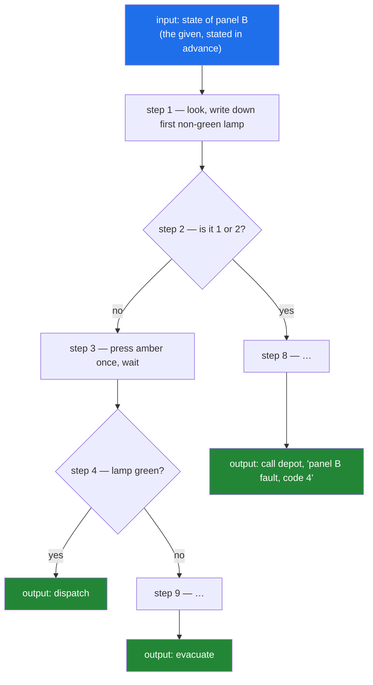

# 1.1 — What an algorithm actually is (and what it is not)

## 1. The one-line answer

An algorithm is a finite list of unambiguous steps that anyone — or anything — can follow
without judgement and still get the right answer every time.

---

## 2. The story

It is 1:40 in the morning at Kashmere Gate, and the platform doors on the northbound side will
not close.

Ravi has been a night technician for eleven days. The train is standing with its own doors open,
the driver is watching him through the cab glass, and somewhere behind him a display is counting
up the delay in red. The man who knows this system, Devraj, is asleep in Rohini and will not be
reachable for four hours.

On the wall beside the equipment cabinet there is a laminated card. Devraj wrote it two years
ago, after a night much like this one. It is titled **IF THE PLATFORM DOORS DO NOT CLOSE**, and
it has eleven numbered steps.

Ravi reads step one. *Look at the indicator lamps on panel B, top row, left to right. Write down
the position of the first lamp that is not green.* He does. It is the fourth. Step two says:
*If the number you wrote is 1 or 2, go to step 8. Otherwise continue.* He continues. Step three
tells him to open the cabinet and press the amber reset button once — once, not twice — and wait
until the lamp stops blinking. Step four asks whether the lamp is now green, and sends him to
step five or step nine depending on the answer.

At no point does the card ask Ravi what he thinks. It does not say "check whether the doors seem
alright". It does not say "reset the panel a few times". Every step is something he can actually
do at 1:40 in the morning with a driver staring at him — look, write, press, wait, compare — and
after every step there is exactly one place to go next. The card ends. Two of the endings are
*doors close, dispatch the train*; one is *evacuate the platform*; one is *call the depot on
extension 22 and say the words "panel B fault, code 4"*.

There is one line on the card that Devraj added later, at the bottom, in pen. It says: *if
something feels wrong, use your judgement.*

That line is the reason Ravi is standing here reading the card instead of having fixed it four
minutes ago. He is eleven days old on this job. He has no judgement about platform doors. He has
exactly what the card gives him, and the card is worth something precisely because everything
above that pen line assumed he had nothing.

---

## 3. The idea in plain language

The laminated card is an **algorithm**. The pen line at the bottom is not.

Everything above it has five properties, and these five are the whole definition:

- **Input.** The card starts from something given: the state of the lamps on panel B. An
  algorithm always begins from a stated input, and the statement of what counts as valid input
  is part of the algorithm, not an afterthought.
- **Definiteness.** Every step means exactly one thing. *Press the amber button once* is
  definite. *Reset the panel a few times* is not. This is the property Ravi is relying on, and
  it is the one the pen line destroys.
- **Effectiveness.** Every step is something the executor can actually perform. *Look at the
  lamps* is effective for a human in front of the panel. *Determine whether this program halts
  on every input* is not effective for anyone, ever, and a procedure containing that step is
  not an algorithm no matter how clearly it is written.
- **Finiteness.** The card ends. Not "usually ends" — for every valid input, following it leads
  to an ending after a bounded number of steps. A procedure that can loop forever on some input
  is not an algorithm on that input.
- **Output.** The card produces one of four defined results. Something comes out, and what comes
  out is specified in advance.

And then, separately from all five, the thing that makes it *this* card rather than any old
card: **correctness**. Following it either fixes the doors or correctly routes the problem to
someone who can. Correctness is not one of the five properties — a procedure can be perfectly
definite, effective, finite and still be wrong. Correctness is a claim you have to *prove*, and
proving it is what Day 2 is about.

The distinction that costs people interviews lives here too. "The doors should close" is a
**specification** — a statement of what must be true at the end. "Press the amber button once,
then check the lamp" is an **algorithm** — a procedure for making it true. A specification tells
you when you are done. An algorithm tells you what to do. They are not the same object and one
does not automatically produce the other.

> **Formally:** an algorithm is a finite sequence of definite, effective steps which, for every
> valid input, terminates and produces the specified output. Correctness — that the output is in
> fact the specified one — is a separate claim requiring separate proof.

---

## 4. Where this actually shows up

- **The PostgreSQL query planner.** You hand PostgreSQL `SELECT … WHERE …` — that is a pure
  specification. You have said what must be true of the rows that come back and nothing at all
  about how to find them. The planner's entire job is converting that specification into an
  algorithm: sequential scan or index scan, hash join or merge join, this table on the outside
  or that one. The same specification has thousands of valid procedures with costs differing by
  a factor of ten thousand, which is the reason the planner is one of the most heavily engineered
  parts of the system.

- **Linux TCP congestion control (CUBIC).** Every connection your machine opens runs a procedure
  defined in RFC 8312, executed by a kernel with no judgement whatsoever, on data it cannot see
  the future of. Definiteness is not a nicety here: two implementations reading the same RFC
  differently means two machines disagreeing about how fast to send, and the failure mode is a
  congested link nobody can debug. This is why the RFC reads like the laminated card and not like
  advice.

- **Asked as:** *"How would you find the second-largest element in this list?"* The commonest
  wrong answer is "I'd sort it and take the second one from the end" — delivered as if it were a
  procedure. Notice what it actually is: a specification with a well-known procedure gestured at.
  The interviewer's follow-up ("what does sorting do, exactly?") is not pedantry; they are
  checking whether you know the difference between naming a result and producing one.

---

## 5. The mechanism

Here is the shape of the thing, with the pen line removed.



*Notice: every box has exactly one arrow out, except the diamonds, which have exactly one arrow
out per answer. There is no box from which two arrows leave unlabelled. That is definiteness,
drawn.*

**The invariant:** *at every moment during execution, the current state determines exactly one
next step.* Before the first step it is true (there is one starting step). If it is true before
a step, the step itself is definite, so it is true after. This is what "an executor with no
judgement can run it" means, stated precisely — and it is the property you check for when you
suspect a procedure is not really an algorithm.

### A trace

Take a smaller procedure and execute it the way Ravi executes the card — as a clerk with no
initiative at all. The procedure:

> 1. Set `best` to the first element.
> 2. Look at each remaining element in turn. If it is larger than `best`, set `best` to it.
> 3. Report `best`.

Input `[3, 9, 4, 9, 1]`:

| After step | `best` | Element being looked at | Justification |
|---|---:|---|---|
| 1 | 3 | — | first element |
| 2 | 9 | 9 | 9 > 3, so replace |
| 2 | 9 | 4 | 4 > 9 is false, leave it |
| 2 | 9 | 9 | 9 > 9 is **false** — leave it |
| 2 | 9 | 1 | leave it |
| 3 | **9** | — | report |

The row that matters is the fourth. A human would have shrugged at the second 9 either way,
because it does not change the answer. The clerk cannot shrug — it needs `>` or `≥` decided in
advance, and it does exactly what it was told. That is the difference between a procedure and
an intention, and later in this curriculum, on Day 45, that exact choice between `>` and `≥`
is the entire difference between a stable sort and an unstable one.

---

## 6. Line by line

Take a specification — *"a palindrome reads the same forwards and backwards"* — and turn it into
a procedure. Watch how much has to be decided that the specification never mentioned.

```python
def is_palindrome(s: str) -> bool:
    left, right = 0, len(s) - 1
```

Two positions, one at each end. The specification said nothing about positions; it spoke about
the string as a whole. The first act of writing an algorithm is almost always inventing state
the specification did not need — here, "where I have got to from each end".

Why `len(s) - 1` and not `len(s)`? Because `right` is going to be used as an index, and the last
valid index is one less than the length. This is not a detail; it is the single most common
source of error in this entire curriculum, and §8 shows what happens when it is wrong.

```python
    while left < right:
```

The loop's continuation condition. `<` and not `<=`, deliberately: when `left == right` the two
positions are the same character, and comparing a character with itself is guaranteed true and
therefore wasted work. For odd-length strings there is exactly one such character in the middle,
and it can never break a palindrome.

Notice this is a decision the specification could not have made for you. "Reads the same
backwards" says nothing about middles.

```python
        if s[left] != s[right]:
            return False
```

The moment of the actual comparison. Returning immediately on the first mismatch is a real
choice, and it is the one that makes the best case cheap — §7 quantifies it.

```python
        left += 1
        right -= 1
    return True
```

Move both inward, then repeat. The `return True` outside the loop is reached only when the loop
condition failed, which is to say the two positions met or crossed, which is to say every pair
was checked and none mismatched.

**The invariant, stated:** *every pair of characters outside the window `[left, right]` has
already been compared and matched.* Before the loop, the window is the whole string and there
are no pairs outside it — vacuously true. Each iteration compares the boundary pair and then
shrinks the window past it, preserving it. When the loop ends, the window holds at most one
character, so every pair has matched. That is the correctness argument, and Day 2 makes this
style of reasoning into a tool you use on purpose.

**The near-miss.** Here is a version that looks fine, and that people write:

```python
def is_palindrome_wrong(s: str) -> bool:
    for i in range(len(s) // 2):
        if s[i] != s[-i]:          # ← the bug
            return False
    return True
```

Indexing from the back with `s[-i]` reads well and is wrong for one specific value: when `i` is
`0`, `-0` is `0`, so the first comparison checks `s[0]` against `s[0]` — a character against
itself, which always matches. The last character is never examined at all.

```
>>> is_palindrome_wrong("ab")
True
>>> is_palindrome_wrong("abca")
False
```

It returns `True` for `"ab"`. And notice how it hides: `"abca"` still comes out `False`, so a
test suite with one "obviously not a palindrome" case passes and tells you nothing. What it
cannot survive is a test from the other direction — `is_palindrome_wrong("racecar")` returns
`False`, because `s[1]` is compared against `s[-1]` — and that is the useful lesson here. A bug
that survives every negative case can die instantly to one positive case, so a battery that only
tests one polarity is not a battery. The correct form is `s[-1 - i]`. The reason the two-pointer
version above does not have this bug is that it never mixes two indexing conventions in one
expression.

---

## 7. The cost, derived

**Technique: summation.**

Let `n = len(s)`. Each iteration of the loop performs a constant amount of work: one comparison,
two additions, one loop-condition test. Call that constant `c`. The loop runs once for each
value of `left` from `0` while `left < right`, and since `left` rises by one and `right` falls by
one each time, they meet after `⌊n/2⌋` iterations. So the total work is

```
T(n) = Σ (i = 1 … ⌊n/2⌋) c  =  c · ⌊n/2⌋  =  Θ(n)
```

The `1/2` disappears into the Θ — which is the subject of Day 3, and the first thing that feels
like cheating until you understand what asymptotic notation is *for*.

| Case | Cost | The input that causes it |
|---|---|---|
| Best | 1 comparison, Θ(1) | First and last characters differ: `"ab…z"` |
| Average | depends on the distribution of inputs, not the algorithm | — see the note below |
| Worst | `⌊n/2⌋` comparisons, Θ(n) | An actual palindrome, or a string mismatching only at the centre: `"aaaXaaa"` |

That "average" row is deliberately unfilled, and it is worth pausing on. Best and worst case are
properties of the algorithm alone: you can always ask "what is the most work this could do on an
input of size n". Average case is meaningless until someone states **a probability distribution
over inputs** — average over uniformly random strings? Over English words? Over strings a user
would actually paste? Different answers. When a source says "average case O(f(n))" without
naming a distribution, it usually means "over uniformly random inputs", and you should check
whether your real inputs look anything like that.

**Space:** Θ(1) auxiliary — two integers, regardless of `n`. The string itself is input and does
not count towards auxiliary space. This distinction (auxiliary vs total) is `CPX-12`, on Day 8,
and it comes up in interviews far more often than people expect.

**What the constant hides.** Compare the loop above with `s == s[::-1]`, which builds a whole
reversed copy — Θ(n) *extra space*, strictly worse on paper. Measured on this machine
(CPython 3.12.3, a one-million-character string, five runs averaged):

```
two-pointer loop:  30.4  ms
slice compare   :   0.891 ms
```

The asymptotically worse version is about **34× faster**. Both are Θ(n); the difference is
entirely in the constant. The loop executes a million iterations of Python bytecode — each with
an interpreter dispatch, two index operations that build real Python string objects, and a
comparison. The slice comparison runs one tight loop written in C over contiguous memory.

Take this seriously, because it is not a footnote about Python — it is the first appearance of
a theme that runs through the whole curriculum. **Complexity classes tell you how the cost
scales; they do not tell you which of two programs is faster today.** Both facts are real. An
engineer who knows only the first optimises the wrong thing; an engineer who knows only the
second is destroyed by the input that is a thousand times bigger next year.

---

## 8. When it breaks

Write `right = len(s)` instead of `len(s) - 1` — an entirely ordinary slip — and the first
comparison indexes one past the end:

```
Traceback (most recent call last):
  File "/tmp/t.py", line 18, in <module>
    is_pal_off("racecar")
  File "/tmp/t.py", line 12, in is_pal_off
    if s[left] != s[right]:
                  ~^^^^^^^
IndexError: string index out of range
```

Read the `~^^^^^^^` line — CPython 3.11 and later underline the exact subexpression that raised,
so it is telling you `s[right]` and not `s[left]`. That narrows the bug to one of the two
initialisations before you have thought about anything.

This one is kind, because it fails loudly and immediately. The near-miss in §6 is the dangerous
species: it never raises, it returns a plausible `False` on most bad inputs, and it silently
returns `True` for `"ab"`. Loud failures cost you minutes. Quiet failures cost you a production
incident and the afternoon you spend not believing the bug report.

**The fix, and why it is not just a patch.** Setting `right = len(s) - 1` is the patch. The
actual fix is a habit: *whenever you introduce an index, state out loud the range of values it
is allowed to take, and check the initialisation against that statement.* Here — "`right` is an
index into `s`, so it lives in `[0, len(s) - 1]`" — and `len(s)` is visibly outside it. That
habit is worth installing now, on Day 1, because Phase 7 is seven days of binary search and
every single bug in it is this bug wearing a different hat.

---

## 9. In production

**At scale.** Three things change, and only one of them is about speed.

*Size.* A million characters is 30 ms in a Python loop and under a millisecond in C. A gigabyte
does not fit comfortably in memory at all, and the two-pointer version — which needs random
access to both ends — becomes genuinely awkward against a stream you can only read forwards.
Structure-of-access, not just count-of-steps, decides what is possible. This is `SYS-05` on Day
213 and it is why B-trees exist.

*Text is not characters.* `"café"` written with a precomposed `é` is four code points; written
with `e` plus a combining accent it is five, and Python says the two strings are unequal:

```
>>> len("café"), len(unicodedata.normalize("NFD", "café"))
(4, 5)
```

Reverse the decomposed form and the accent lands on the wrong letter. Any real palindrome
checker normalises first (`unicodedata.normalize("NFC", s)`), and any real *anything* that
compares user text has already thought about this. The specification said "reads the same
backwards"; it never told you what a letter is.

**What a senior reviewer says.**

> "The loop is correct, but you've hand-rolled `s == s[::-1]` and it's thirty times slower on
> anything real. If you wrote it out because you need the early exit on a huge string, put that
> in a comment, because the next person will 'simplify' it. And this is comparing raw code
> points — normalise, or state in the docstring that the caller must."

**What an interviewer probes.** After you produce the two-pointer version:

1. *"Your loop condition is `left < right`. What breaks if I make it `left <= right`?"* —
   checking whether you can state the invariant, or only wrote code that happened to work.
   (Nothing breaks; you do one useless self-comparison. Knowing that it is *harmless* rather
   than *necessary* is the answer they want.)
2. *"Same problem, but the input is a linked list and you can only move forwards."* — checking
   whether "two pointers" is a memorised template or a technique you can re-derive when random
   access disappears. That is `LNK-04`, Day 55.
3. *"You said Θ(n). Θ(n) of what — characters, bytes, or code points?"* — checking whether you
   noticed that `n` needs a definition before a complexity means anything. This is `CPX-02`,
   the next document.

---

## 10. Check yourself

Do these the day *after* you read this, with the document closed.

1. Name the five properties in the definition, and say which one the pen line at the bottom of
   Ravi's card destroys.
   <details><summary>answer</summary>

   Input, definiteness, effectiveness, finiteness, output. "Use your judgement" destroys
   **definiteness** — the step no longer determines exactly one next action. It also quietly
   destroys effectiveness for an executor that has no judgement to use.
   </details>

2. Is "return the shortest route between these two stations" an algorithm? If not, what is it?
   <details><summary>answer</summary>

   A specification. It states what must be true of the answer, not how to obtain it. Dijkstra's
   algorithm is *a* procedure satisfying it; BFS is another when all edges cost the same; there
   are dozens more with wildly different costs. That gap between one specification and many
   procedures is the reason this subject exists.
   </details>

3. A procedure is definite, effective, and produces output, but on the input `-1` it loops
   forever. Is it an algorithm?
   <details><summary>answer</summary>

   Not on that input. Finiteness must hold for **every valid input**. Two honest repairs: state
   that `-1` is not valid input (narrow the domain), or add a termination path. What you may not
   do is call it an algorithm and hope nobody passes `-1`.
   </details>

4. **Break it.** Here is a "procedure": *find the largest element; if two are equally largest,
   pick the better one.* Give the precise input on which an executor with no judgement stops
   dead, and say which property fails.
   <details><summary>answer</summary>

   `[7, 7]`. "Better" is undefined, so the state does not determine the next step — the
   §5 invariant is violated at the first tie. **Definiteness** fails. Note that `[7, 3]` runs
   fine, so a careless test suite never finds it — the same shape of quiet failure as the `s[-i]`
   near-miss.
   </details>

5. **Break it.** Construct a string on which `is_palindrome` does the maximum number of
   comparisons but is not a palindrome, and say what that shows about worst-case reasoning.
   <details><summary>answer</summary>

   `"aaaXaaa"` — every outer pair matches, and the mismatch is found only at the centre, so it
   costs the full `⌊n/2⌋` comparisons and still returns `False`. Worst case is about *work*, not
   about *answer*. People conflate the two and then expect "the expensive case" and "the yes
   case" to coincide; they often don't.
   </details>

6. **Connects to `FND-01`.** Clause two of the Day 0 contract is *from scratch before library*.
   §7 just measured the from-scratch loop at 34× slower than the one-line library version.
   Reconcile these — is the contract asking you to write bad code?
   <details><summary>answer</summary>

   No, and the confusion is worth clearing up now. The contract governs *learning*, not
   *shipping*. Writing the loop is what gave you the invariant, the near-miss, the index-range
   habit, and the ability to say why the C version wins — none of which you get from typing
   `s == s[::-1]`. In production you would ship the slice, **and** you would be the person who
   can say when the early exit is worth 34× and when it is not. Knowing the library version is
   faster is worth something only to someone who could have written it.
   </details>

7. **In review.** A colleague sends a function whose docstring says "average case O(log n)".
   What is the one question you ask?
   <details><summary>answer</summary>

   "Average over what distribution of inputs?" Average case is undefined without one, and the
   answer is frequently "uniformly random", which is frequently nothing like production traffic.
   Quicksort is the canonical cautionary tale — Day 46.
   </details>
