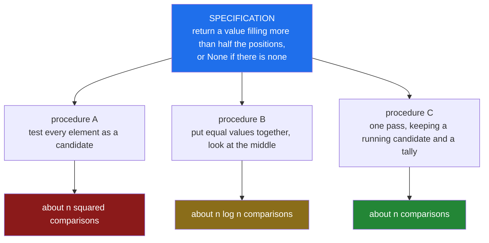

# 1.2 — Specification versus procedure

## 1. The one-line answer

A statement of what must be true when you are finished is a different kind of object from a set
of instructions for making it true, and you can hold the first without being one step closer to
the second.

---

## 2. The story

The slip comes down to the basement at twenty past three, and Anjali reads it standing up.

*O negative. Cross-matched against sample 4471. Not expired. Theatre 2.*

She has been the blood bank technician here for six years. Upstairs there is a woman on a table
losing blood faster than the drip is putting it back, and a surgeon who has already sent someone
down once. The refrigerator behind Anjali holds a little over four hundred bags.

Here is what the slip gives her, and it is worth being exact about it. Hand Anjali any single bag
off any shelf and she can tell you, quickly and with certainty, whether that bag satisfies the
slip: she reads the group off the label, she checks the cross-match record against 4471, she
reads the date. Yes or no, in the time it takes to turn a bag over. The slip is a perfect test.

What the slip does not contain, anywhere, is the location of a bag that passes it.

There are two people in this hospital who would go and get one. The house officer who came down
last month would start at the top left of the top shelf and turn bags over one at a time, and on
a bad night he would be down there a long while, and twice he has come up empty because he lost
his place and skipped a tray. Anjali does not do that. The refrigerator is arranged in trays by
group, and there is a register on the wall — every bag, its group, its date, its tray — written
up fresh each morning. She reads the register, walks to the third tray, and pulls the two bags
nearest expiry from in front of the others.

The house officer, on his way out last month, said the thing that has stayed with her. He said:
*just send up O negative.* He said it the way you give an instruction. She remembers standing
there thinking that he had not given her one. He had read the slip out loud.

---

## 3. The idea in plain language

The slip is a **specification**. The register-and-tray route is an **algorithm**.

A specification says what must be true of an acceptable answer. It is a *test* you can apply to a
candidate: this bag, yes or no. It says nothing about where an acceptable answer is, or how to
reach one, or what reaching one costs.

An algorithm is a procedure for producing one — a route, in the sense of 1.1: definite steps an
executor with no judgement can follow, ending in an answer.

Three consequences follow, and all three cost people interviews.

**Checking is not finding.** Anjali can check a bag in the time it takes to turn it over and
still need to open every tray in the refrigerator to find one. That the test is cheap tells you
nothing about the search. This gap — between recognising an answer and producing one — is one of
the load-bearing walls of the subject, and you will meet it again under its own name much later.

**One specification, many procedures.** The house officer's shelf-by-shelf walk and Anjali's
register lookup satisfy the same slip. Both are correct. One of them loses a patient. The
specification cannot tell them apart, because cost is not a property a specification has.

**Restating the specification is not producing a procedure.** *Just send up O negative* is the
slip with the paper taken away. It contains no step performable by anyone who did not already
know what to do. In code this is the answer "I'd return the smallest positive integer that isn't
in the list" to the question "return the smallest positive integer that isn't in the list", and
it is offered, in interviews, constantly.

> **Formally:** a specification is a relation `S` between valid inputs and acceptable outputs. An
> algorithm `A` *satisfies* `S` when, for every valid input `x`, `A` halts on `x` and the pair
> `(x, A(x))` lies in `S`. Many different `A` satisfy the same `S`, and `S` says nothing about
> what any of them costs.

---

## 4. Where this actually shows up

- **Kubernetes.** A Deployment manifest says `replicas: 3`. That is a specification and nothing
  else — it names a state of the world that ought to hold. No part of it says what to do. The
  procedure lives in the controller: a loop that repeatedly compares the world to the manifest
  and takes one corrective step. Your manifest is stable for years; the procedure underneath it
  is rewritten between releases, so a cluster can behave differently after an upgrade without a
  line of your specification changing.

- **Regular expression engines.** The pattern `(a+)+$` specifies a set of strings. RE2, which
  Google runs in production, and the backtracking engine behind Python's `re` both satisfy that
  specification — they agree on every string, forever. On the input `"aaaaaaaaaaaaaaaaaaaaaaa!"`
  one answers immediately and the other explores a number of possibilities that doubles with
  every extra `a`. Same specification. Same answers. Costs that are not on the same page.

- **Asked as:** *"Find the smallest positive integer missing from this array."* The candidate
  says "I'd look for the smallest positive integer that isn't there." The interviewer waits. What
  is being tested is not cleverness — it is whether you can hear the difference between the goal
  and a route to it, in your own sentence, while you are saying it.

---

## 5. The mechanism

Going from a specification to a program is a sequence of narrowing decisions. Each step commits
to *how*, and each step must leave *what* untouched.



*Notice: three procedures hang off one specification, and the specification box carries no cost.
Cost appears only on the leaves. That is the whole picture — the slip has no cost, the route
does.*

**The invariant:** *every step down this diagram must produce something that satisfies the box
above it, on every valid input. Refinement narrows how; it never edits what.* When someone says
"I optimised it" and the answers changed on an input nobody tested, this is the invariant they
broke.

### A trace

Take procedure A on the input `[1, 5, 5]`. The specification: return a value filling more than
half of the three positions — that is, appearing at least twice.

| Candidate under test | Occurrences counted | `count * 2 > 3`? | Next |
|---|---:|---|---|
| `1` (position 0) | 1 | `2 > 3` is false | reject, take the next candidate |
| `5` (position 1) | 2 | `4 > 3` is true | accept, return `5` |

Two things to see. First, each row is a full application of the specification-as-test to one
candidate — the test is being *used*, not replaced. Second, the work is a loop inside a loop: one
pass per candidate, one candidate per element. That shape is where §7's cost comes from, and it
is the price of having no idea where the answer is.

---

## 6. Line by line

Write the specification as code first. This is the step people skip, and it is free.

```python
def satisfies(xs: list[int], k: int) -> bool:
    """The specification, executable: does k fill more than half of xs?"""
    seen = 0
    for x in xs:
        if x == k:
            seen += 1
    return seen * 2 > len(xs)
```

Notice `seen * 2 > len(xs)` rather than `seen > len(xs) / 2`. Multiplying keeps everything in
whole numbers; dividing drags in a floating-point value whose behaviour you would then have to
argue about. Given a choice between a comparison that is exact and one that is almost always
exact, take the exact one — every time, not only when you can see the counterexample.

This function is not an algorithm for the problem. It is the slip. Given a bag it says yes or no;
it will never hand you a bag.

```python
def majority_by_search(xs: list[int]) -> int | None:
    for candidate in xs:
        if satisfies(xs, candidate):
            return candidate
    return None
```

This is the crudest possible way to turn a test into a producer: try things until one passes. The
obvious alternative is to test every integer rather than every element of `xs`, and it is worth
seeing exactly why that fails. The answer, if it exists, must *be an element of `xs`* — something
filling half the positions is certainly in there somewhere — so the elements form a complete
candidate list. Testing all integers instead would be both slower and, over an unbounded range,
non-terminating, which by 1.1 would stop it being an algorithm at all.

`return None` after the loop is the specification's other half. The slip says *or None if there
is none*, and a procedure that handles only the case where an answer exists satisfies half a
specification, which is to say none of it.

**The near-miss.** Here is the same procedure with one word changed:

```python
def majority_wrong(xs: list[int]) -> int | None:
    for candidate in range(len(xs)):      # <- candidates from positions, not values
        if satisfies(xs, candidate):
            return candidate
    return None
```

`range(len(xs))` reads plausibly — it is the shape of loop this curriculum will write ten
thousand times — but it draws candidates from the *positions* of `xs` instead of its *values*.
For small tidy non-negative data those two sets overlap and the bug hides:

```
>>> majority_by_search([1, 1, 2]), majority_wrong([1, 1, 2])
(1, 1)
>>> majority_by_search([5, 5, 1]), majority_wrong([5, 5, 1])
(5, None)
```

`[1, 1, 2]` agrees, so a test suite built from small examples someone thought of is silent.
`[5, 5, 1]` disagrees, and so does every input whose values run larger than its length — which in
production is nearly all of them. The lesson is not "watch out for `range`". It is that the
candidate set is a claim — *the answer, if there is one, is in here* — and a claim that goes
unwritten goes unchecked.

---

## 7. The cost, derived

**Technique: summation.**

Let `n = len(xs)`. `satisfies` walks the whole list once: `n` equality tests plus a constant
amount of arithmetic. Call one pass `c·n` steps.

`majority_by_search` calls `satisfies` once per candidate and stops at the first success. If the
answer is found at candidate number `k`, counting from 1, the total is

```
T(n, k) = Σ (i = 1 … k) c·n  =  c·n·k
```

The worst case is `k = n` — every candidate tested, none accepted:

```
T(n) = c·n·n = c·n²  =  Θ(n²)
```

| Case | Cost | The input that causes it |
|---|---|---|
| Best | `Θ(n)` — one pass | The majority value sits at position 0: `[5, 5, 5, 1, 2]` |
| Average | undefined until a distribution is named | see below |
| Worst | `Θ(n²)` — `n` passes | No majority exists: `[1, 2, 3, …, n]`, every candidate rejected |

The average row stays empty for the reason 1.1 gave: an average is an average over *something*,
and nobody has said what. But notice the asymmetry this problem has — the worst case is the input
with **no** answer. The procedure cannot stop early because there is nothing to stop at, and "no"
is exactly the answer that costs the most to be sure of. That pattern recurs for the rest of the
curriculum.

**Space:** `Θ(1)` auxiliary — `seen`, `candidate`, and a loop position, regardless of `n`. The
input list belongs to the caller and is not counted. Auxiliary versus total space is `CPX-12`,
Day 8.

**What the constant hides.** `c` is one Python loop iteration: an interpreter dispatch, an
equality test between two objects, an integer increment. Replacing the body of `satisfies` with
the list's own `count` method gives the same `Θ(n)` with `c` perhaps twenty times smaller,
because the loop then runs in C instead of bytecode. It does not touch the `n²`. That is the
correct order of operations on a real system, and the order people reverse: **the exponent first,
then the constant.** Shrinking `c` on a quadratic procedure buys you one doubling of `n`, and
then you are back where you started.

One sentence to carry out of this document: **a specification has no complexity.** If you catch
yourself saying "the problem is O(n log n)", stop — you have said something about a procedure
someone showed you, not about the problem. What a *problem* has is a lower bound, and proving one
is a different and much harder activity — `SRT-10`, Day 50, where the decision-tree argument
arrives.

---

## 8. When it breaks

The most direct way to feel the difference is to transcribe a specification into Python exactly as
it is worded, and run it. Here is the smallest missing positive integer, defined the way a
mathematician would write it — the smallest `m ≥ 1` that is not in `xs`:

```python
def smallest_missing(xs: list[int], m: int = 1) -> int:
    if m not in xs:
        return m
    return smallest_missing(xs, m + 1)
```

On `[3, 1, 2, 5]` it returns `4`, and it looks like a triumph. On `list(range(1, 3001))`:

```
Traceback (most recent call last):
  File "e1.py", line 9, in <module>
    print(smallest_missing(list(range(1, 3001))))
          ^^^^^^^^^^^^^^^^^^^^^^^^^^^^^^^^^^^^^^
  File "e1.py", line 5, in smallest_missing
    return smallest_missing(xs, m + 1)
           ^^^^^^^^^^^^^^^^^^^^^^^^^^^
  File "e1.py", line 5, in smallest_missing
    return smallest_missing(xs, m + 1)
           ^^^^^^^^^^^^^^^^^^^^^^^^^^^
  [Previous line repeated 996 more times]
RecursionError: maximum recursion depth exceeded
```

Read the last line, and the `[Previous line repeated 996 more times]` above it. The definition is
correct. It is *unimprovably* correct — it is the specification, letter for letter. It is also
useless on an input of three thousand elements, and CPython stopped it at a depth near one
thousand because every pending call holds a frame and frames are not free (`PYX-05`, Day 12,
takes this apart properly).

**The fix, and why it is not just a patch.** Swapping the recursion for a `while` loop removes the
traceback and leaves a procedure that is still quadratic, because `m not in xs` rescans the whole
list for every `m`. Raising the recursion limit would be worse than useless: it deletes the only
signal you were given. The real fix is to stop transcribing and start *designing* — to ask what
work is being repeated and what could be arranged in advance, which is the question the next two
hundred days answer in one form or another. The traceback is not the bug. The bug is that a
definition was handed to a machine as though it were a plan.

---

## 9. In production

**At scale.** The declarative bargain — you write the specification, a machine picks the
procedure — is how most large systems are operated now, and it moves the failure mode rather than
removing it. Your specification is stable; the procedure chosen underneath it is not. It can
change on an upgrade, on a configuration reload, or on a shift in whatever data the chooser looks
at. The result is the incident class where nothing in your repository changed and the service
fell over anyway.

The reference case is Cloudflare's global outage on 2 July 2019. A new firewall rule was deployed
containing a regular expression with a nested quantifier. The specification was fine — the rule
matched what it was meant to match. The backtracking engine executing it had a cost that exploded
on ordinary traffic, CPU went to 100% on every machine, and Cloudflare's network stopped serving
worldwide for about half an hour. Nobody wrote a slow algorithm. Somebody wrote a specification
and inherited a procedure.

**What a senior reviewer says.**

> "This is the docstring with `def` in front of it. It's quadratic, and the tests only have
> five-element lists, so nothing here is going to tell us. Either say in the docstring that it's
> the reference implementation and must never see request data, or do the linear pass. What I
> don't want is a third thing that reads like production code and isn't."

**What an interviewer probes.** After you have given a correct procedure:

1. *"You said the candidates are the elements of `xs`. Why is that safe?"* — checking whether the
   candidate set is a claim you know you made, or an accident that happened to work. If you cannot
   justify it, you did not choose it.
2. *"Suppose I only need to know whether a majority exists, not what it is. Does anything get
   cheaper?"* — checking whether you can tell a decision question from a search question. The
   honest answer here is no, and knowing *why* it is no is the point.
3. *"Your procedure and `sorted(xs)[len(xs) // 2]` return the same thing on every input that has a
   majority. Are they the same algorithm?"* — checking that you hear "satisfies the same
   specification" and "is the same procedure" as two different sentences.

---

## 10. Check yourself

Do these the day *after* you read this, with the document closed.

1. Is *"the list must come back with the same elements, in non-decreasing order"* a specification
   or an algorithm?
   <details><summary>answer</summary>

   A specification, and an unusually complete one — it pins down both halves, same elements *and*
   ordered, which is more than most people write. It admits insertion sort, merge sort, quicksort
   and several hundred others, whose costs differ by more than a factor of a thousand at moderate
   `n`. It cannot tell them apart, because cost is not a thing it has.
   </details>

2. Anjali can check a bag quickly and still need to open every tray. Say that sentence again with
   the refrigerator taken out of it.
   <details><summary>answer</summary>

   Verifying a candidate answer can be far cheaper than producing one. The cost of the test puts
   no bound on the cost of the search. Reversing this — assuming a cheap test implies a cheap
   search — is the most common wrong instinct about problem difficulty there is.
   </details>

3. Give a specification that no algorithm satisfies.
   <details><summary>answer</summary>

   *"Return `True` if the given Python program halts on the given input, and `False` otherwise."*
   It is a perfectly well-formed relation between inputs and acceptable outputs, and no procedure
   satisfies it. That is what *undecidable* means, and it is the sharpest available demonstration
   that having a specification and having a route are unrelated conditions.
   </details>

4. **Break it.** `majority_by_search` returns `None` for `[1, 1, 2, 2]`. A colleague calls that a
   bug and changes the test to `seen * 2 >= len(xs)`. What have they broken?
   <details><summary>answer</summary>

   They have edited the specification rather than fixing the procedure — the §5 invariant,
   violated exactly. Under `>=`, the input `[1, 1, 2, 2]` now has *two* acceptable answers, so the
   result depends on iteration order and the specification no longer determines the output. If
   "at least half" is genuinely what is wanted, that is a new slip, and it has to say what happens
   on a tie. `None` for `[1, 1, 2, 2]` was correct.
   </details>

5. **Break it.** Construct an input on which `majority_by_search` does close to its maximum work
   and still returns an answer rather than `None`.
   <details><summary>answer</summary>

   Put distinct losers first and the winner late: `[1, 2, 3, 4, 5, 6, 6, 6, 6, 6, 6, 6]`. Here
   `n = 12` and `6` appears seven times, so `14 > 12` holds and `6` is a legitimate answer — but
   five full rejected passes happen before the sixth pass finds it. The general point is 1.1's:
   *maximum work* and *the negative answer* are different things, and they only sometimes
   coincide.
   </details>

6. **Connects to `FND-01`.** The Day 0 contract says every cost claim must be derived. §7 derived
   `Θ(n²)` for a procedure anyone can see is bad. What was the derivation for, then?
   <details><summary>answer</summary>

   Two things a glance does not give you. First the *shape*, `c·n·k`, which says the cost depends
   on where the answer sits — that is what makes best and worst differ, and you cannot see it by
   squinting. Second, calibration: deriving costs while the answer is obvious is how you come to
   trust yourself on the day it is not. Nobody derives `Θ(n²)` because it is hard. You do it so
   that Day 87's recurrence is not the first time you have written down a sum.
   </details>

7. **In review.** A pull request replaces a `Θ(n²)` function with a `Θ(n)` one and the tests pass.
   What do you ask before approving?
   <details><summary>answer</summary>

   "Do the two agree on the inputs the tests don't cover — ties, empty, all-equal, and values
   larger than the length?" A faster procedure for the same specification must agree
   *everywhere*, and the usual way this goes wrong is that the fast version quietly satisfies a
   slightly different specification. It is why this repo's `lab/` compares `implement` against
   `reference` on generated inputs instead of on a handful of examples someone thought of.
   </details>
