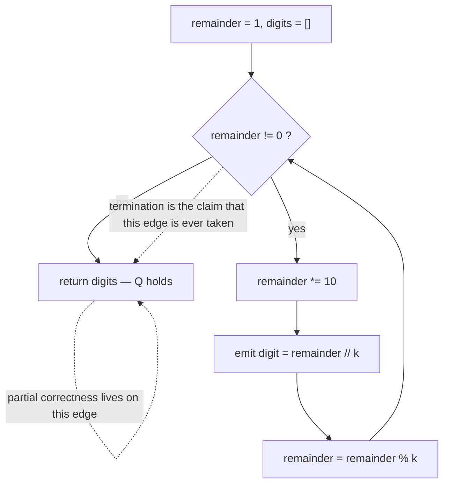

# 2.2 — Partial versus total correctness

## 1. The one-line answer

"If it stops, the answer is right" and "it stops" are two separate promises, and a program can keep
the first one perfectly while failing the second in a way that produces no wrong answer at all —
only silence.

---

## 2. The story

The relay room at Itarsi junction smells of hot dust and machine oil, and it is the loudest quiet
room in the country: two hundred relays clicking against each other behind glass.

Vinod Kharche has worked this box for nineteen years. On the panel in front of him is the layout of
the yard — every track, every point, every signal — and in his hand is the route request for the
Amravati passenger, waiting at the outer signal with four hundred people on it and a driver who has
already asked twice.

He sets the route. The points swing. And the signal stays red.

He sets it again. Red. The panel shows him why, in the flat way panels do: the track circuit for
the middle section is reading *occupied*. There is nothing on that section. He can see it from the
window — bare rail in the afternoon light. But two nights of rain have got into a joint somewhere,
and rust or water or a cracked bond is telling the relays that a train is standing there, and the
interlocking will not clear a signal onto a section it believes is occupied. It cannot be argued
with. There is no override on the panel, because the whole design principle of the box is that
there is no override on the panel.

So the Amravati stands. Then the goods behind it stands. By evening there are three trains in the
loop and a controller in Bhopal rearranging half of central India, and the platform at Itarsi is
filling with people who will miss connections tonight.

Here is what Vinod knows, and what the men shouting at him from the platform do not. The box has
not failed. The box has never once, in its whole service life, given a green to a route that was
not clear — and if it ever did, on a junction carrying this much traffic, they would be counting
bodies rather than delays. The rule the interlocking obeys is not *trains will move*. It is
*nothing moves unless it is safe*, and the second rule can be kept forever by keeping everything
still.

The relay men come at eight with a meter and find the bad bond in an hour. The section clears, the
signal goes green, and the Amravati leaves five hours late with an apology that nobody accepts.

Two ways this room could ruin a day, then, and they are not the same thing at all. One of them
looks like a signal that says the wrong thing. The other looks like a signal that says nothing,
for as long as you care to stand there and wait.

---

## 3. The idea in plain language

The interlocking keeps one promise absolutely: *if a signal turns green, the route is clear*. It
does not promise that a signal ever turns green.

That is **partial correctness**. A program is partially correct when, *on the assumption that it
terminates*, its result satisfies the specification. Every proof you have written so far in this
day is a partial-correctness proof: initialization and maintenance from
[1.1](../01-invariants-and-induction/1.1-initialization-and-maintenance.md) establish the invariant
at every top-of-loop, and the negated guard from
[1.2](../01-invariants-and-induction/1.2-exit-and-negated-guard.md) converts it into the
postcondition — but every one of those sentences begins with the word *if*. If control reaches the
top of an iteration. If the loop exits. Nothing in either document says it does.

**Total correctness** is partial correctness plus termination. It is the promise people think they
are making when they say "this function is correct", and it needs the variant from
[2.1](2.1-measure-that-decreases.md) as a separate argument with a separate witness.

The pairing has a name in the wider world, and it is worth knowing because you will meet it long
after Phase 1: partial correctness is a **safety** property — *nothing bad happens* — and
termination is a **liveness** property — *something good eventually happens*. The interlocking is a
machine tuned all the way towards safety, and its failure mode is the one that makes people angry
rather than the one that kills them. That trade is deliberate, and choosing where to sit on it is
an engineering decision you will make many times.

The reason to keep the two apart is not tidiness. It is that they fail with different symptoms, and
symptom is what a bug report gives you:

| | Terminates | Does not terminate |
|---|---|---|
| **Satisfies `Q`** | totally correct | the failure in this document |
| **Violates `Q`** | a wrong answer | both at once, and you will only see the hang |

A wrong answer arrives with evidence — a failing assertion, a diff, an input you can shrink. A
non-terminating program arrives with nothing: no exception, no log line, no exit code, just a job
that is still running when you come back to it. The instinct that a silent failure must be
"somewhere deep" is exactly backwards. It is usually a guard.

> **Formally:** `{P} C {Q}` — partial correctness — asserts that if `C` is started in a state
> satisfying `P` **and terminates**, then the final state satisfies `Q`. `[P] C [Q]` — total
> correctness — asserts that if `C` is started in a state satisfying `P`, then it terminates *and*
> the final state satisfies `Q`. For a loop, `[P] C [Q]` is exactly `{P} C {Q}` together with a
> variant, which is why the two are proved separately and why one of them is much easier.

---

## 4. Where this actually shows up

- **seL4, the verified microkernel.** seL4 ships with a machine-checked proof that its C
  implementation satisfies its specification — and the kernel is deliberately written with *no
  unbounded loops*, so that every kernel entry provably completes. That constraint is not for the
  proof's convenience; it is what makes a worst-case execution time computable at all, which is
  what lets seL4 be used in flight control and defence systems where a kernel that might not come
  back is not a kernel. Partial correctness alone would have been an easier proof and a useless
  product.

- **Amazon's use of TLA+ on S3 and DynamoDB.** Engineers there model distributed protocols and
  check two categories of property separately: safety invariants ("no acknowledged write is ever
  lost") and liveness ("every request eventually gets a response"). The published write-ups are
  blunt that the safety bugs found were the ones that would have been catastrophic and undetectable
  in testing, and that liveness is checked under explicit fairness assumptions because without them
  *nothing* is live — a scheduler that never runs your process is a legal execution. Same split,
  same reason: two different obligations, two different kinds of counterexample.

- **Asked as:** *"Your tests pass. What have you actually established?"* The answer they want is
  that you have established total correctness on the inputs you ran, and nothing about any other
  input — and that a test suite is peculiarly bad at detecting non-termination, because the symptom
  of a hang is a suite that never reports.

---

## 5. The mechanism

Long division by hand, which is the loop everyone already knows and nobody has written down. Take
the decimal expansion of `1/k`: multiply the remainder by ten, take the digit, keep the new
remainder, repeat until the remainder is zero.



*What to notice: there is exactly one edge out of the loop, and the whole of `1.1` and `1.2` is
about what is true when you take it. Nothing anywhere in the diagram says you ever do. The dotted
annotations mark the two different claims, and they attach to different parts of the picture.*

**The invariant:** *the digits emitted so far are the first `t` digits of the decimal expansion of
`1/k`, and `remainder` is what is left over — formally, `1/k = 0.d₁d₂…d_t + remainder / (k · 10ᵗ)`.*

That claim is established before the first iteration (`t = 0`, no digits, `remainder = 1`, and
`1/k = 0 + 1/k` ✓) and preserved by the body. It is a perfectly good invariant. It is true on every
iteration of every input, including the inputs where this function runs until the heat death of the
machine.

### Two traces, same code

`k = 8`. Remainders shown at the top of each iteration.

| Iteration | `remainder` | digit emitted | new `remainder` |
|---|---:|---:|---:|
| 1 | 1 | `10 // 8 = 1` | 2 |
| 2 | 2 | `20 // 8 = 2` | 4 |
| 3 | 4 | `40 // 8 = 5` | 0 |
| exit | 0 | — | — |

Result `[1, 2, 5]`: `1/8 = 0.125`. Terminates, and correct.

`k = 3`.

| Iteration | `remainder` | digit emitted | new `remainder` |
|---|---:|---:|---:|
| 1 | 1 | `10 // 3 = 3` | 1 |
| 2 | 1 | `10 // 3 = 3` | 1 |
| 3 | 1 | `10 // 3 = 3` | 1 |
| … | 1 | 3 | 1 |

The invariant holds at every row — after three digits, `1/3 = 0.333 + 1/(3 · 1000)`, which is true.
The postcondition would hold if the loop ever exited. The remainder is a non-negative integer, so
you might reach for it as a variant, and it fails the third obligation of
[2.1](2.1-measure-that-decreases.md) immediately: it does not decrease. It does not increase either.
It just stays.

---

## 6. Line by line

```python
def expansion_of(k: int) -> list[int]:
    digits: list[int] = []
    remainder = 1
```

Initialization for the invariant: zero digits emitted, and the whole of `1/k` still unaccounted for
in `remainder / k`. Note there is no precondition check here beyond what the type says, and by the
end of this section you will want one — not because a bad `k` gives a wrong answer, but because a
bad `k` gives no answer.

```python
    while remainder != 0:
        remainder *= 10
```

The guard is equality against zero, and here — unlike the near-miss of
[2.1](2.1-measure-that-decreases.md) — that is not the bug. Zero is genuinely the only stopping
state, and `remainder` cannot skip past it, because `remainder % k` lands in `0 … k-1` by
construction. The trouble is more basic than the guard's shape: for many `k` the remainder never
reaches zero at all.

```python
        digits.append(remainder // k)
        remainder %= k
```

These two lines are the maintenance step, and they must be read as one move: the digit and the new
remainder are the quotient and remainder of the same division, which is why the invariant survives
them. Splitting them across a condition — emitting a digit on one branch and updating the remainder
on another — is the standard way to break this loop, and it breaks it silently, in the shape
[1.1](../01-invariants-and-induction/1.1-initialization-and-maintenance.md) described.

```python
    return digits
```

The exit argument: the guard is false, so `remainder == 0`, so the invariant reads
`1/k = 0.d₁…d_t + 0`, which is the postcondition exactly. That is a complete, valid,
partial-correctness proof of this function, and this function does not terminate for `k = 3`. Both
sentences are true at once, and holding them both in your head is the whole of this document.

**The near-miss.** Here is the repair everyone writes first, and it looks like defensive
engineering:

```python
def expansion_capped(k: int, cap: int = 20) -> list[int]:
    digits: list[int] = []
    remainder = 1
    while remainder != 0 and len(digits) < cap:
        remainder *= 10
        digits.append(remainder // k)
        remainder %= k
    return digits
```

It terminates on every input — the measure is `cap - len(digits)`, and it is impeccable. It is also
worse than what it replaced, because look at what it returns:

```
>>> expansion_capped(3)
[3, 3, 3, 3, 3, 3, 3, 3, 3, 3, 3, 3, 3, 3, 3, 3, 3, 3, 3, 3]
>>> expansion_capped(7)
[1, 4, 2, 8, 5, 7, 1, 4, 2, 8, 5, 7, 1, 4, 2, 8, 5, 7, 1, 4]
```

Those are not the decimal expansions of `1/3` and `1/7`. They are prefixes, returned with the same
type and the same shape as a correct answer, with nothing to distinguish them from one. The cap
converted a liveness failure into a safety failure: instead of a program that hangs where you can
see it, you have a program that lies where you cannot. And it did so by the one move the story
warned about — overriding the interlock so that something moves.

The cap is not wrong because caps are wrong. It is wrong because it does not *report*. Return
`(digits, complete: bool)`, or raise on the cap, and the same code becomes honest: it terminates,
and it never claims a truncated expansion is a finished one.

---

## 7. The cost, derived

**Technique: summation**, over an iteration count that a pigeonhole argument bounds.

Each iteration is a constant amount of work `c` in the RAM model of `CPX-02`: one multiplication,
one division, one modulo, one append. So the cost is `c` times the number of iterations, and the
interesting question is how many there are.

Every value of `remainder` at the top of an iteration lies in `0 … k-1`, because it is the result of
`% k`. That is `k` possible values. Run the loop `k + 1` times and two of those tops must carry the
same remainder — there are more iterations than values available. The state of this loop is
*entirely* determined by `remainder`, so once a value repeats, everything after it repeats too,
forever.

That gives the complete picture in one line: **either a remainder of zero appears within the first
`k` iterations, or the loop never terminates.** There is no third possibility, and no input on which
it runs for a long time and then stops.

```
d = number of digits produced

T(k) = Σ (t = 1 … d) c  =  c · d,    with d ≤ k - 1 when the loop terminates at all
```

The terminating cases are exactly `k = 2^a · 5^b`, and for those `d = max(a, b)`.

| Case | Cost | The input that causes it |
|---|---|---|
| Best | 1 iteration | `k = 2`, `k = 5`, `k = 10` |
| Worst (terminating) | `max(a, b)` iterations for `k = 2^a · 5^b` | `k = 1024` → 10 digits; `k = 5^9` → 9 digits |
| Worst (all inputs) | unbounded | any `k` with a prime factor other than 2 or 5 — `k = 3`, `k = 7` |

That last row is not a slow case. It is a different kind of row, and a complexity table that omits
it is telling you a comfortable lie about the function.

**Space:** `Θ(d)` for the digit list, which is output rather than auxiliary — `Θ(1)` auxiliary,
one integer. On the non-terminating inputs the output grows without bound, so the real failure on a
long enough run is not a hang but a `MemoryError`, which is a hang wearing a disguise.

**What the constant hides.** The pigeonhole bound is also the fix's price list. Detecting the cycle
means remembering which remainders have been seen and at which position: a table of at most `k`
entries, so `Θ(k)` extra space to buy termination. That is the trade in its purest form — the loop
was `Θ(1)` in space and might not stop; make it `Θ(k)` in space and it always stops, and it can now
report the repeating block as well. Termination is not free, and what it costs here is memory. (The
table wants constant-time lookup, which a Python `dict` gives you; how it manages that is `HSH-01`
on Day 66.)

---

## 8. When it breaks

The point of this document is that the two failures do not look alike, so here they are side by
side, from the same test session.

**A wrong answer** — a division loop with `>` where it needs `>=`:

```
=================================== FAILURES ===================================
_________________________ test_divide_matches_divmod __________________________

    def test_divide_matches_divmod() -> None:
>       assert divide(12, 4) == divmod(12, 4)
E       assert (2, 4) == (3, 0)
E
E         At index 0 diff: 2 != 3
E         Use -v to get more diff

test_d2e.py:10: AssertionError
=========================== short test summary info ===========================
FAILED test_d2e.py::test_divide_matches_divmod - assert (2, 4) == (3, 0)
1 failed in 0.52s
```

Everything you need is in there: which input, which output, which output was wanted, and a file and
line. This is a partial-correctness failure, and partial-correctness failures are *generous*. The
loop stopped, which means the state at the exit is available to be inspected, printed, shrunk by
Hypothesis, and pasted into a bug report.

**No answer at all** — the same session, `expansion_of(3)`, interrupted by hand:

```
Traceback (most recent call last):
  File "d2d.py", line 16, in <module>
    print(expansion_of(3))
          ^^^^^^^^^^^^^^^
  File "d2d.py", line 8, in expansion_of
    while remainder != 0:
          ^^^^^^^^^^^^^^
KeyboardInterrupt
```

No expected value, because there is no actual value. The line named is a guard rather than a
computation, and the only reason there is a traceback at all is that somebody pressed a key. Left
alone in CI this produces a job that is killed by the runner's own limit, with a log that ends
mid-sentence, and the report that reaches you says "the build hangs sometimes" — which is why
non-termination bugs are diagnosed in hours and wrong-answer bugs in minutes.

The tell is worth naming, because it is nearly always the same: **when a traceback's last frame
points at a `while` or a comparison rather than at work, you are looking at a variant that does not
decrease.** Then go and find the measure, and the input for which it stops falling.

**The fix, and why it is not just a patch.** The patch is the cap from §6, and §6 showed what the
cap costs. The fix is to change the specification so that a variant exists: stop asking for "the
decimal expansion of `1/k`" — which for `k = 3` is an infinite object that no terminating program
can return — and ask instead for "the digits before the repeating block, and the repeating block".
Every rational has one, it is finite, and the pigeonhole argument in §7 proves the loop finds it
within `k` iterations. Record each remainder's first position in a table; when a remainder repeats,
the digits since its first appearance are the repetend and the loop exits. The measure is now
"remainders not yet seen", it starts at `k`, and it falls by exactly one per iteration.

Read that repair again, because the shape of it recurs for the rest of the curriculum: the loop was
not repaired by editing the loop. It was repaired by noticing that the *specification* asked for
something no terminating procedure can produce, and asking for a finite thing instead. When a loop
resists every attempt to give it a variant, suspect the specification before the code.

---

## 9. In production

**At scale.** The safety/liveness split does not stay inside a function; it becomes the shape of
whole systems.

*Consensus is the canonical case.* Raft and Paxos are designed to be **always safe** — two nodes
never commit different values at the same index, no matter how the network behaves — and **live
only under assumptions**, namely that messages eventually get through and clocks are roughly sane.
That is not an implementation weakness. The FLP impossibility result says no deterministic protocol
in a fully asynchronous network can guarantee both safety and termination if even one node may
crash, so every real system chooses to keep safety and to make liveness conditional. A cluster that
has lost quorum is doing exactly what Vinod's interlocking was doing: refusing to move, correctly,
indefinitely. This is Phase 38, Days 269–276, and it will feel familiar when you get there.

*Databases turn a hang into a wrong-looking-but-honest failure on purpose.* Two transactions that
each hold what the other wants will wait forever; the data is never corrupted, and nothing happens.
Every serious engine ships a deadlock detector that finds the cycle and kills one transaction with
an error the application can retry. That is the §8 fix applied at system scale: an imposed variant,
plus a report, and never a silent truncation.

*The observability of the two failures is completely different, and it drives on-call design.* A
wrong answer shows up in a metric — error rate, a mismatch counter, a customer complaint with an
order number. A hang shows up as a *missing* metric: throughput that quietly drops, a worker pool
whose free count trends to zero, a queue depth climbing on a graph nobody is looking at. Systems
that only alert on errors are blind to exactly the failure mode this document is about, which is
why timeouts everywhere and an alert on saturation are worth more than another assertion.

**What a senior reviewer says.**

> "Your proof sketch in the docstring is fine as far as it goes, but every sentence in it starts
> with 'when the loop exits'. Nothing here says it does. What's the measure? If the honest answer is
> that there isn't one for all inputs, then this function needs a documented precondition and a
> check, not a `max_iterations` parameter — a cap that silently returns a prefix is worse than the
> hang, because the hang can't reach the customer as a number."

**What an interviewer probes.** After you have proved the invariant and the exit condition:

1. *"You've told me what's true when it stops. Why does it stop?"* — checking whether you know the
   two obligations are separate. The answer is a measure, its floor, and why the body decreases it.
2. *"Suppose it doesn't, for some inputs. What would the bug report look like?"* — checking whether
   you can predict the symptom rather than only the cause: no traceback, a job killed by the runner,
   an interrupt pointing at a guard.
3. *"Would you rather ship a function that occasionally hangs or one that occasionally returns a
   truncated answer?"* — checking judgement, and there is no single right answer. In a batch job, the
   hang is safer, because it fails loudly and reruns. In a request path holding a connection and a
   thread, the hang is an outage and a reported truncation is the correct trade. A candidate who
   answers instantly without asking where the code runs has answered the wrong question.

---

## 10. Check yourself

Do these the day *after* you read this, with the document closed.

1. Give the two definitions in one sentence each, and say which one this day's first section proved.
   <details><summary>answer</summary>

   Partial correctness: if the program is started in a state satisfying the precondition **and it
   terminates**, the final state satisfies the postcondition. Total correctness: it terminates, and
   the final state satisfies the postcondition. Section 1 — initialization, maintenance, exit —
   proved partial correctness only. Every one of its conclusions was conditional on the loop
   stopping.
   </details>

2. A colleague says "the tests all pass, so the function is correct". What have the tests
   established, precisely?
   <details><summary>answer</summary>

   Total correctness on the inputs that were run — those runs returned, and returned the right
   answers. Nothing about any other input, and in particular tests are the worst instrument
   available for detecting non-termination: a hanging test produces no failure, only a suite that
   never finishes, which most people read as an infrastructure problem rather than a bug.
   </details>

3. Why is a `MemoryError` from `expansion_of(3)` not evidence of a memory problem?
   <details><summary>answer</summary>

   Because it is the non-termination arriving in a different costume. The loop appends one digit per
   iteration and never exits, so allocation grows without bound; the process dies when the machine
   runs out, at an address that has nothing to do with the fault. The bug is a missing variant. This
   is the general hazard of diagnosing a liveness failure by its symptom: the symptom is produced by
   whichever resource happened to run out first.
   </details>

4. **Break it.** Here is a function whose guard is an inequality and whose measure, `hi - lo`, you
   can watch decreasing on every example you are likely to type. Find the inputs on which it never
   returns, and say which of the three obligations from
   [2.1](2.1-measure-that-decreases.md) fails.

   ```python
   def halve_range(lo: int, hi: int) -> int:
       steps = 0
       while lo < hi:
           mid = (lo + hi) // 2
           lo = mid
           steps += 1
       return steps
   ```
   <details><summary>answer</summary>

   Every input with `hi - lo == 1` hangs: `halve_range(0, 1)` computes `mid = 0`, assigns `lo = 0`,
   and nothing has changed. So does `halve_range(2, 3)` — `mid = 2` — and `halve_range(7, 8)`. On a
   wide range the measure really does fall, roughly halving each time, which is why every example
   anyone types by hand looks fine; it only stalls on the last step, when the range has narrowed to
   two. The obligation that fails is the third: `hi - lo` is a non-negative integer with a floor at
   zero, and the body simply stops decreasing it. The repair is `lo = mid + 1`, which needs a
   sentence of justification about the invariant — that `mid` may be excluded — rather than being a
   typo fix. This is the shape almost every binary search bug in Phase 7 takes, and it is one
   character away from correct.
   </details>

5. **Connects to `CPX-01`.** Day 1 required an algorithm to be finite. Restate the partial/total
   distinction using that requirement, and say what it implies about the phrase "a correct but slow
   algorithm".
   <details><summary>answer</summary>

   Finiteness is the termination obligation, so a partially correct procedure that does not
   terminate is not an algorithm at all by Day 1's definition — it is a specification of what would
   be true if it ever finished. "Correct but slow" is a statement about an algorithm: it terminates,
   the answer is right, the cost is bad. "Correct but sometimes doesn't return" is not a slower
   version of the same thing; it is a different category, and the sloppy habit of calling both
   "correct" is what lets a hang ship.
   </details>

6. **Connects to `CPX-02`.** §7 bounded the terminating case at `k - 1` iterations. Explain why that
   is a bad bound when `k` arrives as a 40-digit number, using Day 1's rule about what `n` is.
   <details><summary>answer</summary>

   Because `k - 1` is measured in the *value* of `k` and the input's *size* is its digit count. A
   40-digit `k` is about `10⁴⁰`, so a bound of `k - 1` iterations is about `10⁴⁰` iterations — the
   loop is linear in the value and exponential in the size, exactly the trial-division trap from
   Day 1. The pigeonhole argument is still correct; what it establishes for large `k` is that the
   loop terminates, and nothing usable about when.
   </details>

7. **In review.** A pull request adds `max_iterations=10_000` to a loop that previously had no such
   parameter, and returns the best answer found so far when the cap is hit. What do you ask for?
   <details><summary>answer</summary>

   That the capped exit be distinguishable from the converged exit — a flag, a different return
   type, or an exception — and that the caller be made to handle it. A cap is a legitimate imposed
   variant; a cap whose result is indistinguishable from a real answer converts a loud failure into
   a silent one, which is the near-miss in §6. The second question is why the loop needs the cap at
   all: if nobody can name the measure, the specification may be asking for something no terminating
   procedure can produce, and that is the bug rather than the loop.
   </details>
