# Krama — Master Plan

> **क्रम (krama)** — *order, sequence, the step by which a thing proceeds.*
> 308 days from "what is an algorithm" to designing, proving, implementing and defending
> any data structure, algorithm, **or system** asked of you — in Python, from scratch, with the
> cost written down and a test that can go red.
>
> **Track I — Days 0–230:** data structures and algorithms.
> **Track II — Days 231–308:** system design, on the same depth contract.

| | |
|---|---|
| **Version** | v1.1.0 |
| **Amendments** | [`CHANGELOG_PLAN.md`](CHANGELOG_PLAN.md) |
| **Day map** | [`CURRICULUM_INDEX.md`](CURRICULUM_INDEX.md) — every day, its IDs, its gate |
| **Doc standard** | [Part 11 — the depth contract](#part-11--the-depth-contract-doc-architecture-v100) |
| **Problems** | [`PROBLEM_INDEX.md`](PROBLEM_INDEX.md) — every problem, by pattern and concept ID |
| **Progress** | [`TRACKER.md`](TRACKER.md) — generated, never hand-edited |
| **Start here** | [`days/day-00-setup/LESSON.md`](../days/day-00-setup/LESSON.md) |

---

## Part 0 — The promise, stated precisely

A person who finishes this repo — every day written, every checklist ticked, every problem
in the ladder solved without looking — can do the following without preparation:

1. Take an unfamiliar problem, name the *shape* of it (this is a monotone predicate; this is
   a DAG with weights; this is an exchange-argument greedy), and say why.
2. Derive the time and space cost of their own solution from first principles, including
   amortized and expected cost, and say what the constant factor hides.
3. Implement the structure **from scratch** — no `heapq`, no `bisect`, no `sortedcontainers` —
   and then say exactly why the standard library version is faster.
4. Prove correctness: loop invariant, exchange argument, induction on subproblem size,
   potential function — the right tool for the structure at hand.
5. Say what breaks at scale: cache behaviour, recursion depth, integer size, memory locality,
   what happens when the input no longer fits in RAM.
6. Defend all of it in a design review or an interview, out loud, while writing code.

And after Track II, seven more:

7. Take a one-line product requirement and produce an API, a data model, a partition key and a
   capacity estimate, and say which of the four they should push back on.
8. Choose a database *and say what they are giving up* — the isolation anomaly they are accepting,
   the replication lag their reads will see, the partition key that will develop a hotspot.
9. Explain what happens to their system when one machine, one rack, or one region disappears —
   and what the user sees while it happens.
10. Say precisely what "exactly-once" means, why it is a lie at the transport layer, and how
    idempotency keys make it true at the application layer.
11. Explain Raft on a whiteboard from memory, including what breaks without the safety rules.
12. Read a latency graph and say whether the problem is queueing, a hot key, a cache miss storm,
    or a GC pause.
13. Run a design interview end to end without being led.

This is not a "solve 500 LeetCode problems" plan, and it is not a "memorise fifteen system design
templates" plan. Problems and drills are the *evaluation*, never the syllabus. The syllabus is the
ideas. But the problems do exist, all of them, in one place:
[`PROBLEM_INDEX.md`](PROBLEM_INDEX.md).

---

## Part 1 — The sixteen rules this repo runs on

1. **From scratch before library.** You write the binary heap before you `import heapq`.
   You write the hash table before you use `dict`. The library version is taught *afterwards*,
   as a comparison, and the lesson must say what it does differently.
2. **A day is a unit of subject, not of time.** No lesson carries a time estimate, a "45 min"
   badge, or a pace. It takes as many sittings as it takes. Nothing is trimmed to fit.
3. **Depth over density.** One idea, one document. A wall of text is not depth — it is depth's
   disguise. If a document covers two ideas, it is two documents.
4. **Assume no prior knowledge, finish at production.** Every subtopic starts from a reader who
   has never heard the word, and ends with what a senior engineer says about it at scale.
5. **Every claim about cost is derived, never asserted.** "This is O(n log n)" is not allowed
   unless the document shows the sum, the recurrence, or the potential function that produces it.
6. **Measure what you claim.** Every complexity claim in a lesson has a companion benchmark in
   `lab/` that shows the curve bending the way the theory says it should — or explains why it
   doesn't (it usually is cache behaviour).
7. **Tests before optimisation.** A structure is not done until a test can go red when it breaks.
   Property-based tests (Hypothesis) against a slow-but-obviously-correct reference implementation
   are the default, not an extra.
8. **Reproduce the failure on screen.** Every "when it breaks" section contains the real Python
   error text — `RecursionError: maximum recursion depth exceeded`, not a paraphrase of it.
9. **Draw it.** Every structural idea carries a diagram (Mermaid, or ASCII when Mermaid lies about
   memory layout). A pointer diagram that shows the wrong thing is worse than no diagram; check it.
10. **No magic constants, no magic imports.** Every `import` in a lab is explained the day it first
    appears. `random.seed()` is set. Every benchmark states its machine and its `n`.
11. **Correctness has a named proof technique.** Loop invariant, induction, exchange argument,
    cut property, potential function, adversary argument. The document names which one it is using.
12. **Problems are ladders, not lists.** Every day ends with warm-up → core → stretch → interview,
    in that order, and says what pattern each one is testing. Never a bare list of links.
13. **Retention is engineered.** Every phase gate re-tests ideas from two phases ago. Forgetting is
    the default state of a human being and the plan is built around it (Part 12).
14. **Python is the instrument, CPython is the machine.** When CPython's behaviour changes the
    answer — list over-allocation, dict compaction, `int` being arbitrary precision, the GIL,
    recursion limits — the lesson teaches the real machine, not the textbook abstraction.
15. **Nothing floats.** Pinned versions, a committed lockfile, seeded randomness, fixed input
    generators. A benchmark that can't be re-run is an anecdote.
16. **The plan is amendable, not editable.** Changing the syllabus means an entry in
    `CHANGELOG_PLAN.md` and, for anything structural, an ADR in `docs/adr/`.

---

## Part 2 — Prerequisites, honestly

You need to be able to write and run a Python function, and to use a terminal well enough to
`cd` and run a script. That is all. Day 0 installs everything else.

You do **not** need: prior CS, discrete maths, big-O familiarity, or any competitive programming
background. Phase 1 builds the maths you need at the moment you need it, and Phase 26 builds the
rest when the algorithms demand it.

---

## Part 3 — The arc

```mermaid
flowchart LR
    A["Phases 0–2<br/>foundry · cost model<br/>Python as an instrument"] --> B["Phases 3–8<br/>arrays · strings · pointers<br/>binary search · sorting"]
    B --> C["Phases 9–12<br/>linked lists · stacks/queues<br/>hashing · heaps"]
    C --> D["Phases 13–15<br/>recursion · backtracking<br/>divide &amp; conquer · greedy"]
    D --> E["Phases 16–19<br/>trees · tries<br/>range structures · DSU"]
    E --> F["Phases 20–23<br/>graphs: traversal<br/>shortest paths · MST · flow"]
    F --> G["Phases 24–25<br/>dynamic programming<br/>foundations → optimisations"]
    G --> H["Phases 26–28<br/>number theory · geometry<br/>randomised &amp; streaming"]
    H --> I["Phases 29–31<br/>NP · systems structures<br/>interview craft"]
    I --> J["Phase 32<br/>🏁 Capstone: pykrama"]
    J --> K["Phases 33–35<br/>distributed foundations<br/>the network · storage"]
    K --> L["Phases 36–38<br/>caching · messaging<br/>consensus"]
    L --> M["Phases 39–40<br/>scale patterns<br/>reliability · security"]
    M --> N["Phases 41–42<br/>🏁 design drills<br/>+ build one"]

    style J fill:#1f6feb,color:#fff
    style N fill:#1f6feb,color:#fff
    style G fill:#8957e5,color:#fff
    style K fill:#8957e5,color:#fff
```



**Days 210–214 are the hinge.** LRU, B-trees, LSM trees and consistent hashing are taught in
Track I as *structures* — from scratch, with derived costs — and revisited by name in Track II as
*components*, under replication, partitioning and failure. Nothing in Track II is learned twice.

---

## Part 4 — Phase catalogue

Forty-three phases (0–42), 308 days. Every phase ends in a **gate** — a day whose checklist
cannot be ticked by reading. The full day-by-day map is [`CURRICULUM_INDEX.md`](CURRICULUM_INDEX.md).

| Phase | Days | Title | ID prefix | Gate |
|---:|:---:|---|---|---|
| 0 | 0 | The Foundry — tools, repo, how to read this | `FND` | Environment proves itself |
| 1 | 1–8 | Computation and Cost | `CPX` | Derive 5 unseen complexities |
| 2 | 9–14 | Python as an Algorithms Instrument | `PYX` | Benchmark harness you wrote |
| 3 | 15–20 | Arrays and Dynamic Arrays | `ARR` | Write `DynamicArray` from scratch |
| 4 | 21–26 | Strings and Text | `STR` | Immutability cost report |
| 5 | 27–32 | Two Pointers and Sliding Window | `TWP` | Window template, defended |
| 6 | 33–36 | Prefix Sums and Difference Arrays | `PFX` | 2D range engine |
| 7 | 37–43 | Binary Search and the Monotone Predicate | `BSR` | Search-on-answer, 3 shapes |
| 8 | 44–51 | Sorting | `SRT` | Your Timsort vs `list.sort()` |
| 9 | 52–58 | Linked Lists | `LNK` | Pointer surgery, no leaks |
| 10 | 59–65 | Stacks, Queues, Monotonic Structures | `STQ` | Monotonic stack derivation |
| 11 | 66–72 | Hashing | `HSH` | Open-addressing map from scratch |
| 12 | 73–78 | Heaps and Priority Queues | `HEP` | Binary + d-ary heap, benchmarked |
| 13 | 79–86 | Recursion and Backtracking | `REC` | Pruning that provably preserves answers |
| 14 | 87–91 | Divide and Conquer | `DNC` | Master theorem on your own recurrences |
| 15 | 92–97 | Greedy and Exchange Arguments | `GRD` | Prove one greedy, break one greedy |
| 16 | 98–107 | Trees | `TRE` | Self-balancing BST from scratch |
| 17 | 108–114 | Tries and String Algorithms | `TRI` | KMP failure function, derived |
| 18 | 115–122 | Range Query Structures | `RNG` | Lazy segment tree |
| 19 | 123–126 | Disjoint Set Union | `DSU` | Prove the inverse-Ackermann bound's shape |
| 20 | 127–135 | Graphs I — Modelling and Traversal | `GRA` | Model 3 word problems as graphs |
| 21 | 136–142 | Graphs II — Shortest Paths | `GRB` | Choose the right algorithm, defended |
| 22 | 143–150 | Graphs III — MST, SCC, Connectivity | `GRC` | Tarjan from scratch |
| 23 | 151–157 | Flows and Matching | `FLW` | Model a matching problem as flow |
| 24 | 158–168 | Dynamic Programming I — Foundations | `DPA` | State design, written first |
| 25 | 169–180 | Dynamic Programming II — Advanced | `DPB` | Two optimisations, benchmarked |
| 26 | 181–190 | Mathematics for Algorithms | `MTH` | Modular toolkit + matrix expo |
| 27 | 191–196 | Computational Geometry | `GEO` | Convex hull, degenerate cases handled |
| 28 | 197–203 | Randomised, Approximate, Streaming | `RND` | Bloom filter with measured FPR |
| 29 | 204–209 | Intractability | `NPC` | Perform one reduction |
| 30 | 210–214 | Structures That Run Systems | `SYS` | LRU + B-tree + LSM read path |
| 31 | 215–220 | Interview and Contest Craft | `IVW` | Narrated mock, recorded |
| 32 | 221–230 | Capstone — `pykrama` | `CAP` | Library, judge, visualiser, write-up |
| | | **— Track II: System Design —** | | |
| 33 | 231–238 | Distributed Foundations | `DST` | Estimate a footprint, defended |
| 34 | 239–244 | The Network | `NET` | Trace one request end to end |
| 35 | 245–256 | Storage | `STO` | Schema + index + partition key |
| 36 | 257–261 | Caching | `CCH` | Cache without breaking correctness |
| 37 | 262–268 | Messaging and Streaming | `MSG` | Make a design asynchronous |
| 38 | 269–276 | Coordination and Consensus | `CNS` | Raft on a whiteboard, no notes |
| 39 | 277–283 | Scale Patterns | `SCL` | 1k → 10M users, step by step |
| 40 | 284–288 | Reliability, Observability, Security | `OBS` | Write the runbook |
| 41 | 289–300 | Design Drills | `DES` | Two drills, timed, narrated |
| 42 | 301–308 | Capstone II — build one | `SDC` | Design, build, load-test, break it |

**Phase 0 is the foundry. Phases 1–2 are the instrument. Phases 3–19 are the structures.
Phases 20–25 are the algorithms that make people afraid. Phases 26–30 are what separates
"can pass an interview" from "can design the system". Phases 31–32 are the proof.
Phases 33–40 are the system itself. Phases 41–42 are the second proof — and the second one is
harder, because a system that survives its own load test cannot be argued with.**

---

## Part 5 — The ID system

Every idea in this curriculum has exactly one ID, of the form `<PREFIX>-<NN>`:

```
BSR-04   Phase 7 (Binary Search), fourth concept: "the monotone predicate"
```

Rules:

- An ID is **owned by exactly one day**. Other days may *revisit* it — the index marks that
  with `↺` — but only the owner day teaches it.
- A day owns 1–4 IDs. A day owning five is a day that should be two days; split it and amend
  the index.
- Every `parts/` document declares its ID in front-matter. `scripts/depth_check.py` fails a day
  whose parts do not cover the IDs the index says the day owns.
- IDs never get renumbered. Retired ideas are marked `DEPRECATED` in the index with a pointer
  to whatever replaced them. Renumbering breaks every backlink in every written day.

There are **357 concept IDs** across the 43 phases — 272 in Track I, 85 in Track II. The count is authoritative in
`CURRICULUM_INDEX.md`; if the two disagree, the index wins and this line is amended.

---

## Part 6 — The anatomy of a day

Every day is a folder. Never one long page.

```
days/day-37-binary-search/
├── LESSON.md                      # the hub — story, map, setup, build brief, ladder, gate
├── parts/
│   ├── 01-the-search-invariant/
│   │   ├── 1.1-the-invariant-of-a-search.md
│   │   └── 1.2-why-lo-plus-hi-overflows.md
│   └── 02-searching-on-answers/
│       └── 2.1-the-monotone-predicate.md
├── lab/                           # scaffolded by ./k scaffold 37
│   ├── implement.py               # you type every line
│   ├── reference.py               # the slow, obviously-correct oracle
│   ├── test_implement.py          # pytest + hypothesis, property-based
│   └── bench.py                   # the curve that confirms the claimed cost
└── CHECKLIST.md                   # ./k done 37 refuses to commit until ticked
```

**Two exemptions, and only two.** Day 0 (orientation) and gate days have no `parts/` — they are
not teaching new ideas, they are calibrating or testing. Every other day is a folder of parts.

The number is `<section>.<subtopic>`. **A section groups subtopics that share one mental model**
— usually one concept ID. The hub's §2 map says what each section means and in what order to
read it.

**Every folder carries its subject in its name**, so that `ls days/` is a table of contents and
not a list of numbers. The day folder is `day-NN-<kebab-slug>`, the section folder is
`NN-<kebab-slug>`, and the slug is two to four words: the day's taken from its index title's
head clause, the section's from the mental model its subtopics share — the same phrase the hub's
§2 map uses for that section. The day is still addressed by *number* everywhere else: `./k start
37`, `./k depth 37` and `scripts/tracker.py` all find the folder by globbing `day-37-*`, so the
slug can be corrected later without touching a command. `./k depth N` fails a day whose folders
do not match these shapes.

### The hub (`LESSON.md`) — seven sections, fixed

1. **The question of the day** — one sentence, no jargon, that the day answers.
2. **The map** — the sections, what each is for, and the reading order.
3. **What you already have** — the IDs from earlier days this one stands on, with links.
4. **Setup** — what to install or scaffold, if anything. Usually `./k scaffold N`.
5. **The build brief** — what goes in `lab/implement.py` today, stated as a contract
   (signatures, invariants, forbidden imports), not as a tutorial.
6. **The problem ladder** — warm-up → core → stretch → interview (Part 7).
7. **The gate** — what you must be able to do, out loud, before ticking the checklist.

---

## Part 7 — The problem ladder

Every day ends with four rungs, in this order. Each rung names the *pattern* it is testing —
never a bare link.

| Rung | Purpose | Count | Rule |
|---|---|:---:|---|
| **Warm-up** | Fire the mechanism once, no thinking | 1–2 | Should take one sitting, no hints |
| **Core** | The canonical shape of today's idea | 2–4 | Solve without looking at the lesson |
| **Stretch** | Today's idea *combined* with an earlier ID | 1–2 | Names both IDs explicitly |
| **Interview** | Asked as a human would ask it, ambiguous | 1 | Must be narrated aloud before coding |

Problems are named (title + source), never reproduced. Every problem carries a one-line
**"what this is really testing"** so that failing it tells you which document to re-read.

**Every problem comes from [`PROBLEM_INDEX.md`](PROBLEM_INDEX.md)**, which is the catalogue of the
whole curriculum's problem set, organised by concept ID. A day's ladder is *selected* from the
catalogue, never invented at writing time — that is what stops the same problem appearing on four
days and stops a concept from ending up with none. `./k ladder BSR` prints every problem for a
prefix. If a day needs a problem the catalogue lacks, add it to the catalogue first, in its own
commit.

A day is not complete until the core rung is solved *from an empty file*.

### Track II: the drill ladder

Design days have no LeetCode rung. Their ladder is four different rungs:

| Rung | Purpose | Rule |
|---|---|---|
| **Recall** | The numbers and the vocabulary | Latency figures, isolation anomalies, quorum arithmetic — stated from memory |
| **Read** | One primary source | A paper, an engineering blog post, or the actual docs. Named, with the specific section |
| **Drill** | A design prompt, timed | Whiteboard or paper. Narrated aloud. Requirements first, always |
| **Critique** | Break a design | Given a design (often your own from a previous day), find the failure mode nobody mentioned |

The **critique** rung is the one that produces design engineers rather than design reciters, and
it is the rung people skip.

---

## Part 8 — Gates

The last day of every phase is a gate. A gate day has no new IDs. It contains:

- **The interrogation** — 8–15 questions you must answer out loud without notes. Written as
  questions, with the answers in a collapsed block.
- **The build** — one implementation that uses at least three IDs from the phase.
- **The retention set** — 3 problems drawn from *two phases back* (Part 12).
- **The failure autopsy** — you write, in the day's `NOTES.md`, the single thing you got wrong
  most often in this phase and what the correction is. This file is committed. It is the most
  valuable artefact in the repo by Day 230.

`./k done <gate-day>` refuses if `NOTES.md` is empty.

---

## Part 9 — Tooling: the `./k` CLI

Six commands run the whole loop.

```bash
./k status          # how far along am I — reads the index and disk, never a stored number
./k start 37        # print today's hub and list its parts in reading order
./k scaffold 37     # create day 37's lab/ with implement/reference/test/bench stubs
./k depth 37        # does day 37 satisfy the Part 11 depth contract?
./k check           # ruff + ruff format + pytest (offline) + depth contract on written days
./k done 37         # refuses to commit until CHECKLIST.md is ticked and ./k check is green
```

`./k done` regenerates `docs/TRACKER.md`, so progress can never drift from reality.
`docs/TRACKER.md` is **generated** — hand-editing it is a lie you tell your future self.

---

## Part 10 — Testing and benchmarking discipline

Every `lab/` has four files and they have different jobs:

- **`reference.py`** — the obviously-correct oracle. Brute force. `O(n³)` is fine. Its only
  job is to be so simple it cannot be wrong.
- **`implement.py`** — the real thing. You type every line. No copy-paste from the lesson.
- **`test_implement.py`** — Hypothesis generates inputs; the test asserts
  `implement(x) == reference(x)` for all of them, plus explicit edge cases: empty, one element,
  all-equal, already-sorted, reverse-sorted, maximum size, negative, duplicate-heavy.
- **`bench.py`** — doubles `n` at least six times, prints the ratio column. A correct
  `O(n log n)` shows ratios drifting just above 2. **The ratio column is the proof; the wall
  clock is noise.**

Benchmarks never run in CI (machine variance makes them meaningless there). CI runs lint,
format, and the offline test suite only.

---

## Part 11 — The depth contract (doc architecture v1.0.0)

**This is the part that makes the repo worth following.** Every `parts/` document carries the
same ten sections, in this order, and they trace one path: from a reader who has never heard of
the idea, to one who could defend it in a design review.

`./k depth N` fails the day if any section is missing from any part.

```markdown
---
id: BSR-04
day: 37
section: 2
subtopic: 1
title: The monotone predicate
requires: [BSR-01, CPX-03]
---
```

| # | Section | What must be in it | Fails if |
|---:|---|---|---|
| 1 | **The one-line answer** | The whole idea in a single sentence a tired person could repeat. | It contains jargon defined later in the same doc. |
| 2 | **The story** | A concrete scene with people and stakes, **zero jargon, zero code**. A phone book, a stuck lift, a warehouse, a night shift. The reader must feel the problem *before* it has a name. 200–500 words. | It is an analogy sentence rather than a scene. If you can delete it without losing anything, it wasn't a story. |
| 3 | **The idea in plain language** | The story, renamed. Introduces the real vocabulary by pointing at things the story already established. | It introduces a term the story didn't earn. |
| 4 | **Where this actually shows up** | Two real systems (a database, a scheduler, a filesystem, a compiler, a CDN) plus one interview framing. Named, specific. | It says "used in many applications". |
| 5 | **The mechanism** | How it works, step by step, with a diagram. State what changes and what stays true at every step — the **invariant**. | There is no invariant stated. |
| 6 | **Line by line** | The from-scratch Python, in fragments of ≤10 lines, each fragment followed by prose explaining *why that line and not the obvious alternative*. Include at least one deliberate near-miss and why it's wrong. | The code appears as one block with a comment on top. |
| 7 | **The cost, derived** | The time and space complexity **worked out** — the summation, the recurrence and its unrolling, the amortized argument, or the potential function. Best/average/worst separated. What the constant factor hides. | It states a complexity without deriving it. |
| 8 | **When it breaks** | The real failure, reproduced: the actual Python traceback text, the off-by-one, the overflow, the input that turns average case into worst case, the recursion depth. Then the fix. | The error text is paraphrased instead of pasted. |
| 9 | **In production** | What changes at scale — cache locality, memory, distribution, concurrency. **What a senior reviewer says** about this code in review, verbatim, as a quote. **What an interviewer probes** — the three follow-up questions. | It repeats §4 instead of adding the scale story. |
| 10 | **Check yourself** | 4–8 questions, hardest last, with answers in a `<details>` block. At least one asks you to *break* the thing, and at least one connects it to a previous ID by number. | The questions are all recall. |

Two things you will never find in a Krama document: **a time estimate**, and **an idea that
stops at the toy example**.

---

## Part 12 — Retention, engineered

Forgetting is the default. The plan schedules against it:

- **Every gate day** pulls 3 problems from **two phases back**. Not the same problems — the
  same *IDs*, different problems.
- **Every part's §10** must contain one question that links to an earlier ID by number.
  `depth_check.py` warns if a part's §10 references no prior ID.
- **`docs/RETENTION.md`** is a generated table: for every ID, the day that owns it and every
  later day that revisits it. An ID never revisited after its owning day is a bug in the plan —
  the tracker flags it.
- **The `misses` log**: `./k miss BSR-04` appends an ID to `docs/MISSES.md` when you get
  something wrong. Gate days read this file first.

---

## Part 13 — The complexity proof standard

Rule 5 says every cost is derived. These are the only five derivations allowed, and every
document must name which one it is using:

1. **Summation** — count the operations, write the sum, evaluate it.
   (Example: the `Θ(n²)` of insertion sort is `Σ i` for `i` in `1..n`.)
2. **Recurrence + unrolling or Master Theorem** — for divide and conquer.
   State `a`, `b`, `f(n)`, then which case applies and why.
3. **Amortized: the accounting method** — each operation pre-pays for future work.
   State the credit invariant.
4. **Amortized: the potential method** — define `Φ`, show `Φ ≥ 0` and `Φ(initial) = 0`,
   compute amortized cost as actual + `ΔΦ`.
5. **Expected cost over randomness** — state the probability space *explicitly* (randomness
   in the algorithm, not the input, unless stated), then linearity of expectation.

Lower bounds, when claimed, use the decision-tree argument or an adversary argument, named.

---

## Part 14 — The diagram standard

- **Mermaid** for graphs, trees, state machines, control flow, recurrence trees.
- **ASCII boxes** for memory layout, pointer diagrams, array indices, bit patterns — because
  Mermaid draws a *relationship* and memory layout is about *adjacency*, and a lying diagram is
  worse than none.
- Every diagram is captioned with what the reader should notice in it.
- Array diagrams always show indices above and values below, and always mark the invariant
  boundaries (`lo`, `hi`, the sorted prefix) explicitly.

```
        the invariant, drawn
  idx    0    1    2    3    4    5    6
       ┌────┬────┬────┬────┬────┬────┬────┐
  val  │ 2  │ 5  │ 8  │ 12 │ 16 │ 23 │ 38 │
       └────┴────┴────┴────┴────┴────┴────┘
         ^              ^              ^
        lo             mid             hi
       └─ answer is somewhere in [lo, hi] — always ─┘
```

---

## Part 15 — The capstones (Days 221–230 and 301–308)

### Capstone I — `pykrama` (Days 221–230)

`pykrama` — a from-scratch algorithms library, assembled from 230 days of `lab/` code, with:

- A public API and docstrings that state complexity in the signature's contract.
- A property-based test suite where every structure is checked against its oracle.
- A benchmark suite that produces the ratio tables, committed as `BENCHMARKS.md`.
- A **judge**: a local problem runner with time and memory limits that fails your solution the
  way a real judge would.
- A **visualiser**: step-through animation of six algorithms, driven by an instrumented trace.
- A write-up: *"What I got wrong 230 times"* — assembled from `docs/MISSES.md`.

The capstone is not a new topic. It is the receipt.

### Capstone II — one system, built (Days 301–308)

Pick one system from Phase 41 and take it further than a whiteboard:

- A **requirements document** with the non-functional numbers stated and justified.
- A **design document**: API, data model, partition key, consistency choices, and a tradeoff
  table where every row names what was given up.
- A **vertical slice** that actually runs — one path through the system, end to end, with a real
  datastore and a real queue, on free tiers.
- A **load generator** you wrote, and a load test whose results are committed. Latency reported
  at p50/p95/p99, never as a mean.
- **Failure injection** against your own slice: kill the database mid-write, partition the queue,
  add 500 ms of latency. Document what the user saw.
- An **ADR set**, and the write-up.

The rule that makes this worth eight days: **the design document is written before the code, and
is not edited afterwards.** Where reality contradicted it, that goes in a separate section called
*What I got wrong about my own design*. That section is the deliverable.

---

## Part 16 — Amending this plan

The plan is not edited casually. To change it:

1. Add an entry to [`CHANGELOG_PLAN.md`](CHANGELOG_PLAN.md), newest first, with a version bump.
2. For anything structural — a new phase, a changed depth contract, a retired ID — write an
   ADR in [`docs/adr/`](adr/).
3. Update `CURRICULUM_INDEX.md` in the same commit. The index and the plan disagreeing is a
   failing state; `./k check` compares them.

Written days are **never** retro-fitted to a new contract silently. If the contract changes,
either the day is rewritten (and the commit says so) or the plan records the exemption.
