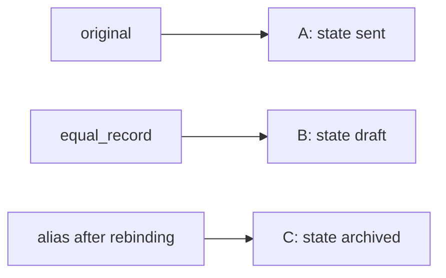

# Separate an object's identity from its current value

Core: predict the demonstration, then use the eight-minute experiment slot for your own list
lab. Spend the final four minutes explaining and recording the result. The copying follow-up
is optional and leads into Day 2.

## One-line answer

Two names can refer to the same object, while two separate objects can compare equal.

## The story

You share an editable shopping list with someone. Changing that shared list is visible to both
of you. Writing the same groceries on a second sheet makes the contents equal at that moment,
but crossing an item off one sheet does not change the other. The distinction is sharing versus
matching, not whether the lists initially look alike.

## The idea in plain language

**Identity** asks whether references point to the same object; Python's `is` tests that relation.
**Equality** asks whether values compare equal according to their type's rules; `==` invokes
that comparison. **Aliasing** occurs when multiple references reach the same object.

**Mutation** changes an existing object's state. **Rebinding** changes which object a name
refers to. Assignment binds a name; it does not implicitly clone the right-hand object.
An object graph is a drawing of these references. Label objects separately from names.

## Why Krama needs it

The DSA contract says not to mutate the caller's list. Renaming that list inside a function
does not create isolation. You can study this Python track independently, but this distinction
also explains why apparently local edits can violate another function's contract.

[Day 2's copying lesson](../../day-002-find-the-first-maximum/lang_shallow-and-deep-copies/README.md)
depends on separating the outer container's identity from the identities of objects it contains.

## The source behind it

Versioned primary references opened on 2026-09-19:

- [3. Data model](https://docs.python.org/3.12/reference/datamodel.html#objects-values-and-types),
  `spec:python-3.12-data-model`: identity, value, mutability, and object references.
- [6. Expressions](https://docs.python.org/3.12/reference/expressions.html#comparisons),
  `spec:python-3.12-expressions`: value comparisons and identity comparisons.
- [copy — Shallow and deep copy operations](https://docs.python.org/3.12/library/copy.html),
  `spec:python-3.12-copy`: assignment and copying, for the optional follow-up.

Use Python 3.12 semantics here. The author experiments ran on Python 3.12.10; the versioned
documentation may display a later maintenance release.

## The mechanism

### When this model helps

Reach for an object graph when changing one value unexpectedly affects another caller,
when a test passes on its own but fails after another test, or when content checks pass but
ownership is still wrong. Ask which objects are shared before choosing a copying strategy.

### Trace the references first

| Operation in the demonstration below | Names and objects afterwards |
| --- | --- |
| Create `original` | `original` reaches dictionary A |
| Set `alias = original` | Both names reach A; no second dictionary is made |
| Create `equal_record` | It reaches B, initially equal in content to A |
| Change an item through `alias` | A changes; both names reaching A observe it; B stays as it was |
| Assign a new dictionary to `alias` | `alias` reaches C; `original` still reaches A |

The useful reasoning rule is to separate changes to arrows from changes inside an object.
The variable name used for a mutation does not give that name exclusive ownership.

Predict every print before running this dictionary demonstration in a scratch session:

```python
original = {"state": "draft"}
alias = original
equal_record = {"state": "draft"}
print("alias identity:", alias is original)
print("equal record:", equal_record == original, equal_record is original)
alias["state"] = "sent"
print("after mutation:", original["state"], equal_record["state"])
alias = {"state": "archived"}
print("after rebinding:", original["state"], alias["state"])
assert original["state"] == "sent"
assert equal_record["state"] == "draft"
assert alias is not original
print("ownership checks: PASS")
```

**Line by line:** `original` names dictionary A. `alias = original` adds another name for A.
The next dictionary literal creates B with matching content. The first two prints separate
sharing from matching. Item assignment through `alias` edits A, which `original` still reaches;
B is independent. The later assignment binds `alias` to a third dictionary C, leaving A as it
was. The assertions protect those three claims, and the final print reports that they held.



Before rebinding, both `original` and `alias` pointed at A. Drawing a new arrow and editing an
existing box are different operations.

Observed output on Python 3.12.10 during author verification on 2026-09-19:

```text
alias identity: True
equal record: True False
after mutation: sent draft
after rebinding: sent archived
ownership checks: PASS
```

In your list lab, distinguish appending through an alias from assigning that alias a new list.
Explain the result using references, not “Python somehow copies the variable.”

## When it breaks

A value comparison cannot establish shared identity. Run this independent false assumption:

```python
first = {"state": "draft"}
second = {"state": "draft"}
try:
    assert first is second, "matching initial content did not create shared identity"
except AssertionError as error:
    print(f"AssertionError: {error}")
assert first == second
assert first is not second
```

**Line by line:** the literals create separate dictionaries. The first assertion deliberately
confuses equal contents with one shared object. The handler prints that failure so the example
continues. The final assertions express the two correct relationships independently.

Observed failure message:

```text
AssertionError: matching initial content did not create shared identity
```

The repair depends on your intention. Compare values with `==` when checking content. Use
`is` when object identity is itself the requirement, such as checking a particular sentinel.
Do not change the comparison merely to make an assertion pass; first state what you intended
the assertion to prove.

## In production

Suppose a request handler retains a reference to a shared configuration dictionary and changes
it. A later request can observe that state. The bug may evade tests that create a fresh object
for every test case. A meaningful regression check runs the interaction using the same shared
object and verifies the promised ownership boundary.

Make mutation permissions explicit in function contracts. A useful review comment is:
“Does this function read, mutate, or retain the supplied object?” Passing a container into a
function does not itself copy it. Isolation must follow from the chosen ownership or copying policy.

Do not use integer or string interning observations as correctness rules. Use `is None` for
the singleton and `==` for ordinary value comparisons. User-defined equality can execute custom
logic; this lesson's dictionary examples do not imply that every type compares by the same rules.

**Optional depth:** a shallow copy creates a new outer container but shares references to its
contents. A nested mutable value can therefore remain shared. Deep copying recursively copies
components, but copying a large object graph has a cost and is not an automatic ownership policy.
Predict which references remain shared before trying either approach in Day 2.

## Check yourself

### Readiness before the lab

Before opening `lab.py`, explain why the trace contains three dictionaries, why the middle
mutation affects `original`, and why the final rebinding does not. Explain which assertion
would check matching contents and which would check that two callers share one object.

For cost awareness, an identity comparison does not walk a container's contents. Equality
can inspect contents and execute user-defined comparisons; copying can allocate new storage.
Choose an operation for the relationship it is meant to test, then consider its cost. Switching
from equality to identity for speed changes the question being answered.

### Independent experiment

Keep [lab.py](lab.py) as your independent exercise. Implement a fresh experiment with:

1. A list and a second name referring to it.
2. A separately created list with equal initial contents.
3. A mutation through the alias, followed by a rebinding of that name.
4. Assertions that distinguish content equality, identity, and the effects of both operations.

Before running, record predictions in [NOTES.md](NOTES.md). From the repository root, run
`python days/day-001-count-target-values/lang_identity-and-equality/lab.py`, then record the
actual output and interpreter version. The starter deliberately raises `NotImplementedError`
until you implement it. The completed teaching demonstrations do not complete this exercise.

Make one deliberately wrong prediction executable as an assertion, observe it fail, and correct
the assertion or code according to your intended contract. Explain the smallest case that
distinguishes your original assumption from the observed behavior.

Say out loud: “Which operation changed an object, which changed only a name's reference, and
what evidence distinguishes those events?”

**Next:** [Run your own experiment](lab.py) and [record its evidence](NOTES.md).

**Later, recall without coding:** [Python summary](../../../docs/LANG_RECALL.md#day-001-identity-equality-and-aliasing).
