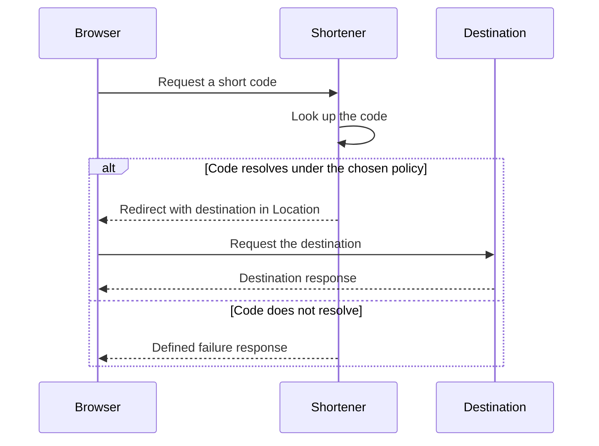

# Turn a product request into observable behavior

Core reading: use this in the ten-minute concept slot. Your deliverable is a short decision memo,
not an implemented service. The production discussion can be revisited during review.

## One-line answer

Functional scope defines what a user can accomplish, the observable result, and the boundaries
of the first version.

## The story

You order groceries and receive “Order created,” but no order number and no way to retrieve it.
The team says creation works; you say the order has disappeared. Both sides used the same word,
“created,” without agreeing on the result a customer should be able to observe.

## The idea in plain language

A **functional requirement** describes an action and its visible outcome. “Use a database” is an
implementation choice; it does not say what a user can do. A useful requirement names the actor,
input, condition, result, and at least one failure response.

An **exclusion** names behavior that the current version deliberately does not promise. It
prevents an unstated expectation from turning into accidental work. An **assumption** is a
statement you temporarily accept for design purposes and still need to confirm. It is not a
measurement or an agreement unless someone has provided that evidence.

A **success criterion** makes a requirement testable. “Fast and reliable” has no pass/fail
boundary. A criterion needs a population or scenario, a measurement, and a target. Functional
success concerns behavior; a quality requirement concerns properties such as delay or availability.
Today, make the behavior precise. [Day 2](../../day-002-find-the-first-maximum/sd_quality-requirements/README.md)
develops quality requirements further.

## Why Krama needs it

An architecture has no useful correctness target until the requirements are clear. The later
link-shortener case study depends on whether links can expire, who owns them, and what resolving
a missing code should do. Choosing storage before answering such questions can optimize the
wrong workload.

## The source behind it

[HTTP Semantics, RFC 9110](https://www.rfc-editor.org/rfc/rfc9110.html), published in 2022;
sections 10.2.2 and 15.4 describe the Location field and redirection responses. Opened on
2026-09-19. These specify protocol behavior, not your product's scope or success targets.

## The mechanism

### When to use this framework

Use a scope memo when a request contains broad verbs such as “manage,” “share,” or “support,”
or when the conversation jumps to databases before agreeing on user behavior. These are cues
that different readers may be imagining different products.

Keep the actor, action, input, result, failure, and exclusions in view. This representation
retains the product decisions needed to evaluate a design while postponing infrastructure
choices that do not yet have a requirement to justify them.

Use this requirement shape:

> Given a stated condition, an actor supplies an input. The service produces an observable
> result. If a named failure occurs, the service produces a defined alternative result.

A worked example from an inventory service:

| Element | Example design choice |
| --- | --- |
| Actor | An inventory operator |
| Input | A valid new item description |
| Condition | The operator is allowed to create items |
| Result | A new item identifier that can be used to retrieve the saved item |
| Failure | Invalid required fields are rejected without creating an item |
| Exclusion | Bulk import is outside this version |
| Acceptance scenario | Create an item, retrieve its identifier, and compare the saved fields |

These are hypothetical choices for teaching. They are not your completed link-shortener answer.

For your service, trace one request before drawing infrastructure. Separate the browser's call
to the shortener from the later request to the destination:



The redirect tells the client where to make another request; it does not itself return the
destination page. A shortener can produce the correct redirect while the destination is down.
Your criterion must state which result it measures. Choose the redirect status and missing-code
policy explicitly when needed; the diagram does not silently settle those choices.

To make a criterion concrete, use a controlled example: “For every valid inventory creation
case in our acceptance suite, the returned identifier retrieves the stored description.” That
defines the population and expected outcome. Passing that suite establishes those tested
scenarios; it does not prove universal correctness or a production availability percentage.

## When it breaks

This author demonstration models a response fixture, not a deployed HTTP service:

```python
response = {"status": 201, "body": {"message": "created"}}
try:
    assert "item_id" in response["body"], "creation response has no retrievable identifier"
except AssertionError as error:
    print(f"AssertionError: {error}")
response["body"]["item_id"] = "item-17"
assert response["status"] == 201 and response["body"]["item_id"] == "item-17"
print("creation contract: PASS")
```

**Line by line:** the first line constructs a response that claims success but omits an identifier.
The assertion asks for an observable piece of the contract. The handler prints the deliberate
failure. Adding `item_id` repairs that response field, and the final assertion checks the fixture's
status and identifier. It does not demonstrate persistence or actual retrieval; a service-level
acceptance test would have to perform the second request.

Observed using Python 3.12.10 on 2026-09-19:

```text
AssertionError: creation response has no retrievable identifier
creation contract: PASS
```

The missing requirement was discoverability after creation. The repair must go into the written
contract as well as the implementation; otherwise another client may repeat the same mistake.

## In production

A professional requirements memo links a small number of user actions to acceptance scenarios,
names the decision owner, and records unresolved choices. It avoids an unbounded list of
features. “We will support analytics later” still needs a boundary today: what does this version
promise to collect, retain, or display?

As usage grows, popular links and failing destinations may distort success measurements. Define
which system is accountable for each outcome. The review comment to anticipate is: “Can two
engineers independently test this requirement and agree on the result?”

Compare one alternative using user impact. For example, accepting anonymous creation changes
who can create links and what ownership means compared with requiring an account. Choose based
on explicit assumptions; there is no universal answer supplied by an HTTP specification.

## Check yourself

### Readiness before the design exercise

Explain why “store links in a database” is insufficient as a user requirement, why a correct
redirect does not prove the destination is available, and how an explicit exclusion changes
an acceptance test. Rewrite “creation works” verbally as an observable action and outcome
using the inventory example before opening your own design template.

The framework is useful when independent readers can agree on what passes. It does not prove
the eventual implementation correct, predict traffic, or settle an unresolved product choice.
Its tradeoff is a little more clarification now in exchange for fewer incompatible assumptions
during implementation. Label an unknown as unknown rather than hiding it in a diagram.

### Independent design memo

Run the fixture demonstration, or manually remove its identifier and apply the stated acceptance
condition. Explain why the repaired fixture still does not prove the whole user journey works.

Now complete [DESIGN.md](DESIGN.md) yourself:

1. State assumptions, including the intended users and any limits you need for this session.
2. Write three link-shortener user actions with observable outcomes.
3. Name two exclusions and explain what each prevents the version from promising.
4. Add one measurable success criterion with a defined scenario or population.
5. Trace one successful request and one failure, naming the user-visible results.
6. Compare one credible alternative and state what new information could change your choice.

Use the twelve-minute writing slot and three-minute critique slot. An unresolved choice can be
recorded as a next step; do not invent an answer and label it agreed. No service implementation
is required.

Say out loud: “Which user outcome does this design guarantee, and which part of the end-to-end
experience is outside that guarantee?”

**Optional deeper reading:** RFC 9110 sections 10.2.2 and 15.4 after drafting the memo. Do not
read the whole specification for this assignment.

**Next:** [Write the design evidence](DESIGN.md).

**Later, recall without a new memo:** [System design summary](../../../docs/SD_RECALL.md#day-001-functional-scope).
