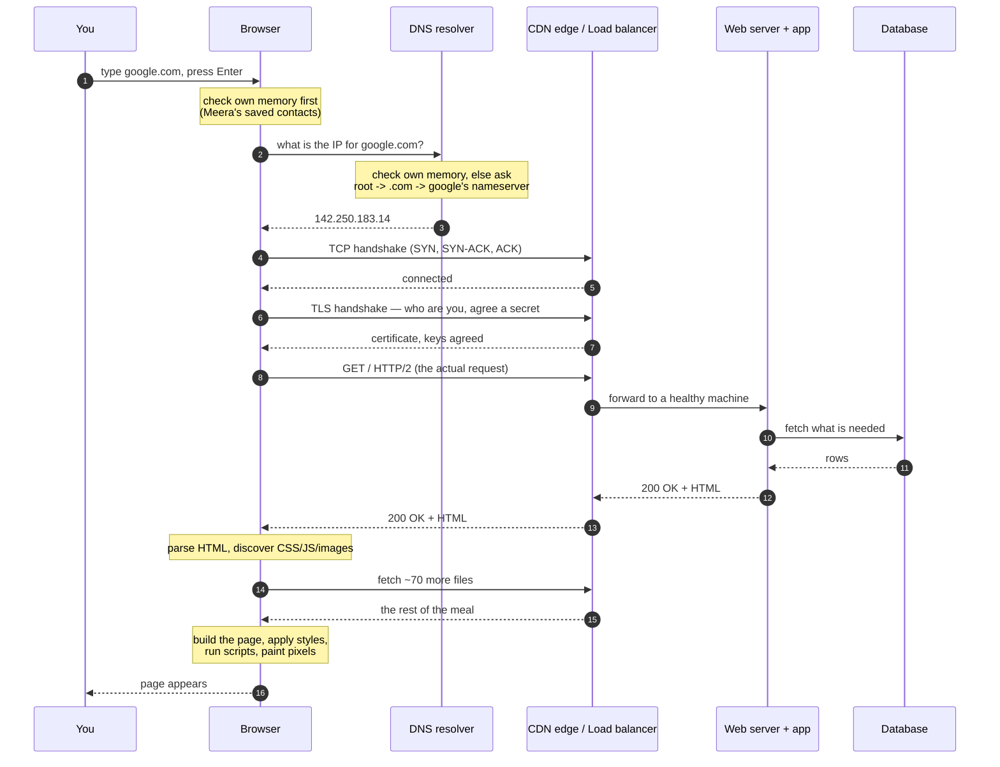

# Day 001 · System Design — What happens when you type google.com and press Enter

**After today you can:** You can narrate the whole journey from keypress to pixels without notes.

**The interviewer asks it as:** *What happens when you type google.com into your browser and hit Enter?*

---

## 1. What this is, and why they ask it

Between your keypress and the page appearing, roughly a dozen separate machines do roughly
a dozen separate jobs. Each one has a name, a purpose, and a way of failing. Today you
learn the whole chain end to end, at low resolution. It is a map, not a survey.

Every box on that map gets its own day later in this course. You are not expected to master
any of them today. You are expected to be able to name them in order.

This is the most-asked warm-up question in the industry, and it has been for twenty years.
Interviewers keep it because it is hard to fake in a useful way. There is no trick and
nothing to memorise cleverly, and the answer expands to fill whatever depth you have. A
candidate with six months of experience gives a two-minute answer. A candidate with six
years gives the same six beats, and then goes forty minutes deep on any one of them when
prodded. It tells the interviewer your level in about ninety seconds, which is exactly what
a warm-up is for.

---

## 2. The story

Meera moved to a new city three weeks ago, and she knows the name of exactly one place to
eat. A colleague has mentioned it twice: Bhai Kitchen, apparently the best biryani for
miles. It is a small place, too small to be on any of the delivery apps, so she has to ring
them herself.

She does not have the number.

She checks her own phone first, because that is where she saves the places she uses.
Nothing. So she goes down to the gate and asks the watchman, who has worked in this lane
for eleven years and knows every shop in it. He does not have the number either, but he
tells her the tea stall on the corner will.

She rings the tea stall. The man there does not have Bhai Kitchen's number, but he does
have the number of the sweet shop next door to it. She rings the sweet shop, and they read
the number out to her. It has taken almost four minutes and three phone calls.

Before she dials, she saves the number in her phone under "Bhai Kitchen", because she is
not doing all of that again on Friday.

She dials, and someone picks up. She says, "Is that Bhai Kitchen?" and waits for them to
say yes before she says anything else, because last month she gave a full order to a
laundry.

Then she speaks slowly and carefully, because every detail matters. "One chicken biryani,
large, extra gravy, no raita. Flat 402, Sunrise Building, behind the petrol pump. Cash when
it arrives." The man repeats the whole thing back to her. Now both of them know exactly
what was agreed.

Then nothing happens for a long while. Forty minutes later a rider is at the gate with a
carrier bag, and inside it are four separate boxes: rice in one, gravy in another, salad,
and a small tub of pickle. Nobody delivers biryani in one box. She carries them upstairs,
opens each one, and lays them out on the table in the order she wants to eat them. Only
now, with everything opened and arranged, is dinner actually in front of her.

On Friday she orders again. This time the number is already in her phone, and the whole
thing is much shorter.

---

## 3. The idea in plain English

Meera's evening is the journey, beat for beat. Here is the mapping.

**The browser.** The program you type into: Chrome, Firefox, Safari. It is the one doing
all of the work below, on your behalf. Meera is the browser.

**The URL.** What you typed: `google.com`. A **URL** is an address for something on the
internet. It has parts. `https://` says how to talk, `google.com` says who to talk to, and
anything after a `/` says which page you want.

**Finding the number: DNS.** Machines on the internet do not find each other by name. They
find each other by number — an **IP address**, something like `142.250.183.14`. So the
browser's first job is to turn the name `google.com` into a number. The system that does
this is called **DNS**, the Domain Name System, and it is the phone directory of the
internet.

That is Meera's whole hunt for the number, including the shape of it. She asked three
places in order, each one wider than the last: her own phone, then someone local whose job
is knowing local numbers, then a chain of people who each knew somebody closer to the
answer. Your browser does exactly the same, and the details are in §5.

Notice what she did before dialling. She saved the number. Storing an answer so that you do
not have to ask for it again is called **caching**, and it is the single most important
idea in this entire course. It gets its own day on
[day 101](../day-101-bfs-level-order/README.md), and it does not stop appearing after that.

*Day 003 goes deep on DNS.*

**Dialling: the TCP connection.** Having the number is not the same as being connected.
Before any information moves, the two machines exchange a short set of messages, to agree
that they can both hear each other and to set up a reliable line. That agreement is a
**TCP connection**, and the opening exchange is called a **handshake**.

*Day 004 goes deep on TCP.*

**"Is that Bhai Kitchen?": the TLS handshake.** Meera confirms who she is speaking to
before she says anything real. Your browser does the same, and it also agrees a secret code
so that nobody listening on the line can understand what follows. This is **TLS**, and it
is what the `s` in `https` means. It costs another exchange of messages.

*Day 006 goes deep on TLS.*

**The order: the HTTP request.** Now the browser states precisely what it wants, in a
strict format that both sides understand. That message is an **HTTP request**. What comes
back is an **HTTP response**. This is the actual conversation. Everything before it was
setup.

*Day 005 goes deep on HTTP.*

**The kitchen.** On the other end, the request arrives at a machine whose entire job is to
receive requests and produce responses: a **web server**. For anything more interesting
than a fixed page, the web server hands the work to application code, which usually needs
to look something up in a **database**, a program built for storing and retrieving
information reliably.

*Day 007 is the web server. Day 025 begins databases.*

**Four boxes, not one.** The rider brings rice, gravy, salad and pickle separately. A web
page arrives the same way. First comes a document called **HTML**, which describes the
structure of the page, and inside it are references to other things the browser must fetch
separately: **CSS** files that say what it should look like, **JavaScript** files that make
it interactive, images, and fonts. A typical page is not one delivery. It is seventy.

**Laying the table: rendering.** Meera unpacks and arranges before she eats. The browser
reads the HTML, builds a tree of the page's structure in memory, applies the CSS to work
out where everything sits and what colour it is, runs the JavaScript, and paints pixels on
your screen. This step is called **rendering**, and it is why a page can be fully
downloaded and still not visible yet.

**Friday.** The second visit is faster because the browser saved things: the number, the
images, the CSS, and sometimes the page itself. That is caching again, and it is the honest
answer to "why is the second load faster".

---

## 4. The picture



**What to notice:** every arrow before `GET /` is setup. Three separate round trips happen
before a single byte of the actual page is requested. That is why §6 is about round trips
and not about download speed, and it is the insight most candidates miss.

The six beats, compressed to something you can hold in your head:

```
  1. NAME  ->  NUMBER      DNS
  2. CONNECT              TCP handshake
  3. VERIFY               TLS handshake
  4. ASK                  HTTP request
  5. ANSWER               HTTP response  (web server -> app -> database -> back)
  6. ASSEMBLE             parse, fetch the rest, render
```

---

## 5. How it actually works

Now the same six beats, with the real machinery and the real names.

### 1. Name to number

The browser does not go straight to the internet. It checks, in this order:

- its **own in-memory DNS cache** (Chrome keeps one, and you can see it at
  `chrome://net-internals/#dns`),
- the **operating system's** cache and the `hosts` file,
- the **resolver** configured for your network, which is usually your internet provider's,
  or a public one such as Google's `8.8.8.8` or Cloudflare's `1.1.1.1`.

If the resolver does not know either, it walks the hierarchy. A **root nameserver** tells
it who handles `.com`, the **`.com` TLD nameserver** tells it who handles `google.com`, and
**Google's authoritative nameserver** gives the final answer. The resolver then remembers
that answer for as long as the record's **TTL** (time to live) allows, which is often 300
seconds.

Big services return a *different* IP depending on where you are asking from, so a user in
Pune and a user in Berlin get different machines. That is how a **CDN** — a content
delivery network such as Cloudflare, Akamai, Fastly or AWS CloudFront — puts a copy of the
site physically near you.

### 2. Connect

**TCP** sets up a reliable, ordered stream with a three-message exchange. The browser sends
`SYN`, the other side replies `SYN-ACK`, and the browser sends `ACK`. That is one full
round trip.

### 3. Verify

**TLS 1.3**, the current version, needs one more round trip. The server presents a
**certificate** signed by an authority the browser already trusts — Let's Encrypt,
DigiCert — proving that it really is `google.com`. Both sides then work out a shared
secret, and everything after this point is encrypted. TLS 1.2, which is still common, needs
two round trips instead of one.

### 4. Ask

The browser sends an HTTP request. In HTTP/2 and HTTP/3 it is compressed binary rather than
the text you may have seen, but it means this:

```
GET / HTTP/2
host: google.com
user-agent: Mozilla/5.0 ...
accept: text/html,...
accept-encoding: gzip, br
cookie: ...
```

### 5. Answer

The request usually lands first on a **load balancer** — AWS ALB, nginx, HAProxy, Envoy —
whose job is to pick one healthy machine out of many and forward the request there. Behind
it sit the **web server** and the **application** (Django, Spring, Express, Go). The
application reads and writes a **database** — PostgreSQL, MySQL, Cassandra, DynamoDB — and
very often checks a fast in-memory store such as **Redis** or **Memcached** first, so that
the database is not touched at all.

The response comes back with a **status code** (`200 OK`, `404 Not Found`, `500 Internal
Server Error`) and the HTML body.

### 6. Assemble

The browser parses the HTML into a **DOM**, a tree of the page's elements. As it parses, it
finds `<link>`, `<script>` and `` tags and starts fetching those too, in parallel over
the same connection. It applies the CSS to compute where every element sits (**layout**),
then draws them (**paint**), then combines the layers (**composite**).

CSS blocks the first paint, because drawing text that you are about to restyle is worse
than waiting. A plain `<script>` tag also blocks parsing, which is why `async` and `defer`
exist, and why scripts traditionally go at the bottom.

---

## 6. The numbers

This is where most candidates go vague, and where you will not. The whole thing is governed
by one quantity: the **round-trip time**, or RTT, which is how long a message takes to get
there and come back.

**Where RTT comes from.** Light in fibre travels at about two-thirds of its speed in a
vacuum, so roughly **200,000 km per second**. Cables do not run in straight lines, so
assume about 1.5 times the map distance.

Mumbai to Northern Virginia is about 13,000 km on the map, so call it 19,500 km of cable:

```
19,500 km ÷ 200,000 km/s = 0.098 s  = ~98 ms one way
                                      ~195 ms round trip
```

That is physics. No amount of money makes it smaller. Measured RTT on that route really is
around 190-220 ms, so the estimate holds.

**Now count the round trips for a first-ever visit**, cross-continent, on TLS 1.3. DNS is
the odd one out here: your resolver is usually close to you, and the root and `.com`
nameservers are answered by machines near you as well, so the whole lookup is much cheaper
than a cross-continent trip. Call it 100 ms in total.

| Step | Round trips | Cost at 195 ms RTT |
|---|---:|---:|
| DNS (nothing cached, full walk, nearby machines) | ~2 | ~100 ms |
| TCP handshake | 1 | 195 ms |
| TLS 1.3 handshake | 1 | 195 ms |
| HTTP request → first byte | 1 | 195 ms |
| **Total before the first byte of HTML** | | **~685 ms** |

That is nearly seven-tenths of a second, and the page has not started downloading.

**Now put a CDN edge 15 ms away** — a machine in Mumbai instead of Virginia. DNS is cached
from an earlier lookup, so it is free:

```
TCP 15 ms + TLS 15 ms + request 15 ms = 45 ms
```

685 ms becomes 45 ms. That is **roughly fifteen times faster, without one line of
application code changing.** This single calculation is why CDNs exist, and being able to
do it out loud is worth more in an interview than knowing any six product names.

**Then the download.** A median web page today is about 2.3 MB, spread across roughly 70
requests. On a 20 Mbps connection:

```
2.3 MB × 8 = 18.4 megabits
18.4 Mb ÷ 20 Mbps = 0.92 s
```

So on a typical connection the bytes take about **920 ms**, and the setup took 685 ms. Both
matter, which is why the answer to "how do I make it faster" is never just one thing.

**And those 70 requests.** Under HTTP/1.1 a browser opens at most 6 connections per host,
so 70 files means about 12 sequential rounds. At 195 ms each, that is 2.3 seconds of pure
waiting. HTTP/2 sends them all down one connection at once and removes almost all of it.
That is the entire reason HTTP/2 exists.

---

## 7. The trade-offs

**Caching buys speed and pays in staleness.** Every layer that remembers an answer — the
browser, the resolver, the CDN, Redis — is a layer that can serve you something out of
date. DNS TTLs are the painful version. Set them to 24 hours and your lookups are free, but
you cannot move your service quickly during an incident. Set them to 60 seconds and you
have bought flexibility at the cost of a constant tax of lookups. There is no correct
answer, only a chosen one.

**TLS buys secrecy and pays a round trip.** In 2010 that was a real argument. It is not any
more. TLS 1.3 cut it to one round trip, session resumption and 0-RTT cut repeat visits to
zero, and the answer today is always "encrypt it". Know the cost, so that you can say why
it no longer decides anything.

**A CDN buys distance and pays in money and complexity.** You now have copies of your
content in fifty places, and a new class of problem: getting rid of a bad copy. Cache
invalidation is genuinely hard, and a CDN is not worth it for an internal tool used by two
hundred people in one office.

**A load balancer buys survivability and pays with a new thing that can fail.** It is worth
it almost always, but the honest sentence is that you have added a machine whose death
takes everything down, so it needs its own backup.
[Day 099](../day-099-binary-trees-in-code/README.md) covers it properly.

**When you would not do it this way at all.** This whole shape — connect, ask, answer,
disconnect — assumes that the client starts every conversation. For a chat app or a live
scoreboard, the server needs to speak first, so you keep a connection open instead
(WebSockets, [day 140](../day-140-bipartite-graphs/README.md)). For two of your own
services talking inside one data centre, the whole HTTP-and-JSON layer is often replaced
with something leaner (gRPC, [day 022](../day-022-anagrams/README.md)).

---

## 8. In the interview

### How it gets asked

- *"What happens when you type google.com and press Enter?"* — the classic, word for word.
- *"Walk me through a request end to end."* — the same question for a backend role.
- *"Why is a page slow the first time and fast after that?"* — the same question again,
  testing whether you actually understand caching or just recite the word.

They are checking two things: whether you know the pieces, and whether you can structure an
answer without rambling. The second matters more.

### What to say out loud, in the first ninety seconds

Open by naming the shape of your answer. This single move makes you sound senior, because
it tells the interviewer that you have a plan:

> "Sure — I'll go through it in six steps: turning the name into an address, opening the
> connection, the security handshake, the request, what happens on the server side, and
> then how the browser actually renders it. Say if you want me to go deeper anywhere."

Then walk the six beats, roughly fifteen seconds each. Do not go deep unprompted. You are
laying out the map so that they can choose where to dig. Finish with the caching point,
because it is the one that shows you understand the system rather than the list:

> "And most of that only happens on the first visit. DNS is cached, the connection can be
> reused, and the browser already has the static files. That's why the second load is a
> different story entirely."

### The follow-ups

**"Where would you put a cache?"**
Five places, and I would add them in this order: the browser, so that repeat visits cost
nothing; a CDN at the edge, for anything static; an in-memory store such as Redis in front
of the database, for hot reads; the database's own buffer pool, which you get for free; and
DNS, which is already cached whether you like it or not. The one that pays back fastest is
almost always the CDN, because it removes both distance and load in a single move.

**"What if DNS fails?"**
Then nothing works, and it takes the site down as completely as the database being gone.
DNS outages are one of the most common causes of large public incidents. The mitigations
are having two independent DNS providers, keeping TTLs sane so that a bad record does not
linger, and remembering that browsers and resolvers holding stale entries will hide the
problem from some users and not others, which makes it maddening to diagnose.

**"Why is the second load faster? Be specific."**
Four separate reasons, and they are not the same reason. The DNS answer is cached, so the
lookup disappears. The TCP connection may be kept alive and reused, so that handshake
disappears. TLS session resumption means the security handshake is shorter or gone. And the
CSS, JavaScript and images are in the browser's cache, so most of those seventy requests
never happen. Together that removes roughly 600 ms of setup and most of a megabyte.

### A model answer

> "I'd break it into six steps.
>
> First, the browser has to turn `google.com` into an IP address, because machines route by
> number, not by name. It checks its own cache, then the OS, then the configured resolver —
> `8.8.8.8`, or whatever the ISP gives you. If nobody has it cached, the resolver walks the
> hierarchy: root, then the `.com` nameserver, then Google's own. Big services answer
> differently depending on where you're asking from, so you get an IP that's near you.
>
> Second, TCP. Three messages — SYN, SYN-ACK, ACK — one round trip, and now there's a
> reliable ordered stream.
>
> Third, TLS, because it's `https`. The server sends a certificate signed by an authority
> the browser trusts, both sides agree a shared secret, and everything after that is
> encrypted. On TLS 1.3 that's one more round trip.
>
> Fourth, the actual HTTP request — `GET /`, with a set of headers.
>
> Fifth, the server side. It typically hits a load balancer first, which picks a healthy
> backend. The application runs, probably checks Redis, falls through to the database if it
> has to, and returns a 200 with HTML.
>
> Sixth, the browser parses that HTML into a DOM, discovers it needs another seventy or so
> files — CSS, JS, images — fetches those, applies styles, runs the scripts, and paints.
>
> The thing I'd highlight is that steps one to four are three or four round trips before a
> single byte of content moves. Cross-continent that's around 200 ms per round trip, so
> you're at half a second before anything useful happens — which is the entire argument for
> putting a CDN close to the user. And on a repeat visit most of it disappears, because DNS
> is cached, the connection is reused, and the static files are already local.
>
> Happy to go deeper on any of those. DNS and the render path are probably the most
> interesting."

That takes about two minutes. It names every piece, gets a real number into the room, and
ends by inviting the interviewer to choose the deep dive.

---

## 9. Recall card

1. Six beats: **name → number, connect, verify, ask, answer, assemble.** DNS, TCP, TLS,
   HTTP request, server work, render.
2. Three round trips of setup happen **before** the first byte of the page is requested.
3. RTT comes from distance: about 200,000 km/s in fibre. Mumbai to Virginia is roughly
   **195 ms** round trip.
4. Moving the answer close to the user (a **CDN**) turned 685 ms of setup into 45 ms. That
   is the biggest single lever there is.
5. The second visit is fast for **four** separate reasons: DNS cached, connection reused,
   TLS resumed, static files cached.
