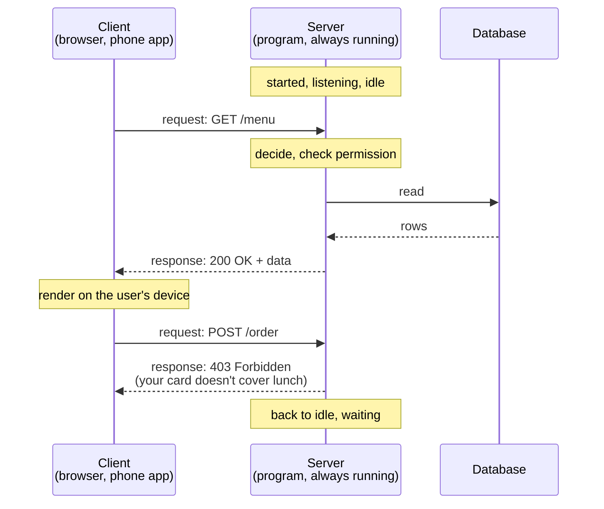

# Day 002 · System Design — Client and server, explained properly

**After today you can:** You can draw the client-server picture and say exactly which machine does what.

**The interviewer asks it as:** *What is the difference between a client and a server? Where does your code live?*

---

## 1. What this is, and why they ask it

A **client** is the program that asks for something. A **server** is the program that waits
to be asked, and answers. Every diagram you will draw for the next 178 days is built out of
those two words and an arrow between them.

Yesterday you followed one request across the whole internet. Today you stop and look
carefully at the two ends of it, because almost every confused answer in a system design
interview comes from being unclear about which machine is doing what.

Interviewers ask this early and they ask it of everybody, including senior candidates. It
sounds like a definitions question and it is not. What they are really testing is whether
you know **where your code runs**, because that single fact decides what you are allowed to
trust, what an attacker can change, and what you have to pay for. A candidate who says "the
browser does the checking" without flinching has just told the interviewer that they would
ship a security hole.

---

## 2. The story

The canteen at Ravi's college opens at eight in the morning and shuts at eight at night. In
three years, Ravi has never seen it closed during the day, and he has never once seen
anybody go behind the counter.

That is the arrangement, and everyone understands it without it ever being explained. You
stand on your side. The kitchen is on the other side. The food, the gas, the big cooking
vessels and the record of who has paid all live on the far side, and you never touch any of
it.

You walk up, and you ask. "One plate of poha and a tea." The man at the counter takes your
money and calls the order through to the kitchen. A few minutes later a plate comes back
through the hatch, and it is yours.

Ravi has thought about all this exactly once, on a morning when he turned up at ten past
eight and the shutters had only just gone up. There was nobody else in the hall. The
kitchen was already hot, the vessels were already full, and the man was standing at the
counter with nothing to do, waiting. Nobody had told him that Ravi was coming. He had
opened up anyway, because his job is to be ready for whoever walks in, including nobody at
all.

At one o'clock it is a different scene. Three hundred students want lunch inside forty
minutes, and there is one counter. The line goes out of the door. The kitchen has not got
slower and the man has not got slower. There are simply more people asking than there are
hands to answer, so everybody waits. By half past two the hall is empty again, and the man
is back to standing there with nothing to do.

Some days you ask and the answer is no. The vada pav is finished. Your meal card covers
breakfast, and it is now noon. You cannot argue your way past either of those, because the
deciding does not happen on your side of the counter. It happens on his.

And when Ravi drops his plate on the way to a table, the kitchen does not care. It still
has the rice, the pans and the recipe. He goes back and asks again.

---

## 3. The idea in plain English

The counter in that story is the most important line in this course. Let us go along it
piece by piece.

**The client is the one who asks.** Ravi is the client. In real systems, the client is
Chrome or Firefox, the app on your phone, or one of your own programs calling another. The
defining feature is not that it is small or that a person is holding it. It is that **the
client starts every conversation**.

**The server is the one that waits and answers.** The counter and the kitchen are the
server. A server never walks over to your table and starts talking. It sits there, already
running, ready for a request that may never come. That is why the kitchen was hot at ten
past eight with nobody in the hall.

**A request and a response.** "One plate of poha" is a **request**. The plate coming back
through the hatch is a **response**. One request, one response, and the client waits in
between. That pattern has a name, **request-response**, and it is the shape of almost
everything you will build.

**The counter is a boundary, and it is the whole point.** Ravi cannot walk behind it. He
cannot look in the vessels, and he cannot mark himself as paid in the record. He can only
ask, and the other side decides what to hand over. In software this boundary is real and
enforced: the client cannot read the server's memory, cannot read its files, and cannot
touch the database directly. It can only send requests.

**Which means the deciding happens on the server side.** "The vada pav is finished" and
"your card doesn't cover lunch" are decisions made behind the counter, where the facts
live. This is the sentence to carry into every interview: **anything the client claims can
be a lie, so anything that matters must be checked on the server.** A price, a user's
identity, whether they are allowed to delete that record — the client may ask, but the
server decides.

**One counter, three hundred students.** A single server handles many clients, and they do
not get a counter each. When more requests arrive than the server can finish, the rest
wait, and the line grows. Nothing has broken and nothing has slowed down; there is simply
more asking than answering. §6 puts numbers on exactly that.

**Dropping the plate.** Ravi's plate is his copy. The kitchen keeps the real thing — the
rice, the pans, the recipe. In software, the client holds a copy of some data and can lose
it at any time by closing the tab, and the server holds the version that counts. That
version is usually kept in a **database**, which is a program built for storing information
reliably, and which we begin on day 025.

**So where does your code live?** In two places, and knowing which is which is the actual
exam question.

The **frontend** is the code that crosses the counter. HTML, CSS and JavaScript are sent to
the client and run on the client's device — on Ravi's tray, in his hands, where he can do
whatever he likes with them. The **backend** is the code that never leaves the kitchen. It
runs on the server's machine, it is the only code that touches the database, and no client
ever sees it.

That is why "the browser will check the price" is the wrong answer, and why "the browser
can check the price to be helpful, but the server must check it again to be safe" is the
right one.

---

## 4. The picture



**What to notice:** every arrow starts at the client. The server never speaks first. It
only ever replies, and between requests it sits idle, which is exactly the man at the
counter at half past two.

Now the boundary itself, which is the picture worth memorising:

```
        YOUR DEVICE                 |            THEIR MACHINE
        (the client)                |            (the server)
                                    |
   +---------------------------+    |    +---------------------------+
   |  browser / phone app      |    |    |  web server (nginx)       |
   |                           |    |    |  application code         |
   |  HTML, CSS, JavaScript    |<---+----|  business rules           |
   |  that was SENT to you     |    |    |  passwords, keys          |
   |                           |    |    |  database connection      |
   |  a copy of some data      |----+--->|                           |
   +---------------------------+    |    +---------------------------+
                                    |               |
   anyone can read and change  <----+               v
   everything on this side          |        +--------------+
                                    |        |   database   |
                                    |        +--------------+
        <-- untrusted -->           |        <-- trusted -->
```

**What to notice:** the frontend files start on the right and end up on the left. Once they
have crossed, they are the user's, and the user can edit them. Nothing on the left can be
trusted, no matter what it says about itself. Everything that decides anything sits on the
right.

---

## 5. How it actually works

### A server is a program, not a building

This is the single biggest beginner misunderstanding, so say it plainly: a server is a
**program that is running and waiting for connections**. It is not special hardware. It is
not a room with cold air. The machine it runs on is often called a server too, which is
where the confusion comes from, but the thing that matters is the process.

To wait for connections, that program **listens on a port**. A **port** is a number from 0
to 65535 that lets one machine run many different listening programs at once and keep them
apart: 80 for plain HTTP, 443 for HTTPS, 5432 for PostgreSQL, 6379 for Redis.
[Day 003](../day-003-big-o-in-plain-english/README.md) goes deep on ports and addresses.

So "the server" is really: this machine, at this IP address, running this program, listening
on this port. Real ones you will meet by name: **nginx** and **Apache** as web servers,
**gunicorn** and **uvicorn** running Python applications, **Node.js** with Express,
**Spring Boot** for Java. [Day 007](../day-007-space-complexity/README.md) is about what a
web server actually does all day.

Real clients, likewise: **Chrome**, **Firefox** and **Safari**; the Instagram app on a
phone; **curl** and **Postman** when you are testing; and very often another one of your own
services, because a program can be a client and a server at the same time.

### The same machine can be both

When you run a web application on your own laptop and open `http://localhost:8000`, your
laptop is the client *and* the server. `localhost`, also written `127.0.0.1`, means "this
same machine". The request goes out of the browser, into the operating system, and straight
back into your own program without ever touching a network cable.

This is worth doing once, deliberately, because it kills the "server means a distant
building" idea for good.

### What actually happens on a request

1. The server program starts and calls `listen()` on a port. It now sits idle.
2. A client connects to that IP and port, and the operating system completes the TCP
   handshake from day 001.
3. The client sends a request. The server reads it, works out what is being asked, checks
   whether this client is allowed it, reads or writes the database, and builds a response.
4. The response goes back, and the connection is either closed or kept open for reuse.
5. The server returns to waiting. It usually remembers nothing about you.

That last point has a name. An HTTP server is normally **stateless**: each request must
carry everything needed to understand it, because the server kept nothing from last time.
Your identity travels in a cookie or a token on every single request. Anything worth
keeping is written to the database or to **Redis**, not held in the server's memory.

The payoff is enormous, and it is worth saying out loud in an interview: because no server
remembers anything, any server can answer any request, so you can put twenty identical
machines behind a load balancer and it makes no difference which one you get.
[Day 099](../day-099-binary-trees-in-code/README.md) covers that.

### Many clients at once

One server program handles thousands of clients at the same time. There are three common
ways it does that: many processes (nginx workers), many threads (a Java thread pool), or
one thread doing an event loop (Node.js, or Python's asyncio). Connections that arrive
faster than the server can accept them wait in a queue called the **backlog**, and when
that fills up, new connections are refused outright.
[Day 008](../day-008-reading-a-problem/README.md) covers processes and threads properly.

### When it fails

If the server process dies, every client gets a connection error, and clients retry. If a
client dies, the server barely notices; it cleans up the connection and carries on. That
asymmetry is why the server holds anything worth keeping. The kitchen survives a dropped
plate. A dropped kitchen is a different kind of day.

---

## 6. The numbers

**How much one server can do.** Take an ordinary small cloud machine: 2 vCPUs. Say each
request needs 20 ms of processing.

```
2 vCPU × 1,000 ms of CPU per second = 2,000 ms of work available per second
2,000 ms ÷ 20 ms per request        = 100 requests per second
```

One hundred requests a second, from one modest machine. Hold on to that figure; it is a
useful reference point for the rest of the course.

**Now size the college app.** 5,000 students, and each of them makes about 20 requests a
day:

```
5,000 × 20            = 100,000 requests per day
100,000 ÷ 86,400 s    = 1.16 requests per second on average
```

Just over one request a second, against a capacity of 100. Traffic is never flat, though,
so assume the lunchtime peak is ten times the average: 12 requests a second. Still eight
times inside what one machine can do. **One server, and no load balancer.** Being able to
say that, with the arithmetic behind it, is worth more than proposing microservices.

**Now the version that needs more than one machine.** Same app, 5 million users:

```
5,000,000 × 20        = 100,000,000 requests per day
100,000,000 ÷ 86,400  = 1,157 requests per second on average
× 3 for peak          = 3,500 requests per second
3,500 ÷ 100           = 35 machines, so call it 50 with headroom
```

That single division is the whole reason load balancers and horizontal scaling exist. The
shape of the system did not change. The arithmetic did.

**The lunchtime queue, with real numbers.** The story said 300 students in 40 minutes,
through one counter:

```
arrivals: 300 students ÷ 2,400 seconds = 0.125 students per second
service : 1 student every 20 seconds   = 0.05  students per second
```

Arrivals are two and a half times what the counter can serve. The line does not settle at
some length — it **grows for the whole 40 minutes**, and only drains after the rush ends.
This is the single most useful queueing fact in system design: once arrival rate passes
service rate, waiting time does not rise a little, it rises without limit until the traffic
stops. A server at 100% capacity is not "fully used". It is a queue that is getting longer.

**Memory per connection.** Roughly 10 KB of kernel and application memory per open
connection:

```
10,000 concurrent connections × 10 KB = 100 MB
```

Which is nothing. Connections are cheap; the CPU work behind them is not. That is why
"10,000 users are connected" and "10,000 requests are in flight" are completely different
statements.

**Bandwidth out.** If each response is 2 KB:

```
100,000,000 responses × 2 KB = 200 GB per day leaving the server
```

At cloud egress prices of roughly $0.09 per GB, that is about $18 a day, or $540 a month,
just to hand the bytes over. Frontend files served from a CDN instead are the usual fix.

---

## 7. The trade-offs

**Work on the client is free to you, and cannot be trusted.** Every calculation you push
into the browser costs you no CPU, no bandwidth and no round trip, and it feels instant to
the user. But the code is on the user's device, so they can read it, change it, or skip it
entirely with a single `curl` command. Validation, pricing and permission checks that live
only in the frontend are not checks at all. The rule that survives every interview: **check
on the client for a good experience, check again on the server for correctness.**

**Work on the server is trustworthy, and you pay for all of it.** Every request is your CPU,
your bandwidth and your bill, plus a round trip the user waits through. A thick client that
does its own rendering and calculation is why single-page applications took over.

**Stateless servers cost a lookup and buy you scale.** Keeping nothing between requests
means reading the session from Redis or the database every single time, which is real work.
What you get is that any machine can serve any request, so scaling is just adding machines.
The alternative — sticky sessions, where a user is pinned to one machine that remembers
them — saves the lookup and gives you a nasty failure mode: when that machine dies,
everybody it was holding gets logged out.

**I would not use client-server at all if...** the two ends need to talk to each other
directly and constantly. A one-to-one video call routed through a server means every frame
travels twice and you pay for all of it, so real calls use peer-to-peer WebRTC and only
fall back to a relay when the network forces it. File sharing at scale is the same argument,
which is what BitTorrent is. And a note-taking app that must work on a train with no signal
has to be offline-first, with the client holding the real copy and reconciling later, which
is a genuinely harder design.

**And when the server must speak first**, this whole shape does not fit. Chat, live scores
and notifications need the server to push, which means holding a connection open —
WebSockets, on [day 140](../day-140-bipartite-graphs/README.md).

---

## 8. In the interview

### How it gets asked

- *"What's the difference between a client and a server?"* — the plain version, usually in
  the first five minutes, and usually as a warm-up before something harder.
- *"Where does your code run?"* or *"which part of this runs in the browser?"* — the version
  that actually separates candidates.
- *"A user changes the price in the browser before checking out. What happens?"* — the same
  question dressed as a scenario. This is the one they remember your answer to.

### What to say out loud, in the first ninety seconds

Do not recite definitions. Draw the boundary and put things on either side of it.

1. **Give the one-line difference.** *"The client asks, the server waits and answers. The
   client always starts the conversation."*
2. **Say what a server actually is.** *"A server isn't special hardware — it's a program
   that's running and listening on a port, ready for requests that may never come."*
3. **Draw the line and name both sides.** Frontend on the left, backend and database on the
   right.
4. **Say what crosses it.** *"HTML, CSS and JavaScript get sent to the client and run on
   the user's device. The application code and the database credentials never leave the
   server."*
5. **State the consequence, unprompted.** *"Which means everything on the client side is
   untrusted. Anything that matters gets checked again on the server."*
6. **Offer the next layer.** *"Happy to go into how one server handles many clients at
   once, or what happens when one machine isn't enough."*

Step 5 is the one that gets you the follow-up you want, rather than the one you fear.

### The follow-ups

**"Is a server special hardware?"**
No. It is a process listening on a port. The machine may be a rack in a data centre or it
may be your laptop — when you run an app locally and hit `localhost:8000`, your laptop is
both client and server at once. What makes something a server is the waiting, not the metal.

**"Can one program be both a client and a server?"**
Constantly, and in real systems it is normal. Your web application is a server to the
browser and a client to PostgreSQL and to Redis. The moment it calls a payments provider it
is a client again. "Client" and "server" describe a role in one conversation, not a
permanent identity.

**"A user edits the price in the browser and submits the order. What happens?"**
Nothing, if it is built correctly, because the browser never gets to decide the price. The
client sends a product id and a quantity, and the server looks the price up itself and
computes the total. If your API accepts a price from the client, you have a hole, and
somebody will find it. The general rule: the client sends *intent*, the server determines
*facts*.

### A model answer

> "The client is whatever asks for something, and the server is whatever waits to be asked
> and answers. The important asymmetry is that the client always starts the conversation —
> a server never contacts you out of nowhere; it sits there listening on a port until a
> request arrives.
>
> A server isn't special hardware, which I think is the common confusion. It's a program in
> a listening state. My laptop running a local app on port 8000 is a real server; it's just
> one with a single user.
>
> On where the code lives, I'd split it at the network boundary. The frontend — HTML, CSS,
> JavaScript — is sent across to the client and executes on the user's device. The backend —
> the application logic, the database credentials, the business rules — never leaves the
> server. The database sits behind the server and the client can't reach it at all.
>
> The consequence I always want to state explicitly is that everything on the client side
> is untrusted. The user can read the JavaScript, modify it, or skip the browser entirely
> and hit the API with curl. So client-side validation is for user experience, and
> server-side validation is for correctness. If a price or a permission check only exists in
> the frontend, it doesn't exist.
>
> The other thing worth mentioning is that HTTP servers are usually stateless — they keep
> nothing between requests, and identity travels in a token on each one. That's slightly
> more work per request, and in exchange any machine can serve any request, which is what
> lets you scale by adding machines instead of by making one bigger."

That is about ninety seconds. It defines both terms, kills the hardware misconception,
answers the "where does your code live" half properly, and volunteers the security
consequence before being asked.

---

## 9. Recall card

1. **The client asks. The server waits and answers.** The client always starts the
   conversation.
2. A server is a **program listening on a port**, not special hardware. Your own laptop can
   be one.
3. Frontend code **crosses the boundary** and runs on the user's device. Backend code and
   database credentials never leave the server.
4. Therefore the client is **untrusted**. Client-side checks are for experience;
   server-side checks are for correctness. The client sends intent, the server decides
   facts.
5. Servers are usually **stateless**, so any machine can answer any request. That is what
   makes adding machines work.
