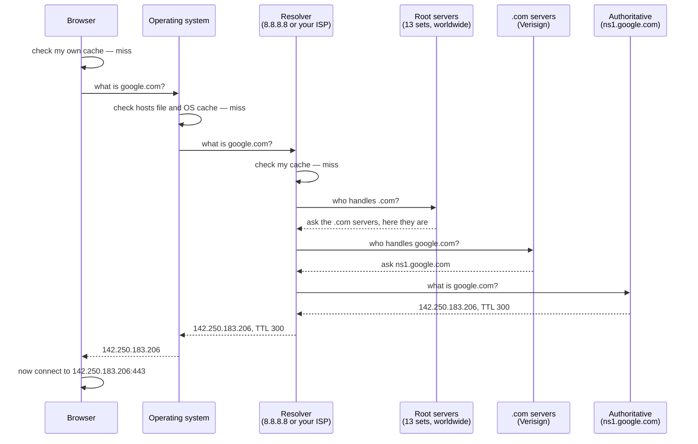

# Day 003 · System Design — IP addresses, ports, and DNS

**After today you can:** You can explain how a name becomes a machine, and what a port is for.

**The interviewer asks it as:** *How does the browser find the server for google.com?*

---

## 1. What this is, and why they ask it

An **IP address** is the number that identifies one machine on the internet, the way a
street address identifies one building. A **port** is a second number that says which
program on that machine you want, the way a flat number says which door inside the
building. **DNS** — the Domain Name System — is the lookup service that turns a name people
can remember, like `google.com`, into the number the network actually needs.

On day 001 you followed a request across the internet and the DNS step went past quickly.
Today you stop on it, because it is the step interviewers dig into most.

They ask because DNS is where three things meet: naming, caching and failure. A candidate
who can walk the resolution chain, name what is cached at each hop, and then say what a
TTL of sixty seconds costs you, has demonstrated more than trivia. They have shown they
understand that **every layer of the internet is somebody's lookup table**, and that every
lookup table has a staleness problem. That is the actual subject of this lesson.

---

## 2. The story

Ravi is going to a friend's flat for the first time. Anjali has moved into one of those
large housing societies off the ring road — six towers, all cream-coloured, all identical,
built at the same time by the same builder.

He knows two things. He knows her name, and he knows the name of the society. He does not
know which tower, and he does not know which flat.

At the gate there is a guard in a small cabin with a tablet mounted on a stand. Ravi says
he is here to see Anjali Sharma. The guard types the surname in, gets four Sharmas, and
reads out the towers. Ravi says the flat is a new one, taken in April. The guard scrolls,
finds it, and says: Tower C, seventh floor, flat 704. It takes about twenty seconds.

Ravi walks in and now the walking is easy, because Tower C is signposted and the lift has
buttons. Getting to the seventh floor takes no thinking at all. **All the difficulty was at
the gate.** Once he had the number, the rest was mechanical.

He knocks at 704. Anjali's father opens the door. Ravi asks for Anjali, and her father
calls her. This matters more than it looks: reaching the right door is not the same as
reaching the right person. There are four people living behind that one door, and the door
number alone does not say which of them you want.

On the way out he does the sensible thing. He saves it in his phone: *Anjali — Tower C, 704*.

Three weeks later he visits again, and this time he walks straight past the cabin without
stopping. He does not need the guard. He has it saved.

But in October he goes again, and knocks, and a woman he has never seen opens the door.
Anjali's family moved out in August, one tower over, to a bigger flat. What Ravi had saved
was correct in April, correct in May, and quietly wrong from August onwards. Nobody came and
told him. He had no way of knowing it had gone stale until he was standing at the wrong
door.

So he walks back to the gate and asks the guard again.

---

## 3. The idea in plain English

Everything in that story maps onto one part of how a name becomes a machine. Take it piece
by piece.

**The society is the internet, and the tower-and-flat number is an IP address.** An **IP
address** is a number that identifies one machine on a network. There are two kinds you
will meet. **IPv4** looks like `142.250.183.206` — four numbers, each from 0 to 255, joined
by dots. **IPv6** looks like `2404:6800:4009:82f::200e` — much longer, written in hex, and
it exists because IPv4 ran out of numbers. Every request you make goes to an IP address,
always. Names are a convenience laid over the top.

**"Anjali Sharma" is the domain name.** A **domain name** is a human-readable label for a
machine or a group of machines: `google.com`, `leetcode.com`, `api.github.com`. Names are
for people. Machines do not use them.

**The guard with the tablet is DNS.** The **Domain Name System** is a worldwide lookup
service whose only job is to answer "what is the IP address for this name?". Your machine
cannot connect to `google.com` any more than Ravi could walk to "Anjali Sharma". Something
has to convert the one into the other first, and DNS is that something.

**The father opening the door is the port.** Reaching flat 704 gets you to the right
machine. It does not say which program you want. A single machine can be running a web
server, a mail server and a database all at once, and a **port** — a number from 0 to
65535 — is how they are told apart. Some are conventional and worth memorising:

| Port | What listens there |
|---|---|
| 80 | HTTP, plain web traffic |
| 443 | HTTPS, encrypted web traffic |
| 22 | SSH, remote login |
| 5432 | PostgreSQL |
| 3306 | MySQL |
| 6379 | Redis |
| 27017 | MongoDB |

So a full destination is not one number. It is **IP address plus port**, written
`142.250.183.206:443`. That pair is called a **socket address**, and it is what a connection
actually points at. When you type `https://google.com` and no port, the browser silently
adds `:443`, because `https` means 443 by convention.

**Saving it in his phone is caching.** A **cache** is a local copy of an answer, kept so
that you do not have to ask again. Ravi cached the flat number and skipped the gate. Your
machine caches DNS answers and skips the lookup. This is why the second visit to a website
starts faster than the first.

**The family moving out is the staleness problem, and it is the reason for TTL.** Every DNS
answer comes with a **TTL** — time to live — which is a number of seconds saying how long
the answer may be trusted before it must be looked up again. A TTL of 300 means "believe
this for five minutes". Nobody pushes an update out to everyone holding an old answer.
The old answer simply expires. That single design decision explains almost every DNS
question an interviewer will ask you.

**Twenty seconds at the gate, then a trivial walk.** That is the honest shape of it. DNS
resolution can cost tens of milliseconds on a cold lookup, and then the connection itself is
fast. Which is why a slow DNS setup makes an otherwise quick site feel sluggish on the
first visit.

---

## 4. The picture

Here is what actually happens when you type `google.com`, drawn as the chain of questions.



**What to notice:** there are **four** caches on that path — the browser's, the operating
system's, the resolver's, and often one at your router as well. A cold lookup walks the
whole chain. A warm one stops at the first line. In real traffic the vast majority stop
early, which is the only reason the thirteen root server sets can survive the entire
internet asking them questions.

Now the address itself, laid out so that each part has a name:

```
        https://api.github.com:443/repos/python/cpython
        |       |               |   |
        |       |               |   +-- path: what you want from that program
        |       |               +------ port: WHICH PROGRAM on the machine
        |       +---------------------- name: resolved by DNS to an IP address
        +------------------------------ scheme: implies port 443 if none is given


        after DNS resolves, the connection is really to:

                 140.82.121.6 : 443
                 |              |
                 |              +--- one of 65,536 doors on that machine
                 +------------------ one machine on the internet
```

**What to notice:** the name disappears once DNS has done its work. The connection is made
to a number. The name is never sent over the network as an address — though it *is* sent
inside the request, as a header, so that one machine can host many sites. That detail is
the whole reason shared hosting works, and it comes back on
[day 005](../day-005-python-lists-and-tuples/README.md).

And here is the tree that DNS is actually walking, which is why the chain goes right to
left:

```
                            .           <- the root
                            |
            +---------------+---------------+
            |               |               |
          .com            .org            .in     <- top-level domains
            |
      +-----+-----+
      |           |
   google      github                             <- second level
      |           |
  +---+---+       +----------+
  |       |       |          |
 www     mail    api        www                   <- subdomains
```

**What to notice:** `api.github.com` is read **backwards** by DNS — root first, then `.com`,
then `github`, then `api`. That is why the trailing dot in `google.com.` is technically
correct: it names the root.

---

## 5. How it actually works

### The four caches, in order

1. **The browser's own cache.** Chrome keeps DNS answers for about a minute. You can see
   them at `chrome://net-internals/#dns`.
2. **The operating system's cache**, plus the **hosts file** — a plain text file that
   overrides DNS entirely. On Linux and macOS it is `/etc/hosts`; on Windows it is
   `C:\Windows\System32\drivers\etc\hosts`. Putting `127.0.0.1 myapp.local` in it is how
   developers point a real-looking name at their own machine.
3. **The resolver**, also called the recursive resolver. This is the one that does the
   actual work of walking the chain. Yours is either your ISP's, or a public one you chose:
   **Cloudflare's `1.1.1.1`**, **Google's `8.8.8.8`**, or **Quad9's `9.9.9.9`**.
4. **The authoritative name servers**, which hold the real answer. **Amazon Route 53**,
   **Cloudflare DNS**, **NS1** and **Google Cloud DNS** are the big managed ones; **BIND**
   is the classic software you run yourself.

The word **recursive** is worth pinning down, because interviewers use it. Your machine
sends one question and gets one final answer — that is a **recursive** query. The resolver
then does the walking, asking root, then TLD, then authoritative, each of which answers with
a referral rather than the answer — those are **iterative** queries. Your machine is lazy on
purpose. The resolver does the legwork.

### What is actually stored

DNS holds **records**, and each record has a type. These are the ones that come up:

| Type | Holds | Example |
|---|---|---|
| `A` | an IPv4 address | `google.com → 142.250.183.206` |
| `AAAA` | an IPv6 address | `google.com → 2404:6800:4009:82f::200e` |
| `CNAME` | another name to look up instead | `www.example.com → example.com` |
| `MX` | where to deliver mail | `gmail-smtp-in.l.google.com`, with a priority |
| `NS` | which name servers are authoritative | `ns1.google.com` |
| `TXT` | arbitrary text | domain ownership proofs, SPF records |

You can see all of this yourself. `dig google.com` on Linux or macOS, `nslookup google.com`
on Windows, and the answer comes back with the TTL in it.

### One name, many machines

A single name can hold several `A` records, and the resolver hands them out in rotation.
That is **DNS round-robin**, the oldest and crudest form of load balancing. Big providers do
something better: **anycast**, where the *same* IP address is announced from data centres on
several continents at once, and the network routes you to the nearest one. `1.1.1.1` is
anycast, which is why it answers in under ten milliseconds almost everywhere on earth.

**CDNs** — content delivery networks like **Cloudflare**, **Akamai** and **CloudFront** —
use DNS as their steering wheel. When you look up a CDN-hosted name, the authoritative
server looks at where the question came from and returns the IP address of the nearest
edge location. The name is the same everywhere. The answer is not.

### Private addresses and NAT

Not every IP address is reachable from the internet. Three ranges are reserved for private
networks:

```
10.0.0.0     - 10.255.255.255
172.16.0.0   - 172.31.255.255
192.168.0.0  - 192.168.255.255
```

Your laptop almost certainly has one of these. Your router holds one real public address and
performs **NAT** — network address translation — rewriting the addresses on the way out so
that every device in your house shares that one public address. It keeps a table of which
internal machine each outbound connection belongs to, so that replies get back to the right
one. This is also why an incoming connection to your laptop does not work without port
forwarding: there is nothing in the table to match it against.

And `127.0.0.1`, called **localhost** or the loopback address, means "this same machine". A
request to it never touches a network cable.

### When it fails

If DNS is down, everything looks down. The machines are fine, the sites are running, and
nobody can reach them because nobody can turn names into numbers. This has happened at scale
more than once — a misconfigured DNS change took Facebook off the internet for six hours in
October 2021, and it also locked their engineers out of the tools they needed to fix it.

The failure mode you will meet more often is **stale cache**: you change a record, and some
users move to the new address immediately while others keep hitting the old one until their
TTL expires. There is no way to force them. This is Ravi at the wrong door.

---

## 6. The numbers

**How many addresses there are.** IPv4 uses 32 bits:

```
2^32 = 4,294,967,296 addresses
```

Around 4.3 billion, for a world with more than 5 billion internet users and many devices
each. They ran out, which is why NAT is everywhere and why IPv6 exists:

```
2^128 = 340,282,366,920,938,463,463,374,607,431,768,211,456
```

That is about 3.4 × 10³⁸ — enough to give every grain of sand on earth its own address
several times over.

**How many ports.** Port numbers are 16 bits:

```
2^16 = 65,536 ports (0 to 65535)
```

Ports 0–1023 are **well-known** and need administrator rights to bind on Unix. That is why a
development app defaults to 8000 or 3000 rather than 80.

**What a DNS lookup costs.** A cold lookup that walks the whole chain:

```
browser + OS cache miss           ~0 ms
resolver, over the network        ~15 ms
  root referral                   ~20 ms
  TLD referral                    ~25 ms
  authoritative answer            ~30 ms
                                  -------
total for a cold lookup           ~90 ms
```

Ninety milliseconds before a single byte of the actual request has been sent. A warm lookup
from the browser cache is effectively **0 ms**. That gap is why the first visit to a site
feels different from the second, and why page-load work often begins with reducing the
number of distinct names a page has to resolve.

**What TTL costs you.** Suppose a service has 1,000,000 users, each making 20 requests a
day, all to one name.

With a **TTL of 86,400 seconds** (24 hours), each user resolves once a day:

```
1,000,000 lookups per day / 86,400 s = 11.6 DNS queries per second
```

With a **TTL of 60 seconds**, each user resolves at the start of each minute they are
active. Say each user is active for 10 minutes a day:

```
1,000,000 users x 10 lookups = 10,000,000 lookups per day
10,000,000 / 86,400 = 116 DNS queries per second
```

Ten times the DNS traffic. In exchange, when you change the address, everybody has moved
within a minute rather than within a day. **That is the entire TTL trade, and it is
arithmetic, not opinion.**

**What a slow failover costs.** If you rely on DNS to move traffic off a dead machine, with
a TTL of 300 seconds:

```
worst case for a user holding a fresh answer = 300 s = 5 minutes of errors
```

Five minutes is an eternity for a payment system. That is why real failover is done by a
load balancer at a fixed IP address, and DNS handles only the slow, planned moves.

**Response sizes.** A DNS query is about 50 bytes and an answer about 100–500 bytes, over
UDP, in a single packet each way. That smallness is deliberate — it is what makes a lookup
one round trip instead of a conversation.

---

## 7. The trade-offs

**A long TTL is cheap and slow to change.** Set 24 hours and you get almost no DNS traffic,
very fast lookups for repeat visitors, and a system that shrugs off a resolver outage. You
also get a full day during which some fraction of your users are pointed at a machine you
have retired. You cannot recall an answer once it has been handed out.

**A short TTL is expensive and nimble.** Sixty seconds means you can move traffic in a
minute, which is what you want the day before a migration. It also multiplies your DNS
query volume, adds a lookup to more requests, and — the part people forget — makes DNS a
hard dependency on your critical path. If your DNS provider has a bad ten minutes, a long
TTL hides it and a short TTL exposes it. The usual practice is a long TTL normally, dropped
to sixty seconds a day before a planned change, and raised again afterwards.

**DNS-based load balancing is free and blunt.** Returning several `A` records costs nothing
and needs no infrastructure. But DNS cannot see health, so it will happily hand out the
address of a machine that died two minutes ago; it cannot see load, so it cannot send a
request to the least busy machine; and caching means you have no control over the actual
distribution. A real **load balancer** — nginx, HAProxy, or AWS ALB — sits at one address,
checks health continuously, and decides per request. You usually want both: DNS to get
users to the right *region*, a load balancer to pick the right *machine*.

**CNAME versus A record.** A `CNAME` points one name at another, so when the target's IP
changes you change nothing. That is why you point `www.yoursite.com` at a CDN's name rather
than at its address. The cost is a second lookup, and the rule that a `CNAME` cannot exist
at the root of a domain — `example.com` itself cannot be a `CNAME`, only `www.example.com`
can. Providers work around this with non-standard extensions such as Route 53's alias
records.

**Public resolver versus your ISP's.** Cloudflare's `1.1.1.1` is usually faster, does not
sell your query history, and supports encrypted DNS. Your ISP's resolver may be closer, and
it may also be doing things you would not choose — logging, injecting ads into failed
lookups, or blocking sites. The reason `1.1.1.1` and `8.8.8.8` exist at all is that a
resolver sees every name you visit, which is a remarkably complete record of your life.

**I would not lean on DNS if...** I needed sub-second failover, per-request routing
decisions, or any guarantee about *which* machine a given user reaches. DNS is a caching
system, and caching systems trade freshness for cheapness. Put anything that has to be
immediate behind a fixed address and a load balancer instead.

---

## 8. In the interview

### How it gets asked

- *"How does the browser find the server for google.com?"* — the direct version, usually as
  a follow-up to the day-001 "what happens when you type google.com" question.
- *"What is a port, and why do we need one?"* — the short version, which is really checking
  that you know an IP address alone is not enough.
- *"You've changed your server's IP address. How long until all users hit the new one?"* —
  the good version. It is a TTL question wearing a scenario.
- *"Can two services run on the same machine on the same port?"* — a precision check.

### What to say out loud, in the first ninety seconds

1. **Say what has to happen and why.** *"The browser can't connect to a name — it needs an
   IP address, so the first step is a DNS lookup."*
2. **Walk the caches in order.** *"It checks its own cache, then the OS cache and the hosts
   file, then it asks a resolver — the ISP's, or 8.8.8.8."*
3. **Walk the chain, right to left.** *"On a miss, the resolver asks a root server, which
   refers it to the .com servers, which refer it to Google's authoritative name servers,
   which give the actual A record."*
4. **Mention the TTL, unprompted.** *"The answer comes back with a TTL, so every cache on
   the way holds it for that long."*
5. **Then the port.** *"Now it has 142.250.183.206, and because the scheme is https it
   connects to port 443. The IP picks the machine; the port picks the program."*
6. **Offer the next layer.** *"From there it's the TCP handshake and then TLS — happy to go
   into either."*

Step 4 is the one that changes the conversation. It is the difference between reciting a
chain and understanding what the chain costs.

### The follow-ups

**"What's the difference between an IP address and a port?"**
The IP address identifies the machine; the port identifies the program on it. One machine
with one address can run a web server on 443, a database on 5432 and SSH on 22 at the same
time, and the port is the only thing keeping those apart. A connection is really defined by
four things — source IP, source port, destination IP, destination port — and that
four-part combination is what lets you have many simultaneous connections to the same site.

**"You change your server's IP. How long until everyone moves?"**
Up to one TTL, and there is no way to hurry it. If the TTL was 24 hours, some users will
keep hitting the old address for the rest of the day, because nobody notifies a cache. The
professional answer is to plan for it: drop the TTL to sixty seconds a day or two before
the change, make the change, keep the old machine answering during the transition, then
raise the TTL again once traffic has drained.

**"Can two programs listen on the same port on one machine?"**
Not on the same IP address and protocol — the second one gets
`OSError: [Errno 98] Address already in use`. They can if they bind different addresses on
a machine with several, and TCP port 8000 and UDP port 8000 are genuinely separate. This is
also why the standard trick is one web server on 443 that routes by hostname to many
applications behind it, rather than many programs fighting over the port.

**"Is DNS a single point of failure?"**
For your domain, effectively yes, which is why the design has redundancy built in. Domains
list at least two `NS` records, the root is thirteen anycast sets rather than thirteen
machines, and serious operators run authoritative DNS with two independent providers. When
DNS does fail, everything looks down even though nothing is, which is what makes it so
memorable when it happens.

### A model answer

> "The browser can't connect to a name, only to an IP address, so the first thing that
> happens is a DNS lookup.
>
> It checks caches in order — its own, then the operating system's, which also means the
> hosts file. If nothing has it, the request goes to a recursive resolver, either the ISP's
> or something like 1.1.1.1 or 8.8.8.8.
>
> If the resolver doesn't have it cached either, it walks the tree from the top. It asks a
> root server, which doesn't know google.com but does know who runs .com, and refers it to
> Verisign's TLD servers. Those refer it to Google's authoritative name servers. Those hold
> the actual A record and return 142.250.183.206, along with a TTL — say 300 seconds.
>
> Every cache on the way back holds that answer for the TTL. So the vast majority of real
> lookups never reach the root at all, which is the only reason this design scales.
>
> Now the browser has an address, and it needs a port. The scheme is https, so that's 443
> by convention. It opens a TCP connection to 142.250.183.206 on port 443, does the TLS
> handshake, and sends the HTTP request. The IP address chose the machine; the port chose
> which program on that machine answers.
>
> The part I'd flag in a design discussion is that TTL. It's the only control you have over
> how fast a change propagates, and it's a straight trade — a long TTL means fewer lookups
> and a faster site but a slow rollout, a short TTL means you can move traffic in a minute
> but DNS is now on your critical path. If I needed genuinely fast failover I wouldn't use
> DNS for it at all; I'd put a load balancer at a fixed address and let it do health checks."

That covers the chain, the caching, the port, and finishes on a trade-off — which is what
turns a recital into a design answer.

---

## 9. Recall card

1. **IP address picks the machine. Port picks the program.** A destination is the pair:
   `142.250.183.206:443`. HTTP is 80, HTTPS is 443, PostgreSQL is 5432, Redis is 6379.
2. **DNS turns a name into an address.** The chain is browser cache → OS cache and hosts
   file → resolver → root → TLD → authoritative.
3. **Four caches sit on that path**, and almost every real lookup stops at one of the first
   two. That is why the root servers survive.
4. **TTL is the only control you have.** Long TTL: cheap, fast, slow to change. Short TTL:
   expensive, nimble, and DNS becomes a hard dependency. Nobody can recall an answer already
   handed out.
5. **IPv4 is 2³² addresses and ran out**, which is why NAT and private ranges
   (`10.x`, `172.16–31.x`, `192.168.x`) exist. `127.0.0.1` is this machine.
