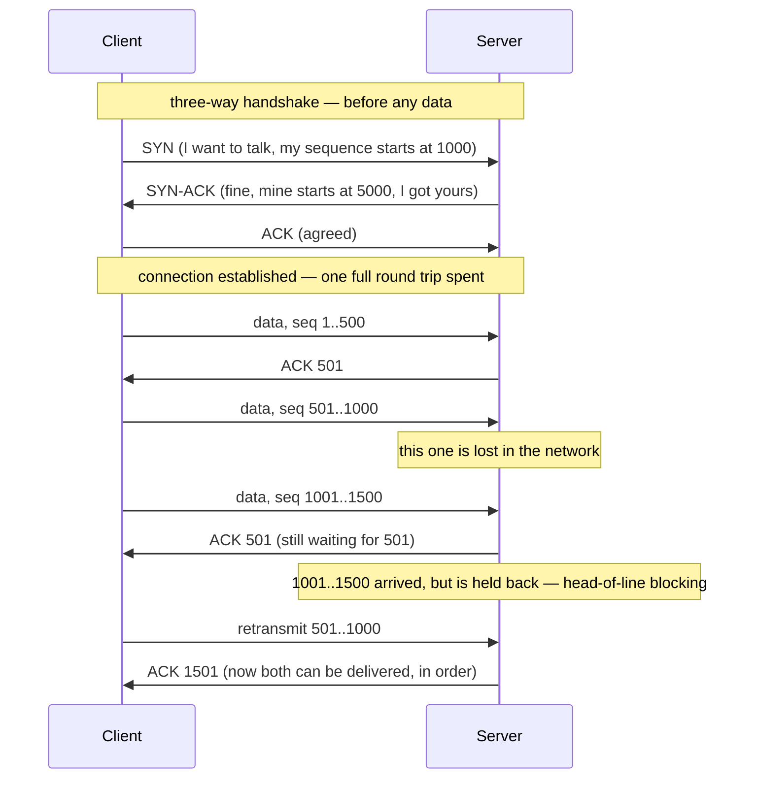
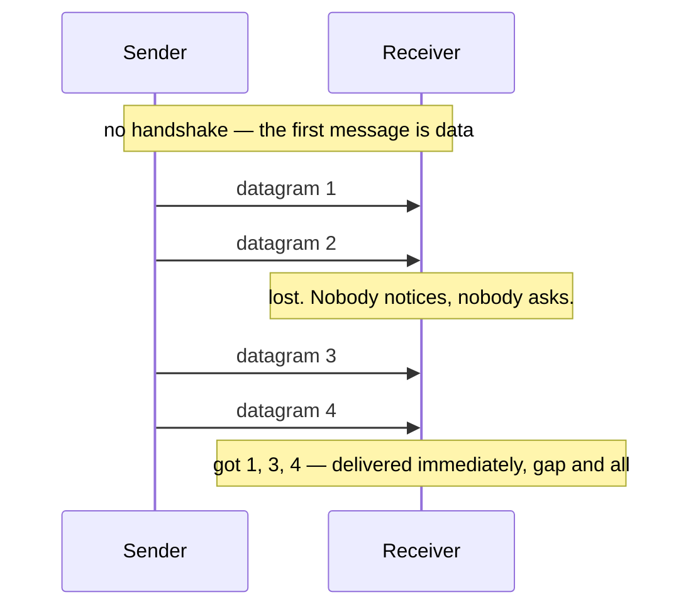

# Day 004 · System Design — TCP and UDP

**After today you can:** You can say why a video call uses one and a bank transfer uses the other.

**The interviewer asks it as:** *TCP or UDP for a live video call, and why?*

---

## 1. What this is, and why they ask it

**TCP** and **UDP** are the two ways one machine sends data to another. TCP checks that
everything arrived, in order, and re-sends whatever went missing. UDP sends it and does not
look back.

That is the whole difference, and everything else follows from it. TCP costs you time and
buys you certainty. UDP costs you certainty and buys you time.

Interviewers ask this because it is the cleanest trade-off in the whole of networking, and
because the wrong answer is very revealing. "Use TCP, it's reliable" sounds sensible and is
wrong for a video call — the re-sent frame arrives after the moment it belonged to, so you
paid for a guarantee you could not use. A candidate who can say *why* a guarantee can be
worthless has understood something general about system design, and they will say similar
things later about retries, queues and consistency.

---

## 2. The story

Kavita has moved into a new flat, and her brother Sameer is driving over with a table in the
back of his car. She is on the phone to him at half past six on a Tuesday evening, and he is
somewhere on the ring road.

The first part of the call is the directions, and she is careful about it.

"Take the left after the petrol pump."

"Left after the petrol pump."

"Then the second gate, not the first. The society is called Sunview."

"Second gate. Sunview."

"Tower C, flat 704."

Nothing. She waits two seconds and says it again. "Tower C, flat 704."

"Tower C, 704. Got it."

She notices herself doing this and does not stop, because it is obviously right. Every piece
goes across, he repeats it, and if he does not repeat it she says it again. It is slower
than just talking. It is slower on purpose. She would rather spend four extra seconds than
have him standing outside the wrong gate at seven o'clock with a table.

Then the directions are done, and the call changes completely.

They chat. He tells her about their cousin's new job, she tells him the water heater is not
working, he says something about the traffic near the flyover. The signal is not good — he
is driving, and it breaks up every so often. She misses a word here and a couple of words
there. She misses most of a sentence when he goes under the flyover.

And neither of them asks for anything to be repeated. Not once. She fills in the gap from
what came after it, and if she cannot, she lets it go. Asking him to say it again would
mean stopping, backing up, and losing where they had got to — and she would rather have the
conversation run on smoothly with holes in it than have it stutter.

The same two people, on the same call, using the same bad signal, with two completely
different rules. Every part of the address had to arrive, in order, confirmed. None of the
chat had to.

At seven he is at the gate. He read the flat number back, so he is at the right one.

---

## 3. The idea in plain English

Kavita ran both systems in one phone call, and the reason she switched between them was not
the signal. It was **what a missing piece costs**.

### The address half is TCP

**TCP** — the Transmission Control Protocol — is the way of sending data where every piece
is confirmed. Take it apart into the four things it does.

**It confirms.** The receiver sends back an **acknowledgement**, usually called an **ACK**,
saying "I have this". Sameer repeating "Tower C, 704" is an ACK.

**It re-sends.** If no acknowledgement comes back within a certain time, the sender sends the
same piece again. That is **retransmission**, and it is what Kavita did when he went quiet.

**It orders.** Data is broken into pieces, and each piece carries a **sequence number** —
its position in the stream. If piece 5 arrives before piece 4, the receiver holds 5 and waits.
What comes out at the far end is always in the order it went in, whatever the network did on
the way.

**It sets up first.** Before any data moves, the two machines do a **three-way handshake**:
one says "I want to talk" (SYN), the other says "fine, and I want to talk too" (SYN-ACK), the
first says "agreed" (ACK). Only then does data flow. This is why TCP is called
**connection-oriented** — there is a real, agreed-upon connection with state on both sides.

TCP also does two things Kavita did without noticing. **Flow control** means the receiver can
say "slow down, I cannot keep up". **Congestion control** means the sender backs off when the
network in between is overloaded, which is what stops the internet collapsing under its own
traffic.

### The chat half is UDP

**UDP** — the User Datagram Protocol — sends each piece on its own and stops caring. No
handshake, no acknowledgement, no re-sending, no ordering. A piece may arrive, may not
arrive, and may arrive after one that was sent later.

It sounds broken. It is exactly right for the chat. Repeating a lost word would cost more
than the word was worth.

The technical term for a single UDP send is a **datagram**, and the word is well chosen — it
is one self-contained message, like a shout across a room, rather than part of an agreed
conversation.

### The one sentence that decides which

> **Ask what a missing piece costs. If the answer is "everything", use TCP. If the answer is
> "nothing, as long as the next one arrives soon", use UDP.**

A missing digit in a bank transfer is a disaster: TCP. A missing 30 milliseconds of a video
call is a flicker nobody mentions, and re-sending it would arrive after the moment it
belonged to and make things worse: UDP.

### Head-of-line blocking, the thing that makes TCP wrong sometimes

This is the idea that makes the answer non-obvious, and it is worth its own name.

Under TCP, if piece 4 is lost, pieces 5, 6 and 7 may have arrived perfectly — but the
receiver **cannot hand any of them over**, because that would break the ordering promise.
Everything waits for the retransmission of piece 4. One lost piece stalls everything behind
it. That is **head-of-line blocking**.

In a video call that means: one lost fragment of one frame, and the whole picture freezes
for a round trip rather than showing a moment of noise. The guarantee did not merely fail to
help. It actively made the experience worse.

---

## 4. The picture

The TCP handshake, and then what happens when something goes missing.



**What to notice:** the last four lines. The data at 1001 arrived fine and could not be used.
That is the cost of the ordering guarantee, and it is paid in a full round trip.

Now UDP, doing the same thing:



**What to notice:** there are no arrows going back. The sender does not know what arrived and
does not ask. Datagram 3 was delivered the instant it turned up, because nothing was waiting
on datagram 2.

And the two headers side by side, which is the fastest way to see the difference:

```
   TCP header — 20 bytes minimum          UDP header — 8 bytes, always
   +---------------------------+          +---------------------------+
   | source port | dest port   |          | source port | dest port   |
   +---------------------------+          +---------------------------+
   | sequence number           |  <- order| length      | checksum    |
   +---------------------------+          +---------------------------+
   | acknowledgement number    |  <- ACK  
   +---------------------------+          that is the entire header.
   | flags | window size       |  <- flow
   +---------------------------+
   | checksum | urgent pointer |
   +---------------------------+
   | options (up to 40 bytes)  |
   +---------------------------+
```

**What to notice:** every extra field in the TCP header is one of the guarantees. Sequence
number buys ordering, acknowledgement number buys reliability, window size buys flow control.
UDP has four fields, two of which are just the ports. **The header is the trade-off, written
down.**

---

## 5. How it actually works

### What TCP maintains

Both ends hold real state for the life of a connection: the sequence numbers in each
direction, what has been acknowledged, a buffer of unacknowledged data waiting in case it
needs re-sending, a receive buffer of out-of-order data waiting for its gap to fill, the
current window size, and a set of timers. That is why a machine has a limit on how many TCP
connections it can hold at once, and why an idle connection still costs something.

A connection is identified by four values — source IP, source port, destination IP,
destination port. Change any one of them and it is a different connection. This is why your
laptop can hold dozens of connections to the same site at once: each uses a different source
port.

Closing is a four-step exchange (FIN, ACK, FIN, ACK), and the side that closes first sits in
a state called `TIME_WAIT` for a couple of minutes afterwards to catch stragglers. A busy
machine can genuinely run out of ports because of accumulated `TIME_WAIT` entries, which is
a real production problem with a real fix (connection reuse).

### Who uses TCP

Everything where a missing byte is a bug. **HTTP/1.1 and HTTP/2**, so almost all web
traffic. **SSH**. **SMTP, IMAP** for mail. **FTP**. The wire protocols of **PostgreSQL**
(port 5432), **MySQL** (3306), **Redis** (6379), **MongoDB** (27017). **Kafka**. Every
database client you will ever write uses TCP, without exception, because a half-delivered
row is worse than no row.

### Who uses UDP

**DNS** (port 53). A lookup is one small question and one small answer; if it goes missing,
asking again is cheaper than setting up a connection would have been. Large answers fall
back to TCP.

**Real-time media** — voice and video calls, over **RTP** on top of UDP, which is what
**WebRTC**, **Zoom**, **Google Meet** and **WhatsApp calls** use.

**Online games**, where the position of a player 50 ms ago is worthless. The next update
supersedes it.

**NTP** (time synchronisation), **DHCP** (getting an address when you join a network),
**syslog**, and metric shipping such as **StatsD** — all cases where losing an occasional
message is acceptable and the volume is high.

### QUIC: the interesting modern answer

**HTTP/3** does not run on TCP. It runs on **QUIC**, which runs on **UDP**, and this is the
detail that makes a good interview answer.

The reasoning is precisely head-of-line blocking. HTTP/2 put many parallel streams inside
one TCP connection, and then discovered that one lost segment stalls *all* of those streams,
because TCP orders the whole connection as a single stream of bytes. QUIC rebuilds
reliability and ordering **per stream**, on top of UDP, so a loss on one stream does not
block the others. It also folds the TLS handshake into the connection setup, cutting a
cold start from two or three round trips to one, and zero for a repeat visit.

So QUIC is not "UDP because reliability does not matter". It is "UDP because we want to
build reliability ourselves, at a finer grain than TCP allows". **Cloudflare**, **Google**
and **Meta** serve a large share of their traffic this way today.

### What applications on UDP have to build themselves

If you choose UDP and you do need some reliability, you build it. Video calling systems
typically add: a sequence number in the RTP header so gaps are detectable, **forward error
correction** (sending redundant data so a loss can be reconstructed without asking again), a
**jitter buffer** of 50–200 ms that reorders what arrives and smooths the timing, and
selective retransmission only for the frames that matter — a keyframe is worth asking for
again, an intermediate frame is not.

That list is the honest answer to "isn't UDP just worse?". No: it is an empty foundation, and
you put back only the guarantees you are willing to pay for.

### When it fails

TCP's failure mode is **stalling**. The connection does not break; it goes quiet while a
retransmission timer runs. On a bad link you get long freezes rather than errors. A dead
peer may not be noticed for minutes unless keepalives are on.

UDP's failure mode is **silent loss**. Nothing tells you a datagram vanished. If your
application does not carry sequence numbers, you cannot even count what you lost. Metrics
pipelines built on UDP can drop 10% of their data and look perfectly healthy.

---

## 6. The numbers

**What the handshake costs.** A round trip to a data centre in the same city is about 5 ms;
across a continent about 40 ms; across the world about 250 ms.

```
TCP connection setup       = 1 round trip
TLS 1.3 handshake on top   = 1 round trip
                             --------------
before the first byte of request:  2 round trips
```

For a user in Mumbai talking to a machine in Virginia at 250 ms per round trip:

```
2 x 250 ms = 500 ms of pure setup, before the request is even sent
```

Half a second of nothing. UDP's equivalent is **0 round trips** — the first datagram is
data. QUIC gets it to 1 round trip, and to 0 for a repeat visitor. This is the single
biggest reason HTTP/3 exists.

**What a video call needs.** A 720p call at 1.5 Mbps, with 30 frames per second:

```
1,500,000 bits per second / 8   = 187,500 bytes per second
187,500 / 30 frames             = 6,250 bytes per frame
6,250 / 1,200 bytes per datagram = about 5 datagrams per frame
```

Now suppose 1% of datagrams are lost. Each frame is 5 datagrams, so:

```
chance a given frame loses at least one piece = 1 - 0.99^5 = 4.9%
```

Roughly one frame in twenty is damaged. Under **UDP**, that is one frame in twenty showing a
smear, at 30 frames a second — barely noticeable. Under **TCP**, each of those triggers a
retransmission, which takes one round trip:

```
1.5 damaged frames per second x 1 round trip (say 100 ms) = 150 ms of freeze per second
```

The picture would stutter constantly. **Same loss rate, same network, and the choice of
transport is the difference between a slight blur and an unusable call.**

**Where the retransmission arrives.** At 30 fps a frame lasts 33 ms. A retransmission over a
100 ms round trip arrives:

```
100 ms / 33 ms per frame = three frames too late
```

The data is correct and useless. That sentence is the heart of the answer.

**How much header overhead you pay.** For a small game update of 20 bytes:

```
UDP: 20 bytes of IP header context + 8 bytes UDP + 20 payload  = 48 bytes on the wire
TCP: 20 bytes of IP header context + 20 bytes TCP + 20 payload = 60 bytes on the wire
```

25% more, before counting the ACK travelling back the other way, which is another 40 bytes
for zero payload. At 60 updates per second per player, with 100,000 players:

```
100,000 x 60 x 40 bytes of pure ACK = 240 MB per second of acknowledgement traffic
```

That is the volume argument for UDP, and it is why game servers are built this way.

**Connection state.** A TCP connection costs roughly 4–16 KB of kernel buffers per side:

```
1,000,000 idle TCP connections x 8 KB = 8 GB of memory
```

A UDP "connection" costs nothing, because there is no such thing. For a service holding a
million idle connections — a chat or notification system — that difference decides the
architecture.

---

## 7. The trade-offs

**TCP buys certainty and charges you in time.** You get: every byte, in order, exactly once,
with the sender automatically slowing down when the network is congested. You pay: a round
trip before any data moves, memory and state per connection on both machines, and — the one
that actually bites — head-of-line blocking, where one loss stalls everything behind it. On
a clean, fast network that price is invisible. On a lossy mobile link it is the whole
experience.

**UDP buys time and charges you in certainty.** You get: no setup, no per-connection state,
no blocking, and each message delivered the moment it arrives. You pay: silent loss,
possible reordering, possible duplicates, and no congestion control at all — a badly written
UDP application will keep firing into a congested network and make things worse for
everyone, which is a real reason to be careful with it.

**"Just use TCP" is right more often than not.** It is worth saying plainly, because the
interesting answer is not always the correct one. If you are not sure, TCP is the default,
and almost every application you will build — web, mobile, databases, message queues,
internal service calls — should use it. UDP is the specialist choice, taken deliberately,
for real-time media, high-volume telemetry, DNS-style single exchanges, or when you are
building your own transport like QUIC.

**You can have both, and modern systems do.** WebRTC sends media over UDP and the signalling
that sets up the call — who is calling whom, what codecs, the network candidates — over TCP,
because losing a signalling message would break the call while losing a video frame would
not. Splitting traffic by what the loss costs is the mature version of this decision.

**I would not use UDP if...** the data is a state change rather than a snapshot. A position
update is a snapshot: the next one replaces it and losing one is harmless. "The user pressed
the fire button" is a state change: nothing later replaces it, and losing it is a bug the
user will notice. The test is not "is it real-time?" — it is "does a later message make this
one irrelevant?".

**I would not use plain TCP if...** I were serving many parallel streams over a lossy link
and cared about tail behaviour. That is the QUIC case exactly, and it is why HTTP/3 exists.

---

## 8. In the interview

### How it gets asked

- *"TCP or UDP for a live video call, and why?"* — the standard version. The answer they
  want has "head-of-line blocking" and "the retransmission arrives too late" in it.
- *"What's the difference between TCP and UDP?"* — the warm-up. Do not just list features;
  give the trade-off.
- *"Why does HTTP/3 use UDP?"* — the version that separates people who have read something
  recent from people who have not.
- *"You're designing a multiplayer game. What transport?"* — a scenario, and the good answer
  splits the traffic.

### What to say out loud, in the first ninety seconds

1. **Give the trade in one line.** *"TCP guarantees delivery and ordering; UDP doesn't.
   TCP costs time to buy certainty."*
2. **Name the four things TCP does.** *"Handshake, sequence numbers for ordering,
   acknowledgements with retransmission, and congestion control."*
3. **Ask the deciding question out loud.** *"So the question is what a lost piece costs.
   For a video call, a lost frame is worth nothing thirty milliseconds later."*
4. **Land the killer point.** *"With TCP, that lost frame gets retransmitted and arrives a
   round trip late — three frames too late to display. Worse, everything behind it is held
   back waiting, because TCP won't deliver out of order. That's head-of-line blocking. So
   one lost fragment becomes a freeze instead of a flicker."*
5. **Give the answer.** *"So UDP, with RTP on top, plus a jitter buffer and forward error
   correction. We add back the specific guarantees we want and skip the ones we don't."*
6. **Show the boundary.** *"But the signalling that sets the call up goes over TCP — losing
   that would break the call."*

Step 4 is the whole answer. Everything else is scaffolding around it.

### The follow-ups

**"Isn't UDP just unreliable? Why would anyone accept that?"**
Because reliability has a delivery time attached to it, and late data can be worthless. TCP
does not promise "you get everything"; it promises "you get everything, eventually, in
order". For anything with a deadline, "eventually" is the problem. And UDP is not a
guarantee that things get lost — on a good network almost nothing does. It is a decision not
to pay for insurance you would not claim on.

**"Why does HTTP/3 run on UDP? Doesn't the web need reliability?"**
It does, and QUIC provides it — just not TCP's version of it. HTTP/2 multiplexes many
requests over one TCP connection, and TCP orders the connection as a single byte stream, so
one lost segment blocks every stream in it. QUIC implements reliability and ordering per
stream on top of UDP, so a loss on one only blocks that one. It also merges the transport
and TLS handshakes, so a new connection is one round trip instead of two or three. UDP here
is a foundation, not an abandonment of reliability.

**"How does TCP know how fast to send?"**
Congestion control. It starts slow, roughly doubles its sending rate each round trip while
acknowledgements keep coming back — that is slow start — and cuts back sharply when it sees
loss, because loss is taken as evidence of a full queue somewhere. Modern algorithms such
as **BBR** measure the actual bottleneck rate rather than waiting for loss. This is entirely
absent from UDP, which is why a UDP application has to be a good citizen deliberately.

**"Can you lose data with TCP?"**
Not silently within an established connection — but yes, in ways that matter. The connection
can break, and then data sitting in the send buffer is gone. More importantly, TCP
acknowledges that the *kernel received the bytes*, not that your application processed them.
If the process crashes after the ACK and before writing to the database, the sender believes
it was delivered. That is why application-level acknowledgement exists in Kafka and in every
serious queue, and why "TCP is reliable" is true at one layer and not at the one you care
about.

### A model answer

> "UDP, and specifically RTP over UDP, which is what WebRTC does.
>
> The reason isn't that reliability doesn't matter — it's that TCP's kind of reliability is
> the wrong kind here. TCP guarantees every byte arrives in order, and it achieves that by
> retransmitting anything that goes missing and by refusing to deliver later data until the
> gap is filled.
>
> In a video call at 30 frames a second, a frame is worth about 33 milliseconds. If a piece
> of one is lost, TCP retransmits it, and that takes a round trip — say 100 milliseconds.
> The data arrives correct and three frames too late to show. So I paid for a guarantee I
> couldn't use.
>
> The worse part is head-of-line blocking. While that retransmission is in flight, the
> frames behind it have already arrived, and TCP won't hand them over because that would
> break the ordering promise. So one lost fragment turns into a hundred-millisecond freeze
> instead of one slightly smeared frame. The guarantee actively made the experience worse.
>
> With UDP I get each piece the moment it arrives, gaps and all, and I add back exactly the
> guarantees I want: sequence numbers in the RTP header so I can detect gaps, a jitter
> buffer of 50 to 200 milliseconds to reorder and smooth timing, forward error correction so
> small losses reconstruct without a round trip, and selective retransmission only for
> keyframes, where a loss really does persist.
>
> I'd split the traffic though. The signalling — who's calling whom, codec negotiation, ICE
> candidates — goes over TCP or WebSockets, because losing a signalling message breaks the
> call, and there's no later message that makes it irrelevant. That's the test I'd apply
> generally: if a later message supersedes this one, UDP is fine; if nothing replaces it,
> it needs reliable delivery.
>
> It's worth noting this reasoning is why HTTP/3 moved to QUIC over UDP as well — same
> head-of-line problem, different application."

That answer names the mechanism, quantifies it, gives the design that follows, states the
boundary, and generalises the rule. It is about ninety seconds spoken.

---

## 9. Recall card

1. **TCP: handshake, sequence numbers, acknowledgements, retransmission, congestion
   control.** Everything arrives, in order. **UDP: send and forget.** Four header fields,
   no promises.
2. **The deciding question: what does a lost piece cost?** Everything → TCP. Nothing, because
   the next one supersedes it → UDP.
3. **Head-of-line blocking** is why TCP is wrong for media: one loss stalls everything behind
   it, and the retransmission arrives after the moment it belonged to.
4. **TCP costs 1 round trip to set up, plus 1 for TLS.** UDP costs zero. Over a 250 ms link
   that is half a second before the first byte of your request.
5. **HTTP/3 runs QUIC over UDP** — not to abandon reliability, but to rebuild it per stream
   and dodge head-of-line blocking. TCP is still the default for everything else.
