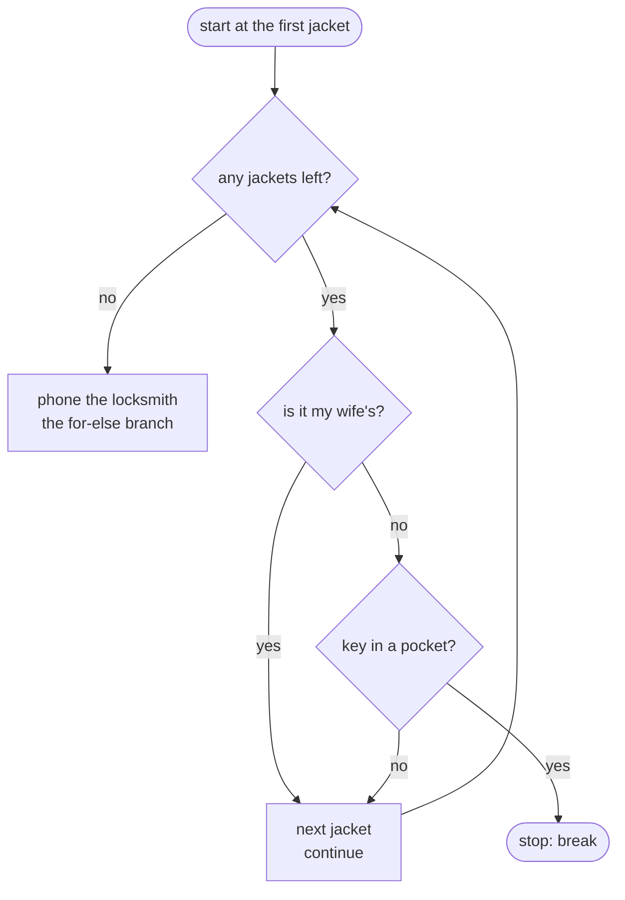

# Day 004 · Python — if/elif/else, for-in, while, break and continue

**Today's theme:** Conditions and loops

**After today you can:** You can write every loop shape in each language and pick the one that reads cleanest for a given job.

**The interviewer asks it as:** *Write a loop that stops early. Now write it without break.*

---

## 1. What this is, and why it matters

A condition is a question with a yes-or-no answer that decides which lines run next, and a loop is a way of running the same lines again and again until something changes. Python has one condition shape, `if`/`elif`/`else`, and two loop shapes, `for` over a sequence and `while` a condition holds, plus `break` to leave a loop early and `continue` to skip to the next go round. Python also has one thing the other two languages do not: an `else` clause on a loop, which runs only if the loop was never broken.

At work, nearly every bug that is not a typo is a condition written backwards or a loop that stops one step too early or too late. In interviews, every single coding question has a loop in it, and the question in the heading is asked to see whether you can express "stop early" without `break`, which tells the interviewer whether you understand what a loop condition is.

## 2. The story

Sunil gets home at half past seven and cannot find his house key. His wife is out until ten. There are five jackets hanging on the hooks by the door, and the key is in one of them.

He starts at the left. The first jacket is his wife's red one. He does not check it; his key would not be in her jacket. He moves on. The second is his grey work jacket. He checks both pockets. Nothing. The third is his wife's again, the long black one. Skip. The fourth is his old brown jacket from last winter. Left pocket, nothing. Right pocket, keys. He stops. He does not check the fifth jacket, because there is no reason to. He has what he came for.

That is the whole search on a good day. Start at one end. Skip the ones that cannot be right. Stop the moment you find it.

On a bad day, it goes differently. He checks all five, skipping his wife's two, and gets to the end of the row with nothing in his hand. And now, only now, because he reached the end without finding it, he does the thing he was hoping not to do: he phones the locksmith.

His neighbour, watching from the stairs, asks why he did not just check all five and then decide. Sunil says that would be silly. Once the key is in his hand, checking more jackets is wasted time. And the locksmith call is not something he does after every search; it is only for the search that comes up empty.

There is one more version of the same evening. Sometimes Sunil does not think of it as "check jackets until I find the key". He thinks of it as "keep going as long as I have not found it and there are jackets left". Same jackets, same pockets, same moment of stopping. But the rule for stopping is said out loud at the start, instead of being a decision made halfway through. His wife prefers that version. She says it is easier to explain to the locksmith.

## 3. The idea in plain English

A **condition** is a question whose answer is yes or no. "Is this my wife's jacket?" In Python, `jacket == "red"` is such a question, and its answer is a **bool**, one of the two values `True` and `False`. The comparisons are `==` equal, `!=` not equal, `<`, `>`, `<=`, `>=`, and you can join them with `and`, `or`, and flip one with `not`.

`if` runs a block of lines only when a condition is `True`. `elif` (short for "else if") offers a second question if the first was `False`. `else` catches everything left. The lines belonging to each part are **indented**, pushed in by four spaces, and the indentation is not decoration; it is how Python knows where the block starts and ends.

A **loop** runs a block of lines more than once. Python has two.

`for jacket in jackets:` runs the block once for each item in a sequence, with the name `jacket` holding the current item each time. A sequence can be a string, in which case you get one character at a time, or a **list**, a row of values in square brackets like `["red", "grey"]`, which day 6 covers properly. `range(5)` gives the numbers 0 to 4, so `for i in range(5)` runs five times.

`while not found:` runs the block again and again as long as the condition stays `True`, checking it before every go. This is Sunil's wife's version: the stopping rule is said out loud at the top.

`break` leaves the loop immediately, the moment the key is in hand. `continue` skips the rest of this go round and moves to the next item, the wife's jacket. And Python's `for ... else:` runs the `else` block only if the loop finished without hitting `break`. That is the locksmith call: only for the search that came up empty.

## 4. The picture



*Notice that there are two ways out. `break` leaves through the bottom right with the key. Running out of jackets leaves through the top, and only that exit goes past the locksmith.*

## 5. The code, built step by step

Start `search.py` in a `day04` folder. First, a condition.

```python
jacket = "grey"
if jacket == "red":
    print("that is hers")
elif jacket == "grey":
    print("that is mine, check it")
else:
    print("not sure whose")
```

```
that is mine, check it
```

Each question ends in a colon. Each answer is indented by four spaces. Python tries `if`, then `elif`, then falls to `else`, and runs exactly one of the three.

Now the row of jackets and the search.

```python
jackets = ["red", "grey", "black", "brown", "green"]
key_in = "brown"

for jacket in jackets:
    print(f"looking at {jacket}")
    if jacket == key_in:
        print("found it")
        break
```

```
looking at red
looking at grey
looking at black
looking at brown
found it
```

`green` is never printed. `break` left the loop the moment the key was found.

Now skip his wife's jackets.

```python
hers = ["red", "black"]

for jacket in jackets:
    if jacket in hers:
        continue
    print(f"checking {jacket}")
    if jacket == key_in:
        print("found it")
        break
```

```
checking grey
checking brown
found it
```

`continue` jumps straight to the next jacket, so the `checking` line never runs for hers. `in` asks whether a value is in a sequence, and it works on lists as well as strings.

Now the locksmith: the `else` on a `for`.

```python
key_in = "nowhere"

for jacket in jackets:
    if jacket == key_in:
        print("found it")
        break
else:
    print("checked every jacket; phoning the locksmith")
```

```
checked every jacket; phoning the locksmith
```

The `else` lines up with the `for`, not with the `if`. It runs only when the loop ends by running out of items. If `break` fires, it is skipped. Most people misread this the first time as "else if the loop was empty"; it is not. It is "else, if we never broke".

Now the same search without `break`, which is the interview question. Say the stopping rule at the top.

```python
key_in = "brown"
position = 0
found = False

while not found and position < len(jackets):
    if jackets[position] == key_in:
        found = True
    else:
        position = position + 1

print(f"found: {found}, at position {position}")
```

```
found: True, at position 3
```

`while` checks its condition before every go. The loop runs as long as the key has not been found **and** there are jackets left. When either stops being true, the loop ends on its own. No `break`. `jackets[position]` reads the item at that index, and `len(jackets)` is how many there are, exactly as with strings yesterday.

Here is the run and output for the complete program.

```bash
python3 search.py
```

```
with break:
  skip red
  checking grey
  skip black
  checking brown -> found it
with a while condition:
  found: True at position 3
searching for a key that is not there:
  checked every jacket; phoning the locksmith
```

And the complete file.

```python
# search.py — day 4, conditions and loops
# Run:  python3 search.py

jackets = ["red", "grey", "black", "brown", "green"]
hers = ["red", "black"]
key_in = "brown"

print("with break:")
for jacket in jackets:
    if jacket in hers:
        print(f"  skip {jacket}")
        continue
    if jacket == key_in:
        print(f"  checking {jacket} -> found it")
        break
    print(f"  checking {jacket}")

print("with a while condition:")
position = 0
found = False
while not found and position < len(jackets):
    if jackets[position] == key_in:
        found = True
    else:
        position = position + 1
print(f"  found: {found} at position {position}")

print("searching for a key that is not there:")
for jacket in jackets:
    if jacket == "nowhere":
        print("  found it")
        break
else:
    print("  checked every jacket; phoning the locksmith")
```

## 6. How the other two languages do it

Go, where `for` is the only loop and the brackets are mandatory:

```go
for _, jacket := range jackets {
	if jacket == keyIn {
		fmt.Println("found it")
		break
	}
}
```

C++, where you choose between `for`, `while`, `do-while`, and the range-`for`:

```cpp
for (std::string jacket : jackets) {
    if (jacket == key_in) {
        std::cout << "found it\n";
        break;
    }
}
```

The one line of difference that matters: **Python uses indentation to mark the block; Go and C++ use curly braces and do not care about indentation at all.** In Python, a line indented one space too few silently falls out of the loop and runs once after it, with no error. In Go and C++, a misplaced brace is usually a compile error. The second difference is smaller but real: only Python has `for ... else`. In Go and C++ you write the flag version, `found = False` before the loop and a check after it, which is why interviewers ask you to write it that way.

## 7. The traps

**The near-miss: the assignment that looks like a comparison.** One `=` instead of two.

```python
if jacket = "grey":
    print("mine")
```

```
  File "/home/you/day04/search.py", line 2
    if jacket = "grey":
       ^^^^^^^^^^^^^^^
SyntaxError: invalid syntax. Maybe you meant '==' or ':=' instead of '='?
```

Python refuses it, and even suggests the fix. Hold on to this: in C++ the same line compiles and is always true.

**The real error: the missing indent.** Forget to indent after the colon.

```python
for jacket in jackets:
print(jacket)
```

```
  File "/home/you/day04/search.py", line 2
    print(jacket)
    ^
IndentationError: expected an indented block after 'for' statement on line 1
```

Clear enough. The quiet version is worse: indent correctly, then add a line at the end of the loop with one space fewer. No error. That line runs once, after the loop, instead of every time. Every Python programmer has lost an hour to this.

**The near-miss: the while that never ends.** Forget to move `position` forward.

```python
position = 0
while position < len(jackets):
    print(jackets[position])
```

It prints `red` forever. Press Ctrl+C to stop it, and you get `KeyboardInterrupt`. A `while` loop only ends if something inside it changes the condition. Before you write one, say out loud what line makes it stop.

## 8. Say it out loud

**How it gets asked**

- "Write a loop that stops early. Now write it without `break`."
- "What does the `else` on a Python `for` loop do?"
- "When would you use `while` instead of `for`?"

**What to say out loud, the first ninety seconds**

"Python has `if`, `elif` and `else` for conditions, with the block marked by indentation, and two loops: `for` over any sequence, including `range`, and `while` a condition holds. `break` leaves the loop immediately and `continue` skips to the next item.

To stop early with `break`, I put the test inside a `for` and break when it passes. To do it without `break`, I move the stopping rule into the loop condition itself: a `while` that runs as long as I have not found the item and there are items left, with a `found` flag set inside. The `for` version is shorter; the `while` version makes the exit condition visible at the top, which matters when the condition is complicated.

Python's `for ... else` runs the `else` block only if the loop finished without `break`, which is exactly the 'searched everything and found nothing' case. It is easy to misread, so I add a comment when I use it."

**The follow-ups**

1. *"Why not just check a flag after the `for` loop instead of `for-else`?"* — You can, and in Go or C++ you must. `for-else` saves the flag, but many readers do not know it, so a flag is often clearer in shared code.
2. *"What does `range(1, 10, 2)` give?"* — 1, 3, 5, 7, 9: start, stop exclusive, step. `range(5)` is 0 to 4. The stop is never included.
3. *"What is the difference between `break` inside a nested loop and in the outer one?"* — `break` only leaves the innermost loop it is in. To leave both, set a flag and break again in the outer loop, or move the loops into a function and `return`.

**A model answer**

"Conditions are `if`/`elif`/`else` on boolean expressions built from comparisons and `and`, `or`, `not`. Loops are `for item in iterable`, which covers ranges, strings and lists, and `while condition`, which re-tests before each iteration. `break` exits, `continue` skips ahead. Stopping early is a `break` inside a `for`; the same logic without `break` is a `while not found and i < len(items)` with a flag, which is also how the other two languages express it. Python's `for-else` runs only when the loop was not broken, giving a clean 'not found' branch. The classic bugs are indentation that silently moves a line out of the loop and a `while` whose condition nothing changes."

## 9. Recall card

- `if cond:` / `elif cond:` / `else:`, each with a colon and a four-space indented block; `==` compares, `=` assigns and is a `SyntaxError` in an `if`.
- `for x in sequence:` walks strings, lists, and `range(n)`, which is 0 to n−1; `while cond:` re-checks before every go.
- `break` leaves; `continue` skips to the next item; `for ... else:` runs only if the loop never broke.
- Stop early without `break`: `while not found and i < len(items):` with a flag.
- A line indented one space too few runs once after the loop with no error; a `while` nobody changes runs forever.
