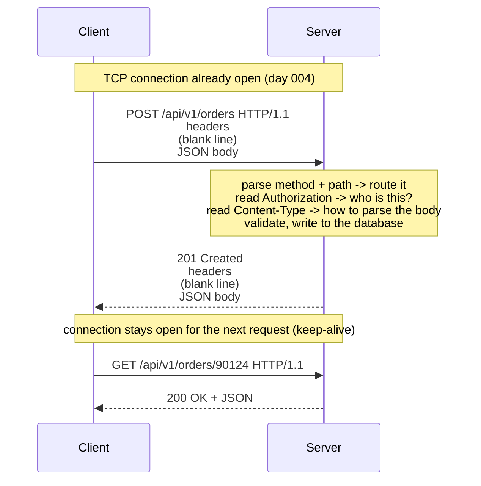

# Day 005 · System Design — HTTP: the request and the response

**After today you can:** You can write out a real HTTP request and response by hand and label every part.

**The interviewer asks it as:** *Describe an HTTP request. What is in the headers, and what is in the body?*

---

## 1. What this is, and why they ask it

**HTTP** — the HyperText Transfer Protocol — is the agreed format for one machine asking
another for something over the web. A request has four parts: a **method** saying what you
want done, a **path** saying what you want it done to, **headers** carrying facts about the
request itself, and an optional **body** carrying the content.

A response has the same shape with one addition: a **status code**, a three-digit number
that says how it went.

Interviewers ask this in nearly every system design round, and they ask it early. It looks
like a memory test and it is not. Every API you design for the rest of your career is a set
of decisions about these four parts — which method, what goes in the path, what goes in a
header, what goes in the body, and which status code comes back. A candidate who is vague
about headers versus body will design a vague API, and the interviewer knows it.

---

## 2. The story

Salim delivers for a courier company, and Tower B of the Green Meadows society is on his
round most days. He knows the lift, he knows which floors have dogs, and he knows that flat
402 orders a great deal.

On Monday he goes up with a box for 402. At the door he says one sentence — "delivery for
Mrs Fernandes" — and holds the box out. She takes it, and that is the whole transaction.

On Wednesday he is back at the same door, and he is not delivering anything. He has come to
take something away: a pair of shoes going back to the company that sent them. Same door,
same man, completely different job. He says so at the door, because if he just stood there
holding out an empty hand she would have no idea what he wanted.

On Friday he does a third thing at the same door. There is a box for 402 that weighs twelve
kilos, the lift has been out since Thursday, and he is not carrying it up four floors on the
chance that somebody is in. So he rings the bell first, from downstairs, on the intercom. He
is not delivering anything and not collecting anything. He only wants to know whether
someone is home. He can do that five times in a row and nothing changes because of it.

The boxes themselves tell him a lot before he opens anything. There are stickers on the
outside: who sent it, how heavy it is, whether it is fragile, whether four hundred and fifty
rupees has to be collected at the door, and what is inside in general terms — "garments", or
"electronics". None of that is the thing being delivered. It is information *about* the
delivery, and he needs it before he hands anything over. The actual thing is inside, and
he never opens the box.

And the answers he gets at doors come in a small number of standard kinds, which is what
makes his job manageable. Someone takes it. Nobody is home. There is no flat 402 in this
tower — it goes up to 308. The person is home but will not pay the four hundred and fifty.
Or the whole tower is locked because of a wedding in the compound and he cannot get in at
all, which is nothing to do with this parcel and he will have to come back.

At the end of the day, his supervisor does not want the story of each door. He wants the
outcome of each one, in one word.

---

## 3. The idea in plain English

Salim's round is an HTTP conversation, part for part.

### The method: what you want done

Salim said something at every door, and it was different each time. In HTTP that is the
**method**, sometimes called the verb. It is the first word of the request.

| Method | What it means | Salim's version |
|---|---|---|
| `GET` | give me this; change nothing | ringing the bell to see if anyone is home |
| `POST` | here is something new, create it | delivering a box |
| `PUT` | replace what is there with this | swapping a faulty item for a new one, whole |
| `PATCH` | change part of what is there | correcting only the phone number on file |
| `DELETE` | remove this | taking the shoes back |
| `HEAD` | give me only the information about it, not the thing | asking how heavy the box is without taking it |
| `OPTIONS` | what am I allowed to do here? | asking whether this building accepts collections |

Two words follow from this and interviewers use both.

A method is **safe** if it changes nothing on the other side. `GET`, `HEAD` and `OPTIONS`
are safe. Salim ringing the bell is safe.

A method is **idempotent** if doing it five times leaves the same result as doing it once.
`GET`, `PUT` and `DELETE` are idempotent — deleting the same thing twice leaves it deleted.
`POST` is **not**: two deliveries of the same box are two boxes, which is why a
double-clicked payment button is a real problem and why an unreliable network makes `POST`
the hard case.

### The path: what you want it done to

"Flat 402, Tower B" is the **path** — the part of the URL after the host. `/users/402`,
`/orders`, `/search`. The path names the thing. The method says what to do to it. Those two
together are the whole idea of a **REST** API, which is covered properly on
[day 015](../day-015-the-write-pointer/README.md).

### The headers: information about the request, not the request itself

The stickers on the box are **headers**. Each one is a name and a value, one per line. They
describe the message rather than being the message.

The ones you will actually meet:

| Header | What it says |
|---|---|
| `Host: api.example.com` | which site you want — required, and it is how one machine serves many sites |
| `Content-Type: application/json` | what format the body is in |
| `Content-Length: 348` | how many bytes the body is |
| `Authorization: Bearer eyJhbG...` | who you are |
| `Accept: application/json` | what format you would like back |
| `User-Agent: Mozilla/5.0 ...` | what program is asking |
| `Cookie: session=abc123` | small values the site asked you to hold and send back |
| `Accept-Encoding: gzip` | "you may compress the response" |

### The body: the thing itself

What is inside the box is the **body**. On a `POST` or `PUT` it is the data you are sending —
usually JSON these days. On a `GET` there is normally **no body at all**, which is worth
remembering: a `GET` carries its parameters in the path and the query string, not in a body.

### The status code: the outcome in one number

Salim's supervisor wants one word per door. HTTP wants three digits, and the **first digit
is the whole category**:

| Range | Meaning | The ones that matter |
|---|---|---|
| `1xx` | hold on, still going | `101 Switching Protocols` (WebSockets) |
| `2xx` | it worked | `200 OK`, `201 Created`, `204 No Content` |
| `3xx` | it is somewhere else | `301 Moved Permanently`, `302 Found`, `304 Not Modified` |
| `4xx` | **you** got it wrong | `400 Bad Request`, `401 Unauthorized`, `403 Forbidden`, `404 Not Found`, `429 Too Many Requests` |
| `5xx` | **we** got it wrong | `500 Internal Server Error`, `502 Bad Gateway`, `503 Service Unavailable`, `504 Gateway Timeout` |

The 4xx/5xx split is the one interviewers care about, because it is a statement about whose
fault it is. There is no flat 402 in Tower B: that is a 404, and Salim retrying will not
help. The tower is locked because of a wedding: that is a 503, nothing to do with this
parcel, and coming back later is exactly the right response.

The two that people confuse: **401 Unauthorized** actually means "I do not know who you are"
— you have not authenticated. **403 Forbidden** means "I know exactly who you are and you
are not allowed this". The names are historically wrong; the meanings are not.

---

## 4. The picture

A complete, real HTTP request, with every part labelled:

```
  POST /api/v1/orders HTTP/1.1                <- method, path, version
  Host: shop.example.com                      <-+
  Content-Type: application/json                |
  Content-Length: 71                            | headers:
  Authorization: Bearer eyJhbGciOiJIUzI1...     | facts ABOUT the request
  Accept: application/json                      |
  User-Agent: curl/8.4.0                      <-+
                                              <- ONE BLANK LINE. This is not optional.
  {"product_id": 88213, "quantity": 2,        <-+ body:
   "address_id": 4471}                        <-+ the thing itself
```

**What to notice:** the blank line. It is the only thing separating headers from body, and it
is a genuine part of the format. Everything above it describes the message; everything below
it is the message.

And the response that comes back:

```
  HTTP/1.1 201 Created                        <- version, status code, reason phrase
  Content-Type: application/json              <-+
  Content-Length: 152                           |
  Location: /api/v1/orders/90124                | headers
  Cache-Control: no-store                       |
  Set-Cookie: session=abc123; HttpOnly        <-+
                                              <- the same blank line
  {"order_id": 90124, "status": "confirmed",  <-+ body
   "total": 1499, "eta": "2026-08-29"}        <-+
```

**What to notice:** `201` rather than `200`, because something was created, and a `Location`
header saying where the new thing lives. Getting that pair right is a small thing that
reads as professional.

The whole exchange, in order:



**What to notice:** the server's work is entirely driven by the parts of the request. Method
and path choose the code that runs; `Authorization` decides whether it may run;
`Content-Type` decides how the body is parsed. Each part has exactly one job.

---

## 5. How it actually works

### It is text, and you can type it yourself

HTTP/1.1 is human-readable text sent over a TCP connection. You can do the whole thing by
hand:

```
$ curl -v -X POST https://httpbin.org/post \
       -H "Content-Type: application/json" \
       -d '{"hello": "world"}'
```

`-v` prints the actual request and response lines, and it is the fastest way to make this
concrete. Everything a browser does, `curl` does in one line.

### One connection, many requests

Opening a TCP connection costs a round trip, and TLS costs another
([day 004](../day-004-the-growth-curves/README.md)). Doing that per request would be
ruinous, so HTTP/1.1 defaults to **keep-alive**: the connection stays open and the next
request goes down the same one.

HTTP/1.1's limit is that requests on a connection are answered **in order**. A slow response
blocks the ones behind it — head-of-line blocking again, this time at the application level.
Browsers worked around it by opening six connections per host.

**HTTP/2** fixed that by multiplexing many streams over one connection and compressing
headers, and **HTTP/3** moved the whole thing to QUIC over UDP to remove TCP's version of
the same problem. The request format you learn today is unchanged in all three — HTTP/2 and
HTTP/3 send the same methods, paths, headers and bodies in a binary encoding rather than
text.

### Where the parameters go

For a `GET`, parameters go in the **query string**, after a `?`:

```
GET /search?q=laptop&page=2&sort=price HTTP/1.1
```

Query strings are visible in logs, in browser history, and in the `Referer` header sent to
other sites. **Never put a password or a token in one.** That is the practical reason a
login is a `POST` with the credentials in the body: not because `POST` is encrypted — over
HTTPS both are equally encrypted — but because bodies are not logged by default and query
strings are.

### What the server does with each part

A real request arriving at, say, **nginx** in front of a **FastAPI** application:

1. **nginx** reads the `Host` header and picks which site this is for. One machine, many
   sites — this is why `Host` is mandatory in HTTP/1.1.
2. It forwards to the application, adding `X-Forwarded-For` with the client's real IP,
   because otherwise the application would see nginx's address for every request.
3. The framework **routes** on method plus path: `POST /api/v1/orders` maps to one function.
4. Middleware reads `Authorization`, validates the token, and attaches the user.
5. The body is parsed according to `Content-Type` — JSON, form-encoded, or multipart for
   file uploads.
6. The handler runs, talks to **PostgreSQL** and **Redis**, and returns.
7. The framework serialises the result, sets `Content-Type` and `Content-Length`, picks a
   status code, and writes it back.

### Statelessness and cookies

HTTP is **stateless**: the server keeps nothing between requests. Every request must carry
everything needed to understand it, which is why your identity is re-sent every single time
— in a `Cookie` header or an `Authorization` header.

`Set-Cookie` in a response asks the browser to store a value and send it back on subsequent
requests to that site. The flags matter: `HttpOnly` hides it from JavaScript (so an XSS bug
cannot steal it), `Secure` sends it only over HTTPS, and `SameSite=Lax` stops it being sent
on requests initiated by other sites (which is the CSRF defence).

### Caching, which is done entirely with headers

The response says how long it may be reused:

```
Cache-Control: max-age=3600, public
ETag: "a3f8b1c9"
```

`max-age=3600` means "reuse this for an hour without asking". After that the client asks
again with `If-None-Match: "a3f8b1c9"`, and if nothing changed the server replies
**304 Not Modified** with no body at all — a full round trip, but zero bytes of content.
That is how CDNs such as **Cloudflare** and **CloudFront** decide what to keep.

---

## 6. The numbers

**What the parts weigh.** A typical API request:

```
request line              ~40 bytes
Host                      ~30 bytes
User-Agent               ~120 bytes
Accept, Accept-Encoding  ~ 80 bytes
Authorization (JWT)      ~500 bytes
Cookie                   ~400 bytes
                         ----------
headers total            ~1,170 bytes
JSON body                  ~200 bytes
                         ----------
total                    ~1.4 KB, of which 85% is headers
```

**The headers are bigger than the payload.** For a small API call that is the normal case,
and it is the entire reason HTTP/2 added header compression (HPACK), which typically cuts
repeated headers by 80–90%.

**What keep-alive saves.** A page that makes 50 requests to one host, at 40 ms round trip:

```
without keep-alive: 50 x (1 RTT TCP + 1 RTT TLS + 1 RTT request)
                  = 50 x 3 x 40 ms = 6,000 ms

with keep-alive:    1 x (1 RTT TCP + 1 RTT TLS) + 50 x 1 RTT
                  = 80 ms + 2,000 ms = 2,080 ms
```

Nearly three times faster, from one setting. And with HTTP/2 multiplexing, those 50 requests
overlap rather than queue, bringing it closer to 120 ms.

**What a fat cookie costs at scale.** A 4 KB cookie, on a site doing 10,000 requests per
second:

```
4 KB x 10,000 requests/s = 40 MB/s of inbound cookie
40 MB/s x 86,400 s       = 3.4 TB per day
```

Three terabytes a day of data you never look at. This is why session identifiers are short
and the session itself lives in **Redis**, and why static assets are served from a separate
cookieless domain.

**What a 304 saves.** A 200 KB image, requested a million times a day, with 90% of clients
holding a valid cache entry:

```
without validation: 1,000,000 x 200 KB = 200 GB/day
with ETag, 90% hit: 100,000 x 200 KB + 900,000 x 0.2 KB
                  = 20 GB + 180 MB = 20.2 GB/day
```

A tenfold reduction, from two response headers. At $0.09/GB of egress that is roughly
$16,000 a year saved by setting `Cache-Control` correctly.

**What compression saves.** JSON compresses extremely well:

```
100 KB of JSON, gzip -> about 12 KB   (8x)
100 KB of JSON, brotli -> about 9 KB  (11x)
```

At 10,000 requests per second with 20 KB responses:

```
uncompressed: 200 MB/s
gzipped:       25 MB/s
```

The cost is CPU on both ends, which is real but far cheaper than the bytes.

---

## 7. The trade-offs

**`GET` versus `POST` for a search.** `GET /search?q=laptop` is cacheable, bookmarkable,
shareable and shows up in logs — all four of which are sometimes what you want and sometimes
exactly what you do not. `POST /search` with the query in the body handles complex filters
that will not fit in a URL (there is a practical limit of about 2,000 characters) and keeps
the terms out of logs, at the cost of losing caching entirely. The usual answer is `GET`
until the query stops fitting, then `POST`.

**Statelessness costs a lookup and buys you scale.** Because the server keeps nothing, every
request re-presents its identity and the server re-validates it — a Redis lookup, or a
signature check on a token. In exchange, any machine can serve any request, so you scale by
adding machines and a machine dying loses nobody's session. The alternative — sticky
sessions held in one server's memory — saves the lookup and gives you a bad day when that
machine restarts.

**Cookies versus tokens.** A session cookie is small, revocable instantly (delete the row in
Redis and the session is over), and automatically sent by the browser — which is convenient
and is also exactly what makes CSRF possible. A **JWT** carries its claims inside itself, so
it needs no lookup at all, but it is large (500+ bytes on every request) and cannot be
revoked before it expires without adding the very lookup you were avoiding. The honest
summary: JWTs are right for service-to-service calls and short-lived access, and sessions
are right for browser logins.

**Chatty versus fat endpoints.** Many small endpoints are clean, cacheable and independently
scalable, and they mean a mobile screen might need eight round trips to render. One fat
endpoint returning everything is one round trip and a cache nightmare, and it grows into a
response nobody dares change. This is the tension that produced **GraphQL** and
**Backend-for-Frontend** services, and it comes back on
[day 015](../day-015-the-write-pointer/README.md).

**I would not use HTTP at all if...** the server needs to speak first, or the exchange is
continuous. Chat, live scores and collaborative editing want **WebSockets**, where one
connection stays open and either side can send. Very high-volume internal service calls
often use **gRPC** over HTTP/2 with binary Protobuf instead of JSON, because at a hundred
thousand calls per second the parsing cost of text is a real line item. And streaming media
does not use request-response at all.

---

## 8. In the interview

### How it gets asked

- *"Describe an HTTP request. What's in the headers and what's in the body?"* — the direct
  version, usually early.
- *"What's the difference between PUT and PATCH?"* or *"POST and PUT?"* — the API design
  version.
- *"What status code would you return for X?"* — a scenario. Deleting something that is
  already gone, creating a duplicate, hitting a rate limit.
- *"What's the difference between 401 and 403?"* — a precision check with a right answer.

### What to say out loud, in the first ninety seconds

1. **Give the four parts of a request.** *"A request line with the method and path, then
   headers, then a blank line, then an optional body."*
2. **Say what the method is for.** *"The method says what to do — GET to read, POST to
   create, PUT to replace, PATCH to modify part, DELETE to remove."*
3. **Draw the line between headers and body.** *"Headers are facts about the request —
   Host, Content-Type, Content-Length, Authorization, Accept. The body is the thing itself,
   usually JSON. GET requests normally have no body."*
4. **Do the response.** *"The response is the same shape plus a status code: 2xx worked, 3xx
   moved, 4xx the client got it wrong, 5xx the server did."*
5. **Volunteer safe and idempotent.** *"GET is safe — it changes nothing. GET, PUT and
   DELETE are idempotent, so a retry is harmless. POST isn't, which is why retrying a failed
   POST can double-charge someone and why you need an idempotency key."*
6. **Offer the next layer.** *"Happy to go into caching headers, or how this changes in
   HTTP/2."*

Step 5 is the one that changes how the rest of the interview goes. It is a correctness
concern, not a trivia recital.

### The follow-ups

**"What's the difference between PUT and PATCH?"**
`PUT` replaces the whole resource with what you sent — anything you leave out is treated as
removed. `PATCH` applies a partial update, so you send only the fields that change. Both are
meant to be idempotent, though a badly designed PATCH (`{"increment_views": 1}`) is not, and
that is a design mistake rather than a rule of the method. In practice `PATCH` is what most
"edit" endpoints want, because clients rarely hold the complete object.

**"What status code for deleting something that's already gone?"**
`204 No Content` is defensible, and is what I would pick: `DELETE` is idempotent, so the
end state the caller wanted is the state that exists, and telling them it worked is honest.
`404` is also defensible if the caller genuinely needs to distinguish "I deleted it" from "it
was not there". The thing that matters is picking one and applying it consistently across
the API, and documenting it.

**"401 or 403?"**
`401 Unauthorized` means "I do not know who you are" — no credentials, or invalid ones — and
it should come with a `WWW-Authenticate` header telling you how to authenticate. `403
Forbidden` means "I know who you are and you may not do this", and re-authenticating will
not help. The names are backwards from the meanings, which is why this gets asked.

**"How do you make a POST safe to retry?"**
An **idempotency key**. The client generates a unique identifier per logical operation and
sends it in a header. The server records the key with the result of the first request, and
if the same key arrives again it returns the stored result instead of doing the work twice.
Stripe's API works exactly this way, and it is the standard answer for payments. Without it,
a network timeout on a `POST` leaves the client genuinely unable to tell whether the charge
went through.

### A model answer

> "An HTTP request has four parts. The request line — method, path, version, so
> `POST /api/v1/orders HTTP/1.1`. Then headers, one per line, as name-value pairs. Then a
> blank line, which is the actual separator. Then an optional body.
>
> The method says what you want done. GET reads, POST creates, PUT replaces the whole thing,
> PATCH modifies part of it, DELETE removes it. HEAD gets you just the headers, which is how
> you check whether something exists or how big it is without downloading it.
>
> Headers carry facts about the request rather than the request itself. `Host` says which
> site — that's mandatory in 1.1 and it's how one machine serves many domains.
> `Content-Type` says how to parse the body, `Content-Length` says how long it is,
> `Authorization` says who you are, `Accept` says what you'd like back. The body is the
> payload, usually JSON. GET requests normally have no body; their parameters go in the
> query string.
>
> The response mirrors that: status line, headers, blank line, body. The status code's first
> digit is the category — 2xx succeeded, 3xx redirects, 4xx means the client got it wrong,
> 5xx means the server did. That split matters operationally, because 4xx means retrying
> won't help and 5xx means it might.
>
> The two properties I'd flag in any API design are safety and idempotency. GET is safe — it
> shouldn't change anything, which is why you should never put a destructive action behind a
> GET; a crawler will find it. GET, PUT and DELETE are idempotent, so a retry after a
> timeout is harmless. POST isn't, and that's the one that causes real problems: if a POST
> times out, the client can't tell whether it succeeded. The fix is an idempotency key in a
> header, where the server stores the result against that key and returns the same result on
> a retry. That's how Stripe handles payments, and I'd want it on any endpoint that moves
> money."

That is ninety seconds, it covers both halves of the question asked, and it lands on a real
design concern rather than a list.

---

## 9. Recall card

1. **A request is four parts:** request line (method + path + version), headers, a blank
   line, body. The blank line is part of the format.
2. **Headers are facts about the message; the body is the message.** `Host`,
   `Content-Type`, `Content-Length`, `Authorization`, `Accept`. A `GET` normally has no body.
3. **Status codes by first digit:** 2xx worked, 3xx moved, **4xx you got it wrong**, **5xx
   we got it wrong**. 401 = I do not know you; 403 = I know you and no.
4. **Safe = changes nothing** (GET, HEAD). **Idempotent = repeating it is harmless** (GET,
   PUT, DELETE). **POST is neither** — use an idempotency key to make retries safe.
5. **HTTP is stateless.** Identity is re-sent on every request in a cookie or an
   `Authorization` header. That is what lets any machine answer any request.
