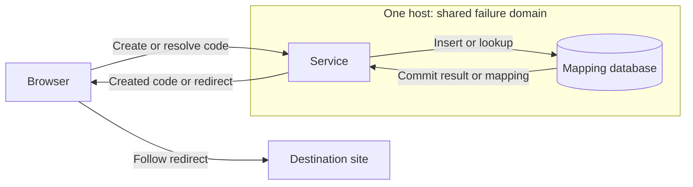

# Reference design — Single-node baseline

This is the assistant's complete response to today's assignment: draw browser → service →
database, trace create and redirect, and name the first bottleneck to measure. It is one
defensible hypothetical design. Your practice and evidence belong in [DESIGN.md](DESIGN.md).
Read this before a guided attempt or compare afterwards within the same 30-minute session.

## Assumptions and requirement

The product creates a short code for a valid HTTPS destination and redirects a browser that
requests that code. There are no custom aliases, analytics, or destination previews in this
baseline. A code has one immutable destination. Multiple codes for the same destination are
allowed, so this baseline does not promise idempotent creation.

Assume one host runs one service process and a relational database. Logical components remain
separate below, but host failure affects both. The database's mapping table is the source of
truth. Its configured durable commit is required before acknowledging creation; off-host
backups are a proposed recovery measure, not a claim of continuous availability.

Assumed peak load is 100 redirects/s plus 2 creates/s. These are chosen planning inputs, not
observed traffic. The provisional latency target is p95 ≤ 200 ms from receipt of a valid
request at the service to completion of its response, under that load. Redirect and create
latencies are reported separately, with timeouts/errors reported alongside them. Browser DNS,
connection setup, and destination loading are outside this service boundary.

## Diagram and state ownership

Proposed mapping fields are `code` (unique primary key), `destination`, and `created_at`.
The service validates allowed URL schemes, chooses a candidate code, and relies on the database
constraint to settle collisions. It does not use a check-then-insert race as the uniqueness rule.
An index on the primary key supports the redirect lookup. This is a schema proposal, not a
measured query plan or an implementation of code generation.

## Create trace

1. Browser submits a destination to `POST /links`.
2. Service validates the input and proposes a code.
3. Database attempts an insert with the unique code constraint. A collision causes a bounded
   new-code attempt; other storage errors are handled as failures, not collisions.
4. On successful durable commit, service replies `201 Created` with the code and short URL.
5. On validation failure, service returns a client error. On unavailable storage, it reports
   a temporary failure and never claims an uncommitted mapping was created.

## Redirect trace

1. Browser requests `GET /a7`.
2. Service looks up `a7` in the authoritative table.
3. A found mapping produces `302 Found` with its destination in `Location`.
4. An absent mapping produces `404 Not Found`. A storage outage produces a temporary server
   failure; absence has not been established in that case.
5. Browser follows the redirect and contacts the destination. That destination can fail even
   when the shortener operation succeeded.

These status roles follow [HTTP Semantics, RFC 9110](https://www.rfc-editor.org/rfc/rfc9110.html)
(rechecked 2026-09-22). The endpoint names and choice of temporary redirect are this example's
contract. Redirect caching policy would need an explicit decision before implementation.

## First bottleneck to measure

My first hypothesis is database service and queue time because both operations depend on it.
As a deliberately simplified capacity check, assume one serialized database operation takes
4 ms. Ideal capacity is `1000 ms/s ÷ 4 ms/operation = 250 operations/s`. At one operation
per request, the assumed workload demands `100 + 2 = 102 operations/s`, or 40.8% of that
modeled worker. This leaves modeled headroom but proves neither the latency target nor
capacity: inserts, lookup caching, locks, and disk synchronization have different costs.

Measure database call latency, connection wait, disk utilization, app CPU, and request p95
under the stated workload. If queueing grows with database utilization while app CPU remains
low, investigate the query/index and storage path. If app CPU saturates first, reject this
initial hypothesis. [Handling Overload](https://sre.google/sre-book/handling-overload/)
(rechecked 2026-09-22) supplies the resource-pressure perspective; these figures are assumptions.

## Decision and alternative

Choose the single-host baseline for a small initial workload and a simple authoritative path.
Its principal cost is a shared outage domain and resource contention. The first alternative
is moving the database to a separate host: it separates CPU/disk resources and permits independent
maintenance, but adds network delay and failure handling. It does not automatically make either
component highly available. Change when representative tests show host contention or the
availability requirement explicitly demands surviving one host failure.

## Failure walkthrough

Consider a crash after database commit but before the create response reaches the browser.
The mapping exists; the browser cannot tell whether creation succeeded. A retry can create a
second code under the stated contract. The invariant “one destination per code” survives, while
“one code per user action” was never promised. If that latter guarantee becomes necessary,
durable idempotency must be added rather than assuming retries are harmless.

A host outage stops both create and redirect. Restart restores service only if the database
and disk remain recoverable. A destroyed disk requires restoration from a tested off-host
backup and may lose writes newer than that backup. Recovery objectives must be agreed before
claiming a stronger durability or availability promise.

## Self-review

The diagram and both operation traces are complete. The source of truth and commit boundary
are explicit. The first measurement is a hypothesis with a way to disprove it. Uncertainty
remains in actual workload, storage configuration, record sizes, and recovery objectives.
Next I would run a representative mixed-load test and a restore exercise, not infer results
from the arithmetic. No deployed service or benchmark is claimed by this reference.

[Concepts](CONCEPTS.md) · [Assignment and acceptance](README.md#assignment) · [Your practice](DESIGN.md)
