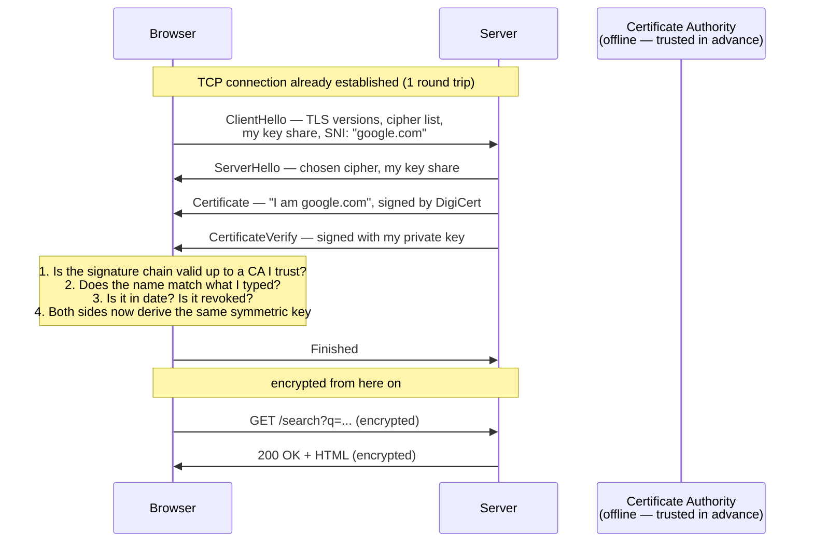

# Day 006 · System Design — HTTPS and TLS, without the maths

**After today you can:** You can explain what the padlock actually guarantees, and what it does not.

**The interviewer asks it as:** *What does HTTPS protect you from? What does it not protect you from?*

---

## 1. What this is, and why they ask it

**HTTPS** is ordinary HTTP with a layer underneath it called **TLS** — Transport Layer
Security. TLS does three things and only three: it proves you are talking to the machine
that owns the name you asked for, it scrambles everything you send so that nobody in
between can read it, and it detects any attempt to alter it in transit.

The padlock in the address bar means those three things succeeded. It means nothing else at
all.

Interviewers ask this because the second half of the question is where candidates fall over.
"HTTPS encrypts your data" is true and incomplete, and the incompleteness is dangerous. A
site can have a perfect padlock and still be a phishing site, still store your password in
plain text, still leak which sites you visit to your network provider. Knowing exactly where
the guarantee starts and stops is a security-thinking test, not a networking test, and it is
asked far more often than the mathematics ever is.

---

## 2. The story

Nandini is selling her mother's flat in Kochi, and she lives in Bengaluru. The buyer's
lawyer needs the original ownership documents this week, and she cannot fly down. The buyer
says he will send a man to collect them.

She is not comfortable with this, and she is right not to be. She has never met the man. The
documents are irreplaceable. Anybody could ring her doorbell on Thursday and say the buyer
sent them.

So she does the sensible thing. She rings the buyer — whose number she has had for four
months, whose voice she knows, whose face she has seen — and asks him directly. He says the
man's name is Imran, gives her his number, and describes him. She rings Imran and hears the
same details back. Now she is satisfied, not because she trusts Imran, but because somebody
she already trusts vouched for him.

They meet on Thursday at half past four in a café near her office, because she is not having
a stranger come to the flat. The place is full — every table taken, the machine grinding,
two people at the next table talking about a wedding.

They sit and they speak quietly. She goes through the documents with him, tells him which
ones are originals and which are copies, and mentions the amount that is still outstanding
and the date it is due. Nobody around them hears a word of it. The couple at the next table
would have to lean over to catch anything, and they are not interested.

But everybody in that café can see plenty. They can see that a woman met a man at half past
four. They can see it lasted twenty-five minutes. They can see she handed him a thick folder
and he put it in his bag. The man behind the counter recognises her, because she comes in
most mornings, and he could tell anyone who asked that she was in on Thursday afternoon with
someone he had not seen before. None of the content, all of the shape.

And there is one thing none of this covers, which occurs to her on the walk back. She checked
very carefully that the man in front of her was Imran. She never checked whether Imran was
honest. If the buyer's own man decides to disappear with the documents, every bit of her
careful verification will have been correct and useless. She verified who he was. She did not
verify what he would do.

---

## 3. The idea in plain English

Nandini's afternoon is TLS, part for part, including the part at the end that most people
leave out.

### Ringing the buyer: this is the certificate

Nandini did not verify Imran directly. She asked somebody she already trusted, who vouched
for him.

That is exactly how HTTPS proves identity. When your browser connects to `google.com`, the
machine sends back a **certificate** — a small document containing the name it claims
(`google.com`), a public key, an expiry date, and a **signature** from a **Certificate
Authority**.

A **Certificate Authority**, or **CA**, is an organisation whose job is to vouch. Let's
Encrypt, DigiCert and Sectigo are the big ones. Your browser and operating system ship with
a list of roughly 150 CAs they already trust — that list is the buyer whose number Nandini
has had for four months. Nobody chose it consciously; it came with the device.

So the chain is: *I trust my browser's built-in list → that list trusts DigiCert → DigiCert
has signed a certificate saying this machine is google.com → therefore this machine is
google.com.* That is the **chain of trust**, and every link in it is somebody vouching for
somebody else.

Crucially, the CA checked one thing only: that whoever asked for the certificate controls
that domain name. It did not check that they are honest, or competent, or that the site does
anything reasonable. **A CA vouches for identity, never for character.**

### Speaking quietly in a full café: this is encryption

Everything Nandini and Imran said was inaudible to everyone around them, even though they
were surrounded.

TLS **encrypts** the entire HTTP conversation. That means it is scrambled with a shared
secret so that anyone reading the traffic sees only noise. What gets covered is more than
people expect:

- the path — `/account/settings`, not just the site
- all headers, including cookies and `Authorization`
- the request body
- the entire response

Anyone sitting between you and the site — the café's wifi, your ISP, whoever runs the network
at an airport — sees encrypted bytes and nothing else.

TLS also guarantees **integrity**: each piece carries a check value, so if anything in
transit is altered by even one bit, the other end notices and drops the connection. Nobody can
quietly change the account number in your bank transfer while it is in flight.

### The café could see everything else: this is metadata

This is the part that gets left out, and it is the whole second half of the interview
question.

Even with perfect encryption, an observer on the network sees:

| Visible | Why |
|---|---|
| **The IP address you connected to** | The network has to route to it |
| **The domain name** | Sent in the clear during the handshake, in a field called **SNI** |
| **The DNS lookup**, unless you use encrypted DNS | Traditional DNS is plain UDP |
| **When you connected and for how long** | Timing is not encryptable |
| **How many bytes went each way** | Sizes are visible even when contents are not |

So your ISP cannot read your messages and absolutely can tell that you visited a particular
site, at 4:30 pm, for twenty-five minutes, and downloaded 40 MB. Traffic analysis on those
sizes and timings can often infer which page you loaded, even inside HTTPS.

There is a newer feature called **Encrypted Client Hello** that hides the SNI field, and it
is slowly being deployed, but it is not something you can assume today.

### Verified who, not verified what: the padlock's real limit

Nandini's closing thought is the sentence that answers the interview question.

A padlock means: *the connection to the name in the address bar is private and unaltered.*

It does **not** mean:

- **the site is honest.** Anyone can get a free certificate for `paypa1-secure.com` in
  ninety seconds. Most phishing sites have valid certificates, precisely because users were
  taught to look for the padlock.
- **your data is safe once it arrives.** TLS protects data *in transit*. The moment it
  reaches the far end it is decrypted, and what happens next — plain-text passwords, an
  unencrypted backup, a leaky log file — is entirely outside TLS's scope.
- **the site is not compromised.** A site serving malware over HTTPS serves it with a
  perfect padlock.
- **nobody knows where you went.** See metadata, above.

### Two kinds of key, and why both exist

One more piece, without the mathematics.

**Asymmetric encryption** uses a pair of keys: a **public key** anyone may have, and a
**private key** only the owner holds. Anything scrambled with the public key can only be
unscrambled with the private one. This solves the impossible-looking problem of agreeing a
secret with someone you have never met — but it is slow, perhaps a hundred times slower than
the alternative.

**Symmetric encryption** uses one shared key for both directions. It is very fast. The
problem is agreeing the key in the first place, over a network everyone can read.

TLS uses both, and the division of labour is the answer to a common follow-up: **asymmetric
keys are used briefly, during the handshake, to agree a symmetric key. Then everything else
uses the fast symmetric key.** Expensive once, cheap thereafter.

---

## 4. The picture

The TLS 1.3 handshake, which is what actually happens before your first HTTP byte:



**What to notice:** the certificate is checked, not fetched. The CA is not contacted during
the handshake at all — its signature was applied months earlier and the browser already
holds the CA's key. That is why HTTPS still works when the CA's own site is down.

Now what an observer on the network actually sees:

```
   +--------------------------------------------------------------+
   |  VISIBLE to your ISP, the wifi owner, anyone in between       |
   |                                                              |
   |   your IP address        ->  142.250.183.206                 |
   |   destination port       ->  443                             |
   |   the domain name (SNI)  ->  "google.com"                    |
   |   the DNS lookup         ->  "who is google.com?"            |
   |   the timing             ->  16:31:02, lasted 25 minutes     |
   |   the volume             ->  4 KB up, 2.1 MB down            |
   +--------------------------------------------------------------+
   +--------------------------------------------------------------+
   |  HIDDEN — encrypted                                          |
   |                                                              |
   |   the path               ->  /account/settings/billing       |
   |   query parameters       ->  ?card=...                       |
   |   all headers            ->  Cookie, Authorization           |
   |   the request body       ->  {"password": "..."}             |
   |   the entire response    ->  your account page               |
   +--------------------------------------------------------------+
```

**What to notice:** the top box is the answer to "what does it *not* protect you from". Being
able to draw that line is the whole point of the lesson.

And the chain of trust, which is what the browser is actually checking:

```
   Root CA          DigiCert Global Root G2
      |             (in your browser's store — trusted because it shipped there)
      | signs
      v
   Intermediate     DigiCert TLS RSA SHA256 2020 CA1
      |             (sent by the server during the handshake)
      | signs
      v
   Leaf             CN = *.google.com
                    (sent by the server; this is the one being checked)

   The browser verifies each signature upward until it reaches
   something already in its trust store. If the chain breaks, or the
   name does not match, or the date has passed -> connection refused.
```

**What to notice:** the root is never sent over the network. It is already on your device.
That is the entire foundation, and it is also the entire weakness — anyone who can add a root
to your device can read your traffic.

---

## 5. How it actually works

### What is actually in a certificate

You can look at one yourself: `openssl s_client -connect google.com:443 -showcerts`, or click
the padlock in any browser. Inside:

- **Subject** — the name being claimed, e.g. `CN=*.google.com`
- **Subject Alternative Names** — the full list of names it covers; this is what browsers
  actually check, not the old Common Name field
- **Public key** — the server's public key
- **Issuer** — which CA signed it
- **Validity** — not before, not after. Ninety days for Let's Encrypt, up to about a year
  for paid ones
- **Signature** — the CA's signature over all of the above

Three checks fail loudly and you have seen all three: name mismatch, expired, and
untrusted issuer. Certificate expiry is one of the most common self-inflicted production
outages in the industry, which is why automated renewal is not optional.

### How you get one

**Let's Encrypt** issues certificates free and automatically, and it changed the web — HTTPS
went from a minority of traffic to the overwhelming majority in a few years. The client,
usually **certbot** or **Caddy**, proves domain control by placing a specific file at a
specific URL on the domain, or by adding a DNS record. If the CA can fetch it, you evidently
control the domain, and a certificate is issued. That entire proof takes seconds and involves
no human.

Notice what that proves and what it does not. It proves control of a name. It says nothing
about the operator.

### Where TLS actually terminates

In production TLS is almost never handled by your application. It is **terminated** at the
edge — by **nginx**, **HAProxy**, an **AWS Application Load Balancer**, or a CDN such as
**Cloudflare** — which decrypts the request and forwards it inside your network.

That has two consequences worth naming in an interview. First, your application code sees
plain HTTP and must read `X-Forwarded-Proto` to know the original request was secure. Second,
traffic between the load balancer and your application is unencrypted unless you arrange
otherwise, which is fine inside a private network and is exactly what **mTLS** and service
meshes such as **Istio** and **Linkerd** exist to fix when it is not.

**mTLS** — mutual TLS — is the same handshake with the check running both ways: the client
also presents a certificate and the server verifies it. It is the standard way services
authenticate to each other inside a company, because it removes shared passwords entirely.

### Version 1.3, and why it matters

**TLS 1.3** (2018) removed every cipher that had been broken, cut the handshake from two
round trips to one, and added **0-RTT resumption**, where a returning client can send data in
its very first message. TLS 1.0 and 1.1 are deprecated and disabled in modern browsers; 1.2
is still widely used and acceptable; 1.3 is what you want.

The 0-RTT feature has a genuine caveat worth knowing: early data can be **replayed** by an
attacker, so it must only be used for idempotent requests. That connects directly to
[day 005](../day-005-python-lists-and-tuples/README.md) — it is the same reason `POST` needs
an idempotency key.

### HSTS, and the gap it closes

If a user types `example.com`, the browser tries HTTP first, and the site redirects to HTTPS.
That first plain request is a window for an attacker to intercept and never let the upgrade
happen. **HSTS** — a `Strict-Transport-Security` header — tells the browser "never use plain
HTTP for this domain again, for the next year". After the first visit, the window is closed.
Sites can also be added to a **preload list** that ships inside the browser, closing it even
for the first visit.

### When it fails, and the legitimate man-in-the-middle

Your workplace may install its own root certificate on your laptop. From then on, the
company's proxy can present its own certificate for any site, your browser will trust it
because the root is in the store, and the proxy can read everything. This is normal corporate
practice, it is how **Burp Suite** and **mitmproxy** work for legitimate testing, and it is
also precisely the attack TLS is designed to prevent. **The system rests entirely on which
roots are in your trust store.**

The defence for a mobile app that cares is **certificate pinning**: the app ships with the
expected certificate or public key and refuses anything else, regardless of the trust store.
Banking apps do this. The cost is that rotating a certificate now requires an app update, and
getting it wrong bricks your app for everyone.

---

## 6. The numbers

**What the handshake costs in time.** At 40 ms round trip:

```
TCP handshake        1 RTT  =  40 ms
TLS 1.2 handshake    2 RTT  =  80 ms
                             -------
before the first request:     120 ms

TCP handshake        1 RTT  =  40 ms
TLS 1.3 handshake    1 RTT  =  40 ms
                             -------
before the first request:      80 ms      (a third less)

TLS 1.3 resumption   0 RTT  =   0 ms
                             -------
before the first request:      40 ms      (TCP only)
```

Over a 250 ms intercontinental link, TLS 1.2 costs 500 ms of setup and TLS 1.3 costs 250 ms.
That difference is visible to a user, and it is why session resumption is worth configuring.

**What it costs in CPU.** The asymmetric part is the expensive bit, and it happens once per
connection:

```
handshake (ECDSA P-256)  ~  1 ms of CPU per connection
bulk encryption (AES-GCM with hardware support)  ~ 1-2 GB/s per core
```

So on a machine handling 10,000 new connections per second:

```
10,000 x 1 ms = 10 seconds of CPU per second = 10 cores, just for handshakes
```

Ten cores for handshakes alone. And the same machine serving 1 Gbps of already-established
traffic:

```
1 Gbps / 8 = 125 MB/s / 1,500 MB/s per core = 0.08 cores for the encryption itself
```

**The handshakes cost a hundred times more than the encryption.** That single comparison is
why keep-alive and session resumption matter so much, and it is the number to quote when
someone claims HTTPS is expensive. Sustained encryption is essentially free; setting up
connections is not.

**Session resumption, with the arithmetic.** If 90% of connections resume:

```
without resumption: 10,000 full handshakes/s     = 10 cores
with 90% resumption: 1,000 full + 9,000 resumed
                     1,000 x 1 ms + 9,000 x 0.05 ms = 1.45 s of CPU = 1.5 cores
```

From ten cores to one and a half, by enabling one feature.

**Certificate sizes.** A chain of leaf plus intermediate is roughly 2–4 KB, sent on every new
connection:

```
10,000 new connections/s x 3 KB = 30 MB/s of certificate traffic
```

Not enormous, but a real reason to prefer ECDSA certificates (about 800 bytes) over RSA
(about 2 KB) at scale, and a reason not to send the root certificate you do not need to send.

**Expiry, as an operational number.** Let's Encrypt issues for 90 days:

```
90 days, renewed automatically at day 60
-> a renewal failure gives you 30 days of warnings before an outage
```

Thirty days of margin is generous, and expiry outages still happen constantly — because
nobody was reading the warnings.

---

## 7. The trade-offs

**TLS costs a round trip and buys you the entire security model of the web.** The honest
accounting: 1 extra round trip on connection with TLS 1.3, about 1 ms of CPU per new
connection, and near-zero cost per byte thereafter. In exchange you get confidentiality,
integrity and server identity. There is no serious argument for plain HTTP on a public site
in 2026 — browsers mark it insecure, HTTP/2 and HTTP/3 effectively require TLS, and the CPU
argument died when AES instructions went into every processor.

**Free automated certificates versus paid ones.** Let's Encrypt is free, automated, and
90-day, which forces you to automate renewal — that constraint is a feature. Paid CAs offer
longer validity, warranties, support, and **Extended Validation**, which involves a human
checking the legal entity. EV has largely lost its point: browsers stopped displaying the
company name in the address bar, because research showed users never noticed it. For almost
everyone, free and automated is the right answer.

**Terminating TLS at the edge versus end to end.** Terminating at a load balancer or CDN
centralises certificate management, allows caching and compression, and lets you inspect
traffic for routing and rate limiting. The cost is that traffic inside your network is
plain, so anyone with access to that network sees everything. **Zero-trust** architectures
reject that assumption and require mTLS between every pair of services — which is materially
more operational work, and correct if your compliance regime or threat model demands it.

**Certificate pinning: strong and dangerous.** Pinning defends against a compromised or
coerced CA and against corporate interception, which is exactly right for a banking app. It
also means that if you rotate your certificate without shipping an app update first, every
installed copy of your app stops working, and you cannot fix it remotely because the app
will not trust the connection that would deliver the fix. Pin to a backup key as well, or do
not pin.

**I would not rely on HTTPS alone if...** the threat is anything other than an observer on
the network. It does nothing about a compromised endpoint, a malicious site with a valid
certificate, a database breach, a logged password, or a user who was phished. Those need
different controls entirely: hashing passwords, encryption at rest, least privilege,
multi-factor authentication. HTTPS secures the pipe. It has no opinion about what is at
either end of it.

---

## 8. In the interview

### How it gets asked

- *"What does HTTPS protect you from, and what does it not?"* — the direct version. The
  second half is the actual question.
- *"Walk me through what happens when you connect to an HTTPS site."* — the handshake
  version, often a follow-up to "what happens when you type google.com".
- *"A site has a valid padlock. Is it safe?"* — the good version, and the answer is no.
- *"Why does TLS use both symmetric and asymmetric encryption?"* — the mechanism check.

### What to say out loud, in the first ninety seconds

1. **Give the three guarantees.** *"TLS gives you three things: identity, confidentiality and
   integrity. Those three and nothing else."*
2. **Explain identity through the chain.** *"The server sends a certificate signed by a CA my
   browser already trusts. It checks the signature chain, that the name matches what I typed,
   and that it hasn't expired."*
3. **Say what is encrypted, specifically.** *"Everything above the transport — the path, all
   headers including cookies, the request body and the whole response."*
4. **Then, unprompted, say what is not.** *"What's still visible is the IP address, the
   domain name in the SNI field of the handshake, the DNS lookup unless it's encrypted, and
   the timing and volume of traffic. So my ISP can't read my messages but absolutely knows
   which sites I visited and when."*
5. **Land the important limit.** *"And the padlock says nothing about whether the site is
   honest. Anyone can get a free certificate for a lookalike domain in ninety seconds — most
   phishing sites have valid ones. It proves the connection is private, not that the other end
   deserves your data."*
6. **Add the endpoint limit.** *"It also only covers data in transit. Once it arrives it's
   decrypted, and what happens then — hashing, encryption at rest, logging — is a separate
   problem."*

Steps 4 and 5 are the answer. Steps 1 to 3 are what everyone says.

### The follow-ups

**"Why does TLS use both symmetric and asymmetric encryption?"**
Because they solve different problems and each is bad at the other's. Asymmetric encryption
lets two parties who have never met agree on a secret over a channel everybody can read,
which is otherwise impossible — but it is roughly a hundred times slower. Symmetric
encryption is very fast and needs a shared key you have no way to agree on. So TLS uses
asymmetric operations during the handshake to authenticate the server and establish a shared
symmetric key, then uses that fast key for the whole session. Expensive once, cheap
thereafter — which is exactly why handshakes dominate the CPU cost and bulk encryption
barely registers.

**"A site has a valid certificate. Is it safe to enter my card details?"**
No, and those are two different questions. The certificate says the connection to whatever is
in the address bar is private and unaltered. It says nothing about who that is. Certificates
are free and automated, so `paypa1-secure.com` can have a perfect one within minutes, and
attackers use that deliberately because users were taught to look for the padlock. The
padlock answers "is anyone listening?", not "should I trust this site?".

**"How does the browser know it can trust the CA?"**
It doesn't decide — it ships with a store of roughly 150 root certificates chosen by the
browser or OS vendor. The chain is checked upward until it reaches one of those roots. Which
means the whole system rests on that store, and anyone who can add a root to your device can
transparently read your traffic. That is exactly how corporate inspection proxies work: they
install a company root on managed laptops. The countermeasures are certificate pinning for
apps that need it, and Certificate Transparency logs, which make every issued certificate
publicly auditable so that a domain owner can detect a certificate they never asked for.

**"Can an attacker on the same wifi see what I'm doing?"**
They cannot read your traffic — content, paths, cookies and bodies are all encrypted. They
can see which sites you connect to, from the DNS lookups and from the SNI field in the
handshake, which is sent before encryption begins. They can see timing and volume, and
traffic analysis on those can often identify which specific page you loaded. So the honest
answer is: they cannot read it, and they can build a fairly detailed picture of what you did.
Encrypted DNS and Encrypted Client Hello close some of that gap, and neither is universal
yet.

### A model answer

> "HTTPS is HTTP over TLS, and TLS gives you exactly three things: identity, confidentiality
> and integrity.
>
> Identity comes from certificates. The server sends one that says 'I am google.com', signed
> by a certificate authority. My browser ships with a store of roots it already trusts, and it
> verifies the signature chain up to one of those, checks the name matches what I typed, and
> checks the dates. The CA isn't contacted during the handshake — that signature was applied
> months ago.
>
> Confidentiality comes from encryption, and it covers more than people assume: the path, all
> the headers including cookies and auth tokens, the body, and the entire response. Integrity
> means each piece carries a check value, so any modification in transit breaks the connection
> rather than passing quietly.
>
> Now what it doesn't protect. First, metadata. The IP address is visible, the domain name is
> visible because SNI is sent in the clear during the handshake, the DNS lookup is usually
> visible, and timing and byte counts are visible. So an observer can't read my messages and
> can absolutely tell I spent twenty minutes on a particular site and downloaded two
> megabytes. Traffic analysis on sizes can often narrow that to a specific page.
>
> Second, and more importantly, the padlock says nothing about trustworthiness. Certificates
> are free and issued in ninety seconds to anyone who controls a domain, so a phishing site at
> a lookalike domain has a perfect padlock. The CA vouches for identity, never for character.
>
> Third, it only covers data in transit. The moment it lands it's decrypted, and whether the
> password is hashed, whether the database is encrypted at rest, whether it ends up in a log
> file — none of that is TLS's problem.
>
> One thing I'd raise in a design discussion: in production TLS usually terminates at the load
> balancer or CDN, not at the application. So my app sees plain HTTP and has to read
> X-Forwarded-Proto, and traffic inside the network is unencrypted unless we've set up mTLS.
> Whether that's acceptable depends on whether we're treating the internal network as
> trusted."

That answer covers both halves of the question, gets the metadata point in without being
asked, lands the phishing limitation, and finishes on a real architectural consequence.

---

## 9. Recall card

1. **TLS gives you three things: identity, confidentiality, integrity.** The padlock means
   those three succeeded and nothing more.
2. **Identity comes from a chain of trust** — leaf signed by intermediate, signed by a root
   already in your device's store. The CA vouches for *who*, never for *honest*.
3. **Encrypted:** path, headers, cookies, body, response. **Visible:** IP address, domain
   name via SNI, DNS lookup, timing, byte counts.
4. **A valid certificate does not mean a safe site.** Free automated certificates mean
   phishing sites have padlocks too.
5. **Asymmetric for the handshake, symmetric for the data.** Handshakes cost ~1 ms of CPU
   each and dominate; bulk encryption is nearly free. That is why resumption and keep-alive
   matter.
