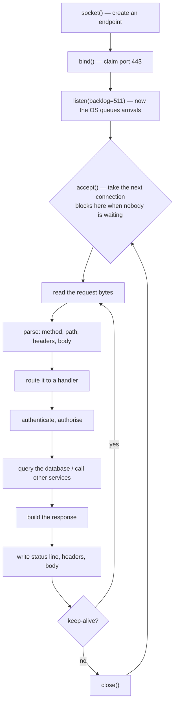

# Day 007 · System Design — What a web server actually does

**After today you can:** You can describe the loop a server runs: listen, accept, handle, respond.

**The interviewer asks it as:** *What happens inside the server between receiving a request and sending a response?*

---

## 1. What this is, and why they ask it

A web server is a program running one loop, forever. It waits for a connection, takes the
next one, reads the request, works out the answer, writes the response, and goes back to
waiting.

That is the whole thing. Everything else — worker processes, thread pools, event loops,
queues — exists because that loop has to run many times at once and there are only so many
hands.

Interviewers ask this because it is the foundation of every capacity conversation that
follows. When you later say "we'd need about thirty machines", the number comes from how many
requests one instance of this loop can complete per second. A candidate who cannot describe
the loop cannot do that arithmetic, and every scaling answer they give afterwards is a guess
dressed up as a design.

---

## 2. The story

The barber shop on the corner of Sadar Bazaar opens at eight in the morning. There are three
chairs with three barbers, and along the opposite wall there is a bench with six seats on it.

Ramesh, the owner, unlocks the shutter at ten to eight. There is nobody outside. He puts the
lights on anyway, fills the water bottles, sets out the towels, and the three of them stand
there. Nobody comes in until twenty past. That twenty-five minutes of standing about is not a
mistake. It is the job. The shop has to be ready before the first man walks in, because a man
who finds a closed shutter goes to the shop by the bus stop instead.

A haircut takes about twenty minutes. So when a man sits down in a chair, that barber is gone
for twenty minutes. He cannot start anybody else. He cannot half-do a second head. That chair
is occupied until the man gets up.

Around ten on a Saturday it fills up. Three men in the chairs, and men arriving faster than
heads are being finished. So they sit on the bench, and the bench works well — the moment a
barber shakes out his cloth, he calls the next man off the bench and starts. Nobody has to
coordinate it. The bench is simply where you wait.

Then the bench fills too. Six men sitting, three in the chairs. And now Ramesh has to do the
thing he hates: the next man who pushes the door open gets told, from across the room, that
there is no room, and that he should come back after two. It is better than letting him stand
in the doorway for an hour and then be angry. Being turned away quickly is a kind of honesty.

Two things ruin a Saturday, and Ramesh can name both.

The first is a man who wants a haircut, a shave and a head massage. Fifty minutes. He is
entitled to it, he pays for it, and for fifty minutes one of the three chairs is out of
service. The bench does not care why the chair is busy. It just gets longer.

The second is worse and rarer. Once, the barber in the middle chair sent his apprentice out
to fetch a particular brand of hair colour from a shop two streets away, and then stood there
holding the man's head, doing nothing, until the boy got back. Eleven minutes of a chair
occupied by a barber who was not cutting anything, only waiting. Ramesh made a rule after
that: you finish somebody else while you wait.

By four in the afternoon the bench is empty and the barbers are standing at the door again,
watching the road.

---

## 3. The idea in plain English

The barber shop is a web server, and every part of it has a name.

### The loop

The shop's day is four steps repeating:

1. **Open and be ready.** The server **binds** to a port and calls **listen**. This is the
   lights going on at ten to eight. From this moment the operating system will accept
   connections on that port on the program's behalf, whether or not anybody has arrived.
2. **Take the next one.** The server calls **accept**, which hands it one connection. That
   is a barber calling the next man to the chair.
3. **Handle it.** Read the request, work out what is being asked, check permissions, talk to
   the database, build the answer. The twenty minutes of cutting.
4. **Respond and go back.** Write the response, then either close the connection or keep it
   open for the next request on it, and return to step 2.

Say those four words in an interview — **listen, accept, handle, respond** — and you have
given the spine of the answer.

### One chair is one worker

A barber cutting hair cannot start another head. A **worker** handling a request cannot
handle another one at the same time. Three chairs means three requests being worked on at
once, and the count of chairs is the single most important number about the shop.

Servers do this in three different ways, and interviewers ask you to compare them.

**Many processes.** Each worker is a separate copy of the program with its own memory. Robust
— one crashing does not take the others down — and expensive, because each one costs tens of
megabytes. This is how **nginx** workers and **gunicorn** workers operate.

**Many threads.** Workers share the program's memory, so each costs perhaps 1 MB instead of
50. Cheaper, and you now have to be careful about two workers touching the same data. This is
the classic **Java** and **Tomcat** model.

**One worker, an event loop.** One thread, and instead of waiting for anything, it keeps a
list of everything in flight and works on whichever is ready. This is **Node.js**, and
Python's **asyncio** with **uvicorn**. It is the rule Ramesh made after the hair-colour
incident: never stand there waiting, go and do something else.

### The bench is the backlog

When every worker is busy, new connections do not vanish. The operating system holds them in
a queue called the **backlog**, and its size is a number you configure —
`listen(backlog=511)` is a common setting.

The bench is why a burst of traffic does not immediately fail. Requests wait a moment and get
served.

And when the backlog is full, the operating system **refuses** new connections outright.
Clients get `ECONNREFUSED` or a timeout. Ramesh telling a man to come back after two is
exactly the right behaviour: a fast rejection is far better than accepting work you cannot
do. This idea has a name — **load shedding** — and it is one of the things that separates a
system that degrades from one that collapses.

### The fifty-minute customer

One slow request holds a worker for its whole duration. With three workers and one request
taking fifty times as long as the others, you have effectively lost a third of your capacity
to one person.

This is why **timeouts** exist on every layer, and why slow endpoints are dangerous out of
all proportion to how often they are called. A single database query without a timeout can
take out an entire fleet, because every worker eventually ends up waiting on it.

### The apprentice sent to the shop

This is the most important idea in the story, and it is the whole argument for asynchronous
servers.

When the barber stood there holding a head while the boy fetched hair colour, he was
**blocked** — occupying a chair while doing no work. Most of what a web request does is
exactly this. It calls the database and waits. It calls another service and waits. Real
numbers for a typical request:

```
CPU work (parsing, templating, serialising)  :   5 ms
waiting for the database                     :  40 ms
waiting for another service                  :  30 ms
                                               -------
total                                          75 ms, of which 70 is waiting
```

Ninety-three percent of that request is a barber standing still. A **blocking** server keeps
the worker occupied for all 75 ms. An **asynchronous** server hands the work off, goes and
serves somebody else, and comes back when the database answers. Same hardware, roughly ten
times the concurrent requests.

That is the answer to "why is Node good at this?" and it has nothing to do with JavaScript
being fast.

### The empty shop at four o'clock

A server spends most of its life idle, waiting. That is not waste; it is headroom. A server
running at 100% of capacity is not "fully used" — it is a bench that is getting longer, as
[day 002](../day-002-counting-steps/README.md) showed. Sixty to seventy percent is a healthy
target, and the rest is what absorbs the Saturday.

---

## 4. The picture

The loop itself:



**What to notice:** the arrow from `keep-alive? yes` goes back to **read**, not to **accept**.
That is what connection reuse means, and it is why a second request on the same connection
skips the TCP and TLS handshakes entirely.

Now the shop, drawn as a capacity picture:

```
   ARRIVALS ---->  +---------- backlog queue (the bench) ----------+
                   |  [ ][ ][ ][ ][ ][ ]   6 waiting               |
                   +----------------------------------------------+
                        |          |          |
                        v          v          v
                   +---------+ +---------+ +---------+
                   | worker 1| | worker 2| | worker 3|     3 chairs
                   |  busy   | |  busy   | |  busy   |     = concurrency 3
                   |  40 ms  | |  40 ms  | | 2000 ms |  <- the fifty-minute customer
                   +---------+ +---------+ +---------+
                        |          |          |
                        v          v          v
                    RESPONSES

   backlog full  ->  new connections REFUSED at the door (ECONNREFUSED)
```

**What to notice:** worker 3. While it is held for two seconds, the shop has two chairs, not
three. Capacity is not a property of the machine alone — it is the machine divided by how
long each request holds a worker.

And the difference blocking makes, drawn on a timeline:

```
   BLOCKING — one worker, three requests, each 5 ms CPU + 70 ms waiting

   worker |CPU|~~~~~~~ waiting ~~~~~~~|CPU|~~~~~~~ waiting ~~~~~~~|CPU|~~~~ ...
          <---------- 75 ms ---------><---------- 75 ms --------->
          3 requests take 225 ms.  The worker was busy for 15 ms of it.


   EVENT LOOP — one worker, same three requests

   worker |CPU|CPU|CPU|         .... all three waiting at once ....       |CPU|CPU|CPU|
          <-15ms->              <----------- 70 ms of overlap ----------->
          3 requests take about 85 ms, on one thread.
```

**What to notice:** the waiting overlaps. The CPU work does not — it is still one thread, so
if the requests were CPU-heavy rather than wait-heavy, the event loop would give you nothing
at all. That is the trade-off in one picture.

---

## 5. How it actually works

### The actual system calls

This is not a metaphor. A web server makes these exact calls, and you can watch them with
`strace`:

```
socket()   -> create an endpoint
bind()     -> claim 0.0.0.0:8000
listen(511)-> tell the kernel to start queueing connections
accept()   -> block until one is available, then return a connection
read()     -> pull the request bytes
write()    -> push the response bytes
close()    -> release it
```

You can write a working web server in about fifteen lines of Python with the `socket` module,
and doing it once removes all remaining mystery from the phrase "web server".

### Who is actually running

In production there are usually two programs, not one:

**nginx** (or **HAProxy**, or a cloud load balancer) sits at the front. It terminates TLS,
holds thousands of slow client connections cheaply using an event loop, serves static files
directly, and forwards the rest. Its job is to be very good at connections.

**Your application server** sits behind it. **gunicorn** with several worker processes,
**uvicorn** for async Python, **Puma** for Ruby, **Tomcat** for Java, or a Node process. Its
job is to run your code.

That split exists because of a specific attack and a specific problem. A client on a slow
mobile network takes seconds to send a request; if that occupied one of your expensive
application workers, twenty slow clients could exhaust the pool. nginx absorbs them and only
hands the application a complete request. Deliberately exploiting this is called
**Slowloris**, and the nginx-in-front pattern is the standard defence.

### The three concurrency models, with real numbers

| Model | Cost per worker | Concurrency on one 4 GB machine | Used by |
|---|---|---|---|
| Process | 30–80 MB | ~50 | gunicorn sync, nginx workers |
| Thread | 1–8 MB | ~500 | Tomcat, gunicorn gthread |
| Event loop / coroutine | 2–10 KB | ~50,000 | Node.js, uvicorn, Go, nginx |

The event loop column is why **C10K** — handling ten thousand concurrent connections on one
machine — stopped being a research problem. The mechanism underneath is `epoll` on Linux and
`kqueue` on BSD: one call that says "tell me which of these ten thousand connections has data
ready", instead of one thread sitting on each.

**Go** deserves a mention because it sidesteps the choice. Goroutines look like threads to
write and cost about 2 KB each, with the runtime multiplexing them onto an event loop for
you. That is why Go became the default for network services.

### What the handler actually does, in order

1. **Parse** the request line and headers. Reject anything malformed with `400`.
2. **Route** — match method and path to a function.
3. **Authenticate** — validate the token or session, usually a **Redis** lookup or a
   signature check.
4. **Authorise** — is *this* user allowed *this* action?
5. **Validate** the body against a schema.
6. **Do the work** — read or write **PostgreSQL**, check a **Redis** cache, call another
   service, put a message on **Kafka**.
7. **Serialise** the result to JSON.
8. **Write** status line, headers, body.
9. **Log** the request, emit metrics, and release the database connection back to the pool.

Steps 6 and 3 are where nearly all the time goes. Steps 1, 2, 7 and 8 are the CPU work.

### Connection pools, which is where beginners get hurt

Your application does not open a new database connection per request — that would cost a
handshake every time. It keeps a **connection pool**, typically 5 to 20 connections per
worker process.

The multiplication is the part people miss:

```
20 gunicorn workers x 10 connections each = 200 database connections
```

PostgreSQL's default limit is 100. So a perfectly reasonable-looking application server
configuration takes the database down at startup. The fix is **PgBouncer** or an equivalent
pooler in front of the database, and it is one of the most common real-world outages there
is.

### Graceful shutdown

When you deploy, the old process must not simply be killed mid-request. The correct sequence
is: stop accepting new connections, finish the in-flight ones, then exit. This is what
`SIGTERM` means to a well-behaved server, and it is why load balancers have a **draining**
period. Skipping it means every deployment returns errors to whoever was mid-request.

---

## 6. The numbers

**What one worker can do.** If a request takes 50 ms of wall-clock time:

```
1,000 ms per second / 50 ms per request = 20 requests per second per worker
```

**What one machine can do.** Four workers on a 4-core machine:

```
4 workers x 20 rps = 80 requests per second
```

That is the number everything else is built on. Note that it is set by the **duration** of a
request, not by the CPU work in it — a request that spends 45 of its 50 ms waiting still ties
up a blocking worker for all 50.

**The formula worth memorising.** This is **Little's Law**, and it is one line:

```
concurrency = arrival rate x average duration
```

So for 500 requests per second at 200 ms each:

```
500 x 0.2 = 100 requests in flight at any moment
```

You need at least 100 workers, or an async server able to hold 100 in-flight requests. If you
have 50, the bench grows without limit and latency climbs until something breaks. **Little's
Law turns a latency target into a worker count**, and interviewers love it because it is
arithmetic rather than opinion.

**What async buys, concretely.** Same request, 5 ms CPU and 70 ms waiting, on 4 cores:

```
blocking, 4 workers   :  4 / 0.075 s        =  53 requests per second
async, 4 cores        :  4 x (1,000 / 5 ms) = 800 requests per second (CPU-bound ceiling)
```

Fifteen times more, on identical hardware, because the waiting overlaps. Now change the
request to 70 ms of CPU and 5 ms of waiting:

```
blocking, 4 workers   :  4 / 0.075 s = 53 rps
async, 4 cores        :  4 x (1,000 / 70 ms) = 57 rps
```

Almost identical. **Async helps exactly to the extent that your requests are waiting**, and
not at all otherwise. That comparison is the answer to "should we rewrite this in Node?".

**Memory, and how you actually pick a worker count.** On a 4 GB machine with 60 MB workers:

```
4,096 MB - 500 MB for the OS = 3,596 MB usable
3,596 / 60 = 59 workers by memory
```

But with 4 cores, the standard gunicorn heuristic is:

```
workers = 2 x cores + 1 = 9
```

Memory allows 59 and CPU suggests 9. **The lower number wins**, and for blocking workers it
is almost always the CPU one — unless requests are wait-heavy, in which case you raise it and
watch latency.

**When the bench overflows.** Arrivals 100 rps, capacity 80 rps, backlog 511:

```
excess = 20 requests per second
511 / 20 = 25 seconds until the backlog is full
```

Twenty-five seconds from "slightly overloaded" to refusing connections. That is how quickly a
20% overload becomes an outage, and it is why autoscaling has to react in seconds rather than
minutes.

**What idle connections cost.** With keep-alive, connections outnumber active requests
enormously:

```
10,000 idle keep-alive connections x 10 KB = 100 MB
```

Cheap on an event-loop server such as nginx. Ruinous on a thread-per-connection server, where
10,000 connections would mean 10,000 threads at 1 MB each — 10 GB. **This is the whole reason
nginx sits in front.**

---

## 7. The trade-offs

**Processes versus threads.** Processes give you isolation: one crashing, leaking or
segfaulting worker does not affect the others, and in Python they sidestep the Global
Interpreter Lock so you actually use every core. The cost is memory — 30 to 80 MB each — and
no shared state, so any cache has to live in Redis rather than in memory. Threads are ten to
fifty times cheaper and share memory, which is convenient and is also how data races happen.
In Python specifically, threads do not help with CPU-bound work at all because of the GIL,
which is why gunicorn's default is processes.

**Blocking versus async.** Async wins massively when requests wait on the network, which is
most web work, and it wins nothing when they compute. It also costs you a harder programming
model: one blocking call anywhere in an async handler stalls the entire event loop and every
request on it. A single synchronous `requests.get()` inside an async endpoint can take the
whole process from 800 rps to 13. Blocking code is duller and much harder to get
catastrophically wrong.

**Keep-alive: fewer handshakes, more idle connections.** Reusing connections removes a round
trip or two per request, which is a large win. It also means each client holds a connection
open between requests, so the connection count is far higher than the concurrent request
count. On a cheap-connection server that is free; on an expensive-connection server it is the
constraint. This asymmetry is exactly why the standard architecture is an event-loop proxy
in front of a process-based application server.

**Queue deeply or shed load.** A large backlog absorbs bursts and hides brief overload. It
also means that under sustained overload, requests sit in a queue until they time out — you
do the work and then discard the answer because nobody is listening any more, which is the
worst possible outcome. A short queue plus explicit rejection (`503 Service Unavailable`
with a `Retry-After` header) is usually the better engineering, because it fails fast and
honestly. Ramesh turning people away at the door is not rudeness; it is capacity management.

**I would not use this shape at all if...** the connection is long-lived and the server needs
to push. Chat, live dashboards and collaborative editing want WebSockets, where one connection
stays open for minutes or hours — which makes a process-per-connection model impossible and
an event loop mandatory. Very high fan-out work belongs on a queue rather than in the request
path: the request should enqueue a job to **Kafka** or **SQS** and return `202 Accepted`, so
that a slow downstream system cannot hold a worker hostage.

---

## 8. In the interview

### How it gets asked

- *"What happens inside the server between receiving a request and sending a response?"* —
  the direct version.
- *"How does one server handle thousands of clients at once?"* — the concurrency version.
- *"How many requests per second can one machine handle?"* — a capacity question. Do the
  arithmetic out loud.
- *"Why do people put nginx in front of their application?"* — the architecture version.

### What to say out loud, in the first ninety seconds

1. **Give the loop in four words.** *"Listen, accept, handle, respond — and then back to
   accept."*
2. **Say what "listen" means.** *"The process binds a port and calls listen, and from then on
   the kernel queues incoming connections whether or not the app is ready for them."*
3. **Walk the handling.** *"Read the bytes, parse method and path and headers, route to a
   handler, authenticate, authorise, hit the database or cache, serialise, write back."*
4. **Introduce the constraint.** *"One worker handles one request at a time, so concurrency
   is the number of workers. Requests arriving when all workers are busy sit in the backlog
   queue, and when that fills, connections get refused."*
5. **Name the three models.** *"Processes, threads, or an event loop. Processes cost tens of
   megabytes and give isolation, threads cost about a megabyte, an event loop costs kilobytes
   per connection but is single-threaded."*
6. **Land the insight.** *"Most of a web request is waiting on I/O — maybe 70 of 75
   milliseconds. A blocking worker is occupied for all of it. That's the entire case for
   async, and it's also why async does nothing for CPU-bound work."*

Step 6 is the sentence that gets you the follow-up you want.

### The follow-ups

**"How many requests per second can one server handle?"**
It depends on request duration, and I'd do the arithmetic rather than guess. If a request
takes 50 ms and I have four blocking workers, that's 1,000 divided by 50, times 4 — eighty
requests per second. The useful general form is Little's Law: concurrency equals arrival rate
times duration. If I need 500 rps at 200 ms each, I need 100 requests in flight, so 100
workers or an async server that can hold 100. The thing I'd emphasise is that duration
matters as much as the machine — halving latency doubles throughput on the same hardware.

**"Why put nginx in front of your application server?"**
Four reasons. It terminates TLS in one place, so certificates are managed once. It serves
static files without touching application code. It holds slow client connections cheaply on
an event loop, so a client on a bad mobile network does not occupy a 60 MB application
worker for three seconds — that is the Slowloris defence. And it gives you a place for rate
limiting, request buffering, compression and health checks. The pattern is: something very
good at connections in front, something running your code behind.

**"What happens when all the workers are busy?"**
New connections queue in the kernel's backlog, which is sized by the `listen()` call —
commonly 511. Requests wait there and are picked up as workers free up, which is exactly what
you want for a short burst. When the backlog fills, the kernel refuses connections and
clients see connection refused or a timeout. Under sustained overload the honest thing is to
shed load deliberately: return 503 with Retry-After rather than accept work you will not
finish in time. A request that sits in a queue for thirty seconds and then gets processed
after the client gave up is pure waste.

**"Would async fix our latency problem?"**
Only if we are waiting rather than computing. I'd measure the split first. If a request is 5
ms of CPU and 70 ms of database wait, async gives roughly an order of magnitude more
concurrency on the same hardware. If it is 70 ms of CPU and 5 ms of wait, async gives almost
nothing and adds a failure mode — one blocking call anywhere in the event loop stalls every
request on that thread. And async improves throughput, not the latency of a single request:
one user's request does not get faster, you just serve more of them at once.

### A model answer

> "The server is one loop. At startup it creates a socket, binds to a port, and calls listen
> — and from that moment the kernel accepts and queues connections on its behalf, even
> before the application asks for one. Then it loops: accept a connection, read the request
> bytes, handle it, write the response, and either close or keep the connection open for the
> next request on it.
>
> The handling part is: parse the request line and headers, route method and path to a
> handler, authenticate — usually a Redis lookup or a token signature check — authorise,
> validate the body, then do the actual work, which is normally one or more database queries
> plus maybe a call to another service. Then serialise to JSON, write the status line,
> headers and body, log it, and release the database connection back to the pool.
>
> The important constraint is that one worker handles one request at a time. So concurrency
> is the number of workers, and requests that arrive when all of them are busy sit in the
> backlog queue — typically 511 deep. When that fills, connections are refused outright.
>
> There are three ways to get concurrency. Processes, at 30 to 80 megabytes each, which is
> what gunicorn does by default and which sidesteps Python's GIL. Threads, at about a
> megabyte each. Or an event loop, at a couple of kilobytes per connection, which is Node
> and uvicorn.
>
> The insight that decides which is that most of a web request is waiting, not computing —
> maybe 5 milliseconds of CPU and 70 of database and network. A blocking worker is occupied
> for the whole 75. An event loop hands the wait off and serves someone else, so on four
> cores you go from around 50 requests per second to hundreds. But that gain is entirely
> from overlapping the waiting: if the request were CPU-bound, async would give me nothing.
>
> For capacity I'd use Little's Law — concurrency equals arrival rate times duration. At 500
> requests per second and 200 milliseconds each, that's 100 in flight, so 100 workers or an
> async server sized for it, plus headroom, because a server at 100% utilisation isn't fully
> used, it's a queue that's growing."

That answer gives the loop, the mechanics, the constraint, the three models, the deciding
insight, and finishes with arithmetic that a capacity discussion can be built on.

---

## 9. Recall card

1. **The loop: listen, accept, handle, respond, repeat.** `socket → bind → listen → accept →
   read → write → close`.
2. **One worker, one request.** Concurrency = number of workers. Overflow waits in the
   **backlog**; when that fills, connections are refused.
3. **Three models:** processes (30–80 MB, isolated), threads (~1 MB, shared), event loop
   (~2 KB, single-threaded).
4. **Most of a request is waiting**, not computing — which is the entire case for async, and
   the reason it does nothing for CPU-bound work.
5. **Little's Law: concurrency = arrival rate × duration.** 500 rps × 200 ms = 100 in flight.
   That is how a latency target becomes a worker count.
