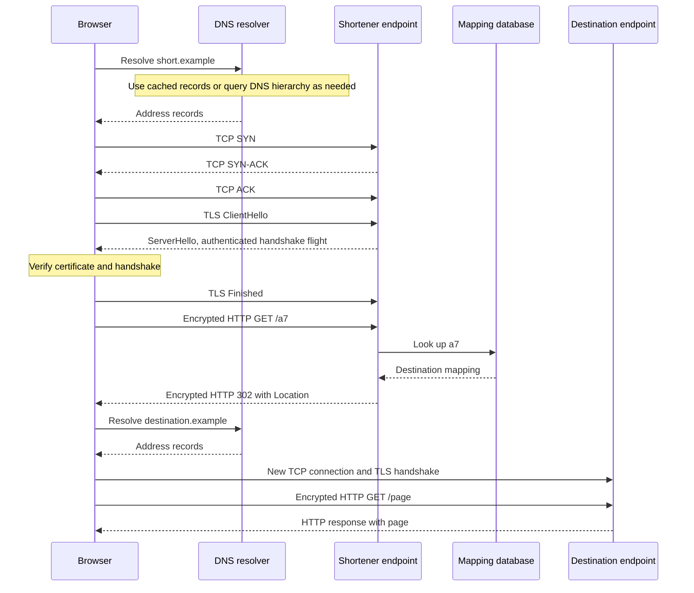

# Reference design — Request journey

This assistant-authored answer draws DNS, connection establishment, TLS, request, and response
for a browser opening a shortened URL. It is a hypothetical protocol trace, not captured network
traffic. Your own diagram and evidence belong in [DESIGN.md](DESIGN.md). Guided reading or
post-attempt comparison fits the same 30-minute session.

## Assumptions and requirement

The browser opens `https://short.example/a7`, which maps to
`https://destination.example/page`. Both names are illustrative. Assume HTTP/1.1 over TCP,
TLS 1.3 with a full server-authenticated handshake and no early data, no proxy, and no usable
cached address or reusable connection for either origin. Ignore extra page assets and redirects.
The requirement is to explain the complete navigation through the first destination response,
while distinguishing the shortener's successful redirect from destination availability.

The shortener's database remains the source of truth for `a7 -> destination`. DNS is authoritative
for name records through its own DNS hierarchy; it does not own the application's code mapping.
The browser owns following the redirect. Each server is responsible for its own TLS identity.

## Sequence diagram

The TLS arrows summarize handshake messages, not a packet-by-packet capture. Certificate and
handshake verification must succeed before normal authenticated application use. HTTP messages
are protected on the TLS connection even though the diagram labels their application meaning.
The server may receive the final handshake data and request close together; that does not
remove the logical prerequisite.

## Request and response boundaries

The initial request names `/a7` at the shortener authority. The service looks up the code and
returns `302 Found` with `Location: https://destination.example/page`. The next request names
`/page` at the destination authority. The shortener does not proxy the destination's page.
The browser can therefore receive a correct redirect and still fail to load the destination.

DNS resolution is about host names. It does not send `/a7` to the resolver as the lookup key.
The recursive resolver can use cached records or consult the DNS hierarchy as needed; this
does not imply a fixed number of DNS network round trips on every navigation.

Protocol references checked 2026-09-22: [RFC 1034](https://www.rfc-editor.org/rfc/rfc1034.html)
for resolution, [RFC 9293](https://www.rfc-editor.org/rfc/rfc9293.html) for TCP establishment,
[RFC 8446](https://www.rfc-editor.org/rfc/rfc8446.html) for TLS 1.3, and
[RFC 9110](https://www.rfc-editor.org/rfc/rfc9110.html) for HTTP and redirect semantics.

## Illustrative latency calculation

For each of the two origins, assume a serial DNS delay of 20 ms, TCP setup of 40 ms, TLS
setup of 40 ms, and request/response transit of 40 ms. Assume 10 ms processing at the shortener
(including database lookup), and 30 ms at the destination. These chosen numbers simplify the
diagram; they are not measured values, percentiles, or promises about real handshakes.

| Boundary | Calculation | Modeled time |
| --- | --- | --- |
| Navigation start to redirect arrival | 20 + 40 + 40 + 40 + 10 | 150 ms |
| Redirect followed through destination response | 20 + 40 + 40 + 40 + 30 | 170 ms additional |
| Both serial journeys through first page response | 150 + 170 | 320 ms |

Rendering and additional assets are excluded. The shortener's 10 ms service duration cannot
stand in for the browser's 150 ms redirect arrival or the 320 ms two-origin journey. Actual
measurement must retain the same boundary and population before comparing with a target.

## Decision and alternative

Use the cold TCP/TLS journey as the baseline because its prerequisites are explicit. Compare
with a usable existing secure connection: DNS, TCP, and TLS setup can be omitted for that request,
leaving 50 ms for the shortener under the same transit/processing assumptions. Reusing the
shortener connection does not automatically provide a connection to the other origin.

Connection reuse saves setup but consumes retained connection resources and needs recovery
from stale connections. Measure the cold/warm request mix before forecasting savings. If the
deployment negotiates HTTP/3, revise the transport trace around QUIC; do not relabel this TCP
handshake as a universal HTTPS exchange. Protocol selection and live optimization are outside
today's diagram assignment.

## Failure walkthrough

Suppose the shortener presents a certificate that does not validate for its host. The browser
fails the authenticated TLS connection before sending the normal HTTP request; no shortener
HTTP status is available, and application request logs may contain nothing. The user cannot
open the link. Repair the endpoint's certificate/name/chain configuration and retry a verified
connection. Disabling certificate verification would discard the identity guarantee.

Compare two later failures: if the shortener receives the request and the code is absent, it
can return `404`; if it returns a valid redirect but the destination is unavailable, shortener
success and destination failure must be recorded separately. Neither case is a DNS failure.

## Self-review

All requested stages and both origins are present. Assumptions make the protocol trace and
latency boundaries auditable. Remaining uncertainties are resolver caching, protocol negotiation,
connection reuse, network conditions, and destination behavior. Next I would inspect browser
network timing and correlate a request identifier with server spans for an owned test endpoint.
No live endpoint, timing, or TLS failure was observed as part of this reference; the executed
arithmetic example is in [CONCEPTS.md](CONCEPTS.md).

[Concepts](CONCEPTS.md) · [Assignment and acceptance](README.md#assignment) · [Your practice](DESIGN.md)
