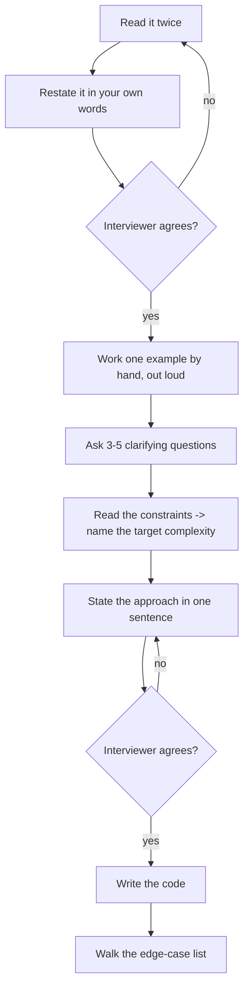

# Day 008 · DSA — Reading a problem like the interviewer wrote it

**After today you can:** You can extract input, output, constraints and edge cases from a problem in two minutes.

**The interviewer asks it as:** *Before you write code, what questions do you have about the problem?*

---

## 1. What this is, and why they ask it

A problem statement has four things in it: what you are **given**, what you must **return**,
the **constraints** that bound the input, and the **edge cases** that the ordinary solution
gets wrong. Reading a problem means pulling those four out, deliberately, before writing a
line.

Almost every problem statement is also missing something. Interview problems are stated
loosely on purpose, and the missing pieces are the questions you are supposed to ask.

They ask "what questions do you have?" because it is the highest-signal two minutes of the
whole round. A candidate who starts typing immediately has told the interviewer they will
also start typing immediately at work, and will discover the requirement on the third day. A
candidate who asks four sharp questions has demonstrated the thing companies actually hire
for, and they have done it before writing anything that could be wrong. This is the one part
of an interview where the right move costs you nothing and is almost never made.

---

## 2. The story

Deepak's mother is at the door with her bag on her shoulder, already late for the bus, and
she turns round and says: "Order the food for Sunday."

Last year he would have said yes and let her go. Last year he did exactly that, and it went
badly enough that he still thinks about it.

So this time he says, "Two minutes," and she stops, because she can hear that he is going to
be quick.

"How many people?"

"Eleven." She had said eight the week before. The Menons had said no and then said yes again
on Tuesday. If he had ordered on Tuesday's number, three people would have eaten very little
and it would have been at his end of the table.

"What time?"

"Half past eight." He had assumed lunch. Nobody had said lunch. Last year he had assumed
lunch too, and the food arrived at one o'clock for a dinner, and sat on the counter for seven
hours.

"Anybody not eating something?"

She thinks about it properly for a moment, which tells him the question was worth asking.
"Your aunt is fasting on Sunday, so nothing with onion or garlic. Do a separate portion for
her. And the Menon boy will not touch anything spicy."

"How much can I spend?"

"Twenty-five hundred. Don't go over three."

"And if the usual place isn't taking orders on a Sunday?"

She had not thought about this at all. "Then the one behind the bank. Not the new place, the
food is bad."

That is the whole conversation, and it takes ninety seconds. She gets her bus.

Deepak now knows something he genuinely did not know ninety seconds earlier: that he is
ordering dinner for eleven at half past eight, under three thousand rupees, with one
separate portion with no onion and no garlic, one mild dish, and a second place to try if the
first one says no.

None of that was in "order the food for Sunday". All of it was in his mother's head, and
every single piece of it would have changed what he ordered. The sentence was not wrong. It
was just very far from complete, and the only reason it worked as an instruction is that he
stopped and asked.

---

## 3. The idea in plain English

Deepak's four questions map exactly onto the four things you extract from a problem
statement.

### The four things

**What am I given?** Eleven people, a budget, a time. In a problem: the **input** — its type,
its size, and what is in it. Is it a list of integers? Can it be empty? Can it contain
negatives? Are there duplicates? Is it sorted?

**What must I return?** A dinner order, not a shopping list. In a problem: the **output** —
its type and its exact shape. An index or a value? A new list or a modified one? What do I
return when there is no answer — `-1`, `None`, an empty list, or is it guaranteed there is
one?

**What bounds am I working inside?** Three thousand rupees. In a problem: the
**constraints** — `1 <= n <= 10^5`, `-10^9 <= nums[i] <= 10^9`. From
[day 004](../day-004-the-growth-curves/README.md) you know these are not decoration; they
name the shape you are allowed to write.

**What is unusual and will break the obvious approach?** The aunt who is fasting. In a
problem: the **edge cases** — empty input, one element, all elements identical, all
negatives, the target absent, the maximum allowed size.

### The order to do it in

There is a sequence, and following it is the visible skill:

**1. Restate the problem in your own words.** *"So I'm given an unsorted array of integers
and a target, and I need to return the indices of two numbers that add to the target."* If
your restatement is wrong, you have just saved twenty minutes at a cost of eight seconds. If
it is right, the interviewer relaxes.

**2. Work one example by hand.** Take the given example and produce the answer manually,
saying what you are doing. This is where you discover that you misunderstood the output
format.

**3. Ask the clarifying questions.** Four or five, no more. The list is below.

**4. Read the constraints and name the target complexity.** *"n is up to ten to the fifth,
so I'm aiming for O(n log n) or better."*

**5. State your approach in one sentence before writing it.** *"I'll use a hash map from
value to index, one pass."* This is your last chance to be corrected cheaply, and
interviewers will correct you here if you let them.

**6. Then write the code.**

### The questions that are almost always worth asking

Keep this short list in your head. Pick the three or four that fit.

**About the input**
- Can the input be empty, or null?
- Can it contain duplicates?
- Can values be negative? Zero?
- Is it sorted? Can I sort it, or does the original order matter?
- How big can it get? *(read the constraints out loud)*
- Are the values integers, or could they be floats?

**About the output**
- Indices or values?
- What do I return if there is no valid answer?
- If several answers are valid, does it matter which one I return?
- Should the result be in a particular order?

**About what I may do**
- May I modify the input in place?
- May I use extra space, or is `O(1)` required?
- May I use library functions like `sorted()`, or is this about the mechanics?

### The assumptions that cost people the round

Deepak assumed lunch. These are the software versions, and each one has ended an interview:

| The assumption | What actually happens |
|---|---|
| "the array is sorted" | it is not, and your binary search returns nonsense |
| "there are no duplicates" | there are, and your answer double-counts |
| "the values are positive" | one negative and the sliding window breaks |
| "there is always an answer" | there is not, and you return an unset variable |
| "the input is non-empty" | it is empty, and `max()` raises |
| "one valid answer exists" | several do, and you return the wrong one |

**None of these are caught by testing the given example**, because the given example is
always well-behaved. They are caught by asking, or by building the edge-case list yourself.

### Say it out loud, always

One more thing, and it is not about the problem. **Interviewers score what they hear, not
what you type.** Silence while you think looks identical to silence while you are lost. Say
what you are considering, say what you have rejected and why, and say when you are stuck.
"I'm considering sorting first, but that loses the original indices, which the output needs"
is worth more than five minutes of correct silent typing.
[Day 178](../day-178-thinking-out-loud/README.md) is entirely about this.

---

## 4. The picture

A real problem statement, taken apart:

```
  +--------------------------------------------------------------------+
  | Given an array of integers nums and an integer target, return the   |
  | indices of the two numbers such that they add up to target.         |
  |                                                                    |
  | You may assume that each input would have exactly one solution,     |
  | and you may not use the same element twice.                        |
  |                                                                    |
  | You can return the answer in any order.                            |
  |                                                                    |
  | Constraints:                                                        |
  |   2 <= nums.length <= 10^4                                          |
  |   -10^9 <= nums[i] <= 10^9                                          |
  |   -10^9 <= target <= 10^9                                           |
  +--------------------------------------------------------------------+
        |              |              |                    |
        v              v              v                    v
    INPUT          OUTPUT       CONSTRAINTS           EDGE CASES
    array of       indices,     n <= 10^4             negatives allowed
    integers,      not values   -> O(n^2) = 10^8,     duplicates allowed
    unsorted,                      tight; aim O(n)    n >= 2, so never empty
    may repeat     "any order"                        "exactly one solution"
                   -> no tie-break                       -> no not-found case
```

**What to notice:** three of the four columns come from sentences most people skim. "Exactly
one solution" removes an entire branch of code. "Any order" removes a sorting requirement.
`n >= 2` removes the empty check. **Reading carefully makes the problem smaller.**

Now the same four columns for a problem where the answers go the other way:

```
                  Two Sum                     Find the maximum
  INPUT           n >= 2, guaranteed          may be empty  <- !
  OUTPUT          indices                     the value
  NO ANSWER       cannot happen               must decide: None? raise? -1?
  DUPLICATES      allowed, irrelevant         allowed, affects "which index?"
  CONSTRAINT      n <= 10^4                   n <= 10^5
```

**What to notice:** the *same* four questions, and completely different answers. This is why
the checklist is a checklist rather than a memorised set of assumptions.

And the sequence, as a flow:



**What to notice:** there are two places where the interviewer can stop you cheaply, and both
are before any code exists. Candidates who skip straight from A to I get corrected at the
most expensive possible moment.

---

## 5. The code, built step by step

The way to make this concrete is to take one loosely stated problem and watch the code change
as each question gets answered.

**The problem, as stated:** *"Find the largest number in a list."*

Here is what everybody writes first.

```python
def largest(items: list[int]) -> int:
    return max(items)
```

One line, correct for the example, and it has three unanswered questions in it. Ask them.

**Question 1: "Can the list be empty?"** Suppose the answer is yes.

```python
items = []
print(max(items))
```

```
Traceback (most recent call last):
  File "d8.py", line 2, in <module>
    print(max(items))
          ^^^^^^^^^^
ValueError: max() arg is an empty sequence
```

So an answer is needed for that case. `None` is usually the right choice in Python, because
it is unambiguous — unlike `-1`, which is a legitimate value here.

```python
def largest(items: list[int]) -> int | None:
    if not items:
        return None
    return max(items)
```

`int | None` in the signature says the return may be either, which is the honest type.

**Question 2: "Do you want the value or its position?"** Suppose it is the position, and that
this is really about the mechanics rather than about knowing `max` exists.

```python
def largest_index(items: list[int]) -> int | None:
    if not items:
        return None
    best = 0
    for i in range(1, len(items)):
        if items[i] > items[best]:
            best = i
    return best
```

Starting `best` at 0 rather than at some sentinel value is deliberate: it avoids inventing a
"smallest possible number", which is where negative inputs break naive solutions.

**Question 3: "If the largest value appears more than once, which position do you want?"**
This is the question nobody asks, and it changes the code by one character. `>` keeps the
**first** occurrence; `>=` keeps the **last**.

```python
        if items[i] > items[best]:      # first occurrence
        if items[i] >= items[best]:     # last occurrence
```

Now the second worked example, which is the one interviewers actually use.

**The problem, as stated:** *"Given an array and a target, return the indices of two numbers
that add up to the target."*

Ask, and suppose the answers are: the array is unsorted, duplicates are possible, values can
be negative, there may be **no** answer, and any valid pair will do.

The brute force, stated and rejected out loud:

```python
def two_sum_brute(nums: list[int], target: int) -> tuple[int, int] | None:
    for i in range(len(nums)):
        for j in range(i + 1, len(nums)):
            if nums[i] + nums[j] == target:
                return (i, j)
    return None
```

`O(n²)` time, `O(1)` space, and `j` starts at `i + 1` so nothing is paired with itself.

The hash map version, which is what the constraints call for:

```python
def two_sum(nums: list[int], target: int) -> tuple[int, int] | None:
    seen: dict[int, int] = {}              # value -> the index it was seen at
    for i, x in enumerate(nums):
        need = target - x
        if need in seen:
            return (seen[need], i)
        seen[x] = i
    return None
```

Two details that only exist because questions were asked. **Checking before inserting** means
an element can never pair with itself, which matters when `target` is exactly double a value.
And `seen[x] = i` overwrites an earlier duplicate, which is fine only because any valid pair
was acceptable.

Here is the complete program, with the edge cases as a table rather than as an afterthought.

```python
"""Day 8 — the same problem, read properly. The edge cases are the exercise."""


def largest_index(items: list[int]) -> int | None:
    """Index of the largest value. First occurrence on a tie. None if empty."""
    if not items:
        return None
    best = 0
    for i in range(1, len(items)):
        if items[i] > items[best]:         # '>' keeps the FIRST maximum
            best = i
    return best


def two_sum_brute(nums: list[int], target: int) -> tuple[int, int] | None:
    """O(n^2) time, O(1) space. Every pair, each once."""
    for i in range(len(nums)):
        for j in range(i + 1, len(nums)):
            if nums[i] + nums[j] == target:
                return (i, j)
    return None


def two_sum(nums: list[int], target: int) -> tuple[int, int] | None:
    """O(n) time, O(n) space. Look for what you NEED, not what you have."""
    seen: dict[int, int] = {}
    for i, x in enumerate(nums):
        need = target - x
        if need in seen:                   # check BEFORE inserting: no self-pairing
            return (seen[need], i)
        seen[x] = i
    return None


# The edge-case list. Build this BEFORE the solution, not after it.
CASES: list[tuple[str, list[int], int]] = [
    ("empty input",            [],                 5),
    ("one element",            [5],                5),
    ("two elements, match",    [2, 3],             5),
    ("two elements, no match", [2, 3],            99),
    ("no answer exists",       [1, 2, 3],         50),
    ("negatives",              [-3, 4, 7, -1],     3),
    ("target is zero",         [-4, 1, 4],         0),
    ("duplicates form it",     [3, 3],             6),
    ("value pairs with self?", [3, 1, 9],          6),
    ("answer at the ends",     [8, 1, 2, 3, -1],   7),
    ("all identical",          [4, 4, 4, 4],       8),
]

if __name__ == "__main__":
    print(f"{'case':<24}{'input':<20}{'target':>7}{'brute':>12}{'hash':>12}  agree?")
    print("-" * 88)
    for name, nums, target in CASES:
        a = two_sum_brute(nums, target)
        b = two_sum(nums, target)
        agree = "yes" if (a is None) == (b is None) else "NO"
        print(f"{name:<24}{str(nums):<20}{target:>7}{str(a):>12}{str(b):>12}  {agree}")

    print("\nlargest_index, including the cases that break the one-liner")
    for items in ([], [5], [1, 9, 3, 9, 2], [-5, -2, -9], [7, 7, 7]):
        print(f"  {str(items):<18} -> {largest_index(items)}")
```

This is exactly what it printed:

```
case                    input                target       brute        hash  agree?
----------------------------------------------------------------------------------------
empty input             []                        5        None        None  yes
one element             [5]                       5        None        None  yes
two elements, match     [2, 3]                    5      (0, 1)      (0, 1)  yes
two elements, no match  [2, 3]                   99        None        None  yes
no answer exists        [1, 2, 3]                50        None        None  yes
negatives               [-3, 4, 7, -1]            3      (1, 3)      (1, 3)  yes
target is zero          [-4, 1, 4]                0      (0, 2)      (0, 2)  yes
duplicates form it      [3, 3]                    6      (0, 1)      (0, 1)  yes
value pairs with self?  [3, 1, 9]                 6        None        None  yes
answer at the ends      [8, 1, 2, 3, -1]          7      (0, 4)      (0, 4)  yes
all identical           [4, 4, 4, 4]              8      (0, 1)      (0, 1)  yes

largest_index, including the cases that break the one-liner
  []                 -> None
  [5]                -> 0
  [1, 9, 3, 9, 2]    -> 1
  [-5, -2, -9]       -> 1
  [7, 7, 7]          -> 0
```

**Look at the row `value pairs with self?`.** Input `[3, 1, 9]`, target 6. There is a 3, and
3 + 3 = 6, and the answer is correctly `None` because there is only one 3. That row exists
because someone asked "can I use the same element twice?". Without the question, the check
would go in the wrong place and the function would return `(0, 0)`.

**And look at `[-5, -2, -9]`.** A solution that starts with `best_value = 0` instead of
`best = 0` returns nothing sensible here, because every value is below the sentinel. That row
exists because someone asked "can values be negative?".

---

## 6. What it costs

**The arithmetic on asking.** A clarifying question costs about fifteen seconds. Writing a
solution to the wrong problem costs the rest of the interview.

```
5 questions x 15 s          =  75 seconds
one wrong assumption        =  15-20 minutes of code, then a rewrite under pressure
in a 45-minute round        =  40% of your time, and the interviewer watched you spend it
```

Seventy-five seconds against twenty minutes. There is no other decision in an interview with
that ratio.

**What the constraints buy you.** Reading `2 <= nums.length` removes the empty check.
"Exactly one solution" removes the not-found branch. "Any order" removes a sort. Each one is
a branch you do not write, do not test, and cannot get wrong:

```
lines removed by reading the statement properly:  6-10
chances of a bug in code you did not write     :   0
```

**What the constraint tells you about the shape.** For Two Sum:

```
n <= 10^4
O(n^2) = 10^8 operations -> about 1 second in C++, 10+ in Python -> too tight
O(n)   = 10^4 operations -> instant
```

So the hash map is not a cleverness; it is what the constraint asked for. Notice also that
`-10^9 <= nums[i] <= 10^9` means sums can reach `2 × 10^9`, which overflows a 32-bit integer
in Java or C++. Python has arbitrary-precision integers so it does not bite here — but
saying "in a language with fixed-width integers I'd want a 64-bit type for the sum" is a
free point.

**The edge-case list is cheap and the bug is not.** Eleven cases took about ninety seconds to
write and they exercise every branch:

```
11 cases x ~8 seconds to write = 90 seconds
1 failed submission on a hidden test = one wrong-answer verdict and a lost lead
```

**Where the time actually goes in a good 45-minute round:**

```
  0:00 - 0:03   read, restate, work an example
  0:03 - 0:05   clarifying questions
  0:05 - 0:07   state the approach, agree the complexity target
  0:07 - 0:25   write the code, narrating
  0:25 - 0:32   walk the edge cases out loud, fix what breaks
  0:32 - 0:38   state complexity, discuss improvements
  0:38 - 0:45   their questions, your questions
```

**Seven of the first ten minutes involve no code**, and that is the correct allocation. It
looks like a waste of time only to people who have not watched the other version.

---

## 7. The traps

### Trap one: the assumption that the example did not contradict

The given example is always well-behaved. That is what makes it dangerous.

**Problem:** *"Given an array, return the index of the target, or -1 if it is not present."*
Example: `nums = [1, 3, 5, 7, 9], target = 5` → `2`.

The example is sorted. So this gets written:

```python
def find(nums: list[int], target: int) -> int:
    left, right = 0, len(nums) - 1
    while left <= right:
        mid = (left + right) // 2
        if nums[mid] == target:
            return mid
        if nums[mid] < target:
            left = mid + 1
        else:
            right = mid - 1
    return -1
```

It is a correct binary search and it passes the example. Now the hidden test:

```
nums   = [5, 1, 9, 3, 7]
target = 9
returns -1
expected 2
```

No crash, no error message, a wrong answer. Binary search on unsorted input does not fail
loudly — it silently looks in the wrong half. Nothing about `[1, 3, 5, 7, 9]` said "sorted".
It only *happened* to be.

**The question that prevents it:** *"Is the array sorted, or is it just sorted in this
example?"* Eight words.

### Trap two: the empty input nobody mentioned

```python
def average(scores: list[int]) -> float:
    return sum(scores) / len(scores)
```

Perfectly reasonable, and:

```
Traceback (most recent call last):
  File "d8.py", line 2, in <module>
    return sum(scores) / len(scores)
           ~~~~~~~~~~~~^~~~~~~~~~~~~
ZeroDivisionError: division by zero
```

The `~~~~~^~~~~~` marks under the traceback point at the division, not at `sum` or `len` —
Python is telling you exactly which operator failed.

And the sibling error, when the constraint really did allow an empty list:

```
Traceback (most recent call last):
  File "d8.py", line 2, in <module>
    return max(scores)
           ^^^^^^^^^^^
ValueError: max() arg is an empty sequence
```

Both are one `if` away from being fixed, and neither can be fixed if you do not know what the
answer should be. **"What do I return for an empty input?" is a question for the interviewer,
not a decision for you** — returning `0` from `average([])` is defensible and so is raising,
and picking silently means picking wrong half the time.

### The near-miss worth naming

The most expensive assumption is not about the data. It is about the **output**.

```python
# The problem said: "return the indices"
return (nums[i], nums[j])      # returns the values
```

This passes every mental test you run, because you are checking the arithmetic rather than
the shape. It fails every hidden test. **Read the return type out of the problem statement
and say it out loud before writing the signature** — "returns a list of two indices" — and
this class of bug disappears entirely.

---

## 8. In the interview

### How it gets asked

- *"Before you write any code, what questions do you have?"* — the explicit version, and it
  is an invitation. Some interviewers are scoring this specific moment.
- *"Any assumptions you want to check?"* — the same thing, phrased more gently.
- Silence, after the problem is stated. This is also the question. The interviewer is
  watching what you do with an unspecified problem, and typing is the wrong answer.
- *"Are you sure about that?"* — mid-solution. It means an assumption you made is wrong.
  Stop, and re-read the statement rather than the code.

### What to say out loud, in the first ninety seconds

This is the one lesson where the ninety-second script *is* the whole technique.

1. **Restate it.** *"So I'm given an unsorted array of integers and a target, and I return
   the indices of two elements that sum to the target. Have I got that right?"*
2. **Work the example.** *"With [2, 7, 11, 15] and target 9, that's 2 plus 7, so I return
   [0, 1]. Indices, not values."*
3. **Ask about the input.** *"Can the array be empty? Can it have duplicates? Can values be
   negative?"*
4. **Ask about the output.** *"If there's no valid pair, what should I return? And if there
   are several, does it matter which one?"*
5. **Read the constraints and commit.** *"n is up to ten to the fourth. O(n²) would be ten to
   the eighth, which is too tight, so I'm aiming for O(n)."*
6. **State the approach before writing it.** *"I'll do one pass with a hash map from value to
   index, checking for target minus the current value before I insert. That's O(n) time and
   O(n) space. Shall I code that?"*

Six steps, about ninety seconds, and you have not written anything yet. The interviewer now
knows more about how you work than they will learn from the next twenty minutes of typing.

### The follow-ups

**"Why does that question matter?"**
Asked when you ask something they think is obvious — and it is a fair challenge, so have the
reason ready. "Whether the array is sorted decides between a hash map and two pointers, which
is O(n) space against O(1) space." A question you can justify is a good question. A question
you asked from a memorised list is not, and the difference is audible.

**"Assume there's always exactly one answer."**
Take it, say thank you, and *say what it removes*: "Good — then I don't need a not-found
branch and I don't need to worry about tie-breaking." Making the simplification explicit
shows you understood why you asked. It also means that if they later say "now allow no
answer", you know exactly which branch to add.

**"You've been quiet for a while. What are you thinking?"**
This is a rescue and it is also a warning: you have been silent long enough for it to be a
problem. Answer honestly and specifically. "I'm trying to decide whether to sort first. It
would make the pair search easy, but it destroys the original indices, and the output needs
indices — so I think I need the hash map instead." Being stuck out loud is fine. Being stuck
silently reads as not knowing.

**"How would you test this?"**
Give the categories, not a list of numbers: empty, one element, two elements, the answer at
the very start, the answer at the very end, no answer at all, all elements identical,
negatives and zero, and the maximum allowed size for the timing. That is a systematic answer
rather than a recalled one, and it is the same list you should already have written before
coding.

### A model answer

The interviewer states: *"Given a list of daily stock prices, find the maximum profit you
could make from one buy and one sell."*

> "Let me make sure I have it. I'm given a list of prices, one per day, in chronological
> order. I pick one day to buy and one later day to sell, and I want the largest possible
> difference. Is that right?
>
> Let me try the example. [7, 1, 5, 3, 6, 4] — the best is buy at 1 on day 1 and sell at 6 on
> day 4, so profit 5. And I'd note that buying at 7 and selling later is never better here,
> which is already telling me something about the shape of the solution.
>
> A few questions. Must I sell after I buy, or would you accept selling before buying —
> shorting? I'll assume sell must come strictly after buy unless you say otherwise. Can the
> list be empty, or have one element? And if every price only goes down, so every trade
> loses money, do you want zero — meaning 'don't trade' — or the least-bad negative number?
> That changes the answer materially.
>
> ...Right: sell after buy, list can be as short as one element, and return 0 if no profitable
> trade exists. So one element returns 0, and a strictly decreasing list returns 0.
>
> Constraints say up to ten to the fifth prices. O(n²) would be ten to the tenth, so that's
> out — I need O(n) or O(n log n).
>
> Here's my approach in one sentence: walk through once, keep track of the cheapest price seen
> so far, and at each day compute what I'd make selling today at that cheapest earlier price,
> keeping the best. That's O(n) time and O(1) extra space, and it naturally respects
> buy-before-sell because the minimum I'm comparing against is always from an earlier day.
>
> Shall I write that?"

Ninety seconds, no code, and the candidate has already surfaced the two decisions that
determine correctness — whether selling must come after buying, and what to return when
nothing is profitable. Notice that the "return 0" question is the one that most solutions get
wrong, and it was found by asking rather than by debugging.

---

## 9. Recall card

1. **Four things, every time: input, output, constraints, edge cases.** Pull all four out
   before writing anything.
2. **Restate the problem in your own words, then work one example by hand.** Both take
   seconds and both catch misunderstandings while they are still free.
3. **Ask three to five questions.** Empty? Duplicates? Negatives? Sorted? What if there is no
   answer? Indices or values? Can I modify the input?
4. **Read the constraints and name the target complexity out loud** before choosing an
   approach. `n ≤ 10⁵` means `O(n log n)` or better.
5. **State the approach in one sentence and get agreement before coding.** The interviewer
   can correct you for free at that moment, and not at any moment after it.
