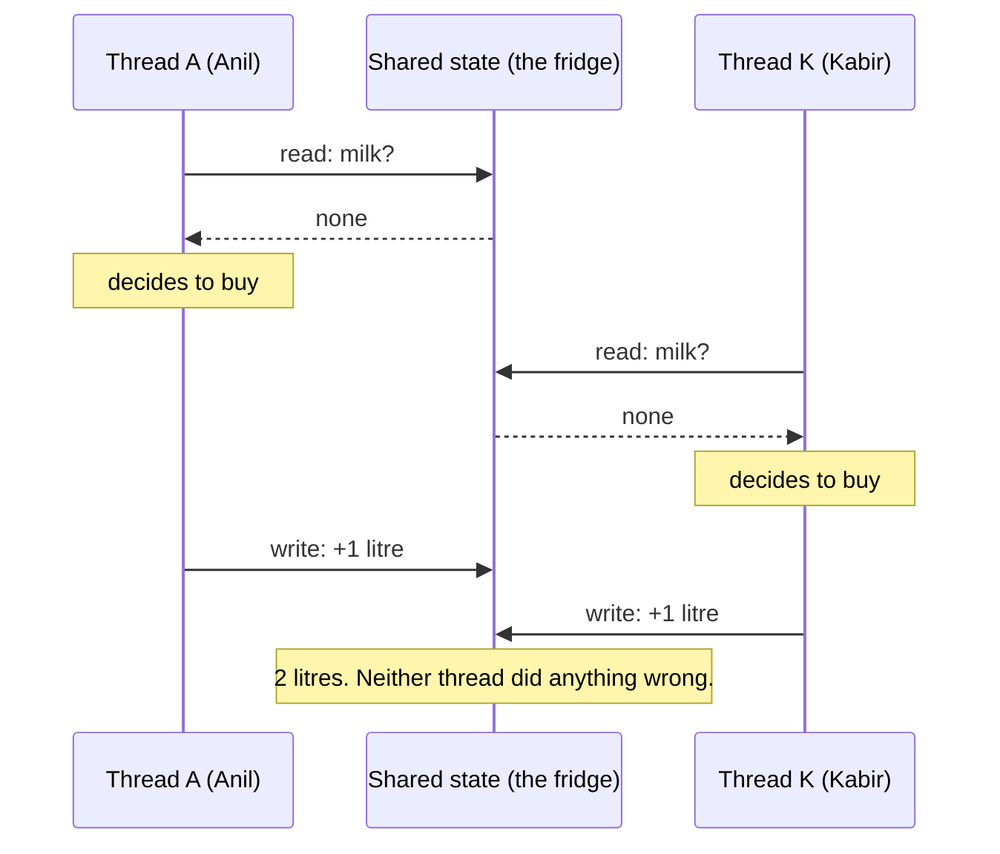

# Day 008 · System Design — Processes, threads, and concurrency

**After today you can:** You can explain the difference between a process and a thread, and why servers use both.

**The interviewer asks it as:** *What is the difference between a process and a thread?*

---

## 1. What this is, and why they ask it

A **process** is a running program with its own private memory. A **thread** is one line of
execution inside a process, and all the threads in a process share that memory.

That is the whole difference, and everything else follows from it. Separate memory means
safety and costs a lot. Shared memory is cheap and means two threads can trip over each
other.

Interviewers ask this early, of everybody, and it looks like a definitions question. It is
not. What follows immediately is "so which would you use here?", and then "what goes wrong
when two of them touch the same data?" — and that second question is the real one. Every
distributed systems problem you will meet from day 113 onwards is a bigger version of two
threads racing for the same value. Getting the small version right now is how the large
version makes sense later.

---

## 2. The story

Three of them share a two-bedroom flat in Kondapur: Anil, Kabir and Sridhar. One kitchen, one
gas connection, one fridge, one set of vessels.

It works, mostly, and it works because it is cheap. One gas cylinder between three people.
Nobody has to buy their own pressure cooker. When Sridhar makes too much rasam there is
enough for everybody, and none of that would be true if they each had their own kitchen.

It also produces one particular kind of trouble, and it happened again last Tuesday.

At twenty to eight in the morning Anil opened the fridge, looked for milk, and there was
none. He was already dressed, so he decided he would pick some up on the way back from the
gym and said nothing to anybody, because Kabir was in the shower and Sridhar was asleep.

At twelve minutes to eight Kabir came out of the shower, opened the fridge, looked for milk,
and there was none. So he put his slippers on and went down to the shop at the corner.

They came back within four minutes of each other with two litres of milk, one of which went
off by Thursday.

Neither of them did anything wrong. Both of them looked, both of them found nothing, and both
of them acted on what they found. The trouble is that **looking and deciding and acting were
three separate moments**, and in the gap between Anil looking and Anil buying, Kabir looked
too and saw the same empty shelf. The information was correct when each of them read it. It
was stale by the time each of them acted on it.

They fixed it that evening, and the fix is very simple. Before you go, you send one message
to the group on your phone saying you are going. If a message is already there, you do not
go. It costs four seconds and it has not happened since.

Sridhar's brother lives on the second floor with his own family, and their flat has two
kitchens — one built into the corner of the hall when the two brothers split the household
four years ago. Nobody up there has ever had this problem, not once, and nobody up there ever
will. They also own two fridges, two gas connections, two of every vessel, and neither
kitchen can borrow so much as a spoon from the other without somebody physically carrying it
across.

And there is one more difference, which Anil found out about the night Kabir left the milk
boiling and went to take a call. It burnt, it stank, and every single thing that came out of
that kitchen for two days tasted faintly of burnt milk — including Sridhar's rasam, which had
nothing to do with it. Upstairs, when something burns in one kitchen, the other kitchen has
no idea it happened.

---

## 3. The idea in plain English

The flat is a process with three threads. Upstairs is two processes.

### The definitions, precisely

A **process** is a running program together with everything it owns: its own memory, its own
open files, its own network connections. Two processes cannot see each other's memory at all.
The operating system enforces this with hardware support, and a process that tries gets shut
down. That is the two kitchens upstairs.

A **thread** is one sequence of instructions running inside a process. A process always has
at least one. Threads in the same process **share all of its memory** — the same variables,
the same objects, the same open files. Each thread has only its own **stack**, which holds its
current position and its local variables. That is the three flatmates in one kitchen.

| | Process | Thread |
|---|---|---|
| Memory | private | shared with siblings |
| Cost to create | 1–10 ms | 10–100 µs |
| Memory footprint | 10–100 MB | 1–8 MB (mostly the stack) |
| Talking to a sibling | pipes, sockets, shared memory — deliberate work | just read the variable |
| One crashes | the others are unaffected | usually takes the whole process down |
| Switching between them | ~1–5 µs, plus a cold memory cache | ~0.1–1 µs |

Read the crash row alongside the burnt-milk story. A thread that corrupts memory corrupts it
for every thread in that process. A process that does the same affects nobody.

### Concurrency is not parallelism

Two words that get used interchangeably and mean different things. Interviewers notice.

**Concurrency** is *dealing with* several things at once — making progress on many tasks by
interleaving them. One barber alternating between two customers is concurrent.

**Parallelism** is *doing* several things at once, genuinely simultaneously, which requires
more than one core. Two barbers cutting two heads is parallel.

A single-core machine can be concurrent and cannot be parallel. Concurrency is a way of
structuring work; parallelism is a hardware capability. You want concurrency for waiting
(network, disk) and parallelism for computing.

### The milk: a race condition

What happened on Tuesday has a name. A **race condition** is when the result depends on the
exact timing of two things running at once. The classic shape is **check-then-act**:

```
Anil:   look at the shelf  -> empty      decide to buy
Kabir:                                   look at the shelf -> empty    decide to buy
Anil:                       buy
Kabir:                                                       buy
```

The check was true when each of them made it. It stopped being true before either acted. In
code it looks like this, and it is the most common concurrency bug there is:

```python
if account.balance >= amount:      # check
    account.balance -= amount      # act
```

Two threads run the check when the balance is 100 and the amount is 100. Both pass. Both
subtract. The balance is now −100 and the bank has given away money that did not exist.

Even a single `count += 1` is not safe, because it is really three steps — read the value,
add one, write it back — and another thread can run in between any two of them.

### The message on the group: a lock

The fix is to make check-and-act **atomic** — indivisible, so that no other thread can act in
the middle of it. The tool is a **lock**, also called a **mutex** (mutual exclusion).

```python
with lock:
    if account.balance >= amount:
        account.balance -= amount
```

`with lock:` means: acquire it, run this block, release it — and if another thread holds it,
wait. Only one thread is inside at a time. That is "if a message is already there, you do not
go".

Locks cost you two things. **Contention**: threads waiting for a lock are doing nothing, so a
lock held for too long turns your parallel program back into a serial one. And **deadlock**:
if thread A holds lock 1 and wants lock 2 while thread B holds lock 2 and wants lock 1,
neither will ever move. The standard prevention is to always acquire locks in the same
global order.

### Python's particular quirk: the GIL

This has to be said because it changes the advice for Python specifically.

CPython has a **Global Interpreter Lock** — one lock that must be held to execute Python
bytecode. So **only one thread runs Python code at a time**, even on a sixteen-core machine.
It is as if the kitchen has one gas ring: three cooks, but only one can actually cook at a
time.

The consequence:

- For **CPU-bound** work, Python threads give you **nothing**. Four threads summing numbers
  take as long as one, plus overhead.
- For **I/O-bound** work — waiting on the network, on a database, on disk — Python threads
  work perfectly well, because the GIL is released while a thread waits.

So in Python: **`threading` for waiting, `multiprocessing` for computing, `asyncio` for
waiting on a very large scale.** Java, Go, C++ and Rust have no such restriction; their
threads genuinely run in parallel.

---

## 4. The picture

What each one owns:

```
   ONE PROCESS, THREE THREADS  (the flat)          TWO PROCESSES  (upstairs)

   +-------------------------------------+     +-----------+  +-----------+
   |  PROCESS                            |     | PROCESS A |  | PROCESS B |
   |                                     |     |           |  |           |
   |  +-------------------------------+  |     | +-------+ |  | +-------+ |
   |  |  HEAP — shared by all threads |  |     | | heap  | |  | | heap  | |
   |  |  objects, the fridge, globals |  |     | +-------+ |  | +-------+ |
   |  +-------------------------------+  |     | +-------+ |  | +-------+ |
   |  +-------------------------------+  |     | | code  | |  | | code  | |
   |  |  CODE — shared                |  |     | +-------+ |  | +-------+ |
   |  +-------------------------------+  |     | +-------+ |  | +-------+ |
   |                                     |     | |stack  | |  | |stack  | |
   |  +--------+ +--------+ +--------+   |     | +-------+ |  | +-------+ |
   |  | stack  | | stack  | | stack  |   |     +-----------+  +-----------+
   |  | Anil   | | Kabir  | |Sridhar |   |
   |  +--------+ +--------+ +--------+   |     nothing crosses this gap
   |   thread 1   thread 2   thread 3    |     without deliberate work
   +-------------------------------------+
```

**What to notice:** the heap is inside the box on the left and there is one of it. Every
thread can reach every object in it, with no ceremony and no permission. That is the whole
benefit and the whole danger.

Now the race, on a timeline:



**What to notice:** there is no bad instruction anywhere in that diagram. The bug is entirely
in the **gaps** — the moments between reading and writing, where another thread got in. Race
conditions are made of gaps, which is why they are so hard to reproduce.

And the fix:

```
   WITHOUT A LOCK                        WITH A LOCK

   A: read ----+                         A: [acquire] read check write [release]
   K: read ----+  both see "none"        K:          ...waiting...     [acquire] read
   A: write                                                            sees 1 litre,
   K: write       -> 2 litres                                          does not buy
```

**What to notice:** the lock does not make anything faster. It makes Kabir wait. The whole
technique is deliberately giving up concurrency in one small region in order to be correct.

---

## 5. How it actually works

### What the operating system does

A process is created with `fork()` (a copy of the current one) followed by `exec()` (replace
the copy's program), or with `CreateProcess` on Windows. Each one gets a **PID**, its own
page table, and its own view of memory that the hardware's MMU enforces.

The **scheduler** decides which thread runs on which core, and switches every few
milliseconds — a **time slice**. A **context switch** saves the current thread's registers and
loads another's. Between threads of the same process it costs perhaps 0.1–1 µs. Between
processes it is more, because the page table changes and the CPU's memory caches and TLB go
cold, which is often the larger cost.

### Where you see each one in real software

| Software | Model | Why |
|---|---|---|
| **nginx** | one process per core, event loop inside | isolation between workers, no locks needed inside one |
| **Apache (prefork)** | one process per connection | very robust, very heavy |
| **PostgreSQL** | one process per connection | a crashing backend cannot corrupt others — and why you need PgBouncer |
| **MySQL** | one thread per connection | cheaper connections, shared buffer pool |
| **Chrome** | one process per tab (roughly) | one tab crashing or being compromised cannot reach another's memory |
| **Redis** | single-threaded for commands | no locks at all, and therefore no race conditions |
| **Go services** | goroutines on a small thread pool | ~2 KB each, so hundreds of thousands are practical |
| **Node.js** | one thread, event loop | no shared-memory races by construction |

**Redis is worth pausing on.** It is single-threaded on purpose. Every command runs to
completion before the next starts, so operations are atomic for free and there are no locks
anywhere. It still does hundreds of thousands of operations per second, because its work is
memory access rather than computation. Sometimes the answer to concurrency is to not have
any.

**Chrome is the isolation argument in its purest form.** Process-per-tab costs enormous
amounts of memory, and it is the reason a malicious page cannot read your banking tab.

### The tools, in Python

```python
from concurrent.futures import ThreadPoolExecutor, ProcessPoolExecutor
import threading, multiprocessing, asyncio
```

- `ThreadPoolExecutor` — for waiting on network or disk. GIL released during the wait.
- `ProcessPoolExecutor` — for computing. Real parallelism, at the cost of copying data
  between processes via pickling.
- `asyncio` — for waiting at very large scale, single-threaded, no locks needed for ordinary
  code, but one blocking call stalls everything.
- `threading.Lock`, `Semaphore`, `Event`, `Queue` — the coordination primitives.
  `queue.Queue` is thread-safe and is usually the right answer instead of a raw lock.

### How processes talk when they must

Since they share no memory, communication has to be explicit:

**Pipes** for a parent and child. **Unix domain sockets** on one machine, **TCP sockets**
across machines. **Shared memory** (`/dev/shm`, `mmap`) when you need speed and are willing to
do the locking yourself. **Message queues** — Redis, RabbitMQ, Kafka — when the processes are
on different machines and you want durability.

Notice the progression: as isolation increases, communication gets more explicit and more
expensive, and the system gets easier to reason about. That is the same trade at every scale,
and it is why microservices are a distributed version of this exact decision.

### When it fails

**Race conditions** are the ones that ruin weekends. They appear under load, disappear when
you add logging, and cannot be reproduced on demand — because adding a print statement
changes the timing.

**Deadlock**: two threads each holding what the other wants. The program does not crash; it
stops. `py-spy dump` or `jstack` will show you exactly where every thread is parked.

**Thread leaks**: threads created per request and never joined. Memory climbs, the scheduler
thrashes, and the machine dies slowly. This is what thread *pools* prevent.

**Zombie and orphan processes**: a child that exited but whose parent never collected its
status stays in the process table. Enough of them and you cannot start new processes at all.

---

## 6. The numbers

**What each one costs to create:**

```
process : 1-10 ms      (fork + exec + page tables)
thread  : 10-100 us    (roughly 100x cheaper)
goroutine / coroutine : 1-5 us
```

At 10,000 requests per second, creating a thread per request:

```
10,000 x 50 us = 0.5 seconds of CPU per second — half a core, just creating threads
```

Which is exactly why pools exist. Creating a **process** per request would be:

```
10,000 x 5 ms = 50 seconds of CPU per second — impossible on any machine
```

**What each one costs in memory**, on a 16 GB machine:

```
process at 50 MB : 16,384 / 50   =   327 processes
thread  at  8 MB : 16,384 / 8    = 2,048 threads   (default stack)
thread  at  1 MB : 16,384 / 1    = 16,384 threads  (tuned stack)
goroutine at 2 KB: 16,384 x 512  = 8,000,000 goroutines
```

That last row is why Go took over network services. It is four orders of magnitude.

**What a context switch costs**, and why too many threads is worse than too few:

```
thread switch, same process   : ~0.2 us
process switch                : ~2 us (page table + cold caches)
```

With 10,000 runnable threads on 8 cores, each getting a 1 ms slice:

```
10,000 switches per 1 ms slice round = 10,000 x 0.2 us = 2 ms of pure switching
```

More time switching than working. The system is at 100% CPU and doing nothing —
**thrashing**. The fix is always fewer threads, never more.

**The GIL, measured.** Summing 10 million numbers on a 4-core machine:

```
1 thread                  :  2.1 s
4 threads (CPU-bound)     :  2.4 s     <- slower, from GIL contention
4 processes (CPU-bound)   :  0.6 s     <- 3.5x, real parallelism

4 API calls, 500 ms each, sequential :  2.0 s
4 API calls, 4 threads               :  0.5 s   <- 4x, GIL released while waiting
```

Those two blocks are the entire Python threading decision, in numbers.

**Amdahl's Law**, which is the ceiling on all of this. If 5% of your program must run
serially — inside a lock, say:

```
speedup with N cores = 1 / (0.05 + 0.95/N)

N = 4    -> 3.5x
N = 16   -> 9.1x
N = 64   -> 15.4x
N = 1000 -> 19.6x
```

**Twenty times, forever, from a thousand cores.** A 5% serial section caps you at 20×
regardless of hardware. This is why reducing the size of your critical section matters more
than adding cores, and it is one of the few pieces of theory that is worth quoting verbatim
in an interview.

---

## 7. The trade-offs

**Processes buy isolation and charge you memory.** A crashing, leaking or compromised worker
affects nobody else, and in Python you sidestep the GIL and get real parallelism. You pay 10
to 100 MB each, a slow start-up, and the fact that sharing anything requires serialisation —
which for large data can cost more than the work you were parallelising. Chrome and
PostgreSQL make this trade deliberately, and both are criticised for memory use by people
who have not priced the alternative.

**Threads buy cheapness and charge you correctness.** A megabyte each, microseconds to
create, and any thread can read any object with no ceremony — which is exactly why every
non-trivial threaded program has a race condition in it somewhere. Whether that trade is
worth it depends less on performance than on how much shared mutable state your design has.
The best threaded programs are the ones with almost none.

**Locks buy correctness and charge you concurrency.** Every lock is a small serial section,
and Amdahl's Law says those cap your speedup hard. The engineering is in making critical
sections as small as possible — and in avoiding shared state so that the lock is not needed
at all. Immutable data, message passing and per-thread state are all ways of not having the
problem.

**Async buys enormous I/O concurrency and charges you an ecosystem.** Coroutines at kilobytes
each, hundreds of thousands of concurrent connections, no locks needed for ordinary code. In
exchange, every library you use must be async-aware: one synchronous database driver in an
async handler blocks the entire event loop and every request on it. And it gives you nothing
for CPU-bound work.

**I would not use threads if...** the work is CPU-bound in Python (use processes), or the
state is genuinely shared and mutable and complicated (use one thread and a queue, or a
single-threaded store like Redis), or the concurrency needed is in the tens of thousands (use
async or Go). Threads are the right answer for a moderate number of I/O-bound tasks in a
language without a GIL, and for I/O-bound tasks in Python where you want simple blocking
code.

**And the honest general answer:** the most reliable concurrency strategy is to not share
mutable state. Give each worker its own data, communicate by passing messages rather than by
touching the same variable, and most of this chapter's problems never arise. That is what Go
means by "share memory by communicating", and it is the same principle that later makes
stateless services scale.

---

## 8. In the interview

### How it gets asked

- *"What's the difference between a process and a thread?"* — the standard opener. Give the
  memory answer, not a list of properties.
- *"When would you use one over the other?"* — the real question, and it should mention
  CPU-bound versus I/O-bound.
- *"What's a race condition? Give me an example."* — the bank balance, every time.
- *"Why doesn't Python threading speed up CPU work?"* — the GIL question, and it is very
  common in Python-facing roles.

### What to say out loud, in the first ninety seconds

1. **Give the one difference that generates all the others.** *"A process has its own private
   memory. Threads inside a process share it. Everything else follows from that."*
2. **Quantify.** *"A process costs tens of megabytes and milliseconds to create. A thread
   costs about a megabyte and microseconds."*
3. **Say what shared memory buys and costs.** *"Threads can talk by just reading a variable,
   which is fast and free. Processes need pipes or sockets. But shared memory means two
   threads can touch the same value at the same time."*
4. **Give the failure mode with a concrete example.** *"That's a race condition — like two
   threads both checking a balance of 100, both seeing it's enough, and both subtracting. The
   check was true for each of them and the result is wrong."*
5. **Give the fix and its cost.** *"A lock makes check-and-act atomic. The cost is that
   threads wait, so the critical section becomes serial — and by Amdahl's Law a 5% serial
   section caps your speedup at 20× no matter how many cores you add."*
6. **Land the choice.** *"So: processes for isolation and for CPU-bound work in Python,
   threads for I/O-bound work, async when you need tens of thousands of concurrent
   connections."*

### The follow-ups

**"Why doesn't Python threading speed up CPU-bound work?"**
Because of the Global Interpreter Lock. CPython requires a thread to hold the GIL to execute
bytecode, so only one thread runs Python code at a time regardless of how many cores you
have. Four threads summing numbers take slightly longer than one, because of contention on
the GIL itself. It is released during I/O, though, so threads are genuinely useful for
network and disk work. For CPU-bound work in Python you use `multiprocessing`, which gives
you real parallelism at the cost of copying data between processes. Java and Go have no such
restriction.

**"What's a deadlock, and how do you prevent it?"**
Two threads each holding a lock the other needs, so neither can proceed and neither will ever
give up. The classic case is thread A taking lock 1 then lock 2 while thread B takes lock 2
then lock 1. The standard prevention is a global lock ordering — every thread acquires locks
in the same defined order, which makes the cycle impossible. Beyond that: use timeouts on
acquisition so you fail rather than hang, hold as few locks as possible at once, and prefer
higher-level constructs like a thread-safe queue over hand-rolled locking. The failure mode
is worth naming too: a deadlocked program doesn't crash, it just stops, so you find it with
a thread dump rather than a stack trace.

**"How do you make an operation atomic across two threads?"**
A mutex around the whole read-modify-write, so no other thread can observe the intermediate
state. Sometimes there is a cheaper option: an atomic compare-and-swap instruction, or a
data structure that is already atomic — `queue.Queue` in Python, `AtomicInteger` in Java,
Redis's `INCR`. The important part is that the check and the act must be inside the same
critical section. A lock around just the write, with the check outside it, does not fix
anything — and that is the mistake I'd look for in a code review.

**"How would you choose between threads and async for a web service?"**
By measuring where the time goes. If a request is mostly waiting on databases and other
services — which is typical — both work, and async scales further because a coroutine costs
kilobytes against a thread's megabyte. If the requests are CPU-heavy, neither helps and I
want processes across cores. And I'd weigh the ecosystem: async requires every library in the
path to be async-aware, and one blocking call stalls the whole event loop, so a codebase with
mature synchronous drivers may be better off with a thread pool even if async has the better
theoretical ceiling.

### A model answer

> "The one real difference is memory. A process has its own private address space that the
> hardware enforces — one process cannot read another's memory, full stop. Threads live
> inside a process and share all of it: the same heap, the same globals, the same open files.
> Each thread has only its own stack.
>
> Everything else comes out of that. A process costs tens of megabytes and a millisecond or
> so to create; a thread costs about a megabyte and tens of microseconds. Two threads
> communicate by reading the same variable, which is instant; two processes need a pipe, a
> socket or shared memory, which is deliberate work. And if a thread corrupts memory or
> crashes, it usually takes the whole process with it, whereas a crashing process affects
> nobody. That's why Chrome uses a process per tab and PostgreSQL a process per connection —
> they're buying isolation and paying for it in memory.
>
> The cost of sharing is race conditions. The classic is check-then-act: two threads both
> read a balance of 100, both see it covers a 100-rupee withdrawal, and both subtract. Each
> check was true when it was made and the result is still wrong, because reading and writing
> weren't one indivisible step. Even `count += 1` isn't safe — it's a read, an add and a
> write, and another thread can land between any two.
>
> The fix is a lock making check-and-act atomic. The cost is that the locked region is serial,
> and Amdahl's Law is brutal about that: if 5% of your program is serial, you're capped at
> about 20× speedup no matter how many cores you throw at it. So the real engineering is
> shrinking the critical section, or designing so there's no shared mutable state to protect.
>
> For choosing: processes for isolation and for CPU-bound work — mandatory in Python because
> of the GIL, which means only one thread executes bytecode at a time. Threads for I/O-bound
> work, where the GIL is released while waiting. Async when I need tens of thousands of
> concurrent connections and can accept that one blocking call stalls everything.
>
> The general principle I'd apply first, though, is to avoid sharing mutable state at all —
> pass messages instead of touching the same variable. Most of these problems then simply
> don't exist."

---

## 9. Recall card

1. **Process = private memory. Threads = shared memory.** Every other difference follows
   from that one.
2. **Costs:** process 10–100 MB and ~ms to create; thread ~1 MB and ~µs; goroutine or
   coroutine ~2 KB. That is why pools exist.
3. **Race condition = check-then-act with a gap in the middle.** Two threads read a balance
   of 100, both spend it. Fix with a **lock**, which makes the pair atomic.
4. **Amdahl's Law:** a 5% serial section caps you at 20× speedup on any number of cores.
   Shrink the critical section, or remove the shared state.
5. **Python's GIL:** one thread runs bytecode at a time. `threading` for I/O,
   `multiprocessing` for CPU, `asyncio` for very high I/O concurrency.
