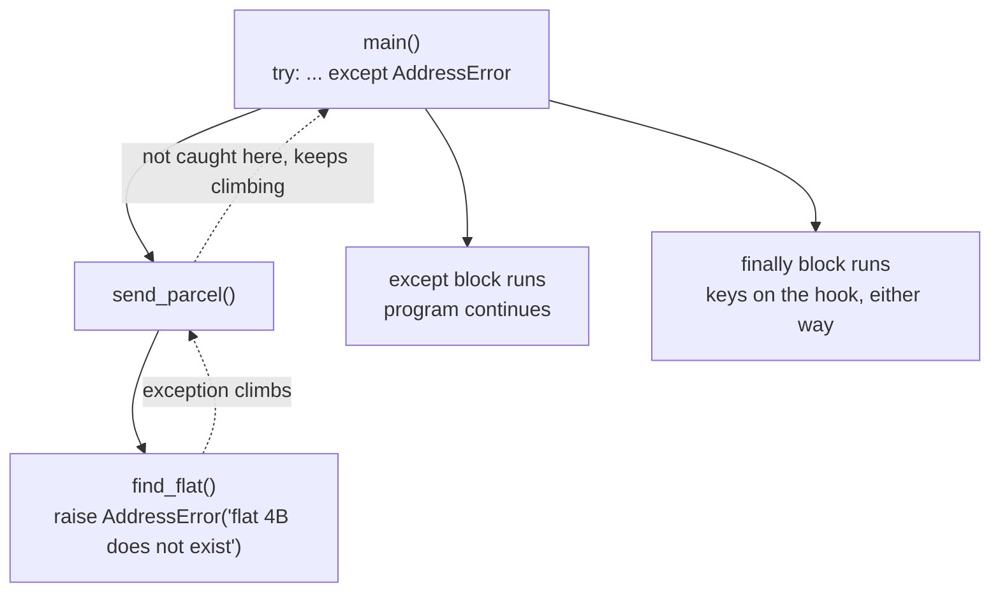

# Day 009 · Python — Exceptions: try, except, raise, finally

**Today's theme:** Errors, three ways

**After today you can:** You can make a function fail in each language and make the caller handle it, and say which style each language prefers.

**The interviewer asks it as:** *Should this function throw, or return an error?*

---

## 1. What this is, and why it matters

An exception is Python's way of saying "this cannot continue" from deep inside a function: the function stops, and the failure climbs up through every caller until one of them catches it, or none does and the program ends with a traceback. You raise one with `raise`, catch one with `try`/`except`, and `finally` runs cleanup whether or not anything went wrong. Python uses exceptions for everything, from a missing dictionary key to a file that does not exist, and the traceback you have been reading since day 1 is what an uncaught one looks like.

At work, the difference between a service that stays up and one that falls over is usually where the `try` is. Interviewers ask "what is the difference between `except Exception` and a bare `except`", "when does `finally` run", and the question in the heading, which in Python is answered "raise, and here is why".

## 2. The story

Kabir sends a birthday parcel to his sister by courier, three days early, from the branch near his office.

On Tuesday the delivery boy reaches the building and the flat number does not exist. Flat 4B. The building stops at 3. He stands in the lobby with the parcel and he does not decide anything. He phones his supervisor. The supervisor does not know the sister either, so he phones the branch manager. The branch manager checks the booking and finds Kabir's number, and phones Kabir, who says, "Oh no, it is 4B in the next building." The problem climbed three people up the chain until it reached someone who could actually do something about it, and that person sent the answer back down. The delivery boy never had to know the sister; he only had to know who to call.

What if nobody had picked up? The boy calls the supervisor, the supervisor calls the manager, the manager cannot reach Kabir. Then the chain is exhausted. The parcel goes back to the depot with a sticker on it saying exactly what happened and where: wrong address, Tuesday, lobby of the wrong building, three calls made. It does not get quietly left on a step. It comes back, loudly, with the whole story attached.

And whatever happens on Tuesday, whether the parcel is delivered, sent back, or handed to a neighbour, the delivery boy returns the van keys to the depot at six. That part is not optional and it does not depend on how the day went. Good day, bad day, keys on the hook.

Kabir's sister, when she finally gets the parcel on Wednesday, asks why he did not just write the right address. Kabir says the courier company has a whole system for when things go wrong, and it worked. She says a system for when things go wrong is not the same as things not going wrong. They are both right.

## 3. The idea in plain English

An **exception** is an object that describes a failure. When a function hits something it cannot handle, it **raises** one: `raise ValueError("flat 4B does not exist")`. From that line, the function stops. It does not return. The exception travels **up** to whoever called the function, and if that caller does not deal with it, up again to its caller, and so on. That is the delivery boy phoning the supervisor phoning the manager.

To deal with one, you wrap the risky lines in **`try`** and follow with **`except`** naming what you can handle: `except ValueError as error:`. If a `ValueError` is raised anywhere inside the `try`, including in functions called from there, the `except` block runs with `error` holding the exception, and the program continues after it. That is the branch manager, who knows what to do about an address.

If nobody catches it, the exception reaches the top and Python prints a **traceback**, the parcel back at the depot with the sticker: the exception's message, and every function it climbed through, with file and line for each. The program ends. That is the right outcome for a bug: loud, located, and impossible to miss.

**`finally`** runs after the `try`, whether it finished normally, raised, or returned. It is the van keys. Closing files and releasing connections go here. An optional **`else`** on a `try` runs only if nothing was raised.

Exceptions come in kinds, arranged in a family tree. `ValueError` for a bad value, `KeyError` for a missing key, `ZeroDivisionError`, `FileNotFoundError`, and dozens more, all descending from `Exception`. `except ValueError` catches only that kind; `except Exception` catches every ordinary failure. A bare `except:` with no name catches **everything**, including the signal that the user pressed Ctrl+C, and that is why this course never writes one. You can define your own kind with a one-line class, `class AddressError(Exception): pass`, so that callers can catch exactly your failure and nothing else.

Python's position on the interview question: raise. A function that cannot do its job should say so by raising, not by returning `None` or `-1` and hoping the caller checks. Go takes the opposite position, and you will see why later today.

## 4. The picture



*Notice that `send_parcel` did nothing about the failure and did not need to; the exception passed straight through it. Notice that `finally` is on the path whether or not `except` ran.*

## 5. The code, built step by step

Start `courier.py` in a `day09` folder. A failure of your own kind.

```python
class AddressError(Exception):
    """Raised when a delivery address cannot be found."""


FLATS = {"1A", "2A", "3A", "1B", "2B", "3B"}


def find_flat(flat: str) -> str:
    if flat not in FLATS:
        raise AddressError(f"flat {flat} does not exist")
    return f"delivered to {flat}"
```

`class AddressError(Exception):` makes a new kind of exception; the round brackets mean it is a kind of `Exception`, which day 17 explains as inheritance. The docstring is its whole body. `raise` ends `find_flat` on the spot when the flat is missing.

A function in the middle that does not catch.

```python
def send_parcel(flat: str) -> str:
    receipt = find_flat(flat)
    return f"receipt: {receipt}"
```

`send_parcel` has no `try`. If `find_flat` raises, the exception passes through `send_parcel` as if it were not there, and the `return` line never runs. This is the supervisor who simply forwards the call.

The caller that handles it.

```python
try:
    print(send_parcel("2B"))
    print(send_parcel("4B"))
    print("this line never runs")
except AddressError as error:
    print(f"could not deliver: {error}")
finally:
    print("van keys returned")
```

```
receipt: delivered to 2B
could not deliver: flat 4B does not exist
van keys returned
```

The first call worked. The second raised inside `find_flat`, two levels down; the exception climbed out through `send_parcel` and landed in the `except`. The third print was skipped. `finally` ran regardless.

The uncaught case, which is what a bug should look like.

```python
print(send_parcel("4B"))
```

```
Traceback (most recent call last):
  File "/home/you/day09/courier.py", line 24, in <module>
    print(send_parcel("4B"))
          ^^^^^^^^^^^^^^^^^
  File "/home/you/day09/courier.py", line 15, in send_parcel
    receipt = find_flat(flat)
              ^^^^^^^^^^^^^^^
  File "/home/you/day09/courier.py", line 10, in find_flat
    raise AddressError(f"flat {flat} does not exist")
AddressError: flat 4B does not exist
```

Read it bottom to top: the exception and its message, then the line that raised it, then every caller on the way up. Every frame is a function the exception climbed through. This is the sticker on the returned parcel.

Catching the built-in kinds, and more than one.

```python
def parse_flat(text: str) -> int:
    try:
        number = int(text)
    except ValueError:
        raise AddressError(f"{text!r} is not a flat number") from None
    return number

for text in ["3", "four", ""]:
    try:
        print(parse_flat(text))
    except AddressError as error:
        print(f"bad input: {error}")
```

```
3
bad input: 'four' is not a flat number
bad input: '' is not a flat number
```

`int("four")` raises `ValueError`. `parse_flat` catches it and raises its own kind instead, so callers see one consistent failure. `from None` hides the inner `ValueError` from the traceback; without it Python shows both, chained, which is sometimes exactly what you want. To catch several kinds at once, list them in a tuple: `except (ValueError, KeyError):`.

Here is the run and output for the complete program.

```bash
python3 courier.py
```

```
receipt: delivered to 2B
could not deliver: flat 4B does not exist
van keys returned
3
bad input: 'four' is not a flat number
bad input: '' is not a flat number
dividing by zero: division by zero
```

And the complete file.

```python
# courier.py — day 9, exceptions
# Run:  python3 courier.py


class AddressError(Exception):
    """Raised when a delivery address cannot be found."""


FLATS = {"1A", "2A", "3A", "1B", "2B", "3B"}


def find_flat(flat: str) -> str:
    if flat not in FLATS:
        raise AddressError(f"flat {flat} does not exist")
    return f"delivered to {flat}"


def send_parcel(flat: str) -> str:
    # No try here: a failure in find_flat passes straight through.
    receipt = find_flat(flat)
    return f"receipt: {receipt}"


def parse_flat(text: str) -> int:
    try:
        number = int(text)
    except ValueError:
        raise AddressError(f"{text!r} is not a flat number") from None
    return number


try:
    print(send_parcel("2B"))
    print(send_parcel("4B"))
    print("this line never runs")
except AddressError as error:
    print(f"could not deliver: {error}")
finally:
    print("van keys returned")

for text in ["3", "four", ""]:
    try:
        print(parse_flat(text))
    except AddressError as error:
        print(f"bad input: {error}")

try:
    print(10 / 0)
except ZeroDivisionError as error:
    print(f"dividing by zero: {error}")
```

## 6. How the other two languages do it

Go, where the failure is a second return value and the caller checks it on the next line:

```go
func findFlat(flat string) (string, error) {
	if !flats[flat] {
		return "", fmt.Errorf("flat %s does not exist", flat)
	}
	return "delivered to " + flat, nil
}

receipt, err := findFlat("4B")
if err != nil {
	fmt.Println("could not deliver:", err)
	return
}
```

C++, where `throw` and `catch` work like Python's, and cleanup is done by destructors instead of `finally`:

```cpp
std::string find_flat(const std::string& flat) {
    if (!flats.contains(flat)) {
        throw std::runtime_error("flat " + flat + " does not exist");
    }
    return "delivered to " + flat;
}

try {
    std::cout << send_parcel("4B") << "\n";
} catch (const std::exception& error) {
    std::cout << "could not deliver: " << error.what() << "\n";
}
```

The one line of difference that matters: **Python and C++ let a failure climb silently through functions that do not mention it; Go makes every function in the chain pass it on by hand.** In Python, `send_parcel` has no error handling and needs none. In Go, `sendParcel` must write `if err != nil { return "", err }` or the failure is lost. Python and C++ programmers find Go's way verbose; Go programmers find the other way invisible, because you cannot tell from reading `send_parcel` that it can fail. Both camps are describing the same trade. The second difference: Python has `finally` and C++ does not, because C++ runs cleanup in destructors, which day 13 covers.

## 7. The traps

**The near-miss: the bare `except`.** Catch everything, to be safe.

```python
while True:
    try:
        text = input("flat? ")
        print(parse_flat(text))
    except:
        print("try again")
```

Press Ctrl+C to stop it. You cannot. The bare `except` caught `KeyboardInterrupt` too, and prints "try again" forever. It also caught `SystemExit` and every bug you will ever write in that block, and turned each into "try again". Name what you can handle: `except AddressError`. If you genuinely need a catch-all for logging, `except Exception as error:` skips the interrupt signals, and you log and re-`raise`.

**The real error: the exception you built but did not raise.** Forget the keyword.

```python
def find_flat(flat: str) -> str:
    if flat not in FLATS:
        AddressError(f"flat {flat} does not exist")
    return f"delivered to {flat}"

print(find_flat("4B"))
```

```
delivered to 4B
```

No error at all, and a parcel delivered to a flat that does not exist. `AddressError(...)` on its own creates the exception object and throws it away. Without `raise`, nothing happens. Linters catch this; your eyes should too.

**The real error: two kinds without the brackets.** Catch two kinds the way it looks like it should work.

```python
except ValueError, KeyError:
```

```
  File "/home/you/day09/courier.py", line 5
    except ValueError, KeyError:
           ^^^^^^^^^^^^^^^^^^^^
SyntaxError: multiple exception types must be parenthesized
```

It is a tuple: `except (ValueError, KeyError):`. Python 3.12 at least tells you.

## 8. Say it out loud

**How it gets asked**

- "Should this function throw, or return an error?"
- "What is the difference between `except Exception` and a bare `except`?"
- "When does `finally` run, and what is it for?"

**What to say out loud, the first ninety seconds**

"Python's convention is to raise. A function that cannot fulfil its contract raises an exception rather than returning a sentinel like `None` or `-1`, because a sentinel can be ignored and an exception cannot: it propagates up the call stack until something catches it, and if nothing does, the program terminates with a traceback that names the failure and every frame it passed through. Intermediate functions do not need to mention it, which keeps the happy path clean, at the cost that a function's signature does not tell you it can fail.

I catch specific types: `except ValueError`, or a tuple of types, or my own subclass of `Exception` so callers can target exactly my failure. `except Exception` is the broad catch for logging, and I re-raise after logging. A bare `except` also catches `KeyboardInterrupt` and `SystemExit`, which makes programs unkillable, so I never write it. `finally` runs on every exit path, normal, exceptional or `return`, and holds cleanup; `else` runs only when no exception occurred. Go makes the opposite choice, returning errors as values, and C++ supports both, so the honest answer to 'throw or return' is: follow the language's convention, and in Python that is raise."

**The follow-ups**

1. *"What is `raise ... from`?"* — It sets the cause of a new exception, so the traceback shows "The above exception was the direct cause of the following exception". `from None` suppresses the chain when the inner detail is noise.
2. *"Is using exceptions for control flow bad?"* — In Python it is normal and idiomatic: `for` loops end on `StopIteration`, and `try: d[k] except KeyError:` is often preferred over checking first. The cost of a raise is small; the cost of an unclear program is not.
3. *"What is a context manager, and how does it relate to `finally`?"* — `with open(...) as f:` guarantees the file is closed on any exit, exactly like a `try`/`finally` around the block. Day 10 uses it.

**A model answer**

"Python signals failure by raising exceptions, which unwind the stack through any number of frames until caught by a matching `except`; uncaught exceptions terminate the program with a full traceback. Handlers should name specific types, including custom subclasses of `Exception`, and `except Exception` is the broad catch for logging and re-raising; a bare `except` also swallows `KeyboardInterrupt` and `SystemExit` and is never appropriate. `finally` executes on every exit path and is the place for cleanup, and `else` runs only on success. `raise ... from` chains causes. The trade against Go's error values is explicit: exceptions keep intermediate code clean but hide failure from signatures, so in Python the answer to 'throw or return' is raise, with the type of the exception being part of the function's contract."

## 9. Recall card

- `raise AddressError("...")` ends the function; the exception climbs every caller until an `except` matches, or the program ends with a traceback read bottom to top.
- `try` / `except SomeError as e` / `else` (no error) / `finally` (always); catch several with a tuple, `except (A, B):`.
- Never bare `except:`; it catches Ctrl+C. Use `except Exception as e:` for a broad catch, then re-`raise`.
- Your own kind: `class AddressError(Exception): pass`; forgetting the word `raise` creates and discards it silently.
- Python's answer to throw or return: raise. Go returns. C++ can do either.
