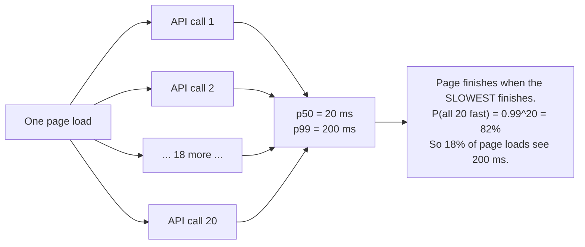

# Day 010 · System Design — Latency numbers every engineer should know

**After today you can:** You can quote the handful of numbers that make back-of-the-envelope estimation possible.

**The interviewer asks it as:** *Roughly how long is a network round trip to a data centre on another continent?*

---

## 1. What this is, and why they ask it

There are about a dozen numbers that let you estimate how long any system will take, without
building it. How long a memory read takes, how long a disk read takes, how long a round trip
across a city or across the world takes, how much data a network link moves in a second.

Yesterday you learnt the ladder those numbers sit on. Today you learn to **use** them: to add
up the legs of a request, spot which one dominates, and say a number out loud before writing
any code.

Interviewers ask because a system design round is scored on whether your answers are sized. "We
should add a cache" is a suggestion anyone can make. "The database call is 40 ms of a 55 ms
request, and 80% of reads are for 5% of the rows, so a cache takes the median to about 15 ms"
is a design. The second sentence requires nothing but these numbers and arithmetic — and it
is available to a candidate who has memorised twelve figures and is not available to one who
has not.

---

## 2. The story

Prakash has lived in Thane for nine years and works near Lower Parel. At a quarter past nine
on a Tuesday morning his manager rings and asks whether he can be at a client's office in
Worli by ten.

He says no. He says it in about four seconds, and he is not guessing.

The reason he can answer that fast is that he knows the pieces. Twelve minutes to walk to the
station, and he does not need to check because he has done it eleven hundred times. Trains
every four minutes at that hour, so call it two minutes of waiting on average. Forty-five
minutes on the train. Then fourteen minutes at the other end. Twelve and two and forty-five
and fourteen is seventy-three minutes, and he rounds it to seventy-five because nothing ever
goes exactly right. Quarter past nine plus seventy-five minutes is half past ten. So: no,
and here is when I can be there.

His nephew Sumit moved to the city in March and started at the same office in June. In his
second week Sumit was asked the same kind of question and said "should be fine", because it
did not look far on the map. He arrived thirty-five minutes late, apologised, and could not
explain what had gone wrong, because he had never had the numbers in the first place. He had
an impression. Prakash has legs and times.

There is a second thing Prakash knows, which took longer to learn. When he is trying to get
somewhere faster, there is only one leg worth touching. If he takes an auto to the station
instead of walking, he saves seven minutes off a twelve-minute walk. If the train could
somehow be forty minutes instead of forty-five, that is five. The train is sixty percent of
the journey and everything else is noise around it. There is no point at all in leaving the
house at a run.

And there is a third thing, which is the one that actually costs people meetings. Forty-five
minutes is the ordinary number. On a Monday morning, or when it has rained in the night, it
is seventy. It is seventy perhaps one day in twenty. So when it genuinely matters — when
somebody is flying in, when there is one slot and no second chance — Prakash does not plan
around forty-five. He plans around seventy, leaves early, and has a coffee at the other end.
The typical number is for typical days. The bad number is what you plan a promise around.

---

## 3. The idea in plain English

Prakash's journey is back-of-the-envelope estimation, and his three habits are the three
things this lesson is about.

### The numbers, and why they must be memorised

You cannot estimate without raw figures, and there is no way round learning them. Here is the
canonical list, rounded to the nearest useful power of ten.

| Operation | Time | Remember it as |
|---|---|---|
| L1 cache reference | 1 ns | 1 ns |
| Branch mispredict | 3 ns | |
| L2 cache reference | 4 ns | |
| Mutex lock/unlock | 17 ns | |
| **Main memory reference** | **100 ns** | **0.1 µs** |
| Compress 1 KB with Snappy | 2 µs | |
| **Send 1 KB over 1 Gbps network** | **10 µs** | |
| **SSD random read** | **100 µs** | **0.1 ms** |
| Read 1 MB sequentially from memory | 250 µs | |
| **Round trip within a data centre** | **500 µs** | **0.5 ms** |
| Read 1 MB sequentially from SSD | 1 ms | |
| **Disk seek (spinning)** | **10 ms** | |
| Read 1 MB sequentially from disk | 20 ms | |
| **Round trip, one city to another** | **10–50 ms** | |
| **Round trip, across the world** | **150–250 ms** | |

**The seven in bold are the ones to actually memorise.** Everything else can be derived from
them, and nobody will ask you for a mutex lock in an interview.

The relationships are more useful than the absolute values:

```
memory : SSD : disk seek  =  100 ns : 100 us : 10 ms  =  1 : 1,000 : 100,000

same-DC round trip : cross-world round trip = 0.5 ms : 200 ms = 1 : 400
```

### Prakash's first habit: break it into legs and add them up

This is the whole technique. Any request is a sum of steps, and each step is one of the
numbers above.

A typical API request:

```
client -> load balancer -> app server         (internet round trip)   40 ms
app parses, routes, validates                 (CPU)                    1 ms
app -> Redis for the session                  (DC round trip)          0.5 ms
app -> database, index lookup + row fetch     (DC round trip + SSD)    2 ms
app renders JSON                              (CPU)                    1 ms
response back to client                       (already counted)        -
                                                                     -------
                                                                      44.5 ms
```

Forty of those forty-four milliseconds are the user's own network connection, and nothing you
do inside your data centre will touch it. That is a real and common result, and it is why the
answer to "make the site faster" is so often a CDN rather than a database change.

### Prakash's second habit: find the dominant term

Once you have the legs, **only the biggest one matters.** This is the same idea as dropping
lower-order terms in [day 003](../day-003-big-o-in-plain-english/README.md), applied to
wall-clock time.

In the request above, halving the CPU work saves 1 ms out of 44.5 — about two percent.
Removing the database call entirely saves 2 ms. Moving the server closer to the user, so the
round trip is 10 ms instead of 40, saves 30 ms — two thirds of the whole thing.

**Optimising anything except the dominant term is wasted effort**, and being able to say which
term dominates is most of what a performance conversation is.

### Prakash's third habit: the typical number is not the number you promise

Forty-five minutes on an ordinary day, seventy after rain.

Systems are the same, and the vocabulary matters because interviewers use it:

- **p50** (median): half of requests are faster than this. The typical day.
- **p95**: 19 in 20 are faster than this.
- **p99**: 99 in 100 are faster. The rainy Monday.
- **p99.9**: the very worst one in a thousand.

The gap is usually enormous. A service with a p50 of 20 ms often has a p99 of 200 ms, because
the slow ones are the cache misses, the garbage collections, the retries, the connection that
had to be re-established.

**Users experience the tail, not the median.** A page that makes 20 requests will, on average,
contain one request from the p95. So the page's speed is governed by p95, not p50 — and
that arithmetic is the single most useful thing in this section:

```
a page with 20 calls, each with a 1% chance of being slow
chance ALL of them are fast = 0.99^20 = 0.82
so 18% of page loads contain at least one slow call
```

### The other half: throughput, not just latency

**Latency** is how long one thing takes. **Throughput** is how many things per second. They
are different, and mixing them up is a classic interview stumble.

A 1 Gbps network link has a throughput of roughly 125 MB per second, and a round trip on it
still takes 0.5 ms. Adding a second link doubles throughput and does nothing at all to
latency — exactly as putting a second train line in would not make Prakash's train faster.

The two conversions worth having ready:

```
1 Gbps  = 125 MB/s      1 GB takes 8 seconds
10 Gbps = 1.25 GB/s     1 GB takes 0.8 seconds
```

### The floor nobody can go below

Light travels 300,000 km per second, and in fibre it is about two thirds of that — 200,000
km/s. Mumbai to London is roughly 7,200 km, and the cable does not go in a straight line, so
call it 10,000 km each way:

```
20,000 km / 200,000 km per second = 0.1 s = 100 ms
```

**One hundred milliseconds, minimum, forever.** No amount of engineering reduces it, because
it is physics. That is why global services put machines near users instead of making one fast
one — and it is the entire justification for CDNs and multi-region deployments.

---

## 4. The picture

The numbers on a logarithmic scale, so the gaps are visible:

```
   1 ns    L1 cache          |
   4 ns    L2 cache          ||
 100 ns    RAM               |||
   1 us    L3 + misc         ||||
  10 us    1 KB over 1 Gbps  |||||
 100 us    SSD random read   ||||||
 500 us    same-DC round trip|||||||
   1 ms    1 MB from SSD     ||||||||
  10 ms    disk seek         |||||||||
  20 ms    1 MB from disk    ||||||||||
  50 ms    cross-country RTT |||||||||||
 200 ms    cross-world RTT   ||||||||||||
           <-- each bar is 10x the one above -->
```

**What to notice:** each row is roughly ten times the one above. Twelve rows spans a factor of
two hundred million. So an estimate that is out by a factor of two is fine, and an estimate
that puts something on the wrong row is completely wrong. **Getting the row right is the
skill; the digits do not matter.**

Where the time goes in a real request, drawn to scale:

```
  |======================================|===|=|==|=|
  |<----------- 40 ms internet --------->|   | |  |
                                        1ms  |2ms |1ms
                                          0.5ms  Redis
                                             DB

  total 44.5 ms.  The user's own connection is 90% of it.

  now move the server to the same country (10 ms RTT):

  |==========|===|=|==|=|
  |<-10 ms ->|
  total 14.5 ms — a 3x improvement, and not one line of code changed.
```

**What to notice:** the whole right-hand side of the first picture is where engineers spend
their time, and it is a tenth of the bar.

And the tail-latency effect, which is the picture worth remembering:



**What to notice:** every individual call is fast 99% of the time, and nearly one page load in
five is slow. Fan-out turns a rare problem into a common one, and that is the reasoning behind
almost every tail-latency technique you will meet later.

---

## 5. How it actually works

### Where these numbers come from, and checking them yourself

They are not folklore. You can measure most of them in a minute.

```
ping google.com                 # round trip to a nearby edge, usually 5-30 ms
ping <a server in Europe>       # 100-200 ms from India
traceroute google.com           # every hop, with its own round trip
```

`ping` reports the round trip directly. `traceroute` shows the route and where the time is
spent — usually in one or two long hops, which are the undersea legs.

For disk and memory: `fio` measures storage properly, `dd` gives a rough sequential number,
and `perf stat` reports cache misses.

The canonical list is Jeff Dean's "Latency Numbers Every Programmer Should Know", published
around 2010 and updated since. The absolute numbers have moved — SSDs got faster, networks got
wider — but **the ratios have barely changed in fifteen years**, and the ratios are what you
estimate with.

### What actually makes up a network round trip

```
propagation delay   distance / (2/3 the speed of light)   -- physics, irreducible
transmission delay  bytes / link speed                    -- how long to push it out
queueing delay      waiting in router buffers             -- the variable part
processing delay    per-hop routing decisions             -- small, ~microseconds
```

For a small request across the world, propagation dominates completely. For a large transfer
on a slow link, transmission dominates. **Queueing is where the variance lives** — it is why
p99 is so much worse than p50, and why a congested link degrades so sharply rather than
gradually.

### Why a CDN is the standard answer

Since propagation delay is distance divided by a constant, the only lever is distance.
**Cloudflare**, **Akamai**, **CloudFront** and **Fastly** operate hundreds of edge locations,
and DNS steers you to the nearest one ([day 003](../day-003-big-o-in-plain-english/README.md)).

```
Mumbai user -> origin in Virginia  : 250 ms round trip
Mumbai user -> Cloudflare Mumbai   :   5 ms round trip
```

Fifty times better, from geography rather than engineering. Every static asset, and
increasingly the dynamic content too, is served this way.

### Where the numbers sit in real products

| Operation | Typical | Why |
|---|---|---|
| **Redis** GET, same DC | 0.5–1 ms | RAM plus one round trip; the round trip dominates |
| **PostgreSQL** indexed read, cached | 1–3 ms | buffer pool hit plus round trip |
| **PostgreSQL** read from SSD | 5–15 ms | add the storage cost |
| **PostgreSQL** write with fsync | 5–20 ms | must be durable before acknowledging |
| **Kafka** produce, acks=1 | 2–10 ms | sequential append |
| **S3** first byte | 50–150 ms | it is a network service, not a disk |
| **DynamoDB** single-item read | 5–10 ms | |
| **Elasticsearch** query | 10–100 ms | depends heavily on the query |
| Cross-region replication | 50–200 ms | physics |

**Redis is worth pausing on.** A memory read is 100 ns and a Redis GET is 500,000 ns. Redis is
not slow — the memory access is a rounding error, and essentially all of that time is the
network round trip and the syscall overhead. This is why batching matters so much: `MGET` for
100 keys costs one round trip, and 100 individual `GET`s cost 100. Same data, a hundred times
the latency.

### The rules of thumb that make estimation quick

```
seconds in a day       = 86,400, call it 100,000
seconds in a month     = 2.5 million
1 million requests/day = ~12 requests per second
1 billion requests/day = ~12,000 requests per second
peak is 2-5x average
```

That third line is the single most reusable one. **A million a day is twelve a second**, which
is nothing. Ten million a day is 120 a second, which is still one machine. This is how you
avoid over-designing, and interviewers notice when a candidate concludes "one server" and can
show why.

---

## 6. The numbers

**Estimate one: a social feed request.** A user opens their timeline showing 50 posts.

```
DNS lookup (usually cached)                      0 ms
TCP + TLS handshake (reused connection)          0 ms
request to edge, edge to origin                 40 ms
auth: token check (in-process)                   1 ms
fetch 50 post IDs from Redis (one MGET)          1 ms
fetch 50 posts from the database (one query)     5 ms
fetch 50 authors (one query, batched)            3 ms
render JSON                                      2 ms
                                               -------
                                                52 ms
```

Now the version somebody writes by accident, fetching each author separately:

```
50 separate author queries x 2 ms each        = 100 ms
                                               -------
total                                          149 ms
```

**Three times slower from one loop.** That is the **N+1 query problem**, and it is the most
common performance bug in application code. The arithmetic above is how you spot it in a
design review before it ships.

**Estimate two: how much storage.** 50 million users, 20 posts each, 2 KB per post:

```
50,000,000 x 20 x 2 KB = 2,000,000,000 KB = 2 TB
```

With 3× replication and 2 KB of index and metadata overhead per post:

```
2 TB x 3 = 6 TB of replicated post data
50,000,000 x 20 x 2 KB of overhead x 3 = another 6 TB
                                        -----------
                                        ~12 TB
```

Twelve terabytes fits on a handful of machines. **The useful output of this estimate is that
storage is not the problem** — which redirects the design conversation to what is.

**Estimate three: requests per second.** 10 million daily active users, 30 requests each:

```
10,000,000 x 30 = 300,000,000 requests per day
300,000,000 / 86,400 = 3,472 requests per second average
x 3 for peak = ~10,000 requests per second
```

And at 80 requests per second per machine
([day 007](../day-007-space-complexity/README.md)):

```
10,000 / 80 = 125 machines, call it 150 with headroom
```

**Estimate four: does a cache pay for itself?** Database read 5 ms, Redis read 0.5 ms, 90% hit
rate:

```
without cache : 5 ms
with cache    : 0.9 x 0.5 + 0.1 x (0.5 + 5) = 0.45 + 0.55 = 1.0 ms
```

Five times better. Note the `0.5 + 5` on the miss path: a miss costs the cache lookup **and**
the database read. That term is what makes a low hit rate actively harmful, and it is the
detail that separates a real estimate from a hopeful one:

```
at a 20% hit rate: 0.2 x 0.5 + 0.8 x 5.5 = 0.1 + 4.4 = 4.5 ms
```

Barely better than no cache at all, and now you have a second system to operate.

**Estimate five: bandwidth out.** 10,000 requests per second at 50 KB each:

```
10,000 x 50 KB = 500 MB/s = 4 Gbps sustained
500 MB/s x 86,400 = 43 TB per day
43 TB x $0.09 per GB = about $3,900 per day of egress
```

Nearly $1.4 million a year in bandwidth. **This is why CDN offload is a finance decision as
much as a performance one.**

**Estimate six: the tail.** A service with p50 20 ms and p99 200 ms, and a page making 20
calls in parallel:

```
P(a given call is fast) = 0.99
P(all 20 fast)          = 0.99^20 = 0.818
P(at least one slow)    = 18.2%
```

Almost one page in five hits a 200 ms call. **The page's p50 is governed by the service's
p99.** Which is why hedged requests, timeouts and fan-out reduction exist, and why "our p99 is
fine, it's only 1%" is a sentence that should be challenged with this multiplication.

---

## 7. The trade-offs

**Estimates buy speed of judgement and charge you accuracy.** An order-of-magnitude estimate
takes thirty seconds and tells you whether something is a one-machine problem or a
hundred-machine problem, which is almost always the decision that matters. It will not tell
you whether you need eleven machines or fourteen. Treating an estimate as a measurement is
where this goes wrong — the correct use is to *rule things out*, then measure the survivors.

**Latency and throughput are traded against each other constantly.** Batching a hundred
database writes into one round trip enormously improves throughput and makes the first write
in the batch wait for the ninety-ninth — worse latency, better throughput. Every queue in
every system makes this trade. When an interviewer says "how would you improve this?", it is
worth asking which of the two they mean, because the answers point in opposite directions.

**Optimising the median is usually the wrong target.** The median is what your dashboard
shows and the tail is what your users feel, especially with fan-out. A change that takes p50
from 20 ms to 15 ms and leaves p99 at 200 ms has improved almost nobody's experience. The
uncomfortable corollary is that tail work — timeouts, retries with backoff, hedged requests,
reducing fan-out — is less satisfying and worth more.

**Caching is not free, and its value is non-linear in the hit rate.** At 90% it is
transformative; at 20% it is a second system to run for almost no benefit, because misses pay
both costs. And every cache adds an invalidation problem. The estimate above is how you decide
whether to build one, and it needs a real hit-rate assumption to be worth anything — which
usually means knowing how concentrated your access pattern is.

**I would not estimate at all if...** the answer depends on a constant I do not know. If the
question is "how long does this query take", the honest answer is "let's measure it" — the
range between an indexed lookup and a full scan on the same table is four orders of magnitude,
and no amount of arithmetic bridges that. Estimation works for the parts governed by physics
and by well-known constants: network distance, storage speed, byte counts, request rates. It
does not work for the parts governed by somebody's code.

---

## 8. In the interview

### How it gets asked

- *"Roughly how long is a round trip to a data centre on another continent?"* — the direct
  version. The answer is 150–250 ms, and the reason is the speed of light.
- *"Estimate how much storage this needs."* — show the multiplication.
- *"How many servers would you need?"* — requests per second divided by per-machine capacity.
- *"Where is the time going in this request?"* — break it into legs and name the dominant one.

### What to say out loud, in the first ninety seconds

1. **Give the number with a range and a reason.** *"About 150 to 250 milliseconds. That's
   dominated by propagation delay — light in fibre goes about 200,000 km per second, and it's
   roughly 20,000 km round trip."*
2. **Say what that means.** *"So it's a floor. No engineering reduces it, which is why global
   services put servers near users rather than making one server faster."*
3. **Give the neighbouring numbers.** *"Within a data centre it's about half a millisecond.
   Across a country, 10 to 50. Across the world, 150 to 250. That's a factor of 400 from the
   smallest to the largest."*
4. **Apply it, unprompted.** *"Which is why a request that crosses continents twice — say the
   app calls a service in another region — costs half a second before anything is computed."*
5. **Name the design consequence.** *"So I'd put read replicas or a CDN in each region, and
   keep cross-region calls off the request path — do them asynchronously if they're needed at
   all."*
6. **Offer the estimate.** *"Happy to size the whole request if that's useful — I'd break it
   into legs and add them up."*

### The follow-ups

**"Why can't we make it faster?"**
Because it is bounded by physics. Light in fibre travels about 200,000 kilometres per second,
and a round trip across the world is roughly 20,000 kilometres, so 100 ms is the theoretical
floor and 150 to 250 is what you actually see once you add routing and queueing. You cannot
engineer past it — you can only move the data closer to the user, which is what CDNs and
multi-region deployments do, or reduce the number of round trips, which is what HTTP/2
multiplexing, connection reuse and request batching do.

**"Where would you look first to make this request faster?"**
At the biggest leg. I would break the request into its legs — network to the user, auth,
database, cache, rendering — and estimate each. Typically for a global service the user's own
network is 40 of 50 milliseconds, so the answer is a CDN or an edge location rather than
anything in the application. If it is an internal service, the database is usually dominant,
and then the question is whether it is a missing index, an N+1 loop, or a genuine cache
opportunity. What I would avoid is optimising a 1 ms CPU step in a 50 ms request.

**"Our p99 is 200 ms but our p50 is 20 ms. Is that a problem?"**
Almost certainly, and more than it looks. If a page makes 20 calls, the chance that all 20
land in the fast 99% is 0.99 to the twentieth, which is 82% — so nearly one page load in five
contains a 200 ms call. Fan-out converts a rare event into a common one, so the page's typical
experience is governed by the service's tail. I would want to know what causes the tail: cache
misses, garbage collection pauses, connection establishment, a slow shard. Then either fix the
cause, cut the fan-out, or use timeouts and hedged requests so one slow call cannot hold the
page.

**"Estimate the storage for a photo-sharing app with 100 million users."**
I would state the assumptions, because the assumptions are the answer. Say 10% of users post
daily, so 10 million uploads a day. Say each photo is 2 MB original plus 500 KB of resized
versions, so 2.5 MB. That is 25 TB a day, or about 9 petabytes a year. With 3× replication
that is 27 PB a year, which is object storage rather than a database — S3 or equivalent. At
roughly $0.023 per GB per month that is about $600,000 a month by the end of the first year,
so I would immediately want a tiering policy: recent photos on standard storage, older ones
on infrequent-access or Glacier. That cost result is usually the interesting output of the
estimate, not the byte count.

### A model answer

> "A round trip to another continent is about 150 to 250 milliseconds, and the reason matters
> more than the number. Light in fibre travels about 200,000 kilometres a second, and a round
> trip Mumbai to Virginia is roughly 20,000 kilometres of cable, so 100 milliseconds is the
> physical floor. Routing and queueing take it to 150–250 in practice.
>
> The full set I keep in my head is: memory 100 nanoseconds, SSD read 100 microseconds, disk
> seek 10 milliseconds, round trip within a data centre half a millisecond, across a country
> 10 to 50, across the world 150 to 250. Each of those is roughly a factor of a thousand or so
> apart, which is what makes them useful — I only need the right order of magnitude, not the
> right digits.
>
> The way I use them is to break a request into legs and add up. A typical API call for a
> user on another continent is maybe 40 milliseconds of their own network, 1 for parsing, half
> a millisecond for a Redis session lookup, 2 to 5 for a database query, and a couple for
> rendering. So about 50 milliseconds, of which 80% is geography.
>
> That tells me immediately where to look. Halving the CPU work saves 2%. Moving the server
> to the user's region takes 40 milliseconds down to 10 and cuts total time by two thirds,
> without changing any code. So my first recommendation would be an edge presence, not a
> database optimisation.
>
> The one caveat I'd add is that these are medians, and users experience the tail. If a page
> makes 20 backend calls and each has a 1% chance of being slow, then only 82% of page loads
> have all 20 fast — nearly one in five sees the p99. So when I'm sizing something that
> matters, I plan around p99 rather than p50, the same way you'd plan a journey around a bad
> traffic day rather than a typical one."

That answer gives the number, the reason, the surrounding numbers, a worked application, the
design consequence, and the tail caveat.

---

## 9. Recall card

1. **The seven to memorise:** RAM **100 ns**, SSD read **100 µs**, disk seek **10 ms**,
   same-DC round trip **0.5 ms**, cross-country **10–50 ms**, cross-world **150–250 ms**,
   1 Gbps = **125 MB/s**.
2. **Estimate by legs.** Break the request into steps, put a number on each, add them up, and
   **optimise only the dominant term**.
3. **150 ms across the world is physics.** 20,000 km at 200,000 km/s. The only lever is
   distance — which is what CDNs and multi-region deployments buy.
4. **Users feel the tail, not the median.** 20 calls each 99% fast means only 82% of pages are
   fast. Plan around p99.
5. **A million requests a day is twelve per second.** Peak is 2–5× average. That one line
   stops most over-designing before it starts.
