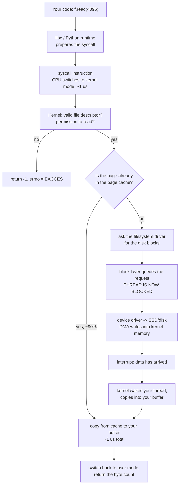

# Day 011 · System Design — The operating system's job

**After today you can:** You can name what the OS does for your program: memory, scheduling, files, network.

**The interviewer asks it as:** *What does the operating system do when your program asks to read a file?*

---

## 1. What this is, and why they ask it

The **operating system** owns the hardware. Your program does not. When your code reads a
file, sends a network message, allocates memory or starts a thread, it is not doing any of
those things — it is **asking** the OS to do them, and waiting.

The mechanism for asking is a **system call**, and the boundary it crosses is the most
important line in a computer. On your side, your program cannot damage anything but itself. On
the other side, the **kernel** can do anything at all.

Interviewers ask because the answer explains costs that otherwise look arbitrary. Why is
buffered I/O so much faster than unbuffered? Why does a blocking call hold a whole worker? Why
is a context switch expensive? Why do containers isolate without a virtual machine? Every one
of those is a fact about this boundary. A candidate who can walk a file read from `read()` to
the disk and back has a mental model that will keep paying off for the rest of the interview.

---

## 2. The story

Balan has been the caretaker of a hundred-room working women's hostel in Ernakulam for
sixteen years. He sits at a desk just inside the gate, and almost nothing in that building
happens without going past him.

The store room is behind his desk and it is locked. Buckets, mops, bulbs, mattresses, spare
blankets, the ladder. When a resident needs a bucket she comes to the desk and asks, and he
gets up, unlocks the store, finds one, and hands it over. It takes him ninety seconds.

She could get it herself in twenty. That is not the arrangement, and everybody understands
why after they hear about 2019, when the store was left open for a week during renovations.
People took things without saying, took the wrong things, put things back in the wrong place,
and by the end of it there were eleven buckets, no bulbs, and the ladder was in somebody's
room. It took two days to sort out. The ninety seconds is not inefficiency. It is what
somebody keeping track costs.

He allots the rooms too. He decides who gets which one, and everybody's key opens exactly one
door. A resident cannot walk into another resident's room, and this is not politeness — it is
the lock. Nobody has to trust anybody.

The common room is his most delicate job because there is one television and forty women who
want it. He keeps a rota. Half an hour each on weekday evenings, and when somebody's half hour
is up he comes in and says so, even mid-programme, and the next person sits down. It is the
only arrangement that has ever worked, and the reason it works is that nobody has to negotiate
with anybody.

Post and visitors come to the gate, to him, and he sends them up to the right room. When
somebody's brother arrives, he checks the register on his screen, confirms the room, and rings
up. The visitor never wanders the building looking.

And he says no. When a resident asks for the ladder to hang something from the ceiling, he
says no, because that is a rule from the management and it is not his to bend. When somebody
who left last month comes back for a spare key, he says no, because she is not on the list any
more. Half of what he does is knowing what people are and are not allowed.

The one thing that genuinely slows the building down is when he is away from the desk. If he
is up on the third floor fixing a tap, six people are standing at the gate waiting, and
nothing any of them wants is difficult. They simply cannot do it themselves.

---

## 3. The idea in plain English

Balan is the kernel, and the desk is the system call boundary.

### Two sides of one line

**User space** is where your program runs. It can compute, and it can touch its own memory,
and that is all. It cannot read a disk, send a network message, or look at another program's
memory. The processor physically forbids it.

**Kernel space** is where the operating system runs, with full access to everything.

The line between them is enforced by hardware — the CPU runs in different **privilege modes**,
and the instructions that touch devices only work in the privileged one. This is not a
convention that programs politely follow. It is a wall.

### A system call is asking at the desk

A **system call** is how user space asks kernel space to do something. When your Python code
runs `open("data.txt")` and then `.read()`, underneath it is making system calls named
`open`, `read` and `close`.

What physically happens on each one:

1. Your program puts the request in an agreed place and executes a special instruction
   (`syscall` on x86-64).
2. The CPU **switches to kernel mode** and jumps to a fixed handler in the kernel.
3. The kernel checks the arguments and **checks permission** — this is Balan saying no.
4. It does the work.
5. It switches back to user mode and returns.

The round trip costs roughly **1–2 microseconds** even when the work itself is trivial. That is
the ninety seconds at the desk: not the bucket, the walking.

You can watch every one of them. `strace ./yourprogram` on Linux prints each system call your
program makes, with arguments and return values, and it is one of the most useful hours a
beginner can spend.

### The four things it does for you

**Memory.** Each process gets its own **virtual address space** — its own set of addresses
that the OS maps onto real physical memory. Process A's address 0x1000 and process B's address
0x1000 are different physical bytes. That is the room key that opens one door. When memory
runs short, the OS writes pages out to disk (**swap**) and reads them back on demand.

**Scheduling.** More runnable threads than cores, always. The **scheduler** gives each one a
**time slice** of a few milliseconds and then switches. Nobody negotiates with anybody; the
rota is imposed. This is why your program can be interrupted between any two instructions,
which is the root of every race condition from
[day 008](../day-008-reading-a-problem/README.md).

**Files and devices.** The OS presents one uniform interface — open, read, write, close — over
completely different hardware. The same four calls work on an SSD, a spinning disk, a USB
stick, a network share, a terminal and a network socket. **Device drivers** are the part that
knows the differences. On Unix this uniformity is the famous "everything is a file", and it is
why a socket and a file behave alike to your code.

**Networking.** The OS implements the whole TCP/IP stack from
[day 004](../day-004-the-growth-curves/README.md) — checksums, sequence numbers, retransmission,
congestion control. Your program hands it bytes. That is post arriving at the gate and being
routed to the right room.

And running through all four: **permissions**. Every one of those calls is checked. Can this
process read this file? Bind this port? Send this signal? Half of what the kernel does is
saying no.

### The file descriptor

When you open a file, the kernel returns a small integer — a **file descriptor**. It is not
the file. It is a number that indexes into a table the kernel keeps for your process, and the
entry in that table holds the real information: which file, what position, what permissions.

Three descriptors always exist: **0** is standard input, **1** is standard output, **2** is
standard error. That is why `2>/dev/null` means "throw the errors away".

Sockets get file descriptors too, which is why `read()` works on both a file and a network
connection, and why a process can run out of file descriptors and fail to accept new
connections — a real and common production error, `EMFILE: too many open files`.

### Why one call can be so much more expensive than another

This is the part that connects today to everything practical.

A system call that is satisfied from memory the kernel already has is fast. A system call that
must wait for hardware is not — and while it waits, **your thread is blocked**: taken off the
processor entirely until the data arrives.

```
read() from the page cache (already in RAM)  :     ~1 us   -- the boundary crossing
read() that must go to SSD                   :   ~100 us   -- 100x
read() that must go to a spinning disk       : ~10,000 us  -- 10,000x
```

That single table is why buffering exists, why asynchronous servers exist, and why the
hierarchy from [day 009](../day-009-what-an-array-is/README.md) shows up in your application's
latency rather than staying a hardware fact.

---

## 4. The picture

What actually happens on `read()`:



**What to notice:** the two paths out of the diamond differ by a factor of a hundred. The
fast one never touches hardware at all — it is a copy from memory the kernel is already
holding. **The page cache is why most file reads are not disk reads.**

The boundary itself:

```
   +==========================================================+
   |                      USER SPACE                          |
   |                                                          |
   |   your program    Python runtime    libraries            |
   |                                                          |
   |   can: compute, touch its own memory                     |
   |   cannot: touch a device, another process, the kernel    |
   +==========================================================+
                    ||  system call  ||   ~1-2 us each way
                    \/               /\
   +==========================================================+
   |                     KERNEL SPACE                         |
   |                                                          |
   |  scheduler   memory manager   filesystems   TCP/IP stack |
   |  device drivers   permission checks   page cache         |
   |                                                          |
   |  can: everything                                         |
   +==========================================================+
                    ||
                    \/
   +==========================================================+
   |          HARDWARE: CPU, RAM, disk, network card          |
   +==========================================================+
```

**What to notice:** every arrow between your program and the hardware goes through the middle
box. There is no direct path, and that is the entire security and stability model of a modern
computer.

And why buffering matters so much, drawn as call counts:

```
   reading 1 MB, one byte at a time:
      1,048,576 system calls x ~1 us  = about 1 second

   reading 1 MB, 4 KB at a time:
      256 system calls x ~1 us        = about 0.3 milliseconds

                                        3,000x fewer crossings
```

**What to notice:** the data read is identical. The only thing that changed is how many times
you walked to the desk.

---

## 5. How it actually works

### The page cache, which is where the speed comes from

The kernel keeps recently read file blocks in RAM, in the **page cache**, and it uses all the
free memory on the machine to do it. This is why `free -h` on a healthy Linux server shows
almost no free memory and a large `buff/cache` figure — that is not memory being wasted, it is
memory doing its job.

Consequences worth knowing:

- The second read of a file is typically a hundred times faster than the first.
- A `write()` normally returns as soon as the data is in the page cache, **before** it reaches
  the disk. It is not durable yet. `fsync()` is what forces it out, and it is why a database
  commit costs 5–20 ms rather than 50 µs.
- **Kafka** deliberately relies on the page cache instead of maintaining its own — it writes
  sequentially and lets the kernel serve recent reads from memory.

### Virtual memory and page faults

Every process sees a private, flat address space. The **MMU** hardware translates those
addresses to physical ones using **page tables**, in 4 KB pages, with a small cache of recent
translations called the **TLB**.

When a program touches an address whose page is not currently in physical memory, the hardware
raises a **page fault** and the kernel steps in. There are two kinds, and the difference
matters:

- A **minor fault** means the page is in memory but not yet mapped to this process — cheap,
  microseconds. This is what happens the first time you touch newly allocated memory, and it
  is why `malloc` is fast but the first write to that memory is not.
- A **major fault** means the page must be read from disk — a hundred thousand times slower.
  Enough of these and the machine is **thrashing**, doing nothing but paging.

`vmstat` and `/proc/<pid>/stat` report both counts, and a rising major-fault rate is one of the
clearest signals that a server has run out of memory.

### The scheduler

Linux uses **CFS** — the Completely Fair Scheduler — which tries to give each runnable thread
an equal share of CPU time. A thread runs until its slice expires, it blocks on I/O, or a
higher-priority thread becomes runnable.

A **context switch** between threads of the same process costs perhaps 0.2 µs directly, and
much more indirectly, because the new thread's data is not in the CPU caches. Between
processes it is worse, because the page tables change and the TLB is flushed.

That indirect cost is why "add more threads" stops working: past a certain point the machine
spends more time switching than working, exactly as
[day 008](../day-008-reading-a-problem/README.md) computed.

### Blocking, and what asynchronous I/O actually changes

When your thread calls `read()` and the data is not in the page cache, the kernel marks the
thread as blocked, takes it off the CPU, and runs something else. When the data arrives, the
thread becomes runnable again.

Nothing is wasted from the machine's point of view — but from your application's point of
view, that worker is gone for the duration. This is precisely the barber standing still from
[day 007](../day-007-space-complexity/README.md).

The alternatives, in order of how modern they are:

- **`select` / `poll`** — ask about many descriptors at once, `O(n)` per call.
- **`epoll`** (Linux) / **`kqueue`** (BSD) — the kernel maintains the set, so it is `O(1)` per
  ready descriptor. This is what makes 10,000 concurrent connections practical, and it is what
  nginx, Node.js and `asyncio` are built on.
- **`io_uring`** (Linux 5.1+) — shared ring buffers between user and kernel space, so batches
  of operations can be submitted and completed **with almost no system calls at all**. It is
  the current state of the art for high-performance I/O.

Notice the direction of travel: every generation removes boundary crossings.

### Containers are an OS feature, not a virtual machine

Worth knowing because it comes up constantly. A container is **one normal process** with three
kernel features applied:

- **Namespaces** — the process sees its own view of process IDs, network interfaces, mount
  points and hostnames.
- **cgroups** — limits on CPU, memory and I/O.
- **A different root filesystem** — the image.

There is no second operating system. **Docker containers share the host kernel**, which is why
they start in milliseconds while a virtual machine takes tens of seconds, and also why a
kernel vulnerability crosses container boundaries in a way it cannot cross VM boundaries.
[Day 013](../day-013-reverse-and-rotate/README.md) covers this properly.

### When it goes wrong

**Out of file descriptors:** `EMFILE: too many open files`. The default limit is often 1024,
which any server holding connections will exceed. Raise it with `ulimit -n`, and find the leak.

**Out of memory:** the **OOM killer** picks a process and terminates it. On a server this
usually means your application dies with no stack trace and no log line, and the only evidence
is in `dmesg`.

**Zombie processes:** a child that exited whose parent never collected its status. Harmless
individually, and enough of them exhaust the process table.

---

## 6. The numbers

**What crossing the boundary costs:**

```
function call inside your program   :  ~1 ns
system call (trivial work)          :  ~1,000 ns = 1 us     -> 1,000x
context switch, same process        :    ~200 ns
context switch, different process   :  ~2,000 ns
```

**A system call is a thousand times more expensive than a function call.** That ratio is the
reason for every buffering layer in every language's standard library.

**Reading a 1 MB file, three ways:**

```
1 byte at a time  : 1,048,576 syscalls x 1 us  = 1,049,000 us = 1.05 s
4 KB at a time    :       256 syscalls x 1 us  =       256 us = 0.26 ms
mmap              :         1 syscall + page faults on access
```

**Four thousand times faster** by changing the buffer size and nothing else. This is why
Python's `open()` buffers by default, and why `open(path, buffering=0)` is a way to make your
program dramatically slower without changing a single line of logic.

**The page cache hit rate, which decides your file I/O performance:**

```
90% hit : 0.90 x 1 us + 0.10 x 100 us = 0.9 + 10   = 10.9 us
99% hit : 0.99 x 1 us + 0.01 x 100 us = 0.99 + 1.0 =  2.0 us
```

Same arithmetic shape as every cache in this course, and the same conclusion: **the misses
dominate.**

**What a database commit costs, and why:**

```
write() to the page cache          :     ~5 us   (not durable)
fsync() to SSD                     : ~1,000 us   (durable)
fsync() to spinning disk           : ~10,000 us
```

So a naive design doing one `fsync` per transaction on an SSD is capped at:

```
1,000,000 us / 1,000 us = 1,000 transactions per second
```

A thousand per second, from physics rather than from software. The standard escape is **group
commit** — batching many transactions into one `fsync` — which is what PostgreSQL's
`commit_delay` and MySQL's group commit do, and it can raise that by an order of magnitude.

**Memory allocation, which is not what people assume:**

```
malloc / Python object allocation, from the pool  :   ~100 ns  (no syscall at all)
mmap or brk, when the pool needs more from the OS : ~1,000 ns
first write to a newly mapped page (minor fault)  : ~1,000 ns
a page read from swap (major fault)               : ~100,000 ns
```

Most allocations never involve the kernel — the runtime keeps its own pool. That is why
allocation-heavy code is usually fine and *page-fault*-heavy code is not.

**Context switching at scale**, restated from day 008 because it is a kernel fact:

```
10,000 runnable threads, 8 cores, 1 ms slices
= 10,000 switches per round x 0.2 us = 2 ms of pure switching per 1 ms of work
```

More time switching than working. The fix is always fewer threads.

---

## 7. The trade-offs

**The boundary buys safety and charges you a thousand-to-one on every crossing.** The wall
between user and kernel space is why one buggy program cannot corrupt another, why a crash is
a crash and not a reboot, and why a compromised process cannot read the disk directly. The
price is ~1 µs per system call, which is invisible until you make a million of them. Everything
called "high performance I/O" is fundamentally a scheme to cross less often — buffering,
`epoll`, `io_uring`, kernel bypass frameworks like DPDK.

**Buffered writes buy throughput and charge you durability.** A `write()` that returns when the
data reaches the page cache is fast and is a lie about permanence: the machine losing power in
the next second loses that data. `fsync()` makes it true and costs a millisecond or more. Every
database in existence is a careful set of decisions about exactly when to pay that. It is also
why "the write returned successfully" and "the data is safe" are different statements — the
same distinction as TCP acknowledging bytes without your application having processed them.

**Blocking I/O buys simplicity and charges you a worker per wait.** Blocking code is
straightforward to write and to reason about, and while a thread waits on `read()` it occupies
1–8 MB and one slot in your pool. Non-blocking I/O with `epoll` gets you tens of thousands of
concurrent operations on one thread, and costs you a programming model where a single
accidental blocking call stalls everything.

**More threads stop helping and start hurting.** The scheduler is fair, not free. Past roughly
a few times the core count, added threads mostly add context switches and cache pressure. The
right number is derived from Little's Law and the blocking profile, not from optimism.

**Containers buy isolation cheaply and share a kernel.** Namespaces and cgroups give you
process, network and resource isolation for the cost of a normal process — milliseconds to
start, megabytes of overhead. A virtual machine gives you a separate kernel, which is a
genuinely stronger boundary, for seconds of start-up and hundreds of megabytes. For running
your own code, containers are right. For running untrusted code from strangers, the shared
kernel is a real risk, which is why cloud providers use lightweight VMs like Firecracker
underneath their container services.

**I would work around the OS if...** the workload is dominated by boundary crossings at a
scale where microseconds matter — high-frequency trading, packet processing at line rate, a
storage engine on NVMe. Then you reach for `io_uring`, `mmap`, huge pages, or user-space
drivers that bypass the kernel entirely. For essentially everything else, the kernel's
defaults are the product of decades of tuning and will beat what you write.

---

## 8. In the interview

### How it gets asked

- *"What does the OS do when your program reads a file?"* — the direct version. Walk the path.
- *"What's a system call, and why is it expensive?"* — the mechanism version.
- *"Why is buffered I/O faster than unbuffered?"* — the applied version, and the answer is a
  count of crossings.
- *"What's the difference between a container and a virtual machine?"* — the modern version,
  and the answer is "a container shares the kernel".

### What to say out loud, in the first ninety seconds

1. **Name the boundary.** *"Your program can't touch the disk. It makes a system call and the
   kernel does it — that's a switch into kernel mode, which costs about a microsecond."*
2. **Say what gets checked.** *"The kernel validates the file descriptor and checks
   permissions first. Half of what it does is saying no."*
3. **Give the fork in the path.** *"Then the key question: is the data already in the page
   cache? If yes — and it usually is — it's a memory copy, about a microsecond in total."*
4. **Describe the slow path.** *"If not, the kernel asks the filesystem for the blocks, the
   driver queues a request, and your thread is blocked and taken off the CPU. When the device
   interrupts, the kernel wakes your thread and copies the data in. That's about 100
   microseconds on SSD — a hundred times the fast path."*
5. **Draw the consequence.** *"Which is why buffering matters so much. Reading a megabyte one
   byte at a time is a million system calls, about a second. In 4 KB blocks it's 256 calls,
   under a millisecond."*
6. **Name the other three jobs.** *"And the same boundary handles the other things the OS owns:
   memory through virtual addressing and page tables, CPU through the scheduler and time
   slices, and networking through the whole TCP stack."*

### The follow-ups

**"Why is a system call expensive?"**
Because it is a privilege transition, not a jump. The CPU has to switch mode, save the user
context, enter the kernel at a fixed entry point, validate every argument coming from
untrusted user memory, do the work, then restore and switch back. That is around a
microsecond, against roughly a nanosecond for an ordinary function call — a thousand to one.
Modern mitigations for CPU speculation vulnerabilities made it worse, because the page tables
get swapped on every crossing. It is why every performance technique in I/O is ultimately
about making fewer crossings.

**"Why is buffered I/O faster?"**
Because it amortises the crossing. Reading a megabyte one byte at a time is a million system
calls at a microsecond each — about a second, almost all of it boundary crossing rather than
data movement. Reading in 4 KB blocks is 256 calls and under a millisecond. The bytes moved
are identical. It is the same reason batching database queries or Redis commands helps: the
per-operation overhead dominates when the operations are small.

**"Does write() mean the data is on disk?"**
No, and this catches people. `write()` normally returns once the data is in the kernel's page
cache, which is memory. If the machine loses power at that moment, the data is gone. `fsync()`
is what forces it to durable storage, and that is why a database commit costs milliseconds
rather than microseconds — it must fsync the write-ahead log before acknowledging. It is also
why a naive one-fsync-per-transaction design caps out around a thousand transactions per
second on SSD, and why group commit exists.

**"What's the difference between a container and a VM?"**
A container is a normal process on the host kernel with three things applied: namespaces so it
sees its own process IDs, network and filesystem; cgroups to limit CPU and memory; and its own
root filesystem from the image. There is no second kernel. That is why it starts in
milliseconds and costs megabytes. A VM runs a full guest kernel on virtualised hardware, so it
takes seconds and hundreds of megabytes, and gives you a genuinely stronger boundary — a
kernel vulnerability crosses containers but not VMs. Which is why cloud providers running
untrusted customer code use lightweight VMs like Firecracker underneath what looks like a
container service.

### A model answer

> "The short version is that my program can't read the disk at all — it asks the kernel to.
>
> When I call `f.read(4096)`, the runtime issues a `read` system call. That's a special
> instruction that switches the CPU into kernel mode and jumps to a fixed handler. The mode
> switch itself is around a microsecond, which sounds trivial and is about a thousand times an
> ordinary function call.
>
> The kernel first validates: is this a real file descriptor for this process, and does it have
> permission? Then the important question — is the data already in the page cache? The kernel
> keeps recently read file blocks in RAM using whatever memory is free, so on a warm system
> most reads hit it. If it does, it's just a copy from kernel memory into my buffer, and the
> whole call is a microsecond or two.
>
> If it misses, it's a completely different order of magnitude. The kernel asks the filesystem
> layer to translate the offset into disk blocks, the block layer queues a request, and my
> thread is marked blocked and taken off the CPU entirely — something else runs. The driver
> talks to the device, which DMAs the data into kernel memory and raises an interrupt. The
> kernel then marks my thread runnable and copies the data into my buffer. That's roughly 100
> microseconds on SSD and 10 milliseconds on a spinning disk.
>
> The practical consequence is buffering. A megabyte read one byte at a time is a million
> system calls — about a second, almost all of it crossing the boundary. In 4 KB blocks it's
> 256 calls and under a millisecond, for identical data. That's why every standard library
> buffers by default.
>
> The same boundary is how the OS does its other three jobs. Memory: each process gets a
> virtual address space mapped to physical pages, so processes can't see each other, and a
> page that isn't resident causes a fault the kernel handles. Scheduling: more runnable threads
> than cores, so the scheduler hands out time slices of a few milliseconds — which is also why
> my code can be interrupted between any two instructions, and therefore why race conditions
> exist. And networking: the entire TCP stack lives in the kernel, so I hand it bytes and it
> handles sequence numbers, retransmission and congestion control.
>
> One thing I'd add for a design discussion: `write()` returning doesn't mean the data is
> durable — it's in the page cache. `fsync()` is what makes it durable, and that's the
> millisecond that sets the ceiling on transactions per second for any database that commits
> honestly."

---

## 9. Recall card

1. **Your program cannot touch hardware.** It makes a **system call**, the CPU switches to
   kernel mode, the kernel checks permission and does the work. ~1 µs per crossing, about
   1,000× a function call.
2. **The four jobs: memory, scheduling, files and devices, networking** — plus permission
   checks on all of them.
3. **The page cache decides your I/O speed.** A cached read is ~1 µs; an SSD read is ~100 µs;
   a disk read is ~10 ms. Most reads hit the cache.
4. **Buffering is about crossing less.** 1 MB one byte at a time is a million syscalls and a
   second; in 4 KB blocks it is 256 syscalls and a millisecond.
5. **`write()` is not durable — `fsync()` is.** That is why a commit costs milliseconds, and
   why one fsync per transaction caps you near 1,000 per second on SSD.
