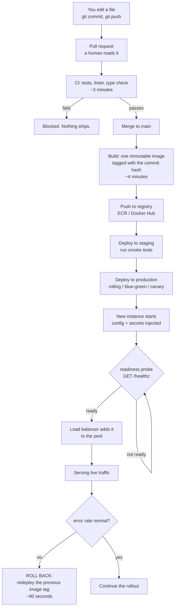

# Day 012 · System Design — How your code becomes a running service

**After today you can:** You can describe the path from a source file to a process serving live traffic.

**The interviewer asks it as:** *How does the code you wrote end up running on a server?*

---

## 1. What this is, and why they ask it

There is a chain between the file you edited and the process answering a stranger's request,
and it has about eight links: version control, automated checks, a build that produces one
fixed artefact, a place to store that artefact, a deployment that starts it somewhere, a
health check that decides whether it is ready, a load balancer that starts sending it traffic,
and a way to undo all of it in under a minute.

Every link exists because something went wrong without it.

Interviewers ask because it is the question that separates people who have shipped from people
who have only built. It comes up in almost every system design round as a closing topic, and
in every interview for anything above junior. The specific things they are listening for are
**reproducibility** ("it works on my machine" is a failure, not a joke), **health checks**
(traffic must not arrive before the process is ready), **rollback** (the recovery plan is
worth more than the deployment plan), and **database migrations** (the part that cannot be
rolled back, and therefore the part that needs thought).

---

## 2. The story

Farhana has been making cakes at home in Thrissur for six years, mostly for family functions
and the occasional order from a neighbour. In January the bakery near the junction asked
whether she would supply them a plum cake, because a customer had had one at a wedding and
asked where it came from.

She said yes, and then found that the arrangement was not what she expected at all.

The first problem was that her cakes were not the same twice. She knew this and had never
minded. Her oven runs hot on the left, she judges the sugar by eye, and a cake in December is
slightly different from a cake in June. That is fine for a family function. The bakery could
not have it, because a customer who liked Tuesday's cake will be back on Friday and will not
accept an explanation.

So the shop's supervisor did something that annoyed her for about a week and that she now
thinks was obviously right. He gave her a tin of one exact size, a set of weights, a method
written out step by step, and the use of the bakery's own oven at a fixed temperature. Nothing
was left to judgement. Every batch after that came out the same, and the reason was that
nothing about her kitchen was involved any more.

The second thing is that a batch does not go on the shelf because she says it is good. It goes
to a man at the back who cuts a slice from one cake in every tray and tastes it. He has sent
back three batches in eight months. The third one she was sure was fine, and he was right and
she was wrong.

The third thing surprised her most. On the first day, they did not put out sixty cakes. They
put out six, on one shelf, and watched what happened for a day. If nobody had bought them, or
if two people had complained, they would have stopped there and it would have cost the shop
almost nothing.

And on a Thursday in April a batch came out wrong — too dry, and she still does not know
exactly why. Somebody noticed at about eleven. By twenty past, every one of those cakes was
off the shelf and the previous week's recipe was back out, because the shop keeps the previous
batch's tins and method for exactly this reason. They lost a morning. They did not lose the
customer.

The shop opens at seven every day whether or not anything sold yesterday, and somebody has to
be there at half past six to put things out. Farhana had not thought about that part at all
before January.

---

## 3. The idea in plain English

Farhana's arrangement with the bakery is a deployment pipeline. Every step maps directly.

### The chain, link by link

**1. Version control.** Your code lives in **git**, on a branch. A change becomes a **pull
request**, which is where another person reads it before it can go anywhere. This is the
written-out method: the recipe is written down, not in somebody's head, and there is a record
of every change to it.

**2. Continuous integration.** When you open the pull request, a machine automatically runs
the tests, the linter and the type checker. That is the man at the back tasting a slice from
every tray. **CI** stands for continuous integration, and its whole job is to say no before a
human has to.

**3. The build, which produces one fixed artefact.** This is the tin, the weights and the
bakery's oven. The output is one immutable **artefact** — most commonly a **container image**
— containing your code, its dependencies, and the exact runtime version, built the same way
every time.

**This is the answer to "it works on my machine".** Nothing about your machine is involved. The
same image runs on your laptop, in staging and in production, and if it behaves differently in
one of them, the difference is configuration or data, not environment.

**4. A registry.** The artefact is pushed to a store — **Docker Hub**, **Amazon ECR**, **Google
Artifact Registry** — and tagged, usually with the git commit hash. The tag matters: it means
any running process can be traced back to the exact line of code inside it.

**5. Configuration, injected at run time.** The image is the same everywhere; what differs is
the database address, the API keys, the feature flags. Those arrive as **environment
variables** or mounted files, never baked into the image. Secrets come from a proper store —
**AWS Secrets Manager**, **HashiCorp Vault**, **Kubernetes Secrets**.

The rule underneath this is from the **Twelve-Factor App**, a widely used checklist:
**strict separation of config from code**. If you have to rebuild to point at a different
database, you have built the wrong thing.

**6. Deployment.** Something starts the artefact on real machines. That something is an
**orchestrator** — **Kubernetes**, **AWS ECS**, **Nomad** — or, on a smaller system,
**systemd** on a virtual machine. It decides how many copies run, on which machines, and
restarts them when they die.

**7. Health checks, then traffic.** This is the link people forget. A newly started process is
not immediately able to serve — it has to connect to the database, warm its connection pool,
maybe load a model into memory. So it exposes a **readiness** endpoint, usually `/healthz`, and
**the load balancer sends it no traffic until that endpoint says yes**.

There is a second one, **liveness**, which asks a different question: not "are you ready?" but
"are you still alive?". If liveness fails, the orchestrator kills and restarts the process.

**8. Rolling out gradually, and rolling back fast.** Six cakes, not sixty.

- **Rolling deployment**: replace instances a few at a time, so old and new run side by side.
- **Blue-green**: run the whole new version alongside the old, then switch traffic in one
  move. Rollback is switching back.
- **Canary**: send 1% of traffic to the new version, watch the error rate, then 10%, then
  100%.

And the part that matters more than any of them: **the old artefact is still in the registry**.
Rolling back is starting the previous image, which takes a minute or two, not rebuilding or
reverting code under pressure. The bakery kept last week's tins.

### The link that cannot be rolled back

Everything above is reversible because artefacts are immutable and the old one still exists.

**Database migrations are not.** If your deployment adds a column, dropping the new version
does not remove the column. If it *renames* a column, the old code no longer works at all, so
you cannot roll back even though you thought you could.

The standard discipline is **backwards-compatible migrations in two phases**:

- To add a column: deploy the migration first, then the code that uses it.
- To remove one: deploy code that stops using it, wait until you are confident, then drop it
  in a later release.
- To rename one: never rename. Add the new, write to both, backfill, move reads over, then
  drop the old — four deployments.

Being able to say this is one of the strongest signals available in this whole question,
because it is knowledge that only comes from having been on the wrong side of it.

### The shop opens at seven

A service is not a program you run. It is a process that must be running **continuously**, be
restarted when it dies, be started when the machine reboots, and be replaced without a gap in
service. That is what an orchestrator or `systemd` is for, and it is the difference between
"my code ran" and "my code is a service".

---

## 4. The picture

The chain, end to end:



**What to notice:** there are three places where the pipeline can say no — CI, the readiness
probe, and the error-rate check after traffic arrives — and each one catches problems the
earlier ones cannot. And the rollback arrow does not go back to the code. It goes to an
artefact that already exists.

What is inside the artefact, and what is not:

```
   +---------------------- THE IMAGE (identical everywhere) --------------+
   |  your application code                                              |
   |  every dependency, at an exact version                              |
   |  the language runtime (python:3.12-slim)                            |
   |  the OS libraries it needs                                          |
   +---------------------------------------------------------------------+
                                  +
   +------------------ INJECTED AT RUN TIME (differs per environment) ---+
   |  DATABASE_URL=postgres://prod-db:5432/app                           |
   |  REDIS_URL=redis://prod-cache:6379                                  |
   |  API_KEY=<from the secrets manager, never in the image>             |
   |  LOG_LEVEL=info                                                     |
   +---------------------------------------------------------------------+

   same image in dev, staging and production. Only the box below changes.
```

**What to notice:** the top box is built once and never modified. If a secret were in it,
everyone with access to the registry would have that secret, and rotating it would require a
rebuild.

And what a rolling deployment actually looks like, over about two minutes:

```
   t=0    [v1] [v1] [v1] [v1]        4 instances, all old
   t=20   [v1] [v1] [v1] [--]        one taken out of the pool, drained
   t=40   [v1] [v1] [v1] [v2]        new one started, readiness probe passing
   t=60   [v1] [v1] [v2] [v2]
   t=90   [v1] [v2] [v2] [v2]
   t=120  [v2] [v2] [v2] [v2]        done, zero downtime

   during t=40 to t=120, BOTH versions are live at once.
   -> the new code must tolerate old data, and the old code must tolerate new data.
```

**What to notice:** the overlap in the middle. For most of a rolling deployment two versions of
your code are serving simultaneously, which is precisely why migrations must be
backwards-compatible. This picture is the argument, and it is worth drawing in an interview.

---

## 5. How it actually works

### The build, concretely

A `Dockerfile` describes the image. A realistic one is a **multi-stage build** — one stage to
compile or install, a second that copies only the result into a small runtime image:

```
FROM python:3.12-slim AS build
COPY requirements.txt .
RUN pip install --prefix=/install -r requirements.txt

FROM python:3.12-slim
COPY --from=build /install /usr/local
COPY . /app
CMD ["uvicorn", "app:api", "--host", "0.0.0.0", "--port", "8000"]
```

Why this matters practically: build tools do not end up in the running image, so it is smaller
(faster to pull) and has less in it to be vulnerable. A naive image is often 1.2 GB and a
multi-stage one 200 MB, which at fifty instances is real deployment time.

**Layer caching** is the other reason for the ordering. Docker caches each step, so copying
`requirements.txt` and installing *before* copying your source means a code change does not
re-run the install. That is often the difference between a 30-second build and a 4-minute one.

### Who runs the pipeline

**GitHub Actions**, **GitLab CI**, **CircleCI** and **Jenkins** all do the same thing: watch
the repository, run a defined sequence on each push, and refuse to merge if it fails. A typical
sequence is lint → type check → unit tests → build image → push to registry → deploy to
staging → smoke test → deploy to production, often with a manual approval before the last step.

### Who keeps it running

**Kubernetes** is the common answer at scale. You declare a desired state — "5 replicas of
image `app:a3f8b1`, each needing 512 MB, with this readiness probe" — and a control loop
continuously makes reality match. If a machine dies, the replicas are rescheduled elsewhere
without anyone being paged.

**AWS ECS** and **Google Cloud Run** do the same with less to configure. **systemd** does it
for a single machine, and is perfectly adequate for a great many real services — a unit file
with `Restart=always` covers most of what a small system needs.

The mechanism underneath is all from
[day 011](../day-011-insert-and-delete/README.md): containers are ordinary processes with
namespaces, cgroups and their own root filesystem, sharing the host kernel.

### Readiness and liveness, precisely

```
GET /healthz/ready   -> 200 if the database connection works and caches are warm
GET /healthz/live    -> 200 if the process is not deadlocked
```

They must be different endpoints, and confusing them causes a specific outage: if your
readiness check fails during a database blip and you have wired it to liveness, the
orchestrator kills every instance at once. The database recovers and there is nothing left
running.

The **draining** step matters just as much. Before stopping an instance, the load balancer
stops sending it new requests and waits for in-flight ones to finish — usually 15–30 seconds.
Skipping it means every deployment returns errors to whoever was mid-request.

### Observability, which is how you know it worked

A deployment is not finished when the pipeline goes green. It is finished when you have
watched the numbers:

- **Metrics** — request rate, error rate, latency percentiles. **Prometheus** and **Grafana**,
  or **Datadog**.
- **Logs** — structured, shipped somewhere central, since the container's own filesystem is
  gone when it restarts.
- **Traces** — **OpenTelemetry**, following one request across services.

The four to watch during a rollout are the **golden signals**: latency, traffic, errors,
saturation. Automated canary analysis is exactly this comparison — the new version's error
rate against the old one's — done by a machine.

### Where it goes wrong

**Configuration drift**: staging and production differ in some way nobody wrote down, so the
thing that passed staging fails in production. This is what infrastructure-as-code
(**Terraform**) exists to prevent.

**A migration that ran and cannot be undone**, discussed above. The most common serious
deployment incident there is.

**No draining**: every deploy shows up as a spike of 502s.

**Rollback that was never tested.** A rollback path you have not exercised is a hope. The teams
who recover fastest are the ones who roll back routinely and undramatically.

---

## 6. The numbers

**How long each link takes, in a healthy pipeline:**

```
git push                                    :    2 s
CI: lint, type check, unit tests            :  180 s
docker build (with layer cache)             :   45 s
docker build (cold, no cache)               :  240 s
push image to registry                      :   30 s
deploy to staging + smoke tests             :   90 s
deploy to production (rolling, 4 replicas)  :  120 s
                                              -------
commit to production                        :  467 s = about 8 minutes
```

**Eight minutes** is a good number for a small service. An hour is common and is a problem in
itself: long pipelines mean batched changes, and batched changes mean that when something
breaks you have twenty commits to search rather than one.

**Rollback, which is the number that actually matters:**

```
detect the problem (alert fires)            :   60 s
decide to roll back                         :   30 s
redeploy the previous image tag             :   90 s
                                              -------
total time to recovery                      :  180 s = 3 minutes
```

Compare that with fixing forward:

```
find the bug, write a fix                   :  900 s
CI + build + deploy                         :  467 s
                                              -------
                                            : 1,367 s = 23 minutes
```

**Three minutes against twenty-three.** That ratio is the entire argument for keeping the
previous artefact and for practising the rollback. **Roll back first, diagnose afterwards.**

**Canary arithmetic — what 1% actually protects you from.** A service doing 10,000 requests
per second, and the new version fails 5% of requests:

```
full deploy   : 10,000 x 0.05                = 500 failed requests per second
canary at 1%  : 10,000 x 0.01 x 0.05         =   5 failed requests per second
```

And how long until you have enough data to be confident, at a canary that receives 100
requests per second with a 5% failure rate:

```
100 x 0.05 = 5 failures per second
-> a 5% regression is unmistakable within ~10 seconds
```

**A hundredfold reduction in damage, and detection in ten seconds.** But note the limit: a
regression affecting 0.01% of requests produces 0.01 failures per second at 1% traffic, so you
would need hours to see it. **Canaries catch big regressions quickly and small ones not at
all**, and knowing that boundary is what makes the answer credible.

**Image size and how it affects deployment:**

```
naive image, 1.2 GB, 50 instances, 1 Gbps pull : 1.2 GB x 8 / 1 Gbps = 9.6 s each
multi-stage image, 200 MB                      : 1.6 s each
```

With layer sharing, only the changed layers move — often a few megabytes. Which is why the
`Dockerfile` ordering above matters more than it looks.

**Deployment frequency, as an industry benchmark.** The DORA research programme's four metrics
separate high and low performers starkly:

```
                         elite            low
deployment frequency     on demand        monthly
lead time to production  under 1 hour     1-6 months
change failure rate      0-15%            46-60%
time to restore          under 1 hour     1 week to 1 month
```

The counter-intuitive finding, and the one worth quoting: **teams that deploy more often have
lower failure rates**, not higher. Small, frequent changes are easier to verify and easier to
undo than large, rare ones.

---

## 7. The trade-offs

**Containers buy reproducibility and charge you a build step.** The same image everywhere kills
an entire class of environment bugs and makes rollback trivial, because the previous artefact
still exists byte for byte. The cost is a build stage, a registry to run and pay for, image
sizes to manage, and a genuine amount of orchestration knowledge before the first deployment.
For a single small service, a virtual machine and `systemd` remains a defensible answer, and
saying so is a sign of judgement rather than ignorance.

**Kubernetes buys automation and charges you complexity.** Self-healing, autoscaling, rolling
updates, service discovery, all declarative. It also has a large surface area, needs someone
who understands it, and can turn a simple service into an infrastructure project. The honest
rule: below roughly five services, a managed platform such as ECS, Cloud Run or Fly is usually
the better engineering. Kubernetes earns its keep on fleets, not on one application.

**Blue-green versus rolling versus canary.** Blue-green gives instant, complete rollback and
requires double the capacity during the switch. Rolling needs no extra capacity and means both
versions serve simultaneously, which forces backwards compatibility on you. Canary limits blast
radius best and needs enough traffic for a small percentage to be statistically meaningful —
at 10 requests per second, a 1% canary sees one request every ten seconds and tells you
nothing.

**Fast pipelines versus thorough ones.** Every check added to CI makes the pipeline slower,
and a pipeline slow enough to be annoying gets bypassed — someone adds a "skip tests" flag for
emergencies and then it is used routinely. The usual resolution is tiered: fast unit tests on
every push, slower integration tests before merge, the full suite nightly. Optimising for the
fast path is legitimate, and pretending the trade-off does not exist is not.

**Automated rollback versus a human decision.** Automating rollback on an error-rate threshold
gives you three-minute recovery at three in the morning with nobody awake. It also means a
transient spike from something unrelated — a dependency having a bad minute — can roll back a
perfectly good deployment, and if the threshold is badly set it can flap. Most teams start with
automated alerting and a human trigger, and automate the trigger once they trust the signal.

**I would not do any of this if...** it is a one-off script, an internal tool with three users,
or a genuine prototype. A cron job on a virtual machine is a legitimate answer for a legitimate
class of problem, and building a pipeline for it is a way of avoiding the actual work. The
pipeline is justified by having users who notice when it breaks.

---

## 8. In the interview

### How it gets asked

- *"How does the code you wrote end up running on a server?"* — the direct version, usually as
  a closing topic.
- *"Walk me through your deployment process."* — the same question about your actual
  experience. Talk about what you did, including what went wrong.
- *"How do you deploy without downtime?"* — the specific version. Health checks, draining and
  rolling updates are the answer.
- *"Something's broken in production. What do you do?"* — the rollback question, and the right
  first answer is "roll back, then diagnose".

### What to say out loud, in the first ninety seconds

1. **Give the chain.** *"Commit and push, CI runs tests, merge, build an immutable image
   tagged with the commit hash, push it to a registry, deploy, health check, then the load
   balancer starts sending traffic."*
2. **Say why the artefact is immutable.** *"The image contains the code, the dependencies and
   the runtime, built the same way every time. Nothing about my laptop is involved — that's
   what kills 'works on my machine'."*
3. **Separate config from code.** *"Config and secrets are injected at run time as environment
   variables, so the same image runs in staging and production. If I had to rebuild to point
   at a different database, I'd have built it wrong."*
4. **Name the health check.** *"A new instance doesn't get traffic until its readiness probe
   passes — it has to connect to the database and warm up first. And I'd keep readiness and
   liveness separate, because wiring a database blip to liveness kills every instance at once."*
5. **Land the rollback.** *"The old image is still in the registry, so rolling back is
   redeploying the previous tag — about ninety seconds, against maybe twenty minutes to fix
   forward. So the rule is roll back first, diagnose afterwards."*
6. **Volunteer the migration caveat.** *"The one thing that doesn't roll back is a database
   migration. During a rolling deploy both versions are live at once, so migrations have to be
   backwards-compatible — add a column in one release, use it in the next, and never rename in
   a single step."*

Step 6 is the one that marks you out. It is the part you only know if you have been burned.

### The follow-ups

**"How do you deploy with zero downtime?"**
Three things together. A rolling update, so instances are replaced a few at a time and there
is always capacity serving. A readiness probe, so a new instance receives no traffic until it
can actually handle it. And connection draining on the way out — the load balancer stops
sending new requests to an instance and waits fifteen to thirty seconds for in-flight ones to
finish before it is stopped. Miss the draining and every deployment shows up as a burst of
502s to whoever was mid-request. The consequence of all three is that both versions run
simultaneously for a minute or two, so the code has to tolerate that.

**"Something's wrong in production right after a deploy. What do you do?"**
Roll back first, diagnose second. The previous image is still in the registry, so redeploying
the old tag is about ninety seconds; finding and fixing the bug is twenty minutes at best,
under pressure, with users affected the whole time. Once the system is stable I can investigate
calmly using the logs and traces from the bad window. The one thing I'd check before rolling
back is whether the deployment included a database migration — if it did, the old code may not
work against the new schema, and then rolling back makes things worse rather than better. That
is exactly why migrations are kept backwards-compatible.

**"How do you handle database migrations?"**
Backwards-compatible, always, and separated from the code that uses them. Adding a column: run
the migration first, deploy the code that uses it after. Removing one: deploy code that stops
using it, verify, then drop it in a later release. Renaming: never in one step — add the new
column, write to both, backfill, move reads across, then drop the old, which is four
deployments. The reason is that during a rolling deploy both versions are live at once, so any
migration that breaks the old version breaks production for the duration of the rollout and
takes rollback away from you.

**"What's in the image and what isn't?"**
In: the application code, every dependency pinned to an exact version, the language runtime,
and the OS libraries it needs. Not in: anything environment-specific, and above all no
secrets. Configuration and credentials come from environment variables or a secrets manager at
run time. Two reasons — the same image has to run in every environment, and a secret baked
into an image is visible to everyone with registry access and cannot be rotated without a
rebuild. I'd also use a multi-stage build so build tools don't ship into the runtime image;
that is typically the difference between 1.2 GB and 200 MB, which matters when fifty instances
are pulling it.

### A model answer

> "It goes through about eight steps, and each one exists because something went wrong without
> it.
>
> I commit and push to a branch and open a pull request. CI runs automatically — linting, type
> checks, unit tests — and a person reviews the change. Neither of those is optional; if CI
> fails, it can't merge.
>
> On merge to main, the pipeline builds an artefact. In practice that's a container image
> containing my code, every dependency pinned, and the language runtime, tagged with the git
> commit hash. That immutability is the important part: the image is built once and runs
> identically in staging and production, so 'works on my machine' stops being a possible
> explanation. And the tag means any running process traces back to an exact commit.
>
> It's pushed to a registry — ECR or similar — and then deployed. What's *not* in the image is
> configuration: the database URL, API keys, feature flags. Those are injected at run time as
> environment variables, with secrets from a secrets manager. If I had to rebuild the image to
> point at a different database, the separation is wrong.
>
> The orchestrator — Kubernetes, or ECS, or just systemd on a smaller system — starts the new
> version. This is where the step people skip comes in: the instance doesn't receive traffic
> immediately. It exposes a readiness endpoint, and the load balancer only adds it to the pool
> once that returns 200, after it has connected to the database and warmed up. I'd keep that
> separate from the liveness probe, because if a database blip fails liveness, the orchestrator
> restarts every instance at once and now you have nothing running.
>
> The rollout itself is usually rolling — replace a few instances at a time so there's always
> capacity — with connection draining on the way out so in-flight requests finish. For a risky
> change I'd canary instead: 1% of traffic, watch the error rate, then 10%, then everything.
> At 10,000 requests a second, a 1% canary turns 500 failures a second into 5, and a 5%
> regression is obvious within ten seconds.
>
> The thing I'd emphasise most is rollback. The previous image is still in the registry, so
> rolling back is redeploying the old tag — about ninety seconds, against twenty minutes to
> fix forward. So the operational rule is: roll back first, diagnose after.
>
> The exception, and the thing I'd raise unprompted, is database migrations. Those don't roll
> back. And because a rolling deployment has both versions live at once, migrations have to be
> backwards-compatible — add a column in one release and use it in the next, never rename in a
> single step. Getting that wrong is how a routine deploy becomes an incident you can't undo."

---

## 9. Recall card

1. **The chain:** commit → CI → merge → build an **immutable artefact** tagged with the commit
   hash → registry → deploy → **readiness probe** → load balancer sends traffic.
2. **Config is not code.** The same image runs everywhere; the database URL and secrets are
   injected at run time. Never bake a secret into an image.
3. **Readiness and liveness are different questions.** Ready = send me traffic. Live = I am not
   deadlocked. Wiring a database blip to liveness kills the whole fleet.
4. **Roll back first, diagnose after.** The old image still exists, so recovery is ~90 seconds
   against ~20 minutes to fix forward.
5. **Migrations do not roll back, and both versions are live during a rolling deploy.** Add a
   column in one release, use it in the next. Never rename in one step.
