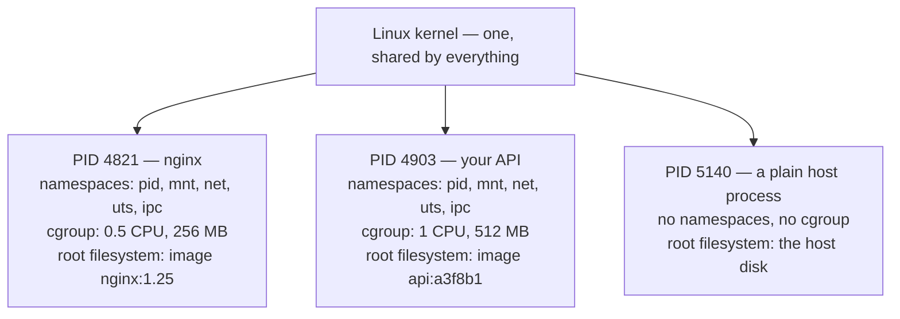

# Day 013 · System Design — Containers and why everyone uses Docker

**After today you can:** You can explain what a container gives you that a virtual machine does not.

**The interviewer asks it as:** *What problem does Docker actually solve?*

---

## 1. What this is, and why they ask it

A **container** is an ordinary process — the same kind of process you met on
[day 008](../day-008-reading-a-problem/README.md) — that has been given a restricted view of
the machine it is running on and a hard limit on what it may consume. It sees its own
filesystem, its own process list and its own network, and it can be told it may use no more
than half a CPU and 512 MB of memory. **It is not a small computer.** There is no second
operating system inside it; it shares the one kernel the host is already running.

That single sentence — *a container is a process, a virtual machine is a computer* — is what
the question is really testing. Interviewers ask it because half of candidates describe a
container as "a lightweight virtual machine", which is a description that gets every follow-up
wrong: it cannot explain why containers start in a tenth of a second, why you cannot run a
Windows container on a Linux host, or why a container escape is a more serious security event
than a virtual machine escape.

[Day 012](../day-012-linear-search/README.md) used images and registries to explain how code
reaches production. Today is what is actually inside them, and why the industry moved.

---

## 2. The story

Devika rents space in a shared kitchen in a lane off Sarjapur Road in Bangalore. Four small
food businesses use it — she makes pickles, a man makes cakes, two brothers make sandwiches
for offices, and a woman makes idli batter and is gone by nine in the morning.

For the first six months it went badly, and the reasons were all small ones. Her mustard oil
kept going down, and nobody had taken it on purpose — somebody had used it once, thinking it
was theirs. The cake man set the big oven to 180 and left it that way, and a batch of her jars
came out wrong. The brothers left their knives in the sink, she washed them, and afterwards
they said the knives had been blunted. One Tuesday she came in and there was no room to put
anything down at all.

The owner fixed it over a weekend, and he did not build four kitchens.

Each business got a numbered steel trolley with a lock, a shelf in the cold room with its own
name painted on it, and its own knives, boards and vessels kept on the trolley. Each one got a
fixed pair of gas rings and a fixed stretch of counter, marked out in tape on the floor. He
also wrote a limit on the wall: nobody uses more than two rings at once, however busy they
are, and nobody leaves anything on the shared counter overnight.

Nothing else changed. It is the same building, the same water, the same electricity, the same
exhaust fan, the same rent split four ways. Nobody has their own front door. But when Devika
comes in at five in the morning, everything she needs is on her trolley exactly as she left
it, in the same places, and whatever the cake man did last night cannot reach her.

Her sister runs a similar business in Pune and pays for a whole small kitchen of her own, with
her own meter and her own gas connection. It is quieter, and nothing of hers is ever touched
by anyone. It also costs her four times as much, and it took two months to get the connections
put in.

---

## 3. The idea in plain English

Devika's trolley is a container. Her sister's separate kitchen is a virtual machine. Every
piece of the arrangement maps onto something real.

### What the container actually is

A container is **one process, started by the kernel like any other**, with three things done
to it at the moment it starts:

| The kitchen | The machine | What it does |
|---|---|---|
| Own trolley, own vessels, own shelf | **Namespaces** | Restrict what the process can *see* |
| Two gas rings, no more | **cgroups** | Restrict what the process can *use* |
| Everything already on the trolley | **The image** | Give it its own filesystem, identical every time |

Underneath all three, **the building is shared**. One kernel, one set of physical CPUs, one
block of memory. That is the whole difference, and it is where every other difference comes
from.

### Namespaces: what it can see

A **namespace** is a kernel feature that gives a process its own private version of one part
of the system. Linux has several, and a container normally gets all of them:

- **PID namespace** — its own process numbering. The application inside sees itself as process
  1 and cannot see anything else running on the machine.
- **Mount namespace** — its own filesystem tree. `/` inside the container is the image's
  contents, not the host's disk.
- **Network namespace** — its own network interfaces, its own IP address, its own port
  numbers. Two containers can both listen on port 8000 without a conflict.
- **UTS namespace** — its own hostname.
- **IPC namespace** — its own shared-memory segments.
- **User namespace** — its own user IDs, so root inside can map to an unprivileged user
  outside.

Devika opening her trolley sees only her own vessels. They are in the same building as
everyone else's, but her view does not include them.

### cgroups: what it can use

A **control group**, universally shortened to **cgroup**, is a kernel feature that caps and
accounts for resources. You give a container `--memory=512m --cpus=0.5` and the kernel enforces
it: at 512 MB the process is killed by the out-of-memory killer, and it never receives more
than half a core's worth of scheduling.

This is the limit written on the wall. Without it, one busy container starves the others on
the same host — the noisy-neighbour problem — and with it, capacity planning becomes
arithmetic instead of hope.

### The image: why it is the same every time

An **image** is a read-only stack of filesystem layers — a base operating system's files, then
your dependencies, then your code. A **container** is a running process started from an image,
with one thin writable layer on top for anything it changes.

The distinction is worth being precise about, because interviewers test it directly:

> **An image is a template. A container is a running instance of it.** One image, twenty
> containers, all identical at the moment they start.

The stack of layers is a **union filesystem** — several directories presented as one merged
tree. When the container reads a file it is served from the topmost layer that has it. When it
writes, the file is first copied up into the writable layer, which is called **copy-on-write**.
Nothing in the image itself ever changes.

That is why fifty containers from the same image share one copy of the base layers on disk and
in memory, and why starting a container does not involve copying hundreds of megabytes.

### A virtual machine, and why it is a different thing

A **virtual machine** is an emulated computer. A **hypervisor** — VMware ESXi, KVM, Xen,
Microsoft Hyper-V — divides the physical machine into virtual ones, and each of those runs its
own complete **guest operating system**: its own kernel, its own init system, its own device
drivers, its own scheduled background jobs.

That guest operating system is Devika's sister's separate gas connection and meter. It is real
isolation — a virtual machine has its own kernel, so a crash or a compromise inside it does not
directly touch the others. It also costs a full operating system's worth of memory, disk and
boot time, per virtual machine, before your application has done anything at all.

| | Container | Virtual machine |
|---|---|---|
| What it is | A process with a restricted view | An emulated computer |
| Kernel | **Shares the host's** | **Its own** |
| Start time | 50–200 ms | 30–60 s |
| Memory before your app runs | a few MB | 512 MB – 1 GB |
| Isolation strength | Good | Stronger |
| Can run a different OS | No | Yes |
| Typical density on one host | hundreds | tens |

### So what does Docker actually solve?

Two problems, and it is worth separating them because they are often muddled.

**1. Packaging.** Before containers, deploying meant "install Python 3.9, then these fourteen
libraries at these versions, then set these environment variables, then copy the code" — a
list of instructions that drifted between the laptop, the test machine and production. An
image is that entire list already carried out, frozen, and shipped as one file. This is the
"works on my machine" problem from [day 012](../day-012-linear-search/README.md), and packaging
is what kills it.

**2. Density and speed.** Because a container is a process rather than a computer, you can put
far more of them on one machine, and start one in the time it takes to blink. That is what
makes autoscaling and per-request billing possible at all.

Docker itself is the tooling — a command line, a build format, a daemon, and Docker Hub. The
container is a Linux kernel feature and existed before Docker did. Docker's contribution was
making it usable, and the format is now standardised by the **OCI** (Open Container Initiative)
so that other tools — **Podman**, **containerd**, **CRI-O** — run the same images.

---

## 4. The picture

The two stacks, side by side. This is the drawing to reproduce in an interview:

```
   VIRTUAL MACHINES                        CONTAINERS

   +------+ +------+ +------+              +------+ +------+ +------+
   | App  | | App  | | App  |              | App  | | App  | | App  |
   | +libs| | +libs| | +libs|              | +libs| | +libs| | +libs|
   +------+ +------+ +------+              +------+ +------+ +------+
   | GUEST| | GUEST| | GUEST|              +--------------------------+
   |  OS  | |  OS  | |  OS  |   <-- 1 GB   |   container runtime      |
   | 1 GB | | 1 GB | | 1 GB |       each   |   (containerd / runc)    |
   +------+ +------+ +------+              +--------------------------+
   +--------------------------+            +--------------------------+
   |       HYPERVISOR         |            |     HOST OS + KERNEL     | <- ONE kernel,
   +--------------------------+            +--------------------------+    shared
   +--------------------------+            +--------------------------+
   |     HOST OS + KERNEL     |            |   PHYSICAL HARDWARE      |
   +--------------------------+            +--------------------------+
   +--------------------------+
   |   PHYSICAL HARDWARE      |
   +--------------------------+

   three guest kernels, booting in ~45 s     one shared kernel, starting in ~0.1 s
```

**What to notice:** the container column has no row for a guest operating system. Everything
that follows — the start time, the memory, the density, and the fact that you cannot run
Windows on a Linux host — is a consequence of that one missing box.

What a running container actually is, from the kernel's point of view:



**What to notice:** all three are entries in the same process table on the same kernel. The
first two are called containers only because of the namespace and cgroup columns. `ps aux` on
the host shows every one of them; `ps aux` inside the first shows one process.

Image layers, and why fifty services do not cost fifty times the disk:

```
   IMAGE api:a3f8b1                        IMAGE worker:c91d02

   +--------------------------------+     +--------------------------------+
   | your code            2 MB      |     | your code            3 MB      |  unique
   +--------------------------------+     +--------------------------------+
   | pip install deps    45 MB      |     | pip install deps    45 MB      |  unique
   +--------------------------------+     +--------------------------------+
   | python:3.12-slim   130 MB      |     | python:3.12-slim   130 MB      |  SHARED
   +--------------------------------+     +--------------------------------+
            |                                        |
            +----------------+-----------------------+
                             v
                  stored ONCE on the host
                  pulled ONCE from the registry

   naive:  177 + 178 = 355 MB        actual on disk: 130 + 47 + 48 = 225 MB
```

**What to notice:** the shared base layer is stored once, transferred once and cached once.
This is also why the `Dockerfile` ordering from [day 012](../day-012-linear-search/README.md)
matters — putting the dependency install above the code copy keeps the expensive layer stable
while the cheap one changes.

---

## 5. How it actually works

### Starting a container, step by step

When you run `docker run --memory=512m --cpus=0.5 api:a3f8b1`, this happens:

1. **The image is fetched** from a registry if it is not already local, layer by layer. Layers
   already on disk are skipped.
2. **The layers are stacked** into one filesystem view using **overlayfs**, the union
   filesystem built into Linux, with an empty writable layer on top.
3. **A new process is created** with `clone()`, passing flags such as `CLONE_NEWPID`,
   `CLONE_NEWNET` and `CLONE_NEWNS` — that is literally how a namespace is made.
4. **A cgroup is created** and the process is placed in it, with `memory.max` set to 512 MB and
   the CPU quota set to half a period.
5. **The root is switched** with `pivot_root` so the process's `/` is the stacked image.
6. **The image's start command is executed.** From here it is an ordinary running program.

Steps 3 to 6 take a few tens of milliseconds. There is no boot, because there is nothing to
boot.

### Who does what

The stack has more parts than people expect, and naming them correctly is a small, cheap
signal:

```
docker CLI  ->  dockerd (daemon)  ->  containerd (manages lifecycle)  ->  runc (creates it)
                                                                          |
                                                                    clone(), cgroups,
                                                                    pivot_root
```

**runc** is the piece that actually talks to the kernel, and it is about as thin as it sounds.
**containerd** keeps track of images and running containers. **Kubernetes** talks to containerd
directly through the CRI (Container Runtime Interface) and does not need Docker at all, which is
why Kubernetes removing Docker support in 2022 changed nothing about the images anyone was
running.

**Podman** does the same job without a daemon, running containers as your own user — which
removes a genuine security concern, because the Docker daemon runs as root and access to its
socket is effectively root on the host.

### Where the data goes

The writable layer of a container **disappears when the container is removed**. That is
deliberate: containers are meant to be disposable, and anything worth keeping must be stored
outside.

- A **volume** is storage managed by the runtime and mounted into the container, surviving
  restarts and replacement.
- A **bind mount** maps a directory from the host into the container — the standard way to get
  live code reloading in development.
- In production, state usually lives somewhere else entirely: a managed **Postgres**, **S3**,
  **Redis**. The container itself stays **stateless**, which is what makes it replaceable.

### Networking, briefly

Each container gets its own network namespace and a virtual interface, connected to a bridge on
the host. `-p 8080:80` sets up a NAT rule forwarding the host's port 8080 to port 80 inside.
Containers on the same user-defined network reach each other by name, because the runtime
provides DNS — so `http://payments:8000` resolves without anyone hard-coding an address.

### Which products are which

- **Build and run**: Docker, Podman, BuildKit, Buildah.
- **Runtimes**: containerd, CRI-O, runc, crun.
- **Registries**: Docker Hub, Amazon ECR, Google Artifact Registry, GitHub Container Registry.
- **Orchestrators**: Kubernetes, AWS ECS, HashiCorp Nomad.
- **Managed, no machines to run**: AWS Fargate, Google Cloud Run, Azure Container Apps, Fly.io.
- **Stronger isolation, container-shaped**: **AWS Firecracker** (the microVM behind Lambda and
  Fargate, booting a stripped-down kernel in about 125 ms), **gVisor** (a user-space kernel that
  intercepts system calls), **Kata Containers** (a real VM wearing a container interface).

That last group exists for one reason, and it is the subject of §7: a shared kernel is a shared
risk.

### The two things that surprise people

**A container image has no kernel in it.** It contains the userland — the files, the libraries,
`/bin/sh` — and nothing else. This is why `ubuntu:22.04` is about 70 MB rather than several
gigabytes, and why a "Ubuntu container" running on a Fedora host is running the Fedora kernel.

**Docker on a Mac or Windows laptop is running a Linux virtual machine.** Containers are a
Linux kernel feature. Docker Desktop quietly runs a small Linux VM and puts your containers
inside it, which is exactly why file access between the host and a container is noticeably
slower there than on a Linux machine.

---

## 6. The numbers

**Start time, which is the number that changes what you can build:**

```
virtual machine, cold boot   : 30-60 s
container start              : 50-200 ms
                             -----------
ratio                        : about 300x
```

Three hundred times is not a tuning improvement, it is a change in what is possible. Scaling
out to meet a traffic spike is useful at 200 ms and useless at 45 s, because the spike is over
before the capacity arrives. Per-request platforms such as Cloud Run and Lambda exist entirely
inside that gap.

**Memory overhead before your code has done anything:**

```
guest OS per virtual machine : 512 MB - 1 GB
container overhead           : ~2-10 MB (namespaces and cgroup bookkeeping)
```

Put that on a real host — 64 GB of RAM, and an application that needs 500 MB:

```
VMs        : 1,024 MB guest OS + 500 MB app = 1,524 MB each
             64,000 / 1,524  = 42 instances

Containers : 8 MB overhead + 500 MB app     =   508 MB each
             64,000 / 508    = 126 instances
```

**Three times the instances on the same machine**, and the difference is entirely operating
systems you did not need. At a cloud price of roughly $300 a month for that host, the effective
cost per instance falls from $7.14 to $2.38.

**Disk, with layer sharing.** Fifty services, all built on `python:3.12-slim` (130 MB), each
adding 45 MB of dependencies and 2 MB of code:

```
if nothing were shared : 50 x 177 MB = 8,850 MB = 8.6 GB
with the base shared   : 130 + (50 x 47) = 2,480 MB = 2.4 GB
                       -----------------------------------
saved                  : 6.2 GB, about 72%
```

**Pull time, which is deployment time.** On a 1 Gbps link:

```
full image, 177 MB, cold : 177 x 8 / 1,000 Mbps = 1.4 s
code layer only,   2 MB  :   2 x 8 / 1,000 Mbps = 0.016 s
```

A code-only change moves 2 MB, not 177. Across fifty instances pulling at once, that is the
difference between 70 seconds and under a second of transfer.

**Density in practice.** A rule of thumb worth carrying: a modern 8-core, 32 GB host runs
roughly **10–20 virtual machines** or **100–200 containers**, assuming small services. Kubernetes
itself defaults to a cap of 110 pods per node, which is a useful number to know if you are ever
asked to size a cluster:

```
a service needing 300 replicas at 110 pods per node -> 3 nodes minimum, 4 for headroom
```

**Image size and the build.** The multi-stage build from
[day 012](../day-012-linear-search/README.md), in numbers:

```
naive single-stage image        : 1.2 GB
multi-stage, slim base          : 200 MB
                                  -------
6x smaller -> 6x faster to pull, and far fewer packages that can turn out to be vulnerable
```

---

## 7. The trade-offs

**A shared kernel is the whole benefit and the whole risk.** Everything good about containers
comes from not having a second kernel. So does the main weakness: a kernel vulnerability is a
path out of the container and onto the host, and from there to every other container on it. A
virtual machine escape has to defeat the hypervisor, which is a much smaller and much more
carefully audited piece of software. This is why AWS runs Lambda and Fargate on **Firecracker
microVMs** rather than plain containers — when the code being run belongs to strangers,
container isolation is not considered enough.

**I would not use plain containers if** I were running untrusted, customer-supplied code on
shared hosts. That is a VM, a microVM, or gVisor.

**You cannot escape the host's kernel.** A Linux container needs a Linux kernel. There is no
such thing as running a Linux container on a Windows kernel, or an ARM image on x86, without a
virtual machine or an emulation layer underneath doing real work. Docker Desktop hides this by
running a Linux VM; `--platform linux/amd64` on an Apple Silicon Mac hides it by emulating,
which is correct and several times slower.

**Containers assume statelessness, and databases are not stateless.** Running Postgres in a
container is entirely possible and is done in development constantly. In production it means
taking on volume management, backup, failover and upgrade sequencing yourself, in an
environment designed around processes being replaceable at any moment. Most teams use a managed
database and containerise only the application, and saying that is a mark of judgement rather
than timidity.

**Root inside a container is closer to root outside than people assume.** By default the process
runs as UID 0, and although capabilities are dropped, a misconfiguration — a bind-mounted
Docker socket, `--privileged`, a mounted host path — turns that into control of the host. The
defences are ordinary and worth naming: run as a non-root user, enable user namespaces, drop
capabilities, use a read-only root filesystem.

**Operational complexity moves rather than disappearing.** You stop debugging environment
differences and start debugging image builds, registry permissions, layer caching, container
networking and orchestrator configuration. For one small service on one machine, a virtual
machine with `systemd` is genuinely simpler and remains a defensible answer. Containers earn
their keep when there are many services, many deployments a day, or elastic traffic.

**Long-lived containers drift back into pets.** The value comes from replacing containers rather
than repairing them. A team that starts running `docker exec` to patch a live container has
recreated the problem containers were bought to solve, and lost the guarantee that the image is
the truth.

---

## 8. In the interview

### How it gets asked

- *"What problem does Docker actually solve?"* — the direct version. Give both problems:
  packaging and density.
- *"What's the difference between a container and a virtual machine?"* — the classic. The
  one-sentence answer is about the shared kernel; everything else follows from it.
- *"How does a container isolate anything if it's just a process?"* — the deeper version.
  Namespaces and cgroups, named.
- *"Would you run your database in a container?"* — the judgement question. The honest answer is
  "in development yes, in production I'd use a managed one, and here is why".

### What to say out loud, in the first ninety seconds

1. **Define it correctly, immediately.** *"A container is a process on the host kernel with a
   restricted view of the system and a cap on what it can use. It is not a small computer — it
   has no operating system of its own."*
2. **Name the three mechanisms.** *"Namespaces control what it can see — its own process list,
   filesystem, network, hostname. cgroups control what it can use — half a CPU, 512 MB. And the
   image gives it its own root filesystem."*
3. **Contrast with a VM in one line.** *"A virtual machine emulates a whole computer and runs its
   own kernel. That's the only real difference, and everything else comes out of it."*
4. **Give the two numbers.** *"A VM boots in about 45 seconds and costs 512 MB to a gigabyte of
   memory before your app starts. A container starts in about 100 milliseconds and costs a few
   megabytes. That's roughly three times the density on the same host, and it's what makes
   autoscaling actually work."*
5. **Say what it solved.** *"Two things. Packaging — the image contains the code, the
   dependencies and the runtime, built once, so 'works on my machine' stops being possible. And
   density — you can put hundreds on a host and start them instantly."*
6. **Volunteer the cost.** *"The trade-off is the shared kernel. A kernel vulnerability is a path
   out of the container, so for untrusted code you want a real boundary — that's why Lambda and
   Fargate run on Firecracker microVMs rather than plain containers."*

Step 6 is the one that separates a memorised answer from an understood one.

### The follow-ups

**"If a container is just a process, what stops it seeing the rest of the machine?"**
Two kernel features. Namespaces give the process a private view of one subsystem each — a PID
namespace so it sees itself as process 1 and nothing else, a mount namespace so its `/` is the
image rather than the host disk, a network namespace so it has its own interfaces and ports, and
so on for hostname, IPC and user IDs. cgroups then limit what it can consume: memory, CPU
shares, block I/O, number of processes. Neither is emulation — the kernel is simply filtering
what this process is allowed to see and use. That is why the isolation costs almost nothing, and
also why it is weaker than a hypervisor's.

**"Why can't I run a Windows container on Linux?"**
Because the image contains no kernel. An image is a userland — files, libraries, binaries — and
the process inside makes system calls to the **host's** kernel. Windows binaries make Windows
system calls, which a Linux kernel does not implement. The same reasoning explains why Docker
Desktop on a Mac is quietly running a Linux virtual machine, and why an ARM image on an x86 host
needs emulation. If someone tells you they run Linux containers on Windows, they are running WSL
2, which is a Linux kernel in a lightweight VM.

**"When would you choose a virtual machine over a container?"**
Four situations. Untrusted or customer-supplied code, where a shared kernel is not an acceptable
boundary — AWS uses Firecracker microVMs for exactly this. A different operating system or a
different kernel version from the host. Compliance regimes that require hardware-level tenant
separation. And workloads that are genuinely a whole machine — a legacy application with its own
init system and its own scheduled jobs. Outside those, the container is usually the better
trade, and there is a middle ground — gVisor, Kata, Firecracker — that gives you a stronger
boundary while keeping the container interface.

**"Would you run your database in a container?"**
In development, always — it makes the environment reproducible in one command. In production I
would default to a managed service. The reason is not that it cannot be done; it is that
everything containers are optimised for is the opposite of what a database needs. Containers
assume the instance is disposable and replaceable; a database is the one thing in the system
that is not. Doing it yourself means owning persistent volumes, backup and restore, failover,
and the ordering of version upgrades, all inside a platform that may reschedule you onto another
machine. If it had to be self-hosted, I would use a StatefulSet with persistent volume claims,
or run it on dedicated instances outside the cluster.

**"What actually makes an image reproducible?"**
The layers are content-addressed — each is identified by the hash of its contents — and the
image is identified by the hash of that stack. Pulling `api@sha256:a3f8b1...` gets you exactly
the same bytes anywhere in the world. That is what makes rollback trivial, because the previous
image still exists byte for byte, and it is why the commit hash rather than `latest` should be
the tag you deploy. Reproducibility of the *build* is a weaker claim: `pip install` at two
different times can resolve different versions, so the build needs pinned dependencies and a
lockfile to genuinely produce the same image twice.

### A model answer

> "Docker solves two separate problems, and it's worth splitting them.
>
> The first is packaging. Before containers, deploying meant a list of instructions — install
> this runtime, then these fourteen libraries at these versions, then set these variables — and
> that list drifted between a laptop, a test machine and production. An image is that whole list
> already carried out and frozen into one artefact: the code, the dependencies pinned, the
> language runtime, the OS libraries. Same bytes everywhere. That's what actually kills 'works
> on my machine'.
>
> The second is density and speed, and that comes from what a container *is*. A container isn't
> a small virtual machine — it's an ordinary process on the host's kernel, with two things done
> to it. Namespaces restrict what it can see: its own process list, its own filesystem, its own
> network interfaces and ports, its own hostname. cgroups restrict what it can use: half a CPU,
> 512 MB of memory, and the kernel enforces both.
>
> A virtual machine, by contrast, is an emulated computer running its own guest kernel on a
> hypervisor. That's the only fundamental difference, and every practical difference follows
> from it. A VM boots in thirty to sixty seconds because there's a kernel to boot; a container
> starts in about a hundred milliseconds because there isn't. A VM costs half a gigabyte to a
> gigabyte of memory before your application starts; a container costs a few megabytes. On a
> 64 GB host running a 500 MB service, that's about 42 VMs against about 126 containers.
>
> Three hundred times faster to start is what makes autoscaling and per-request pricing possible
> at all — a spike is over before a VM finishes booting.
>
> The trade-off I'd raise unprompted is that the shared kernel is both the benefit and the risk.
> A kernel vulnerability is a route out of the container and onto the host, whereas escaping a
> VM means defeating the hypervisor, which is a far smaller attack surface. That's precisely why
> AWS runs Lambda and Fargate on Firecracker microVMs rather than plain containers — when the
> code belongs to strangers, container isolation isn't considered sufficient. And for my own
> workloads I'd still run as a non-root user with dropped capabilities and a read-only root
> filesystem, because 'it's isolated' is doing less work than people assume."

That answer defines the thing correctly, names the mechanisms, contrasts with the VM using one
structural fact rather than a list, supports it with arithmetic, and closes on the limitation.

---

## 9. Recall card

1. **A container is a process, not a computer.** Namespaces limit what it can **see**; cgroups
   limit what it can **use**; the image gives it its own filesystem. No guest kernel.
2. **The shared kernel explains everything** — 100 ms starts against 45 s, a few MB of overhead
   against a gigabyte, hundreds per host against tens, and why a Linux container needs a Linux
   kernel.
3. **Image = template, container = running instance.** Layers are read-only, shared and
   content-addressed; the writable layer on top dies with the container, so state goes in a
   volume or an external store.
4. **Docker solved packaging and density.** The image kills environment drift; the process model
   makes autoscaling possible.
5. **The shared kernel is also the weakness.** Untrusted code gets a real boundary — Firecracker,
   gVisor, or a VM. Run as non-root, drop capabilities, never mount the Docker socket.
