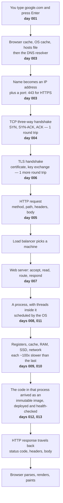

# Day 014 · System Design — Fundamentals revision and interview questions

**After today you can:** You can answer the ten most common fundamentals questions cold.

**The interviewer asks it as:** *Pick any topic from days 1 to 13 and answer it with no preparation.*

---

## 1. What this is, and why they ask it

Days 1 to 13 covered the whole path a request takes: a name becoming a machine, a connection
being opened, bytes arriving at a process, that process being scheduled by an operating system
on real hardware, and the code inside it having got there through a build and a deployment.
Today converts that from something you have read into something you can say.

This is not a summary. It is a **drill**, because the gap between understanding a thing and
producing it out loud under mild stress is much wider than anyone expects, and interviews only
ever test the second one.

Interviewers ask fundamentals questions in three places. As a warm-up in the first five minutes
of a system design round, to calibrate you. As the entire content of some phone screens,
particularly at infrastructure-heavy companies. And as a probe in the middle of a design
question, when you say "the load balancer forwards it" and they ask *"forwards it how,
exactly?"*. The tell they are listening for is whether your answer has **mechanism** in it or
only vocabulary.

---

## 2. The story

Sushma has been making sambar every Sunday for thirty-one years, in the same kitchen in Mysore,
and she is good at it. Her daughter Anitha moved to Pune in March for a job, and in June she
phones on a Saturday evening and asks how to make it.

Sushma opens her mouth to answer and finds that she cannot.

She knows it completely. Her hands know when the dal is done by how it looks when she tilts the
vessel. She knows the tamarind is right by the smell at the moment it goes in. She has never
once measured the salt. But her daughter is four hundred miles away asking *how much*, and *in
what order*, and *for how long*, and the answers are not in her mouth. They are in her hands,
and her hands are not on the phone.

She gets through it badly. She forgets the drumstick until Anitha asks what the long green
thing in the photo was. She says "some" turmeric four times. Anitha, who is patient, makes it
anyway, and says it was fine, in the voice people use when it was not.

So Sushma does something on the Wednesday afternoon that her husband finds funny. She stands in
the kitchen with nothing on the stove and nothing in her hands, and she says the whole thing
out loud, from the beginning, to the wall. She gets four steps in and stops, because she cannot
remember whether the tomatoes go before or after the tamarind, and it turns out she has always
just looked at the pan and known.

She does it again on Thursday. This time she gets to the end, but the order is wrong in one
place, and she notices it herself.

Friday, third time, she says the whole thing, in order, with amounts, in about two minutes, and
none of it is in her hands any more. It is in her mouth.

She phones Anitha on Saturday without being asked, and says it again, properly. Anitha says it
came out right this time. Sushma is fairly sure the recipe did not change on Wednesday.

---

## 3. The idea in plain English

Sushma's problem is the one this day exists to fix, and it has a name.

### Recognising is not producing

**Recognition** is what happens when you read a lesson and every sentence makes sense. It feels
exactly like knowing.

**Recall** is producing the same content from nothing, in order, out loud. It is a different and
much harder skill, and it is the only one an interview measures.

Sushma had complete recognition. Standing at her own stove she could not have got a single step
wrong. What she did not have was recall, and no amount of extra cooking would have given it to
her — the only thing that builds recall is **retrieval practice**, which means attempting to
produce the answer before checking it, and being wrong on the way.

That is why this day is a set of questions and not a set of notes.

### The shape every answer takes

Every fundamentals answer that scores well has the same three parts, in the same order:

1. **The one-sentence answer.** Say the thing first. Not context, not history, not "well, it
   depends".
2. **The mechanism.** One layer down. Not "DNS resolves the name" but "the resolver asks the
   root, then the `.com` servers, then Google's own name servers, and caches the result for the
   record's TTL".
3. **The limit or the trade-off.** What it does not do, or what you gave up. This is the part
   that separates a candidate who has read about it from one who has used it.

Ninety seconds, three parts. If you are still going at three minutes you have started
explaining rather than answering, and the interviewer has stopped listening.

### Where the ten questions come from

Days 1 to 13 are not thirteen unrelated topics. They are **one journey**, told in order, and
each day is a place along it:

```
a name  ->  an address  ->  a connection  ->  a request  ->  a process
        ->  an operating system  ->  hardware  ->  and back
```

Being able to see it as one journey is worth more than the thirteen separate answers, because
an interviewer who asks a fundamentals question is usually holding one point on that path and
checking whether you can walk in both directions from it. §4 is the whole journey in one
diagram, and it is the single most valuable thing to be able to reproduce from memory.

### How to use today

For each of the ten questions in §5:

1. Say your answer out loud, all the way to the end, **before** reading the model answer.
2. Then read the model answer and mark the difference — not "did I know it" but "did I *say*
   it".
3. Anything you could not produce goes back on the list for tomorrow, not today. Recalling
   something you failed at yesterday is worth several times recalling something you got right
   ten minutes ago.

Talking to a wall feels ridiculous and works. Sushma's third attempt was the one that stuck.

---

## 4. The picture

Days 1 to 13 as one journey. This is the diagram to be able to draw from memory:



**What to notice:** there are exactly two round trips before a single byte of your request is
sent — one for TCP, one for TLS — and that is where a large part of the time on a first visit
goes. Notice also that days 8 to 13 are all *inside* one box on this path. That is the shape of
the subject: most of the journey is network, and most of the depth is what happens after the
bytes land.

The same journey with the clock running, which is the version to use when someone asks *where
does the time go*:

```
   user in Bangalore, server in Virginia

   DNS lookup (uncached)     |========|                        ~50 ms
   TCP handshake             |        |=========|              ~200 ms  (1 RTT)
   TLS handshake             |                  |=========|    ~200 ms  (1 RTT)
   request + server work     |                             |=====|  ~230 ms
   response transfer         |                                   |==| ~30 ms
                             +-----------------------------------------
   total                                                        ~710 ms

   the same request, connection already open and DNS cached:   ~230 ms
```

**What to notice:** setup costs more than the work. This is why connection reuse, keep-alive,
HTTP/2 multiplexing and a CDN closer to the user are the first things anyone reaches for, and
why "make the server faster" is often the wrong lever.

The layers, so a question at any level can be placed:

```
   +--------------------------------------------------------------+
   |  your code                    day 012 — how it got there       |
   +--------------------------------------------------------------+
   |  runtime + libraries          day 013 — inside the image       |
   +--------------------------------------------------------------+
   |  process and threads          day 008 — the unit of execution  |
   +--------------------------------------------------------------+
   |  operating system + kernel    day 011 — memory, files, sockets |
   +--------------------------------------------------------------+
   |  CPU, RAM, disk               days 009, 010 — the speed gaps   |
   +--------------------------------------------------------------+
```

**What to notice:** every one of those layers is shared by containers and separated by virtual
machines, which is the whole of [day 013](../day-013-reverse-and-rotate/README.md) in one
picture.

---

## 5. How it actually works

Ten questions. Attempt each one out loud before reading on. The model answers are compressed to
their load-bearing parts — the full versions are in the day each one names.

### 1. "What happens when you type google.com and press Enter?"

*[Day 001](../day-001-how-your-code-actually-runs/README.md)*

The single most-asked question in the industry, and it is not a trivia question — it is an
invitation to show how many layers you can name and how you handle being interrupted.

**Answer:** The browser checks its own cache, then the OS cache, then the hosts file, then asks
a DNS resolver, which walks root → `.com` → Google's name servers and returns an IP address.
The browser opens a TCP connection to that address on port 443 — a three-way handshake, one
round trip. Then a TLS handshake: the server presents a certificate, the browser validates the
chain against its trust store, and they agree a symmetric key. Then an HTTP request goes over
that encrypted connection, hits a load balancer, reaches a web server, which routes it to
application code that may talk to a cache and a database. The response comes back with a status
code and headers, and the browser parses the HTML, requests the CSS, JavaScript and images it
references, builds the DOM and the render tree, and paints.

**The trick:** say the whole outline in ninety seconds first, then let them choose where to go
deep. Do not start deep. Candidates who begin with the DNS packet format never reach the
renderer.

### 2. "What is the difference between a client and a server?"

*[Day 002](../day-002-counting-steps/README.md)*

**Answer:** It is a role in a conversation, not a type of machine. The client initiates the
request; the server is listening and responds. The same machine can be both — a web server is a
client of its own database. The important consequence is what lives where: anything the client
holds is visible to and modifiable by the user, so validation, authorisation and secrets belong
on the server. The client is for interface and for making the round trip feel shorter than it
is.

**The follow-up that comes:** *"So can I trust anything the client sends?"* No. Client-side
validation is a courtesy to the user; server-side validation is the actual rule.

### 3. "How does the browser find the server for google.com?"

*[Day 003](../day-003-big-o-in-plain-english/README.md)*

**Answer:** DNS turns a name into an address. The resolver checks its cache, then asks a root
server which names servers own `.com`, then asks those which own `google.com`, then asks Google's
own name servers for the A record. It caches the answer for the TTL on the record. The address
alone is not enough to talk to a program — the **port** picks which listening process on that
machine gets the bytes. 80 for HTTP, 443 for HTTPS, 22 for SSH, 5432 for Postgres, 6379 for
Redis.

**The mechanism sentence:** an IP address identifies a machine; a port identifies a process on
it; together they are a socket, and a connection is a pair of sockets.

### 4. "TCP or UDP for a live video call, and why?"

*[Day 004](../day-004-the-growth-curves/README.md)*

**Answer:** UDP. TCP guarantees delivery and ordering by retransmitting anything lost, which
means a dropped packet stalls everything behind it while it is re-sent. In a live call, a frame
that arrives 400 ms late is worthless — you would rather have a moment of blur and stay in sync.
UDP has no retransmission, no ordering and no connection, so late data is simply missing, which
is exactly the right trade for real time. Video calls, live streaming, games and DNS lookups use
UDP; anything where every byte must arrive — a web page, a file, a bank transfer — uses TCP.

**Say this too:** HTTP/3 runs on UDP and rebuilds reliability on top in QUIC, precisely to avoid
TCP's head-of-line blocking.

### 5. "Describe an HTTP request."

*[Day 005](../day-005-python-lists-and-tuples/README.md)*

**Answer:** A method, a path, headers, and optionally a body.

```
POST /api/orders HTTP/1.1
Host: shop.example.com
Content-Type: application/json
Authorization: Bearer eyJhbGciOi...
Content-Length: 58

{"item_id": 4412, "quantity": 2}
```

The method says what kind of operation it is. The path says which resource. Headers carry
metadata about the request — who you are, what format the body is in, what formats you will
accept back. The body carries the data, and only some methods have one. The response has the
same shape with a status line instead of a request line: `HTTP/1.1 201 Created`, headers, body.

**The distinction they are testing:** headers describe, the body carries. Authentication,
content type and caching directives are headers; the actual payload is the body.

### 6. "What does HTTPS protect you from, and what does it not?"

*[Day 006](../day-006-python-strings-dicts-sets/README.md)*

**Answer:** It protects the connection, not the endpoints. In transit you get three things:
**confidentiality** (nobody in between can read it), **integrity** (nobody can alter it without
detection), and **authentication of the server** (the certificate proves you are talking to the
domain you asked for, as far as a certificate authority is willing to vouch).

It does **not** protect you from a malicious site — a phishing page has a perfectly valid
padlock. It does not hide which domain you visited, since DNS and the TLS SNI field leak that.
It does not protect the data once it arrives at the server. And it says nothing about whether
the server stores your data safely.

**The sentence that scores:** "the padlock means the connection is private, not that the other
end is trustworthy".

### 7. "What happens inside the server between the request arriving and the response leaving?"

*[Day 007](../day-007-space-complexity/README.md)*

**Answer:** A loop. The server has a socket bound to a port and is blocked in `accept()`. A
connection arrives, `accept()` returns a new socket for that one conversation, and the server
reads bytes off it until it has a full request. It parses the request line and headers, routes
the path to a handler, runs your code — which usually means waiting on a database or a cache —
builds a response, writes it back, and then either closes the connection or keeps it open for
reuse.

**The part worth adding:** what makes it concurrent. A thread per connection is simple and
costs about 1 MB of stack each. A pool of threads bounds that. An event loop — one thread,
non-blocking sockets, `epoll` — handles tens of thousands of mostly-idle connections in one
process, which is what nginx and Node.js do.

### 8. "What is the difference between a process and a thread?"

*[Day 008](../day-008-reading-a-problem/README.md)*

**Answer:** A process has its own memory; threads inside one process share it. That is the whole
difference, and everything else comes from it. Threads are cheap to create and switch between,
and can pass data by simply referring to the same object — which is exactly why they need locks
and produce race conditions. Processes are isolated, so one crashing does not take the others
with it, and they must communicate through pipes, sockets or shared memory.

**The practical follow-up:** in Python, the GIL means threads do not give you parallel CPU work
— use threads for I/O-bound work and `multiprocessing` for CPU-bound work. Servers commonly use
both: several worker processes, each with a thread pool or an event loop.

### 9. "How much slower is a disk read than a memory read?"

*[Days 009](../day-009-what-an-array-is/README.md) and
[010](../day-010-traversal-patterns/README.md)*

**Answer:** About a thousand times for an SSD, and about a hundred thousand for a spinning
disk. The hierarchy is what matters more than any single number, and each step down is roughly
a hundred times slower than the one above:

```
L1 cache        ~1 ns
RAM           ~100 ns          100x slower than L1
SSD           ~100 us        1,000x slower than RAM
spinning disk  ~10 ms      100,000x slower than RAM
network, same region   ~0.5 ms
network, cross-continent ~150 ms
```

**The thing to do with the numbers:** scale them to human time. If L1 is one second, RAM is
under two minutes, an SSD is a day and a half, a spinning disk is four months, and a
cross-continent round trip is about five years. That is why caching works, and why one extra
network hop can matter more than any amount of code tuning.

### 10. "How does your code end up running on a server, and what is a container?"

*[Days 012](../day-012-linear-search/README.md) and
[013](../day-013-reverse-and-rotate/README.md)*

**Answer:** Commit and push, CI runs the tests, merge, build an **immutable image** tagged with
the commit hash, push it to a registry, deploy it, and the load balancer sends traffic only once
the **readiness probe** passes. Configuration and secrets are injected at run time so the same
image runs everywhere. Rolling back is redeploying the previous tag — about ninety seconds — so
the rule is roll back first and diagnose after. The one thing that does not roll back is a
database migration, which is why migrations must be backwards-compatible.

A **container** is that image running as an ordinary process on the host kernel, with
**namespaces** limiting what it can see and **cgroups** limiting what it can use. It is not a
small computer: no guest kernel, which is why it starts in about 100 ms rather than 45 seconds
and costs a few megabytes rather than a gigabyte.

---

## 6. The numbers

These are the numbers to have without thinking. Interviewers do not expect precision; they
expect the right order of magnitude, produced quickly.

**The latency ladder, and the human-scale version:**

```
   operation                       real time      if L1 were 1 second
   ------------------------------------------------------------------
   L1 cache reference                 1 ns        1 second
   branch mispredict                  3 ns        3 seconds
   L2 cache reference                 4 ns        4 seconds
   mutex lock/unlock                 17 ns        17 seconds
   main memory reference            100 ns        1.7 minutes
   compress 1 KB                  2,000 ns        33 minutes
   send 1 KB over 1 Gbps         10,000 ns        2.8 hours
   SSD random read              150,000 ns        1.7 days
   read 1 MB from memory          250,000 ns      2.9 days
   round trip within a datacentre 500,000 ns      5.8 days
   read 1 MB from SSD           1,000,000 ns      11.6 days
   disk seek                   10,000,000 ns      3.9 months
   read 1 MB from disk         20,000,000 ns      7.7 months
   round trip India <-> USA   150,000,000 ns      4.8 years
```

**The port numbers:**

```
   20, 21  FTP        22  SSH         25  SMTP        53  DNS
   80  HTTP          443  HTTPS      587  SMTP (TLS)
   3306  MySQL      5432  Postgres   6379  Redis     9092  Kafka
   27017  MongoDB    11211  Memcached  9200  Elasticsearch
```

**The status code families:**

```
   1xx  informational      2xx  success        3xx  redirect
   4xx  the client was wrong                   5xx  the server was wrong

   200 OK              201 Created        204 No Content
   301 Moved Permanently                  304 Not Modified
   400 Bad Request     401 Unauthorised   403 Forbidden      404 Not Found
   409 Conflict        429 Too Many Requests
   500 Internal Server Error   502 Bad Gateway   503 Service Unavailable
   504 Gateway Timeout
```

401 means "I do not know who you are"; 403 means "I know exactly who you are and no". That
distinction is asked directly.

**Round trips before your first byte, on a cold connection:**

```
   DNS (uncached)                  1 round trip
   TCP handshake                   1 round trip
   TLS 1.3 handshake               1 round trip   (TLS 1.2 needed 2)
                                  --------------
   before the request is even sent: 3

   at 150 ms per round trip cross-continent: 450 ms of setup
   at   1 ms within a region:                  3 ms
```

This arithmetic is the entire argument for CDNs, connection pooling and keep-alive.

**Sizes worth knowing:**

```
   a typical HTTP request header block     :  500 B - 2 KB
   an average web page, everything         :  2 MB
   a JSON API response                     :  1 - 50 KB
   a UUID                                  :  16 bytes binary, 36 chars as text
   a row in a typical relational table     :  100 B - 1 KB
   a container image, slim base            :  130 MB
   one thread's stack                      :  1 MB (so 1,000 threads = 1 GB)
   a TCP connection's kernel buffers       :  ~10 KB
```

**A worked estimate, the shape of every capacity question:**

```
   50,000,000 daily active users
   x 20 requests each per day
   = 1,000,000,000 requests per day

   1,000,000,000 / 86,400 seconds = 11,574 requests per second average
   x 3 for peak                    = ~35,000 requests per second at peak

   each request touches ~2 KB of response
   35,000 x 2 KB                   = 70 MB/s = 560 Mbps at peak
```

**Storage, the other half of every estimate:**

```
   1,000,000,000 events per day x 500 bytes = 500 GB per day
   x 365                                     = 182 TB per year
   x 3 replicas                              = 546 TB of raw disk per year
```

---

## 7. The trade-offs

Every fundamentals topic has one trade-off sentence. These are the ten to have ready, because
"what would you use instead, and when?" follows almost every fundamentals answer.

**TCP versus UDP.** TCP buys delivery and ordering, and charges you head-of-line blocking and a
handshake. Choose UDP when late data is worthless — live video, games, DNS — and TCP when every
byte matters. *I would not use TCP if* the application would rather drop a frame than wait for
it.

**HTTP/1.1 versus HTTP/2 versus HTTP/3.** HTTP/2 multiplexes many streams over one TCP
connection, which removes application-level head-of-line blocking but not TCP's. HTTP/3 moves to
QUIC over UDP and removes that too, at the cost of being newer and harder to inspect on the
network. *I would not reach for HTTP/3 if* the traffic is server-to-server inside one datacentre,
where packet loss is low and the benefit nearly vanishes.

**HTTPS everywhere.** You buy confidentiality, integrity and server authentication, and you pay
one extra round trip on a cold connection plus certificate management. The cost is small enough
that the answer is now always yes. *I would still not rely on it if* the threat model includes a
compromised endpoint, because it protects the wire and nothing else.

**Threads versus processes versus an event loop.** Threads are cheap and share memory, so they
need locks and produce races. Processes are isolated and expensive, and must serialise to
communicate. An event loop handles enormous numbers of idle connections in one thread and
collapses if any handler blocks. *I would not use an event loop if* the workload is CPU-bound —
one slow computation stalls every connection.

**Synchronous versus asynchronous work.** Doing it in the request is simple and gives the user a
real answer. Pushing it to a queue keeps the request fast and makes the result eventual, which
means status endpoints, retries and duplicate handling. *I would not make it async if* the user
cannot act on the result until it is done.

**Cache or not.** A cache turns a 100 ms database read into a 1 ms memory read, and buys you a
new problem: the cached copy can be wrong. *I would not cache* data where staleness is unsafe —
a balance at the moment of a transfer, an authorisation decision.

**Vertical versus horizontal scaling.** A bigger machine is trivial and has a ceiling and a
single point of failure. More machines have no ceiling and require statelessness, a load
balancer and a distributed-systems conversation. *I would scale vertically first if* the system
is small — it is usually cheaper than the engineering time to make it distributed.

**Containers versus virtual machines.** Containers give 100 ms starts, a few MB of overhead and
hundreds per host, and charge you a shared kernel. VMs give a real isolation boundary and charge
you a gigabyte and 45 seconds each. *I would not use plain containers if* I were running
untrusted customer code — that wants Firecracker, gVisor or a VM.

**SSD versus spinning disk versus memory.** Memory is 1,000× faster than an SSD and does not
survive a restart. SSDs are 100× faster than spinning disks and cost more per terabyte. *I would
still choose spinning disks for* cold archival data where cost per terabyte dominates.

**Rolling versus blue-green versus canary deployment.** Rolling needs no extra capacity and
forces both versions to run at once, so migrations must be backwards-compatible. Blue-green
gives instant rollback and needs double the capacity. Canary limits blast radius best and needs
enough traffic for 1% to be meaningful. *I would not canary* a service doing ten requests a
second — 1% of that tells you nothing.

---

## 8. In the interview

### How it gets asked

- *"Before we start on the design, tell me what happens when you type google.com and press
  Enter."* — the calibration question. Your answer sets the level for the next forty minutes.
- *"You said the load balancer forwards the request. Forwards it how?"* — the mid-design probe.
  They are checking whether the vocabulary has mechanism behind it.
- *"What's the difference between X and Y?"* — TCP/UDP, process/thread, container/VM, 401/403.
  Always answer with the one structural difference first, then derive the consequences.
- *"How much slower is a disk read than a memory read?"* — the estimation question. Order of
  magnitude, quickly, then what it implies.

### What to say out loud, in the first ninety seconds

This is the shape for **any** fundamentals question, and it is worth rehearsing as a shape
rather than as ten separate answers.

1. **Answer in one sentence.** *"A container is a process on the host kernel with a restricted
   view and a resource cap."* No preamble.
2. **Give the mechanism, one layer down.** *"Namespaces limit what it can see — its own process
   list, filesystem, network. cgroups limit what it can use."*
3. **Give a number.** *"It starts in about 100 milliseconds against 45 seconds for a VM, and
   costs a few megabytes against a gigabyte."*
4. **Give the limit or the trade-off, unprompted.** *"The cost is the shared kernel, so for
   untrusted code you want a real boundary."*
5. **Stop.** Then ask: *"Do you want me to go deeper on any of that?"* Handing them the
   steering wheel is a senior move and it stops you talking past the answer.

### The follow-ups

**"You're going too broad — pick one part and go deep."**
This is a compliment and an instruction, and the right response is to pick the part you know
best rather than the part they mentioned last. Say which you are picking and why: *"I'll take
the TLS handshake, since that's where the round trips are."* Then go two layers further than
you did the first time — for TLS that means the certificate chain, the trust store, why TLS 1.3
saves a round trip over 1.2, and what SNI leaks.

**"How do you know that number?"**
Never bluff a number. The honest and strong answer is to derive it or bracket it: *"I don't
remember exactly, but a cross-continent round trip is bounded below by the speed of light —
about 20,000 km round trip at 200,000 km/s in fibre is 100 ms, and in practice it's 150 to 250
with routing. So I'd plan for 200."* An interviewer will take a derived estimate over a
memorised figure every time.

**"That's the happy path. What happens when it fails?"**
Every fundamentals answer has a failure version, and having one ready is what makes the answer
sound lived-in. DNS: the record expires or the resolver is unreachable, so you get a resolution
failure before any connection is attempted. TCP: SYN with no reply, retried with backoff, then a
timeout after tens of seconds — which is why application-level timeouts must be shorter. TLS: an
expired or mismatched certificate, and the browser refuses. HTTP: a 502 means the load balancer
reached no healthy backend; a 504 means it reached one and gave up waiting.

**"Which of these would you actually change first if the page were slow?"**
Measure before choosing, and say so. Then: the setup round trips, because they dominate on a
cold connection — a CDN, keep-alive and connection pooling. Then the number of requests, because
each one costs a round trip. Then the server work itself, and inside that the database queries
before the code, because a missing index is worth more than any amount of loop tuning. Naming
that order shows you know where the time actually is, which is the whole point of
[day 010](../day-010-traversal-patterns/README.md).

### A model answer

The flagship question, answered the way it should be — outline first, depth on request.

> "I'll give the whole path first and then go deeper wherever you want.
>
> The browser needs an IP address for `google.com`, so it checks its own cache, then the OS
> resolver cache, then the hosts file, and if none of those have it, it asks a DNS resolver. The
> resolver walks the hierarchy — a root server tells it which name servers own `.com`, those
> tell it which own `google.com`, and Google's own name servers return the A record. That gets
> cached for the record's TTL, which is why the second visit skips all of it.
>
> Now it has an address, and it needs a port — 443, because this is HTTPS. It opens a TCP
> connection: SYN, SYN-ACK, ACK. That's one full round trip before anything useful happens. Then
> TLS: the server presents its certificate chain, the browser validates it against its trust
> store and checks the name matches, and they agree a symmetric key. TLS 1.3 does that in one
> round trip; 1.2 needed two.
>
> So on a cold connection there are about three round trips before the request is sent. From
> India to a US datacentre at 150 ms each, that's most of half a second of pure setup, which is
> why CDNs and keep-alive matter more than almost anything else.
>
> Then the HTTP request goes over that encrypted connection: method, path, headers, maybe a
> body. It arrives at a load balancer, which picks a healthy backend, and a web server accepts
> the connection, parses the request, and routes it to application code. That code usually
> checks a cache, and goes to a database on a miss. It builds a response — status code, headers,
> body — and writes it back over the same connection, which is then kept open for reuse.
>
> The browser parses the HTML, and as it does, it discovers references to CSS, JavaScript and
> images and requests those too — each of which is another round trip unless they're already
> cached or the connection is multiplexed. It builds the DOM, applies styles, lays out, and
> paints.
>
> Underneath all of that, the server side is a process scheduled by an operating system on real
> hardware, where each step of the memory hierarchy is roughly a hundred times slower than the
> one above it, and the code inside that process got there as an immutable image that was built,
> pushed to a registry, deployed and health-checked before it saw traffic.
>
> Where would you like me to go deeper?"

That answer is complete, ordered, contains three numbers, names the two round trips that
dominate, and ends by handing control back. It takes about ninety seconds to say.

---

## 9. Recall card

1. **Recognising is not producing.** The only thing that builds recall is attempting the answer
   out loud before checking it. Say it to an empty room; being wrong on the way is the point.
2. **Every answer has three parts:** one-sentence answer, then the mechanism one layer down,
   then the limit or trade-off. Ninety seconds, then stop and offer to go deeper.
3. **Days 1–13 are one journey:** name → address → connection → request → process → operating
   system → hardware, and back. Draw it; every fundamentals question is a point on it.
4. **Three round trips before your first byte** on a cold connection — DNS, TCP, TLS. At 150 ms
   each that is most of half a second, and it is why CDNs and keep-alive exist.
5. **Each step down the memory hierarchy is about 100× slower.** L1 1 ns, RAM 100 ns, SSD
   100 µs, disk 10 ms, cross-continent 150 ms. Scale them to human time and the answer to
   "should I cache this?" becomes obvious.
