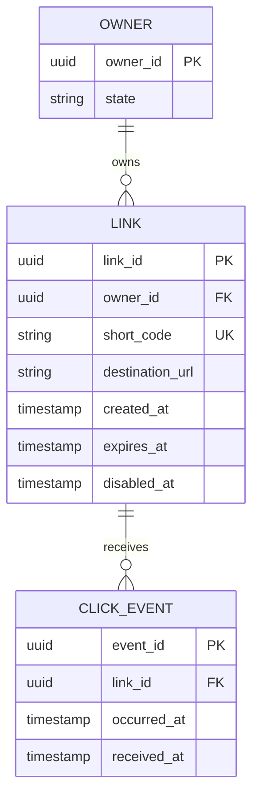

# Reference design — Owners, links, and click events

Author-written answer to the [domain-model assignment](README.md#assignment).
Read before guided practice or compare afterward. [DESIGN.md](DESIGN.md) is your personal memo.

## Assumptions and scope

An authenticated owner can create many short links. A link has exactly one owner, one globally
unique short code, a destination, and optional expiry. Two owners may save the same destination.
Each redirect can generate a click event; repeated delivery of that same event must not create
a second occurrence. Analytics may lag and must not determine whether a redirect succeeds.
These are assumed product decisions. Traffic volume and retention duration are unspecified,
so this answer does not invent a storage-capacity claim.

## Entities, keys, and relationships

Each primary key uniquely identifies one row. owner_id on Link and link_id on ClickEvent are
required references. expires_at and disabled_at may be null; timestamps represent UTC instants.
short_code has a uniqueness constraint because it resolves one public name to one link.
created_at and link_id are immutable and jointly order the owner's listing. destination_url
is not unique. occurred_at describes the click's reported time; received_at describes ingestion,
so delayed arrival need not overwrite occurrence time. Minimize event attributes to what the
product actually needs; no client personal data is required for this exercise.

## Request trace and source of truth

Owner O1 creates L1 with code C1. Owner O2 creates L2 with code C2 for the same destination;
both rows remain distinct. A lookup of C1 resolves L1, then checks disabled state and expiry
against authoritative time before redirecting. Clicks E1 and E2 reference L1. Redelivering E1
retains its event ID and conflicts with the existing key; inserting it as a duplicate is skipped.
A real second click needs E2, even if both timestamps and destinations are equal.

Choose one relational database initially. Owner and Link rows are authoritative for account
ownership and redirection. Append-only events support analytics; a derived click counter is
not the source of truth for event identity. A future asynchronous event pipeline must define
deduplication and retention independently of the redirect lookup.

## Invariants and lifecycle

| Invariant | Enforcement or chosen policy |
| --- | --- |
| A link belongs to a valid owner | Required owner reference; authenticate creates |
| A short code resolves at most one link | Database unique constraint, with bounded collision retries |
| Event delivery duplicates do not become new clicks | Stable producer event_id plus unique event key |
| Disabled links stop redirecting | Check disabled_at on the authoritative read path |
| Expired links stop redirecting | Treat now >= expires_at as expired |
| Disabling a link preserves historical event identity | Retain a link tombstone; do not cascade-delete events |

Owner removal first disables owned links. Physical removal and event erasure require a separate
retention policy, so no broad cascade is assumed. A foreign key protects references within this
database; it does not decide whether the owner is allowed to perform an action.

## Alternative and failure walkthrough

A link row with only click_count is smaller and sufficient for a product needing only rough
totals. It cannot explain individual occurrences, arrival delay, or replay deduplication without
more state. Choose separate events for the stated requirement, accepting storage proportional
to event count and a retention task.

Two workers both check that code C1 is free, then try to create it. A check-then-insert alone
races. The unique constraint admits one insert; the other selects a new generated code and
retries within a bounded allocation attempt. Neither overwrites the first link. For event
ingestion, a redelivered E1 hits its unique key and does not increase the count again. These
are hypothetical database scenarios; the [concept demo](CONCEPTS.md#when-it-breaks) executes
only the separate mistake of using destination as identity.

## Self-review

The model names all three required entities, keys, relationship cardinalities, lifecycle rules,
and a source of truth. It distinguishes link identity, destination equality, real clicks, and
delivery retries. No database schema or load test was executed. Before implementation, settle
retention, destination-edit auditing, and whether durable click recording may delay redirects.
Index choices beyond primary/unique keys should follow measured access patterns.

Source: [PostgreSQL 18 — Constraints](https://www.postgresql.org/docs/18/ddl-constraints.html),
checked 2026-09-22. Lifecycle and analytics choices are assumptions for this reference.
