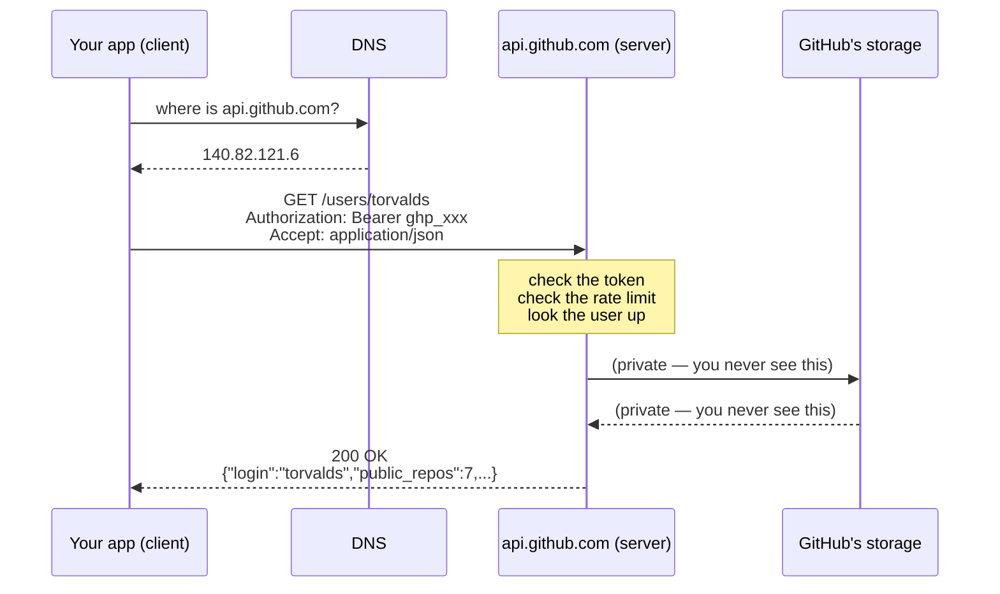
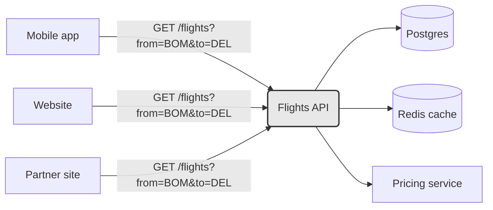

# Day 015 · System Design — What an API is

**After today you can:** You can explain an API to a non-engineer, and then to an engineer.

**The interviewer asks it as:** *What is an API? Give me an example of one you have used.*

---

## 1. What this is, and why they ask it

An **API** — application programming interface — is the published list of things one piece of
software will do for another, together with the exact way to ask for each one and the exact shape
of the answer that comes back. It is a promise about behaviour, not a description of machinery.
The whole point is that the caller gets the promise and never gets the machinery.

Everything you have built up over the last fourteen days meets here. A client talks to a server
([day 002](../day-002-counting-steps/README.md)), it finds it by name
([day 003](../day-003-big-o-in-plain-english/README.md)), it opens a connection
([day 004](../day-004-the-growth-curves/README.md)), and it sends an HTTP request
([day 005](../day-005-python-lists-and-tuples/README.md)). The API is the answer to the question
those four days leave open: *what am I allowed to ask for, and what will I get?*

It gets asked in interviews for two reasons. First as a screening question, usually in the first
ten minutes, to check you can explain a technical idea in plain words — plenty of candidates only
know the phrase "REST API" and fall apart when asked what the word *interface* is doing in there.
Second, and much more importantly, because **every system design answer you will ever give is a
set of boxes talking to each other through APIs**. If you cannot say precisely what one box asks
another for, you cannot design anything. This is the day the vocabulary gets fixed.

The whole of the next ten days builds on it: REST on
[day 016](../day-016-2d-arrays/README.md), designing a good endpoint on
[day 017](../day-017-matrix-tricks/README.md), status codes and idempotency on
[day 018](../day-018-arrays-revision/README.md).

---

## 2. The story

Zoya has to hand in a forty-page report by eleven, and the college printer has been broken since
Monday. There is a small shop in the lane behind the gate that has been there longer than she has,
and at half past nine the shutters are already up.

It is one narrow room. A glass counter runs across it, and everything happens behind that counter
— two big machines, a boy feeding sheets into one of them, stacks of covers, a bin of offcuts. She
has been coming here for two years and she has never once been behind the counter, and it has
never once mattered.

On the wall above the counter there is a board. Black and white, three rupees a sheet. Colour,
fifteen. Both sides, five. Spiral binding, forty. Lamination, twenty. Nine lines in all, and it
has not changed in two years except that the numbers have been painted over twice.

She puts her pen drive on the counter and says the whole thing in one breath: the third file,
forty sheets, black and white, both sides, spiral. The boy repeats it back, says twenty minutes,
and gives her a small plastic token with 14 on it. She goes and drinks tea.

Two things about that exchange. The first is that she can only ask for what is on the board. Last
month she asked him to "make it look a bit nicer" and he just stood there — not because he was
unwilling, but because there is nothing behind the counter called *nicer*. She had to turn it into
things on the board: colour on the first sheet, and lamination.

The second is that in January the shop replaced the big machine with a different one, and Zoya did
not find out for three weeks. She asked for the same nine things in the same words and got the
same stack back. The only day it ever mattered to her was the morning the colour ran out, and he
told her that straight away at the counter instead of taking her money and letting her wait
twenty minutes for nothing.

---

## 3. The idea in plain English

The board on the wall is the API. Not the machines, not the boy, not the shop — the board.

Take it apart line by line.

### The list of things you may ask for

The board has nine lines and you cannot ask for a tenth. An API is likewise a **finite, published
list of operations**. `GET /users/42`. `POST /payments`. `DELETE /files/abc`. If an operation is
not on the list, it does not exist, however reasonable it sounds. "Make it look nicer" is not on
the board, and neither is "give me everything you know about this user, sorted the way I like".

### The exact way to ask

Zoya does not say "some printing please". She says which file, how many sheets, which colour,
which sides, which binding. Every one of those is required, and the boy will ask if she leaves one
out. In an API those are the **parameters** — the values you must supply with a request — and
leaving a required one out gets you an error, not a guess.

### The exact shape of the answer

She gets a stack of forty sheets, spiral bound, and a token numbered 14. She knows before she asks
what form the answer will take. An API says the same: this operation returns a JSON object with
these fields, of these types. **JSON** — JavaScript Object Notation — is the plain-text format
most web APIs use for both request bodies and responses, and you met it on
[day 007](../day-007-space-complexity/README.md); it looks like `{"id": 42, "name": "Zoya"}`.

### The counter, and never going behind it

This is the part people miss, and it is the reason APIs exist at all. Zoya has never been behind
the counter. That is not a restriction on her; it is a freedom for the shop. They replaced the
machine in January and nothing broke, because nothing she said depended on which machine it was.

The technical name for this is **encapsulation**, or hiding the implementation. The API is the
only thing anyone outside depends on, so everything behind it can change: a different language, a
different database, ten servers instead of one. As long as the board says the same nine lines and
they still mean the same nine things, the callers are undisturbed.

The reverse is the expensive half. Once other people are relying on the board, **you cannot
change what a line means without breaking them**. If the shop quietly redefines "spiral, forty" to
exclude the cover it used to include, every regular customer gets a surprise. In software that is
called a **breaking change**, and it is why real APIs carry a version in the address — the `v1` in
`https://api.stripe.com/v1/charges`. A new meaning goes in `v2` and `v1` keeps its promise.

### Failing at the counter, not in the back

The morning the colour ran out, the boy said so at once. He did not take the pen drive, disappear
for twenty minutes, and come back with nothing. A good API does the same: it answers with a clear,
documented failure — an HTTP **status code** like `404 Not Found` or `429 Too Many Requests`,
which you met on [day 005](../day-005-python-lists-and-tuples/README.md) — instead of hanging or
returning something misleading. What an operation does when it fails is part of the promise, not
an afterthought.

### The word is bigger than the web

Most people say "API" and mean a web API reached over HTTP. That is one kind of three, and they
are the same idea at three different distances:

| Kind | You call it | Example | What it costs you |
|---|---|---|---|
| **Library API** | Inside your own process | `list.append(x)`, `heapq.heappush(h, x)` | Nanoseconds. A function call. |
| **Operating system API** | Down into the kernel | `open()`, `read()`, `send()` — the system calls from [day 011](../day-011-insert-and-delete/README.md) | Microseconds. A mode switch. |
| **Web API** | Across a network | `GET https://api.github.com/users/torvalds` | Milliseconds. And it can fail. |

`list.append` is an API. You know exactly what to pass and exactly what happens, and you have no
idea how Python's list grows internally — and on [day 005](../day-005-python-lists-and-tuples/README.md)
you learned that it reallocates, which is precisely the kind of thing an API is allowed to change
without telling you.

The distances in that last column are the whole story of the next few weeks. A library call is
free, a system call is cheap, and a network call is a thousand times more expensive and is allowed
to simply not answer. Look back at the latency ladder from
[day 010](../day-010-traversal-patterns/README.md) if that number does not feel real yet.

---

## 4. The picture

One call to a real API, from the address bar to the answer and back:



**What to notice:** the dotted box in the middle. Everything between the request arriving and the
response leaving is GitHub's business, and it can change tomorrow. The only two things you are
allowed to depend on are the arrow going right — the method, the path, the headers — and the arrow
coming back — the status code and the shape of that JSON. Those two arrows are the API. The rest
is the shop behind the counter.

Now the same picture as a boundary rather than a sequence, because this is the version you will
draw in a design round:



**What to notice:** three different callers, written by three different teams in three different
languages, all say exactly the same sentence. That is what the API bought. And the three boxes on
the right can be replaced one by one without any of the three callers being told.

---

## 5. How it actually works

### The five parts of a web API request

Every HTTP API call is these five things, and nothing else. Take a real one — sending an SMS
through Twilio:

```
POST https://api.twilio.com/2010-04-01/Accounts/AC123/Messages.json
Authorization: Basic QUMxMjM6c2VjcmV0
Content-Type: application/x-www-form-urlencoded

To=%2B919876543210&From=%2B12025550123&Body=Your+OTP+is+4417
```

1. **The method** — `POST`. What kind of operation this is. You met the verbs on
   [day 005](../day-005-python-lists-and-tuples/README.md).
2. **The address** — the host `api.twilio.com` plus the path. The path names the thing you are
   operating on. Note `2010-04-01` sitting in it: that is Twilio's version, frozen since 2010, and
   it is why code written fifteen years ago still runs.
3. **The headers** — who you are (`Authorization`) and what format you are sending
   (`Content-Type`).
4. **The body** — the parameters of this particular request.
5. **The response** — a status code and, usually, a JSON document.

### Authentication: the API key

An API on the public internet needs to know who is calling, both to charge them and to stop
abuse. The usual mechanism is an **API key** or **token** — a long random string the provider
issues to you, which you send in the `Authorization` header on every request. Stripe gives you
`sk_live_51H...`; GitHub gives you `ghp_...`; Google Cloud gives you a key tied to a project.

Two rules that come up in interviews. The key goes in a **header**, not in the address, because
addresses get written into logs and browser history in plain text. And the key never ships inside
a mobile app or a web page, because anyone can extract it — the app calls your own backend, and
your backend holds the key. The full treatment of this is
[day 019](../day-019-what-a-string-is/README.md) and
[day 020](../day-020-building-strings/README.md).

### Rate limits

The provider caps how often you may call. GitHub allows 5,000 requests an hour on an
authenticated token. Exceed it and you get `429 Too Many Requests` plus a header telling you when
the window resets. This is not hostility; it is the only way a shared service survives one badly
written client. How it is built is [day 023](../day-023-palindromes/README.md).

### What the provider actually runs

Behind `api.stripe.com` there is a load balancer, a fleet of application servers, a database, a
cache, and a queue — the shop behind the counter. You will design exactly this arrangement later
in the course. The point for today is that **none of it is in the contract**. Stripe has rewritten
large parts of that machinery repeatedly and `POST /v1/charges` has kept working.

### SDKs are wrappers, not different things

When you `pip install stripe` and write `stripe.Charge.create(amount=2000, currency="inr")`, no
new capability appears. The **SDK** — software development kit, a library the provider publishes
in your language — builds the same HTTP request shown above, sends it, checks the status code, and
turns the JSON into an object. It exists so you do not hand-assemble headers. If the SDK does not
exist for your language, you make the raw call and lose nothing but convenience.

### Real APIs worth being able to name

Interviewers like a concrete example, and a specific one beats "um, weather APIs".

- **Stripe** — `POST /v1/charges` to take a payment. The usual gold standard for API design.
- **GitHub** — `GET /repos/{owner}/{repo}/issues`. Public, free to try, and famously well
  documented.
- **Google Maps Directions** — `GET /maps/api/directions/json?origin=...&destination=...`. Every
  cab app in the world sits on top of this idea.
- **Twilio** — sends the OTP text message you get when you log in to your bank.
- **OpenWeatherMap** — the one behind most weather widgets.
- **Amazon S3** — `PUT /bucket/key` to store a file. An API that is also a storage product.

And the ones you use without noticing: your phone's camera API, the Postgres wire protocol your
database driver speaks, and the system calls your program makes to read a file.

### What happens when it fails

This is the half that separates the two levels of answer, because a network call has failure modes
a function call does not have.

- **The provider says no** — `4xx`. Your fault: bad parameters, missing token, over the rate limit.
  Retrying the identical request will fail identically, so do not retry it.
- **The provider broke** — `5xx`. Their fault. Retrying may work, and you should retry with
  increasing gaps rather than immediately, so that ten thousand clients do not all come back in
  the same millisecond.
- **Nothing comes back at all** — a timeout. This is the nasty one, because you do not know
  whether the operation happened. The request may have been carried out and the response lost. If
  the operation was "charge this card", retrying blindly charges twice. The fix is
  **idempotency** — designing the operation so that doing it twice has the same effect as doing it
  once — which is [day 018](../day-018-arrays-revision/README.md), and it is one of the highest-value
  ideas in this whole phase.

---

## 6. The numbers

Take a weather app with **2 million daily users**, each opening it **6 times a day**. Every open
is one call to your API, which in turn calls a paid provider.

**Requests per day**

```
2,000,000 users × 6 opens = 12,000,000 requests/day
```

**Average requests per second**

```
12,000,000 ÷ 86,400 seconds = 139 requests/second
```

Peak traffic is not the average. A reasonable rule of thumb for a consumer app is 3× the average
at the busiest hour, so size for **420 requests/second**.

**Bandwidth**

A weather response is about 2 KB of JSON.

```
12,000,000 × 2 KB = 24,000,000 KB = 24 GB/day leaving your servers
```

Times thirty, that is **720 GB a month** of egress. At roughly $0.09 per GB on a typical cloud
egress price, about **$65 a month** just to hand the bytes over. Small — but notice that if a
careless developer returns the full 40 KB provider response instead of the 2 KB your app needs,
that becomes $1,300 a month for nothing.

**The provider's rate limit**

Say the upstream weather provider allows 60 calls a minute:

```
60 ÷ 60 = 1 call/second allowed
139 calls/second needed
```

You are over by 139×. This is the arithmetic that forces a cache into the design: weather for one
city does not change in ten minutes, and if 2 million users are spread over 500 cities, then

```
500 cities ÷ 600 seconds = 0.83 upstream calls/second
```

which fits inside the limit with room to spare. The cache turns 139 calls a second into under one.
That is the shape of a good design-round argument: *the numbers forced the component, I did not
just remember that caches exist.*

**Chattiness**

A mobile home screen needs profile, notifications, cart and recommendations. Four calls, each
about 120 ms of round trip on a mobile network:

```
4 × 120 ms = 480 ms, if you make them one after another
```

Made in parallel, it is about 120 ms. Combined into a single endpoint that returns all four, about
150 ms including the extra work on the server. That gap — half a second against a seventh of a
second — is why "how many calls does one screen need?" is a real design question and why GraphQL
on [day 021](../day-021-frequency-maps/README.md) exists at all.

---

## 7. The trade-offs

### What a published API costs you

**You lose the freedom to change your mind.** Before you publish, a function's signature is yours;
after, it belongs to everyone calling it. Stripe still serves request shapes designed in 2011.
Twilio's path still says `2010-04-01`. That is not sloppiness — it is the bill for having had
customers for fifteen years. Every field you expose is a field you may be supporting a decade from
now, which is why good API design is stingy: expose the minimum that does the job.

**You add a network to a problem that might not need one.** A library call is nanoseconds and
cannot half-happen. A call across a network is milliseconds, can time out, can be answered twice,
and forces you to think about retries and idempotency. Splitting two components apart behind an API
is not free, and "we will make it a service" has burned a lot of teams who had one system and now
have two systems plus a network between them.

**Someone else's limits become yours.** A rate limit, a maintenance window and an outage upstream
are all now in your product.

### What you would use instead, and when

- **A shared database instead of an API between two services.** Cheap and fast, and it destroys
  the boundary — the other team's schema change now breaks you, and nobody can tell who reads
  which table. Fine inside one small team, painful across three.
- **A library instead of a service.** If two components ship together and always run together,
  make it a function call. You keep the clean boundary and pay none of the network cost.
- **A message queue instead of a request-response API.** If the caller does not need an answer now
  — sending an email, generating a report — putting the job on a queue like Kafka or RabbitMQ is
  better than holding a connection open. The trade is that you no longer find out immediately
  whether it worked.

### The sentence that separates candidates

> **I would not use a network API if** the two sides are always deployed together and call each
> other millions of times a second. At that rate, milliseconds and partial failure dominate
> everything, and the right boundary is a function call in the same process. An API is for
> crossing a line between teams, deployments or trust domains — not for decorating a line that is
> not really there.

Say something like that in a design round and you sound like someone who has had to maintain one.

---

## 8. In the interview

### How it gets asked

- *"What is an API?"* — the opener, usually in the first ten minutes of a phone screen. They want
  the plain-words version first and the precise version second.
- *"Give me an example of an API you have used."* — the follow-up that catches people out. Have a
  specific one ready with a specific path.
- *"Explain an API to someone non-technical."* — increasingly common, because product companies
  care whether you can talk to product managers.
- *"Why would you put an API between these two components instead of letting one read the other's
  database?"* — the same question in design-round clothing, and the one worth real marks.

### What to say out loud, in the first ninety seconds

1. **One sentence, plain.** *"An API is the published list of things one piece of software will do
   for another, plus exactly how to ask and exactly what comes back."*
2. **The key word.** *"The word that does the work is interface — the caller gets the promise and
   never gets the implementation."*
3. **Give the concrete example immediately.** *"For example, `GET https://api.github.com/users/torvalds`
   with a token in the Authorization header returns a JSON object with that user's public repo
   count. I never learn anything about GitHub's database, and they can change it whenever they
   like."*
4. **Say why that matters.** *"That is the whole value. Either side can be rewritten as long as
   the contract holds."*
5. **Name the cost, unprompted.** *"The price is that once it is published, you cannot change what
   it means without breaking callers — which is why real APIs carry a version in the path."*
6. **Widen it, briefly.** *"And it is not only web APIs. `list.append` is an API, and so is a
   system call. Same idea at three distances: nanoseconds, microseconds, milliseconds."*
7. **Stop.** This question has a right length, and it is about sixty seconds.

### The follow-ups

**"What makes an API a good one?"**
Four things. It is **predictable** — similar operations look similar, so you can guess the next
endpoint after learning two. It is **small** — it exposes the minimum that does the job, because
every field is a field you support for years. It **fails clearly** — documented status codes, a
machine-readable error body, and never a `200 OK` with the word "error" hidden inside it. And it is
**versioned**, so the promise can evolve without breaking anyone. Stripe is the standard example
of all four. The design details are the next three days of this course.

**"Why an API instead of just sharing the database?"**
Because sharing a database shares your internal structure, and structure is exactly the thing you
want to be free to change. If another team reads my tables, then renaming a column is now their
outage, and I cannot find out who depends on what without asking everybody. An API gives one
narrow, documented surface, so I can rewrite the storage behind it — or split it across three
stores — without anyone noticing. It also gives one place to enforce permissions, validation and
rate limits, instead of trusting every caller to behave. The cost is real: a network hop, a
serialisation step, and failure modes a query does not have. Inside a single small team a shared
database is often the right call; across teams it almost never is.

**"You call a payment API, it times out, and you never learn whether the payment went through.
What do you do?"**
I do not blindly retry, because a timeout means the request may well have been carried out and
only the response was lost — retrying charges the customer twice. The fix is to make the operation
idempotent: I generate a unique key for the attempt, send it as an idempotency key on the request,
and the provider promises that two requests carrying the same key are executed once and return the
same answer. Then retrying is safe. Stripe does exactly this with an `Idempotency-Key` header. If
the provider offers no such thing, the fallback is to query the provider for the status of that
attempt before retrying, and to record my own intent in my own database before I ever make the
call, so I can reconcile afterwards.

### A model answer

> "An API is the published list of things one piece of software will do for another, together with
> exactly how you ask for each one and exactly what shape the answer takes. The word doing the work
> is *interface* — you get the promise, you never get the machinery.
>
> The example I would give is GitHub's. If I send `GET https://api.github.com/users/torvalds` with
> a token in the Authorization header, I get back `200 OK` and a JSON object with fields like
> `login` and `public_repos`. I know that before I send it, because it is documented. I have no
> idea what database GitHub keeps that in, how many servers answered me, or what language it is
> written in — and that is deliberate on both sides. They are free to change all of it, and my code
> keeps working, as long as the request and the response keep their shape.
>
> The price of that freedom is paid in the other direction: once people are calling it, I cannot
> change what an operation *means* without breaking them. That is why serious APIs carry a version
> in the path — Stripe's `/v1/charges`, Twilio's `/2010-04-01/`. New meaning, new version, and the
> old one keeps its promise.
>
> It is also worth saying that a web API is only the most visible kind. `list.append` in Python is
> an API, and so is a system call like `read()`. Same idea at three distances — a function call is
> nanoseconds, a system call is microseconds, a network call is milliseconds and is allowed to
> simply not answer. That last difference is what forces timeouts, retries and idempotency into any
> design that crosses a network.
>
> So when I put an API between two components, what I am really buying is the freedom to change
> each side independently, plus one place to enforce authentication, validation and rate limits.
> What I am paying is latency and a new class of failure. I would not pay it for two components
> that always deploy together and call each other constantly — that boundary should stay a function
> call."

---

## 9. Recall card

- **An API is a promise, not a mechanism:** the list of operations, how to ask, what comes back.
- **The caller depends on the contract and nothing else** — so everything behind it is free to
  change. That is the entire point.
- **The price is that you cannot change what it means.** Hence `v1` in the path.
- **Three distances, same idea:** library call (nanoseconds), system call (microseconds), network
  call (milliseconds, and it can fail).
- **Have one concrete example ready:** `GET https://api.github.com/users/torvalds` → `200 OK` and
  a JSON body.
