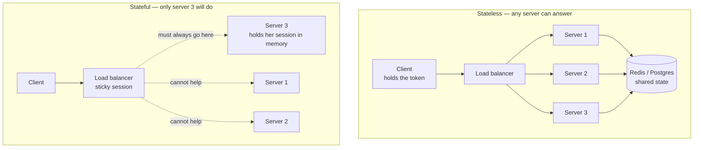

# Day 016 · System Design — REST, properly

**After today you can:** You can list the REST constraints and say which ones real APIs actually follow.

**The interviewer asks it as:** *What makes an API RESTful?*

---

## 1. What this is, and why they ask it

**REST** — Representational State Transfer — is a style for designing APIs, described by Roy
Fielding in 2000 as a set of six constraints. It is not a technology, not a standard, and not a
library; nothing you install makes an API RESTful. It is a list of rules about how a client and a
server should be arranged, and an API is RESTful to the extent that it follows them.

Yesterday you learned what an API is: the published promise about what one piece of software will
do for another. REST is the most widely used way of shaping that promise. Its central move is to
organise everything around **things** rather than **actions** — every thing gets an address, and a
small fixed set of operations applies to every thing in the same way.

This question is asked constantly, at every level, and most candidates answer it badly. The weak
answer is "an API that uses HTTP and returns JSON", which is false — you can be thoroughly
un-RESTful over HTTP with JSON, and most APIs called REST are. The strong answer names the
constraints, picks out the two that actually matter in practice, and is honest that almost nobody
implements the sixth. That honesty is the part that impresses, because it means you have read
something beyond a tutorial.

---

## 2. The story

The cloakroom at Kacheguda station is a green door on platform one with a wooden counter across
it, and Rehana has used it four or five times a year since she started travelling for work. Her
train to Bangalore leaves at ten past nine at night and she gets into the city at eleven in the
morning, so there are ten hours to fill and she is not going to spend them holding a suitcase.

The way it works has not changed in fifteen years.

She puts the suitcase on the counter. The man weighs it, writes a number on a small metal token,
loops a matching tag through the handle, and hands her the token. Number 213. That token is now the
only thing that connects her to the suitcase. It does not say her name. It does not say what is
inside. It says 213, and 213 is enough, because there is exactly one bag with that tag on it.

Above the counter there is a board with four lines on it and it applies to every bag in there,
whether the bag holds clothes or a laptop or a stack of samples. Hand one in. Ask what is being
held under your number. Swap what is under your number for something else. Take it back. That is
all. There is no fifth thing, and there does not need to be.

Then there is the part Rehana has come to appreciate. When she comes back at seven in the evening,
the man at the counter is not the man who took the bag. The shift changed at two. This new man has
never seen her before in his life, and it does not matter at all — she hands over the token and her
identity card and he goes and finds 213. Nothing about the exchange depends on anybody remembering
anything.

She has used a place where that was not true. A left-luggage room near a bus stand where a boy took
her bag, did not give her anything, and said, *don't worry, I'll remember you*. He remembered her.
But she spent the whole day slightly worried, and when she came back he was at lunch and the man
covering for him had no idea who she was or which of the forty bags was hers.

---

## 3. The idea in plain English

The cloakroom is REST. Not by analogy — line for line.

### Everything is a thing, and every thing has an address

Token 213 names one suitcase. In REST the thing is called a **resource**, and its address is a
**URI** — the path in the URL. So:

```
/bags/213
```

The URI names a thing, not an action. That is the whole design decision, and it is what people mean
when they say REST uses **nouns, not verbs**. This is the un-RESTful version of the same idea:

```
/getBag?id=213
/deleteBagById?id=213
/updateBagContents?id=213
```

Three addresses for one suitcase, each with the action baked into the name. Add a fourth operation
and you invent a fourth address. In REST there is one address for the suitcase, forever, and the
operation is carried separately.

Resources come in two shapes and it is worth naming both now. A **collection** is the set of
things: `/bags`. An **item** is one of them: `/bags/213`. Almost every REST path you will ever
design alternates between the two, like `/users/42/orders/7/items`.

### One small set of operations, the same for every thing

The board above the counter has four lines and applies to every bag. In REST the four lines are the
HTTP methods you met on [day 005](../day-005-python-lists-and-tuples/README.md):

| Board | Method | On `/bags` (the collection) | On `/bags/213` (one item) |
|---|---|---|---|
| Ask what is there | `GET` | list all bags | fetch bag 213 |
| Hand one in | `POST` | create a new bag, get its number back | — |
| Swap it for this | `PUT` | — | replace bag 213 entirely |
| Change part of it | `PATCH` | — | change some fields of bag 213 |
| Take it back | `DELETE` | — | remove bag 213 |

This is the **uniform interface**, and it is the most important constraint. Because the operations
are fixed, a developer who has used one part of your API can guess the rest. Learn `/bags` and you
already know `/tickets` and `/passengers`. Nobody has to read documentation to find out whether
deleting is called `remove`, `delete`, `destroy` or `cancel`.

Two properties of these methods matter enough to have names, and interviewers ask about them:

- **Safe** — it does not change anything. `GET` is safe. You can call it a thousand times and the
  world is as it was.
- **Idempotent** — doing it twice has the same effect as doing it once. `GET`, `PUT` and `DELETE`
  are idempotent; `PUT`ting the same bag twice leaves one bag, and `DELETE`ing twice leaves it
  deleted. `POST` is **not**: two `POST`s to `/bags` create two bags. That single fact is why a
  timed-out payment request is dangerous, and it gets a full day on
  [day 018](../day-018-arrays-revision/README.md).

### The new man on the counter: statelessness

The shift changed and nothing broke, because the token carries everything needed. **Statelessness**
is the constraint that says every request must contain everything required to understand it — the
server keeps nothing about you between requests.

Concretely: no server-side memory of "this user is halfway through checkout". Every request carries
its own identity, usually a token in the `Authorization` header, and everything else it needs.

This sounds like a restriction and is actually the reason REST scales. If any of five servers can
answer any request, you put a load balancer in front and add a sixth whenever you like. If server 3
is the only one that remembers Rehana, then Rehana's requests must always go to server 3 — which is
called **session affinity** or a sticky session — and when server 3 restarts, her checkout is gone.
The boy who said *I'll remember you* was a stateful server, and he went to lunch.

The state has not vanished, note. It moved: into the client, which holds the token, and into a
shared store like Redis or Postgres that every server can read. What statelessness forbids is state
hiding in the memory of one particular machine.

### Representations, which is the "R" in REST

The suitcase is not what comes across the counter. What comes across is *the bag under number 213*,
and Rehana could equally have been shown a photo of it or told its weight. In REST, the resource is
the abstract thing; what actually travels over the wire is a **representation** of it — usually a
JSON document, sometimes XML, sometimes a PNG.

The same resource can have several representations, and the client says which it wants with the
`Accept` header:

```
GET /bags/213
Accept: application/json
```

This is called **content negotiation**. In practice ninety-five per cent of APIs offer JSON and
nothing else, and that is fine.

### The remaining constraints, honestly

Fielding listed six. Three are already covered above — uniform interface, statelessness, and
client-server, which just means the two sides evolve separately. The other three:

- **Cacheable.** A response must say whether it may be stored and reused. `GET /bags/213` with a
  `Cache-Control: max-age=60` header can be kept by the browser or a CDN and served without
  troubling your servers. This one is genuinely valuable and genuinely used.
- **Layered system.** A client cannot tell whether it is talking to the real server or to something
  in front of it. This is what lets you insert a load balancer, a CDN like Cloudflare, or an API
  gateway without any client changing.
- **Code on demand** — the server may send executable code to the client. Optional even in the
  original paper, and effectively never used in APIs.

And then there is the seventh idea, part of the uniform interface, that everyone quotes and almost
nobody implements: **HATEOAS** — Hypermedia As The Engine Of Application State. It says a response
should include links telling the client what it can do next, the way a web page contains links, so
the client never hard-codes a URL.

```json
{
  "id": 213,
  "status": "stored",
  "_links": {
    "self":   "/bags/213",
    "collect":"/bags/213/collect"
  }
}
```

By Fielding's own definition, an API without this is not REST. By everyday industry usage, nobody
cares. GitHub's API does include `_links`; Stripe's does not; both are called REST by everyone
including their own documentation. **Being able to say that out loud, calmly, is the difference
between a good answer and a memorised one.**

---

## 4. The picture

One resource, five operations, two addresses:

```
   COLLECTION                                ITEM
   /bags                                     /bags/213
   +----------------------------+            +--------------------------+
   | GET    -> list every bag   |            | GET    -> fetch this bag |
   | POST   -> create a new one |            | PUT    -> replace it     |
   |           (returns 201 +   |            | PATCH  -> change part    |
   |            Location: /bags/213)         | DELETE -> remove it      |
   +----------------------------+            +--------------------------+

   the path says WHAT.      the method says WHAT TO DO WITH IT.
```

**What to notice:** the path never changes when the operation changes. `/bags/213` is the suitcase
whether you are reading it, replacing it or removing it. Every un-RESTful API you will ever see
breaks exactly this line.

Stateless versus stateful, and why one of them scales:



**What to notice:** in the top half, adding a fourth server is a configuration change. In the bottom
half, restarting server 3 loses a customer's checkout, and adding servers helps only new users. The
dotted lines are the ones that hurt.

---

## 5. How it actually works

### Designing the path

The rules, in the order they get broken:

1. **Nouns, and plural.** `/users`, not `/getUser` and not `/user`. Plural reads correctly for both
   the collection and the item: `/users` and `/users/42`.
2. **Nest to show ownership, but not far.** `/users/42/orders` is the orders belonging to user 42.
   Stop at two levels — `/users/42/orders/7/items/3/reviews` is a path nobody can remember, and the
   fix is to give reviews their own top-level collection at `/reviews/8`.
3. **Filtering, sorting and paging go in the query string, not the path.** `/orders?status=shipped&
   page=2&per_page=50`. These are not different resources; they are different views of one
   collection.
4. **Hyphens, lower case, no file extensions.** `/purchase-orders`, not `/purchaseOrders` and not
   `/orders.json`.
5. **Actions that genuinely are not things** — and there are some, like "publish this article" —
   become a sub-resource: `POST /articles/9/publish`. Every real API has a handful of these. Purists
   dislike it; everybody does it.

### The methods, exactly

| Method | Means | Safe | Idempotent | Typical success |
|---|---|---|---|---|
| `GET` | read | yes | yes | `200 OK` |
| `POST` | create, or "do this thing" | no | **no** | `201 Created` + `Location` header |
| `PUT` | replace the whole thing | no | yes | `200 OK` or `204 No Content` |
| `PATCH` | change part of it | no | not necessarily | `200 OK` |
| `DELETE` | remove it | no | yes | `204 No Content` |

The `PUT` versus `PATCH` distinction gets asked. `PUT /users/42` with `{"name": "Rehana"}` means
*this is the entire user now* — a field you left out should be cleared. `PATCH` means *change only
what I sent*. Most APIs implement `PUT` sloppily as a partial update, which is a real source of
bugs, and saying so is a good sign in an interview.

### Status codes, the ones that matter

Full treatment is [day 018](../day-018-arrays-revision/README.md), but REST leans on them so
heavily that the shape is worth having now: `2xx` it worked, `3xx` look elsewhere, `4xx` you got it
wrong, `5xx` we got it wrong. The single worst API sin is returning `200 OK` with `{"error": "not
found"}` in the body, because every proxy, CDN and monitoring tool in the path now believes the
request succeeded.

### Versioning

Yesterday's point, made concrete. Three approaches are in real use:

- **In the path** — `/v1/charges`. Stripe, and most of the industry. Ugly, unambiguous, trivial to
  route. Purists object that the resource has not changed, only its representation.
- **In a header** — `Accept: application/vnd.github.v3+json`. GitHub. Cleaner in theory, and much
  harder to test by hand or eyeball in a log.
- **By date** — Stripe pins each account to the API version that was current when it signed up,
  like `2023-10-16`. Excellent for customers, expensive to maintain.

Say path versioning is what you would ship and why, and name the header alternative. That is the
complete answer.

### Pagination, which every real collection needs

`GET /orders` on a table with ten million rows must not return ten million rows. Two schemes:

- **Offset** — `?page=3&per_page=50`. Easy, and it degrades badly: the database must count past
  150,000 rows to serve page 3,001, and rows shifting between requests cause duplicates and gaps.
- **Cursor** — `?after=eyJpZCI6MTIzfQ&limit=50`, where the cursor encodes the last item seen. Stable
  under inserts and fast at any depth, because it becomes "give me the 50 rows after id 123". This
  is what Stripe, Slack and Twitter use, and it is the answer to give.

### Real APIs, scored honestly

| API | Nouns | Methods | Stateless | Hypermedia | Fair verdict |
|---|---|---|---|---|---|
| **Stripe** | yes | yes | yes | no | The design most people copy |
| **GitHub** | yes | yes | yes | partly (`_links`) | Closest to the book |
| **Amazon S3** | yes (`PUT /bucket/key`) | yes | yes | no | REST-shaped storage |
| **Most internal company APIs** | often not | `GET`/`POST` only | usually | no | HTTP with JSON, called REST |

There is a widely used ladder for this, the **Richardson Maturity Model**: level 0 is one endpoint
that does everything, level 1 introduces separate resources, level 2 uses HTTP methods and status
codes properly, level 3 adds hypermedia. **Most production APIs sit at level 2, and level 2 is a
perfectly good place to be.** Naming that model in an interview is a strong, cheap signal.

---

## 6. The numbers

### What statelessness buys you

Take the API from yesterday: **420 requests per second at peak**. One application server handles
about 200 requests a second.

```
420 ÷ 200 = 2.1  →  3 servers, for headroom
```

**Stateless.** Any server answers any request, so the load balancer sprays them evenly:
`420 ÷ 3 = 140` requests/second each. Traffic triples on a festival day? Start six more. The
deployment is a number in a config file.

**Stateful with sticky sessions.** Each user is pinned to one server. Users do not divide evenly —
in practice you see something like 45/30/25 rather than 33/33/33, so the busiest server takes
`420 × 0.45 = 189` requests/second while another takes 105. You are at 95% of capacity on one box
and 52% on another, and you must add servers for the peak of the worst-loaded one. Worse, when a
server dies you do not lose a third of your capacity for a moment — you lose a third of your users'
sessions.

That asymmetry is the whole argument, and it is worth being able to produce those two numbers.

### What cacheability buys you

`GET` on a public resource can be cached at a CDN. Suppose 80% of the traffic is `GET`s of things
that change rarely, and the CDN achieves a 90% hit rate on them:

```
cacheable traffic   = 420 × 0.80         = 336 req/s
served by the CDN   = 336 × 0.90         = 302 req/s
reaching your origin= 420 - 302          = 118 req/s
```

Servers needed drops from 3 to 1, and the cached responses come back in about 20 ms from a nearby
city instead of 150 ms from across the country. This is the single largest lever in most read-heavy
designs, and it exists **only because** REST made `GET` safe and addressable. An API where every
call is `POST /api` with the operation in the body cannot cache anything, ever.

### What pagination saves

An order row serialises to about 1 KB of JSON.

```
unpaginated:  10,000,000 rows × 1 KB = 10 GB in one response
paginated:            50 rows × 1 KB = 50 KB
```

10 GB is not a slow response; it is a crashed process at both ends. And the offset-versus-cursor
cost, on a 10-million-row table:

```
offset page 1     : scan 50 rows        → about 1 ms
offset page 100,000: scan 5,000,000 rows → about 2,000 ms
cursor, any page  : index seek + 50 rows → about 1 ms
```

The offset query gets 2,000 times slower at depth while the cursor query does not change. That is
the whole reason cursor pagination exists.

---

## 7. The trade-offs

### What REST costs

**Over-fetching and under-fetching.** `GET /users/42` returns the whole user because the resource is
the unit. A mobile screen that needs only a name and a photo downloads twenty fields it throws away.
And a screen needing four different things makes four round trips — from yesterday's arithmetic,
480 ms serially against about 120 ms in parallel. This is precisely the complaint that produced
GraphQL, which is [day 021](../day-021-frequency-maps/README.md).

**Not everything is a noun.** "Transfer 500 rupees from A to B", "retry this job", "search across
seven entities with a scoring rule" — these are operations, and forcing them into resource shapes
produces either dishonest paths or an invented `/transfers` resource that exists only to be posted
to. The invented resource is usually the right answer, and it is worth admitting it is a
workaround.

**JSON over HTTP is verbose.** Field names repeat in every record, everything is text, and headers
are re-sent constantly. For service-to-service traffic at high volume, a binary format over a
persistent connection is several times cheaper — which is gRPC, on
[day 022](../day-022-anagrams/README.md).

**Statelessness has a price.** Every request re-presents credentials and re-establishes context, so
requests are bigger and the server repeats work — validating a token, loading the user — on every
call. That is a genuine cost, paid deliberately, because independent servers are worth more than
the saved work.

### When you would choose something else

- **GraphQL** when many different clients need different slices of the same data, especially mobile
  clients on slow networks where round trips dominate.
- **gRPC** for internal service-to-service calls where you control both ends, volume is high, and
  you want a generated, strongly-typed client. You give up being able to test it with `curl`.
- **A message queue** — Kafka, RabbitMQ, SQS — when the caller does not need an answer now.
  Request-response is the wrong shape for "send this email eventually".
- **Plain HTTP RPC** — one endpoint, an action name in the body — for a small internal service where
  the resource model is pure ceremony. It is unfashionable and sometimes right.

### The sentence that separates candidates

> **I would not use REST if** the operations are genuinely actions rather than things, or if the
> traffic is internal service-to-service at high volume. Forcing a workflow like "run this
> reconciliation and retry the failed rows" into resources produces paths that lie about what the
> system does, and JSON over HTTP wastes real money at a million calls a second. REST earns its keep
> when the domain really is a set of things, when the clients are many and outside your control, and
> when being cacheable and inspectable with `curl` is worth more than efficiency.

---

## 8. In the interview

### How it gets asked

- *"What makes an API RESTful?"* — the direct version. They want constraints, not "it uses HTTP".
- *"What is the difference between PUT and PATCH? Which of the methods are idempotent?"* — the
  detail check, and the one most people fumble.
- *"Design the API for a library / a parking lot / a URL shortener."* — the applied version, in a
  design round. You will be judged on your paths and your status codes.
- *"Is this API RESTful?"* — shown something with `/api/getUserById?id=5`. They want you to spot the
  verb in the path and say so politely.

### What to say out loud, in the first ninety seconds

1. **Say what kind of thing REST is.** *"REST is an architectural style — a set of six constraints
   from Roy Fielding's 2000 dissertation — not a technology. An API is RESTful to the degree that it
   follows them."*
2. **Lead with the uniform interface, because it is the one that matters.** *"Everything is a
   resource with its own address, the address is a noun, and a small fixed set of methods applies to
   every resource the same way. `/users/42`, and then GET, PUT, PATCH or DELETE decides what happens
   to it."*
3. **Then statelessness, with the reason.** *"Every request carries everything needed to understand
   it. The server keeps nothing about the client between requests, which is why any server can
   answer any request and you can scale by adding boxes."*
4. **Then cacheability and layering, quickly.** *"Responses say whether they can be cached, which is
   what lets a CDN absorb most read traffic. And the client cannot tell how many layers are in
   front, so you can add a gateway or a load balancer without changing any client."*
5. **List the rest and be honest.** *"Client-server, and code-on-demand which is optional and
   effectively unused. The sixth part of the uniform interface is hypermedia — HATEOAS — where
   responses carry links to what you can do next. Strictly, an API without it is not REST. In
   practice almost nobody implements it: GitHub does partly, Stripe does not, and both are called
   REST by everyone."*
6. **Land the practical point.** *"Most production APIs sit at level 2 of the Richardson Maturity
   Model — proper resources, proper methods, proper status codes, no hypermedia — and that is
   usually the right place to stop."*

### The follow-ups

**"Which HTTP methods are idempotent, and why does it matter?"**
`GET`, `PUT` and `DELETE` are idempotent — doing them twice has the same effect as doing them once.
`GET` is additionally safe, meaning it changes nothing at all. `POST` is neither: two `POST`s to
`/orders` create two orders. It matters because networks lose responses. If a request times out you
do not know whether it was carried out, so for an idempotent method you can simply retry, and for
`POST` you cannot — retrying a payment charges twice. The standard fix is an idempotency key: the
client generates a unique value per attempt, sends it as a header, and the server promises that two
requests with the same key are executed once and return the same response. `PATCH` is interesting
because it depends on the patch: setting `status` to `shipped` is idempotent, incrementing a
counter is not.

**"Your API is stateless, so where do sessions live?"**
Not in any one server's memory. Two options. Either the client carries a signed token — a JWT — that
contains the identity and expiry, so any server can verify it with a key and no lookup at all; the
cost is that you cannot easily revoke one before it expires. Or the client carries an opaque session
id and every server looks it up in a shared store like Redis, which gives instant revocation and
costs one fast network round trip per request. Most systems use both: a short-lived token for
ordinary requests and a server-side record for refresh and revocation. Either way the important
property holds — the state is in the client or in a store every server can reach, never in the
memory of one box. The detail is [day 020](../day-020-building-strings/README.md).

**"Here is an endpoint: `POST /api/getUserOrders`. What is wrong with it?"**
Three things. The verb is in the path, so the address names an action rather than a thing — it
should be `GET /users/42/orders`. The method is wrong: this is a read, so it should be `GET`, and
using `POST` throws away everything HTTP gives you for reads — it can never be cached, browsers and
proxies will not retry it safely, and it will not show up correctly in any monitoring tool. And
because it is not addressable, you cannot link to it, bookmark it or reason about it. The practical
consequence is the cache: turning that one endpoint into a cacheable `GET` can take the majority of
its traffic off your servers entirely.

**"Design the API for a parking lot."**
Resources first: `/lots`, `/lots/{id}/spots`, `/tickets`, `/payments`. Then the operations.
`POST /tickets` with a vehicle and a lot to enter, returning `201 Created`, a ticket id and a
`Location` header. `GET /tickets/{id}` to see the current charge. `POST /tickets/{id}/payments` to
pay — a sub-resource, because a payment is a genuine thing worth having its own id, not merely an
action. `GET /lots/{id}/spots?free=true` to find space, with the filter in the query string because
it is a view of a collection rather than a different collection. `409 Conflict` when the lot is
full, `404` for an unknown ticket, `402` or `403` on leaving with an unpaid ticket. And I would make
the entry call idempotent with a client-supplied key, because a barrier that retries a timed-out
request must not issue two tickets for one car.

### A model answer

> "REST is an architectural style rather than a technology — six constraints described by Roy
> Fielding in 2000. An API is RESTful to the degree that it satisfies them, and most APIs called
> REST satisfy some of them.
>
> The central one is the uniform interface. Everything is a resource with its own address, and the
> address is a noun: `/users/42`, not `/getUser?id=42`. Then a small fixed set of methods applies to
> every resource identically — `GET` to read, `POST` to create, `PUT` to replace, `PATCH` to modify,
> `DELETE` to remove. The path says what the thing is, the method says what you are doing to it. The
> payoff is that once you have learned one part of the API you can guess the rest.
>
> The second one that really earns its place is statelessness. Every request carries everything
> needed to understand it — typically a token in the Authorization header — and the server keeps
> nothing about the client between requests. That is what makes horizontal scaling easy: any server
> can answer any request, so you put a load balancer in front and add boxes. The moment a session
> lives in one server's memory you need sticky sessions, your load spreads unevenly, and a restart
> costs users their state.
>
> Then cacheability — responses declare whether they can be stored, which is what allows a CDN to
> absorb most read traffic, and it only works because `GET` is safe and addressable. Layered system,
> so the client cannot tell whether it is talking to the origin or to a gateway in front of it.
> Client-server, so the two evolve independently. And code-on-demand, which was optional in the
> original paper and is effectively never used.
>
> The one worth being honest about is hypermedia — HATEOAS — where each response includes links to
> what you can do next, so clients do not hard-code URLs. By Fielding's definition an API without it
> is not REST. In practice almost nobody does it: GitHub includes `_links`, Stripe does not, and
> everyone calls both of them REST. Most production APIs sit at level 2 of the Richardson Maturity
> Model — real resources, real methods, real status codes, no hypermedia — and for most systems that
> is the right trade.
>
> What I would add is where REST stops being the right answer. It over-fetches, because the resource
> is the unit, and it under-fetches, because one screen often needs four resources — which is what
> GraphQL exists to fix. And for internal service-to-service traffic at high volume, JSON over HTTP
> is expensive compared with a binary format like gRPC. REST earns its keep when the domain really
> is a set of things and the clients are many and outside your control."

---

## 9. Recall card

- **REST is a style, not a technology** — six constraints, Fielding 2000. HTTP + JSON alone is not
  REST.
- **Uniform interface:** nouns as addresses (`/users/42`), a fixed small set of methods, the path
  never changes when the operation does.
- **Stateless:** every request self-contained, so any server can answer it — that is what makes
  scaling out easy.
- **Safe: `GET`. Idempotent: `GET`, `PUT`, `DELETE`. Not idempotent: `POST`** — which is why
  payments need an idempotency key.
- **HATEOAS is the constraint nobody implements.** Say so. Most real APIs are Richardson level 2,
  and that is fine.
