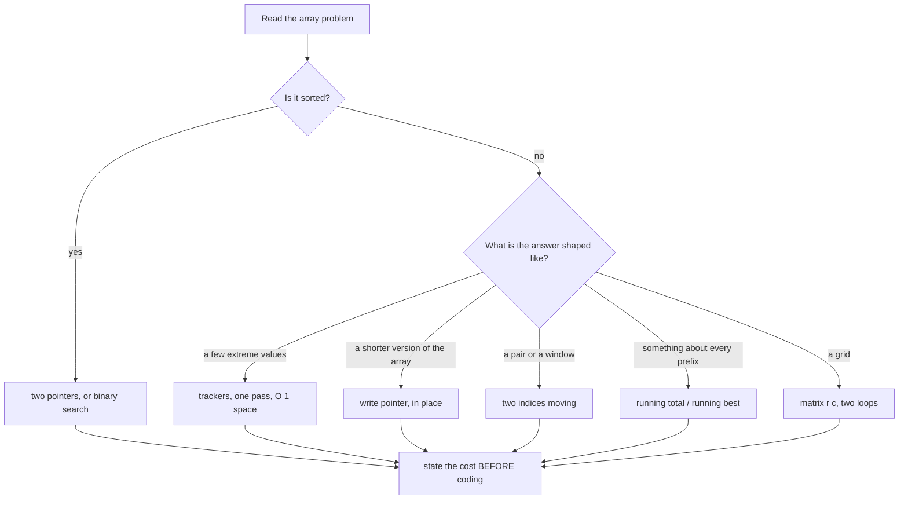

# Day 018 · DSA — Arrays revision and mock round

**After today you can:** You can solve two unseen array problems in forty-five minutes, thinking out loud.

**The interviewer asks it as:** *Two array problems, no hints, talk as you go.*

---

## 1. What this is, and why they ask it

Days 9 to 17 gave you the array toolkit: what an array really is, how to walk one, what insert and
delete cost, linear search, reversing and rotating, the single-pass habit, the write pointer, and
matrices. Today is not a summary of any of that. Today is the **performance** of it — two unseen
problems, a clock, and a person listening while you talk.

That gap is bigger than anyone expects. You can know that a write pointer solves compaction and
still freeze when the question is phrased differently. You can work out `O(n)` correctly on your own
and say nothing useful for the first four minutes because you started coding immediately. The material
is not the skill. **Saying the material out loud, under mild stress, while typing, is the skill**,
and it is a separate thing that has to be practised separately.

That is also, precisely, the interview. A forty-five minute technical round at a product company is
two problems, or one problem with follow-ups, and you are being scored at least as much on how you
work as on whether you finish. Interviewers write down whether you asked about the empty input.
They write down whether you stated the approach before coding. A candidate who solves one problem
cleanly with clear narration usually beats a candidate who silently solves two.

---

## 2. The story

Sneha has been driving her brother's car for two years. Not far — the four kilometres to her
office, the market on Sundays, her mother's place in Kukatpally on the second Saturday of the month.
She is a perfectly good driver. Everyone who has sat next to her says so.

She failed her test the first time.

The man from the office got into the passenger seat at ten past eleven, said good morning, and then
said nothing at all for eleven minutes. That was the part she had not expected. She had expected
instructions. What she got was silence and a man occasionally looking at his phone, and she found
that she was driving very slightly worse than usual — braking a bit late, taking the roundabout in
second when she would normally have been in third.

She did the reverse park. She did it correctly. She got the car into the space in one go, straight,
about a foot from the kerb, and she was quietly pleased with herself. He wrote something down and
said they could go back.

When the result came she went and asked why. The answer was not about the parking. It was that she
had not looked. She *had* looked — she knew perfectly well what was behind her — but she had done it
in a small, quick, private way, the way you do when nobody is watching, and from the passenger seat
it was invisible. He could not tell the difference between a driver who had checked and a driver who
had been lucky.

Her instructor put it plainly the next week. Do the mirror properly. Turn your head so it is
obvious. And say it — say "checking left, nothing coming, going now" out loud, even though it feels
ridiculous, because the man beside you is not marking whether the car ended up in the right place.
He is marking whether you knew what you were doing while you did it.

She practised that way for three weeks, with her brother in the passenger seat saying nothing on
purpose. She passed the second time and she says the driving was no better at all.

---

## 3. The idea in plain English

Sneha's examiner cannot see what she is thinking. Neither can your interviewer. Both are scoring
what is visible, and in a technical round what is visible is your **narration** and your
**structure**, not the finished code.

So today has two halves. First, the shape of forty-five minutes. Second, the array toolkit compressed
into something you can select from in ten seconds.

### The six beats of a technical round

Every good round has the same shape, and knowing it means you are never wondering what to do next.

| Beat | Roughly | What you do |
|---|---|---|
| **1. Clarify** | minutes 0–3 | Restate the problem. Ask about types, range, duplicates, empty input, and whether you can modify the input. |
| **2. Examples** | 3–6 | Produce one small example and its answer, out loud. Then one edge case. |
| **3. Brute force** | 6–10 | Say the obvious solution and its cost. Do not code it. |
| **4. Optimise** | 10–18 | Say what is wasteful, name the pattern that fixes it, state the new cost. Get agreement before coding. |
| **5. Code** | 18–35 | Write it, narrating each block in one sentence. |
| **6. Test** | 35–45 | Walk your own code through the example by hand. Then the edge cases you named in beat 1. |

Two rules about that table. **Do not skip beat 3.** Saying "the brute force is O(n²) because I would
compare every pair" costs fifteen seconds, proves you understand the problem, and gives you
something to improve on. And **do not start beat 5 without agreement.** The single most expensive
mistake in an interview is twenty minutes of code the interviewer was never going to accept.

### Narration: what it actually sounds like

"Thinking out loud" does not mean a running commentary on your typing. It means saying the
**decision** and the **reason**, once per decision:

- *"I'll keep two variables rather than sorting, because I only need two of the n values."*
- *"I'm starting the write index at 1 here, not 0, because position 0 is always kept."*
- *"This is the line people get wrong — the old maximum has to slide down — so I'll write it as one
  tuple assignment."*

That is Sneha turning her head so it is obvious. Silence is indistinguishable from luck.

When you genuinely need to think, say so and take the time: *"Give me twenty seconds to think about
the boundary."* An interviewer will always grant that, and it reads far better than a long pause
they have to guess at.

### The array toolkit, as a decision table

Nine days compressed. When you read an array problem, this is the list you run down.

| The problem says | Reach for | Cost | Day |
|---|---|---|---|
| find one value, unsorted | linear scan | `O(n)` | [012](../day-012-linear-search/README.md) |
| max / min / two largest | trackers, one pass | `O(n)`, `O(1)` | [014](../day-014-single-pass-habit/README.md) |
| remove / compact / dedupe, in place | write pointer | `O(n)`, `O(1)` | [015](../day-015-the-write-pointer/README.md) |
| reverse, rotate, swap halves | three reversals | `O(n)`, `O(1)` | [013](../day-013-reverse-and-rotate/README.md) |
| running best-so-far | one pass, one variable | `O(n)`, `O(1)` | [014](../day-014-single-pass-habit/README.md) |
| insert or delete in the middle | it shifts — think again | `O(n)` each | [011](../day-011-insert-and-delete/README.md) |
| grid, rows and columns | `matrix[r][c]`, two loops | `O(m × n)` | [016](../day-016-2d-arrays/README.md) |
| turn or spiral a grid | two flips, or four boundaries | `O(n²)`, `O(1)` | [017](../day-017-matrix-tricks/README.md) |
| the answer is a pair or a window | two indices | `O(n)` | [027](../day-027-two-pointers-idea/README.md) |

And the four costs that must be automatic, from
[day 011](../day-011-insert-and-delete/README.md): reading by position is `O(1)`, appending at the
end is `O(1)` amortised, inserting or deleting anywhere else is `O(n)` because everything after it
shifts, and searching an unsorted array is `O(n)`.

### The four questions to ask about any array problem

Ask these before writing anything. They take forty seconds and they catch most of the traps in the
last nine days.

1. **Can I modify the input?** Decides in-place versus allocate, and it is the whole question in
   half of these problems.
2. **Is it sorted?** If yes, a great deal becomes cheaper — and it is the hint for two pointers and
   for binary search from [day 042](../day-042-binary-search-idea/README.md).
3. **Duplicates? Negatives? Empty?** Three inputs that break more solutions than anything else.
   Negative numbers destroy any tracker initialised to `0`; empty input destroys anything indexing
   `items[0]`.
4. **Does order have to be preserved?** From [day 015](../day-015-the-write-pointer/README.md), this
   changes which correct answer is the right answer.

---

## 4. The picture

The forty-five minutes, as a shape you can hold:

```
  0        3        6        10              18                    35        45
  |--------|--------|--------|---------------|---------------------|---------|
   clarify  examples  brute     optimise         write the code       test it
                      force
  |________________________|                 |_____________________|
        talking, no typing                        typing, still talking
             ~18 minutes                              ~17 minutes

   ^                                         ^                     ^
   restate it in your own words              get agreement          walk YOUR code
   ask the four questions                    BEFORE you type        through YOUR example
```

**What to notice:** nearly half the time is before any code is written, and the last ten minutes are
testing, not coding. Candidates who start typing at minute 2 almost always finish worse, because
they are debugging an approach nobody agreed to.

The selection tree you run when you first read an array problem:



**What to notice:** every branch ends in the same box. Whatever you choose, the last thing you do
before typing is say the cost out loud and get a nod.

---

## 5. The code, built step by step

Two problems, worked the way you would work them in the room. Read them as transcripts, not as
solutions.

### Problem one — the warm-up

> *"You're given an array of daily prices. Find the maximum profit from buying on one day and
> selling on a later day. You may only make one transaction."*

**Beat 1, clarify.** *"So I buy once and sell once, and the sell must be strictly after the buy. If
prices only go down, is the answer zero — meaning I don't have to trade — or should I return a
negative number?"* Say it is zero. *"And can the array be empty or have one element?"*

That question matters. `[7, 6, 4, 3, 1]` returns `0`, not `-6`. A candidate who does not ask writes
the wrong function about a third of the time.

**Beat 2, example.** *"Take `[7, 1, 5, 3, 6, 4]`. Buy at 1 on day 1, sell at 6 on day 4, profit 5.
Buying at 7 is no good because everything after it is smaller."*

**Beat 3, brute force.** *"The obvious version is every pair: for each buy day, look at every later
sell day and keep the best difference. Two nested loops, so `O(n²)` time and `O(1)` space. Correct,
but it re-examines the same prices constantly."*

**Beat 4, optimise.** *"The waste is that for each sell day I re-scan all the earlier days looking
for the cheapest. But I could have kept that as I went. So: one pass, and at every price I ask 'if I
sold today, what would I make?' — which is today's price minus the cheapest price seen so far. Then
I update the cheapest. That's `O(n)` time and `O(1)` space."*

This is the single-pass habit from [day 014](../day-014-single-pass-habit/README.md), with two
trackers instead of two largest.

**Beat 5, code.** Build it in pieces, narrating.

```python
if not prices:
    return 0
cheapest = prices[0]
best = 0
```

*"Guard the empty case first. `cheapest` starts as a real element, not zero — prices are positive
here so zero would be safe, but I never initialise a tracker to zero out of habit, because it breaks
the moment values can be negative. `best` starts at 0 because doing nothing is allowed."*

```python
for price in prices[1:]:
    best = max(best, price - cheapest)
    cheapest = min(cheapest, price)
```

*"For each later price, first ask what I'd make selling today against the cheapest so far, then
update the cheapest."*

**The order of those two lines is the whole problem.** Update `cheapest` first and `price -
cheapest` can be today minus today, which is zero — you would be buying and selling on the same day.
Say that out loud while you write it; it is exactly the kind of thing an interviewer is listening
for.

**Beat 6, test.** Walk `[7, 1, 5, 3, 6, 4]` through by hand, out loud:

```
price=1 : best = max(0, 1-7) = 0    cheapest = 1
price=5 : best = max(0, 5-1) = 4    cheapest = 1
price=3 : best = max(4, 3-1) = 4    cheapest = 1
price=6 : best = max(4, 6-1) = 5    cheapest = 1
price=4 : best = max(5, 4-1) = 5    cheapest = 1
answer 5
```

Then the edges you named in beat 1: `[]` → 0. `[5]` → 0. `[7,6,4,3,1]` → 0. `[2,1]` → 0.

### Problem two — the one with a twist

> *"You have two sorted arrays. The first has `m` real values followed by `n` empty slots — exactly
> enough room for the second array. Merge them into the first, in sorted order, in place."*

**Beat 1, clarify.** *"So `nums1` has length `m + n`, the last `n` entries are placeholders, and I
must not allocate a second array. Can `n` be zero? Can `m` be zero?"* Both yes.

**Beat 2, example.** *"`nums1 = [1, 2, 3, 0, 0, 0]` with `m = 3`, `nums2 = [2, 5, 6]` with `n = 3`.
The answer is `[1, 2, 2, 3, 5, 6]`."*

**Beat 3, brute force.** *"I could copy `nums2` into the empty slots and sort the whole thing —
that's two lines and `O((m+n) log(m+n))`. It works and it throws away the fact that both inputs are
already sorted, which is clearly the point of the question."*

Say the cheap answer. Then say why it is not the answer. That sequence is worth marks on its own.

**Beat 4, optimise.** *"The standard merge takes the smaller front element of each array and writes
it out — that's `O(m + n)`. But here I'd be writing into the front of `nums1`, which still holds
values I haven't read yet, so I'd destroy them."*

Pause here. This is the insight, and it is worth saying deliberately:

*"So I go backwards instead. The largest value overall must end up in the very last slot — and the
very last slot is empty. So if I fill from the back, I'm always writing into space that is either a
placeholder or a position I've already read past. The write index never collides with either read
index."*

That is exactly the `write <= read` rule from
[day 015](../day-015-the-write-pointer/README.md), turned around.

**Beat 5, code.**

```python
write = m + n - 1
i, j = m - 1, n - 1
```

*"Three indices, all at the back. `write` is the last slot; `i` is the last real value in `nums1`;
`j` is the last value in `nums2`."*

```python
while j >= 0:
    if i >= 0 and nums1[i] > nums2[j]:
        nums1[write] = nums1[i]
        i -= 1
    else:
        nums1[write] = nums2[j]
        j -= 1
    write -= 1
```

*"I loop while `nums2` still has values. Once `j` runs out I'm done, because anything left in
`nums1` is already in its correct place — I never moved it."*

**The loop condition is the second insight.** `while j >= 0` rather than `while i >= 0 and j >= 0`
means you never need a clean-up loop afterwards. Say why: leftovers in `nums2` must be copied,
leftovers in `nums1` are already home.

The `i >= 0` inside the `if` handles `nums1` running out first, which happens when `m = 0` or when
`nums2` holds all the small values.

**Beat 6, test.** `nums1 = [1,2,3,0,0,0]`, `m = 3`, `nums2 = [2,5,6]`:

```
write=5  i=2 (3)  j=2 (6)   3 > 6? no  -> write 6   j=1  write=4
write=4  i=2 (3)  j=1 (5)   3 > 5? no  -> write 5   j=0  write=3
write=3  i=2 (3)  j=0 (2)   3 > 2? yes -> write 3   i=1  write=2
write=2  i=1 (2)  j=0 (2)   2 > 2? no  -> write 2   j=-1 write=1
j < 0, stop.  nums1 = [1, 2, 2, 3, 5, 6]
```

Then the edges: `m = 0` with `nums1 = [0]`, `nums2 = [1]` → `[1]`. And `n = 0` → unchanged.

### The complete solutions

```python
def max_profit(prices: list[int]) -> int:
    """LeetCode 121. Best single buy-then-sell profit. One pass, two trackers."""
    if not prices:
        return 0
    cheapest = prices[0]        # never 0 — a tracker starts as a real value
    best = 0                    # 0 because doing nothing is allowed
    for price in prices[1:]:
        best = max(best, price - cheapest)   # sell today against the cheapest so far
        cheapest = min(cheapest, price)      # AFTER, or you buy and sell the same day
    return best


def merge(nums1: list[int], m: int, nums2: list[int], n: int) -> None:
    """LeetCode 88. Merge nums2 into nums1 in place. nums1 has m values + n free slots.

    Filled from the back, so the write index never overtakes either read index.
    """
    write = m + n - 1           # last slot of nums1
    i, j = m - 1, n - 1         # last real value of each input

    while j >= 0:               # only nums2 leftovers need moving
        if i >= 0 and nums1[i] > nums2[j]:
            nums1[write] = nums1[i]
            i -= 1
        else:
            nums1[write] = nums2[j]
            j -= 1
        write -= 1


if __name__ == "__main__":
    print(max_profit([7, 1, 5, 3, 6, 4]))    # 5
    print(max_profit([7, 6, 4, 3, 1]))       # 0
    print(max_profit([]))                    # 0
    print(max_profit([5]))                   # 0

    a = [1, 2, 3, 0, 0, 0]
    merge(a, 3, [2, 5, 6], 3)
    print(a)                                 # [1, 2, 2, 3, 5, 6]

    b = [0]
    merge(b, 0, [1], 1)
    print(b)                                 # [1]

    c = [1]
    merge(c, 1, [], 0)
    print(c)                                 # [1]
```

---

## 6. What it costs

### `max_profit`

The loop runs over `prices[1:]`, which is `n - 1` elements. Each turn does one subtraction, one
`max` and one `min` — a fixed amount of work. So `n - 1` turns of constant work: **O(n) time**.

Space: `cheapest` and `best` are two integers, whatever the length of the list. **O(1) extra
space**.

One honest caveat worth mentioning: `prices[1:]` creates a copy of the list, which is `O(n)` extra
space. In an interview say so and offer the index version if it matters:

```python
for k in range(1, len(prices)):
    best = max(best, prices[k] - cheapest)
    cheapest = min(cheapest, prices[k])
```

Noticing that yourself, unprompted, reads extremely well.

Against the brute force: the nested-loop version does `n(n-1)/2` comparisons. At `n = 10,000` that
is about 50 million; the one-pass version does 10,000. Five thousand times fewer, and it is the
difference between a visible pause and no pause at all.

### `merge`

Each turn of the loop writes exactly one value and decreases exactly one of `i` or `j`. Every value
from `nums2` gets written, and at most every value from `nums1` gets moved, so the loop runs at most
`m + n` times: **O(m + n) time**, which is linear in the total number of elements.

Space: three integers. **O(1) extra space** — nothing is allocated, which is what "in place" was
asking for.

Against the copy-and-sort version, which is `O((m+n) log(m+n))`: with `m = n = 100,000`, sorting is
about 200,000 × 17.6 ≈ 3.5 million comparisons, while the merge is 200,000 writes. Around
seventeen times fewer, and it uses the sortedness that copy-and-sort discards.

---

## 7. The traps

### The near-miss: merging from the front

The instinct is to merge the way you were taught, front to back:

```python
def merge_front(nums1, m, nums2, n):
    write = 0
    i, j = 0, 0
    while i < m and j < n:
        if nums1[i] <= nums2[j]:
            nums1[write] = nums1[i]; i += 1
        else:
            nums1[write] = nums2[j]; j += 1
        write += 1
    return nums1

print(merge_front([1, 2, 3, 0, 0, 0], 3, [2, 5, 6], 3))
```

```
[1, 2, 2, 2, 0, 0]
```

The 3 has vanished. On the third turn the code wrote `nums2[0] = 2` into `nums1[2]`, which was
still holding the 3 it had not yet read. **Writing forwards into an array you are still reading
forwards destroys data**, which is exactly the rule from
[day 015](../day-015-the-write-pointer/README.md) — `write <= read` — being violated. Going
backwards restores it.

### The near-miss: updating the cheapest price too early

```python
for price in prices[1:]:
    cheapest = min(cheapest, price)      # moved up one line
    best = max(best, price - cheapest)
```

On `[7, 1, 5, 3, 6, 4]` this still returns 5, so it looks fine. It is wrong in principle and it
shows on a strictly falling input plus one: on `[3, 2, 1]` it returns 0, which is right by accident,
because the bug allows buying and selling on the same day and that always yields exactly 0. It never
produces a *bigger* wrong answer, which is precisely why it survives testing and why an interviewer
who spots it will ask you to justify the order. Have the reason ready: **you must sell at a price
you bought before, so the buy candidate has to come from strictly earlier days.**

### The near-miss: `best = 0` when the answer can be negative

`max_profit` starts `best` at 0 because the problem allows doing nothing. Change the problem to
*"you must make exactly one transaction"* and the answer for `[7, 6, 4, 3, 1]` becomes `-1`, and
starting at 0 returns 0 forever. That is the day-014 lesson again: **a tracker's starting value is
part of the contract, not a detail.** Ask which problem you are being given.

### The real error: forgetting the empty guard

```python
def max_profit(prices):
    cheapest = prices[0]
    best = 0
    for price in prices[1:]:
        best = max(best, price - cheapest)
        cheapest = min(cheapest, price)
    return best

print(max_profit([]))
```

```
Traceback (most recent call last):
  File "t.py", line 9, in <module>
    print(max_profit([]))
          ~~~~~~~~~~^^^^
  File "t.py", line 2, in max_profit
    cheapest = prices[0]
               ~~~~~~^^^
IndexError: list index out of range
```

You asked about the empty input in beat 1. Handle it in beat 5. Candidates ask the question, get the
answer, and then forget to write the guard — which is worse than never asking, because you have
demonstrated that you knew.

### The process traps, which cost more marks than the code ones

- **Coding before agreeing.** You typed for twenty minutes and the interviewer wanted a different
  approach. Unrecoverable in forty-five minutes.
- **Silence.** Two minutes of quiet typing is two minutes of no information for the person scoring
  you. Sneha's invisible mirror check.
- **Naming a complexity without counting.** "This is O(n)" earns nothing. "The loop runs n times and
  each turn is constant work, so O(n)" earns the mark.
- **Testing with the example you were given.** Of course that passes. Test with the edge cases *you*
  named in beat 1 — that is the part being scored.
- **Fixing a bug by changing a number.** Changing `n` to `n-1` to see if it works tells the
  interviewer you do not know why it is wrong. Say what the index should be and why, then change it.

---

## 8. In the interview

### How it gets asked

- *"We'll do two problems today. Talk me through your thinking as you go."* — the standard opening.
- *"Here's the problem. Take a minute to read it."* — and the minute is being watched. Use it to
  produce a question, not a silent stare.
- *"How would you test this?"* — asked when you finish early, and a gift if you have edge cases
  ready.
- *"Can you do better?"* — almost always means yes, and almost always means there is a one-pass or
  a two-pointer version.

### What to say out loud, in the first ninety seconds

The first ninety seconds are the same for **every** array problem you will ever be given:

1. **Restate it in your own words.** *"So I'm given an array of prices, one per day, and I need the
   best profit from a single buy followed by a later sell."* If your restatement is wrong, you find
   out now instead of at minute thirty.
2. **Ask the four questions.** Can I modify the input? Is it sorted? Duplicates, negatives, empty?
   Does order matter? Forty seconds, and it catches most of the traps in this phase.
3. **Give one example and its answer.** Small, concrete, six elements at most, computed out loud.
4. **Name the brute force with its cost.** *"The obvious approach is every pair, which is O(n²)."*
5. **Name the better approach and its cost, and pause.** *"But I can do it in one pass with two
   variables, O(n) time and O(1) space — shall I code that?"* Then stop and wait for the nod. That
   pause is deliberate and it is worth marks.

### The follow-ups

**"Can you do better than O(n)?"**
No, and here is why, which is a better answer than trying. Any correct solution has to look at every
price at least once — if I skip a price, an adversary can put the day's best buy or best sell there
and my answer is wrong. So `O(n)` is a lower bound on this problem, and my solution matches it. The
only thing left to improve is space, and I am already at `O(1)`. When an interviewer asks "can you
do better" and the honest answer is no, saying **why** it is no is worth more than a nervous attempt
at something faster.

**"Now allow at most two transactions."**
That is LeetCode 123, and it generalises the trackers. Instead of two variables I keep four, tracking
the best I can have done after each of four stages: bought once, sold once, bought again, sold again.
For each price I update all four in order — the best after buying once is the best of what it was and
minus this price; the best after selling once is the best of what it was and the first plus this
price; and so on. Still one pass, `O(n)` time and `O(1)` space. And the general version — at most `k`
transactions — is the same idea with `2k` trackers, or a dynamic programming table if `k` is large,
which is the phase starting on [day 143](../day-143-what-dp-is/README.md).

**"In the merge, why does the loop condition only check `j`?"**
Because when `nums2` is exhausted, whatever is left in `nums1` is already in the right place — it
was never moved, and everything larger has been written above it. If instead `nums1` runs out first,
the remaining `nums2` values still have to be copied down, which the loop keeps doing because `j` is
still non-negative and the `i >= 0` guard sends it down the else branch. Writing `while i >= 0 and
j >= 0` would be correct too, but then I would need a second loop afterwards to drain `nums2`, and
that extra loop is a place to introduce a bug for no benefit.

**"What if you couldn't modify `nums1` at all?"**
Then it is a different problem: allocate a result of size `m + n` and do the standard forward merge
into it, taking the smaller front element each time. `O(m + n)` time and now `O(m + n)` space. The
backwards trick exists purely to make the in-place version safe; with a fresh output array there is
nothing to collide with, so forwards is simpler and I would write that. It is worth being explicit
that the clever version is a response to a constraint, not a better algorithm.

### A model answer

Written out as it would actually sound, for problem two.

> "Let me restate it. `nums1` has length `m + n`. The first `m` entries are real, sorted values; the
> last `n` are placeholders. `nums2` has `n` sorted values. I have to end up with all `m + n` values
> sorted inside `nums1`, without allocating a second array. Is that right? And can `m` or `n` be
> zero?
>
> ...Both can be zero, fine.
>
> Example: `nums1 = [1, 2, 3, 0, 0, 0]` with `m = 3`, `nums2 = [2, 5, 6]`. Answer `[1, 2, 2, 3, 5,
> 6]`.
>
> The cheap approach is to copy `nums2` into the placeholders and sort the whole thing. That is two
> lines and `O((m+n) log(m+n))`, and it works — but it throws away the fact that both inputs are
> already sorted, which is obviously the point of the question, so let me use that.
>
> The standard merge compares the front of each array and writes out the smaller one. The problem
> here is where I write it. The front of `nums1` still holds values I have not read yet, so writing
> there destroys them — I'd lose the 3 in my example. That is the same constraint as any in-place
> compaction: the write position must never overtake the read position.
>
> So I fill from the back instead. The largest value overall belongs in the last slot, and the last
> slot is a placeholder — guaranteed free. Every subsequent write goes into a position that is either
> still a placeholder or one I have already read past. The write index can never collide.
>
> ```python
> def merge(nums1: list[int], m: int, nums2: list[int], n: int) -> None:
>     write = m + n - 1
>     i, j = m - 1, n - 1
>     while j >= 0:
>         if i >= 0 and nums1[i] > nums2[j]:
>             nums1[write] = nums1[i]
>             i -= 1
>         else:
>             nums1[write] = nums2[j]
>             j -= 1
>         write -= 1
> ```
>
> Two details worth calling out. The loop runs while `j >= 0` rather than while both are in range,
> because once `nums2` is empty anything left in `nums1` is already sitting in its correct place —
> so I need no clean-up loop. And the `i >= 0` inside the condition handles `nums1` running out
> first, which is what happens when `m` is zero.
>
> Tracing my example: write 6, write 5, then 3 beats 2 so write 3, then 2 versus 2 goes to the else
> branch and writes the 2 from `nums2`, and now `j` is negative so we stop with `[1, 2, 2, 3, 5, 6]`.
> The leading 1 was never touched, which is exactly the point.
>
> `O(m + n)` time — one write per element, at most — and `O(1)` extra space. Edge cases: `n = 0`
> leaves `nums1` untouched because the loop never runs; `m = 0` copies all of `nums2` down; equal
> values go to the else branch, so the merge is stable in the sense that `nums2`'s copy lands
> after."

---

## 9. Recall card

- **Six beats:** clarify, example, brute force, optimise, code, test. Half the time is before you
  type.
- **Never code without agreement.** State the approach and its cost, then pause for the nod.
- **Narrate the decision and the reason, once per decision.** Silence is indistinguishable from luck.
- **Four questions for every array problem:** can I modify it, is it sorted, duplicates/negatives/
  empty, does order matter?
- **Test with the edge cases you named yourself** — not with the example you were handed.
