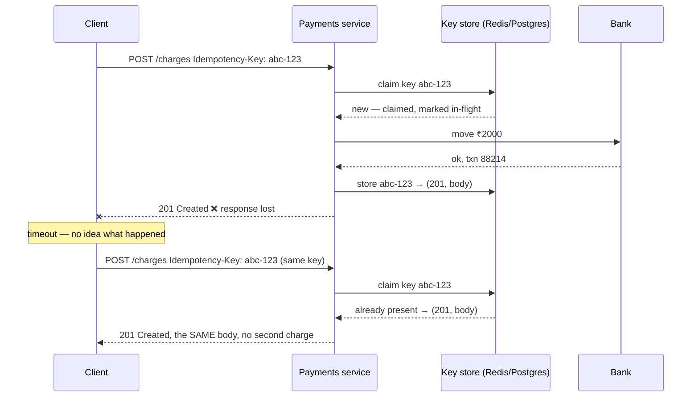

# Day 018 · System Design — Status codes, errors, and idempotency

**After today you can:** You can pick the right status code and explain why retrying a POST is dangerous.

**The interviewer asks it as:** *Your client retries a failed payment request. What could go wrong?*

---

## 1. What this is, and why they ask it

A call across a network has three outcomes, not two. It can succeed. It can fail with an answer. And
it can fail **without** an answer — the request went out and nothing came back — in which case you
do not know whether the work was done. That third case is not an edge case. It is the normal
behaviour of networks, and almost everything difficult about distributed systems grows out of it.

Today has three parts and they are one idea. **Status codes** are how a service says what happened.
**Error design** is how it says it usefully enough for a caller to act. **Idempotency** is the
property that makes it safe to ask again when you did not hear the answer.

Interviewers ask this constantly, in two shapes. The quick version — *"what's the difference between
401 and 403?"*, *"which HTTP methods are idempotent?"* — is a five-second check on whether you have
worked with real systems. The long version — *"a payment request times out; what do you do?"* — is
one of the best design questions there is, because there is no way to answer it well without
understanding that the response, not the request, is the thing that went missing. Candidates who
have only read about REST say "retry it". Candidates who have shipped payments say "not without an
idempotency key", and the conversation gets interesting.

---

## 2. The story

Kiran stops for fuel at about nine at night, on the road out of Hyderabad, because he is going to
his sister's place in the morning and does not want to stop on the way. Two thousand rupees. The boy
fills it, wipes his hands, and turns the little stand round so the code faces him.

Kiran scans it, types 2000, holds his thumb on the sensor, and waits.

The wheel spins. It spins for longer than it usually does. He can see one bar of signal and it keeps
dropping to nothing and coming back. After maybe forty seconds the app gives up and says the
transaction has failed, in red, and offers him a button to try again.

He looks up. The boy is looking at his own phone, the one clipped to the stand, and shakes his head.
Nothing has come. There is a small queue behind now, a scooter and a lorry, and the lorry driver is
being patient in the way that makes it worse.

So Kiran pays again. Scans, types 2000, thumb, and this time it goes through in four seconds and
the boy's phone makes the noise and everybody relaxes.

He is a kilometre down the road when his phone buzzes twice. Two messages, thirty seconds apart.
Four thousand rupees have left his account.

The first payment had gone through. It had gone through nearly a minute earlier, in fact — the money
had left, the fuel company had it, and the only thing that had failed was the small message coming
back to tell him so. His phone never heard the answer, so it assumed there had not been one.

What saves him is the next morning. He rings the bank and the woman asks for the reference numbers,
and there are two of them, different, one for each attempt. Because each attempt carried its own
number, and because that number went with the money, they can see exactly which two payments went
out and put one back. It takes four days.

He tells his sister about it and she says the same thing happened to her at a supermarket, except
that when she tapped again the machine beeped and said *already paid* and refused to take the second
one. Same problem, and somebody at that shop's end had thought about it beforehand.

---

## 3. The idea in plain English

Kiran's problem is not that something failed. It is that **he could not tell the difference between
"it did not happen" and "it happened and I did not hear about it"**. From where he was standing
those two look identical, and they need opposite responses.

### The three outcomes of any network call

| What happened | You know | What to do |
|---|---|---|
| **Success** — a `2xx` came back | It worked | Carry on |
| **Failure with an answer** — a `4xx` or `5xx` came back | It definitely did not work, and why | `4xx`: fix the request. `5xx`: it may be worth asking again |
| **No answer** — timeout, dropped connection | **Nothing** | The dangerous one. It may have worked |

The third row is Kiran at the pump. The request reached the far end and was carried out; the
response was lost on the way back. There is no way, from the client, to tell that apart from the
request never arriving at all.

### Status codes: what the service says happened

An HTTP response starts with a three-digit number, and the first digit is the family. You met them
on [day 005](../day-005-python-lists-and-tuples/README.md); this is the working set.

| Code | Name | Means, in plain words |
|---|---|---|
| `200` | OK | Here it is. |
| `201` | Created | I made it. A `Location` header says where. |
| `202` | Accepted | I have taken the work; it is not finished yet. |
| `204` | No Content | Done, nothing to send back. The usual reply to `DELETE`. |
| `301` / `302` | Moved | It lives elsewhere. `301` permanently, `302` for now. |
| `304` | Not Modified | You already have the current version. |
| `400` | Bad Request | I cannot parse this. |
| `401` | Unauthorized | I do not know who you are. **Really means unauthenticated.** |
| `403` | Forbidden | I know who you are and you may not. |
| `404` | Not Found | No such thing. |
| `405` | Method Not Allowed | That thing exists; that verb does not apply to it. |
| `409` | Conflict | It exists, and its current state forbids this. |
| `422` | Unprocessable Entity | Well-formed, but semantically wrong — an empty comment body. |
| `429` | Too Many Requests | Slow down. A `Retry-After` header says how long. |
| `500` | Internal Server Error | We broke, and we do not have a better word for it. |
| `502` | Bad Gateway | Something in front of the real server got a bad answer from it. |
| `503` | Service Unavailable | We are up but cannot serve you — overloaded, or in maintenance. |
| `504` | Gateway Timeout | Something in front waited for the real server and gave up. |

Four distinctions that get asked directly:

- **`401` versus `403`.** `401` is *unauthenticated* despite the name — I do not know who you are,
  so send credentials. `403` is *unauthorised* — I know exactly who you are and the answer is still
  no. Sending credentials again will not help.
- **`400` versus `422`.** `400` means I could not even read your request. `422` means I read it fine
  and it does not make sense.
- **`404` versus `409`.** `404` — the thing is not there. `409` — it is there, and its state
  forbids what you asked. Commenting on a locked post is `409`, not `400`.
- **`502` versus `504`.** Both come from something in front of your server. `502` means it got a
  broken answer; `504` means it got no answer in time. If you are debugging and seeing `504`, your
  backend is slow, not broken.

And the one rule that matters more than any individual code: **the status code must be honest.**
`200 OK` with `{"error": "insufficient funds"}` in the body is the worst thing in API design,
because every load balancer, CDN, retry library and monitoring dashboard in the path reads the
number and believes it. Your error rate graph will show zero while customers cannot pay.

### The client's decision tree

The whole point of a good status code is that a caller can act on it without reading the body:

- **`2xx`** — done.
- **`4xx`** — your fault. **Do not retry.** The identical request will fail identically. The two
  exceptions are `429`, which means retry later, and `408 Request Timeout`.
- **`5xx`** — their fault, possibly temporary. **Retrying may work** — but only if the operation is
  safe to repeat.
- **No answer at all** — you do not know. **Retrying is only safe if the operation is idempotent**,
  and if it is not, you must make it so.

### Idempotent, in plain words

An operation is **idempotent** if doing it twice leaves the world exactly as doing it once did.

- "Set the light switch to off" — idempotent. Do it five times, the light is off.
- "Toggle the light switch" — not idempotent. Five times and you have a 50/50 chance.
- `DELETE /comments/91` — idempotent. After the first one it is gone; the rest change nothing.
- `POST /payments` for ₹2,000 — **not** idempotent. Kiran's four thousand rupees.

From [day 016](../day-016-2d-arrays/README.md): `GET`, `PUT` and `DELETE` are idempotent by
specification; `POST` and `PATCH` are not. That is why "just retry it" is fine for a read and
disastrous for a payment.

### The idempotency key

Kiran's reference numbers are the fix, and the fix has a name.

The client **generates a unique value per attempt** — a UUID, say — and sends it with the request:

```
POST /v1/charges
Idempotency-Key: 6f1a2c4e-9b3d-4f8a-b2e1-7c5d0a9e3f11
```

The server promises: *the first request carrying this key is executed; any later request carrying
the same key is not executed again, and gets the same response the first one got.*

The crucial detail, and the one candidates miss: **the client generates the key once, before the
first attempt, and reuses the same key on every retry.** A new key per retry defeats the whole
mechanism — that is exactly Kiran's situation, where his two attempts had two different reference
numbers, which is why the bank could tell them apart but the pump could not stop the second one.

His sister's supermarket had it right: the till sent the same reference on the retry, and the far
end said *already paid*.

---

## 4. The picture

The three outcomes, and the one that hurts:

```
   CLIENT                          NETWORK                        SERVER
   ------                          -------                        ------

   1. success
      request  ------------------------------------------------->  charge ₹2000
      200 OK   <-------------------------------------------------  done
      "it worked"                                                  money moved: YES

   2. failure with an answer
      request  ------------------------------------------------->  card declined
      402      <-------------------------------------------------  refused
      "it did not work"                                            money moved: NO

   3. NO ANSWER   <-- the dangerous one
      request  ------------------------------------------------->  charge ₹2000
                        X  response lost here                      done
      timeout
      "???"                                                        money moved: YES
      |
      +--> retry without a key  -> charged twice   (Kiran)
      +--> retry with the same key -> "already done", same response returned (his sister)
```

**What to notice:** rows 2 and 3 look identical from the left-hand column. The client sees "no
success" both times. Only the server knows they are opposite, and the whole of idempotency exists to
let the client ask again without needing to know which one it was.

How the server actually implements the promise:



**What to notice:** the second request never reaches the bank. The key store is checked first and
answers from memory. Also notice the *in-flight* marking on the first claim — that is what stops two
retries arriving simultaneously and both getting through, and it is the detail that separates a
thought-through answer from a hand-waved one.

---

## 5. How it actually works

### Designing the error body

A status code alone is not enough for a caller to act. The body should be machine-readable and
stable. There is a standard for this — RFC 9457, `application/problem+json`, previously RFC 7807 —
and even where teams do not follow it exactly, they follow its shape:

```json
{
  "type": "https://api.example.com/errors/insufficient-funds",
  "title": "Insufficient funds",
  "status": 402,
  "detail": "The card ending 4417 has a balance of ₹1,240; ₹2,000 was requested.",
  "instance": "/charges/ch_8fj2",
  "request_id": "req_01H9X4",
  "retryable": false
}
```

Four rules for the body:

1. **A stable machine-readable code.** Clients branch on `type` or an `error_code` string, never on
   the human sentence. The sentence will be reworded; the code must not be.
2. **A `request_id`.** When a customer reports a problem, this is the only thing that lets support
   find the request in the logs. Return it on **every** response, success included.
3. **Say whether it is worth retrying.** An explicit `retryable` flag, or a `Retry-After` header,
   saves every client from guessing.
4. **Never leak internals.** A stack trace or an SQL fragment in an error body is a security
   problem. Log it server-side against the `request_id` and return the id.

### Implementing an idempotency key, properly

This is a genuinely good thing to be able to sketch, because it comes up in payments, order and
booking questions constantly.

**Storage.** A table or a Redis entry keyed by `(api_key, idempotency_key)` — scoped per caller, so
one customer cannot collide with another's keys. Each entry holds the state, the response status,
the response body, and a hash of the request body.

**On a request with a key:**

1. Try to **claim** the key with an atomic insert — `INSERT ... ON CONFLICT DO NOTHING` in Postgres,
   or `SET key value NX` in Redis. Atomic is the whole point; a read-then-write has a race.
2. **If you claimed it**, mark it in-flight, do the work, then store the final status and body
   against the key.
3. **If it already existed and is finished**, return the stored status and body verbatim. Do not
   redo anything.
4. **If it already existed and is still in-flight**, return `409 Conflict` — a retry has arrived
   while the original is still running. The client should wait and ask again.
5. **If the key matches but the request body is different**, return `422`. Someone is reusing a key
   for a different operation, which is a client bug you want to surface loudly. This is why you store
   the request hash.

**Expiry.** Keys do not live forever — Stripe keeps them 24 hours. Long enough to cover any
realistic retry, short enough that the store stays small.

**Real implementations to name:** Stripe's `Idempotency-Key` header is the canonical one. AWS calls
it a `ClientToken` on many APIs. UPI and card networks use a merchant-supplied reference. Kafka has
an idempotent producer that deduplicates by producer id and sequence number.

### Retrying, without making it worse

Retrying is not free. Done naively it converts a small problem into an outage.

**Retry only what is safe.** `4xx` other than `429`/`408`: never. `5xx` and timeouts: yes, if the
operation is idempotent or carries a key.

**Back off exponentially.** Wait 1 second, then 2, then 4, then 8. A tight retry loop against a
struggling service is an attack on it.

**Add jitter — randomness — to the wait.** This is the part people leave out and it matters most. If
ten thousand clients all fail at the same instant and all wait exactly 1 second, they all come back
at the same instant. That is a **thundering herd**, and it is how a brief blip becomes a sustained
outage. Randomising each wait between zero and the backoff spreads them out.

**Cap the attempts.** Three or four, then give up and surface a real error.

**Set a timeout at all.** A client with no timeout does not fail; it hangs, holding a connection,
until something else falls over. Every call needs an explicit deadline.

The mature version of this is a **circuit breaker** — after enough consecutive failures, stop calling
for a while and fail immediately, so a dead dependency does not consume all your threads. Naming it
is enough for now.

### The delivery guarantees, named

You will hear three phrases, and they are worth being precise about:

- **At most once** — send it and do not retry. No duplicates, but messages can be lost.
- **At least once** — retry until acknowledged. Nothing is lost, but duplicates happen. **This is
  what almost every real system does.**
- **Exactly once** — no loss, no duplicates. Genuinely impossible to guarantee end to end across an
  unreliable network.

The practical resolution, and it is worth saying in exactly these words: **you get at-least-once
delivery plus idempotent processing, which together look like exactly-once to the user.** That is
what Kafka's "exactly-once semantics" actually is, and it is what an idempotency key gives you over
HTTP.

---

## 6. The numbers

### How often does the dangerous case actually happen?

Suppose the payments API handles **50,000 requests a second at peak** and 0.1% of calls time out —
a realistic figure on mobile networks.

```
50,000 × 0.001 = 50 requests/second with no answer
50 × 86,400    = 4,320,000 unknown-outcome requests/day
```

If even 1% of those are retried without protection and the original had in fact succeeded:

```
4,320,000 × 0.01 = 43,200 double charges/day
```

Forty-three thousand angry customers a day, each costing a support call. At ₹150 a call that is
₹6.5 million a day in support alone, before refunds. **This is why idempotency keys exist**, and
quoting an order of magnitude like that is far more persuasive than saying "duplicates are bad".

### Retry storms

A service handling 10,000 requests a second starts failing. Every client retries three times with no
backoff:

```
10,000 original + 30,000 retries = 40,000 requests/second
```

The load **quadrupled at the exact moment the service was least able to take it**. This is the
mechanism by which a thirty-second blip becomes a two-hour outage, and it is entirely
self-inflicted.

With exponential backoff and jitter, those 30,000 retries spread across the next 15 seconds:

```
30,000 ÷ 15 = 2,000 extra requests/second
```

10,000 becomes 12,000 rather than 40,000 — a 20% bump instead of a 300% one, which a service with
normal headroom absorbs without noticing.

### The cost of storing keys

At 50,000 requests a second with a 24-hour retention, and about 2 KB per stored entry (status,
body, request hash):

```
50,000 × 86,400            = 4.32 billion keys/day
4.32e9 × 2 KB              ≈ 8.6 TB
```

That is far too much, and noticing it is the point. Two things fix it. Only *mutating* requests need
keys — reads are already idempotent — so if 10% of traffic writes, it is 860 GB. And you store a
digest rather than the whole response for large bodies, taking the entry to around 300 bytes:

```
4.32e8 writes/day × 300 bytes ≈ 130 GB
```

130 GB in Redis with a 24-hour expiry is entirely reasonable. Working that through out loud is the
kind of thing that turns a textbook answer into a design answer.

### The retry budget

If 1% of calls need one retry, and each retry doubles the work for that call:

```
extra load = 1% × 1 = 1% more traffic
```

Negligible — until failure rates rise. At a 20% failure rate with three retries each, the extra
load is `20% × 3 = 60%`. **Retries amplify precisely when you can least afford it**, which is the
argument for a retry budget: cap retries at some percentage of total traffic and shed the rest.

---

## 7. The trade-offs

### Idempotency keys are not free

You are adding a write to a shared store on the hot path of every mutating request — one extra
network round trip, and a new dependency that can itself fail. If the key store goes down, do you
fail the payment or process it unprotected? Both answers are defensible; the point is that it is a
decision, and having an opinion is what is being tested. For payments, most teams fail closed:
better a declined charge than a duplicate one.

There is also a real correctness subtlety. The key must be claimed **atomically**, or two
simultaneous retries can both pass the check before either writes. That is a compare-and-set, not a
read followed by a write, and it is the detail interviewers probe.

### Who generates the key?

**The client**, and it must generate it once and reuse it. That is also its weakness: a badly
written client that generates a fresh key per attempt gets no protection at all, and you cannot stop
it. The server-side alternative — deduplicating on a hash of the request body — needs no client
cooperation but is wrong for legitimate repeats. Two identical ₹100 coffee purchases a minute apart
are two real charges, not a duplicate. **There is no way for the server to tell those apart without
a client-supplied key**, and saying so is the complete answer to "why not just hash the body?"

### Retries versus duplicates

You cannot have neither. Retry and you risk duplicates; do not retry and you risk lost work. The
industry has settled on at-least-once delivery plus idempotent processing, because duplicates are a
problem you can engineer away and lost payments are not.

### Should errors be detailed?

Detailed errors make integration far easier and are the difference between a good API and a
frustrating one. They also leak information: "no user with that email" tells an attacker which
emails are registered. On authentication endpoints, be deliberately vague — "invalid email or
password" — and be generous everywhere else.

### The sentence that separates candidates

> **I would not add idempotency keys if** the operation is naturally idempotent already — a `PUT`
> that sets a value, a `DELETE`, anything writing a computed state rather than appending an event.
> Adding a key store to those buys nothing and adds a dependency to the hot path. Keys are for
> operations that create something or move money, where a second execution has a real-world cost
> that cannot be undone by repeating it.

---

## 8. In the interview

### How it gets asked

- *"Your client retries a failed payment request. What could go wrong?"* — the main event. The
  correct first move is to distinguish "failed with an answer" from "no answer".
- *"What's the difference between 401 and 403?"* — the five-second check.
- *"Which HTTP methods are idempotent?"* — often followed by *"and is PATCH?"*, which is the
  interesting half.
- *"How would you make this API safe to retry?"* — asked mid-design, once you have proposed an
  endpoint that creates something.
- *"What status code would you return for X?"* — with X being an empty collection, a locked
  resource, or a duplicate submission.

### What to say out loud, in the first ninety seconds

1. **Split the failure into three cases, immediately.** *"There are three outcomes, not two: a
   success, a failure with a response, and no response at all. The third is the dangerous one,
   because the request may well have been carried out and only the reply was lost."*
2. **Say what each means for retrying.** *"A 4xx is my fault and retrying is pointless. A 5xx may be
   transient and is worth retrying. A timeout tells me nothing, so retrying is only safe if the
   operation is idempotent."*
3. **Define idempotent in one sentence.** *"Doing it twice has the same effect as doing it once."*
4. **Say why a payment is not.** *"POST /charges is not idempotent — two calls make two charges. So
   a blind retry double-charges the customer."*
5. **Give the fix by name and mechanism.** *"An idempotency key. The client generates a unique value
   before the first attempt and sends the same value on every retry. The server claims that key
   atomically, does the work once, stores the response against the key, and returns the stored
   response to any later request with the same key."*
6. **Add the detail that shows depth.** *"Two things to get right: the claim has to be atomic, or two
   simultaneous retries both pass the check; and the key must be generated once by the client, not
   per attempt."*
7. **Mention backoff, unprompted.** *"And retries need exponential backoff with jitter, or ten
   thousand clients failing together all come back in the same instant and turn a blip into an
   outage."*

### The follow-ups

**"Is PATCH idempotent?"**
Not by specification, and it depends entirely on what the patch does. `PATCH` with
`{"status": "shipped"}` sets a value, so applying it twice leaves the same state — idempotent in
practice. `PATCH` with `{"increment_views": 1}` is not, because the second application changes the
result again. That is exactly why the specification refuses to promise: it cannot know what your
patch body means. If I need a patch to be safely retryable I either design the body to set absolute
values rather than deltas, or I put an idempotency key on it. `PUT` is idempotent because it replaces
the whole resource — the second identical `PUT` produces the same final state — and `DELETE` is
idempotent even though the second call may return `404`, because the *state* afterwards is
identical, which is what idempotency is about.

**"The user double-taps the pay button. Same problem?"**
Related but not the same, and the distinction matters. A retry is one logical operation attempted
twice; a double-tap is arguably two operations that happen to be identical. The fix is the same
mechanism at a different layer: the client generates the idempotency key when the payment **screen**
is opened, not when the button is pressed, so both taps carry the same key and the second is
deduplicated. That is also why the key cannot be a hash of the request body — two genuinely separate
₹100 purchases a minute apart must both go through, and only a client-supplied key can tell "the
same payment, tried twice" from "two payments that look alike". Alongside that I would disable the
button on first press, but that is a comfort measure, not a correctness one, because a flaky network
retry does not involve the button at all.

**"What if the idempotency key store goes down?"**
That is a real design decision and I would want to state it explicitly rather than let it be
implicit. Fail closed: reject the payment with a `503` and a `Retry-After`, because a declined
charge is recoverable and a duplicate charge is not. Fail open — process without protection — is
defensible for low-value, easily-refunded operations, and indefensible for payments. To reduce how
often it matters, I would put the key in the same store as the payment record and claim it in the
same transaction, so the key and the effect commit or fail together and there is no separate
dependency to lose. That is strictly better than a separate Redis when the backing store supports
it.

**"Your service returns 200 with an error message in the body. What's wrong with that?"**
Everything downstream believes it succeeded. Load balancers will not fail over, CDNs will cache the
error as a valid response, client retry libraries will not retry, and every monitoring dashboard
will show a zero error rate while customers cannot pay. The status code is the only part of the
response that intermediaries understand — the body is opaque to all of them — so lying in the status
code blinds the entire operational stack. It also forces every client to parse a body just to
discover whether the call worked, which is the exact job the status line exists to do.

### A model answer

> "First I'd separate three cases, because they need different responses. The request can succeed
> with a 2xx. It can fail *with* a response — a 4xx, meaning my request was wrong and retrying will
> fail identically, or a 5xx, meaning the server broke and retrying might work. Or there can be no
> response at all: a timeout or a dropped connection.
>
> The third one is the dangerous case, and it is the one in your question. A timeout tells me nothing
> about what happened at the other end. The request may never have arrived — or it may have arrived,
> been fully processed, the money moved, and only the response lost on the way back. From the
> client those two are indistinguishable.
>
> So if I blindly retry a payment, and the original had actually succeeded, I charge the customer
> twice. `POST /charges` is not idempotent — two calls create two charges — so retrying it is
> genuinely unsafe, unlike a `GET` or a `PUT`.
>
> The fix is an idempotency key. The client generates a unique value — a UUID — **before the first
> attempt**, and sends the identical value on every retry of that same logical payment. The server
> then promises: the first request with this key is executed, and any later request with the same key
> returns the stored response without doing the work again.
>
> Concretely, on the server: claim the key with an atomic insert — `INSERT ... ON CONFLICT DO
> NOTHING`, or a Redis `SET NX`. If I claimed it, mark it in-flight, do the charge, and store the
> final status and body against the key. If the key already exists and is complete, return the
> stored response verbatim. If it exists and is still in-flight, return 409 so the client waits
> rather than racing. And I'd store a hash of the request body with the key, so that reusing a key
> for a *different* request gets a 422 — that is a client bug I want to surface loudly rather than
> silently deduplicate.
>
> The atomicity is the part that is easy to get wrong. A read-then-write has a race where two
> simultaneous retries both see 'not present' and both charge. It has to be a single atomic claim.
>
> Ideally I'd store the key in the same database as the payment and claim it inside the same
> transaction, so the key and the charge commit together. That removes a separate dependency from
> the hot path — otherwise, if the key store is down, I have to decide whether to fail closed or
> process unprotected, and for payments I'd fail closed every time.
>
> Two more things around it. Retries need exponential backoff with jitter — if ten thousand clients
> time out simultaneously and all wait exactly one second, they all return in the same instant and
> turn a blip into an outage. And the honest framing of the whole area is that exactly-once delivery
> is not achievable over an unreliable network. What you actually build is at-least-once delivery
> plus idempotent processing, and to the user that is indistinguishable from exactly-once."

---

## 9. Recall card

- **Three outcomes, not two:** success, failure with an answer, and **no answer** — where you cannot
  tell whether it happened.
- **`4xx` do not retry** (except `429`/`408`). **`5xx` and timeouts** may be retried — only if the
  operation is idempotent.
- **Idempotent = doing it twice equals doing it once.** `GET`, `PUT`, `DELETE` yes. `POST` no.
  `PATCH` depends on the body.
- **Idempotency key:** client generates it once, reuses it on every retry; server claims it
  atomically and replays the stored response.
- **Never `200 OK` with an error inside.** And always back off with jitter, or you build your own
  outage.
