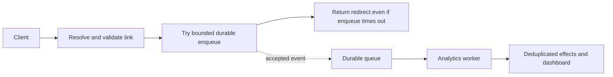

# Reference design — Redirect promptly and report analytics honestly

Author-written answer to [the assignment](README.md#assignment). [DESIGN.md](DESIGN.md) is
your independent practice. All timings and workload numbers below are planning assumptions,
not measured service performance.

## Assumptions and requirement

The product prioritizes redirects over exact analytics. Counts describe validated redirect
attempts, not completed page views, unique people, or billing events. Some event loss during
failure is acceptable and must be visible as degraded analytics quality. Choose a server-side
p95 redirect target of 100 ms and a healthy-operation dashboard freshness target of 60 seconds.
Neither target is a guaranteed bound on every request.

## Path and ownership

| Action | Placement | Reason |
| --- | --- | --- |
| Parse code, resolve link, check expiry and disabled state | Synchronous | Required to choose a valid destination |
| Create event ID and bounded event payload | Synchronous | Identify this attempt before handoff |
| Try durable enqueue for at most 5 ms | Synchronous, bounded wait | Improves capture without unbounded redirect delay |
| Location/device enrichment | Asynchronous consumer | Not required to choose destination |
| Aggregate counters and update dashboard | Asynchronous consumer | Derived results may lag |

Five milliseconds is a chosen enqueue timeout, leaving 95 ms of the nominal 100 ms target for
other work. This subtraction is a budget allocation, not percentile arithmetic or evidence
that the system meets p95. Enforce the overall request deadline as well as the enqueue timeout.
Use the existing redirect status and Location contract after a valid resolution; analytics
completion does not change the response to an HTTP 202 job.

**Line by line:** Resolution is mandatory. Enqueue is attempted before replying but its failure
does not block a valid redirect beyond the chosen wait. Only accepted queue records are eligible
for recovery. The analytics worker operates after that handoff.

## Lost-work and duplicate-work policy

If the worker crashes before enqueue, the event is lost. If enqueue times out, the queue may
have accepted the event but lost the acknowledgement; mark the outcome unknown. If enqueue is
known to fail, the redirect still proceeds and that event is dropped. Do not claim zero loss
from a volatile background task or an in-memory retry list. Telemetry records enqueue errors,
unknown outcomes, and known drops where possible; a crash can also lose telemetry, so it cannot
prove an exact total of missing events.

For acknowledged records, assume queue durability within its documented failure model and
at-least-once delivery. Retain pending events for a chosen 24 hours. A consumer transaction
inserts event_id into a unique processed-events table and applies the aggregate only if that
insert is new. Commit both together, then acknowledge delivery. A crash after commit but before
acknowledgement causes redelivery; the recorded ID prevents a second increment. Retain these
IDs for seven days and prohibit replay of older events without a separate rebuild procedure.
The longer deduplication window covers the chosen queue retention plus operational retries;
retention expiration still limits the guarantee. Terminally invalid events go to a bounded
quarantine for investigation rather than retrying forever.

## Capacity calculation and alternative

For an assumed 1,000 incoming events/second and 800 processed events/second, backlog grows by
200 events/second, or 12,000 events in one minute. At an assumed 200 bytes/event, that is
2,400,000 bytes of payload growth, excluding indexes, replicas, and queue overhead. Monitor
oldest-event age and sustained arrival/service rates. Set storage limits and alert before
retention expiry; a queue does not fix sustained under-capacity.

If analytics becomes billing-grade, reject this availability-first loss policy. A durable
handoff before acknowledging the tracked operation, or an atomic outbox with its authoritative
write, can prevent specific producer gaps but adds dependency and latency costs. Neither proves
that a browser received a response. Define which business event must be durable first.

## Self-review

The design states which work leaves the redirect path and where loss and duplicates remain.
It preserves valid redirects during analytics outages and explicitly sacrifices exact counts.
Next implementation checks: enqueue timeout after acceptance, consumer crash before and after
commit, duplicate delivery, poison records, and overload beyond the 60-second freshness target.
No queue was deployed or load-tested; [CONCEPTS.md](CONCEPTS.md) contains only an executed model.

Source: [Asynchronous Request-Reply pattern](https://learn.microsoft.com/en-us/azure/architecture/patterns/asynchronous-request-reply),
checked 2026-09-22, explains acceptance versus completion. The internal handoff and loss policy
above are a deliberate adaptation, not that source's full client polling pattern.
