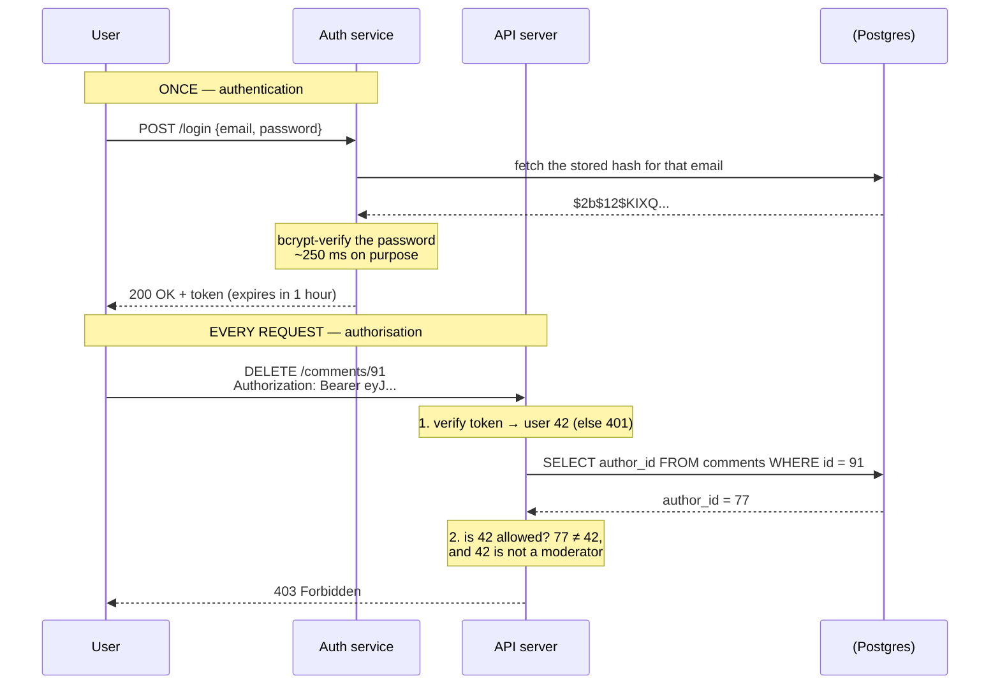

# Day 019 · System Design — Authentication and authorisation

**After today you can:** You can state the difference in one sentence and give a real example of each.

**The interviewer asks it as:** *What is the difference between authentication and authorisation?*

---

## 1. What this is, and why they ask it

**Authentication** answers *who are you?* **Authorisation** answers *what are you allowed to do?*
They are two separate checks, they happen in that order, and they fail in different ways — which is
exactly why `401` and `403` are two different status codes.

The words are so close that people use them interchangeably, and doing so in an interview is a
small, immediate tell. They are usually shortened to **authn** and **authz** for precisely this
reason.

It gets asked in three places. As a definition question in the first ten minutes of a design round,
where a crisp one-sentence answer plus a real example takes twenty seconds and buys goodwill. As a
required component of almost any design — every system with users has both, and forgetting to
mention them is a gap the interviewer will note. And as a probe with real depth: *"how do you store
passwords?"* has a right answer and several catastrophically wrong ones, and it is one of the very
few interview questions where a wrong answer is genuinely disqualifying for a backend role.

Today is the two checks and how each is really done. The token mechanics — sessions, JWT, OAuth —
are [day 020](../day-020-building-strings/README.md).

---

## 2. The story

Suhas is flying to Delhi at ten past six in the morning, which means leaving the house at half past
three, which means he has not really slept.

At the terminal door there is a jawan with a torch, and a queue of about twenty people shuffling
forward. When Suhas gets to the front he holds up his phone with the ticket on it in one hand and
his driving licence in the other. The jawan looks at the name on one, then the name on the other,
then at Suhas's face, and waves him through. Eleven seconds, and it is the only time all morning
that anybody looks at his licence.

Inside, he drops his bag and gets a pass on his phone — a code in a box, his name, the flight
number, seat 22C, gate 41. From that moment on, that little code is him. Nobody asks for the
licence again. Security scans the code. The man at the gate scans the code. The girl at the top of
the stairs looks at 22C and points left.

On the way to the gate he passes the lounge, and because it is quarter to five and he is tired he
walks up to it. The woman at the desk scans his code, looks at her screen and says, politely, that
this is an economy ticket and the lounge is for business class and card holders.

That is the bit worth noticing. She was not confused about who he was. His name was on her screen.
She could see his flight, his seat, everything. She knew exactly who he was and the answer was still
no — and those are two completely different sentences, said by two different people, at two
different doors.

Two more small things. The pass is only good for that flight, that morning. And when his colleague
messages later asking him to send a screenshot of the boarding pass so she can see the gate number,
Suhas sends it, and then thinks about it for a second — because the thing on his phone does not know
who is holding it. Anyone with that code, and nobody at the second door checking a licence, would be
treated as him.

---

## 3. The idea in plain English

Two doors, two questions.

- The jawan asks **who are you?** He compares something you are carrying against something you
  claim, and lets you into the building. That is **authentication**.
- The woman at the lounge asks **what are you allowed to do?** She already knows who you are. She is
  checking your ticket class against a rule. That is **authorisation**.

The one-sentence version, which is what you say in an interview:

> **Authentication is proving who you are. Authorisation is deciding what you may do. You
> authenticate once and you are authorised on every single request.**

That last clause is the part that separates a memorised answer from an understood one. Suhas showed
his licence once; his pass was scanned five times.

### The order, and the two failures

Authentication first, always. You cannot decide what somebody may do before you know who they are.

Which is why the two failures are different status codes, from
[day 018](../day-018-arrays-revision/README.md):

- **`401 Unauthorized`** — I do not know who you are. Send credentials. (Badly named: it means
  *unauthenticated*.)
- **`403 Forbidden`** — I know exactly who you are, and no. Sending credentials again will not help.

The lounge is a `403`. Turning up at the terminal with no licence at all is a `401`.

### How you prove who you are

Authentication rests on evidence, and there are only three kinds of it:

| Factor | Meaning | Examples |
|---|---|---|
| **Something you know** | a secret in your head | password, PIN |
| **Something you have** | a physical object | phone, security key, the OTP sent to your SIM |
| **Something you are** | a property of your body | fingerprint, face |

**Multi-factor authentication** (MFA) means requiring evidence of two *different* kinds. A password
plus a security question is not MFA — both are things you know, and both leak in the same breach. A
password plus a code from your phone is, because stealing the database does not put the attacker's
hand on your phone.

### Credentials once, then a token

Suhas showed his licence once and carried a code afterwards. Systems do the same, for two reasons:
sending a password on every request means it is exposed on every request, and checking a password
properly is deliberately slow (§5 explains why).

So the flow is:

1. The user sends username and password **once**, over HTTPS, to a login endpoint.
2. The server verifies them and issues a **token** — a session id or a signed token.
3. Every later request carries the token in the `Authorization` header.
4. The server verifies the token — fast — and now knows who is calling.

The token is a **bearer token**: whoever bears it is treated as the user. That is the screenshot
problem. It is why tokens must travel only over HTTPS, must expire, and must be revocable. The
mechanics are [day 020](../day-020-building-strings/README.md).

### How you decide what somebody may do

Authorisation is a rule, evaluated per request. There are four common shapes, in rising order of
power and complexity.

**Ownership.** The simplest and by far the most common: *you may edit this comment if you wrote it.*
One comparison, `comment.author_id == current_user.id`. Most product features need nothing more.

**Access control list (ACL).** A list attached to each object saying who may do what. This is how a
shared document works — "Priya can edit, Ravi can view". Precise, and it grows: a million documents
with ten entries each is ten million rows to store and check.

**Role-based access control (RBAC).** Users get roles; roles carry permissions. *Admins may delete
any comment. Moderators may hide one. Members may write one.* This is what most companies run on,
because it matches how organisations actually think, and adding a person to a team grants the whole
set at once.

**Attribute-based access control (ABAC).** The decision is computed from attributes of the user, the
object and the context. *A doctor may read a patient record if they are on that patient's care team,
during their shift, from a hospital network.* Maximum expressiveness, and much harder to reason
about — you can no longer answer "who can see this?" by reading a list.

Suhas's lounge is RBAC: his ticket class is his role, and the lounge has a rule about roles.

### The one rule that matters more than the model

**The check happens on the server, on every request, without exception.** Hiding the delete button
in the interface is a courtesy to the user, not a security control — anyone can send the request
directly. If the only thing stopping a user from deleting somebody else's comment is that the button
is not shown, you have no authorisation at all.

The most common real-world failure of this is called **insecure direct object reference**: the
endpoint checks that you are logged in, fetches `/orders/1055`, and never checks that order 1055 is
yours. Changing the number in the address then shows you someone else's order. It is authentication
without authorisation, and it is one of the most frequently exploited flaws on the web.

---

## 4. The picture

The two doors:

```
   AUTHENTICATION                          AUTHORISATION
   "who are you?"                          "what may you do?"
   ---------------------------             ---------------------------
   happens ONCE, at login                  happens on EVERY request
   checks a secret you supplied            checks a rule about you
   fails with 401                          fails with 403
   answer: an identity                     answer: yes or no
   the jawan at the door                   the woman at the lounge

           |                                        |
           v                                        v
   +---------------+   token   +--------------------------------+
   |  login once   | --------> |  every request from now on     |
   +---------------+           +--------------------------------+
```

**What to notice:** the arrow is one-way and crosses once. Everything to the right of it happens
thousands of times per user. That asymmetry is why password checking is allowed to be slow and token
checking must be fast.

The full flow of one authenticated, authorised request:



**What to notice:** two numbered checks inside the server, and they can fail independently. A missing
or expired token stops you at step 1 with a `401`. A valid token belonging to the wrong person stops
you at step 2 with a `403`. Skipping step 2 entirely is the insecure-direct-object-reference bug, and
the request would have succeeded.

---

## 5. How it actually works

### Storing passwords — the part with a wrong answer

This is the highest-stakes question in the topic. The rules, in order of severity:

**Never store the password.** Not encrypted either — encryption is reversible, so whoever holds the
key holds every password.

**Store a hash.** A hash turns the password into a fixed-size value that cannot be reversed. On
login you hash what was typed and compare with what is stored.

**Never a fast hash.** MD5, SHA-1 and plain SHA-256 are designed to be *fast*, which is precisely
wrong here. A modern GPU computes billions of SHA-256 hashes a second, so an eight-character
password falls in minutes.

**Use a slow hash designed for passwords: bcrypt, scrypt, or Argon2id.** These are deliberately
expensive and have a tunable **work factor**. Argon2id is the current recommendation; bcrypt is
everywhere and fine.

**Salt every password.** A **salt** is a random value stored alongside the hash and mixed in before
hashing, so two users with the same password get different hashes. Without it, an attacker
precomputes hashes of common passwords once — a **rainbow table** — and cracks every matching
account at once. bcrypt and Argon2 generate and embed the salt for you; that is one reason to use
them rather than assembling something yourself.

A stored bcrypt hash looks like this, with the parts labelled:

```
$2b$12$LQv3c1yqBWVHxkd0LHAkCOYz6TtxMQJqhN8/LewKyPHi4Yk8Ck0Ka
 |   |  |                     |
 |   |  +-- 22-char salt      +-- the hash itself
 |   +----- cost factor 12  =  2^12 = 4096 rounds
 +--------- algorithm: bcrypt
```

**Compare in constant time.** Comparing hashes with `==` can leak information through how long the
comparison takes. Use `hmac.compare_digest` in Python, or the library's own verify function, which
does this for you.

**Never write it yourself.** Use `bcrypt`, `argon2-cffi`, or your framework's built-in — Django,
Rails and Spring Security all ship correct implementations.

### The login flow, concretely

1. `POST /login` with email and password, over HTTPS. Never `GET`, because addresses land in logs
   and browser history.
2. Look up the user. **If the email does not exist, still perform a hash comparison against a dummy
   value** before failing, so the response time does not reveal which emails are registered.
3. Verify with the library's function.
4. On failure, return `401` with a deliberately vague message — *"invalid email or password"*, never
   *"no account with that email"*.
5. Rate limit by IP and by account. Five attempts a minute stops credential stuffing dead.
6. On success, issue a token with an expiry and return it.

### Sessions or tokens

Two ways to carry identity after login, covered properly on
[day 020](../day-020-building-strings/README.md):

- **Server-side session.** The server stores a record and gives the client an opaque id in a cookie.
  Every request looks it up — in Redis, typically. Revoking is instant: delete the record.
- **Self-contained token (JWT).** The token carries the identity and expiry and is signed, so any
  server can verify it with a key and no lookup. Faster and stateless; revoking before expiry is the
  hard part.

Cookie flags, if you use cookies, and these get asked: **`HttpOnly`** so JavaScript cannot read the
cookie, which limits the damage of a script-injection flaw; **`Secure`** so it is only ever sent over
HTTPS; and **`SameSite=Lax`** or **`Strict`** so another site cannot cause the browser to send it,
which is the defence against cross-site request forgery.

### Implementing authorisation

The RBAC data model is three tables and worth being able to sketch:

```
users ──< user_roles >── roles ──< role_permissions >── permissions
                                    e.g. "comment:delete", "post:publish"
```

A permission check becomes: *does any role of this user grant this permission?* Cache the resolved
permission set on the session or token so it is not a database round trip on every request — and
accept that a permission revoked mid-session takes effect only when the cache expires, which is a
trade you should state.

For ownership checks — the common case — do it in the query rather than after it:

```sql
-- good: the check is the query, so a wrong id returns nothing
UPDATE comments SET body = $1 WHERE id = $2 AND author_id = $3;

-- risky: fetch, then remember to check
SELECT * FROM comments WHERE id = $2;
```

The first form cannot be forgotten. The second relies on the next developer remembering, and one day
they will not.

### Real systems to name

**AWS IAM** is the reference implementation of policy-based authorisation, and it is worth knowing
its shape: a policy is a JSON document listing principal, action, resource and condition, with an
explicit deny always winning. **Open Policy Agent** is the open-source equivalent for your own
services. **Auth0**, **Okta**, **Keycloak** and **AWS Cognito** are hosted identity providers you
would use rather than building login yourself. **Google Zanzibar** is the paper behind
relationship-based authorisation at Google Docs scale, and naming it signals you have read beyond
the basics.

---

## 6. The numbers

### Why password hashing is deliberately slow

bcrypt at cost factor 12 takes roughly **250 ms** on a modern core. That is enormous by server
standards, and it is the point.

**For the attacker.** With a stolen database:

```
plain SHA-256 on a good GPU : ~10,000,000,000 guesses/second
bcrypt cost 12              : ~4 guesses/second per core
```

That is a factor of about **2.5 billion**. A password that falls to SHA-256 in one second holds out
against bcrypt for roughly eighty years. This single comparison is the entire argument, and it is
worth having the two numbers ready.

**For you.** 250 ms per login limits how many logins one core can serve:

```
1 core        = 1 ÷ 0.25 = 4 logins/second
16 cores      = 64 logins/second
```

So a service with 10 million users where 5% log in on a given day, concentrated into the busiest
hour:

```
10,000,000 × 0.05        = 500,000 logins/day
peak hour ≈ 25% of them  = 125,000 logins in 3,600 s ≈ 35 logins/second
35 ÷ 4                   ≈ 9 cores busy on hashing alone
```

Nine cores doing nothing but bcrypt. That is affordable and it is why login is usually its own
service with its own scaling — and why you must never put a 250 ms operation on a path that runs on
every request. **Authentication is expensive and rare; authorisation is cheap and constant.**

### Choosing the work factor

The standard rule: pick the highest cost your hardware can serve at peak, targeting 200–500 ms.
Because bcrypt's cost is a power of two, each increment doubles the work:

```
cost 10 ≈  60 ms      cost 12 ≈ 250 ms      cost 14 ≈ 1,000 ms
```

Hardware gets faster, so the number has to rise over time — it was 8 in 2000 and 12 or 13 today.
Re-hash on next successful login when you raise it.

### Session storage

10 million users, 20% with a live session, about 200 bytes each:

```
10,000,000 × 0.20 × 200 bytes = 400 MB
```

400 MB in Redis. Trivial — which is a useful counter to the claim that stateless tokens are
necessary for scale. They are chosen for latency and independence, not because sessions do not fit.

### The cost of the permission check

An RBAC lookup hitting the database on every request, at 3,700 requests a second and 1 ms per query:

```
3,700 × 1 ms = 3.7 seconds of database time per second
```

Which means at least four cores of your database doing nothing but permission checks. Caching the
resolved permissions on the session for 5 minutes cuts it to near zero, at the cost of a revocation
taking up to 5 minutes to bite. That is the trade, stated with numbers.

---

## 7. The trade-offs

### Session or token

Server-side sessions give instant revocation and small requests, and cost one lookup per request
plus a store that every server must reach. Self-contained tokens need no lookup and no shared store,
and in exchange you cannot revoke one before it expires without reintroducing exactly the shared
state you removed. The usual resolution is both: short-lived tokens for ordinary requests plus a
server-side record for refresh and revocation. Full treatment tomorrow.

### RBAC or ABAC

RBAC is comprehensible. You can answer "who can delete a comment?" by reading a table, and that
matters enormously during an audit or an incident. It also gets coarse — you end up inventing
`moderator_south_region_readonly` roles, which is the smell that your model has run out. ABAC
expresses those rules directly and makes the system much harder to reason about, because the answer
to "who can see this?" is now a computation over attributes rather than a list. **Start with RBAC
plus ownership checks, and reach for ABAC only when the rules genuinely depend on context.**

### How strict to make MFA

MFA stops essentially all credential-stuffing attacks, and it also costs you users at signup and
generates support load when people change phones. The usual compromise is risk-based: require the
second factor for new devices, unusual locations and sensitive operations, and not for routine
logins. And SMS is the weakest second factor — SIM swapping is a real, common attack — so prefer an
authenticator app or a hardware key where the stakes justify it.

### Build or buy

Building login yourself means owning password storage, reset flows, MFA, rate limiting, session
management and every future protocol change. Using Auth0, Cognito or Keycloak means paying per user
and depending on a third party for the ability to log in at all. **For most teams, buy.** The one
strong reason to build is a genuinely unusual identity model that a provider cannot express.

### The sentence that separates candidates

> **I would not build my own authentication if** the product does not sell identity. Password
> storage, reset tokens, MFA enrolment, session revocation and account recovery each have a way to
> get them subtly wrong, and the failure mode is a breach rather than a bug report. I would buy the
> authentication and write the authorisation myself — because authorisation encodes what my product
> actually means, and nobody else can express that for me.

---

## 8. In the interview

### How it gets asked

- *"What is the difference between authentication and authorisation?"* — the definition, in the
  first ten minutes. Twenty seconds, with an example.
- *"How would you store passwords?"* — the one where a wrong answer genuinely costs you the role.
- *"When would you return 401 versus 403?"* — the same idea in status-code form.
- *"How would you make sure a user can only see their own orders?"* — the applied version, and the
  one where the insecure-direct-object-reference answer earns real credit.

### What to say out loud, in the first ninety seconds

1. **The one-sentence definition.** *"Authentication is proving who you are. Authorisation is
   deciding what you're allowed to do."*
2. **The asymmetry, immediately.** *"You authenticate once, at login. You're authorised on every
   single request after that."*
3. **A concrete example.** *"At an airport, showing your ID at the door is authentication. Being
   turned away from the business lounge with an economy ticket is authorisation — they know exactly
   who you are, the answer is still no."*
4. **Tie it to the codes.** *"That's why 401 and 403 are different. 401 means I don't know who you
   are, despite the name — it really means unauthenticated. 403 means I do know, and no."*
5. **Say how identity is carried.** *"Credentials go over the wire once, and after that the client
   carries a token. Password checking is deliberately expensive, so you can't do it per request."*
6. **Name your authorisation model.** *"For most features it's an ownership check — you may edit
   this because you wrote it. Beyond that, roles and permissions. I'd only go to attribute-based
   rules when the decision genuinely depends on context."*
7. **State the rule that matters.** *"And the check is always on the server, on every request.
   Hiding a button is a courtesy, not a control."*

### The follow-ups

**"How do you store passwords?"**
Never in plain text and never encrypted, because encryption is reversible and whoever holds the key
holds every password. Store a hash, and specifically a slow hash designed for passwords — Argon2id
by preference, bcrypt if that is what the stack has. Not MD5, SHA-1 or plain SHA-256: those are
built to be fast, and a GPU does billions of SHA-256 guesses a second while bcrypt at cost 12 does
about four per core. Each password gets its own random salt, stored alongside the hash, so identical
passwords produce different hashes and precomputed rainbow tables are useless — bcrypt and Argon2
handle the salt for you. Tune the work factor to about 250 ms on your hardware, raise it over the
years, and re-hash on next login when you do. Compare using the library's verify function so the
comparison is constant-time. And I would not implement any of this by hand.

**"When do you return 401 and when 403?"**
`401` when I cannot establish who is calling — no credentials, a malformed token, an expired token.
The correct response to a `401` is to authenticate and try again, and the response should carry a
`WWW-Authenticate` header saying how. `403` when I know exactly who is calling and they are not
permitted — retrying with the same identity will never work. One genuine subtlety: if the mere
existence of the resource is sensitive, such as a private repository, returning `403` confirms it
exists, so many APIs deliberately return `404` instead to avoid leaking that. For public resources
`403` is the honest answer.

**"How do you make sure a user only sees their own orders?"**
The check goes in the query, not after it: `SELECT * FROM orders WHERE id = $1 AND user_id = $2`, so
another user's id simply returns nothing. The version I would avoid is fetching by id and then
checking ownership in code, because that relies on every developer remembering every time, and the
day someone forgets you have an insecure direct object reference — the endpoint verifies you are
logged in but not that the object is yours, so changing the number in the URL shows someone else's
order. It is one of the most exploited flaws on the web precisely because the code looks fine. I
would also use non-sequential identifiers such as UUIDs, which does not fix the flaw but stops an
attacker enumerating every order by counting.

**"Where does OAuth fit into this?"**
OAuth 2.0 is an **authorisation** framework, despite being what people mean when they say "log in
with Google". Its actual job is delegated access: letting one application act on a user's behalf at
another service, with a limited scope, without ever seeing the password. The authentication layer on
top is OpenID Connect, which adds an identity token saying who the user is. That distinction gets
asked, and getting it right — OAuth is authz, OIDC is authn — is a good signal. The mechanics are
tomorrow's lesson.

### A model answer

> "Authentication is proving who you are. Authorisation is deciding what you're allowed to do. They
> are two different checks and they happen in that order — you can't decide what someone may do
> before you know who they are.
>
> The example I like is an airport. At the terminal door a guard compares your ID against your
> ticket and your face. That's authentication, and it happens once. Later you walk up to the business
> lounge and they scan your pass and turn you away, because you're in economy. That's authorisation.
> They know exactly who you are — your name is on their screen — and the answer is still no. Two
> different questions, two different doors.
>
> That's exactly why HTTP has two codes. 401 means I don't know who you are — it's badly named, it
> really means unauthenticated, and the fix is to send credentials. 403 means I know precisely who
> you are and you may not do this, so sending credentials again is pointless.
>
> The other thing worth saying is the asymmetry. You authenticate once and you're authorised on every
> request. That matters practically: verifying a password should be deliberately slow — bcrypt or
> Argon2 at around 250 milliseconds, which is what makes a stolen database useless to an attacker —
> and you obviously cannot afford 250 milliseconds on every request. So the login exchanges the
> password for a token, and every subsequent request carries the token, which is cheap to verify.
>
> For the authorisation itself, most features need only an ownership check: you may edit this comment
> because you wrote it. Beyond that I'd use roles and permissions, because you can answer 'who can
> delete a comment?' by reading a table, which matters during an audit. I'd only reach for
> attribute-based rules — where the decision is computed from context like time, location or team
> membership — when the requirements genuinely need them, because they're much harder to reason
> about.
>
> And the rule underneath all of it: the check happens on the server, on every request. Hiding the
> delete button is a courtesy to the user, not a security control. The classic failure is an endpoint
> that verifies you're logged in but never verifies the object belongs to you — you change the id in
> the URL and read someone else's order. I'd prevent that by putting the ownership condition into the
> query itself, so it cannot be forgotten."

---

## 9. Recall card

- **Authn = who are you. Authz = what may you do.** Authn once, authz on every request.
- **`401` = I don't know you** (unauthenticated). **`403` = I know you, and no.**
- **Passwords: salted Argon2id or bcrypt at ~250 ms.** Never plaintext, never encrypted, never
  MD5/SHA-256.
- **Authorisation models:** ownership → ACL → RBAC → ABAC. Start with ownership plus roles.
- **The check is server-side, every request, in the query where possible.** Hiding the button is not
  a control.
