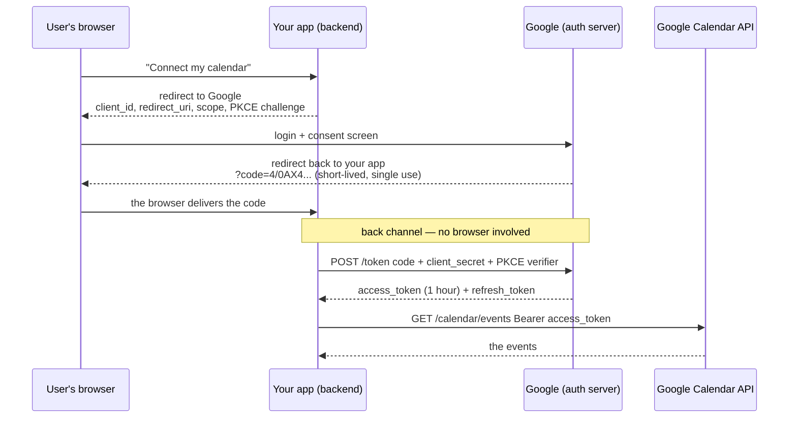

# Day 020 · System Design — JWT, sessions, and OAuth

**After today you can:** You can explain how a user stays logged in, three different ways, and compare them.

**The interviewer asks it as:** *How do you keep a user logged in across requests?*

---

## 1. What this is, and why they ask it

Yesterday's lesson ended on an unfinished sentence. HTTP is **stateless** — from
[day 016](../day-016-2d-arrays/README.md), each request arrives knowing nothing about the last one —
so after a user types their password successfully, what stops them having to type it again on the
very next click?

The answer is that the server hands out a **credential for later**, and the client presents it on
every subsequent request. There are three common shapes for that credential and they trade off
differently:

- a **session id** — an opaque reference, meaningless by itself, that the server looks up;
- a **JWT** — a self-contained signed token that carries the facts inside it, so no lookup is needed;
- **OAuth 2.0 and OpenID Connect** — a protocol for getting one of the above from *somebody else*,
  so a user can log in with Google without your service ever seeing their password.

Interviewers ask this constantly, and the question has a quality filter built in. "Use JWTs, they're
stateless and they scale" is the answer of somebody who has read a blog post. "It depends on whether
you need instant revocation, and here is what I would actually do" is the answer of somebody who has
operated one. The revocation problem is the heart of the topic, and it is what they are waiting to
hear you raise.

---

## 2. The story

The gym Rohit joined in January is on the first floor above a bank, and it is run by a man called
Salim who sits at a desk by the stairs.

The first time Rohit went, it took twenty minutes. Salim typed his name, his phone number and his
address into the shop tablet, took a photo of him, took three months' money, and gave him a small
plastic card with a number on it. 0412. Nothing else on the card. Not his name, not the dates he had
paid for, not whether he was on the three-month plan or the annual one. Just 0412.

Every morning after that Rohit holds the card up as he comes past the desk. Salim glances at it,
types 0412 into the tablet, sees the screen come back with Rohit's photo and *paid till 31 March*,
and nods. It takes two seconds. All the real information lives on Salim's tablet; the card is only a
way of pointing at it.

That has one very useful property. When a member stopped paying in February, Salim did not have to
find him or get the card back. He changed one line on the tablet and the card became worthless the
same morning, while still sitting in the man's pocket.

The gym across the road works differently, and Rohit's friend goes there. They give you a printed
band for your wrist with everything on it — your name, your plan, and the date it runs out — and a
small holographic sticker that is hard to fake. The man at their door does not look anything up. He
reads the band, checks the sticker looks right, checks the date has not passed, and waves you in.
Faster, and it works even on the days their computer is down.

But Rohit's friend told him what happened when someone's cheque bounced in March. They could not do
anything about the band. It said *valid till 30 June* and it looked perfectly genuine, because it
was. The man on the door had no way to know, and no list to check against, and the whole point of
those bands is that he does not have to have one. They had to wait until the end of June, or stand
there arguing with him every morning.

---

## 3. The idea in plain English

Rohit's plastic card is a **session id**. His friend's wristband is a **JWT**. The whole comparison
is in those two paragraphs, and the difference is where the truth lives.

### The session: a reference the server looks up

A **session** is a record the server keeps about a logged-in user. After a successful login the
server creates it, gives it a long random id, and sends only the **id** to the client.

```
Set-Cookie: session=8f2a9c1e4b7d0364...; HttpOnly; Secure; SameSite=Lax
```

That string means nothing on its own — it is Salim's 0412. On every request the server takes the id,
looks the record up in a shared store, and gets back who the user is, when they logged in, and what
they may do.

**The store** is almost always Redis, because the lookup is on the path of every single request and
must be fast. It can be Postgres for smaller systems. It has to be reachable by every server, or you
are back to sticky sessions and the scaling problem from [day 016](../day-016-2d-arrays/README.md).

**Logging out** — or banning a user, or forcing a password change — is one delete. The next request
finds nothing and gets a `401`. That instant, complete revocation is the whole reason sessions still
dominate.

### The JWT: a token that carries the facts

A **JWT** — JSON Web Token, said "jot" — is a string containing the facts themselves, signed so that
it cannot be altered. Three parts separated by dots:

```
eyJhbGciOiJIUzI1NiIsInR5cCI6IkpXVCJ9 . eyJzdWIiOiI0MiIsImV4cCI6MTc2N30 . 4Xr9dQ2v...
        header                                    payload                    signature
```

Each part is base64-encoded JSON. Decoded:

```json
// header — how it was signed
{ "alg": "RS256", "typ": "JWT" }

// payload — the "claims"
{ "sub": "42", "name": "Rohit", "role": "member",
  "iat": 1767200000, "exp": 1767203600, "iss": "auth.example.com" }
```

Two things about the payload that get asked and are frequently got wrong:

**It is encoded, not encrypted.** Base64 is not a secret — anyone holding the token can read every
claim in it. Paste one into jwt.io and it shows you the contents. **Never put anything sensitive in
a JWT payload.**

**The signature is what makes it trustworthy.** It is computed over the header and payload using a
key only the issuer has. Change one character of the payload and the signature no longer matches, so
the server rejects it. That is the holographic sticker: it does not hide what the band says, it
proves nobody rewrote it.

The standard claims are worth knowing by name: `sub` (subject — who it is about), `exp` (expiry),
`iat` (issued at), `iss` (issuer), `aud` (audience — which service it is for).

**Verification needs no lookup.** The server checks the signature with its key, checks `exp` has not
passed, and now knows who is calling. No Redis, no database, no shared state. That is the whole
advantage, and it is a real one — it is why a system split across many services likes JWTs, since
each service can verify independently.

### The problem, which is the point of the lesson

**You cannot un-issue a JWT.** It is valid until it expires, because validity is a property of the
token itself and not of any list. Ban a user and their token keeps working. Change a password after
a laptop is stolen and the stolen token keeps working. That is the bounced cheque and the wristband
that says *valid till 30 June*.

Every fix reintroduces state:

- **Short expiry plus refresh tokens.** Access tokens live 5–15 minutes; a long-lived refresh token,
  stored server-side and revocable, is exchanged for new ones. Damage from a stolen token is bounded
  by the expiry, and revocation takes effect within that window. **This is what almost everyone
  actually does.**
- **A denylist of revoked token ids.** Every request checks it — which is a lookup on every request,
  which is the thing you removed sessions to avoid. It is smaller than a session store, because it
  only holds revoked tokens until they expire, but it is not stateless.

So the honest summary, and it is a good sentence to say out loud: **a JWT trades instant revocation
for statelessness, and the standard mitigation gives some of the revocation back by making the
window short.**

### OAuth 2.0: getting a token from somebody else

The third shape answers a different question: how does an application act on a user's behalf at
*another* service, without ever seeing their password?

That is **OAuth 2.0**, and — this is the distinction interviewers check — it is an **authorisation**
framework, not an authentication one. Its output is an access token that grants limited permission,
not a statement of who somebody is.

Four parties:

| Role | Who it is, concretely |
|---|---|
| **Resource owner** | the user |
| **Client** | your application |
| **Authorisation server** | Google's login and consent screen |
| **Resource server** | the Google API holding their calendar |

The flow, for the version you should describe — **authorisation code with PKCE**:

1. Your app sends the user to Google with a `client_id`, a `redirect_uri`, the **scopes** you want
   (`calendar.readonly`), and a hashed one-time secret (the PKCE challenge).
2. Google authenticates the user itself and shows the consent screen: *"This app wants to read your
   calendar."*
3. Google redirects the browser back to your app with a short-lived **authorisation code**.
4. Your app's **backend** exchanges that code — plus its client secret and the PKCE verifier — for an
   access token, over a direct server-to-server call.
5. Your app calls Google's API with the access token.

**Why the extra hop through a code?** Because step 3 travels through the user's browser, where it
lands in history and logs. A code is single-use and useless without the client secret, so intercepting
it gains nothing. The token itself never touches the browser's address bar.

**Where "Log in with Google" fits.** OAuth alone tells you nothing about *who* the user is — only
that you were granted access to something. **OpenID Connect** (OIDC) is a thin layer on top that adds
an `id_token`, a JWT describing the user, and a `/userinfo` endpoint. So: **OAuth is authorisation,
OIDC is authentication, and "Log in with Google" is OIDC.** That single sentence answers one of the
most common follow-ups in this topic.

---

## 4. The picture

Where the truth lives — the entire comparison in one diagram:

```
   SESSION (the plastic card)                JWT (the wristband)
   --------------------------                --------------------
   client holds:  8f2a9c1e...                client holds:  eyJhbGci...eyJzdWIiOiI0MiJ9...sig
                  (meaningless)                             (readable: sub=42, exp=..., role=member)

   server does:   look it up                 server does:   check the signature
                  |                                          |
                  v                                          v
              +--------+                              (no lookup at all)
              | Redis  |  <- the truth lives HERE      the truth lives IN THE TOKEN
              +--------+

   revoke:        DELETE the record  -> instant       revoke:  ...you cannot.
   cost:          1 network hop per request           cost:    a signature check (microseconds)
   size on wire:  ~32 bytes                           size:    ~500-1000 bytes, every request
```

**What to notice:** the arrow. In the left-hand column every request reaches back to a shared store,
which costs a hop and buys instant control. In the right-hand column nothing is reached back to,
which is faster and means there is nowhere to press the off switch.

The OAuth authorisation-code flow, which is worth being able to draw:



**What to notice:** the note in the middle. Everything above it goes through the user's browser and
is therefore visible; everything below it is a direct server-to-server call. The access token only
ever exists below that line. That split is the reason the flow has a code step at all, and saying so
is what distinguishes understanding it from having memorised it.

---

## 5. How it actually works

### Sessions, concretely

**On login:** generate a cryptographically random id — at least 128 bits, from `secrets.token_urlsafe`
in Python, never from `random` — and store a record:

```
key:   session:8f2a9c1e4b7d0364
value: {"user_id": 42, "created": 1767200000, "last_seen": 1767203100,
        "ip": "49.207.x.x", "user_agent": "..."}
TTL:   30 days  (sliding, refreshed on activity)
```

**On each request:** read the cookie, look up the key, `401` if it is missing or expired, otherwise
attach the user to the request.

**On logout:** delete the key.

**The cookie flags**, all three of which get asked:

- **`HttpOnly`** — JavaScript cannot read it, so a cross-site scripting flaw cannot steal it.
- **`Secure`** — only ever sent over HTTPS, so it cannot be sniffed on a café network.
- **`SameSite=Lax`** (or `Strict`) — another site cannot cause the browser to send it, which is the
  defence against cross-site request forgery.

**Rotate the id on privilege change.** Issue a fresh session id at login and after a password change,
and delete the old one. Otherwise an attacker who plants a known id in a victim's browser
beforehand — **session fixation** — is holding a valid session the moment the victim logs in.

Real implementations: Django's `django.contrib.sessions`, Rails' `ActionDispatch::Session`,
Express with `express-session` and `connect-redis`, Spring Session.

### JWTs, concretely

**Signing algorithm.** `HS256` uses one shared secret for both signing and verifying, which means
every service that can verify can also forge. `RS256` uses a private key to sign and a public key to
verify, so services can verify without being able to issue. **For anything beyond one service, use
RS256** — and be able to say why.

**Verification, in order:** check the signature; check `exp`; check `iss` and `aud` are what you
expect. Skipping the last two is a real vulnerability, because a token issued by the same provider
for a different application would otherwise be accepted.

**The `alg: none` attack**, which is the famous one. Early libraries read the algorithm out of the
token's own header and trusted it, so an attacker could set `"alg": "none"`, strip the signature, and
be believed. The fix is to configure the expected algorithm on the server and refuse anything else —
never take it from the token. Any interview question about JWT weaknesses is fishing for this.

**Refresh tokens.** The pattern almost everyone lands on:

```
access token   JWT, 15 minutes, stateless, sent on every request
refresh token  opaque random string, 30 days, stored server-side, revocable,
               sent only to /auth/refresh
```

The access token is checked with no lookup on thousands of requests; the refresh token is looked up
a handful of times a day. **You get the performance of stateless verification and keep a switch to
turn a user off — within fifteen minutes.** Rotate the refresh token on every use and invalidate the
old one, so a stolen refresh token is detectable: if an old one is presented, both are revoked.

**Where to store a JWT in a browser.** `localStorage` is readable by any script on the page, so a
single XSS flaw hands over the token. An `HttpOnly` cookie is not readable by script, but is sent
automatically, which reintroduces CSRF and needs `SameSite`. The usual recommendation is the cookie
with `HttpOnly`, `Secure` and `SameSite`, because XSS is far more common than CSRF and CSRF has a
simple, complete defence. There is a real argument here and having a position on it is what matters.

Real libraries: `PyJWT`, `jsonwebtoken` for Node, `jjwt` for Java. Auth0, Okta, Cognito and Keycloak
all issue JWTs.

### OAuth, concretely

**Scopes** are the permissions you request — `calendar.readonly`, `repo`, `email`. Ask for the
minimum; a consent screen requesting everything loses users.

**The grant types**, and which to use:

| Grant | Use |
|---|---|
| **Authorisation code + PKCE** | Everything user-facing. Web apps, mobile apps, single-page apps. |
| **Client credentials** | Machine to machine, no user involved. |
| **Device code** | TVs and consoles — "go to this URL and enter this code". |
| **Implicit** | **Deprecated.** Returned the token in the browser URL. Do not use. |
| **Password grant** | **Deprecated.** The app handled the user's password, defeating the point. |

Knowing that the last two are deprecated, and why, is a strong signal — they are still in a lot of
older tutorials.

**PKCE** — Proof Key for Code Exchange, said "pixie" — was originally for mobile apps that cannot
hold a client secret, and is now recommended for all clients. The app generates a random verifier,
sends its hash up front, and presents the verifier when exchanging the code. An intercepted code is
useless without it.

---

## 6. The numbers

Take an API at **10,000 requests per second** at peak.

### The cost of the session lookup

Every request does one Redis round trip, about **0.5 ms** inside a data centre.

```
10,000 req/s × 0.5 ms = 5 seconds of waiting per second
```

That is 5 concurrent operations in flight at all times — nothing for Redis, which handles well over
100,000 operations a second on one node. But it is 0.5 ms added to **every** response, and one more
component that must be up for anybody to log in.

### The cost of JWT verification

An `RS256` signature check is roughly **0.1 ms** of CPU, with no network at all.

```
10,000 req/s × 0.1 ms = 1 second of CPU per second = 1 core
```

One core, no dependency, no network hop. That is a genuine improvement — **five times less latency
added and one fewer thing that can be down** — and it is the honest case for JWTs.

### The cost on the wire

```
session cookie : ~32 bytes
JWT            : ~800 bytes
difference     : ~768 bytes per request

10,000 req/s × 768 bytes = 7.7 MB/s = 663 GB/day of extra inbound traffic
```

Two thirds of a terabyte a day of pure overhead. Usually irrelevant, and occasionally not — on
mobile, that header is retransmitted on every request over a connection where uplink is scarce. And
JWTs grow: put a list of permissions in the payload and 800 bytes becomes 4 KB, at which point some
proxies start rejecting the header outright. **Keep the payload small** is a practical rule with
arithmetic behind it.

### Session storage

10 million users, 20% with a live session, ~200 bytes each:

```
10,000,000 × 0.20 × 200 bytes = 400 MB
```

400 MB in Redis. This number is worth carrying, because "sessions don't scale" is a common claim and
the arithmetic simply does not support it. Sessions cost a hop, not a capacity problem.

### The revocation window

This is the number that decides the design.

```
access token lifetime 15 min  ->  a banned user keeps access for up to 15 minutes
access token lifetime  5 min  ->  up to 5 minutes, and 3x more calls to /auth/refresh
session                       ->  0 seconds
```

With 10 million users and 15-minute tokens, refresh traffic is:

```
10,000,000 active-ish users ÷ 900 seconds ≈ 11,000 refresh calls/second
```

which is a serious load in its own right — and every one of those is a lookup against the revocable
refresh-token store. **So the "stateless" system is doing 11,000 stateful lookups a second anyway.**
Working that out out loud is the strongest possible version of this answer.

---

## 7. The trade-offs

### Sessions

**You get** instant revocation, small requests, and the ability to see and end every active session —
which users increasingly expect ("log out my other devices").

**You pay** a lookup on every request, and a store every server must reach. If Redis is down, nobody
is logged in — so it needs replication, and now you have a distributed system to operate.

### JWTs

**You get** verification with no lookup and no shared store, which suits many services verifying
independently, and works across service boundaries without each one calling an auth service.

**You pay** with revocation you do not have, tokens you cannot shorten once issued, a payload that
can go stale — a role changed five minutes ago is still whatever the token says — and several
hundred bytes on every request. And the failure modes are sharp: `alg: none`, an unchecked `aud`, a
leaked `HS256` secret.

### OAuth and OIDC

**You get** no password handling at all, users who trust the Google consent screen more than your
login form, and a signup with no form to fill in.

**You pay** a dependency on someone else's uptime and policy, a genuinely fiddly flow with real
security pitfalls, and a user who loses their Google account losing yours. And you still need your
own account model underneath, because users will want to link two providers and still be one person.

### The sentence that separates candidates

> **I would not use JWTs for a first-party web session.** Sessions with Redis are simpler, revocation
> is instant and free, the store is 400 MB for ten million users, and the extra half-millisecond is
> not the bottleneck in any product I have worked on. I reach for JWTs when the verifier genuinely
> cannot call back to a central store — many independent services, or a partner API — and even then I
> use short-lived access tokens with revocable refresh tokens, which means I am running a session
> store after all. **The honest framing is that "stateless auth" mostly moves the state rather than
> removing it.**

---

## 8. In the interview

### How it gets asked

- *"How do you keep a user logged in across requests?"* — the direct version. HTTP is stateless, so
  something must be carried on each request.
- *"Sessions or JWTs? Which would you pick and why?"* — where the whole answer is revocation.
- *"What's inside a JWT? Is it encrypted?"* — the check on whether you know base64 is not encryption.
- *"Walk me through Log in with Google."* — asking for the authorisation-code flow, and quietly
  checking whether you know OAuth is authorisation and OIDC is authentication.
- *"A user's laptop is stolen. How do you log them out everywhere?"* — the same question wearing a
  scenario, and a gift if you have prepared.

### What to say out loud, in the first ninety seconds

1. **Start from the constraint.** *"HTTP is stateless, so the client has to present something on
   every request. The question is what that something is and where the truth about it lives."*
2. **Give the two shapes in one sentence each.** *"Either an opaque session id that the server looks
   up in a shared store — so all the truth is server-side — or a signed token that carries the facts
   itself, so no lookup is needed."*
3. **Name the trade immediately.** *"The trade is revocation against a lookup. Deleting a session is
   instant; a JWT is valid until it expires and there is no way to un-issue it."*
4. **Say the numbers.** *"A session lookup is about half a millisecond of Redis; a signature check is
   about a tenth of a millisecond of CPU. Ten million users' sessions is around 400 MB, so the
   'sessions don't scale' claim doesn't really survive the arithmetic."*
5. **State what you would build.** *"For a first-party web app, sessions in Redis. For many services
   or an external API, short-lived JWTs — 15 minutes — plus a revocable refresh token."*
6. **Close the loop honestly.** *"And I'd point out that the refresh token is server-side and
   revocable, so the stateless design still has a session store in it. It moves the state rather than
   removing it."*
7. **Mention the cookie flags, unprompted.** *"Whatever I carry it in, the cookie is HttpOnly, Secure
   and SameSite."*

### The follow-ups

**"Is a JWT encrypted? Can I put a password in it?"**
No and absolutely not. A JWT is base64-encoded, not encrypted — anyone holding it can decode the
payload and read every claim, which is what jwt.io does in a browser with no key at all. The
signature guarantees **integrity**, not confidentiality: it proves nobody altered the contents, and
does nothing to hide them. So a JWT payload should contain only what you would be content to print
on the outside of an envelope — a user id, a role, an expiry. Never a password, never a card number,
never a personal detail you would not want in a log file, because that token will end up in logs and
in browser storage. There *is* an encrypted variant, JWE, but it is rare and if you need
confidentiality you almost certainly want an opaque token and server-side state instead.

**"A user's laptop is stolen. Log them out everywhere. How?"**
With sessions, trivially: delete every session record for that user id, and the very next request
from any device gets a `401`. That is one of the strongest practical arguments for sessions, and it
is what "log out all other devices" in a settings page actually does. With JWTs it is genuinely hard,
because validity is a property of the token and there is no list to remove it from. The realistic
answers are: keep access tokens short — 5 to 15 minutes — and revoke the refresh token, which
guarantees the user is out within one token lifetime; or maintain a denylist of revoked token ids
that every request checks, which works and reinstates a lookup on every request, which is the thing
JWTs were chosen to avoid. A third option is a per-user `token_version` in the payload that you
increment to invalidate every outstanding token at once — still a lookup, but a very cheap one. I
would be explicit that all three trade away the statelessness.

**"Walk me through Log in with Google."**
It is OpenID Connect, which is OAuth 2.0 plus an identity layer. My app redirects the browser to
Google with a client id, a redirect URI, the scopes I want, and a PKCE challenge. Google
authenticates the user itself — I never see the password — and shows a consent screen. It then
redirects back to my redirect URI with a short-lived, single-use authorisation code. My **backend**
exchanges that code, along with the client secret and the PKCE verifier, for tokens over a direct
server-to-server call. I get an access token for calling Google APIs and, because this is OIDC, an
`id_token`, which is a JWT telling me who the user is. I verify that token's signature against
Google's published public keys and check `iss` and `aud`, then look up or create a local user record
and issue my own session. The reason for the code step rather than returning the token directly is
that the redirect travels through the browser, where URLs land in history and logs — a single-use
code is worthless without the client secret, whereas a token would not be.

**"What's the difference between OAuth and OIDC?"**
OAuth 2.0 is an authorisation framework: it exists to let an application act on a user's behalf at
another service with a limited scope, without ever handling the user's password. Its output is an
access token, and an access token tells you what you may do, not who anybody is. People used it for
login anyway by fetching a profile after getting the token, which worked but was ad hoc and every
provider did it differently. OpenID Connect standardises that: same flow, plus an `id_token` that is
a JWT with standard claims about the user, plus a `/userinfo` endpoint and a discovery document. So
**OAuth is authorisation, OIDC is authentication built on top of it**, and "Log in with Google" is
OIDC even though almost everyone calls it OAuth.

### A model answer

> "HTTP is stateless — each request arrives knowing nothing about the last one — so after the user
> logs in, something has to be presented on every subsequent request. There are two shapes, and the
> difference is where the truth lives.
>
> With a **session**, the server keeps a record of the logged-in user and hands the client only a
> long random id, in an HttpOnly, Secure, SameSite cookie. That id is meaningless on its own. On each
> request the server looks it up — Redis, typically — and gets back who the user is. All the truth is
> server-side.
>
> With a **JWT**, the facts are in the token: a base64 payload with the user id, a role and an
> expiry, signed with a key only the issuer has. The server verifies the signature and the expiry and
> knows who is calling with no lookup at all. The signature guarantees nobody altered it — but it is
> encoded, not encrypted, so anyone holding it can read every claim, which means nothing sensitive
> goes in there.
>
> The trade is revocation against a lookup. Deleting a session logs someone out instantly, everywhere.
> A JWT cannot be un-issued: it is valid until it expires, so a banned user keeps working, and a
> stolen token stays good until the clock runs out. The standard mitigation is a short-lived access
> token — 15 minutes — plus a long-lived refresh token that *is* stored server-side and *is*
> revocable. Which is worth being honest about: that design has a session store in it. Stateless auth
> mostly moves the state rather than removing it.
>
> On the numbers: a Redis lookup is about half a millisecond, a signature check about a tenth of a
> millisecond of CPU. Ten million users at 20% concurrency is roughly 400 MB of session data, so the
> claim that sessions don't scale doesn't really survive the arithmetic — they cost a network hop and
> a dependency, not capacity. Against that, a JWT is around 800 bytes on every request rather than 32,
> which at ten thousand requests a second is a few hundred gigabytes a day of pure header.
>
> So what I'd build: for a first-party web application, sessions in Redis. Simpler, instant
> revocation, and 'log out my other devices' just works. For an architecture where many independent
> services need to verify without calling back to a central auth service, or for an external API,
> short-lived JWTs signed with RS256 — so services can verify with the public key without being able
> to issue — plus revocable refresh tokens.
>
> And if the login is delegated — Log in with Google — that's OpenID Connect over the OAuth
> authorisation-code flow with PKCE. My backend exchanges a single-use code for an id_token, verifies
> it against Google's public keys, checks the issuer and audience, and then issues my own session. I
> would not hand Google's token to my own clients; I convert it into my own credential at the
> boundary."

---

## 9. Recall card

- **Session = an opaque id the server looks up.** All truth server-side; revocation is one delete.
- **JWT = signed, self-describing, verified with no lookup.** Base64 is **not** encryption — nothing
  sensitive in the payload.
- **The whole trade is revocation.** A JWT cannot be un-issued; the fix is short expiry plus a
  revocable refresh token — which is a session store again.
- **OAuth is authorisation, OIDC is authentication.** "Log in with Google" is OIDC over the
  authorisation-code flow with PKCE.
- **Cookies: `HttpOnly`, `Secure`, `SameSite`.** JWTs: `RS256`, check `exp`/`iss`/`aud`, never trust
  `alg` from the token.
