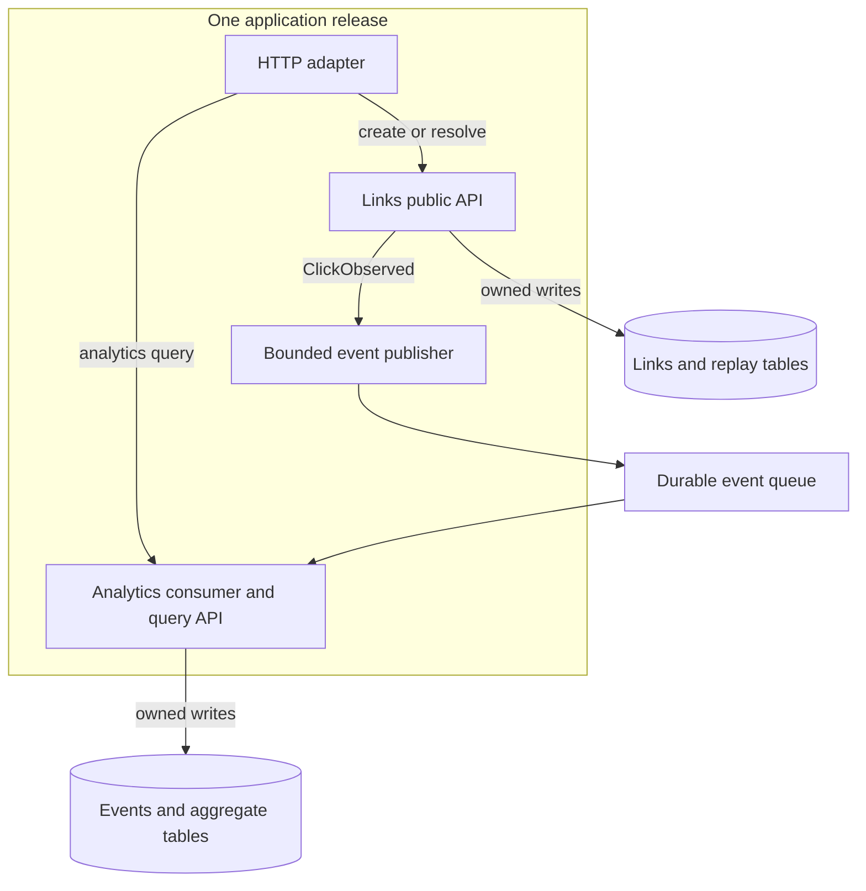

# Reference design — Links and analytics in one deployment

Author-written answer to [the assignment](README.md#assignment). [DESIGN.md](DESIGN.md) is
your practice memo. Architecture, workloads, and thresholds are hypothetical decisions.

## Assumptions and requirement

One team develops links and approximate analytics. Link redirects use Day 18's 100 ms server
p95 target; dashboard freshness uses its 60-second healthy-operation target. There is no
current measured need for independent deployments. Begin with one application release artifact
containing separate Links and Analytics modules. A durable queue is an external dependency;
it does not require the two modules to be separately deployed services.

Links owns destination, owner, expiry, and creation replay records. Analytics owns raw click
events, processed-event IDs, and aggregates. Both may use one database instance, with separate
table ownership and repository interfaces. Shared deployment permits internal calls but does
not authorize arbitrary writes to another module's tables.

## Internal module diagram

**Line by line:** The adapter translates requests into module calls. Links alone enforces link
lifecycle. A small event crosses the analytics boundary through a queue. Analytics writes
only its own tables. The table groups may occupy one database instance; the diagram shows
ownership, not physical isolation.

## Interfaces and request trace

Links exposes create_link(owner, destination, expiry, key) and resolve_link(code, now).
Analytics accepts ClickObserved with schema_version, event_id, link_id, and observed_at,
where observed_at marks a validated redirect attempt. These names specify an internal contract,
not an existing library. No destination URL or session token is needed in the event.
Analytics queries Link metadata through a public interface if needed, never private table writes.

A redirect enters the adapter and calls Links. Links resolves and checks the record, then
attempts the bounded event handoff from Day 18 and returns the destination. Analytics consumes
later, atomically deduplicates and applies its effect, then acknowledges. Queue retries reuse
event_id. This preserves the declared approximate-analytics policy: unaccepted producer events
can be lost, and a redirected browser is not a guaranteed page view.

## Failure walkthrough and containment

An analytics consumer crashes after its transaction commits but before acknowledgement.
The queue redelivers and the processed-event ID prevents applying the effect twice. Other
redirects continue if the process and shared resources remain healthy. A poison event is
quarantined after a bounded retry policy; it must not hold every later event behind it.

A process-wide memory failure is different: internal module boundaries cannot keep the HTTP
adapter alive. Limit analytics concurrency and batch sizes, cap pools, and bound queues;
monitor both request latency and resource use. If the whole process restarts, worker-local
state is disposable under Day 17 and durable queue records can be retried. A shared database
outage can still affect both modules. No internal diagram establishes failure isolation by itself.

## Observable extraction trigger

Choose this investigation gate: in three consecutive representative 15-minute peak windows,
redirect p95 exceeds 100 ms while profiling attributes at least 60% of application CPU to
Analytics, and a controlled comparison with analytics processing paused brings p95 below
100 ms at the same redirect rate. Check query plans, batching, and concurrency limits first.
These thresholds are project policy proposals; they are not measured results or universal limits.

If that gate is met and a separate consumer meets the 60-second freshness target within an
agreed cost budget, extract Analytics for independent resource scaling. Preserve the event
contract, processed-event identity, and owned tables. Stop the old consumer before switching
ownership, or ensure every overlapping consumer shares the same atomic deduplication authority.
Define rollback ownership so the same effects are not applied independently by two databases.

This trigger asks for evidence of resource interference, a proposed remedy, and an operating
budget. It does not imply that high CPU alone requires microservices. Release independence or
team ownership could justify a separate future decision with its own evidence.

## Decision, alternative, and self-review

Choose one deployment with enforced module APIs now. It reduces network and release complexity
while keeping an extraction boundary visible. Deploying two services immediately offers
independent scaling but adds remote failures, schema compatibility, and operational work before
the assumed team needs them. An unrestricted monolith is simpler initially but loses data ownership.

The answer draws both modules, states ownership, traces failure, and defines an observable
extraction trigger. Next checks are import-boundary enforcement, forbidden cross-module writes,
duplicate-event replay, shared-resource contention, and the controlled load comparison. Only
the local ownership model in [CONCEPTS.md](CONCEPTS.md) was executed; no profiling, deployment,
or load test is claimed.

Source: [Microservices architecture style](https://learn.microsoft.com/en-us/azure/architecture/guide/architecture-styles/microservices),
checked 2026-09-22, describes independent scaling and operational complexity. The module map
and numerical extraction gate are original design choices.
