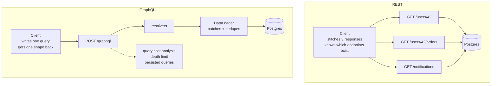

# Day 021 · System Design — GraphQL versus REST

**After today you can:** You can argue for either one, given a real product constraint.

**The interviewer asks it as:** *When would you choose GraphQL over REST?*

---

## 1. What this is, and why they ask it

**GraphQL** is a way of building an API where the **client** says exactly which fields it wants, and
the server returns exactly those and nothing else. There is one endpoint instead of many, and the
shape of the response is decided by the caller rather than fixed by the server.

It exists because of two specific complaints about REST, both of which you have already met. From
[day 016](../day-016-2d-arrays/README.md): a REST resource is the unit, so `GET /users/42` returns
the whole user even when the screen needs two fields — **over-fetching**. And from
[day 015](../day-015-the-write-pointer/README.md)'s arithmetic: a screen needing four different
resources makes four round trips, which on a mobile network is roughly 480 ms instead of 120 —
**under-fetching**, usually called the N+1 problem when it happens in a list.

Facebook built GraphQL in 2012 for exactly this, on mobile, and open-sourced it in 2015.

Interviewers ask this because it is a **trade-off question with no right answer**, which makes it a
good test of judgement. Someone who says "GraphQL is more modern and flexible" has read the
marketing. Someone who says "it moves complexity from the client to the server, and here is the
caching you give up" has used it. The question is not which is better. It is whether you can name
what each one costs.

---

## 2. The story

There is a lunch place near Rekha's office where about two hundred people from the surrounding
buildings eat every day, and for nine years it worked one way. You paid at the counter, took a
token, and at the hatch a man handed you a steel plate. The plate was the same for everyone: rice,
two vegetables, a dal, a small sweet, two chapatis, curd, a piece of lemon and a spoon of pickle.

Most days that is roughly what Rekha wanted. Some days it was not. She almost never ate the sweet,
and it went in the bin with the lemon and the pickle. On the days she wanted extra curd she had to
go back and stand in the queue again, pay separately, and come back with a second little bowl. And
her colleague who does not eat rice took the plate anyway and left half of it.

In February they changed it. Now there is a woman at the front with a tablet, and she asks you what
you want on the plate. You say it once — rice, one vegetable, extra curd, no sweet, no pickle,
three chapatis — and that exact plate comes out. One queue, one wait, and nothing in the bin.

Rekha likes it, and she has also watched what it did to the place.

The old way, the man at the hatch did not think. He handed over a plate, four hundred times, four
seconds each. Now somebody has to listen to a different sentence from every person, and the kitchen
has to be able to assemble any combination anybody asks for. They put on two more people at the back.

There is a line at the front now that did not exist before, because saying what you want takes
twenty seconds and taking a plate took four. And one man asked for eleven chapatis, four curds and
every vegetable they had, and the kitchen made it, because nobody had thought to say no. They have a
rule about that now.

The one thing they genuinely lost is the shortcut they used to have. At half past twelve they would
make forty identical plates in advance and stack them, and the first forty people got served
instantly. They cannot do that any more. Every plate is different, so every plate has to be made
when it is asked for.

---

## 3. The idea in plain English

The fixed steel plate is REST. The tablet at the front is GraphQL. Everything that follows —
including the costs — is in that story.

### What a REST call gives you

A REST endpoint returns a fixed shape decided by the server:

```
GET /users/42
→ { "id": 42, "name": "Rekha", "email": "...", "avatar_url": "...",
    "bio": "...", "created_at": "...", "settings": {...}, "location": "..." }
```

The screen needed `name` and `avatar_url`. It received nine fields. That is **over-fetching**, and it
is the sweet and the pickle in the bin.

And if the screen also needs the user's last three orders and their unread notification count, that
is two more calls:

```
GET /users/42
GET /users/42/orders?limit=3
GET /users/42/notifications?unread=true&count_only=true
```

Three round trips, done one after another because the second may depend on the first. That is
**under-fetching**: no single endpoint gives you what one screen needs.

### What a GraphQL call gives you

One endpoint — `POST /graphql` — and the request body is a **query** naming the fields:

```graphql
query {
  user(id: 42) {
    name
    avatarUrl
    orders(limit: 3) {
      id
      total
      status
    }
    unreadNotificationCount
  }
}
```

And the response mirrors the query exactly:

```json
{
  "data": {
    "user": {
      "name": "Rekha",
      "avatarUrl": "https://...",
      "orders": [
        { "id": "8812", "total": 340, "status": "delivered" },
        { "id": "8790", "total": 120, "status": "delivered" },
        { "id": "8654", "total": 890, "status": "cancelled" }
      ],
      "unreadNotificationCount": 3
    }
  }
}
```

One round trip. Nothing unwanted. **The response shape is a copy of the request shape**, which is the
single most useful thing to say about GraphQL — you can predict the answer by reading the question.

### The schema, which is the real product

A GraphQL API is defined by a **schema**: every type, every field, and every field's type, written
down and strongly typed.

```graphql
type User {
  id: ID!
  name: String!
  avatarUrl: String
  orders(limit: Int = 10): [Order!]!
  unreadNotificationCount: Int!
}

type Order {
  id: ID!
  total: Float!
  status: OrderStatus!
  items: [OrderItem!]!
}

type Query {
  user(id: ID!): User
  orders(status: OrderStatus): [Order!]!
}
```

`!` means non-null. `[Order!]!` is a non-null list of non-null orders. That schema is machine
readable, so the client tooling can autocomplete queries, check them before they are sent, and
generate types — which is a genuine day-to-day advantage over reading REST documentation and hoping.

**Introspection** — asking the API to describe itself — is built in, which is what powers those
tools. It is also something you usually turn off in production, so that an attacker cannot enumerate
your entire schema.

### Resolvers: where the work actually happens

Each field in the schema has a **resolver** — a function that knows how to produce that field. The
server walks the query, calls the resolvers it needs, and assembles the response.

This is the part people underestimate. The engine does not know that `orders` and
`unreadNotificationCount` could be fetched from one database in one go; it calls each resolver
independently. So a query for 50 users, each with their orders, naively runs **1 query for the users
and 50 for the orders** — the N+1 problem, moved from the network into the database.

The standard fix is **DataLoader**: a per-request batching layer that collects all the ids requested
in one tick of the event loop and issues a single `WHERE id IN (...)` query. Every serious GraphQL
deployment uses one. Naming DataLoader in an interview is a strong signal, because it shows you know
where the difficulty actually is.

### The three operation types, and one thing REST does better

- **Query** — reads. All queries in one request run in parallel.
- **Mutation** — writes. Multiple mutations in one request run **in order**, deliberately.
- **Subscription** — a stream of updates over a websocket, for live data.

Note what is missing: HTTP semantics. **Every GraphQL request is a `POST` to one URL**, so there is
no method, no resource path, and — the important one — no HTTP caching. A CDN cannot cache a `POST`
to `/graphql`, and from [day 016](../day-016-2d-arrays/README.md)'s numbers, HTTP caching was the
single largest lever in a read-heavy design. That is the forty pre-made plates.

There is also no meaningful use of status codes. A GraphQL server returns `200 OK` even when the
query failed, with the problems listed in an `errors` array alongside a possibly partial `data`. That
is exactly the thing [day 018](../day-018-arrays-revision/README.md) called the worst sin in API
design, and here it is by specification — because a single request can partly succeed. It is
defensible, and it does mean every monitoring tool you own needs teaching.

---

## 4. The picture

The same screen, both ways:

```
   REST — three round trips, fixed shapes          GRAPHQL — one round trip, chosen shape

   app                          server              app                        server
    |                             |                  |                           |
    |--- GET /users/42 ---------->|                  |--- POST /graphql -------->|
    |<-- 9 fields (needed 2) -----|                  |    { user(id:42) {        |
    |                             |                  |        name avatarUrl     |
    |--- GET /users/42/orders --->|                  |        orders(limit:3){..}|
    |<-- 20 fields (needed 9) ----|                  |        unreadCount } }    |
    |                             |                  |                           |
    |--- GET .../notifications -->|                  |<-- exactly those fields --|
    |<-- 6 fields (needed 1) -----|                  |                           |
    |                             |                  |
   ~360 ms, ~12 KB                                  ~120 ms, ~2 KB
   cacheable at the CDN                             not cacheable at the CDN
```

**What to notice:** the two numbers at the bottom disagree about which is better, and that is the
whole lesson. GraphQL wins on round trips and bytes. REST wins on cacheability — and a cached
response never reaches your servers at all, which is worth more than either of the savings above it
on a read-heavy public site.

Where the complexity goes:



**What to notice:** the dotted box. It has no equivalent on the REST side, and it is not optional —
without depth limits and cost analysis, a single query can ask for a user's friends' friends'
friends and take your database down. That is the man in accounts asking for eleven chapatis.

---

## 5. How it actually works

### One request, start to finish

1. The client `POST`s a query string (and variables) to `/graphql`.
2. The server **parses** it into a tree and **validates** it against the schema — unknown fields are
   rejected before anything runs, which is a real advantage of having a schema.
3. Optionally, **cost analysis**: estimate how expensive this query is and reject it if it is over
   budget.
4. **Execution**: walk the tree, calling each field's resolver. Sibling fields resolve in parallel;
   a child resolver waits for its parent.
5. Assemble `{"data": ..., "errors": [...]}` and return `200`.

### The N+1 problem, concretely

```graphql
query { orders(limit: 50) { id total customer { name } } }
```

Naively: 1 query for the 50 orders, then 50 separate queries for the 50 customers. **51 queries**,
and if 20 of those orders share a customer, 20 of them are duplicates.

With DataLoader, the 50 customer requests are collected during one tick and issued as:

```sql
SELECT * FROM customers WHERE id IN (7, 12, 19, ...);
```

**2 queries.** DataLoader also caches within the request, so the 20 duplicates collapse to one id in
the list. This is the single biggest operational difference between a GraphQL API that works and one
that falls over, and it has to be built deliberately — it does not come for free with the framework.

### Stopping abusive queries

Because the client writes the query, the client can write a bad one. Four defences, and you need
more than one:

- **Depth limiting.** Reject queries nested more than, say, 10 levels. Stops
  `user { friends { friends { friends { ... } } } }`.
- **Cost analysis.** Assign each field a cost, multiply by list sizes, reject over a budget. GitHub's
  public GraphQL API does exactly this and publishes the formula.
- **Persisted queries.** The client registers its queries at build time and sends only a hash at run
  time. The server refuses anything it does not recognise. This is what large deployments do — it
  removes arbitrary queries entirely, and as a bonus the request becomes tiny and, being a known
  hash, **cacheable**.
- **Timeouts and pagination limits**, exactly as in REST.

Note that persisted queries give back most of what GraphQL took away — a fixed set of known
operations. That is worth noticing out loud: at scale, GraphQL converges towards something
REST-shaped, with the difference that the shapes are defined by clients rather than by the server.

### Caching, which is the real loss

REST caches at four levels, and GraphQL loses the first three:

| Level | REST | GraphQL |
|---|---|---|
| Browser HTTP cache | works | no — it is a `POST` |
| CDN | works | no — unless persisted queries over `GET` |
| Reverse proxy | works | no |
| Application cache (Redis) | works | works, per resolver |

The GraphQL answer is to cache **inside** the server, per field or per entity, which is more work and
catches less traffic — a Redis hit still costs you a request, a connection and a server, where a CDN
hit costs you nothing at all. Client libraries such as Apollo Client and Relay maintain a normalised
cache in the browser, which is genuinely good and helps only that one user.

### Real deployments worth naming

- **GitHub** — the best-known public GraphQL API, running alongside its REST API, with published
  rate limits based on query cost rather than request count.
- **Shopify** — GraphQL-first for its storefront and admin APIs.
- **Facebook** — where it was built, for mobile news feed.
- **Netflix** — federated GraphQL as a gateway in front of many backend services.
- **Stripe, Twilio, AWS** — REST, deliberately, and none of them show signs of moving.

That last line matters. Payment and infrastructure APIs stay REST because their operations are few,
stable, need HTTP caching and idempotency semantics, and are called by machines rather than by
screens.

### The middle option nobody mentions

You do not have to choose globally. **A REST API with a `fields` parameter** —
`GET /users/42?fields=name,avatarUrl` — solves over-fetching with none of GraphQL's cost, and
**purpose-built endpoints** — `GET /screens/home` returning exactly what the home screen needs —
solve under-fetching. This is sometimes called Backend For Frontend. It is less elegant and it is
often the right answer, and proposing it is a strong move in an interview because it shows you are
solving the problem rather than picking a technology.

---

## 6. The numbers

Take a mobile home screen needing user profile, last 3 orders, and an unread count. Mobile round
trip: **120 ms**.

### Round trips

```
REST, sequential : 3 × 120 ms = 360 ms
REST, parallel   :     120 ms   (only if none depends on another)
GraphQL          :     120 ms + a little server time ≈ 150 ms
```

Parallel REST closes most of the gap. **Say that** — it is the honest counter to the round-trip
argument, and it applies whenever the calls are independent.

### Bytes over the wire

```
REST:     user 2 KB + orders 8 KB + notifications 1 KB = 11 KB
          of which actually rendered                    ≈ 2 KB
GraphQL:  exactly what was asked                        ≈ 2 KB
saving                                                  = 9 KB per screen load
```

At 1 million screen loads a day:

```
9 KB × 1,000,000 = 9 GB/day saved
```

Real, and worth more on a 2G connection than the numbers suggest: 9 KB at 100 kbps is about
0.7 seconds.

### The caching loss, which is bigger

From [day 016](../day-016-2d-arrays/README.md): at 420 requests/second with 80% cacheable traffic and
a 90% CDN hit rate, the CDN absorbed 302 requests/second and origin load fell from 420 to 118.

Lose HTTP caching and **all 420 hit your origin**. That is 3.5× the server load, and the CDN-served
responses were also coming back in 20 ms instead of 150.

```
REST + CDN : 118 req/s at origin, ~20 ms for cached reads
GraphQL    : 420 req/s at origin, ~150 ms for everything
```

**This single comparison is why a public, read-heavy, largely anonymous site should not move to
GraphQL**, and it is the most persuasive thing you can say on this topic. It also explains why the
calculus flips for a logged-in app where responses are per-user and therefore uncacheable anyway —
there, the CDN was never helping.

### The N+1 cost

50 orders each with a customer, at 1 ms per query:

```
naive     : 51 queries × 1 ms = 51 ms of database time
DataLoader:  2 queries × 1 ms =  2 ms
```

25× on one query, and at 100 requests per second the naive version needs 5.1 seconds of database
time per second — six cores — against 0.2.

### The abuse ceiling

Uncapped depth, on a social graph averaging 200 friends:

```
user { friends { friends { friends { name } } } }
= 200 × 200 × 200 = 8,000,000 nodes from one request
```

Eight million rows from a request that fits in a text message. **This is why depth limiting is not
optional**, and it is the number that makes the point.

---

## 7. The trade-offs

### What GraphQL costs you

**HTTP caching.** The largest loss, quantified above. Persisted queries over `GET` recover some of
it and constrain your clients in exchange.

**Server complexity.** Resolvers, DataLoader batching, depth limits, cost analysis, and a monitoring
story that copes with everything being `200 POST /graphql` — you cannot see slow endpoints in an
access log any more, because there is only one endpoint.

**Performance becomes unpredictable.** In REST, `GET /users/42` costs what it costs, every time. In
GraphQL, one query can be cheap and the next expensive, and you did not write either of them.

**Rate limiting gets harder.** Requests-per-minute is meaningless when one request can be a thousand
times heavier than another, so you need cost-based limits — which is exactly what GitHub does.

**Errors lose their HTTP meaning.** Everything is `200` with an `errors` array. Defensible for
partial success; a real cost in tooling.

### What REST costs you

Over-fetching, under-fetching, endpoint proliferation as clients diverge, and versioning pain —
GraphQL evolves by adding fields and deprecating old ones, with introspection telling you who still
uses what, which is genuinely nicer than shipping `/v2`.

### When to choose which

**GraphQL** when: many different clients need different slices of the same data; mobile round trips
dominate; the data is a graph people traverse in varied ways; front-end teams iterate faster than the
back end can ship endpoints; responses are per-user and therefore uncacheable anyway.

**REST** when: the API is public and read-heavy with cacheable responses; the operations are few and
stable; consumers are machines rather than screens; you need HTTP semantics — caching, status codes,
idempotency keys; or the team is small and every hour spent on DataLoader is an hour not spent on the
product.

### The sentence that separates candidates

> **I would not move to GraphQL for a public, read-heavy, largely anonymous API.** The single biggest
> lever there is HTTP caching at the CDN, and GraphQL gives it up — 420 requests a second reaching my
> origin instead of 118, and 150 ms instead of 20. I would reach for GraphQL when the clients are
> logged-in apps whose responses were never cacheable to begin with, and when several front-end teams
> need genuinely different shapes of the same data. And before either, I would try a `fields`
> parameter and a couple of screen-shaped endpoints, because that fixes both complaints in an
> afternoon.

---

## 8. In the interview

### How it gets asked

- *"When would you choose GraphQL over REST?"* — the direct version. The answer is a condition, not a
  preference.
- *"What problems does GraphQL solve?"* — over-fetching and under-fetching, named, with the numbers.
- *"What are the downsides of GraphQL?"* — the real filter. Caching and N+1 are the two answers.
- *"How do you stop a client from writing an expensive query?"* — depth limiting, cost analysis,
  persisted queries.
- *"Design the API for a mobile feed."* — where this becomes a live decision rather than a quiz.

### What to say out loud, in the first ninety seconds

1. **Name the two problems it solves, concretely.** *"GraphQL exists for over-fetching — a REST
   resource returns the whole object when the screen wants two fields — and under-fetching, where one
   screen needs three endpoints and pays three round trips."*
2. **Say what it is in one sentence.** *"One endpoint, and the client sends a query naming exactly
   the fields it wants. The response shape mirrors the query."*
3. **Give the cost immediately, before being asked.** *"The price is HTTP caching. Every request is a
   POST to one URL, so no CDN, no browser cache, no reverse proxy — and on a read-heavy public API
   that is usually the single biggest lever you have."*
4. **Name the second cost.** *"And N+1 in the resolvers. Fetching 50 orders with their customers
   naively runs 51 database queries, so you need a per-request batching layer — DataLoader — from day
   one."*
5. **Name the third.** *"And because the client writes the query, you need depth limits and cost
   analysis, or one request can ask for friends-of-friends-of-friends and pull eight million rows."*
6. **Give the condition, not a preference.** *"So I'd choose GraphQL when the clients are logged-in
   apps — where responses were per-user and uncacheable anyway — and several front-end teams need
   different shapes. I'd stay with REST for a public read-heavy API, or a machine-facing one that
   needs status codes and idempotency."*
7. **Offer the middle path.** *"And before either, I'd try a `fields` query parameter and one or two
   screen-shaped endpoints. That fixes both complaints in an afternoon with no new infrastructure."*

### The follow-ups

**"What are the downsides of GraphQL?"**
Four, in order of how much they hurt. Caching: every request is a `POST` to a single URL, so browser
caches, CDNs and reverse proxies are all out, and you are left doing application-level caching in
Redis, which still costs you a request and a server where a CDN hit costs nothing. N+1: the engine
resolves fields independently, so a list query naively issues one database query per item, and you
need DataLoader batching from the start. Unpredictable cost: the client writes the query, so one
request may be a thousand times heavier than another, which makes both capacity planning and rate
limiting harder — you need cost-based limits rather than request counts. And observability: your
access log says `200 POST /graphql` for everything, so you cannot see slow endpoints without
instrumenting resolvers deliberately.

**"How do you stop a malicious or careless query?"**
Layered. Depth limiting first, because it is cheap and stops the obvious recursion — reject anything
nested beyond about ten levels. Then cost analysis: assign a cost to each field, multiply by
requested list sizes, and reject queries over a budget; GitHub publishes exactly such a formula for
its public API. Then pagination limits enforced server-side, so `first: 100000` is capped regardless
of what was asked. And the strongest option, for a client you control: persisted queries, where the
client registers its queries at build time and sends only a hash, and the server refuses anything
unrecognised — which eliminates arbitrary queries entirely. It is worth noticing that persisted
queries bring you back to a fixed set of known operations, which is REST-shaped again, with the
difference that the shapes were defined by the clients.

**"Can you cache GraphQL at all?"**
Not at the HTTP layer, in the normal case, because it is a `POST` and caches key on method and URL.
Three things you can do. Persisted queries sent as a `GET` with the hash in the query string are
cacheable by a CDN, which recovers most of it for a controlled client. Application-level caching per
resolver or per entity in Redis works well and is what most deployments do — you cache the `User:42`
object, not the response, so it is reused across differently-shaped queries. And client-side, Apollo
Client and Relay keep a normalised cache in the browser keyed by type and id, which is genuinely good
and helps exactly one user. What you cannot get back is the property that made the CDN so valuable:
one cached copy serving thousands of different people from a nearby city.

**"Facebook built it for mobile. Does that reasoning still hold?"**
Partly. The round-trip argument is weaker than it was, because HTTP/2 multiplexes several requests
over one connection so parallel REST calls no longer queue behind each other, and connections are
usually already warm. The payload argument still holds on poor networks — 9 KB saved is about 0.7
seconds at 100 kbps. The argument that has actually strengthened is organisational rather than
technical: when several front-end teams ship faster than the backend can add endpoints, letting them
choose the shape removes a queue. That is the reason most teams adopt it today, and I would rather
say that honestly than repeat the 2012 mobile rationale.

### A model answer

> "GraphQL exists to fix two specific complaints about REST, and I'd answer the question by looking
> at whether I actually have those complaints.
>
> The first is over-fetching. In REST the resource is the unit, so `GET /users/42` returns the whole
> user — say nine fields — when the screen renders two. The second is under-fetching: one screen
> often needs several resources, so it makes three calls and pays three round trips, which on mobile
> is roughly 360 milliseconds instead of 120.
>
> GraphQL replaces the many endpoints with one, and the client sends a query naming exactly the
> fields it wants, nested however it wants. The response mirrors the query, so you can predict the
> shape by reading the request. One round trip, and about 2 KB instead of 11.
>
> The costs are where the real answer is. The biggest is HTTP caching. Every GraphQL request is a
> POST to a single URL, so the browser cache, the CDN and any reverse proxy are all useless. On the
> read-heavy API I'd sized earlier, a CDN at a 90% hit rate took origin load from 420 requests a
> second down to 118, and served those reads in 20 milliseconds instead of 150. Giving that up is a
> much larger cost than the 9 KB saved per screen.
>
> Second, N+1. Resolvers run independently, so a query for 50 orders with their customers naively
> runs 51 database queries. You need a per-request batching layer — DataLoader — which collects the
> ids and issues one `WHERE id IN (...)`. That's 51 queries down to 2, and it doesn't come for free
> with the framework; you have to build it in from the start.
>
> Third, the client writes the query, so the client can write a terrible one. On a social graph
> averaging 200 friends, three levels of nesting is eight million nodes from a request that fits in a
> text message. So depth limits and cost analysis are mandatory, not optional, and rate limiting has
> to be cost-based rather than request-based.
>
> So my answer is a condition rather than a preference. I'd choose GraphQL when the clients are
> logged-in applications whose responses are per-user and therefore weren't cacheable anyway, when
> several front-end teams need genuinely different shapes of the same data, and when the domain is a
> graph people traverse in varied ways. I'd stay with REST for a public, read-heavy, largely anonymous
> API where CDN caching is the biggest lever I have, and for machine-facing APIs like payments, where
> I want status codes, idempotency keys and predictable cost — which is why Stripe and AWS are still
> REST and show no sign of changing.
>
> And before committing to either, I'd try the cheap middle: a `fields` query parameter to fix
> over-fetching, and one or two screen-shaped endpoints to fix under-fetching. That solves both
> complaints in an afternoon with no new infrastructure, and if it isn't enough, the reasons why will
> tell me whether GraphQL is actually the answer."

---

## 9. Recall card

- **GraphQL: one endpoint, the client names the fields, the response mirrors the query.** Fixes
  over-fetching and under-fetching.
- **The big cost is HTTP caching** — every request is a `POST` to one URL, so no browser cache, no
  CDN, no proxy.
- **N+1 is real and needs DataLoader** — 50 orders with customers is 51 queries naively, 2 with
  batching.
- **The client writes the query, so cap it:** depth limits, cost analysis, persisted queries,
  server-side pagination caps.
- **Choose by condition:** GraphQL for logged-in multi-client apps; REST for public, cacheable,
  machine-facing APIs. Consider `?fields=` and screen-shaped endpoints first.
