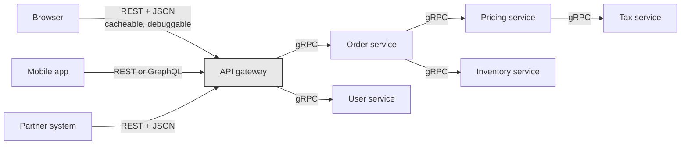

# Day 022 · System Design — gRPC and when binary protocols win

**After today you can:** You can say why internal services often do not speak JSON over HTTP.

**The interviewer asks it as:** *Why would a company use gRPC between its own services?*

---

## 1. What this is, and why they ask it

**gRPC** is a way for one service to call a function in another service as though it were a local
function call. You write down the functions and their arguments in a **schema file**, a compiler
generates client and server code in whichever languages you use, and the call travels as compact
binary over a long-lived HTTP/2 connection.

That is three separate changes from REST, and each one buys something:

- **A schema, checked at compile time** — you cannot send a field that does not exist, or forget a
  required one, because the code will not build.
- **Binary encoding instead of JSON** — the field names are not on the wire at all, only the values,
  which is roughly three to ten times smaller.
- **One persistent HTTP/2 connection instead of a request per connection** — no repeated handshakes,
  many calls in flight at once, and streaming in both directions.

Interviewers ask this because it is where a candidate reveals whether they think about the *inside*
of a system. Almost everyone can talk about the public API. gRPC is a question about the traffic
between your own services, which at any real company is the overwhelming majority of it — Google runs
on the order of tens of billions of internal calls per second on this. Knowing when to use it, and
what you lose, is a mid-level-and-above signal.

---

## 2. The story

There is a small shop near the auto stand where Sanjay does mobile recharges, bus tickets, bill
payments and photocopies, and there are usually three or four people standing in front of it.

Ravi has been going there every month for six years. He walks up, says *"nine eight seven six five
four three two one zero, one nine nine, Jio"*, hands over two hundred rupees, and walks away with
the change. It takes eleven seconds and neither of them says a full sentence.

That works because they both know the same three things, in the same order, without being told:
number, amount, operator. Ravi does not need to say *"the number I want to recharge is"*, because
what else would the first thing be. Sanjay does not need to ask *"and which operator?"*, because it
is always third. The form is in both their heads, so only the answers have to be spoken.

Behind Ravi in the queue there is a man doing this for the first time, and it takes him a minute and
a half. He explains that he wants to put money on his wife's phone, and Sanjay asks for the number,
and he reads it out, and then Sanjay asks how much, and then which company, and then he is not sure
and has to check. Everything he says is perfectly clear to anybody listening. It is just three times
longer.

Two things Ravi has noticed over six years.

Once, the shop switched to a different system where the amount came before the number. Ravi said his
usual three things in his usual order and Sanjay had already typed the first four digits into the
amount box before he stopped. They both laughed, but it was a genuine mistake, and it happened
because one of them had changed the form and the other had not been told.

And when Sanjay's nephew was minding the shop in December, Ravi's eleven-second version was useless.
The boy had not learnt the order. Ravi had to go back to full sentences, like the man behind him, and
it took him a minute and a half like everybody else.

---

## 3. The idea in plain English

Ravi's eleven seconds is gRPC. The man behind him is JSON over HTTP. Both convey the same three
values; one of them names each field out loud and the other relies on a form both sides already have.

### What is actually on the wire

A REST call sends the field names with every message, every time:

```json
{"user_id": 42, "name": "Ravi", "active": true, "score": 1200}
```

That is 58 bytes, and 34 of them are the words `user_id`, `name`, `active` and `score`, plus quotes,
colons and braces. Send it a billion times and you have sent those four words a billion times.

The gRPC equivalent sends the values and a small tag saying which field each one is:

```
08 2A 12 04 52 61 76 69 18 01 20 A0 09
```

13 bytes. The names are nowhere on the wire, because both sides already have the form.

**That form is the `.proto` file** — the schema, written in a language called Protocol Buffers:

```protobuf
syntax = "proto3";

message User {
  int32  user_id = 1;      // the number 1 is the FIELD TAG, not a value
  string name    = 2;
  bool   active  = 3;
  int32  score   = 4;
}

service UserService {
  rpc GetUser (GetUserRequest) returns (User);
  rpc ListUsers (ListUsersRequest) returns (stream User);
}
```

The numbers after the equals signs are **field tags**, and they are what travels instead of the
names. Tag 2 means `name`. That is Ravi's "the second thing I say is the amount".

**Those tags are a permanent promise.** Change `name` from tag 2 to tag 5 and every old client is
suddenly reading the wrong field — which is exactly the morning Sanjay's form changed and Ravi's
phone number went into the amount box. You may rename a field freely, because the name is not on the
wire. You may **never** reuse or renumber a tag.

### The generated code

You run the compiler — `protoc` — on the `.proto` file and it produces real classes and methods in
your language. Then calling a remote service looks like calling a local object:

```python
response = user_stub.GetUser(GetUserRequest(user_id=42))
print(response.name)
```

No URL, no JSON parsing, no checking a status code by hand. And because it is generated from a
schema, `response.nam` is a compile-time or lint-time error rather than a `None` at three in the
morning. **That is the biggest day-to-day benefit, and it has nothing to do with speed.**

The style has a name — **RPC**, remote procedure call — and it is older than REST. gRPC is the
modern, well-engineered version of a very old idea.

### HTTP/2, and why it matters here

REST usually runs on HTTP/1.1, where one connection carries one request at a time. gRPC requires
**HTTP/2**, which brings three things:

- **Multiplexing.** Many calls in flight on one connection at once, with no head-of-line blocking at
  the HTTP layer.
- **A persistent connection.** Set it up once and keep it. No repeated TCP and TLS handshakes — and
  from [day 006](../day-006-python-strings-dicts-sets/README.md), a cold HTTPS connection costs
  several round trips before a single byte of your request is sent.
- **Header compression.** Repeated headers are sent as small references rather than in full.

### Streaming, which REST simply does not do

Because the connection stays open, gRPC offers four call shapes:

| Shape | What it looks like | Example |
|---|---|---|
| **Unary** | one request, one response | `GetUser(id)` — the ordinary case |
| **Server streaming** | one request, many responses | "send me every trade as it happens" |
| **Client streaming** | many requests, one response | uploading a file in chunks |
| **Bidirectional** | both at once, independently | a chat service, live telemetry |

Request-and-response is the only shape REST has. If you need a stream over REST you reach for
websockets or server-sent events, which are a separate mechanism with separate tooling. In gRPC it
is a keyword in the schema.

### What you give up, and it is not small

**You cannot use `curl`.** The message is binary, so you cannot read a request in a log, cannot paste
one into a browser, and cannot eyeball a response. There is `grpcurl`, and it needs the schema. That
single fact is why gRPC is used **inside** systems and almost never for public APIs.

**Browsers cannot speak it directly.** Browser JavaScript has no access to the raw HTTP/2 frames gRPC
needs, so a web front end talks to a proxy — **gRPC-Web** with Envoy — that translates. It works, and
it is an extra component in your path.

**The schema must be shared.** Both sides need the same `.proto`, which means a repository for them,
a build step, and a discipline about changes. That is real organisational overhead, and it is the
morning Sanjay's nephew did not know the order.

**No HTTP caching.** Same problem as GraphQL on [day 021](../day-021-frequency-maps/README.md): a CDN
cannot cache what it cannot understand. For internal calls that is usually irrelevant, because the
responses were per-caller anyway.

---

## 4. The picture

The same call, both ways:

```
   REST + JSON over HTTP/1.1                gRPC + protobuf over HTTP/2
   -------------------------                ---------------------------
   POST /users HTTP/1.1                     [one connection, opened once, kept open]
   Host: users.internal
   Content-Type: application/json           stream 7: GetUser
   Content-Length: 58                         08 2A                     (2 bytes)
   Authorization: Bearer ...                stream 9: GetUser           (in parallel)
                                              08 2B
   {"user_id":42,"name":"Ravi",             stream 11: ListUsers        (streaming back)
    "active":true,"score":1200}               ...

   ~250 bytes with headers                  ~13 bytes of payload
   new connection per client, often         headers compressed to a few bytes
   one request at a time per connection     many calls at once on one connection
   readable by anyone                       needs the .proto to read at all
```

**What to notice:** the header block on the left is bigger than the body, and it is re-sent on every
single request. On the right the connection was negotiated once and the per-call cost is almost
entirely the data itself.

Where each belongs in a real system:



**What to notice:** the line through the gateway. Outside it, traffic is human-readable, cacheable
and consumed by clients you do not control. Inside it, traffic is dense, typed, and between machines
whose code you own on both sides. **That boundary is the answer to today's question**, and drawing it
is worth more than any list of features.

---

## 5. How it actually works

### Protocol Buffers on the wire

Each field is encoded as a **tag byte** followed by the value. The tag byte packs the field number and
a wire type — a 3-bit code saying whether what follows is a varint, a fixed 32 or 64 bits, or a
length-delimited block.

```
field 1 (user_id), varint, value 42        ->  08 2A
field 2 (name), length-delimited, 4 bytes  ->  12 04 52 61 76 69      ("Ravi")
field 3 (active), varint, value 1          ->  18 01
field 4 (score), varint, value 1200        ->  20 A0 09
```

Two consequences worth knowing:

**Small numbers are cheap.** A **varint** uses one byte for values under 128, two under 16,384, and
so on. So `42` costs one byte where JSON's `"score":1200` costs eleven.

**Absent fields cost nothing.** A field that is not set is simply not on the wire. JSON either sends
`"middle_name": null` or omits it and leaves the receiver guessing.

### Evolving a schema without breaking anyone

This is the part with real rules, and it is what the field tags are for.

**Safe:**
- Add a new field with a **new** tag. Old clients ignore what they do not recognise.
- Rename a field. The name is not on the wire.
- Delete a field, provided you mark its tag `reserved` so nobody reuses it later.

**Never:**
- Change a field's tag number.
- Change a field's type in an incompatible way (`int32` to `string`).
- Reuse a tag from a deleted field.

```protobuf
message User {
  reserved 3;                    // 'active' used to live here — never reuse it
  reserved "active";
  int32  user_id = 1;
  string name    = 2;
  int32  score   = 4;
  string email   = 5;            // new field, new tag, old clients unaffected
}
```

In proto3 every field is optional and unset fields read as a zero value, which makes adding fields
inherently backward compatible. **This is why gRPC services do not carry `/v1` in a path the way REST
does** — the schema evolves in place, and versioning is a property of field tags rather than of URLs.

### Deadlines, which are mandatory rather than optional

Every gRPC call carries a **deadline** — an absolute time by which it must complete — and it
**propagates**. If the gateway gives a call 2 seconds and it spends 300 ms in the order service, the
call the order service makes onward inherits 1.7 seconds, not a fresh 2.

This matters more than it sounds. Without propagation, a chain of five services each with its own
2-second timeout can take 10 seconds while the original caller gave up after 2, and every one of
those five is still doing work nobody will ever read. Deadline propagation is one of the genuinely
good ideas in gRPC and it is worth naming.

Alongside it: **cancellation** propagates too. If the caller goes away, everything downstream is told
to stop.

### Errors

gRPC has its own status codes — 17 of them, rather than HTTP's several dozen — and they are the same
in every language: `OK`, `NOT_FOUND`, `ALREADY_EXISTS`, `PERMISSION_DENIED`, `UNAUTHENTICATED`,
`RESOURCE_EXHAUSTED`, `DEADLINE_EXCEEDED`, `UNAVAILABLE`, `INTERNAL`, and so on. `UNAVAILABLE` and
`DEADLINE_EXCEEDED` are the two that mean "retry may help", and gRPC libraries know that, so
retry policy can be configured rather than hand-written.

### Load balancing is different, and it catches people out

An ordinary layer-4 load balancer balances **connections**. gRPC opens one connection and keeps it,
so all of a client's traffic pins to whichever backend it first reached — and adding a new backend
receives nothing at all until connections happen to be re-established.

The fixes: a layer-7 proxy that understands HTTP/2 and balances individual streams (Envoy, nginx with
gRPC support, Linkerd), or client-side load balancing where the client resolves all backend addresses
and spreads calls itself. **This is the most common operational surprise with gRPC**, and mentioning
it unprompted is a strong signal that you have run it rather than read about it.

### Who uses it

**Google** — where it was built, and where essentially all internal traffic runs on it or its
predecessor Stubby. **Netflix, Square, Dropbox, Cloudflare, Uber** internally. **etcd** and
**Kubernetes** speak gRPC between components. **CockroachDB** and **TiDB** use it between nodes.

And who does not: **Stripe, Twilio, GitHub, AWS's public APIs** are all REST or JSON-based, for the
same reason in every case — their callers are strangers with any language, any tooling, and a strong
preference for being able to try something with `curl`.

---

## 6. The numbers

### Payload size

The `User` message above:

```
JSON      : {"user_id":42,"name":"Ravi","active":true,"score":1200}  = 58 bytes
protobuf  : 08 2A 12 04 52 61 76 69 18 01 20 A0 09                   = 13 bytes
ratio     : 4.5x smaller
```

Now the headers, which are the bigger half for small messages:

```
HTTP/1.1 request headers (Host, Content-Type, Content-Length, Auth, ...) ≈ 200 bytes, every request
HTTP/2 with HPACK compression, after the first                           ≈ 10-20 bytes
```

Total for one call:

```
REST : 200 + 58 = 258 bytes
gRPC :  15 + 13 =  28 bytes         about 9x smaller
```

At **100,000 internal calls per second**, which is unremarkable for a mid-size company:

```
REST : 258 × 100,000 = 25.8 MB/s = 2.2 TB/day
gRPC :  28 × 100,000 =  2.8 MB/s = 242 GB/day
saving                              ≈ 2 TB/day
```

Two terabytes a day of cross-service traffic that simply does not exist. Inside one data centre that
is mostly a latency and CPU win; across availability zones, where transfer is billed at roughly $0.01
per GB in each direction, it is real money:

```
2,000 GB/day × $0.02 × 365 ≈ $14,600/year
```

Not huge on its own — and it is the smallest of the three savings.

### Serialisation CPU

Parsing JSON means scanning text, matching field names as strings, and allocating. Protobuf means
reading a tag and copying bytes.

```
JSON parse of a 1 KB message     ≈ 10 µs
protobuf parse of the equivalent ≈  1-2 µs
```

At 100,000 calls per second, decoded once on each side:

```
JSON     : 100,000 × 2 × 10 µs = 2.0 seconds of CPU per second = 2 cores
protobuf : 100,000 × 2 ×  2 µs = 0.4 seconds of CPU per second = 0.4 cores
```

Roughly 1.6 cores freed, on every service in the chain. Multiply by twenty services and it is a rack.

### Connection setup — usually the largest win

From [day 006](../day-006-python-strings-dicts-sets/README.md), a cold HTTPS connection costs a TCP
handshake plus a TLS handshake: 2–3 round trips before the request is sent. Inside a data centre a
round trip is about 0.5 ms.

```
new connection per call : 3 × 0.5 ms = 1.5 ms of pure setup, before any work
persistent HTTP/2       : 0 ms after the first call
```

On a call whose actual work is 2 ms, that is a **75% latency reduction from connection reuse alone**.
And in a chain of five services:

```
REST, cold connections : 5 × (1.5 + 2) = 17.5 ms
gRPC, warm connection  : 5 × (0     + 2) = 10 ms
```

Note honestly that HTTP keep-alive gives REST most of this too, so it is a benefit of persistent
connections rather than of gRPC specifically — and saying so is the mark of an honest answer.

### When none of this matters

```
1,000 internal calls/second, 500-byte messages:
   REST : 500 × 1,000 = 500 KB/s
   JSON parsing       = 1,000 × 2 × 10 µs = 0.02 cores
```

Twenty milliseconds of CPU per second and half a megabyte a second. **At this scale gRPC saves you
nothing you can measure, and costs you a build step, a schema repository, a proxy for the browser,
and the ability to debug with `curl`.** Being able to say *that* — that the numbers do not justify it
below a certain scale — is worth more in an interview than reciting the advantages.

---

## 7. The trade-offs

### What gRPC costs

**Debuggability.** This is the big one and it is not a small inconvenience. You cannot read a request
in a log, cannot reproduce one from a browser, and cannot hand a colleague a `curl` command. Every
tool in your organisation — proxies, WAFs, log aggregators, the intern's script — has to be taught
about it.

**Tooling and build.** A schema repository, a code-generation step in every language's build, and
version skew between generated stubs. Real ongoing overhead for a small team.

**Browsers.** Not supported natively. gRPC-Web plus an Envoy proxy works and is one more moving part.

**Load balancing.** Long-lived connections defeat ordinary connection-level balancers, so you need a
layer-7 proxy or client-side balancing.

**No HTTP caching.** Irrelevant inside, disqualifying outside.

**Coupling.** A shared schema is a shared dependency. Changing it means coordinating a rollout, and
proto3's compatibility rules only protect you if everyone follows them.

### What you would use instead

- **REST + JSON** for anything public, anything a browser touches, anything a partner integrates
  with, and any internal service where the call volume does not justify the machinery.
- **GraphQL** when many clients need different shapes of the same data — a different problem, from
  [day 021](../day-021-frequency-maps/README.md).
- **A message queue** — Kafka, RabbitMQ — when the caller does not need an answer now. gRPC is
  request-response; a queue is fire-and-forget with durability, and choosing gRPC where you wanted a
  queue is a much more expensive mistake than choosing REST where you wanted gRPC.
- **JSON over HTTP/2**, which is a real and underused middle: you get multiplexing and header
  compression and keep readability, giving up only the encoding size and the generated types.

### The sentence that separates candidates

> **I would not use gRPC for a public API, and I would not use it internally below a few thousand
> calls a second.** Public callers want `curl`, browsers, any language and no build step, and the CDN
> caching REST gives me is worth more than any encoding saving. Internally, at low volume, the win is
> a fraction of a core and a few megabytes a second, and the price is a schema repository, a
> generation step and losing the ability to read my own traffic. Where gRPC earns its keep is a
> service mesh with high call volume, deep call chains where deadline propagation actually prevents
> outages, polyglot teams who benefit from generated typed clients, and anything that genuinely needs
> streaming.

---

## 8. In the interview

### How it gets asked

- *"Why would a company use gRPC between its own services?"* — the direct version. Three reasons and
  one boundary.
- *"What's the difference between REST and RPC?"* — the conceptual version. REST models resources;
  RPC models function calls.
- *"Why not use gRPC for your public API?"* — the follow-up that checks whether you know the cost.
- *"How would two microservices communicate?"* — asked mid-design, where the right answer names more
  than one option and picks by condition.

### What to say out loud, in the first ninety seconds

1. **Say what it is in one sentence.** *"gRPC lets one service call a function in another as if it
   were local. You define the functions in a schema file, a compiler generates typed clients and
   servers, and calls travel as binary over a persistent HTTP/2 connection."*
2. **Give the three wins, in order of what actually matters.** *"First, the schema — the contract is
   checked at compile time, so a wrong field name is a build error rather than a null at three in the
   morning. Second, the connection — HTTP/2 is persistent and multiplexed, so you stop paying a
   handshake per call. Third, the encoding — field names aren't on the wire, so messages are three to
   ten times smaller and parse several times faster."*
3. **Lead with the schema, not the speed.** Most candidates lead with binary. The generated typed
   client is the thing engineers actually feel every day.
4. **Give one number.** *"At a hundred thousand internal calls a second, that's roughly 2 terabytes a
   day of traffic that doesn't exist, and a couple of cores per service freed from JSON parsing."*
5. **Mention streaming.** *"And because the connection is open, gRPC gives you server streaming,
   client streaming and bidirectional streaming as part of the schema — REST only does
   request-response."*
6. **Draw the boundary immediately.** *"But it's for inside. Public APIs stay REST, because callers
   want curl, browsers and any language — which is why Stripe and GitHub are REST and Google's
   internals are not."*
7. **Name a cost unprompted.** *"The real price is debuggability. You cannot read a binary request in
   a log, and every tool in the organisation has to be taught about it."*

### The follow-ups

**"Why not use gRPC for a public API?"**
Four reasons, and any one of them is usually enough. Debuggability: an external developer wants to
paste a `curl` command and see JSON, and a binary payload they cannot read without your schema is a
serious barrier to adoption. Browsers: JavaScript cannot make raw gRPC calls, so every web client
needs a gRPC-Web proxy, which is infrastructure you are asking your callers to care about. Caching: a
CDN cannot cache what it cannot parse, and for a public read-heavy API that is the single largest
lever you have — from the earlier arithmetic, a 90% CDN hit rate took origin load from 420 requests a
second to 118. And coupling: a shared `.proto` is a shared dependency, and you cannot make thousands
of external developers regenerate their stubs on your schedule. Internally none of those apply,
because you own both sides and deploy them together.

**"What's the actual difference between REST and RPC?"**
They model different things. REST models **resources** — nouns with addresses, and a fixed small set
of verbs applied uniformly to all of them, which is why you can guess `/users/42` once you have seen
`/orders/17`. RPC models **procedures** — you are calling a named function with arguments, so the API
is a list of operations rather than a list of things. That makes RPC a much more natural fit when the
operations genuinely are actions: `RecalculateInvoice`, `RebalanceShards`, `TranscodeVideo`. Forcing
those into resources produces the awkward invented nouns we discussed on
[day 017](../day-017-matrix-tricks/README.md). The cost is that RPC gives up everything HTTP knows
how to do for you — caching, idempotency semantics, the meaning of a `GET`. So: resources and public
callers, REST; actions and internal callers, RPC.

**"How do you version a gRPC API?"**
Mostly you do not, in the URL sense, because Protocol Buffers is designed to evolve in place. Adding
a field with a **new** tag number is backward compatible — old clients ignore tags they do not know,
and in proto3 an unset field reads as its zero value. Renaming a field is free, because the name is
not on the wire. Deleting a field is fine as long as you mark its tag `reserved` so nobody reuses it.
What you must never do is change a field's tag number or its type, because the tag *is* the identity
of the field and old clients would silently read the wrong thing. For a genuinely breaking change you
introduce a new package — `myservice.v2` — and run both services for a migration period, exactly as
with REST, but that should be rare rather than routine.

**"What happens to load balancing?"**
This is the operational surprise, and it catches most teams once. A normal layer-4 load balancer
distributes **connections**, and gRPC opens one long-lived connection and keeps it — so all of a
client's calls pin to whichever backend it first reached, and a newly added backend gets no traffic
at all. There are two fixes. A layer-7 proxy that understands HTTP/2 and balances individual streams
rather than connections — Envoy, Linkerd, nginx with gRPC support. Or client-side load balancing,
where the client resolves all backend addresses and picks per call, which removes a hop and moves the
policy into every client. Most service meshes take the first route, and that is one of the main
reasons service meshes exist.

### A model answer

> "gRPC lets one service call a function in another as though it were a local call. You define the
> service and its messages in a `.proto` schema file, a compiler generates client and server code in
> whatever languages you use, and the calls go as compact binary over a persistent HTTP/2 connection.
>
> There are three wins and I'd rank them in the opposite order from how they're usually presented.
>
> The one engineers feel every day is the **schema**. The contract is a file, and the client is
> generated from it, so a misspelt field is a build failure rather than a `None` at three in the
> morning. With JSON over REST the contract lives in documentation and in hope.
>
> The one that usually matters most for latency is the **connection**. HTTP/2 is persistent and
> multiplexed, so you set up TCP and TLS once instead of per call. Inside a data centre a handshake is
> around 1.5 milliseconds against maybe 2 milliseconds of actual work, so connection reuse alone can
> nearly halve the latency of a chain of calls. I'd be honest that HTTP keep-alive gives REST most of
> this too — it's a benefit of persistent connections rather than of gRPC as such.
>
> The one people lead with is the **encoding**. Field names aren't on the wire, only small numeric
> tags, so that `User` message is 13 bytes against 58 as JSON, and with HTTP/2 header compression the
> whole call is about 28 bytes against 258. At a hundred thousand internal calls a second that's
> roughly 2 terabytes a day of traffic that simply doesn't exist, and parsing is about five times
> cheaper, which is a core or two freed on every service in the chain.
>
> Two more things I'd mention. Streaming is part of the schema — server streaming, client streaming
> and bidirectional — where REST only does request-response and you'd reach for websockets. And
> deadlines propagate: if the gateway gives a call two seconds and 300 milliseconds are spent in the
> first hop, the next hop inherits 1.7 seconds rather than a fresh two. Without that, a five-service
> chain can spend ten seconds doing work the original caller abandoned after two.
>
> But all of that is about traffic **inside** the system. I'd keep REST at the edge — for browsers,
> mobile apps and partners — because those callers want `curl`, any language, no build step, and
> because CDN caching is worth more to a public read-heavy API than any encoding saving. That's why
> Google's internals are gRPC and Stripe's public API is REST.
>
> And the cost I'd name unprompted is debuggability. You cannot read a binary request in a log or
> reproduce one from a browser, and every proxy and logging tool has to be taught about it. Plus the
> load balancing trap: long-lived connections defeat connection-level balancers, so you need a
> layer-7 proxy or client-side balancing, and that surprises most teams the first time they add a
> backend and watch it receive nothing."

---

## 9. Recall card

- **gRPC = call a remote function like a local one.** Schema (`.proto`) → generated typed clients →
  binary over persistent HTTP/2.
- **Three wins, in the order that matters:** compile-time contract, persistent multiplexed
  connection, small fast encoding. Plus streaming and propagating deadlines.
- **Field tags are the identity**, not names. Add new tags freely; never renumber or reuse one.
- **The boundary is the answer:** gRPC inside, REST at the edge. Public callers want `curl`,
  browsers, any language, and CDN caching.
- **The costs:** no `curl`, no browsers without a proxy, no HTTP caching, and long-lived connections
  break layer-4 load balancing.
