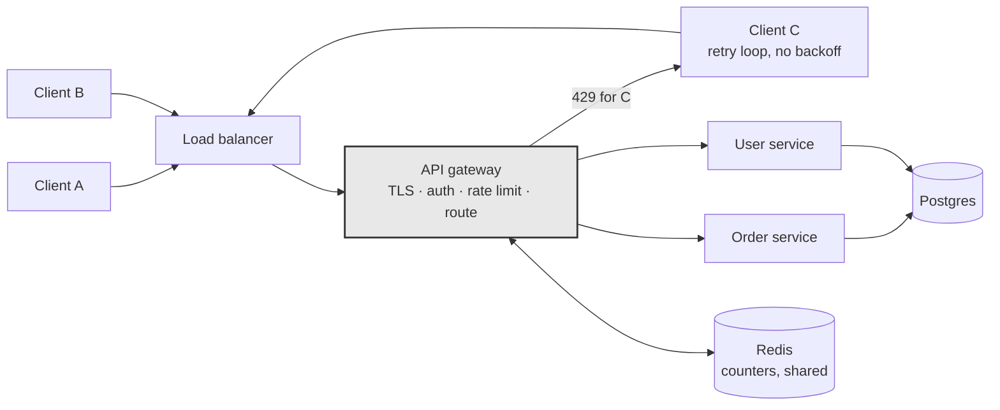

# Day 023 · System Design — Rate limiting and API gateways

**After today you can:** You can describe the token bucket and say where the limiter sits in the architecture.

**The interviewer asks it as:** *How would you stop one client from hammering your API?*

---

## 1. What this is, and why they ask it

**Rate limiting** is capping how many requests one caller may make in a period of time. Over the cap,
you return `429 Too Many Requests` and a `Retry-After` header, and you do it *before* the request
reaches anything expensive.

It exists because a shared service has finite capacity and callers do not know about each other. One
client with a retry loop and no backoff — the retry storm from
[day 018](../day-018-arrays-revision/README.md) — can consume everything and take the service down for
everyone else. Rate limiting is how a system stops one caller's mistake from becoming everybody's
outage. It is also how you enforce paid tiers, and how you make credential-stuffing and scraping
expensive.

The **API gateway** is where it usually lives: a single component in front of your services that every
request passes through, doing the things every request needs — terminating TLS, checking the token,
applying the limit, routing, and recording what happened.

Interviewers ask this constantly, and it has a satisfying shape: a small, concrete algorithm to
describe (the token bucket), a placement decision to argue (where does the limiter sit?), and a
distributed-systems problem hiding inside it (how do ten servers share one counter?). It appears in
almost every design round from mid-level upwards, and "design a rate limiter" is a whole interview
question at some companies.

---

## 2. The story

The building Kamala lives in has eleven flats and one water problem, which is the same water problem
every building on that road has.

The corporation supply comes at about five in the morning and it is not much. It fills the sump in
the basement, and from there a motor pushes it up to the tanks on the roof — one tank for each flat,
five hundred litres each, standing in a row.

It did not always work that way, and the reason it does now is the family in 2B. They had put in a
bigger motor, and when the water came they ran it, and by half past six they had filled everything
they owned and the flats on the fourth floor had nothing at all. Not less. Nothing. It went on for
two years and there were some very bad meetings about it.

What they have now is a timer on each tank. Water goes into Kamala's tank at a steady twenty litres
an hour, all day, whether she is using it or not.

She has got used to thinking about it in a particular way. If she has not used much for a day or two,
the tank is full, and she can wash everything in the house at once, because five hundred litres are
sitting up there waiting. That is the point of having a tank rather than a pipe. But if she does
that, the tank is empty, and the only water she has after that is the twenty litres an hour trickling
in — so a second big wash that afternoon is not possible however much she wants it.

And there is a limit to saving up. When the tank is full it is full; the extra water coming in just
runs out of the overflow pipe on the side and down the wall. She cannot bank three days of water for
a wedding. Five hundred is five hundred.

She says the good thing about it is not really the fairness, although that matters. It is that she
knows. Before the timers, whether there was water depended on what the people in 2B were doing that
morning, and she could not plan anything. Now she can look at the tank and know exactly where she
stands.

---

## 3. The idea in plain English

Kamala's tank is a **token bucket**, and it is the algorithm you should describe when asked. Every
part of it maps:

| The tank | The algorithm |
|---|---|
| 500-litre capacity | **burst size** — the most you can spend at once |
| 20 litres an hour going in | **refill rate** — the sustained rate you are allowed |
| taking water to wash | spending a **token**; one request costs one token |
| the tank being empty | no tokens left → the request is refused, `429` |
| overflow running down the wall | tokens beyond capacity are discarded — you cannot save up forever |

So: **each caller has a bucket. Tokens are added at a fixed rate up to a maximum. Each request removes
one token. No token, no request.**

The reason this is the standard answer is that it allows a **burst** while capping the **average**. A
mobile app that opens and fires eight requests at once is normal and should not be punished; a script
sending eight requests a second for an hour is not, and will drain its bucket in the first second and
then be held to the refill rate. One mechanism, both behaviours.

### The four algorithms, and why token bucket wins

You should be able to name all four and say what is wrong with the first two.

**Fixed window.** Count requests per calendar minute. Simple, one counter per caller, and it has a
real flaw: a caller can send the full limit at 10:00:59 and the full limit again at 10:01:00, which is
**twice the limit in one second**. §6 does the arithmetic. Interviewers ask about this boundary
problem specifically.

**Sliding window log.** Store the timestamp of every request; to decide, count the ones inside the
last 60 seconds. Exactly correct, and it stores one entry per request — at 1,000 requests a second
that is 60,000 timestamps per caller in memory at any moment. Accurate and expensive.

**Sliding window counter.** Keep the current window's count and the previous window's, and weight the
previous one by how far into the current window you are. Approximate, cheap, no boundary spike. This
is what Cloudflare uses and it is a good answer.

**Token bucket.** Two numbers per caller — the token count and the time it was last updated — and you
compute the refill lazily when a request arrives, rather than running a timer:

```
elapsed = now - last_refill
tokens  = min(capacity, tokens + elapsed * refill_rate)
last_refill = now
if tokens >= 1:  tokens -= 1;  allow
else:            refuse with 429
```

Two numbers per caller, exact, and it handles bursts by design. **This is the one to describe.**

There is a fifth, the **leaky bucket**, which is the token bucket's mirror image: requests go into a
queue that drains at a constant rate, and the queue overflowing is the rejection. It smooths output to
a perfectly steady rate, which is what you want in front of something fragile downstream, and it
removes the ability to burst. Name it as the alternative and say when you would use it.

### What you limit on

The **key** is as much of the design as the algorithm. Get it wrong and you either fail to stop the
attacker or you block a whole office.

- **By API key or user id** — the right default for an authenticated API. Precise, and it survives
  the caller changing address.
- **By IP address** — the only option before login. Its weakness is that a whole company or a whole
  mobile network can sit behind one address, so limiting by IP can block thousands of innocent users
  at once.
- **By endpoint** — `POST /login` deserves a far tighter limit than `GET /products`. Limits should be
  per operation, not one global number.
- **By tier** — free 100/hour, paid 10,000/hour. The same mechanism, a different bucket size.

In practice you run several at once: a generous per-user limit, a tighter per-IP limit for
unauthenticated endpoints, and a very tight one on login and password reset.

### What you send back

```
HTTP/1.1 429 Too Many Requests
Retry-After: 12
X-RateLimit-Limit: 100
X-RateLimit-Remaining: 0
X-RateLimit-Reset: 1767203612
```

`429` from [day 018](../day-018-arrays-revision/README.md), and **`Retry-After` is the important
one** — without it every rejected client guesses, and they all guess the same interval, and you have
built yourself a thundering herd. Sending the three `X-RateLimit-*` headers on **every** response, not
only rejections, lets a well-behaved client slow down before it is refused, which is strictly better
for both sides.

### The API gateway

The limiter has to run somewhere every request passes through, and that place is the **API gateway**:
one component in front of everything, doing the work common to all requests.

- Terminate TLS.
- Authenticate — verify the token, reject with `401` before anything downstream is touched.
- Rate limit — reject with `429`, cheaply.
- Route to the right service.
- Translate protocols — REST at the edge, gRPC inside, which is
  [day 022](../day-022-anagrams/README.md)'s boundary.
- Record metrics and logs in one place.

The value is that these are written once rather than in every service, and — for rate limiting
specifically — that **the rejection happens before the expensive part**. A `429` from the gateway
costs one Redis lookup. The same request reaching a service costs a database query, and it was going
to be refused anyway.

---

## 4. The picture

The token bucket, in three moments:

```
   capacity 500, refill 20/hour

   (a) idle for a day             (b) a big wash                (c) trying again
       tank full, extra                took 400 at once             only the trickle
       running out of the                                           has come back
       overflow

        overflow ->|                    |                            |
       +----------+|                   +----------+                 +----------+
       |##########|                    |          |                 |          |
       |##########|                    |          |                 |          |
       |##########|                    |          |                 |          |
       |##########|  500               |##        |  100            |###       |  120
       +----------+                    +----------+                 +----------+
            |                               |                            |
        can spend 500 now              can spend 100 now            +20 per hour
```

**What to notice:** the overflow pipe in (a). You cannot bank more than the capacity, which is what
stops a caller saving a month of quota and spending it in one second. And between (b) and (c) nothing
happened except time passing — the refill is computed from the clock, not from a background job.

Where the limiter sits:



**What to notice:** the arrow that turns round at the gateway. Client C's flood never reaches a
service, never touches the database, and costs one Redis round trip to refuse. If the limiter lived
inside each service instead, every one of those requests would have consumed a connection and a query
before being rejected — and the counters would be per-service rather than shared, so ten replicas
would each allow the full limit.

---

## 5. How it actually works

### Where the state lives

The counters have to be shared, because with ten gateway instances and a per-instance counter, a
caller limited to 100 a minute can do 1,000. So the state goes in **Redis**: fast, shared, and it has
atomic operations and expiry built in.

The naive fixed-window implementation is two commands:

```
INCR   rate:user42:1767203600      -> returns the new count
EXPIRE rate:user42:1767203600 60   -> so old windows clean themselves up
```

The key includes the window's start time, so a new window is a new key and old ones disappear on
their own.

**The problem is atomicity.** Two requests arriving simultaneously can both read a count of 99, both
decide they are allowed, and both proceed — the same race as the idempotency key claim on
[day 018](../day-018-arrays-revision/README.md). `INCR` is itself atomic, which is why the fixed-window
version uses it, but a token bucket needs *read, compute refill, compare, write* as one indivisible
step.

The standard answer: **a Lua script**, which Redis executes atomically:

```lua
-- KEYS[1] = bucket key, ARGV = now, rate, capacity, requested
local bucket   = redis.call("HMGET", KEYS[1], "tokens", "ts")
local tokens   = tonumber(bucket[1]) or tonumber(ARGV[3])
local ts       = tonumber(bucket[2]) or tonumber(ARGV[1])
local elapsed  = math.max(0, tonumber(ARGV[1]) - ts)
tokens = math.min(tonumber(ARGV[3]), tokens + elapsed * tonumber(ARGV[2]))
local allowed  = tokens >= tonumber(ARGV[4])
if allowed then tokens = tokens - tonumber(ARGV[4]) end
redis.call("HMSET", KEYS[1], "tokens", tokens, "ts", ARGV[1])
redis.call("EXPIRE", KEYS[1], 3600)
return { allowed and 1 or 0, tokens }
```

You would not write that on a whiteboard. **You would say "the check-and-decrement has to be atomic,
so I'd do it in a Redis Lua script or with a `MULTI`/`EXEC` transaction"** — and that one sentence is
what the question is testing.

### Local counters plus periodic sync

At very high volume, a Redis round trip per request is itself a cost — half a millisecond and a shared
dependency on the hot path. The usual optimisation: each gateway keeps a **local** bucket holding its
share of the limit, and syncs with Redis every second or so.

The trade is accuracy. With 10 nodes and a limit of 100/minute, each gets 10, and a caller whose
traffic happens to land unevenly gets refused early on one node while another node has spare. It is
approximate, and for rate limiting approximate is usually fine — you are protecting capacity, not
counting money. Say which you would pick and why: **exact via Redis for low and medium volume,
local-with-sync when the Redis hop itself becomes the bottleneck.**

### What happens when Redis is down

A real decision, and interviewers press on it.

- **Fail open** — allow everything. The service stays up for legitimate users and is unprotected for
  as long as the outage lasts. Right for ordinary product endpoints.
- **Fail closed** — refuse everything. Safe and it turns a Redis outage into a total outage. Right
  only where the limit is a security control.

The usual answer is **fail open, with a local fallback limit**: if Redis is unreachable, fall back to
a conservative per-node in-memory limit. You lose global accuracy and keep a ceiling.

### The gateway's other jobs

Rate limiting is one of six or seven things a gateway does, and being able to list them is worth
marks:

TLS termination · authentication and token verification · rate limiting and quotas · routing and load
balancing · request and response transformation (REST outside, gRPC inside) · caching · centralised
logging, metrics and tracing · circuit breaking.

**Real products:** **Kong** and **Envoy** are the common open-source choices; Envoy is also the data
plane inside **Istio** and **Linkerd**. **AWS API Gateway**, **Google Apigee** and **Azure API
Management** are the hosted ones. **nginx** does a good deal of it with `limit_req`, which implements
a leaky bucket. **Cloudflare** applies limits at the edge before traffic reaches your network at all,
which is the only place that helps against a genuine flood.

**Real published limits** worth quoting: GitHub allows 5,000 requests an hour on an authenticated
token and 60 unauthenticated, and its GraphQL API limits by computed query cost rather than request
count, for the reasons in [day 021](../day-021-frequency-maps/README.md). Twitter's API famously used
15-minute windows. Stripe limits to roughly 100 requests a second in live mode.

### The limits of rate limiting

Worth saying, because it shows perspective: rate limiting protects you from **many requests from one
caller**. It does nothing about **one request from many callers**, which is a distributed
denial-of-service attack and has to be handled upstream of you — at the CDN or by a scrubbing
provider — because by the time the traffic reaches your gateway it has already consumed your
bandwidth.

---

## 6. The numbers

### The fixed-window boundary problem

Limit: **100 requests per minute**, fixed calendar windows.

```
10:00:59  -> 100 requests   (all inside the 10:00 window)
10:01:00  -> 100 requests   (a fresh window, counter reset)
------------------------------------------------------------
200 requests in a 1-second span, against a limit of 100 per minute
```

**Twice the limit, delivered in one second.** That is the whole argument for sliding windows or a
token bucket, and quoting the two timestamps is far more convincing than saying "fixed windows have a
boundary issue".

### Memory per algorithm

10 million users, of whom 1 million are active in any given minute.

```
fixed window       : 1 counter + expiry           ≈  50 bytes  → 1M × 50 B  =  50 MB
token bucket       : tokens + timestamp           ≈  60 bytes  → 1M × 60 B  =  60 MB
sliding window log : one timestamp per request
                     at 10 req/min each ≈ 10 × 16 B = 160 B     → 1M × 160 B = 160 MB
                     at 1,000 req/min   ≈ 16 KB                 → 1M × 16 KB = 16 GB
```

The log is fine for modest rates and falls apart for high ones. **The token bucket is two numbers per
caller regardless of traffic**, which is the practical reason it wins.

### Redis load

100,000 requests a second, one Redis operation each:

```
100,000 ops/s  — one Redis node handles well over 100,000 ops/s, so this fits, with little headroom
latency added  : 0.5 ms on every request, including the ones that are allowed
```

Half a millisecond on every request is the price of exact global limiting. With local counters synced
each second:

```
Redis ops/s = 10 gateway nodes ÷ 1 s = 10 ops/s
latency added ≈ 0 (an in-memory check)
accuracy      ≈ ±10% at the boundaries
```

Four orders of magnitude less Redis traffic, in exchange for approximate limits. **That trade is the
answer to "how would you scale this?"**

### What the limit is worth

A service sized for 10,000 requests a second. One client with a broken retry loop:

```
unlimited  : one client can send 50,000 req/s and consume 5x your capacity
limited    : that client is capped at, say, 100 req/s — 1% of capacity
```

And the cost of refusing:

```
429 at the gateway : 1 Redis lookup                      ≈ 0.5 ms, no database, no service
request served     : auth + routing + query + serialise  ≈ 50 ms, 1 database connection
```

**A hundred times cheaper to refuse than to serve** — which is why the limiter belongs at the front
and not inside each service.

### Choosing the burst size

A mobile app opens 8 requests when a screen loads, and a user might open 4 screens a minute:

```
sustained needed : 8 × 4 = 32 requests/minute  → refill ≈ 0.53 tokens/second
burst needed     : 8 in one instant            → capacity ≥ 8, so pick 20 for headroom
```

So: capacity 20, refill 0.5 per second. That allows the natural burst and caps the average at 30 a
minute. **Deriving the two numbers from actual client behaviour is the answer to "what limit would
you set?"** — much stronger than picking a round number.

---

## 7. The trade-offs

### Where the limiter runs

**At the gateway** — one place, shared state, requests refused before they cost anything. And the
gateway is now on every request path, so it must be replicated and it is a component that can fail.

**In each service** — no extra hop and no shared component, but the logic is duplicated, the counters
are per-service so a caller gets N times the limit across N services, and the request has already
travelled through your system before being refused.

**At the CDN or edge** — the only placement that helps against a real flood, because it rejects
traffic before it reaches your network and consumes your bandwidth. It cannot see per-user state as
richly, so it is coarse.

Most real systems use all three: coarse at the edge, precise at the gateway, and a last-resort local
cap inside critical services.

### The key you limit on

Per-user is precise and needs authentication, so it cannot protect the login endpoint — which is
exactly where you need protection most. Per-IP works for anonymous traffic and punishes shared
addresses: one office, one university or one mobile carrier's NAT can be thousands of people behind a
single address, and a strict per-IP limit blocks all of them. The usual compromise is a generous
per-IP limit combined with a tight per-account limit on login attempts, so an attacker cannot spray
one password across many accounts from one address, and cannot brute-force one account from many
addresses either.

### Exact or approximate

Exact means shared state and a network hop on every request. Approximate means local counters and
some slack at the boundaries. **For protecting capacity, approximate is fine.** For enforcing a paid
quota that a customer is billed against, it is not — there you want exact, and you want it recorded
durably rather than in a cache.

### Fail open or fail closed

Covered above, and the point is to have decided. Fail open for product endpoints, fail closed where
the limit is genuinely a security control, and a local fallback ceiling in both cases.

### Is a gateway worth it at all?

For three services and one team, a gateway is a component to run, deploy and debug, and putting the
limit in a shared library may be simpler. For thirty services and six teams, writing auth and rate
limiting thirty times is worse in every way. **The gateway earns its place when the number of services
times the number of cross-cutting concerns gets large**, and saying that rather than assuming a
gateway is a sign of judgement.

### The sentence that separates candidates

> **I would not put the rate limiter only inside the services.** By the time the request gets there it
> has already cost me a connection, a token verification and often a query, and it was going to be
> refused anyway — refusing at the gateway is about a hundred times cheaper. And per-service counters
> mean a caller gets the full limit against each service independently, which is not a limit at all. I
> would keep a conservative local cap inside critical services as a backstop, but the real limit
> belongs at the front where the state is shared.

---

## 8. In the interview

### How it gets asked

- *"How would you stop one client from hammering your API?"* — the direct version.
- *"Design a rate limiter."* — a whole question at some companies, where they want the algorithm, the
  storage, the distributed problem and the response format.
- *"What algorithm would you use, and what's wrong with a fixed window?"* — the specific one, fishing
  for the boundary spike.
- *"You have ten servers. How do they share the counter?"* — the distributed half, which is the
  interesting part.
- *"What's an API gateway for?"* — the placement question, usually mid-design.

### What to say out loud, in the first ninety seconds

1. **Say what you are protecting against.** *"Rate limiting protects finite capacity from a caller who
   doesn't know about the other callers — usually a retry loop with no backoff rather than an
   attacker."*
2. **Name the algorithm and describe it concretely.** *"I'd use a token bucket. Each caller has a
   bucket with a capacity and a refill rate. Tokens are added at a steady rate up to the capacity,
   each request takes one, and no token means a 429."*
3. **Say why that one.** *"It allows a burst while capping the average, which matches how clients
   actually behave — an app opening a screen fires eight requests at once, and that's fine, but eight
   a second for an hour isn't."*
4. **Name the alternative and its flaw, unprompted.** *"A fixed window is simpler, but it lets a
   caller send the full limit at 10:00:59 and the full limit again at 10:01:00 — twice the limit in
   one second."*
5. **Say where it runs.** *"At the API gateway, not inside each service. Refusing there costs one
   Redis lookup instead of a connection and a query, and per-service counters would give a caller the
   full limit against every service independently."*
6. **Say where the state lives, and the hard part.** *"Counters in Redis so all gateway instances
   share them. The check-and-decrement has to be atomic — a Lua script or a transaction — otherwise
   two simultaneous requests both read the same count and both get through."*
7. **Say what you return.** *"429 with `Retry-After`, plus rate-limit headers on every response so a
   well-behaved client can slow down before it's refused rather than after."*
8. **Name the key.** *"Per API key for authenticated traffic, per IP before login, and a much tighter
   limit specifically on login and password reset."*

### The follow-ups

**"What's wrong with a fixed window?"**
The boundary. With a limit of 100 a minute and calendar windows, a caller can send 100 requests at
10:00:59 and another 100 at 10:01:00 when the counter resets — 200 requests in about a second against
a limit of 100 a minute. So the effective peak is twice the intended limit, and it can be delivered in
the worst possible instant. The fixes are a sliding window log, which stores a timestamp per request
and is exact but expensive at high rates, a sliding window counter that weights the previous window's
count by how far into the current one you are, which is cheap and approximate, or a token bucket,
which has no windows at all and computes the refill from elapsed time. I would take the token bucket:
two numbers per caller regardless of traffic volume, and bursts come out naturally rather than being
an accident of the boundary.

**"You have ten gateway servers. How do they share the counter?"**
They cannot each keep their own, or a caller limited to 100 a minute gets 1,000. So the state goes in
a shared store — Redis — keyed by caller. The subtlety is atomicity: the token bucket needs read,
compute the refill, compare, and write as one indivisible operation, and if two requests interleave
they both see the same token count and both proceed. So the whole thing goes in a Redis Lua script,
which Redis executes atomically, or in a `MULTI`/`EXEC` transaction. That adds about half a
millisecond to every request and a shared dependency. At very high volume I would switch to local
buckets holding each node's share of the limit, synced with Redis every second — four orders of
magnitude less Redis traffic in exchange for roughly ten per cent slack at the boundaries, which for
protecting capacity is an easy trade. And I would decide explicitly what happens when Redis is down:
fail open with a conservative local ceiling, because a limiter outage should not become a service
outage.

**"What limit would you actually set?"**
I would derive it from client behaviour rather than pick a round number. If a mobile screen fires
eight requests when it opens and a user opens about four screens a minute, the sustained need is
around 32 a minute and the burst need is 8 at once — so a capacity of 20 and a refill of half a token
a second, which allows the natural burst and caps the average around 30. Then different limits per
endpoint, because a login attempt and a product listing are not comparable: I might allow thousands an
hour on reads and five a minute on login. And different limits per tier, which is the same mechanism
with a bigger bucket. I would also ship the limit in headers on every response from day one, so
clients can see where they stand, and I would watch how often the limit is actually hit before
tightening it — a limit that fires constantly for legitimate users is a bug, not a defence.

**"Does this protect you from a DDoS?"**
No, and it is worth being clear about why. Rate limiting stops **many requests from one caller**. A
distributed denial of service is **one request from each of a hundred thousand callers**, so every
individual bucket looks perfectly innocent. Worse, by the time the traffic reaches my gateway it has
already consumed my bandwidth and my TLS handshake capacity, so refusing it there costs me real
resources. That defence has to live upstream — at a CDN or scrubbing provider like Cloudflare or AWS
Shield — where traffic can be dropped before it reaches my network. What rate limiting does protect me
from, which is far more common, is one badly written client with a retry loop, one scraper, and
credential stuffing against a login endpoint.

### A model answer

> "First, what I'm actually protecting against. In practice it is almost never an attacker — it's one
> client with a retry loop and no backoff, or a scraper, and the effect is that one caller consumes
> capacity everyone else needed.
>
> The algorithm I'd use is a token bucket. Every caller has a bucket with two properties: a capacity,
> and a refill rate. Tokens are added at the refill rate up to the capacity, each request consumes
> one, and if there are none the request gets a 429. The refill is computed lazily from elapsed time
> when a request arrives, so there's no background job — the state is just the token count and the
> timestamp it was last updated.
>
> The reason I'd choose it over the alternatives is that it separates burst from average. A mobile app
> firing eight requests when a screen opens is normal behaviour and shouldn't be punished; eight a
> second sustained for an hour isn't. The capacity handles the first, the refill rate caps the second,
> and it's one mechanism.
>
> The alternative people reach for is a fixed window — count requests per calendar minute — and it has
> a specific flaw worth naming. With a limit of 100 a minute, a caller sends 100 at 10:00:59 and
> another 100 at 10:01:00 when the counter resets. That's 200 requests in one second against a limit
> of 100 a minute. A sliding window log fixes it exactly but stores a timestamp per request, which at
> a thousand requests a minute per caller is 16 KB each; the token bucket is two numbers per caller
> however much traffic there is.
>
> On placement: this runs at the API gateway, not inside each service. Two reasons. Refusing at the
> gateway costs one Redis lookup, about half a millisecond, whereas letting it reach a service costs a
> connection and a query — roughly a hundred times more, for a request that was going to be refused
> anyway. And per-service counters aren't a limit at all, because a caller would get the full
> allowance against each service independently.
>
> The state goes in Redis so all gateway instances share it. The part that needs care is atomicity:
> read the tokens, compute the refill, compare, decrement and write has to be one indivisible
> operation, or two simultaneous requests both read the same count and both get through. I'd do that
> in a Redis Lua script. If the Redis hop itself became the bottleneck, I'd move to local buckets
> holding each node's share, synced every second — approximate to within about ten per cent, and four
> orders of magnitude less Redis traffic.
>
> For the response: 429, with `Retry-After` so clients don't all guess the same interval and come back
> together, and `X-RateLimit-Limit`, `-Remaining` and `-Reset` on every response, not just the
> rejections, so a well-behaved client can slow down before it hits the wall.
>
> On the key: per API key for authenticated traffic, per IP for anonymous — accepting that an office
> behind one NAT address is many people, so that limit has to be generous — and a much tighter,
> per-account limit on login and password reset specifically.
>
> And I'd say what this doesn't do: it protects against many requests from one caller, not one request
> from a hundred thousand callers. A real DDoS has to be handled at the CDN, before the traffic
> reaches my network at all."

---

## 9. Recall card

- **Token bucket:** capacity = burst, refill rate = sustained rate, one token per request, no token →
  `429`. Two numbers per caller.
- **Fixed windows leak at the boundary** — full limit at 10:00:59 plus full limit at 10:01:00 is twice
  the limit in a second.
- **It runs at the gateway**, with counters in **Redis**, and the check-and-decrement must be
  **atomic** (Lua script).
- **Return `429` + `Retry-After`**, and send `X-RateLimit-*` on every response so clients slow down
  before they are refused.
- **Key by API key, by IP before login, and per endpoint.** It does not stop a DDoS — that belongs at
  the edge.
