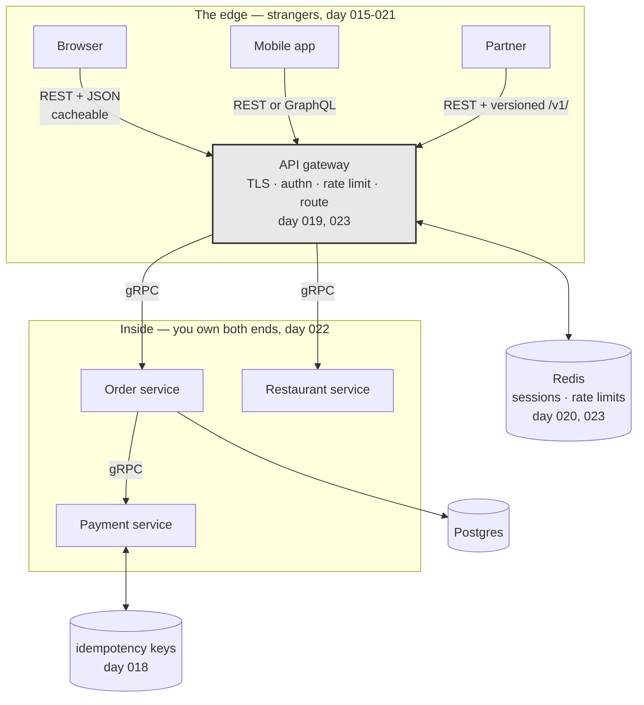

# Day 024 · System Design — API revision and interview questions

**After today you can:** You can design and defend an API for an unseen feature in fifteen minutes.

**The interviewer asks it as:** *Design the API for a food delivery app's order flow.*

---

## 1. What this is, and why they ask it

Days 15 to 23 built the API phase: what an API is, REST and its constraints, designing endpoints,
status codes and idempotency, authentication and authorisation, sessions and tokens, GraphQL, gRPC,
and rate limiting. Today converts that from nine documents you have read into one performance you can
give.

This is not a summary. It is a **drill**, for the same reason [day 018](../day-018-arrays-revision/README.md)
was a drill: the gap between knowing something and producing it out loud, in order, under mild
pressure, is much wider than anyone expects, and interviews only ever test the second thing.

API design questions appear in three places. As a ten-minute warm-up before a larger system design
round — *"before we start, design me the endpoints for X"*. As a component of every full design, since
the moment you draw two boxes you have to say what one asks the other for. And as the whole question
in back-end interviews at product companies, where "design the API for a food delivery order flow" is
a complete forty-five minutes.

The thing being measured is **judgement with nothing to lean on**. Nobody expects you to recall RFC
numbers. They expect you to name the resources before writing paths, paginate without being told, know
that an empty list is not a `404`, and mention idempotency before they ask about the payment.

---

## 2. The story

Farhat has been teaching driving for eleven years at a school off the Byepass road, and she says the
same thing to every student on the first day, and almost none of them believe her.

The bit that stops people passing is not the driving. It is that they only ever practise one route.

She had a student last year, a young man who was genuinely good — smooth with the clutch, careful,
patient at junctions. He had done nineteen lessons and he knew the route around the test centre the
way you know the way to your own kitchen. He knew which junction had the bad camber and where the
school bus parks at eleven o'clock. On the test they took him a different way, out past the new
buildings where he had never been, and he came apart in about four minutes. Not because it was harder.
Because everything he had was tied to that one road.

So the last four lessons with Farhat are different. She does not choose the route. She has a list on
her phone with about thirty places on it, and when the student gets in she reads one out — the
hospital, the wholesale market, the temple with the awkward left turn — and that is where they are
going, and she does not say anything else for the rest of the hour.

Students hate it. They say it is unfair because they have not practised that one.

That is the point, she tells them. On the day, the man beside you will pick, and you will have not
practised it. What you are practising now is not a road. It is the thing you do when you are handed a
road you do not know: check the mirrors, work out which lane, ask if you are not sure, and go slowly
enough to think.

Her pass rate is very good, and she says it has nothing to do with the driving.

---

## 3. The idea in plain English

Farhat's thirty places are today's exercise. You are not revising nine documents. You are practising
**the thing you do when handed a feature you have not seen** — which is a fixed procedure, and it is
the same procedure every time.

### The seven-step procedure

Whatever the feature is, this is the order. It never changes, and knowing it means you are never
stuck at the start wondering what to say first.

| Step | Roughly | What you do |
|---|---|---|
| **1. Scope** | 1 min | Ask three or four questions. Who calls this? What is in and out? Any scale figure? |
| **2. Nouns** | 2 min | List the resources. Out loud, before any path. |
| **3. Paths and methods** | 4 min | Collection and item for each noun. Nest for list and create only. |
| **4. One response body** | 2 min | Sketch the JSON for the main resource. This is where the real questions live. |
| **5. Errors** | 2 min | The five or six failure cases, each with a status code. |
| **6. Cross-cutting** | 2 min | Auth, pagination, idempotency, rate limits — in that order. |
| **7. Trade-offs** | 2 min | One thing you would do differently at ten times the scale. |

Fifteen minutes. Steps 4, 5 and 6 are what separate candidates, and they are exactly the steps people
run out of time for — which is why steps 1 to 3 must be fast.

### The nine things you must produce without being asked

An interviewer is ticking these off silently. Say each one before they have to prompt you:

1. **Resources are nouns, plural, consistent.** `/orders`, never `/getOrder`.
2. **Nest for list and create; top-level for read, update and delete.** `POST /restaurants/9/reviews`
   but `PATCH /reviews/41`.
3. **Filters, sorting and paging go in the query string.** `?status=delivered&limit=20`.
4. **Every collection is paginated from day one** — default limit, hard server cap, cursor not offset.
5. **An empty collection is `200` with `[]`, not `404`.** `404` is the parent missing.
6. **`POST` is not idempotent**, so anything that creates or moves money takes an idempotency key.
7. **`401` is "I don't know you"; `403` is "I know you and no".** The check is server-side, in the
   query where possible.
8. **Versioning is in the path**, `/v1/`, and you can name the header alternative.
9. **Rate limits exist**, keyed per user and per endpoint, returning `429` with `Retry-After`.

If you produce nine of nine in fifteen minutes, you have given a strong answer whatever the feature
was.

### The nine days, in one line each

| Day | The one sentence that survives |
|---|---|
| [015](../day-015-the-write-pointer/README.md) API | A published promise: the operations, how to ask, what comes back. The caller never gets the machinery. |
| [016](../day-016-2d-arrays/README.md) REST | Six constraints; uniform interface and statelessness are the two that matter; nobody implements HATEOAS. |
| [017](../day-017-matrix-tricks/README.md) Endpoints | Nouns first. Nest for list and create. Paginate everything. Empty is not missing. |
| [018](../day-018-arrays-revision/README.md) Status & idempotency | Three outcomes, not two. A timeout tells you nothing. Client-generated key, claimed atomically. |
| [019](../day-019-what-a-string-is/README.md) Authn/authz | Who are you, versus what may you do. Once, versus every request. Argon2id at ~250 ms. |
| [020](../day-020-building-strings/README.md) Sessions/JWT/OAuth | The whole trade is revocation. Short tokens plus revocable refresh is a session store again. |
| [021](../day-021-frequency-maps/README.md) GraphQL | Fixes over- and under-fetching; costs you HTTP caching, and needs DataLoader and depth limits. |
| [022](../day-022-anagrams/README.md) gRPC | Schema, persistent HTTP/2, binary. Inside the system; REST at the edge. |
| [023](../day-023-palindromes/README.md) Rate limiting | Token bucket: capacity is burst, refill is average. At the gateway, in Redis, atomically. |

### The choosing questions

Half of what gets asked in this phase is *which one*, and each has a condition rather than a
preference:

- **REST or GraphQL?** GraphQL when clients are logged-in apps whose responses were never cacheable
  anyway and several front-end teams need different shapes. REST when it is public, read-heavy and
  cacheable.
- **REST or gRPC?** gRPC inside, REST at the edge. The boundary is whether the caller is a stranger.
- **Session or JWT?** Session for a first-party web app — instant revocation, 400 MB for ten million
  users. JWT when many services must verify without a central lookup.
- **`PUT` or `PATCH`?** `PUT` replaces the whole resource; `PATCH` changes part. Most resources want
  `PATCH`.
- **`POST /x/action` or `PATCH /x`?** State change → `PATCH`. Genuine operation with its own
  permissions and audit trail → action sub-resource. Keep the number of those small.
- **Offset or cursor pagination?** Cursor, for anything where items arrive while a user scrolls, and
  for anything deep.

---

## 4. The picture

The fifteen minutes, as a shape:

```
  0     1              3                  7            9         11        13       15
  |-----|--------------|------------------|------------|---------|---------|--------|
   scope    nouns        paths & methods    response     errors    cross-    trade-
                                              body                 cutting   offs

  |____________________|                  |_____________________________________|
     talking, no paths                        where the marks actually are

   ^                                      ^
   3-4 questions, then stop asking        if you are still drawing paths at
                                          minute 9, you will run out of time
```

**What to notice:** paths take four minutes and everything after them takes six. Candidates spend
twelve minutes perfecting paths and never reach idempotency or pagination, which are the parts being
scored.

The whole phase, as one system:



**What to notice:** every day of the phase has a place on this one diagram. If you can draw this from
memory and say which day each label came from, you have revised the phase.

---

## 5. How it actually works

Two worked designs. Read them as transcripts, not as reference material — the value is in the order
things are said.

### Worked design one: a food delivery order flow

**Step 1 — scope, four questions.**

> *"Before I start: is this the customer-facing API, the restaurant's, or the delivery rider's — or
> all three? Does an order need to be modifiable after it is placed? Is payment inside this flow or a
> separate service? And roughly what scale — orders per day?"*

Say: customer-facing, no modification after placement, payment is a separate service called
synchronously, one million orders a day.

**Step 2 — nouns, out loud.**

> *"Restaurant, menu item, cart, order, payment, delivery. The cart is interesting — I'll come back
> to whether it needs to be server-side at all."*

**Step 3 — paths.**

```
GET    /restaurants?lat=&lng=&radius=&cuisine=&limit=20&after=      200
GET    /restaurants/{id}                                            200
GET    /restaurants/{id}/menu-items?limit=50&after=                 200

GET    /carts/me                                                    200
PUT    /carts/me/items/{menu_item_id}    {"quantity": 2}            200   idempotent
DELETE /carts/me/items/{menu_item_id}                               204

POST   /orders                            Idempotency-Key: <uuid>   201 + Location
GET    /orders/{id}                                                 200
GET    /orders?status=active&limit=20&after=                        200
POST   /orders/{id}/cancel                                          200 | 409

GET    /orders/{id}/delivery                                        200
```

Three decisions to say out loud while writing them:

- **`PUT` on a cart item, not `POST`.** `PUT /carts/me/items/{id}` with a quantity means *the quantity
  of this item is now 2*. Tapping "add" twice on a flaky connection leaves quantity 2, not two
  separate lines. `POST /carts/me/items` would create duplicates.
- **`/carts/me` rather than `/carts/{id}`.** The caller only ever has one cart and it is theirs;
  putting an id in the path invites the insecure-direct-object-reference bug from
  [day 019](../day-019-what-a-string-is/README.md).
- **`cancel` is an action sub-resource.** It has its own permission rules and a time limit, and
  burying it in a `PATCH` would hide a significant state change inside a generic update. This is the
  one exception, and I would keep it the only one.

**Step 4 — one response body.**

```json
{
  "id": "ord_8f2a",
  "status": "preparing",
  "placed_at": "2026-08-27T13:40:11Z",
  "restaurant": { "id": "res_19", "name": "Anand Bhavan", "image_url": "https://..." },
  "items": [
    { "menu_item_id": "mi_77", "name": "Masala dosa", "quantity": 2, "unit_price": 90 }
  ],
  "totals": { "items": 180, "delivery": 30, "taxes": 11, "grand_total": 221 },
  "delivery": { "eta_minutes": 28, "rider": null },
  "cancellable_until": "2026-08-27T13:42:11Z"
}
```

Four decisions visible here: the restaurant is embedded as a summary so the client does not make a
second call; totals are broken down because a single number generates support tickets; `rider` is
`null` until assigned rather than absent, so clients need not test for the key; and
`cancellable_until` is computed server-side so every client agrees about the deadline.

**Step 5 — errors.**

| Case | Code |
|---|---|
| restaurant does not exist | `404` |
| restaurant exists but is closed | `409` |
| item no longer available | `409` with the offending item id in the body |
| cart empty | `422` |
| not logged in | `401` |
| cancelling somebody else's order | `403` |
| cancelling after the window | `409` |
| too many orders in a minute | `429` + `Retry-After` |

**Step 6 — cross-cutting, and this is where the marks are.**

> *"`POST /orders` takes an idempotency key generated by the client when the checkout screen opens —
> not when the button is pressed — so a double tap and a network retry both carry the same key. The
> server claims it atomically, and a retry gets the stored response rather than a second order. Every
> collection is cursor-paginated with a default of 20 and a hard cap. Auth is a session or token at
> the gateway; ownership is checked in the query, not after it. Rate limits are per user and per
> endpoint — generous on restaurant browsing, tight on order creation."*

**Step 7 — one trade-off.**

> *"The server-side cart is the thing I would question. It costs a write on every tap and it only
> exists so the cart survives a device change. If that is not a product requirement, I would keep the
> cart on the client and send it whole at checkout, which removes an entire resource. At ten times
> the scale I would also make order placement asynchronous — `202 Accepted` with a status endpoint —
> because holding a connection open through a synchronous payment call is what falls over first."*

### Worked design two: a notifications feature, compressed

Same procedure, three minutes:

```
GET   /notifications?unread=true&limit=20&after=       200
PATCH /notifications/{id}          {"read": true}      200
POST  /notifications/read-all                          200   the one action endpoint
DELETE /notifications/{id}                             204
GET   /notification-preferences/me                     200
PATCH /notification-preferences/me                     200
```

Say out loud: unread is a **filter**, not a path. `PATCH` for one, because setting `read: true` twice
is idempotent. `read-all` is an action because it is not a state change on any single resource. Zero
notifications is `200` with `[]`.

---

## 6. The numbers

The arithmetic you should be able to produce without notes. These are the ones that come up.

### Traffic from users

```
10,000,000 daily users × 8 requests each = 80,000,000 requests/day
80,000,000 ÷ 86,400                      ≈ 926 requests/second average
peak ≈ 3-4x average                      ≈ 3,700 requests/second
```

### What caching buys

```
80% of traffic cacheable, 90% CDN hit rate:
   absorbed by the CDN  = 3,700 × 0.8 × 0.9 = 2,664 req/s
   reaching your origin = 3,700 - 2,664     = 1,036 req/s
```

Roughly 3.5x fewer servers, and cached reads come back in ~20 ms instead of ~150. **This is the
number that decides REST versus GraphQL for a public API.**

### Read-to-write ratio

```
300,000 writes/day  ≈ 3.5 writes/second
80,000,000 reads/day ≈ 926 reads/second
ratio ≈ 265 : 1
```

A ratio like that says: cache hard, denormalise counts, stop worrying about write throughput. **One
ratio drives more decisions than any other number.**

### Storage

```
1,000,000 orders/day × 2 KB   = 2 GB/day
2 GB × 365                    = 730 GB/year
with indexes, roughly double  ≈ 1.5 TB/year
```

Which fits on one machine for years — so the answer to "would you shard?" is no, with arithmetic
behind it.

### Login cost

```
bcrypt cost 12 ≈ 250 ms  ->  4 logins/second/core
500,000 logins/day, 25% in the peak hour = 125,000 ÷ 3,600 ≈ 35/second
35 ÷ 4 ≈ 9 cores on hashing alone
```

### Rate limiting

```
fixed window, 100/min : 100 at 10:00:59 + 100 at 10:01:00 = 200 in one second
token bucket          : 2 numbers per caller — 1M active callers ≈ 60 MB in Redis
429 at the gateway    : ~0.5 ms   vs   serving the request ~50 ms   → 100x cheaper to refuse
```

### Pagination

```
50,000 comments × 250 bytes = 12.5 MB unpaginated  ≈ 50 seconds on a 2 Mbps connection
20 × 250 bytes              = 5 KB paginated
offset at page 100,000      : scans 5,000,000 rows ≈ 2,000 ms
cursor at any page          : index seek           ≈ 1 ms
```

### Payload comparison

```
REST      : 11 KB per screen, ~2 KB actually rendered
GraphQL   : ~2 KB
gRPC+HTTP2: 28 bytes vs 258 for a small message — about 9x
```

---

## 7. The trade-offs

The five arguments this phase turns on. Each has a condition, not a winner.

**Nest or flat?** Nest when the parent type is stable and the child is meaningless without it. Go flat
when the feature is heading for several parent types, since `/photos/9/comments` and
`/videos/4/comments` will otherwise multiply.

**Embed or reference?** Embed a small summary — id, name, image — to save a round trip per rendered
item. Reference when the data changes often or matters legally, because embedded copies go stale in
every cache.

**Session or token?** Revocation against a lookup. Sessions for first-party web; tokens where the
verifier cannot reach a central store.

**REST, GraphQL or gRPC?** Cacheability, client diversity, and who owns the caller. Public and
read-heavy: REST. Many logged-in clients wanting different shapes: GraphQL. Between your own services
at volume: gRPC.

**Exact or approximate?** Rate limits can be approximate — you are protecting capacity. Billed quotas
and payments cannot.

### The sentence that separates candidates

> **I would not add a component this design does not need.** At a million orders a day the writes are
> about twelve a second and the storage is a terabyte and a half a year — one Postgres instance
> handles that without noticing, so I would not shard, and I would not put a queue in front of order
> creation until synchronous payment latency actually became the problem. What I *would* add on day
> one is pagination, idempotency on order creation, and rate limits, because retrofitting those into a
> live API is far harder than adding a database later.

---

## 8. In the interview

### How it gets asked

- *"Design the API for a food delivery app's order flow."* — the full version, fifteen to forty-five
  minutes.
- *"Design the endpoints for X."* — the warm-up, where X is comments, notifications, a URL shortener,
  a parking lot, a chat.
- *"Here's an endpoint. What would you change?"* — the critique version.
- *"Walk me through what happens when a user taps 'Pay'."* — the same knowledge, told as a story, and
  the one where idempotency has to appear unprompted.

### What to say out loud, in the first ninety seconds

1. **Ask three or four scoping questions, then stop.** Who calls it, what is in scope, what happens
   after creation, roughly what scale. More than four and you are stalling.
2. **List the nouns out loud, before any path.** *"Restaurant, menu item, cart, order, payment,
   delivery."*
3. **State your nesting rule as a rule**, not as a series of decisions.
4. **Say "and every collection is paginated" before anyone asks.**
5. **Say "order creation takes an idempotency key" before anyone asks about payments.**
6. **Then start writing paths**, and narrate the two or three that involved a real decision — `PUT`
   on a cart item, `/carts/me` rather than an id, `cancel` as the single action endpoint.
7. **Leave six minutes** for the response body, the errors and the cross-cutting concerns. Those are
   the marks.

### The follow-ups

**"Walk me through what happens when the user taps Pay."**
The client already holds an idempotency key generated when the checkout screen opened, not when the
button was pressed — so a double tap and a network retry carry the same key. It sends
`POST /orders` with that key in a header. The gateway terminates TLS, verifies the session token,
checks the rate limit for this user on this endpoint, and routes on. The order service claims the
idempotency key atomically; if it already exists and is complete it returns the stored response and
does nothing else, and if it exists and is in flight it returns `409` so the client waits rather than
racing. Otherwise it validates the cart, checks the restaurant is open and the items are available —
`409` with the offending item if not — writes the order in a pending state, and calls the payment
service synchronously with its own idempotency key. On success it returns `201` with a `Location`
header. If the payment call times out I do not blindly retry; I query the payment service for the
status of that key, because a timeout means it may well have succeeded and only the response was
lost.

**"Someone changes the id in `GET /orders/1055` and sees another user's order. What went wrong?"**
That is an insecure direct object reference: the endpoint authenticated the caller but never
authorised the object. It verified *who* you are and not *whether this order is yours*. The fix is to
put the ownership condition into the query itself — `SELECT ... WHERE id = $1 AND user_id = $2` — so a
wrong id simply returns nothing and there is no separate check for anyone to forget. Fetching by id
and then checking in code works but depends on every developer remembering every time. I would return
`404` rather than `403` here, because a `403` confirms that order 1055 exists. And I would use
non-sequential ids like UUIDs, which does not fix the flaw but stops an attacker walking through every
order by counting.

**"How would you version this API?"**
Version in the path — `/v1/orders` — because it is unambiguous, trivial to route, and visible in every
log and every support ticket. The header alternative, like GitHub's
`Accept: application/vnd.github.v3+json`, is cleaner in theory and much harder to test by hand.
Whichever I choose, the more important discipline is not needing a new version often: adding an
optional field to a response is backward compatible and needs no version bump, and so is adding an
optional request parameter. A version is for changes that break existing callers — removing a field,
changing a type, changing what an operation means. I would also date-pin per customer the way Stripe
does if this were a paid API with long-lived integrations, since that gives callers a stable world
without freezing my own development.

**"The order service is getting 10x the traffic. What breaks first, and what do you change?"**
The synchronous payment call, almost certainly — it holds a connection open for the length of a
third-party round trip, so at ten times the load I run out of connections and threads long before I
run out of CPU or storage. The change is to make order placement asynchronous: accept the order,
return `202 Accepted` with a status URL, put the payment on a queue, and let the client poll or receive
a push. That converts a latency problem into a throughput problem, which is much easier to scale.
Second thing to break would be the reads on restaurant listings, and those are highly cacheable and
mostly identical between users, so a CDN and a Redis layer take most of it. I would explicitly not
shard the database yet — at ten times a million orders a day the storage is still only about 15 TB a
year, and one instance with read replicas handles it.

### A model answer

Compressed, for the fifteen-minute version.

> "Four questions first. Is this the customer app, the restaurant's, or the rider's? Can an order be
> changed after it is placed? Is payment inside this flow or a separate service? And roughly how many
> orders a day?
>
> ...Customer-facing, no changes after placing, payment separate and synchronous, a million a day.
>
> The resources are: restaurant, menu item, cart, order, payment, delivery. I'll nest for listing and
> creating, since a menu item has no meaning without its restaurant, and keep everything else
> top-level because ids are already unique.
>
> ```
> GET    /restaurants?lat=&lng=&cuisine=&limit=20&after=
> GET    /restaurants/{id}/menu-items?limit=50&after=
> GET    /carts/me
> PUT    /carts/me/items/{menu_item_id}   {"quantity": 2}
> POST   /orders          Idempotency-Key: <uuid>          201 + Location
> GET    /orders/{id}
> GET    /orders?status=active&limit=20&after=
> POST   /orders/{id}/cancel                               200 | 409
> ```
>
> Three deliberate choices. `PUT` on a cart item rather than `POST`, because `PUT` means 'the quantity
> is now 2' — so a double tap on a flaky connection leaves one line at quantity 2, where `POST` would
> create duplicates. `/carts/me` rather than a cart id, because the caller only ever has one and
> putting an id there invites someone to read another user's cart. And `cancel` is an action
> sub-resource, because it has its own permission rules and a time window; that's my one exception to
> nouns-only and I'd keep it the only one.
>
> Every collection is cursor-paginated with a default limit of 20 and a hard server cap — cursors
> rather than offsets because new restaurants and orders arrive while a user scrolls, and offsets
> duplicate rows when that happens.
>
> Order creation takes an idempotency key that the client generates when the checkout screen opens,
> not when the button is pressed, so both a double tap and a network retry carry the same key. The
> server claims it atomically and replays the stored response for any repeat. That matters because
> `POST` is not idempotent and a timeout tells you nothing about whether the order was placed.
>
> Errors: `404` if the restaurant doesn't exist, `409` if it exists but is closed or an item ran out,
> `422` for an empty cart, `401` unauthenticated, `403` for cancelling someone else's order, `409` for
> cancelling after the window, `429` with `Retry-After` on rate limits. And an empty order list is
> `200` with an empty array, not a `404`.
>
> One trade-off: the server-side cart costs a write per tap and only buys cross-device persistence. If
> that isn't a requirement I'd hold the cart on the client and send it whole at checkout. And at ten
> times this scale I'd make order placement asynchronous — `202` plus a status endpoint — because
> holding a connection open through a synchronous payment call is what falls over first. What I would
> not do is shard: a million orders a day is about 1.5 TB a year, which one Postgres instance handles
> comfortably."

---

## 9. Recall card

- **The procedure: scope → nouns → paths → one response body → errors → cross-cutting → trade-off.**
  Fifteen minutes; the marks are in the last three.
- **Say without being asked:** pagination on every collection, idempotency key on anything creating or
  paying, an empty list is `200` with `[]`.
- **Nest for list and create; top-level for read, update, delete.** Filters go in the query string.
- **Every "which one" question has a condition:** cacheability and who owns the caller decide REST vs
  GraphQL vs gRPC; revocation decides session vs JWT.
- **Do not add components the arithmetic does not demand.** Do add pagination, idempotency and rate
  limits on day one.
