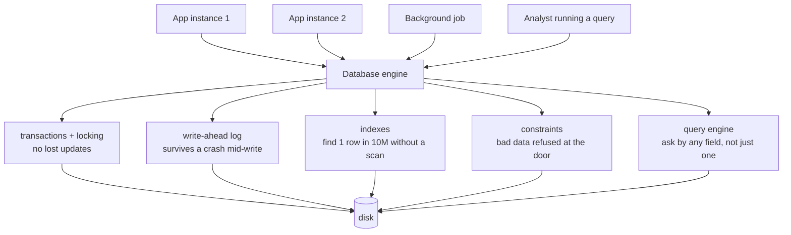

# Day 025 · System Design — What a database gives you that a file does not

**After today you can:** You can list the four things a database does that your own file-handling code would get wrong.

**The interviewer asks it as:** *Why not just store the data in a JSON file?*

---

## 1. What this is, and why they ask it

A **database** is a program whose entire job is storing data on behalf of other programs, safely,
concurrently, and in a way that lets you find things without reading everything.

That sounds obvious until you try to build it. Every one of those properties is a hard problem, and
the reason you use Postgres rather than writing to `data.json` is that Postgres has solved all of them
and your file-handling code has solved none of them. There are four things your own file handling
would get wrong:

- **Durability** — once it says the write succeeded, the data survives the process dying mid-write.
- **Concurrency** — many readers and writers at once, without one silently overwriting another.
- **Fast lookup** — find one row among a hundred million without reading a hundred million.
- **Integrity** — data that violates your rules is refused rather than stored.

And one mechanism that ties the first two together — the **transaction**, a group of changes that
either all happen or none do.

Interviewers ask this at the start of the database phase for a good reason: it establishes whether you
know *why* the component exists, rather than just that it does. It also has a real answer in the other
direction. Sometimes a file **is** the right choice, and a candidate who says "always use a database"
is repeating a rule rather than thinking. Configuration, static content and single-writer append logs
are all perfectly good as files.

This is day one of eighteen on databases, running to [day 042](../day-042-binary-search-idea/README.md).
Everything after this — tables, keys, SQL, joins, indexes, transactions, replication — is a detail of
one of the four things above.

---

## 2. The story

Imran and Faisal run a small transport business out of a room behind their father's shop, two lorries
and a driver each, mostly moving cement and steel to sites around the district.

For four years the entire business lived in the contacts on Imran's phone. Not just names and
numbers — he used the notes field. *Rajan Constructions, site at Perundurai, ₹18,000 pending, pays on
the 10th, don't call before 11.* Four hundred and some entries like that, and he could find anything
in it in seconds, because he had put it all there himself.

Three things went wrong, and they went wrong in a particular order.

The first was Faisal. When he started handling half the customers they copied the whole lot onto his
phone so they would both have it. Within a month it had come apart. Imran changed a number on his
phone on the Tuesday; Faisal added two new customers on his; and when they sent the list across at
the end of the week, whichever one arrived last simply replaced the other, and a week of somebody's
work was gone. Twice they lost the wrong week and did not notice for a month.

The second was the question their accountant asked in April. Which customers in Erode district owe
more than ten thousand, and how much is it altogether? Imran can search his contacts for a name. He
cannot search them for that. He spent an evening scrolling through four hundred entries with a
calculator, got a number, and was fairly sure it was wrong.

The third was in June, when Imran's phone went into a bucket of water at a site. He had a backup, from
March.

The thing that actually annoys him most, though, is smaller than any of those. There is nothing in a
phone that stops you saving a customer with no number at all, or the same customer twice under two
spellings, or a payment date of the thirty-first of February. He has all three in there. Nobody typed
them wrong on purpose. There was simply nothing there to say no.

---

## 3. The idea in plain English

Imran's contacts are a file. Everything that went wrong is one of the four things a database does, and
they map one to one.

### Durability: it survives the crash

Imran's backup was from March. The general version of that problem is worse and more subtle: **a file
write is not one action.** If your program writes 5 MB of JSON and the process is killed at 3 MB, the
file on disk is half old and half new, and it is no longer valid JSON at all — you have not lost the
last change, you have lost **everything**.

A database avoids this with a **write-ahead log**. Before changing the actual data, it appends a
record of what it is about to do to a log file, and forces that to disk. If the power fails halfway,
the log is replayed on restart and the change is either fully applied or fully discarded. When
Postgres says `COMMIT` succeeded, the data is on disk, and that promise is the `D` in
**ACID** — Atomicity, Consistency, Isolation, Durability — the four letters you will meet properly on
[day 033](../day-033-window-with-a-map/README.md).

The naive file version of this is `open("data.json", "w")`, which **truncates the file to zero before
writing a single byte**. A crash at that moment leaves you with nothing at all.

### Concurrency: two writers do not destroy each other

This is Imran and Faisal, and it is the failure most people underestimate.

```
10:00  Imran's process  reads data.json   (400 customers)
10:00  Faisal's process reads data.json   (400 customers)
10:01  Imran adds a customer,  writes 401
10:02  Faisal adds a customer, writes 401   <- Imran's addition is gone
```

Nothing errored. No warning. One of the two changes simply does not exist, and this is called a **lost
update**. Do it with two threads inside one process and you get the same thing plus corrupted files,
because two writers interleaving in the same file produce bytes that are neither version.

A database handles this with **locking** and **transactions**. Two transactions touching the same row
are serialised; two touching different rows run in parallel. You get the answer you would have got if
they had run one after another, which is the `I` in ACID — isolation.

You can build file locking yourself. People do, and then they discover that it does not work across
machines, that a crashed process leaves the lock held forever, and that a lock around the whole file
means one writer at a time for the entire dataset.

### Fast lookup: finding without reading everything

This is the accountant's question. Contacts can search by name because that is the one thing the phone
maintains a lookup for. Anything else means reading all four hundred.

For a file, finding one record means reading and parsing **the whole file**, which is `O(n)`. That is
fine for four hundred records and ruinous for ten million:

```
10,000,000 records × 200 bytes = 2 GB
reading 2 GB from an SSD at ~500 MB/s ≈ 4 seconds, per query
```

A database keeps an **index** — a separate structure, usually a B-tree, that maps a value to the
location of the matching rows. Looking up one row among ten million becomes about three or four disk
reads rather than a scan, so **milliseconds instead of seconds**. Indexes are
[day 030](../day-030-fast-and-slow/README.md); for today the point is that this is a thing you get, and
that you would have to build it yourself otherwise.

### Integrity: bad data is refused

This is the customer with no number and the thirty-first of February. A file will store anything you
put in it, because a file has no opinions. A database refuses:

```sql
CREATE TABLE customers (
    id            BIGSERIAL PRIMARY KEY,
    phone         TEXT NOT NULL UNIQUE,
    district      TEXT NOT NULL,
    balance_due   NUMERIC(12,2) NOT NULL DEFAULT 0 CHECK (balance_due >= 0),
    created_at    TIMESTAMPTZ NOT NULL DEFAULT now()
);
```

`NOT NULL` refuses a missing phone. `UNIQUE` refuses the duplicate. `CHECK` refuses a negative
balance. `TIMESTAMPTZ` refuses the thirty-first of February outright, because it knows what a date is
and `"31/02"` in a JSON file is just a string.

The value is that the rule lives **in one place**. Three applications and a script all write to that
table, and none of them can break the rule, even by accident, even the one written in a hurry last
Tuesday.

### Transactions: the mechanism behind the first two

Durability and concurrency are both promises about *groups* of changes, and the transaction is what
delivers them. Move ₹5,000 from one account to another and there are two changes: subtract from one, add to the
other. If the process dies between them, money has vanished.

```sql
BEGIN;
  UPDATE accounts SET balance = balance - 5000 WHERE id = 1;
  UPDATE accounts SET balance = balance + 5000 WHERE id = 2;
COMMIT;
```

Either both take effect or neither does. That is **atomicity** — the `A` in ACID — and it is
impossible to get right with a file unless you write the whole log-and-replay machinery yourself, at
which point you have written a database.

### When a file is genuinely the right answer

Say this unprompted, because it is what distinguishes thinking from reciting.

- **Configuration** that is read at start-up and written by a human. A file is better: it goes in
  version control, it is readable, and it needs no running service.
- **Static content** — images, CSS, documents. Files on disk or in object storage like S3, with the
  database holding only the metadata and the path.
- **Append-only logs** with one writer. Appending is the one file operation that is close to safe, and
  it is why log files work.
- **Data small enough and single-user enough that none of those problems exist.** A CLI tool's
  local state is fine in a JSON file.

The tell is the **number of writers**. One writer, no queries, no rules to enforce: a file. Anything
else: a database. And note there is a middle option — **SQLite** — which is a real transactional
database that *is* a single file, with no server to run. It handles durability, transactions,
integrity and indexes, and it is limited on concurrent writers. For a lot of "would a file do?"
situations, SQLite is the correct answer and almost nobody mentions it.

---

## 4. The picture

The two failures a file cannot survive:

```
   LOST UPDATE                                 TORN WRITE
   -----------                                 ----------
   process A     data.json     process B       process           data.json
       |             |             |               |                  |
       |--- read --->|             |               |-- open("w") ---->| truncated to 0 bytes
       |             |<--- read ---|               |                  |
       |  add row    |             |               |-- write 3 MB --->| 3 MB of 5 MB
       |--- write -->| 401 rows    |               |                  |
       |             |  add row    |               X  process killed  |
       |             |<-- write ---| 401 rows      |                  |
       |             |             |                                  v
       v             v             v                          invalid JSON,
    A's row is gone. No error anywhere.                        everything lost
```

**What to notice:** neither failure produces an error message. The first silently loses one change; the
second silently loses all of them. Code that "works" in testing has both of these in it.

What a database puts between your code and the disk:



**What to notice:** four different writers, one engine. Every one of those five boxes is something you
would otherwise write yourself, once per application, and get subtly wrong in a different way each
time.

---

## 5. How it actually works

### The write-ahead log, concretely

When you run an `UPDATE` inside a transaction, Postgres does roughly this:

1. Load the affected page from disk into memory (the **buffer pool**) if it is not already there.
2. Change it **in memory**.
3. Append a description of the change to the **write-ahead log** — the WAL.
4. On `COMMIT`, force the WAL to disk with `fsync` and only then report success.
5. Write the changed page itself to disk **later**, in the background.

Step 4 is the durability promise, and step 5 is the performance trick: the WAL is written
sequentially, which on any storage is far faster than the random writes the data pages would need. If
the machine loses power between 4 and 5, the WAL is replayed on restart and the change is recovered.

That single mechanism also gives you replication — a replica is a machine replaying the same WAL — and
point-in-time recovery. It is one of the highest-value ideas in the whole subject.

### Concurrency, concretely

Two mechanisms, and you should know both names.

**Locking.** A transaction writing a row takes a lock on it; another transaction wanting the same row
waits. Different rows do not block each other.

**MVCC** — multi-version concurrency control, used by Postgres, MySQL's InnoDB, and Oracle. Instead of
readers waiting for writers, an `UPDATE` creates a **new version** of the row and leaves the old one
in place. Readers that started earlier keep seeing the old version. So **readers never block writers
and writers never block readers**, which is the single biggest reason these databases perform well
under mixed load. The price is that old versions accumulate and have to be cleaned up — Postgres calls
this `VACUUM`, and a neglected `VACUUM` is one of the classic production problems.

### Indexes, concretely

Without an index, `SELECT * FROM customers WHERE phone = '98765...'` is a **sequential scan**: read
every row. With an index on `phone`, it is a **B-tree** lookup — a shallow, wide tree kept balanced on
disk, where each node is one disk page.

```
10,000,000 rows, B-tree fanout ~500 per page:

depth 1 :        500 entries
depth 2 :    250,000
depth 3 : 125,000,000     -> 3 levels is enough for 10M rows
```

So about **3 or 4 page reads** rather than reading 2 GB. Trees arrive on
[day 098](../day-098-what-a-tree-is/README.md) and B-trees specifically in the database phase; the
number to hold on to is that an index turns a scan into three reads.

The cost: an index is extra storage, and **every write has to update it**. Ten indexes on a table
means ten extra structures maintained on every insert. That trade — reads faster, writes slower — is
the whole of index design.

### The products, and what each is for

| Product | Kind | Use it for |
|---|---|---|
| **PostgreSQL** | relational | The sensible default. Strong on correctness, JSON support, extensions. |
| **MySQL** | relational | The other default. Enormously deployed, simpler, very fast for read-heavy loads. |
| **SQLite** | relational, embedded | One file, no server. Mobile apps, desktop apps, CLI tools, tests. |
| **Redis** | in-memory key-value | Caches, sessions, rate-limit counters, queues. Durability is optional and weaker. |
| **MongoDB** | document | Schema-flexible JSON documents. Genuinely useful when the shape varies. |
| **Cassandra / DynamoDB** | wide-column key-value | Enormous write volume, horizontal scale, weaker query flexibility. |
| **Elasticsearch** | search index | Full-text search and analytics — not a system of record. |
| **S3** | object storage | Files. Images, videos, backups, data lake. Not queryable by field. |

**The honest default is Postgres**, and saying so plainly is a better answer than an enthusiastic
recommendation of something exotic. The vast majority of systems you will be asked to design fit
comfortably on one Postgres instance with replicas.

### What you are actually buying

A database is a large amount of extremely well-tested code solving problems that are easy to describe
and hard to get right. Postgres is over thirty years old and millions of lines. The point is not that
you *could* not write a WAL and a B-tree and a lock manager. It is that yours would be new code on the
most dangerous path in your system, and theirs has been run by millions of people for decades.

---

## 6. The numbers

### Scanning a file versus an index

10 million customer records, about 200 bytes each:

```
total size                = 10,000,000 × 200 B = 2 GB
read 2 GB from SSD @ 500 MB/s              ≈ 4 seconds
parse 2 GB of JSON @ ~100 MB/s             ≈ 20 seconds
------------------------------------------------------
one lookup by phone number, from a file    ≈ 24 seconds

same lookup via a B-tree index             ≈ 3-4 page reads
                                           ≈ 0.4 ms on SSD
```

**24 seconds against 0.4 milliseconds — about 60,000 times.** And the file version costs that on
*every single query*, while using 2 GB of memory to hold the parsed result.

### Memory

```
2 GB of JSON parsed into Python objects ≈ 6-10 GB of RAM
                                          (object overhead, roughly 3-5x)
```

Which is why "just load it into a dictionary at start-up" stops working long before the data looks
big.

### Concurrency, quantified

At **100 writes per second** with a read-modify-write cycle taking 50 ms, two writes overlap whenever
they arrive within 50 ms of each other:

```
expected overlapping pairs ≈ 100 writes/s × 0.05 s ≈ 5 collisions per second
```

Five lost updates a second. Over an eight-hour day that is **144,000 silently lost changes**. This is
the number that makes the concurrency argument land, because people imagine lost updates are rare.

### The write-ahead log's real benefit

```
random 8 KB writes to SSD  ≈  10,000-20,000 IOPS
sequential writes to SSD   ≈  500 MB/s = ~60,000 8 KB writes/s
```

Roughly 4× more throughput just from writing sequentially, plus the ability to batch many
transactions into one `fsync`. That is why the log-then-apply design is faster **and** safer, which is
a rare combination and worth pointing out.

### When a file is fine

```
1,000 records × 500 bytes = 500 KB
read + parse              ≈ 5 ms
one writer, no queries    → no concurrency problem, no index needed
```

Five milliseconds and no moving parts. **Adding Postgres here makes the system worse**, and saying so
is the part of the answer most candidates miss.

### Index cost on writes

```
table with 1 index  : 1 insert into the table + 1 B-tree update
table with 8 indexes: 1 insert into the table + 8 B-tree updates
                      → roughly 3-5x slower writes in practice
```

Which is the trade to name when someone says "why not index everything?".

---

## 7. The trade-offs

### What a database costs

**Operations.** A process to run, monitor, back up, upgrade and secure. Connection limits to manage —
Postgres handles a few hundred connections comfortably and needs PgBouncer beyond that, which
surprises people the first time.

**Latency.** A network round trip, typically 0.5–2 ms inside a data centre, on every query. A local
file read is microseconds. It almost never matters, and it is honest to mention.

**Impedance.** Your objects are not rows. You either write SQL by hand or adopt an ORM, and ORMs
generate the N+1 query problem exactly as GraphQL resolvers do on
[day 021](../day-021-frequency-maps/README.md).

**Schema discipline.** Changing a column on a live table with a hundred million rows is a planned
operation, not an edit. That rigidity is the same property that prevents bad data — you cannot have
one without the other.

### What a file costs

Everything in §3, and the specific danger is that **the costs are invisible until they are
catastrophic**. Lost updates produce no error. A torn write looks fine until the restart. A full scan
is fast until the data grows. Every one of these works perfectly in development.

### Which database

- **Relational (Postgres, MySQL)** when the data has structure and relationships, when you need
  transactions across several rows, and when you will query it in ways you have not thought of yet.
  This is most systems.
- **Document (MongoDB)** when documents are genuinely self-contained and the shape varies per record.
  Be aware that Postgres has a `JSONB` column type that covers a great deal of this without giving up
  transactions and joins.
- **Key-value (Redis, DynamoDB)** when access is always by a single key and you need very high
  throughput. Redis is for caches and ephemeral state; DynamoDB is a system of record with a strict
  access-pattern-first design.
- **Wide-column (Cassandra)** for enormous write volume across many machines, accepting weaker
  querying and eventual consistency.
- **Search (Elasticsearch)** alongside a real database, never instead of one. It is an index, and
  indexes can be rebuilt; systems of record cannot.

### The sentence that separates candidates

> **I would use a file if there is exactly one writer, no queries beyond "read it all", and no rules
> to enforce** — configuration, static assets, an append-only log. The moment there are two writers I
> need locking; the moment there is a second way to look the data up I need an index; and the moment
> the process can die mid-write I need a log. Those three are what a database *is*, so at that point
> the choice is between using one and writing a bad one. And if the objection is operational
> overhead, SQLite is a real transactional database in a single file with no server, which covers a
> surprising amount of the middle ground.

---

## 8. In the interview

### How it gets asked

- *"Why not just store the data in a JSON file?"* — the direct version, often as a warm-up before a
  design round.
- *"What does a database actually give you?"* — the same question, phrased positively.
- *"When would you *not* use a database?"* — the version that catches people who have only learned one
  side.
- *"What's the difference between SQL and NoSQL?"* — where this vocabulary gets used, and where the
  honest answer starts with "what are the access patterns?".
- *"Two users update the same record at the same time. What happens?"* — the concurrency half, asked
  as a scenario.

### What to say out loud, in the first ninety seconds

1. **Name the four things, in order.** *"Durability, concurrency, fast lookup and integrity — plus
   transactions, which are how the first two are actually delivered. A file gives you none of them."*
2. **Lead with concurrency, because it is the one people underestimate.** *"With a file, two processes
   that read, change and write back will silently lose one of the changes. No error, nothing in the
   log. At a hundred writes a second that's several lost updates a second."*
3. **Then durability, with the mechanism.** *"Opening a file for writing truncates it first, so a crash
   halfway through loses everything, not just the last change. A database appends to a write-ahead log
   and forces that to disk before reporting success, so a crash replays cleanly."*
4. **Then the lookup, with the number.** *"Finding one record in a file means reading and parsing all of
   it — 2 GB and about 24 seconds for ten million records. A B-tree index makes it three or four page
   reads, under a millisecond."*
5. **Then integrity, briefly.** *"And the rules live in one place, so no application can violate them —
   `NOT NULL`, `UNIQUE`, `CHECK`, and real date types instead of strings."*
6. **Give the other side, unprompted.** *"Files are genuinely right for configuration, static assets
   and single-writer append logs. And SQLite is a real transactional database that is a single file
   with no server, which covers a lot of the middle."*
7. **Say the default.** *"For most systems I'd start with Postgres and not be clever about it."*

### The follow-ups

**"When would you actually use a file?"**
Whenever none of those problems exists. Configuration read at start-up and edited by a human is
better as a file: it lives in version control, it is diffable and reviewable, and it needs no running
service. Static assets — images, video, documents — belong on disk or in object storage like S3, with
the database holding only the metadata and the key, because storing large binaries in a database bloats
backups and buffer pools for no benefit. Append-only logs work as files because appending is the one
file operation that is nearly safe, which is exactly why every log file in the world is a file. And a
single-user tool's local state is fine as JSON. The test I apply is the number of writers: one writer,
no queries, no invariants to protect, and a file is not just acceptable but better. The moment any of
those three changes, I need locking, indexing or a log — and those three things *are* a database, so I
would be choosing between using one and writing a worse one.

**"Two users update the same record at the same time. What happens?"**
With a file, one of the updates disappears silently. Both processes read the current contents, both
modify their in-memory copy, and both write the whole thing back — whichever writes second wins
completely, and the first one's change never existed. There is no error anywhere, which is what makes
it dangerous. With a database, the two updates are serialised: the second transaction either waits for
a lock or, under MVCC, works on a snapshot and gets a serialisation error it can retry. Either way the
result is the same as if they had run one after the other. Worth adding that the database only
protects you at the row level automatically — application-level lost updates are still possible if you
read a value, compute in your code, and write it back. The fix there is either to do the arithmetic in
the database (`SET balance = balance - 5000` rather than reading and subtracting) or to use optimistic
locking with a version column.

**"What's the difference between SQL and NoSQL, and how do you choose?"**
The label is less useful than it sounds, because "NoSQL" covers four unrelated families. What actually
differs is the data model and what you give up. Relational databases give you a fixed schema, joins,
and transactions across many rows, at the cost of being harder to scale horizontally. Document stores
give you flexible per-record shapes and easy horizontal scaling, at the cost of joins and, historically,
transactional guarantees. Key-value stores are extremely fast when every access is by one key and
useless otherwise. Wide-column stores handle enormous write volume by making you design the table
around your query in advance. So the question I would actually ask is: what are the access patterns,
does anything need to be atomic across records, and how much data is there? For most systems the
answer is a relational database, and I would say that plainly — Postgres also has a JSONB type that
covers a lot of the document use case without giving up transactions.

**"Isn't a database just a file underneath?"**
Yes, and that is the interesting part. Postgres writes to ordinary files on an ordinary filesystem.
The difference is entirely in what it does between your `INSERT` and those bytes landing: a write-ahead
log forced to disk before the commit is acknowledged, a buffer pool so hot pages are not re-read, a
lock manager and MVCC so concurrent transactions do not corrupt each other, B-tree indexes maintained
alongside the data, a query planner deciding how to satisfy your request, and constraint checking. So
"just use a file" is really "reimplement those six things", and the honest framing is that you are not
choosing between a database and no database — you are choosing between a mature one and one you are
about to write badly, on the most dangerous path in your system.

### A model answer

> "You can, and for some things you should — but a database gives you four things a file does not, and
> the failures you get without them are all silent, which is what makes them dangerous.
>
> The one people underestimate is **concurrency**. With a file, two processes that read it, change it
> and write it back will silently lose one of the changes: both read the same 400 records, both write
> back 401, and whichever writes second wins completely. There's no error and nothing in the log. At a
> hundred writes a second with a 50-millisecond read-modify-write cycle, that's about five lost updates
> a second — over a working day, more than a hundred thousand silently discarded changes.
>
> Second, **durability**. Opening a file for writing truncates it to zero first, so a crash partway
> through doesn't lose the last change — it loses the entire file, and what's left isn't even valid
> JSON. A database writes a description of the change to a write-ahead log and forces *that* to disk
> before reporting success, so a crash replays cleanly on restart. That same log is also what gives you
> replication and point-in-time recovery.
>
> Third, **lookup**. Finding one record in a file means reading and parsing all of it. Ten million
> records at 200 bytes is 2 GB — about four seconds to read and twenty to parse, on every query, and
> six to ten gigabytes of RAM once it's parsed into objects. A B-tree index turns that into three or
> four page reads, well under a millisecond. That's roughly sixty thousand times.
>
> Fourth, **integrity**. A file stores whatever you give it. A database refuses a missing phone number,
> a duplicate, a negative balance or the thirty-first of February, and the rule lives in one place so
> no application can break it — including the script somebody wrote in a hurry.
>
> And underneath two of those, **transactions**. Moving money is two changes, and either both happen or neither should. You
> cannot get that right with a file without writing the log-and-replay machinery yourself, at which
> point you have written a database.
>
> But I'd say the other side too, because sometimes a file is right. Configuration read at start-up
> belongs in a file — it goes in version control and needs no running service. Static assets belong in
> object storage with only the metadata in the database. Append-only logs work as files because
> appending is the one nearly-safe file operation. The test is the number of writers: one writer, no
> queries, no invariants, and a file is genuinely better. And there's a middle option people forget —
> SQLite is a real transactional database in a single file with no server to operate, which covers a
> lot of the ground between the two."

---

## 9. Recall card

- **Four things a database gives you:** durability, concurrency, fast lookup, integrity — delivered by
  **transactions**.
- **The failures a file gives you are silent.** Lost updates on concurrent writes; a truncated file on
  a crash mid-write; a full scan that is fine until it is not.
- **Write-ahead log** = append the intent, `fsync`, then apply. That is durability, and it is also
  replication.
- **An index turns a 2 GB scan into 3-4 page reads** — roughly 24 seconds down to 0.4 ms.
- **Files are right for configuration, static assets and single-writer logs.** And SQLite is a real
  database in one file — the answer nobody mentions.
