# Day 026 · System Design — Tables, rows, and keys

**After today you can:** You can design a small schema with primary and foreign keys and justify every column.

**The interviewer asks it as:** *Design the tables for a blog with users, posts and comments.*

---

## 1. What this is, and why they ask it

A **relational database** stores data in **tables**. A table is a fixed set of named **columns**, each
with a type, and any number of **rows**, each holding one value per column. That is the whole model,
and it has survived fifty years because two small ideas make it enough for almost anything:

- Every row has a **primary key** — a value that identifies it uniquely, forever.
- A row in one table refers to a row in another by storing that key. That stored reference is a
  **foreign key**, and the database refuses to let it point at nothing.

From those two, everything else follows: joins, integrity, and the rule that each fact is stored in
exactly one place.

Interviewers ask you to design a small schema constantly, because it is fast and it is unfaked. In ten
minutes it shows whether you can identify the entities, choose keys, model a relationship, pick types
that mean something, and say why each column exists. Candidates who have only used an ORM often
produce something that works and cannot explain why `user_id` is on the `posts` table rather than a
list of post ids on the `users` table — and that one question separates people cleanly.

Yesterday was *why* a database. Today is *how the data is shaped inside it*, and the next fifteen days
are all built on this vocabulary.

---

## 2. The story

Muthu has run the office of a school in Salem for twenty-two years, and the thing he is quietly
proudest of is the numbering.

Every child who joins gets a number, and that number is theirs until they leave. Not the class roll
number, which changes every June when the class is reordered — a school number, issued once, in
sequence, and never given to anyone else even after the child has left. 4417 was a boy who finished in
2019 and 4417 is still nobody else.

The number means nothing. It is not the year, it is not the class, it is not their initials. Muthu is
firm about this, and the reason is a mistake somebody made before him. They used to use initials and a
year, which was fine until two boys called Senthil Kumar joined the same June, and then it was not
fine, and it took most of a term to untangle.

The child's details — full name, date of birth, father's name, address, the phone number that
actually gets answered — are written in one place and one place only. Everything else in that office
refers to them by number. The attendance record has numbers. The fee register has numbers. The marks
for the half-yearly have numbers.

Which means that when a family moves house, Muthu changes the address in exactly one place, and every
other record in the building is instantly correct, because none of them ever held the address in the
first place.

There is one more rule and he enforces it absolutely. You cannot put marks against a number that is
not in the main register. New teachers try — a child turns up mid-term and somebody wants to record a
test — and Muthu makes them enter the child properly first. It takes four minutes and they are always
slightly annoyed. He says the alternative is a mark that belongs to nobody, and once you have three of
those in a register you can never trust the register again.

---

## 3. The idea in plain English

Muthu's school number is a **primary key**. The numbers written on the fee register are **foreign
keys**. His refusal to record marks for an unknown number is **referential integrity**, and the
address living in exactly one place is **normalisation**.

### Tables, rows, columns

A **table** holds one kind of thing. A **row** is one of those things. A **column** is one attribute
of it, with a **type** that constrains what can go there.

```
  users
  +---------+------------------+----------------+---------------------+
  | id      | email            | display_name   | created_at          |
  | BIGINT  | TEXT             | TEXT           | TIMESTAMPTZ         |
  +---------+------------------+----------------+---------------------+
  | 4417    | muthu@school.in  | Muthu          | 2026-03-04 09:12:00 |
  | 4418    | asha@school.in   | Asha           | 2026-03-05 11:40:00 |
  +---------+------------------+----------------+---------------------+
     ^
   primary key — unique, never null, never reused
```

**Rows have no order.** A table is a set, and if you want them in an order you say so with `ORDER BY`.
Relying on "the order they came back" is a bug that works until the day the database changes its plan.

### The primary key

One column (or a few) that identifies a row uniquely. Three properties, and they are worth stating as
requirements rather than conventions:

- **Unique.** No two rows share it.
- **Never null.** Every row has one.
- **Never changes.** Other tables point at it, so changing it would orphan them.

There are two kinds, and choosing is a real decision:

**A natural key** is something already meaningful — an email address, a vehicle registration, an ISBN.
Tempting, and usually a mistake, because meaningful things change. People change email addresses. Two
students really are called Senthil Kumar. A country really does renumber its vehicle plates.

**A surrogate key** is a meaningless number or identifier the database invents. `4417` is a surrogate
key: it stands for the child and says nothing about them. Because it means nothing, nothing can happen
in the world that makes it wrong.

**Use a surrogate key.** That is the default, and the reason to say out loud is exactly Muthu's: *a key
that means something can stop being true, and then every table that pointed at it is wrong.*

In Postgres:

```sql
id BIGSERIAL PRIMARY KEY          -- an auto-incrementing 64-bit integer
id UUID PRIMARY KEY DEFAULT gen_random_uuid()   -- a random 128-bit identifier
```

§7 has the trade-off between those two. It comes up in interviews.

### The foreign key

A column holding the primary key of a row in another table.

```
  posts
  +---------+-----------+---------------------------+---------------------+
  | id      | author_id | title                     | published_at        |
  +---------+-----------+---------------------------+---------------------+
  | 91      | 4417      | Notes on the fee register | 2026-05-02 08:00:00 |
  | 92      | 4418      | The new timetable         | NULL                |
  +---------+-----------+---------------------------+---------------------+
                ^
          foreign key -> users.id
```

Declaring it as a foreign key does something a plain column does not: **the database refuses to store
a value that does not exist in the other table**, and refuses to delete a user who still has posts
(unless you tell it otherwise). That is referential integrity, and it is Muthu refusing to record marks
against an unknown number.

Without it you get **orphan rows** — a post whose author does not exist — and they are impossible to
clean up later, because you cannot tell which ones were mistakes.

### Which side holds the key

This is the question that separates candidates, and it has a simple rule.

**The foreign key goes on the "many" side.** A user has many posts and a post has one author, so
`author_id` lives on `posts`. It cannot live on `users`, because a column holds one value and a user
has many posts — you would need a list in a column, which relational databases deliberately do not
have.

The three relationship shapes:

| Shape | Example | Where the key goes |
|---|---|---|
| **one-to-many** | a user has many posts | on the many side: `posts.author_id` |
| **many-to-many** | a post has many tags, a tag has many posts | a **third table**: `post_tags(post_id, tag_id)` |
| **one-to-one** | a user has one profile | either side; usually the optional one |

The many-to-many case is the one people forget. You cannot express it with a column on either side, so
you create a **join table** whose rows are the pairs. Its primary key is usually the two columns
together — a **composite key** — which also enforces that the same pair cannot appear twice.

### One fact, one place

Muthu's address rule. If the address is on the child's record and *also* copied onto the fee
register, then the day it changes there are two versions and one of them is wrong. Storing each fact
once is called **normalisation**, and it is [day 029](../day-029-read-write-pointer/README.md); the
one-sentence version to have now is:

> **Do not store a fact in two places.** Store it once, and refer to it by key everywhere else.

The exception, which is real and deliberate: counts and totals that are expensive to compute are often
copied — a `comment_count` on a post rather than counting rows every time. That is **denormalisation**,
it is a considered trade for read-heavy workloads, and it needs a job to keep it honest. Doing it by
accident is a bug; doing it on purpose with a reconciliation job is engineering.

### `NULL`, which is not zero

`NULL` means *no value here*, and it is neither `0` nor `""`. It has one property that surprises
everyone: **`NULL = NULL` is not true.** It is unknown. So you write `WHERE published_at IS NULL`,
never `= NULL`, and a `COUNT(column)` skips nulls while `COUNT(*)` does not.

Because nulls complicate everything, the discipline is: **mark every column `NOT NULL` unless you can
say what its absence means.** `published_at` being null meaning "not published yet" is a good use.
A nullable `email` on a users table usually means nobody thought about it.

### Types are constraints

Choosing `TEXT` for everything works and throws away most of what the database is for.

| Use | Not |
|---|---|
| `TIMESTAMPTZ` for a moment in time | `TEXT` — then `"31/02/2026"` is storable |
| `NUMERIC(12,2)` for money | `FLOAT` — 0.1 + 0.2 is not 0.3 |
| `BOOLEAN` | `TEXT` holding `"true"`, `"TRUE"`, `"1"`, `"yes"` |
| an `ENUM` or a lookup table for a status | free text, so `"shipped"` and `"Shipped"` both exist |
| `TEXT` for strings in Postgres | `VARCHAR(255)`, which is a MySQL habit with no benefit in Postgres |

The money one is worth being emphatic about. **Never store money in a floating-point column.** Binary
floating point cannot represent 0.1 exactly, so totals drift by fractions of a rupee and eventually
somebody notices. Use `NUMERIC`/`DECIMAL`, or store integer paise.

---

## 4. The picture

The blog schema, as tables with the keys marked:

```
  users                              posts
  +----+------------------+          +----+-----------+-------------------+
  | id | email            |<---+     | id | author_id | title             |
  +----+------------------+    |     +----+-----------+-------------------+
  | 1  | asha@example.com |    +-----| 91 | 1         | Notes on fees     |
  | 2  | ravi@example.com |    |     | 92 | 1         | The new timetable |
  +----+------------------+    +-----| 93 | 2         | Sports day        |
     ^                               +----+-----------+-------------------+
   PRIMARY KEY                          ^      ^
                                    PRIMARY   FOREIGN KEY -> users.id
                                              (on the MANY side)

  comments                                    post_tags  (many-to-many)
  +----+---------+-----------+-----------+    +---------+--------+
  | id | post_id | author_id | body      |    | post_id | tag_id |
  +----+---------+-----------+-----------+    +---------+--------+
  | 7  | 91      | 2         | Useful.   |    | 91      | 3      |
  | 8  | 91      | 1         | Thanks.   |    | 91      | 5      |
  +----+---------+-----------+-----------+    | 92      | 3      |
          |           |                       +---------+--------+
          v           v                        PRIMARY KEY (post_id, tag_id)
      posts.id    users.id                     — composite, and it also stops
                                                 the same pair twice
```

**What to notice:** every arrow points at an `id`, and no arrow points at a name or an email. That is
the surrogate-key rule made visible. And `post_tags` has no `id` of its own — the pair *is* the
identity.

The same thing as an entity diagram, which is what you would draw in an interview:

```mermaid
erDiagram
    USERS ||--o{ POSTS : "writes"
    USERS ||--o{ COMMENTS : "writes"
    POSTS ||--o{ COMMENTS : "has"
    POSTS }o--o{ TAGS : "tagged with"

    USERS {
        bigint id PK
        text email UK
        text display_name
        timestamptz created_at
    }
    POSTS {
        bigint id PK
        bigint author_id FK
        text title
        text body
        timestamptz published_at "NULL = draft"
    }
    COMMENTS {
        bigint id PK
        bigint post_id FK
        bigint author_id FK
        bigint parent_id FK "NULL = top level"
        text body
        timestamptz deleted_at "soft delete"
    }
    TAGS {
        bigint id PK
        text slug UK
    }
```



**What to notice:** the crow's-foot ends. `||--o{` means one-to-many, and the many end is always where
the foreign key lives. `}o--o{` between posts and tags is many-to-many, which is why a join table has
to exist even though the diagram does not show it. And `comments.parent_id` pointing back at
`comments` is a **self-referencing** foreign key — a row referring to another row in the same table —
which is how you model replies.

---

## 5. How it actually works

### The schema, written out

```sql
CREATE TABLE users (
    id            BIGSERIAL     PRIMARY KEY,
    email         TEXT          NOT NULL UNIQUE,
    display_name  TEXT          NOT NULL,
    created_at    TIMESTAMPTZ   NOT NULL DEFAULT now()
);

CREATE TABLE posts (
    id            BIGSERIAL     PRIMARY KEY,
    author_id     BIGINT        NOT NULL REFERENCES users(id) ON DELETE RESTRICT,
    title         TEXT          NOT NULL,
    body          TEXT          NOT NULL,
    published_at  TIMESTAMPTZ,                       -- NULL means "still a draft"
    created_at    TIMESTAMPTZ   NOT NULL DEFAULT now()
);

CREATE TABLE comments (
    id            BIGSERIAL     PRIMARY KEY,
    post_id       BIGINT        NOT NULL REFERENCES posts(id) ON DELETE CASCADE,
    author_id     BIGINT        NOT NULL REFERENCES users(id) ON DELETE RESTRICT,
    parent_id     BIGINT        REFERENCES comments(id) ON DELETE CASCADE,
    body          TEXT          NOT NULL CHECK (length(body) > 0),
    created_at    TIMESTAMPTZ   NOT NULL DEFAULT now(),
    deleted_at    TIMESTAMPTZ
);

CREATE TABLE tags (
    id            BIGSERIAL     PRIMARY KEY,
    slug          TEXT          NOT NULL UNIQUE
);

CREATE TABLE post_tags (
    post_id       BIGINT        NOT NULL REFERENCES posts(id) ON DELETE CASCADE,
    tag_id        BIGINT        NOT NULL REFERENCES tags(id)  ON DELETE CASCADE,
    PRIMARY KEY (post_id, tag_id)                   -- composite: the pair IS the identity
);

CREATE INDEX ON posts (author_id);                  -- foreign keys are NOT auto-indexed
CREATE INDEX ON comments (post_id, created_at);     -- the query this table exists to serve
```

Be ready to justify every line of that. The two lines at the bottom especially — see below.

### `ON DELETE`, which is a design decision

When the referenced row is deleted, what happens to the rows pointing at it? Four options, and you
must choose:

| Option | Effect | Use for |
|---|---|---|
| `RESTRICT` / `NO ACTION` | refuse the delete | **the default you want.** Deleting a user who has posts should fail loudly. |
| `CASCADE` | delete the children too | genuinely owned children — a post's comments die with the post. |
| `SET NULL` | blank the reference | optional relationships, e.g. `assigned_to` on a ticket. |
| `SET DEFAULT` | point at a fallback row | rare; an "unknown user" placeholder. |

**Be deliberate.** `CASCADE` on the wrong relationship deletes half your data from one statement, and
in practice most user deletions should be a soft delete or an anonymisation rather than a real
`DELETE` at all.

### Foreign keys are not automatically indexed

This surprises almost everyone and it is worth knowing: **Postgres indexes the primary key
automatically and does not index foreign keys.** So `SELECT * FROM posts WHERE author_id = 5` does a
full scan until you add the index yourself. And deleting a user has to check every post for a
reference, which without an index is also a full scan.

The rule of thumb: **index every foreign key**, unless you have measured that you never query in that
direction.

### Choosing the identifier type

| | `BIGSERIAL` (auto-increment) | `UUID` (random) |
|---|---|---|
| size | 8 bytes | 16 bytes |
| generated by | the database, on insert | the application, before insert |
| ordering | sequential — index inserts land at the end | random — index inserts scatter |
| leaks information | yes: `/orders/1055` tells a competitor your volume | no |
| across shards / offline | needs coordination | works anywhere, no coordination |

The nuance worth knowing: random UUIDs are bad for B-tree indexes because every insert lands in a
different page, which fragments the index and hurts cache locality. **ULID** and **UUIDv7** fix this
by putting a timestamp in the high bits, so they are unique *and* roughly sequential. If asked "UUID
or auto-increment", the strong answer is: *"`BIGSERIAL` by default; UUIDv7 or ULID if I need ids
generated outside the database or must not leak volume; plain random UUIDv4 only if I genuinely need
unguessability, and I would accept the index cost."*

### Soft delete

`deleted_at TIMESTAMPTZ` instead of removing the row. The comment stays so its replies still make
sense, and the API returns a tombstone —
[day 017](../day-017-matrix-tricks/README.md)'s comments feature. The cost is that **every query must
now remember `WHERE deleted_at IS NULL`**, and the day one query forgets, deleted content reappears.
The usual mitigations are a database view or a partial index that filters them out, so the filter
lives in one place rather than in every query.

### What this looks like in real products

Every relational database works this way: **PostgreSQL**, **MySQL**, **SQLite**, **SQL Server**,
**Oracle**, and the managed versions — **Amazon RDS**, **Aurora**, **Cloud SQL**, **PlanetScale**. The
syntax varies slightly (`BIGSERIAL` in Postgres, `BIGINT AUTO_INCREMENT` in MySQL) and the model does
not.

One warning worth carrying: **PlanetScale and Vitess do not support foreign key constraints**, because
enforcing them across shards is expensive — so the integrity has to be enforced by the application.
That is a real trade some companies make, and knowing it exists is a good signal.

---

## 6. The numbers

### Row size and storage

A `posts` row: `id` 8 bytes, `author_id` 8, `title` about 60, `body` about 2,000, two timestamps 16,
plus around 24 bytes of per-row overhead in Postgres.

```
per row ≈ 2,120 bytes
100,000 posts × 2,120 B ≈ 212 MB
```

A `comments` row is smaller — say 250 bytes with overhead:

```
10,000,000 comments × 250 B = 2.5 GB
plus indexes, roughly double  ≈ 5 GB
```

**Five gigabytes for ten million comments.** That number is worth carrying, because it is the answer
to "would you shard?" — no, and here is the arithmetic.

### What a key costs

```
BIGSERIAL : 8 bytes per row  + 8 bytes per index entry
UUID      : 16 bytes         + 16 bytes per index entry

10,000,000 comments, primary key + 2 foreign key indexes:
   bigint : 10M × 8 × 3  = 240 MB
   uuid   : 10M × 16 × 3 = 480 MB
```

240 MB of difference — not decisive on its own. The decisive part is the insert pattern: sequential
ids append to the rightmost index page, which stays in cache, while random UUIDs touch a different
page every time.

```
sequential inserts: ~1 page dirtied per insert
random UUID inserts: ~1 page dirtied per insert, but a DIFFERENT page each time
                     -> the working set becomes the whole index rather than its last page
```

On a large table that is the difference between an index that fits in memory where it matters and one
that does not, and it can be several times the write throughput.

### The unindexed foreign key

```
posts table, 100,000 rows:
  SELECT * FROM posts WHERE author_id = 5
     no index : sequential scan of 212 MB ≈ 400 ms
     indexed  : B-tree lookup ≈ 0.5 ms
```

**About 800 times**, on a table that is not even large. And the same applies to `DELETE FROM users
WHERE id = 5`, which must check `posts` for references.

### Normalised versus denormalised counts

Counting comments on a post at read time:

```
SELECT COUNT(*) FROM comments WHERE post_id = 91
   with an index on post_id, 200 comments : ≈ 1 ms
   at 3,700 reads/second                  : 3.7 seconds of database time per second → ~4 cores
```

Storing `comment_count` on the post instead:

```
read cost : 0 (it is already in the row you fetched)
write cost: one extra UPDATE per comment, at ~3.5 writes/second → negligible
```

With the 265:1 read-to-write ratio from [day 017](../day-017-matrix-tricks/README.md), that is an
obvious trade — **and it is only obvious because of the ratio**, which is why you compute it first.

### Identifier space

```
BIGINT signed max ≈ 9.2 × 10^18
at 1,000,000 inserts/second, that lasts ≈ 292,000 years
INT   signed max ≈ 2.1 × 10^9
at 1,000 inserts/second, that lasts     ≈ 24 days
```

**Use `BIGINT`, not `INT`, for anything that grows.** Running out of 32-bit ids in production is a
famous and entirely avoidable outage, and the fix on a live table with a billion rows is a migration
measured in hours.

---

## 7. The trade-offs

### Natural or surrogate key

A natural key needs no extra column and reads well — an ISBN really does identify a book. It also ties
your primary key to a fact about the world, and facts change: email addresses change, ISBNs get
reissued, and two people genuinely do share a name and a date of birth. Since every other table stores
that key, a change means updating every reference. **Surrogate keys by default**, with a `UNIQUE`
constraint on the natural key so you still get the uniqueness guarantee without the fragility.

### `CASCADE` or `RESTRICT`

`CASCADE` is convenient and dangerous: one `DELETE` can remove far more than you intended, and there
is no undo. `RESTRICT` forces you to think, and produces errors in code paths that assumed a delete
would work. **Default to `RESTRICT`, and use `CASCADE` only where the child genuinely cannot exist
without the parent** — a post's comments, a join-table row. For users, the honest answer is usually
neither: anonymise rather than delete, because deleting a user with five years of content is almost
never what the product wants.

### Normalise or denormalise

Normalised data has one source of truth and cannot go inconsistent. Denormalised data is faster to
read and can drift. **Normalise first, denormalise where a measured read-to-write ratio justifies
it**, and always with a reconciliation job. The failure mode of premature denormalisation is not
slowness; it is two numbers that disagree and no way to know which is right.

### Soft delete or hard delete

Soft delete keeps history, makes deletion reversible, and keeps threads readable. It also means every
query needs a filter, deleted data is still in your database when a legal erasure request arrives,
and your tables grow forever. **Soft delete for user-visible content; a real purge path alongside it
for compliance; and hard delete for things nobody will ever ask about again.**

### Foreign keys on or off

Constraints cost a check on every insert and a lock on the referenced row, and some very
high-throughput systems turn them off — Vitess and PlanetScale do not support them at all. What you
give up is the guarantee, and the guarantee is what stops orphan rows accumulating silently. **Keep
them on unless you have measured that they are the bottleneck**, because data you cannot trust is
worth much less than data you get slightly slower.

### The sentence that separates candidates

> **I would not use a natural key as the primary key**, even when one exists and looks stable. Every
> other table stores that value, so the day the world changes — a customer changes email, a supplier
> gets reissued a code — I am updating references across the whole schema instead of changing one
> column. I would put a `UNIQUE` constraint on the natural key so I still get the guarantee, and keep
> a meaningless surrogate as the thing everything else points at. A key that means something can stop
> being true; a key that means nothing cannot.

---

## 8. In the interview

### How it gets asked

- *"Design the tables for a blog with users, posts and comments."* — the standard version, ten
  minutes.
- *"How would you model tags on posts?"* — the many-to-many question, checking whether you reach for a
  join table.
- *"UUID or auto-increment?"* — a specific trade-off with a real answer.
- *"Where does the foreign key go?"* — the one-line question that reveals whether you understand
  cardinality.
- *"What happens when a user is deleted?"* — the `ON DELETE` question, and the one where "it depends"
  is the correct opening.

### What to say out loud, in the first ninety seconds

1. **List the entities before drawing anything.** *"Users, posts, comments, tags. And a join table for
   post-to-tag, because that relationship is many-to-many."*
2. **State the relationships with their cardinality.** *"A user has many posts; a post has one author.
   A post has many comments. A comment may have a parent comment. Posts and tags are many-to-many."*
3. **Say the key rule as a rule.** *"Surrogate primary keys everywhere — `BIGSERIAL` — because a key
   that means something can stop being true, and every other table points at it."*
4. **Say where the foreign key goes and why.** *"The foreign key always goes on the many side, so
   `author_id` is on `posts`. It cannot go on `users`, because a column holds one value and a user has
   many posts."*
5. **Mention `NOT NULL` deliberately.** *"Everything is `NOT NULL` unless I can say what its absence
   means — `published_at` being null means it is still a draft, and that is a real use."*
6. **Say the types matter.** *"`TIMESTAMPTZ` for times, `NUMERIC` for money, never `FLOAT`."*
7. **Add the index line unprompted.** *"And I'd index every foreign key, because Postgres indexes
   primary keys automatically and foreign keys not at all."*

### The follow-ups

**"Where does the foreign key go, and why not the other side?"**
On the many side, always. A post has exactly one author, so `posts.author_id` holds one value and that
fits in a column. A user has many posts, so putting `post_ids` on `users` would need a list in a
column — which relational databases deliberately do not offer, because you could not index it, could
not constrain it, and could not join on it efficiently. The general rule is that the side which has
*one* of the other thing holds the reference. For many-to-many, neither side works, so the
relationship gets its own table whose rows are the pairs — and I would make the pair itself the
primary key, which enforces that the same pair cannot be inserted twice.

**"UUID or auto-increment?"**
Auto-increment — `BIGSERIAL` — by default. It is 8 bytes rather than 16, and more importantly it is
sequential, so index inserts land on the rightmost page which stays hot in cache, whereas random
UUIDs touch a different page every insert and effectively make the whole index the working set. I
would move to UUIDs when I need ids generated outside the database — by clients, or across shards
without coordination — or when a sequential id would leak information, since `/orders/1055` tells a
competitor roughly how many orders you have had. If I need that, I would use UUIDv7 or ULID rather
than UUIDv4, because they put a timestamp in the high bits so they are unique *and* roughly ordered,
which recovers most of the index locality. And whichever I choose, `BIGINT` not `INT` — a 32-bit id
runs out at about 2.1 billion, which at a thousand inserts a second is 24 days.

**"What happens when a user is deleted?"**
It depends, and that is the honest opening. Technically I choose per foreign key. `ON DELETE RESTRICT`
refuses the delete while the user still has posts, which is my default because a silent cascade can
remove enormous amounts of data from one statement. `ON DELETE CASCADE` is right where the child truly
cannot exist without the parent — a post's comments, a join-table row. `ON DELETE SET NULL` suits
optional relationships. But for users specifically, the product answer is usually none of those: a
user with five years of posts and comments should be anonymised rather than deleted, so the content
survives with the identity removed. And if there is a legal erasure obligation, that is a separate,
deliberate purge path rather than a foreign key setting.

**"How do you model comment replies?"**
A `parent_id` column on `comments` that references `comments.id` — a self-referencing foreign key,
nullable, where null means a top-level comment. That models arbitrary depth with one column. The
difficulty is reading it: fetching a thread twelve deep means twelve queries unless you do something
better, so in practice I would either cap the product at one level of replies, which is what
Instagram and YouTube do and which makes every response bounded, or store a materialised path — the
chain of ancestors as a string like `91/104/118` — so the whole subtree under a comment is one indexed
prefix scan. Postgres has an `ltree` type for exactly that. I would start with one level, because it
covers most of the product need and makes pagination possible at every point.

### A model answer

> "Entities first: users, posts, comments, tags. Posts to tags is many-to-many, so that relationship
> needs its own table.
>
> Relationships and cardinality: a user writes many posts and a post has one author. A post has many
> comments; a comment has one post and one author. A comment may have a parent comment, for replies.
> Posts and tags are many-to-many.
>
> ```sql
> CREATE TABLE users (
>     id           BIGSERIAL   PRIMARY KEY,
>     email        TEXT        NOT NULL UNIQUE,
>     display_name TEXT        NOT NULL,
>     created_at   TIMESTAMPTZ NOT NULL DEFAULT now()
> );
>
> CREATE TABLE posts (
>     id           BIGSERIAL   PRIMARY KEY,
>     author_id    BIGINT      NOT NULL REFERENCES users(id) ON DELETE RESTRICT,
>     title        TEXT        NOT NULL,
>     body         TEXT        NOT NULL,
>     published_at TIMESTAMPTZ,          -- NULL means draft
>     created_at   TIMESTAMPTZ NOT NULL DEFAULT now()
> );
>
> CREATE TABLE comments (
>     id           BIGSERIAL   PRIMARY KEY,
>     post_id      BIGINT      NOT NULL REFERENCES posts(id) ON DELETE CASCADE,
>     author_id    BIGINT      NOT NULL REFERENCES users(id) ON DELETE RESTRICT,
>     parent_id    BIGINT      REFERENCES comments(id) ON DELETE CASCADE,
>     body         TEXT        NOT NULL CHECK (length(body) > 0),
>     created_at   TIMESTAMPTZ NOT NULL DEFAULT now(),
>     deleted_at   TIMESTAMPTZ
> );
>
> CREATE TABLE post_tags (
>     post_id BIGINT NOT NULL REFERENCES posts(id) ON DELETE CASCADE,
>     tag_id  BIGINT NOT NULL REFERENCES tags(id)  ON DELETE CASCADE,
>     PRIMARY KEY (post_id, tag_id)
> );
>
> CREATE INDEX ON posts (author_id);
> CREATE INDEX ON comments (post_id, created_at);
> ```
>
> The decisions I'd want to justify:
>
> Surrogate keys everywhere. Email is unique and I've constrained it, but it is not the primary key,
> because every other table stores the primary key and email addresses change. A key that means
> something can stop being true.
>
> `author_id` is on `posts`, not a list of post ids on `users`, because the foreign key goes on the
> many side — a column holds one value, and a user has many posts.
>
> `post_tags` has no id of its own; the pair is the primary key. That is a composite key, and it also
> prevents the same tag being attached twice.
>
> `ON DELETE CASCADE` on comments-to-post, because a comment genuinely cannot exist without its post.
> `RESTRICT` on the author references, because I do not want deleting a user to silently remove years
> of content — in practice I'd anonymise rather than delete.
>
> Everything is `NOT NULL` except `published_at`, where null means draft, `parent_id`, where null
> means top-level, and `deleted_at`, where null means not deleted. Each of those absences means
> something specific.
>
> And the two index lines at the bottom: Postgres indexes primary keys automatically and foreign keys
> not at all, so without them, listing a user's posts is a full table scan — about 400 milliseconds on
> a hundred thousand rows against half a millisecond indexed. The comments index is on `(post_id,
> created_at)` because that is the query the table exists to serve: the comments on one post, in
> order.
>
> On scale: ten million comments at about 250 bytes is 2.5 gigabytes, roughly five with indexes. That
> is comfortably one Postgres instance, so I would not shard, and I would say so with the arithmetic
> rather than assuming."

---

## 9. Recall card

- **Table = one kind of thing; row = one of them; column = one attribute with a type.** Rows have no
  order.
- **Primary key: unique, never null, never changes.** Use a **surrogate** (`BIGSERIAL`), not a natural
  key — meaningful things change.
- **The foreign key goes on the "many" side.** Many-to-many needs a third table with a composite key.
- **`NOT NULL` unless absence means something.** `TIMESTAMPTZ` for time, `NUMERIC` for money, never
  `FLOAT`.
- **Index every foreign key** — primary keys are indexed automatically, foreign keys are not. And
  choose `ON DELETE` deliberately.
