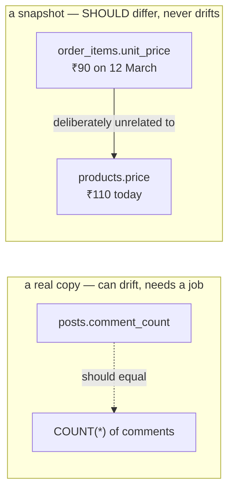

# Day 029 · System Design — Normalisation and when to break it

**After today you can:** You can normalise a schema to third normal form, then argue for denormalising part of it.

**The interviewer asks it as:** *When would you deliberately duplicate data across tables?*

---

## 1. What this is, and why they ask it

**Normalisation** is organising a schema so that **each fact is stored in exactly one place**. It has
formal levels — first, second and third normal form — but the whole of it collapses into that one
sentence, and the reason is equally short: a fact stored twice can end up disagreeing with itself, and
then nobody knows which copy is right.

**Denormalisation** is deliberately breaking that rule for speed, and it is not a failure. Copying a
comment count onto a post so you do not have to count rows on every read is a considered engineering
decision. Copying it by accident, with nothing to keep it in step, is a bug.

Interviewers ask this because it is one of the few database questions where **both answers are wrong on
their own**. "Always normalise" produces schemas that need eight joins to render a screen. "Denormalise
for performance" produces data that quietly disagrees with itself. The candidate they want says: *here
is the normalised design, here is the specific read-to-write ratio that justifies denormalising this
one field, and here is what keeps it honest.* That third clause is the one almost nobody supplies.

You already have the pieces. [Day 026](../day-026-strings-revision/README.md) gave you keys and the
one-fact-one-place rule; [day 028](../day-028-opposite-ends/README.md) gave you joins, which are the
cost of normalising. Today puts a name and a decision procedure on the trade.

---

## 2. The story

Vasanthi has run the provision shop on the corner since her husband died, and her son does the counter
in the evenings when he gets back from college.

Every price in that shop exists in three places, and she knows it.

There is the board behind her, where the rates are written up — that is the one she treats as the
truth, and it is the one she changes when the wholesaler's rates move. There are the little labels
stuck on the shelf edges, so that customers can see without asking. And there is her son's head,
because a boy who has to turn round and read the board for every packet of biscuits serves four
customers an hour instead of thirty.

The copies are there for a reason and she is not going to get rid of them. The labels are what stop
her being asked forty times a day, and her son's memory is what makes the evening rush possible at
all.

But she pays for them, and she pays every time something changes.

The oil went up eleven rupees in April. She changed the board that morning. The shelf label she
changed at some point in the afternoon. Her son was at college, so for three days he sold it at the
old price to anybody who did not look at the label, and she found out from the account book at the
end of the week.

The worst one was a soap that went up and then came back down. The board was right, the label was
right, and the boy was still charging the middle price a fortnight later, until a woman who had been
coming for eleven years told her, quite sharply, that she had been overcharged.

So now there is a Sunday morning ritual, and it takes forty minutes. She walks the whole shop with the
board in her hand and reads every label against it, and anything that disagrees gets fixed, and then
she reads out to her son the six or seven things that have moved that week and makes him say them
back.

She is very clear that the copies are worth having. She is equally clear that if you keep copies and
do not have a Sunday morning, you do not have a shop — you have three shops that disagree.

---

## 3. The idea in plain English

The board is the **normalised** truth. The shelf labels and her son's memory are **denormalised
copies**, kept for speed. The oil incident is **drift**. And Sunday morning is the **reconciliation
job**, which is the part everybody forgets.

### The rule underneath all of it

> **Every fact is stored in exactly one place. Everything else refers to it by key.**

That is normalisation. The formal normal forms are three specific ways of failing it.

### First normal form: one value per cell

**1NF: each column holds a single value, and there are no repeating groups.**

Broken:

```
  orders
  +----+--------+---------------------------+
  | id | cust   | products                  |
  +----+--------+---------------------------+
  | 1  | Asha   | "soap, oil, rice"         |   <- three values in one cell
  | 2  | Ravi   | "sugar"                   |
  +----+--------+---------------------------+
```

You cannot index it, cannot join on it, cannot ask "how many orders included oil?" without string
matching, and cannot enforce that the products exist. The fix is a row per item:

```
  order_items
  +----------+------------+
  | order_id | product_id |
  +----------+------------+
  | 1        | 12         |
  | 1        | 7          |
  | 1        | 3          |
  | 2        | 19         |
  +----------+------------+
```

Also broken: columns named `product_1`, `product_2`, `product_3`. Same problem wearing a different
shape, and the tell is that adding a fourth product means altering the table.

### Second normal form: no partial dependency on a composite key

**2NF: 1NF, and every non-key column depends on the *whole* primary key, not part of it.**

This only ever applies when the primary key is **composite** — two or more columns together.

Broken:

```
  order_items  (primary key: order_id + product_id)
  +----------+------------+----------+--------------+
  | order_id | product_id | quantity | product_name |
  +----------+------------+----------+--------------+
  | 1        | 12         | 2        | Coconut oil  |
  | 2        | 12         | 1        | Coconut oil  |   <- copied
  +----------+------------+----------+--------------+
```

`quantity` genuinely depends on both — how many of *this product* in *this order*. But `product_name`
depends only on `product_id`. So it is repeated on every order line that mentions that product, and
renaming the product means updating every one of them.

The fix: `product_name` lives in `products`, and `order_items` keeps only `product_id`.

### Third normal form: no dependency on a non-key column

**3NF: 2NF, and no non-key column depends on another non-key column.**

Broken:

```
  employees
  +----+-------+---------------+------------------+
  | id | name  | department_id | department_name  |
  +----+-------+---------------+------------------+
  | 1  | Asha  | 4             | Engineering      |
  | 2  | Ravi  | 4             | Engineering      |   <- copied
  +----+-------+---------------+------------------+
```

`department_name` does not depend on the employee at all; it depends on `department_id`, which is
itself a non-key column. This is a **transitive dependency**: `id → department_id → department_name`.

The fix: a `departments` table, and `employees` keeps only `department_id`.

**The one-line version people actually use**, and it is worth saying because it is memorable:

> *Every non-key column depends on the key, the whole key, and nothing but the key.*

3NF is where practice stops. There are higher forms — BCNF, 4NF, 5NF — and they address genuinely rare
situations. **3NF is the working standard**, and saying "I'd normalise to 3NF and then denormalise
deliberately where the numbers justify it" is the complete answer to the theory half.

### The three anomalies normalisation prevents

Worth naming, because they are what the whole exercise is *for*:

- **Update anomaly** — the department is renamed and you update 400 rows; you miss 3, and now two
  answers exist. Vasanthi's oil.
- **Insert anomaly** — you cannot record a new department until somebody works in it, because the
  department's name only exists on employee rows.
- **Delete anomaly** — the last employee in a department leaves, and the department's existence
  disappears with them.

**Say all three by name.** They are the reason, and most candidates can only produce the first.

### Denormalisation, deliberately

Copies are legitimate. Four common ones:

| Copy | Instead of | Why |
|---|---|---|
| `posts.comment_count` | `COUNT(*)` on comments | counting on every read is unaffordable at a high read ratio |
| `orders.customer_name` | joining to customers | a **historical snapshot**: the name at the time of the order |
| `order_items.unit_price` | joining to products | the price *then*, which must not change when the catalogue does |
| a materialised view | recomputing a report | a dashboard that would otherwise scan millions of rows |

**Two of those four are not really denormalisation at all**, and this is worth understanding because it
gets asked. `orders.customer_name` and `order_items.unit_price` are storing a *different fact* — what
the name and price **were at that moment** — not a copy of a current one. An invoice must not change
because a product's price changed last week. **That is correct design, not a shortcut**, and it never
drifts because it is never supposed to match.

The genuine denormalisation is the first and fourth: a stored count and a materialised view, both of
which *are* copies of something derivable and both of which *can* drift.

### The decision procedure

Denormalise when you can answer all four:

1. **What is the read-to-write ratio?** From [day 017](../day-017-matrix-tricks/README.md), a comment
   feed is around 265 reads per write. Below about 10:1, the copy is rarely worth it.
2. **What does the read cost without it?** Measure. If `COUNT(*)` on an indexed column takes 1 ms and
   you do 3,700 reads a second, that is nearly 4 cores of database time.
3. **How stale may it be?** Seconds? Minutes? "Never" means it must be updated in the same transaction,
   which slows the write and couples the two.
4. **What keeps it honest?** A reconciliation job, and a way to detect drift. **This is Sunday
   morning, and a design without it is not finished.**

If you cannot answer 4, do not denormalise.

---

## 4. The picture

The three normal forms, as three specific failures:

```
  NOT 1NF                    NOT 2NF                       NOT 3NF
  many values in a cell      depends on PART of the key    depends on a NON-key column

  +----+----------------+    PK = (order_id, product_id)   +----+------+------+-------------+
  | id | products       |    +--------+-------+-----------+| id | name | dept | dept_name   |
  +----+----------------+    | ord|prod| qty | prod_name || 1  | Asha | 4    | Engineering |
  | 1  | soap, oil, rice|    +--------+-------+-----------+| 2  | Ravi | 4    | Engineering |
  +----+----------------+     ^^^^^^^^  ^^^^   ^^^^^^^^^  +----+------+------+-------------+
         ^                    whole key  whole  only half                     ^
    can't index,                                                   depends on dept, not on id
    can't join,               fix: prod_name -> products           fix: dept_name -> departments
    can't constrain
```

**What to notice:** all three failures produce the same symptom — a value written down more than once —
and therefore the same risk. The forms are just three different routes to it.

The trade, drawn with the numbers that decide it:

```
   NORMALISED                              DENORMALISED
   one fact, one place                     a copy, kept for speed

   posts        comments                   posts
   +----+       +----+---------+           +----+---------------+
   | id |       | id | post_id |           | id | comment_count |
   +----+       +----+---------+           +----+---------------+
                                               ^
   read : COUNT(*) WHERE post_id = 91          already in the row you fetched
          ~1 ms  ×  3,700 reads/s              0 ms
          = 3.7 s of DB time per second
          = ~4 cores                           read cost: free

   write: nothing extra                    write: one extra UPDATE
                                                  3.5 writes/s = negligible

   never wrong                             can drift  ->  needs a reconciliation job
```

**What to notice:** the decision is made by the ratio, not by taste. At 265 reads per write, paying a
tiny write cost to remove a large read cost is obviously right. At 1:1 it is obviously wrong. **Compute
the ratio first and the answer falls out.**

The copy that is not a copy:



**What to notice:** the dotted arrow is an obligation you must maintain. The solid arrow is not an
obligation at all — the invoice is *supposed* to disagree with today's catalogue. Confusing the two is
how people either build reconciliation jobs they do not need or skip ones they do.

---

## 5. How it actually works

### Normalising a schema, worked

Start with the shape people actually produce first — one wide table:

```sql
CREATE TABLE orders_flat (
    order_id       BIGINT,
    order_date     DATE,
    customer_name  TEXT,
    customer_email TEXT,
    customer_city  TEXT,
    products       TEXT,        -- "soap, oil, rice"
    quantities     TEXT,        -- "1, 2, 5"
    total          NUMERIC
);
```

**1NF:** `products` and `quantities` hold lists. Split into `order_items`, one row per line.

**2NF:** with a composite key of `(order_id, product_id)`, anything depending only on `product_id`
moves to `products`.

**3NF:** `customer_email` and `customer_city` depend on the customer, not on the order. Move them to
`customers` and keep `customer_id`.

The result:

```sql
CREATE TABLE customers (
    id     BIGSERIAL PRIMARY KEY,
    name   TEXT NOT NULL,
    email  TEXT NOT NULL UNIQUE,
    city   TEXT NOT NULL
);

CREATE TABLE products (
    id     BIGSERIAL PRIMARY KEY,
    name   TEXT NOT NULL,
    price  NUMERIC(12,2) NOT NULL          -- the CURRENT price
);

CREATE TABLE orders (
    id           BIGSERIAL PRIMARY KEY,
    customer_id  BIGINT NOT NULL REFERENCES customers(id),
    order_date   DATE NOT NULL DEFAULT CURRENT_DATE
);

CREATE TABLE order_items (
    order_id    BIGINT NOT NULL REFERENCES orders(id) ON DELETE CASCADE,
    product_id  BIGINT NOT NULL REFERENCES products(id),
    quantity    INT    NOT NULL CHECK (quantity > 0),
    unit_price  NUMERIC(12,2) NOT NULL,    -- the price AT THE TIME. Not a copy — a snapshot.
    PRIMARY KEY (order_id, product_id)
);
```

**`unit_price` is the line worth defending.** It looks like a violation and is not. `products.price` is
*today's* price; `order_items.unit_price` is *what this customer was charged*. If you removed it and
joined to `products` instead, every historical invoice would silently change whenever you updated the
catalogue. Being able to say that sentence is worth more than reciting the normal forms.

Notice too that `total` has disappeared: it is derivable from the items, so storing it is a genuine
denormalisation — one you might well want, but a decision rather than an accident.

### Keeping a denormalised count honest

Three mechanisms, in increasing order of robustness.

**In the same transaction as the write.** Exact, and it couples the two operations: the comment insert
now also takes a lock on the post row, which becomes a contention point on a popular post.

```sql
BEGIN;
  INSERT INTO comments (post_id, author_id, body) VALUES (91, 42, '...');
  UPDATE posts SET comment_count = comment_count + 1 WHERE id = 91;
COMMIT;
```

**A database trigger.** The database maintains it, so no application path can forget — including the
script somebody wrote in a hurry. The cost is logic living somewhere nobody looks, which is a real
maintenance complaint.

**Asynchronously, via an event or a queue.** The write is fast and the count is eventually correct.
Now it *will* be wrong sometimes, so you need the count to be recoverable — which is the job below.

**And, whichever you pick, the reconciliation job:**

```sql
UPDATE posts p
SET    comment_count = c.n
FROM   (SELECT post_id, COUNT(*) AS n FROM comments GROUP BY post_id) c
WHERE  c.post_id = p.id AND p.comment_count <> c.n;
```

Run it nightly, and — this is the part people leave out — **log how many rows it corrected**. A count
that is always zero means the maintenance is working. A count that grows means you have a bug, and you
find out from a graph instead of from a customer.

### Materialised views

Postgres can store the result of a query as a table and refresh it on demand:

```sql
CREATE MATERIALIZED VIEW daily_revenue AS
SELECT order_date, SUM(quantity * unit_price) AS revenue
FROM   orders o JOIN order_items i ON i.order_id = o.id
GROUP BY order_date;

REFRESH MATERIALIZED VIEW CONCURRENTLY daily_revenue;
```

This is denormalisation with the bookkeeping built in: the definition of correctness lives in the
view, so it cannot drift silently — it can only be stale, and you control how stale by choosing the
refresh schedule. **When the denormalised thing is a whole aggregate rather than one column, a
materialised view is usually the right shape**, and naming it is a good signal.

### The document-store escape hatch

MongoDB and DynamoDB take denormalisation as the default: you embed the comments inside the post
document, so one read gets everything. That removes joins entirely and makes the "one fact, one
place" rule impossible to keep — a user's display name embedded in ten thousand comments is ten
thousand copies.

Their answer is that you design around the access pattern and accept the duplication, updating copies
in the background. It works, and it moves the entire cost from read time to write time and to your
own discipline. Documents are [day 038](../day-038-subarray-sum-k/README.md); the point today is that
**"denormalise everything" is a coherent position with a known price**, not a mistake.

---

## 6. The numbers

### What the join actually costs

Rendering a post with its comment count, 3,700 reads per second:

```
COUNT(*) on an indexed post_id, ~200 comments : ≈ 1 ms
3,700 × 1 ms = 3.7 s of database time per second  -> ~4 cores doing nothing else
```

With `comment_count` stored on the post:

```
read cost  : 0 — it is a column of the row you already fetched
write cost : one extra UPDATE per comment
             300,000 comments/day ÷ 86,400 = 3.5 writes/s   -> negligible
```

**Four cores against three and a half writes a second.** That is the trade, and it is not close.

### The ratio that decides it

```
reads  : 80,000,000/day  ->    926/s average
writes :    300,000/day  ->    3.5/s average
ratio  : 265 : 1
```

**Rule of thumb: below roughly 10:1, do not denormalise** — the write cost starts to matter and the
read saving does not. Above 100:1 it is nearly always right. Between the two, measure.

### The cost of drift

If the count is maintained asynchronously and 0.1% of updates are lost:

```
300,000 comments/day × 0.001 = 300 wrong counts/day
                             = 109,500 wrong counts/year
```

Which is why the nightly reconciliation exists — and why it should report the number it fixed rather
than silently correcting.

### Storage of the copies

```
comment_count : 4 bytes per post × 1,000,000 posts       = 4 MB
customer_name copied onto every order:
   30 bytes × 10,000,000 orders                          = 300 MB
   versus a foreign key: 8 bytes × 10,000,000            = 80 MB
```

Storage is almost never the argument. **The argument is always drift on one side and read cost on the
other**, and saying that plainly is better than reaching for disk figures.

### Joins avoided

Rendering a feed of 20 posts with author name, comment count and reaction count:

```
fully normalised : 1 query for posts + 3 joins, or 61 queries if an ORM does it lazily
denormalised     : 1 query, no joins

fully normalised, joined properly : ~5 ms
the ORM's N+1 version             : 61 × 0.5 ms = ~30 ms and 61 round trips
denormalised                      : ~1 ms
```

Note the middle row. **Often the real problem is not the normalisation but an ORM issuing 61 queries**,
and the fix is to write the join rather than to duplicate the data. Check that before denormalising
anything.

### Update amplification

Renaming a department in a normalised schema versus a denormalised one:

```
normalised   : UPDATE departments SET name = 'X' WHERE id = 4;         1 row
denormalised : UPDATE employees SET dept_name = 'X' WHERE dept_id = 4; 400 rows
               — and any row missed is now permanently inconsistent
```

---

## 7. The trade-offs

### Normalised

**You get** one source of truth, so nothing can disagree with itself; smaller storage; and updates that
touch one row. You also get a schema that can answer questions you have not thought of yet, because
nothing has been shaped around one particular query.

**You pay** joins on every read, more complex queries, and — at high read volume — real database CPU.

### Denormalised

**You get** fast reads, simple queries, and the ability to serve a screen from one row.

**You pay** drift risk, larger storage, more expensive writes, and a maintenance obligation that never
goes away. And you pay it *later*, which is what makes it dangerous: the schema that was fast in year
one is the one with three counts that disagree in year three.

### Where to draw the line

**Normalise by default. Denormalise specific fields, with numbers, and with a job.** Not whole tables,
not on instinct, and never without the reconciliation.

The specific things almost always worth denormalising:

- **Counts and aggregates** read far more often than written.
- **Historical snapshots** — price at time of order, name at time of invoice. Not really
  denormalisation, and mandatory.
- **Materialised views** for reports that would otherwise scan millions of rows.

The things almost never worth it:

- **A name or address you copy to avoid one join.** The join is cheap; the drift is not.
- **Anything with a read-to-write ratio under 10:1.**
- **Anything you cannot reconcile**, because you will never know whether it is right.

### Do it in the transaction, or asynchronously?

Synchronous is exact and couples the write to the counter, which becomes a contention point — every
comment on a viral post now contends for the same row. Asynchronous keeps writes fast and guarantees
the count will sometimes be wrong. **For a count nobody makes decisions on, asynchronous plus a nightly
job is right. For anything a person or a payment depends on, do it in the transaction or do not
denormalise it at all.**

### The sentence that separates candidates

> **I would not denormalise without a reconciliation job.** A stored count with nothing checking it is
> not an optimisation, it is a number that is right on the day you ship and slowly stops being right
> after that — and because nothing errors, you find out from a customer. So the design has three parts,
> not one: the copy, the thing that maintains it, and the thing that detects drift and reports how
> much it found. If I cannot describe all three, I would keep the join and fix the query instead —
> which, more often than people expect, turns out to be an ORM issuing sixty-one queries where one
> would do.

---

## 8. In the interview

### How it gets asked

- *"When would you deliberately duplicate data across tables?"* — the direct version. They want a
  condition with numbers, not "for performance".
- *"What is third normal form?"* — the theory check. Answer in one sentence, then move to the trade.
- *"Normalise this table."* — shown a wide flat table with lists in cells.
- *"This page is slow because of joins. What do you do?"* — where the right first answer is *measure*,
  and the right second answer is often "fix the query, not the schema".
- *"How do you keep a denormalised count correct?"* — the follow-up that separates people who have done
  it from people who have read about it.

### What to say out loud, in the first ninety seconds

1. **Give the rule in one sentence.** *"Normalisation means each fact is stored in exactly one place,
   so nothing can disagree with itself."*
2. **Give 3NF in the memorable form.** *"Every non-key column depends on the key, the whole key, and
   nothing but the key. 3NF is where practice stops."*
3. **Name the anomalies.** *"It exists to prevent update, insert and delete anomalies — renaming a
   department and missing three rows, being unable to record a department with no employees, and
   losing the department when the last employee leaves."*
4. **State your default.** *"I'd normalise to 3NF first, always."*
5. **Then give the exception with a number.** *"And denormalise specific fields where the read-to-write
   ratio justifies it. On a comment feed that ratio is around 265 to 1 — counting comments on every
   read is four cores of database time, and maintaining a stored count is three and a half writes a
   second."*
6. **Distinguish the snapshot.** *"Some things that look like duplication aren't — storing the unit
   price on an order line is a historical fact, not a copy, and it must not change when the catalogue
   does."*
7. **Name the obligation, unprompted.** *"And any real copy needs a reconciliation job that reports how
   many rows it corrected. Without that I'd keep the join."*

### The follow-ups

**"What is third normal form, in one sentence?"**
Every non-key column depends on the key, the whole key, and nothing but the key. Unpacking that: 1NF
means each cell holds one value, so no comma-separated lists and no `product_1`, `product_2` columns.
2NF adds that when the primary key is composite, no column may depend on only part of it — a product's
name on an order line depends on the product, not on the order-and-product pair, so it belongs in the
products table. 3NF adds that no non-key column may depend on another non-key column — a department
name depends on the department id, which is itself not the key, so it belongs in a departments table.
There are higher forms, BCNF and above, and they address genuinely rare situations; 3NF is the working
standard, and what I would actually do is normalise to 3NF and then denormalise deliberately where the
numbers justify it.

**"How do you keep a denormalised count correct?"**
Three options and I would choose by how much correctness matters. Updating it in the same transaction
as the insert is exact, and the cost is that every comment now takes a lock on the post row, so a
viral post becomes a contention point. A database trigger is the same thing enforced by the database,
so no code path can forget it — including a one-off script — at the price of logic living somewhere
nobody looks. Doing it asynchronously through an event keeps writes fast and guarantees the count will
occasionally be wrong. Whichever I pick, I would also run a nightly reconciliation that recomputes the
true counts and corrects any that disagree — and, importantly, logs how many it corrected, so a
non-zero number becomes an alert rather than a silent repair. If I could not commit to that job, I
would not store the count.

**"Is storing the price on an order line a violation of normalisation?"**
No, and this is the case worth getting right. `products.price` is today's price. `order_items.unit_price`
is what this customer was actually charged on that date. Those are two different facts that happen to
be equal at one moment, so storing both is not duplication. The proof is what happens if you remove it:
join to `products` instead, and every historical invoice silently changes the next time you update the
catalogue, which is wrong and in most places illegal. The same argument applies to a customer's name
and address on an invoice. The way I distinguish it in general is to ask whether the two values are
*supposed* to stay equal. If yes, it is a copy and needs a reconciliation job. If they are supposed to
diverge over time, it is a snapshot and needs nothing.

**"This page does eight joins and it's slow. Do you denormalise?"**
Not first. First I would look at the actual query plan, because "slow because of joins" is a diagnosis
people reach for and it is often wrong. The three things I would check: is it really one query with
eight joins, or is an ORM issuing sixty-one queries lazily — which is the N+1 problem and is fixed by
eager loading, not by changing the schema. Are the join columns indexed, since foreign keys are not
indexed automatically and an unindexed one turns a join into a scan per row. And is the query selecting
columns nobody uses, which prevents a covering index. Those three fix a large majority of "slow
because of joins" complaints without touching the data model. If after that it is genuinely the joins,
then I would denormalise the specific fields the page needs, compute the read-to-write ratio to justify
each one, and build the reconciliation job — or use a materialised view, which gives me the same
speed with the correctness definition written down in one place.

### A model answer

> "Normalisation means each fact is stored in exactly one place, and everything else refers to it by
> key. The formal levels are 1NF, no lists in a cell; 2NF, no column depending on only part of a
> composite key; 3NF, no column depending on another non-key column. The version worth memorising is
> that every non-key column depends on the key, the whole key, and nothing but the key.
>
> It exists to prevent three specific things. An update anomaly — you rename a department, update four
> hundred rows, miss three, and now two answers exist. An insert anomaly — you cannot record a
> department until somebody works in it. And a delete anomaly — the last employee leaves and the
> department disappears with them.
>
> So my default is to normalise to 3NF. But I'd denormalise specific fields deliberately, and I'd want
> a number for each one.
>
> The clearest example is a comment count on a post. Normalised, rendering a post means `COUNT(*)` on
> the comments table — about a millisecond with an index. At 3,700 reads a second that's 3.7 seconds of
> database time per second, so roughly four cores doing nothing but counting. Storing the count on the
> post makes the read free and costs one extra UPDATE per comment, which at 300,000 comments a day is
> three and a half writes a second. The read-to-write ratio there is about 265 to 1, and that ratio is
> what makes the decision — below roughly 10 to 1 I wouldn't bother.
>
> There's a case that looks like denormalisation and isn't, which I'd want to distinguish. Storing the
> unit price on an order line isn't a copy of the product's price — it's what the customer was actually
> charged that day. Two different facts. If I removed it and joined to the products table, every
> historical invoice would change the next time someone updated the catalogue. Same with a name on an
> invoice. Those never drift, because they're never meant to match.
>
> The part I'd insist on for a real copy is the third piece. A denormalised count has three components,
> not one: the copy, something that maintains it — in the transaction, a trigger, or an async event —
> and a reconciliation job that recomputes the truth periodically and reports how many rows it had to
> correct. That last number is the whole point: zero means it's working, and a rising number is a bug I
> find from a graph rather than from a customer. If I couldn't commit to that job, I'd keep the join.
>
> And before denormalising anything I'd check that the joins are actually the problem. Very often
> 'slow because of joins' turns out to be an ORM issuing sixty-one queries where one would do, or an
> unindexed foreign key — and both of those are cheaper to fix than a data model."

---

## 9. Recall card

- **Normalisation = each fact in exactly one place.** 3NF: every non-key column depends on the key, the
  whole key, and nothing but the key.
- **It prevents three anomalies:** update, insert, delete. Name all three.
- **Denormalise by the read-to-write ratio.** Below ~10:1, don't. At 265:1, a stored count saves four
  cores and costs 3.5 writes a second.
- **A snapshot is not a copy.** `order_items.unit_price` is what was charged — it *should* differ from
  today's price, and it never drifts.
- **Every real copy needs a reconciliation job that reports what it fixed.** No job, no copy — keep the
  join instead.
