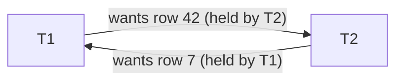

# Day 035 · System Design — Locking and deadlocks

**After today you can:** You can describe how two transactions deadlock and how the database resolves it.

**The interviewer asks it as:** *What is a deadlock, and how would you prevent one?*

---

## 1. What this is, and why they ask it

A **lock** is the database's claim on a piece of data: while a transaction holds it, conflicting
access by others must wait. Locks are how yesterday's isolation promises are physically kept — and
they create one famous failure of their own. A **deadlock** is two transactions each holding a lock
the other needs, waiting on each other forever, until the database notices the circle and kills one
of them.

This question is an interview staple because it is a story with a mechanism inside it, and both
halves get tested. The story half — two transactions crossing — checks that you can narrate
concurrency at all. The mechanism half — how the database detects the cycle, which victim it picks,
what your application must do next — separates people who have read a definition from people who
have seen `deadlock detected` in a production log. It also carries the single most useful prevention
rule in all of backend engineering, and interviewers listen for it by name: **lock things in a
consistent order.**

---

## 2. The story

Sunday morning is biryani morning in Lata's house, which means her son Arun is also in the kitchen,
making the raita and the salad, and the kitchen is small.

There is one good knife and one big chopping board. Around eleven o'clock, Lata picks up the knife —
she needs to cut the marinated chicken, and after that she will need the board to lay the pieces
out. At the same moment, on the other side of the counter, Arun pulls the chopping board toward
himself for the cucumbers, and reaches for the knife.

The knife is in Lata's hand. So Arun waits, board in front of him, hand out.

Lata finishes trimming, turns to lay the pieces out, and the board is gone. So she waits too, knife
in hand, looking at her son.

Neither of them is being unreasonable. Each is holding one thing they genuinely need and waiting for
one thing they genuinely need, and each is waiting for the other. And there they stand. The chicken
is not moving, the cucumbers are not moving, and the pressure cooker is getting ahead of both of
them. It is a small, silly, complete standstill — nobody can take a single step until the other
moves first, and nobody can move first.

Lata's mother settled it from the doorway, the way she settles most things, with a sentence:
somebody put something down. Arun, being the junior cook, slid the board across. He started his
cucumbers again from the beginning two minutes later, when both things were free.

But it is the grandmother's second sentence that fixed the kitchen for good. In her kitchen, she
said, the rule was that you take the board first, then the knife, always in that order, everyone.
If both of them had followed that rule, one of them would have got the board and gone on to finish,
and the other would have simply waited a minute at the start — a queue, not a standstill. The
standstill only happens because the two of them picked the same two things up in opposite orders.

---

## 3. The idea in plain English

The knife and the board are two rows in a database. Lata and Arun are two **transactions**. Holding
a thing while waiting for the other thing is the whole story of today.

### What a lock is

When a transaction updates a row, the database gives it an **exclusive lock** on that row: nobody
else may change the row until the transaction commits or rolls back. The lock is not politeness —
it is what makes [day 033](../day-033-window-with-a-map/README.md)'s guarantees physical. Anyone
else wanting the same row simply **waits** in a queue.

Waiting is normal and healthy. Arun waiting for the knife while Lata uses it is not a problem; it is
a queue, and queues drain. Yesterday's `SELECT ... FOR UPDATE` was exactly this: deliberately taking
a lock so that others wait.

Two flavours matter for interviews. A **shared lock** is for reading: many transactions can hold one
on the same row at once, because readers do not disturb each other. An **exclusive lock** is for
writing: one holder, and it excludes readers-with-locks and writers both. (Plain readers in Postgres
do not take row locks at all — MVCC gives them a version to read, which is why readers and writers
do not block each other.)

### What a deadlock is

A deadlock is waiting arranged in a **circle**. Lata holds the knife and waits for the board; Arun
holds the board and waits for the knife. Transaction 1 holds row A's lock and wants row B's;
transaction 2 holds row B's and wants row A's. Every member of the circle is waiting for another
member, so no member can ever proceed. This is not slowness — no amount of patience fixes it. The
circle is permanent until someone breaks it.

The distinction to say out loud: **blocking is a queue; deadlock is a cycle.** A queue drains on its
own. A cycle never does.

### How it gets resolved: the grandmother in the doorway

The database is the grandmother. It watches who waits for whom, and when it finds a circle, it picks
a **victim** — one transaction in the cycle — and kills it with an error. The victim's work rolls
back (atomicity doing its job), its locks are released, the circle is broken, and the survivor
proceeds. Arun slid the board across and started his cucumbers again — the victim **retries from
the beginning**.

The deadlock is therefore not a catastrophe. It is a resolved collision, costing one rollback and
one retry. A *high rate* of them is the real problem, and prevention is about the rate.

### How it gets prevented: the second sentence

**Lock objects in a consistent order, everywhere.** Board first, then knife, for everyone in the
kitchen. If every transaction that touches accounts 7 and 42 locks the lower id first, the circle
cannot form: whoever gets account 7 proceeds; the other waits at the *start*, holding nothing. A
wait instead of a standstill. This one rule, applied at code-review time, prevents the large
majority of real deadlocks — and it costs nothing at runtime.

---

## 4. The picture

The deadlock, on two timelines:

```
 T1 (transfer 7 -> 42)                 T2 (transfer 42 -> 7)

 BEGIN                                 BEGIN
 UPDATE accounts SET ...               UPDATE accounts SET ...
     WHERE id = 7;                         WHERE id = 42;
   -> holds lock on row 7                -> holds lock on row 42

 UPDATE accounts SET ...               UPDATE accounts SET ...
     WHERE id = 42;                        WHERE id = 7;
   -> WAITS for T2's lock                -> WAITS for T1's lock

        ......... both wait forever: the cycle is closed .........

 after deadlock_timeout (1 s), the detector runs:

 T1: proceeds                          T2: ERROR: deadlock detected
                                           (rolled back, must retry)
```

**What to notice:** each transaction, read alone, is completely sensible. The deadlock exists only
in the *pair*, and only because they locked the same two rows in opposite orders.

The waits-for graph the detector actually builds:



**What to notice:** deadlock detection is cycle detection in this graph — the same "does this loop?"
question as [day 030](../day-030-fast-and-slow/README.md), asked of transactions instead of list
nodes. A cycle found means one node in it gets aborted.

The fix, as timelines — both transactions lock the **lower id first**:

```
 T1 (7 then 42)                        T2 (7 then 42 — same order)

 BEGIN                                 BEGIN
 lock row 7        <- wins             lock row 7   -> WAITS, holding nothing
 lock row 42
 ... work, COMMIT
 locks released  ------------------->  acquires row 7, then 42, proceeds
```

**What to notice:** T2 still waits — ordering does not remove contention — but it waits at the
start, holding nothing, so no circle can close. A queue, not a standstill.

---

## 5. How it actually works

### Who takes locks, and when

`UPDATE`, `DELETE` and `INSERT` take exclusive row locks as they touch rows.
`SELECT ... FOR UPDATE` takes the same lock without changing anything — yesterday's check-then-act
tool. Plain `SELECT` in Postgres takes no row lock at all: MVCC hands readers a committed version,
which is why "readers block writers" is false there. Locks live exactly as long as the transaction —
released at `COMMIT` or `ROLLBACK`, never earlier, which is the deep reason
[day 033](../day-033-window-with-a-map/README.md) said to keep transactions short.

There are also table-level locks (schema changes take the big ones — an unguarded `ALTER TABLE`
queues behind and ahead of everything), but row locks are where interview deadlocks live.

### Detection in Postgres

Waiting for a lock is passive — the transaction just sleeps in the queue. When a wait exceeds
**`deadlock_timeout`** (default one second), Postgres builds the waits-for graph and searches for a
cycle. If it finds one, the transaction that *triggered the check* is usually the victim:

```
ERROR:  deadlock detected
DETAIL:  Process 9182 waits for ShareLock on transaction 5501; blocked by process 9075.
         Process 9075 waits for ShareLock on transaction 5502; blocked by process 9182.
HINT:  See server log for query details.
```

The victim is rolled back entirely. The application must catch this and **retry the transaction from
`BEGIN`** — the same obligation serialisable imposed yesterday, arriving one level down. MySQL's
InnoDB checks eagerly at each wait and typically chooses the transaction that has done less work as
the victim; it also takes **gap locks** at its default repeatable read — locks on the spaces
*between* index entries — which produce deadlocks that surprise people who learnt on Postgres.

### The tools around waiting

Waiting has dials, and naming them is senior-signal:

```sql
SET lock_timeout = '2s';            -- give up waiting after 2s, with an error
SELECT ... FOR UPDATE NOWAIT;       -- error immediately if the row is locked
SELECT ... FOR UPDATE SKIP LOCKED;  -- skip locked rows, take what is free
```

`SKIP LOCKED` deserves its own sentence, because it turns a table into a **job queue**. Ten workers
each run:

```sql
SELECT * FROM jobs WHERE status = 'pending'
ORDER BY id LIMIT 1 FOR UPDATE SKIP LOCKED;
```

Each worker locks a *different* pending row — nobody waits, nobody collides, and a crashed worker's
lock vanishes with its transaction, so its job is automatically picked up again. This is the
standard "background jobs on Postgres" pattern, used by Sidekiq-style systems and worth producing
unprompted when queues come up.

### Optimistic control: the no-lock alternative

Pessimistic locking assumes collisions are likely and pays for certainty with waiting. **Optimistic
locking** assumes they are rare: read the row with its `version` column, do the work unlocked, then

```sql
UPDATE items SET stock = 4, version = 8
WHERE id = 91 AND version = 7;
```

Zero rows affected means someone got there first — reload and retry. No locks held during the think
time, so no deadlocks at all; the cost moves to retries, which is fine when contention is rare and
miserable when it is hot. This is the same optimistic-versus-pessimistic trade yesterday's
serialisable-versus-`FOR UPDATE` choice made, one storey lower.

---

## 6. The numbers

### The detector's price

```
deadlock_timeout = 1s (Postgres default)

a genuine deadlock therefore costs:
  ~1 s of two transactions frozen
+ one rollback and one full retry
≈ 2+ s of user-visible latency on the victim's request
```

One deadlock is an incident of two seconds. The arithmetic to fear is the rate: at 50 deadlocks a
minute, you have a design problem, not bad luck.

### How likely is the collision?

Two transfer types crossing between the same two accounts, no ordering rule:

```
each transfer holds its first lock for ~10 ms before wanting the second
transfers between this pair arrive at 20/second in each direction

probability a given transfer meets an opposite one mid-flight:
  ≈ arrival rate × window = 20/s × 0.010 s = 0.2  -> 20% of transfers
at 20/s each way, that is ~4 deadlocks per second on ONE hot pair
```

Two lines of `ORDER BY id` — locking the lower id first — takes that to zero. That before/after is
the most persuasive numbers story in today's lesson.

### What one held lock does to a queue

The hot-row arithmetic, because interviewers reuse it constantly:

```
one row, exclusive lock held 100 ms per transaction
100 transactions want it in the same second

throughput through that row: 1 / 0.1 s = 10/s   -> 90 queue up, and
the last waiter sees ~10 s of latency (100 × 100 ms, serialised)
```

A single hot row is a serial bottleneck no index can fix. The escapes: make the hold shorter, make
the operation database-side arithmetic (`SET count = count + 1`, held for microseconds), or split
the row (e.g. 16 counter rows summed on read).

### The queue pattern's capacity

```
jobs table with SKIP LOCKED, 10 workers, each job ~200 ms:
  10 workers × 5 jobs/s = 50 jobs/s, zero lock waits
without SKIP LOCKED (plain FOR UPDATE on the same top row):
  all 10 workers queue on the SAME first row -> effectively 1 worker
```

Same table, same workers — a 10× difference from three words of SQL.

---

## 7. The trade-offs

### Pessimistic against optimistic

Locks buy certainty and pay in waiting and deadlock risk; version columns buy freedom from waiting
and pay in retries and in every writer having to cooperate. Choose by contention: a seat at a
concert on-sale is pessimistic territory (collisions are the normal case); a user editing their own
profile is optimistic territory (collisions are freak events). **I would not use optimistic locking
on a hot row** — the retry storm is worse than the queue.

### Fail fast against wait

`NOWAIT` and short `lock_timeout`s turn contention into visible, immediate errors the caller can
handle — right for interactive requests, where a user staring at a spinner for ten seconds is worse
than "try again". Plain waiting is right for background work, where throughput matters and nobody is
watching. The anti-pattern is the default everywhere: infinite patience on an interactive path is
how one held lock becomes a site-wide hang.

### Ordering discipline against flexibility

The lock-in-order rule costs nothing at runtime and everything in vigilance — it lives in code
review, not in the database, and one new code path that touches rows in reverse order reintroduces
the standstill. Teams encode it structurally where they can: always
`ORDER BY id` when locking multiple rows (`SELECT ... WHERE id IN (7, 42) ORDER BY id FOR UPDATE`),
so the discipline is in the query, not the reviewer's memory.

### The sentence that separates candidates

> **I would treat a deadlock error as a retry, and a deadlock *rate* as a design smell.** The
> database already resolves individual deadlocks — detection, victim, rollback — so my application's
> job is a retry loop with a couple of attempts and jitter. But if the rate is nonzero and growing,
> something structural is wrong: two code paths locking in opposite orders, or transactions holding
> locks across external calls — and the fix is ordering and shorter transactions, not a cleverer
> retry.

---

## 8. In the interview

### How it gets asked

- *"What is a deadlock, and how would you prevent one?"* — the hub question: the story, the cycle,
  the ordering rule.
- *"Two requests are stuck and one eventually fails with 'deadlock detected'. Walk me through what
  happened."* — the production-flavoured version; they want the two timelines.
- *"What's the difference between blocking and a deadlock?"* — queue against cycle, drains against
  never.
- *"How would you build a job queue on Postgres?"* — `FOR UPDATE SKIP LOCKED`, workers, crashed
  worker's lock evaporating.
- *"When would you use optimistic locking instead?"* — contention rare, no held locks, version
  column, retry on zero rows.

### What to say out loud, in the first ninety seconds

1. **Define with the circle.** *"A deadlock is two transactions each holding a lock the other needs
   — T1 has row A and wants B, T2 has B and wants A. Neither can ever proceed; it's a cycle, not a
   queue."*
2. **Distinguish it from blocking.** *"Ordinary lock waiting is fine — a queue drains. A deadlock
   never drains without intervention."*
3. **Say how the database resolves it.** *"Postgres waits a second, builds the waits-for graph,
   finds the cycle, and aborts one transaction with 'deadlock detected'. The application retries the
   victim from BEGIN."*
4. **Give the prevention rule by name.** *"Prevention is mostly one rule: lock rows in a consistent
   order — lowest id first, everywhere. Opposite orders are the only way the cycle closes."*
5. **Add the operational habits.** *"Plus short transactions — no external calls while holding
   locks — and lock_timeout on interactive paths so contention fails fast instead of hanging."*

### The follow-ups

**"Why exactly does locking in a consistent order prevent deadlocks?"**
Because a deadlock needs a cycle in the waits-for graph, and a global order makes cycles impossible.
Give every lockable row a rank — its primary key — and let every transaction acquire locks only in
increasing rank. Now suppose a cycle existed: T1 waits for something T2 holds, T2 for something T1
holds. T1 holds a lower-ranked row than the one it wants; T2 likewise. Follow the circle and each
step must point at a higher rank than something the waiter already holds — but the circle comes back
to where it started, which would need a rank higher than itself. Contradiction, so no cycle. In
practice it means one habit: when a transaction touches several known rows, sort before locking —
`WHERE id IN (7, 42) ORDER BY id FOR UPDATE` — and when two tables are involved, agree the table
order too. Contention remains; the second transaction still waits — but it waits holding nothing,
which is a queue, and queues drain.

**"The deadlock error is rare but nonzero in your logs. What do you actually ship?"**
Two things, in this order. First, a retry wrapper on write transactions: catch the deadlock error
(and its serialisation cousins from yesterday), retry the whole transaction up to two or three times
with a small randomised backoff — which requires those transactions to be side-effect-free, no
emails or HTTP calls inside, so the retry is safe. That makes the user never see the error. Second,
an investigation, because the rate is a smell: pull the two queries from the server log — Postgres
logs both parties — and almost always it is two code paths locking the same pair of rows in
opposite orders, or one transaction holding locks across something slow. Fix the order or shorten
the transaction. What I would not do is raise `deadlock_timeout` to make errors rarer — that just
makes each real deadlock freeze longer before resolution.

**"How do multiple workers take jobs from a table without stepping on each other?"**
`SELECT ... FROM jobs WHERE status = 'pending' ORDER BY id LIMIT 1 FOR UPDATE SKIP LOCKED`, inside
the transaction that processes the job. `FOR UPDATE` claims the row; `SKIP LOCKED` is the crucial
part — a worker that finds the first pending row already claimed does not queue behind it, it takes
the next free one. Ten workers therefore hold ten different rows with zero waiting. Mark the job
done and commit; if the worker crashes mid-job, its transaction dies, the lock evaporates, and the
job is pending again for someone else — crash recovery with no extra machinery. Without
`SKIP LOCKED` all ten workers queue on the same top row and you have one effective worker. It is the
standard Postgres job-queue pattern, and it is why "do we need RabbitMQ?" is often answered "not
yet".

### A model answer

> "A deadlock is two transactions holding one lock each and waiting for each other's. The concrete
> version: T1 transfers money from account 7 to 42, T2 from 42 to 7, at the same moment. T1 updates
> row 7 and holds its lock; T2 updates row 42 and holds its lock. Then T1 asks for row 42 and waits,
> and T2 asks for row 7 and waits. Each is waiting for the other — a cycle. That's different from
> ordinary blocking: a queue drains on its own, a cycle never does.
>
> The database resolves it, not the application. Postgres lets a lock wait run for deadlock_timeout
> — a second by default — then builds the graph of who waits for whom and looks for a cycle. It
> aborts one member as the victim: that transaction gets 'ERROR: deadlock detected', rolls back
> completely, and its locks release, so the survivor proceeds. My application's duty is a retry loop
> — catch that error and rerun the transaction from BEGIN, which also means keeping side effects out
> of transactions so a rerun is safe.
>
> Prevention is mostly one rule: acquire locks in a consistent global order. Both transfers should
> lock the lower account id first — then whichever wins proceeds, and the other waits at the start
> holding nothing. A wait, not a deadlock. When I lock several rows at once I put the order in the
> query itself: WHERE id IN (...) ORDER BY id FOR UPDATE.
>
> And around that rule, the supporting habits: transactions short, no external calls while holding
> locks, lock_timeout on user-facing paths so contention fails fast, and — if the workload is a job
> queue — FOR UPDATE SKIP LOCKED so workers claim different rows instead of queueing on the same
> one."

---

## 9. Recall card

- **Blocking is a queue; deadlock is a cycle.** T1 holds A wants B, T2 holds B wants A — nobody can
  ever move. Queues drain; cycles need a victim.
- **The database resolves it:** after `deadlock_timeout` (1 s), find the cycle in the waits-for
  graph, abort one transaction — `ERROR: deadlock detected` — and the app **retries from BEGIN**.
- **Prevention rule number one: lock in a consistent order** — lowest id first, everywhere;
  `WHERE id IN (...) ORDER BY id FOR UPDATE` puts the discipline in the query.
- **`FOR UPDATE SKIP LOCKED` turns a table into a job queue** — workers claim different rows, a
  crashed worker's job frees itself.
- **Optimistic locking (version column) has no deadlocks** — right when contention is rare; a hot
  row wants pessimistic locks or database-side arithmetic instead.
