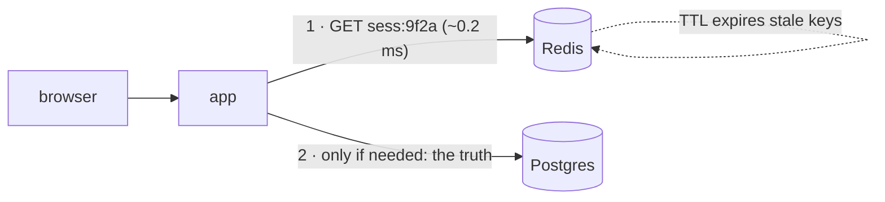

# Day 037 · System Design — Key-value stores

**After today you can:** You can say what Redis and DynamoDB are good at, and what they cannot do.

**The interviewer asks it as:** *When would you use a key-value store instead of a relational database?*

---

## 1. What this is, and why they ask it

A **key-value store** is the simplest database there is: give it a key and a value, and later give
it the key again to get the value back. `PUT`, `GET`, `DELETE` — that is close to the whole
interface. The value is opaque to the store; it does not look inside, cannot search inside, and
does not care what is inside. In exchange for promising so little, it is the fastest and most
scalable member of yesterday's four families.

Interviewers reach for this constantly because the two flagship products — **Redis** and
**DynamoDB** — appear in almost every real system design, and because the question has a sharp
edge: candidates who can say what these stores *do* are common, and candidates who can say what
they *cannot do* — and therefore where they sit in an architecture, always next to something else —
are the ones who sound like they have operated one. Sessions, carts, counters and rate limiters
are the standard interview uses, and every one of them will appear in the high-level design phase
of this course.

---

## 2. The story

The cloakroom at the city railway station is a long room of steel racks behind one counter, and
Bhaskar has run it for nine years. You hand your bag across; he puts it in the next empty slot,
hands you a brass disc with a number stamped on it, and writes nothing at all.

Give him disc 217 this evening and your bag is in your hand in about ten seconds. It does not
matter whether the room holds forty bags or four hundred — the number takes him straight to one
slot on one rack. He never searches. That is the whole design of his room: the disc is everything,
and the disc is enough.

The system shows its other face maybe once a week. A man arrives with no disc — lost it on the
platform — and says: it is a black bag, with a red strap, and there is a tiffin box inside. And
Bhaskar's ten seconds become forty minutes, because the racks know nothing about black or red or
tiffin boxes. Slot by slot, rack by rack, opening nothing, comparing every bag against a
description. The room was never arranged for questions. It was arranged for discs.

His nephew, who studies commerce and thinks about these things, once asked why he does not keep a
register — every bag, its colour, its owner's name, the slot number. Bhaskar laughed. Four hundred
bags a day come across that counter in the morning rush, he said, sometimes three in a minute. The
register would make every drop-off slower, all day, every day — to speed up one lost-disc search a
week. The queue is the business. The lost man can wait.

There is one more rule, printed on the wall: bags left beyond seven days are cleared out. The racks
are big, but they are not infinite, and a slot holding a forgotten bag is a slot that earns
nothing. Old things make way, automatically, without anyone deciding bag by bag.

---

## 3. The idea in plain English

Bhaskar's room is a key-value store. The disc is the **key**. The bag is the **value**. And every
strength and weakness of Redis and DynamoDB is already on his racks.

### The deal: everything by key, nothing by value

The disc number takes Bhaskar to one slot with no searching — that is the **hash lookup** from
[day 021](../day-021-frequency-maps/README.md), grown up: the store computes, from the key alone,
exactly where the value lives. One step, whether it holds a thousand entries or a billion. That is
the promise: **`GET` by exact key, in constant time, at any size.**

The lost-disc man is the other half. "The black bag with the red strap" is a query by *contents*,
and the racks have no answer except a full scan. A key-value store is exactly this: no `WHERE`
clause, no secondary questions, no "all sessions belonging to user 7" — unless you planned for
that question and stored *another key* for it. The store never looks inside the bag.

And the nephew's register is the relational alternative, priced honestly: richer questions, paid
for on every single write, all day — when the business is the queue, the register loses.

### The seven-day rule: TTL

Bhaskar's clear-out is **time-to-live**: attach an expiry to a key and the store deletes it,
automatically. This is why key-value stores own the *ephemeral* data of a system — sessions that
should die after 30 days of silence, rate-limiter counters that reset every minute
([day 023](../day-023-palindromes/README.md)'s buckets live in exactly this kind of store), links
that expire. In a relational database, expiry is a cleanup job you write and babysit; here it is a
property of the data.

### Where it sits in a system

Because it answers only one question, a key-value store is almost never the *only* database — it is
the fast shelf **next to** the system of record. The pattern to internalise: Postgres holds the
truth, and the key-value store holds the copies you need at speed — the session blob checked on
*every* request, the rendered fragment, the counter. The next lesson layers document stores on the
same skeleton; the "which store is the truth?" discipline from
[day 029](../day-029-read-write-pointer/README.md) — every copy needs an owner — applies from today
onward.

---

## 4. The picture

The two operations, and the one that does not exist:

```
 PUT "sess:9f2a" -> {user: 7, cart: [...]}      GET "sess:9f2a"
        |                                             |
        v                                             v
 +-------------------------------------------------------------+
 |  hash("sess:9f2a") -> slot 8,113,402                        |
 |                                                             |
 |  slot 8,113,402:  {user: 7, cart: [...]}   [ttl: 29d 23h]   |
 +-------------------------------------------------------------+
        one computed step, ~same cost at any size

 "find every session belonging to user 7"
        |
        v
      ✗ no such operation — the store never looks inside values.
        either scan everything, or you stored a second key for it:
        "user:7:sessions" -> ["sess:9f2a", "sess:c41b"]
```

**What to notice:** the second key at the bottom is the whole modelling discipline of key-value
stores — every question you will ask must be *a key you wrote*. Questions are designed in advance,
Farida's cart from [day 036](../day-036-two-pointers-revision/README.md), taken to its extreme.

Where the store sits in a real request:



**What to notice:** the key-value store is in front of the relational database, not instead of it —
it absorbs the read that happens on *every* request so that Postgres only sees the requests that
need the truth.

---

## 5. How it actually works

### Redis: the shelf in memory

Redis keeps everything in **RAM**, which from [day 009](../day-009-what-an-array-is/README.md)'s
speed hierarchy is the whole explanation of its numbers: reads and writes in well under a
millisecond, over a hundred thousand operations a second on one node. One process, one event loop —
commands execute one at a time, which is why `INCR` is atomic without locks: there is no
concurrency inside to defend against. That single-threaded simplicity is a feature you can cite.

Its values are not quite opaque — Redis gives them *shapes*: strings, hashes (field → value maps),
lists, sets, and sorted sets. Each shape has commands: `INCR` for counters, `LPUSH`/`RPOP` for
simple queues, `ZADD`/`ZRANGE` for leaderboards. The discipline stands — you still fetch by key —
but the value behind the key has structure the server can update in place.

Memory is the constraint that runs the design. You set `maxmemory` and an **eviction policy** —
usually `allkeys-lru`: when full, quietly drop the least-recently-used keys. For a cache that is
correct behaviour; for anything you cannot lose it is a catastrophe, which is why the next
paragraph exists.

**Durability is optional, and you must say so.** Redis defaults to periodic snapshots (RDB): a
crash loses everything since the last snapshot — minutes. Turn on the append-only file (AOF) with
`everysec` and a crash loses at most about a second — [day 033](../day-033-window-with-a-map/README.md)'s
`synchronous_commit = off` trade, in different clothing. Full-safety fsync-per-write exists and
costs Redis its speed. The interview sentence: **Redis is a fast shelf, not a ledger — nothing
lives *only* in Redis unless losing it is acceptable.**

### DynamoDB: the shelf across a thousand machines

DynamoDB is Amazon's managed key-value store, and its answer to "what if the data outgrows RAM, or
one machine?" is [day 036](../day-036-two-pointers-revision/README.md)'s horizontal argument made
real: the key is **hashed to choose a partition**, partitions spread across fleets of machines,
and every request touches the one machine its key names. Single-digit-millisecond reads and writes
at essentially any scale — the store behind Amazon's own cart.

Its model is one notch richer than pure key-value: a **partition key** chooses the machine, and an
optional **sort key** orders items within the partition — so "all items for order 7, in order" is
one cheap request. (That partition-plus-sort shape is exactly where
[day 039](../day-039-difference-arrays/README.md)'s wide-column stores begin.) You pay per request
— capacity units — and it is durable by default, replicated across data centres: unlike Redis, it
*is* a ledger, priced like one.

### What neither will ever do

No joins. No `WHERE colour = 'black'` (DynamoDB can bolt on secondary indexes — each one is
literally a second copy of the table keyed differently, maintained on every write; Bhaskar's
register, priced per write). No multi-key transactions worth leaning on: Redis's `MULTI` batches
commands without rollback, DynamoDB's transactions cap at 100 items — both from
[day 033](../day-033-window-with-a-map/README.md), both fine for small invariants, neither a home
for the bank transfer. The design consequence is always the same: **the questions you will ask are
keys you must write.**

---

## 6. The numbers

### Latency: why the shelf goes in front

```
Postgres, warm, simple indexed read      :  ~0.5 - 2 ms
Redis GET, same data centre              :  ~0.1 - 0.3 ms
DynamoDB GetItem                         :  ~1 - 5 ms

session check on EVERY request, 20,000 requests/s:
  on Postgres: 20,000 extra queries/s on the system of record
  on Redis:    absorbed by one node at ~15% of its capacity
```

The win is usually not the milliseconds — it is **taking the every-request read off the database
that holds the truth**, so its capacity serves the requests that need it.

### Memory: what fits on the shelf

```
50 million active sessions × ~1 KB each = 50 GB
   -> one large Redis node, or a small cluster. Sessions fit.

product catalogue, 200 million items × 4 KB = 800 GB
   -> not a RAM problem you want. That is DynamoDB or Postgres territory.
```

The multiplication to always run: **count × size**, against "RAM is hundreds of gigabytes, disk is
effectively unlimited". It decides Redis-versus-DynamoDB in one line.

### Throughput: one node's honest ceiling

```
Redis, one node: ~100,000+ simple ops/s
a like-counter at 5,000 INCR/s: 5% of one node — trivial, and atomic for free
   (the same counter as a Postgres row: 5,000 locked writes/s on one hot row
    — day 035's queue arithmetic says that hurts)
```

### Cost shape: DynamoDB charges per question

```
provisioned at 10,000 reads/s, item under 4 KB:
  10,000 read units × ~$0.00013/unit-hour × 730 h ≈ $950/month
  (order of magnitude — prices move; the SHAPE is the lesson:
   you pay per request, so chatty access patterns cost linearly)
```

A relational node costs the same whether you ask it one question or a thousand; DynamoDB bills the
thousand. Designs that read one item per request love it; designs that fan out to fifty keys per
page view discover the bill.

---

## 7. The trade-offs

### What you give up

Everything yesterday's frame predicted, at maximum strength: no ad-hoc questions (every future
question must already be a key), no joins, transactions in miniature only, and — in Redis — a
durability dial that defaults toward speed. Plus one new cost with no relational equivalent:
**modelling by access path**. Renaming a concept, adding a question, changing a page's shape — each
is a re-keying exercise, and the migration touches every entry.

### When it wins

Data that is **fetched whole, by identity, constantly**: sessions, carts, profiles-by-id, feature
flags, rendered fragments. Data that **expires**: anything with a natural lifetime, where TTL
replaces a cleanup job. Data that **counts**: rate limiters, likes, view counters — atomic
increments with no lock queue. And at DynamoDB's end: key-shaped data whose *scale* has outgrown a
node but whose questions never outgrew the key.

### I would not use it if...

**I would not put the system of record in Redis** — eviction and default persistence make it a
shelf, not a ledger. **I would not choose a key-value store when the questions are still being
discovered** — that is the relational arrangement's home ground, as
[day 036](../day-036-two-pointers-revision/README.md) said. **I would not use DynamoDB for a
fan-out-heavy read pattern** — fifty keys per page at per-request pricing is a bill, and a
relational join or a document aggregate serves it better. **And I would not add a key-value layer
at all** until a measured hot path exists — a shelf in front of an idle counter is pure moving
parts.

### The honest sentence

> A key-value store is the fastest database because it answers the easiest question. The design
> work is making sure the questions your system asks really are that easy — and keeping an owner,
> somewhere slower and safer, for every fact the shelf holds.

---

## 8. In the interview

### How it gets asked

- *"When would you use a key-value store instead of a relational database?"* — the hub question;
  they want uses *and* refusals.
- *"Where do sessions live in your design?"* — the applied version, in nearly every system design
  round.
- *"Redis or DynamoDB?"* — RAM shelf against partitioned ledger; the answer is the data's size,
  lifetime, and durability needs.
- *"How would you build a rate limiter / like counter?"* — atomic `INCR` with a TTL, and the hot-row
  contrast with a relational counter.
- *"What happens if Redis goes down?"* — the durability dial, and whether your design treated it as
  a shelf or accidentally as the ledger.

### What to say out loud, in the first ninety seconds

1. **Define by the promise.** *"A key-value store answers one question — GET by exact key — in
   constant time at any size. It never looks inside the value."*
2. **Name the two flagships and their difference.** *"Redis: in-memory, sub-millisecond, durability
   optional — a shelf. DynamoDB: partitioned by hashed key across machines, durable, per-request
   pricing — a key-shaped ledger at any scale."*
3. **Give the uses in one breath.** *"Sessions, carts, counters, rate limiters, feature flags —
   fetched whole, by identity, on every request, often with a TTL."*
4. **Say what it cannot do, unprompted.** *"No queries by value, no joins, no real cross-key
   transactions — every question must be a key I wrote in advance."*
5. **Place it in the architecture.** *"So it sits next to the system of record, not instead of it:
   Postgres holds the truth, Redis absorbs the every-request reads."*

### The follow-ups

**"Sessions on every request — Redis or Postgres? Defend it."**
Redis, and the defence is arithmetic plus a failure story. Arithmetic: the session read happens on
every request — at 20,000 requests a second that is 20,000 reads that carry no business value
individually, and putting them on Postgres spends the system of record's capacity on its least
interesting question; one Redis node absorbs them at a fraction of capacity, at a fifth of the
latency, with TTL giving me session expiry for free instead of a cleanup job. The failure story is
what makes it safe: a session is *re-creatable* — if Redis dies, users log in again; annoying, not
corrupting. That is precisely the class of data a shelf may own. What I would not do is quietly
promote that Redis to holding anything non-re-creatable — a cart that is the only copy, money-ish
state — because then eviction and snapshot-gap loss become data loss, and the right home was the
ledger with a cache in front, not the cache alone.

**"How do you count likes at five thousand a second?"**
`INCR likes:post:812` in Redis — one atomic command, no read-modify-write cycle, no lock, about
five percent of one node's throughput. The relational contrast is worth saying: the same counter
as a Postgres row is five thousand exclusive locks a second on one hot row —
[day 035](../day-035-choosing-the-pattern/README.md)'s queue arithmetic — which is a serial
bottleneck. Then the durability caveat, unprompted: Redis's default persistence can lose the last
seconds of increments in a crash, so if the count matters commercially I flush it to Postgres on an
interval — Redis absorbs the write storm, Postgres owns the durable total, and the flush job is the
reconciliation [day 029](../day-029-read-write-pointer/README.md) demands of every copy. If the
count is merely decorative, Redis alone with AOF-everysec is a fine and honest answer.

**"You said no queries by value. So how does anyone find anything?"**
By writing the question down as a key at write time. If sessions must be findable by user, then
alongside `sess:9f2a` I maintain `user:7:sessions` — a set of session ids — and update both
together; the read is then two GETs, not a search. That is the general method: every access path
gets its own key shape, chosen when the data is written, which is Farida's cart from day 036 taken
to the limit. DynamoDB industrialises exactly this as global secondary indexes — each one is a
second copy of the table, keyed by a different attribute, maintained automatically on every write
and billed accordingly, which tells you what it really is: Bhaskar's register, priced per
drop-off. And when the questions are genuinely open-ended — "all black bags with red straps" —
the honest answer is that this data's questions outgrew the key, and it belongs in the relational
store or a search system, not behind a cleverer key scheme.

### A model answer

> "A key-value store gives me one operation done perfectly: GET by exact key, constant time at any
> size, because the key alone determines where the value lives. It never looks inside the value —
> so no queries by contents, no joins, and only miniature transactions. Every question I'll ever
> ask has to be a key I wrote in advance.
>
> That makes it the right home for data that's fetched whole, by identity, extremely often:
> sessions, carts, counters, rate-limit buckets, feature flags. Two products cover the space.
> Redis is the in-memory shelf — sub-millisecond, atomic increments, TTL expiry built in, and a
> durability dial that defaults toward speed, so nothing irreplaceable lives only there. DynamoDB
> is the same idea made durable and partitioned — the key is hashed to a partition across a fleet,
> so it's single-digit milliseconds at any scale, priced per request.
>
> Where it sits: next to the relational database, not instead of it. Postgres stays the system of
> record; Redis absorbs the read that happens on every request. The concrete win is capacity, not
> just latency — at twenty thousand requests a second, moving the session check to Redis takes
> twenty thousand queries a second off the store that holds the truth.
>
> And the refusals: I wouldn't put the only copy of anything important in Redis; I wouldn't pick a
> key-value store while the product's questions are still changing weekly; and I wouldn't reach
> for one at all until a measured hot path justifies the extra moving part. The sizing check is
> one multiplication — count times size: fifty million sessions at a kilobyte is fifty gigabytes,
> which fits the shelf. Eight hundred gigabytes of catalogue does not, and that's when I'm talking
> about DynamoDB or staying relational."

---

## 9. Recall card

- **One promise: GET by exact key, O(1), any size — and it never looks inside the value.** Every
  future question must be a key you wrote at write time.
- **Redis = RAM shelf:** sub-ms, atomic `INCR`, TTL, single-threaded; durability optional
  (RDB gap / AOF ≈1 s) — nothing irreplaceable lives only there.
- **DynamoDB = durable, partitioned by hashed key** (+ optional sort key), single-digit ms at any
  scale, **priced per request** — chatty designs pay linearly.
- **Homes: sessions, carts, counters, rate limiters, flags** — fetched whole, by identity, often
  expiring. Sizing: count × size against RAM.
- **It sits beside the system of record, not instead of it** — Postgres owns the truth, the shelf
  absorbs every-request reads, and every copy has an owner and a reconciliation path.
