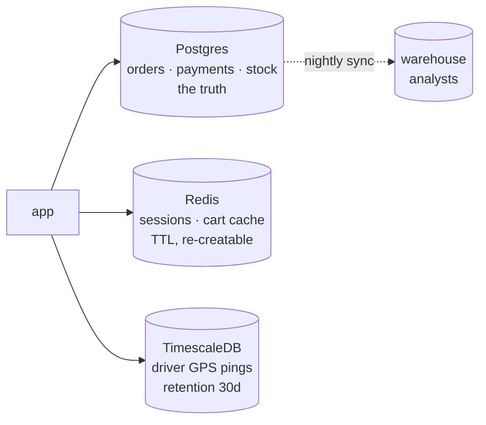

# Day 040 · System Design — Choosing SQL or NoSQL in an interview

**After today you can:** You can make the choice out loud, with the access patterns as your evidence.

**The interviewer asks it as:** *SQL or NoSQL for this system, and what made you decide?*

---

## 1. What this is, and why they ask it

Fifteen days of database lessons converge on one question that every system design interview
contains, stated or not: **which store, and why?** Today is not a new technology — it is the
decision procedure that turns days 25 to 39 into an answer you can deliver in two minutes: list
the access patterns, check the invariants, run the scale arithmetic, and only then say a product's
name.

Interviewers ask it because it is the cheapest possible probe of engineering judgement. The
failing answers are both fashionable: *"NoSQL, because it scales"* (a slogan where arithmetic
should be) and *"Postgres, always"* (a reflex where analysis should be). The passing answer shows
its working — and, crucially, shows *what evidence would change it*. This lesson gives you the
four questions, a worked example, and the script. It is also the close of the phase's argument:
[day 036](../day-036-two-pointers-revision/README.md) built the frame, days
[037](../day-037-prefix-sums/README.md)–[039](../day-039-difference-arrays/README.md) walked the
families, and today you make the call.

---

## 2. The story

Ibrahim sells furniture from a shop near the flyover, and deliveries are half his reputation. He
owns a scooter with a carrier, keeps an auto-driver on call, and knows a lorry man for the big
jobs.

Customers, he says, always ask the wrong question first: *which is your fastest?* The scooter is
the fastest. It is also the wrong answer for a dining table, and the lorry is the wrong answer
for a table lamp — it would arrive tomorrow, cost ten times the scooter, and spend the trip
mostly empty.

So Ibrahim never answers that question. Instead he asks three of his own, always the same three,
in the same order. **What is going?** A lamp, a mattress, a full bedroom set — the size and shape
of the load rules out most of the fleet before anything else is said. **Where is it going?** The
lanes behind the mosque are too narrow for the lorry, full stop; the highway township is too far
for the scooter. **And how is it packed?** Glass tops ride differently from steel frames.

Only after the three answers does he name a vehicle, and by then the choice mostly makes itself.
His nephew, who helps on Sundays, once watched him send a single mattress on the auto and asked
why not the scooter, which was parked right there. Because the customer had also bought two
chairs, Ibrahim said. You do not choose for the mattress. You choose for the whole order.

The part his nephew remembers now, years later, is what happened when a rival shop bought a
second lorry and painted *FASTEST DELIVERY IN THE DISTRICT* on it. For a month, every big
purchase went out on it, lamps included. Customers in the narrow lanes waited while the lorry
found parking three streets away and a boy walked their parcel over. The rival had bought an
answer, Ibrahim said, and was now going around fitting it onto questions.

Ask about the load. Ask about the route. Ask about the packing. The vehicle names itself.

---

## 3. The idea in plain English

Ibrahim's three questions are today's decision procedure. The rival's lorry is every team that
chose a database from a slogan. And "you choose for the whole order" is the sentence that saves
you from choosing a store for one table.

### The four questions, in order

**Question 1 — what are the access patterns?** Before any product name: list what the system
actually reads and writes. *Users log in; a feed is rendered; an order is placed; support
searches by email; finance runs monthly reports.* Every question after this one is answered by
this list — which is why the interviewer's real test is whether you *start* here. This is the
load: what is going?

**Question 2 — what must be true at all times?** The invariants. Money that must not vanish
between accounts, stock that must not go negative, a booking that must not double-sell — these
are [day 033](../day-033-window-with-a-map/README.md)'s cross-entity transactions and
[day 026](../day-026-strings-revision/README.md)'s constraints, and they are the relational
deal's home ground. A domain woven from such rules — a **web**, in
[day 038](../day-038-subarray-sum-k/README.md)'s language — wants tables. A domain of independent
records — a **tree** — tolerates anything.

**Question 3 — what do the numbers say?** The arithmetic, done aloud, because this is where
"NoSQL because scale" dies or survives:

```
writes/second, reads/second, storage over three years, working set
against day 036's line: one tuned Postgres node ≈ 10-50k simple TPS,
terabytes of data — and day 037's: 50M × 1 KB sessions = 50 GB of RAM
```

Most systems live *inside* the node. A path that measurably crosses the line — a firehose from
[day 039](../day-039-difference-arrays/README.md), a session check from
[day 037](../day-037-prefix-sums/README.md) — is a named, sized exception.

**Question 4 — how settled are the questions?** [Day 039](../day-039-difference-arrays/README.md)'s
promise test: Cassandra and friends require the queries known up front; a young product asking
new questions weekly cannot keep that promise. Ad-hoc questions and analysts belong to the
relational arrangement — Meena's kitchen, from
[day 036](../day-036-two-pointers-revision/README.md).

### The shape of the answer: default plus exceptions

The procedure almost always lands in the same place, and saying it confidently is the win:

> **Postgres as the system of record, plus a specialised store per access path that measurably
> outgrows it — each with a named owner and reconciliation path.**

Not "SQL versus NoSQL" — that framing is the rival's lorry. Real systems are polyglot by *path*:
truth in the relational store, sessions on the
[day 037](../day-037-prefix-sums/README.md) shelf, the firehose in a
[day 039](../day-039-difference-arrays/README.md) store — each exception justified by a number,
not a fashion. And the counterweight that marks senior judgement: **every additional store is an
operational bill** — backups, monitoring, failure modes, a copy discipline — so the default for
any path that has *not* proven itself is the store you already run.

---

## 4. The picture

The decision, as a shape you can run out loud in two minutes:

```
                     list the access patterns   <- always first
                              |
        Q2: cross-entity invariants? ad-hoc questions? analysts?
                              |
              +---------------+----------------+
             yes                               no
              |                                 |
      relational CORE                 Q4: queries known and fixed?
      (Postgres)                          |              |
              |                          yes             no
              |                           |              |
        Q3: any path outgrowing       shape-fit       relational anyway
            the node? (numbers!)      store by         (it keeps every
              |                       family:          option open)
     +--------+---------+             KV / doc /
     no                yes            wide-column
     |                  |
   done —         carve out THAT path:
   one store      sessions -> Redis (037)
                  tree reads -> documents (038)
                  firehose  -> wide-column/TS (039)
                  each copy: owner + reconciliation (029)
```

**What to notice:** a product name appears only at the leaves. Every failing answer names the
product at the root.

The worked example from §5, as the final architecture:



**What to notice:** three stores, and each edge has a *reason with a number* from §5 — none of
them is there by fashion. The analysts get a copy, not access to the core.

---

## 5. How it actually works

The procedure, run honestly on one system: **a food-delivery app** — restaurants, menus, orders,
riders, customers.

### Step 1: the access patterns, listed

```
- customer browses restaurants and menus         (read-heavy, tree-shaped)
- customer places an order; pays                 (multi-entity write)
- restaurant accepts; rider assigned             (state machine, contended)
- rider GPS pings every 3 s while delivering     (firehose, append-only)
- customer session checked on every request      (hot key-value read)
- support: "find this customer's orders"         (ad-hoc-ish)
- finance: monthly settlements per restaurant    (reports, joins)
```

### Step 2: the invariants

An order spans customer, restaurant, rider, payment and stock — pay only if placed, assign only
if accepted, settle exactly once. That is a **web**: cross-entity transactions and constraints on
every side. The core is relational, and no further debate is needed — this single step decides
the centre of the design.

### Step 3: the numbers, path by path

```
orders: 500,000/day ≈ 6/s average, ~60/s peak      -> deep inside one node
menus:  50,000 restaurants × ~50 KB   = 2.5 GB     -> trivially relational
                                                      (JSONB for the nested
                                                       menu shape — day 038)
sessions: 2M active × 1 KB = 2 GB, checked at
          ~20,000 reads/s                          -> day 037 exactly: Redis,
                                                      TTL, re-creatable
GPS:    50,000 active riders × 1 ping/3 s
        ≈ 17,000 writes/s, ~1.5 B/day             -> the firehose: day 039 —
        queries: "this rider, this window"            time-series store,
        retention: 30 days                            retention built in
```

Two paths cross the line; everything else stays home. Note the shape of the reasoning: the
*number* carves the exception, not the product's reputation.

### Step 4: the settledness

Order questions are still evolving (new offers, new report cuts) — relational keeps them open.
GPS questions are fixed forever ("this rider, this window") — the wide-column promise is easy to
keep there. The analysts get a nightly copy into a warehouse rather than queries against the
core — [day 029](../day-029-read-write-pointer/README.md)'s copy-with-an-owner, at system scale.

### The delivery

Postgres core (orders, payments, restaurants, menus-as-JSONB); Redis for sessions and cart cache;
TimescaleDB for pings with 30-day retention. Three stores, each with a number attached, each copy
owned. That answer — with its working shown — is the whole lesson.

---

## 6. The numbers

### The line, restated as a checklist

The calibration numbers this phase has built, in one place — these are the ones to *say*:

```
one tuned Postgres node        ~10-50k simple TPS, terabytes on disk
one Redis node                 ~100k+ ops/s, RAM-bound (count × size!)
Cassandra/TS cluster           millions of writes/s, queries fixed up front
1 billion events/day           ≈ 11,600/s average — INSIDE one node's range
50M × 1 KB                     = 50 GB — RAM-shaped
10k servers × 100 metrics/10s  = 100k points/s — firehose-shaped
```

### The cost of the exception

The arithmetic slogan-answers never do — what one extra store costs:

```
one more store = backups + monitoring + upgrades + a failure mode
                 + every copy needing an owner and reconciliation (day 029)
              ≈ real engineer-days per month, forever

carve-out is justified when:  (load it removes from the core) is measurable
                              AND the core would need scaling without it
```

### The premature-scale check

```
startup, 10,000 users, "but we're planning for 100×":
  today:      10k × 20 requests/day ≈ 2.3 req/s      — a laptop's load
  at 100×:    230 req/s, orders ~6/s                 — still one node
  the honest trigger points, written down in advance:
    sessions to Redis     when session reads > a few thousand/s
    firehose to TS store  when appends > ~50k/s or retention hurts
    core partitioning     when TPS or working set outgrows the node
```

"Plan for scale" means writing the trigger numbers down — not paying the operational bill years
early.

---

## 7. The trade-offs

### The meta-trade: optionality against shape-fit

Relational keeps every question open and pays at read time; the specialised stores serve one
shape brilliantly and slam the others shut. Early product: optionality wins, because the
questions change weekly. Fixed, proven path: shape-fit wins, because the question will never
change. The decision is really about **how much you know**, which is why access patterns come
first — they are the measure of what you know.

### The failure modes of each reflex

Choosing NoSQL by fashion: the rival's lorry — ad-hoc questions impossible, invariants pushed
into application code, and the analysts building a shadow relational copy within a year (they
always do). Choosing Postgres by reflex and never carving out: the session check eats the core's
capacity, the firehose bloats it, and the eventual migration happens under fire instead of by
plan. The procedure exists because *both* reflexes fail — just on different days.

### I would not decide it if...

**I would not answer "SQL or NoSQL" as asked** — I would answer per access path, and say so.
**I would not name a product before listing the patterns** — the order of the answer is the
evidence of judgement. **And I would not carve out a path without a number and an owner** — a
carve-out is a copy, and [day 029](../day-029-read-write-pointer/README.md)'s law has no
exceptions: no reconciliation job, no copy.

### The honest sentence

> The strong answer is rarely a store; it is a *procedure* — patterns, invariants, numbers,
> settledness — landing on a relational core with named, numbered exceptions. Interviewers
> remember the candidate who said what evidence would change their mind.

---

## 8. In the interview

### How it gets asked

- *"SQL or NoSQL for this system?"* — the direct form; answer with the procedure, per path.
- *"What database would you use?"* — inside every design round, usually early; buy time by
  listing access patterns first.
- *"Why not MongoDB / why not just Postgres?"* — the challenge form; concede the honest part,
  produce the number that decides.
- *"Your traffic grows 100×. What breaks first?"* — the trigger-points question; answer with the
  carve-out order and the numbers that fire each.

### What to say out loud, in the first ninety seconds

1. **Refuse the binary, politely.** *"I'd choose per access path rather than for the system — so
   let me list the paths first."*
2. **List the patterns.** *"Reads: browse, feed, session-check. Writes: orders, payments, the GPS
   firehose. Plus support's ad-hoc queries and finance's reports."*
3. **Anchor the core on invariants.** *"Orders span customer, payment, stock — cross-entity
   transactions and constraints — so the system of record is relational."*
4. **Carve exceptions with arithmetic.** *"Two paths outgrow the node: sessions at twenty
   thousand reads a second — Redis, TTL, re-creatable; GPS at seventeen thousand appends a
   second with fixed queries — a time-series store with thirty-day retention."*
5. **Close with the discipline.** *"Everything else stays in Postgres until a number moves it —
   each carve-out is a copy with an owner, and each extra store is an operational bill."*

### The follow-ups

**"The interviewer pushes: 'if you had to pick exactly one store, which?'"**
Then Postgres, and the reasoning matters more than the name. It is the only member of the fleet
that does a tolerable job of *every* path on the list: transactions and constraints for the
order web, JSONB for the document-shaped menus, an unlogged or short-TTL table for sessions at
this scale, even the ping firehose for a while with a Timescale extension or plain partitioned
tables — day 025's point that the relational store is the generalist. The specialised stores do
not return the favour: Redis cannot hold the order invariants, Cassandra cannot serve the
analysts, Mongo makes the settlement joins my application's problem. Picking the generalist
keeps every option open while the product discovers its questions — optionality is the asset a
one-store constraint should maximise. And I would add the honest boundary: the single-store
answer has trigger points written on it — the session read rate and the ping volume — and when
they fire, the first carve-outs are exactly the ones I named before.

**"Support says: 'we chose MongoDB because we might scale.' Interview-grade critique?"**
Two substitutions happened in that sentence, and naming them is the critique. "Might scale"
substituted a hope for a number — the check is arithmetic: expected writes per second and
working set against one node's range, and a billion events a day is still inside it; "we might"
almost never survives that division. And "MongoDB" substituted a product for an access pattern —
Mongo's actual strength is tree-shaped, read-as-a-unit domains, day 038's lesson, which has
nothing to do with scale; if the domain is order-shaped webs, Mongo at scale delivers the *worst*
of both. The generous version of the critique, worth saying too: the instinct to think about
scale is right, and the fix is cheap — keep the relational core, write the trigger numbers down,
and pre-agree which paths carve out first when they fire. That converts a fashion decision into
an engineering plan without buying the lorry today.

**"How does this answer change at a big company versus a startup?"**
The procedure is identical; two inputs change value. Settledness: a startup's questions churn
weekly, so optionality dominates and the relational default hardens — almost nothing should
carve out early, because every specialised store is a bet that a question stops changing. At an
established company the paths are measured and settled — the feed's read shape, the event
firehose — so shape-fit stores are justified by data that actually exists, and the org can pay
their operational bills with dedicated teams. Second, the cost of the exception: a startup's
three engineers cannot own four stores' failure modes — day 029's reconciliation discipline
alone would eat them; a platform team amortises that across dozens of services. So the same four
questions land differently: startups end with Postgres-plus-maybe-Redis and a list of trigger
numbers; big companies end with the polyglot diagram — and the interview answer is knowing that
*the procedure, not the diagram*, is the transferable part.

### A model answer

> "Rather than pick SQL or NoSQL for the whole system, I'll choose per access path — so first,
> the paths. Customers browse menus and place orders; payments settle; riders stream GPS pings
> every three seconds; every request checks a session; support asks ad-hoc questions; finance
> runs monthly settlement reports.
>
> The core is decided by invariants, not load: an order weaves customer, restaurant, rider,
> payment and stock together — pay only if placed, settle exactly once. Cross-entity
> transactions and constraints are the relational deal, so the system of record is Postgres,
> with the nested menu shapes in JSONB rather than a second database.
>
> Then the arithmetic, path by path. Orders: half a million a day is about six a second — deep
> inside one node; stays. Sessions: two million at a kilobyte is two gigabytes, read twenty
> thousand times a second — that's key-value shaped and re-creatable, so Redis with a TTL,
> taking that load off the core. GPS: fifty thousand riders pinging every three seconds is
> seventeen thousand appends a second, queries always 'this rider, this window', value fading in
> weeks — a time-series store with thirty-day retention. Finance and support get a nightly copy
> in a warehouse, not queries against the core.
>
> So: a relational core and two carve-outs, each justified by a number, each copy with an owner
> and a reconciliation path — and everything else stays put until a measurement moves it,
> because every extra store is an operational bill. If our scale assumptions are wrong, the
> trigger points are written down: session reads in the thousands per second fire the Redis
> move, and append volume fires the time-series one. That's also what would change my mind."

---

## 9. Recall card

- **Never answer the binary — answer per access path.** Patterns → invariants → numbers →
  settledness, and a product name only at the end.
- **Invariants pick the core:** cross-entity transactions and constraints = relational. Webs want
  tables; trees tolerate anything (day 038).
- **Numbers carve the exceptions:** one node ≈ 10–50k TPS / terabytes; 1B events/day ≈ 11.6k/s —
  inside it. Sessions → Redis (037); firehose with fixed queries → wide-column/TS (039).
- **Every carve-out is a copy with an owner (029) and an operational bill** — default to the
  store you already run; write trigger numbers instead of paying for scale early.
- **The winning close:** say what evidence would change your mind. The procedure is the answer;
  the diagram is just today's output.
