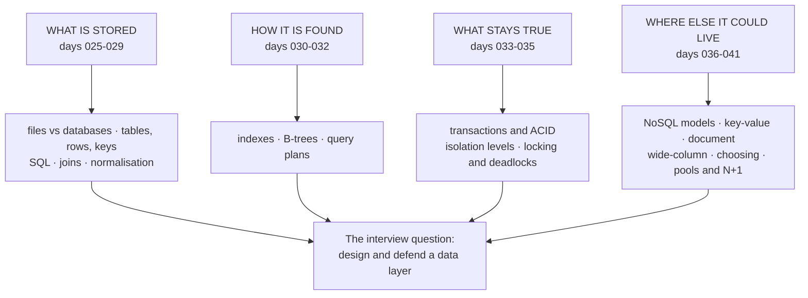

# Day 042 · System design — Database revision and interview questions

**After today you can:** You can answer schema, index, transaction and scaling questions about a database cold.

**The interviewer asks it as:** *Design and defend the database layer for an unseen product.*

---

## 1. What this is, and why they ask it

This closes the database phase — eighteen days, from
[day 025](../day-025-pattern-matching/README.md)'s "what a database gives you that a file does not"
to [day 041](../day-041-prefix-revision/README.md)'s connection pools. Today is not new material. It
is the drill that turns eighteen separate lessons into one procedure you can run on a product you
have never seen, under time pressure, out loud.

They ask it because the database layer is where a system design interview goes when it stops being
polite. Every high-level design round — design Twitter, design a ride-hailing app, design a ticket
booking system — reaches a moment where the interviewer says "and what does that table look like?"
or "what happens if two people book the last seat?" Candidates who have read blog posts about
sharding fall over at exactly that point, because those two questions are about schema and
isolation, not scale. The material for both has been in front of you since day 026. Today assembles
it into an order you can walk.

---

## 2. The story

Nasreen has run a tailoring shop in a lane behind the market for nineteen years. Two machines, one
girl who does the finishing, and a curtain across the back for measurements.

The shop is not the point. The point is what happens when a customer she has never met walks in at
four in the afternoon with a bag of cloth and no idea what she wants.

Nasreen does the same six things, in the same order, every single time, and she has done them so
often she does not know she is doing them. First: what is it for. A wedding, an office, a child
growing fast — the answer changes everything after it. Second: how many, and by when. Third: she
lifts the cloth, feels the weight of it between her fingers, and decides what it will take and what
it will not tolerate. Fourth: the measurements, taken in a fixed order, shoulder first, always, so
nothing is forgotten. Fifth: she says the price and the date out loud, before the customer has
committed to anything, because that is the moment for a surprise to happen, not the moment of
delivery. And sixth, the one her competitors skip: she says what would change her mind. "If you want
it in three days instead of six, I cannot use this cloth, it will pucker. We would have to pick
something else."

Her nephew opened a shop two lanes over and lasted eight months. He was quicker than her with a
machine. But when a customer walked in he would start guessing — "you want it fitted, no?" — and
half the time he was guessing at the wrong question. He would agree to a date without having felt
the cloth. He never said what would change his mind, so when something did change, it came out as an
apology instead of a plan.

Nineteen years of every kind of customer, and Nasreen has never needed a new set of questions. Only
the answers change.

---

## 3. The idea in plain English

Nasreen's six questions are the procedure. The interviewer's product is her unfamiliar customer. And
her nephew is the candidate who starts naming technologies before knowing what the system does.

Here is the procedure, in her order, with the days that supply each answer.

### One — what is it for: the access paths

Before any schema, list the questions the system will ask of its data. Not the entities — the
**access paths**. "Show a user's last twenty orders." "Show one order with its items." "Count
today's signups by city."

This is [day 040](../day-040-2d-prefix-sums/README.md)'s rule, and it is the whole reason the
SQL-versus-NoSQL question is a trap: you never answer it for a system, you answer it per access
path. A product with four read patterns can want a relational store for three of them and a
key-value store for the fourth.

### Two — how many, and by when: the numbers

Users, writes per second, bytes per record, growth per year. §6 does the arithmetic; the point here
is that it comes *second*, before any technology choice, because the numbers decide whether the
choice is even interesting. Most systems fit on one node, and saying so early is a strength.

### Three — feel the cloth: the invariants

What must never be false? "An order's total equals the sum of its items." "A seat is sold once."
"An account balance never goes negative."

Invariants are the sharpest question in the whole phase, because they pick the core store almost by
themselves. Anything that must hold **across entities, at write time** wants a relational database
and a transaction ([day 033](../day-033-window-with-a-map/README.md)). Anything that holds inside
one entity can live in a document ([day 038](../day-038-subarray-sum-k/README.md)).

### Four — measurements in a fixed order: the schema

Tables, columns, keys, and then indexes — always in that order, because an index is a decision about
a query and you cannot make it before the query exists.

The fixed order that keeps you from forgetting anything, from
[day 026](../day-026-strings-revision/README.md):

1. One table per kind of thing. One row per one of them.
2. A surrogate **primary key** on each — `BIGSERIAL` — never a natural key, because meaningful
   things change.
3. **Foreign keys on the many side.** Many-to-many needs a third table with a composite key.
4. `NOT NULL` unless absence genuinely means something. `TIMESTAMPTZ` for time, `NUMERIC` for money.
5. Index every foreign key. Primary keys are indexed for you; foreign keys are not.
6. Normalise to 3NF first, then denormalise deliberately and only by the read-to-write ratio
   ([day 029](../day-029-read-write-pointer/README.md)) — and every copy gets an owner and a
   reconciliation job.

### Five — say the price out loud: the failure modes

Before the interviewer asks, name what goes wrong. Two writers on the same row
([day 034](../day-034-at-most-k/README.md)'s lost update). Two transactions in a cycle
([day 035](../day-035-choosing-the-pattern/README.md)'s deadlock). One page issuing two hundred
queries ([day 041](../day-041-prefix-revision/README.md)'s N+1). A query that was fast at ten
thousand rows and is not at ten million ([day 032](../day-032-variable-window/README.md)).

### Six — what would change your mind: the trigger

"I'd start with one Postgres instance. I'd move sessions to Redis when the session check is more
than about a fifth of database load, and I'd revisit the write path if sustained writes go past
roughly ten thousand a second." That sentence — a named trigger with a number — is
[day 040](../day-040-2d-prefix-sums/README.md)'s winning close, and it is what her nephew never
learnt to say.

---

## 4. The picture

The eighteen days, arranged as the four questions they answer:



**What to notice:** the four groups are the order you should speak in. Schema, then access, then
guarantees, then alternatives. Candidates who start at the fourth box — "I'd use Cassandra" — have
skipped the three that justify it.

The one diagram to be able to draw from memory, because a design round asks for it constantly:

```
        ┌──────────────┐
        │  app servers │  N instances, each with a pool of ~20 connections (day 041)
        └──────┬───────┘
               │
     ┌─────────┴──────────┐
     │                    │
┌────▼─────┐        ┌─────▼──────┐
│  Redis   │        │  PgBouncer │   only once N x 20 > max_connections
│ sessions │        └─────┬──────┘
│ counters │              │
│  (037)   │        ┌─────▼───────────────┐
└──────────┘        │  Postgres primary   │  system of record. All invariants live here.
                    │  writes + hot reads │
                    └─────┬───────────────┘
                          │  streaming replication (write-ahead log, day 025)
                    ┌─────▼───────────────┐
                    │  Postgres replica   │  reports, analytics, anything tolerant of lag
                    └─────────────────────┘
```

**What to notice:** the truth lives in exactly one box. Everything else is a copy with an owner and
a reason. That single property is what makes a design defensible when the follow-ups start.

---

## 5. How it actually works

The phase in mechanism form — what each piece really does, condensed to the sentence you would say
under pressure.

### Durability: the write-ahead log

Postgres does not write your row to its table file and hope. It appends the *intent* to a
**write-ahead log**, calls `fsync` so the operating system actually commits it to disk, and only
then reports success ([day 025](../day-025-pattern-matching/README.md),
[day 033](../day-033-window-with-a-map/README.md)). Crash halfway and recovery replays the log. The
same log, shipped to another machine, is streaming replication — which is why durability and
replication are one mechanism, not two. MySQL's InnoDB does the same thing with its redo log.

### Lookup: the B-tree

An index is a sorted **B+ tree** kept beside the table
([day 030](../day-030-fast-and-slow/README.md), [day 031](../day-031-fixed-window/README.md)). Each
node is one 8 KB page, so a node holds hundreds of keys — a **fanout** near 500 — and three levels
cover ten million rows. A lookup is three or four page reads at about 0.1 ms each, against a 200 MB
sequential scan. Leaves hold the row pointers and are linked in order, which is why the same index
serves `BETWEEN`, prefix `LIKE` and `ORDER BY` for free. The **left-prefix rule**: an index on
`(A, B)` serves `A` and `A + B`, never `B` alone.

### Correctness under concurrency: MVCC and locks

Postgres gives each transaction a **snapshot** and keeps old row versions until nobody needs them —
multi-version concurrency control, which is why readers never block writers. `READ COMMITTED` is the
default and takes a fresh snapshot per statement. `REPEATABLE READ` takes one for the whole
transaction. `SERIALIZABLE` uses SSI, detects conflicts and aborts the loser — which means **your
application must have a retry loop** ([day 034](../day-034-at-most-k/README.md)).

Writes take row locks. Blocking is a queue and drains; **deadlock is a cycle** and does not, so
after `deadlock_timeout` (one second by default) Postgres finds the cycle in its waits-for graph,
aborts one transaction with `ERROR: deadlock detected`, and the app retries from `BEGIN`
([day 035](../day-035-choosing-the-pattern/README.md)).

### The alternatives, and what each one really is

- **Redis** — a shelf in RAM. Sub-millisecond, single-threaded so `INCR` is atomic for free, TTL
  built in, durability optional. Sessions, carts, counters, rate limiters
  ([day 037](../day-037-prefix-sums/README.md)).
- **DynamoDB** — a durable key-value store partitioned by hashed key, single-digit milliseconds at
  any size, priced per request.
- **MongoDB** — documents. One entity plus its belongings, written and read as a unit; atomicity
  stops at the document's edge ([day 038](../day-038-subarray-sum-k/README.md)).
- **Cassandra** — wide-column. A partition key picks the machine, clustering columns sort inside it,
  and writes are cheap because of the **LSM tree**. One table per query, decided at write time
  ([day 039](../day-039-difference-arrays/README.md)).
- **Postgres JSONB** — quietly covers a large share of the cases people reach for MongoDB to solve,
  without a second system to operate.

---

## 6. The numbers

The arithmetic to have loaded before you walk in. Every one of these is a multiplication you can do
out loud.

### Sizing a table

```
an orders table, 2 million orders/month:
    2,000,000 x 12 = 24,000,000 rows/year
    ~300 bytes/row (ids, timestamps, status, amounts)
    24,000,000 x 300 B = 7.2 GB/year of table data
    + 4 indexes at ~15% each = 7.2 x 0.6 = 4.3 GB of index
    -> ~11.5 GB/year. Five years is under 60 GB.
```

Say the conclusion, not just the number: **that fits in RAM on a mid-sized instance, so this is not
a scale problem.** Most tables in most interviews land here.

### Read throughput

```
5 million daily active users x 12 page views x 4 queries/page
    = 240,000,000 queries/day
    240,000,000 / 86,400 = ~2,800 queries/s average
    peak ~3x average = ~8,400 queries/s
```

Against one Postgres node's honest ceiling of roughly 10,000-50,000 simple indexed reads per second
([day 040](../day-040-2d-prefix-sums/README.md)), that is inside one machine — with replicas for
headroom, not because the primary cannot cope.

### The index decision, priced both ways

```
index lookup : 3-4 page reads x 0.1 ms  = ~0.4 ms
table scan   : 200 MB / 8 KB = 25,000 pages x 0.1 ms = ~2.5 s

but every write pays for every index:
    8 indexes = 9 writes per INSERT
    at 500 inserts/s that is 4,500 write operations/s instead of 500
```

That pair of numbers is the entire index trade-off, and it is why "add an index" is never a free
answer.

### The N+1, priced

```
one list page, 100 items, lazy-loaded author per item:
    1 + 100 = 101 queries x ~1 ms round trip = ~101 ms, all sequential
    eager-loaded: 2 queries x ~1.5 ms = ~3 ms

    at 200 requests/s: 20,200 queries/s (impossible) vs 400 queries/s (trivial)
```

The database was never slow. The **conversation** was.

### Connection pool sizing

```
8-core database -> pool of ~16-20 connections per app instance
    opening a connection: TCP + TLS + auth + a new Postgres process
                          = ~5-10 ms and ~7 MB
    40 app instances x 20 = 800 connections vs max_connections = 100
    -> PgBouncer in transaction mode
```

---

## 7. The trade-offs

### The four you will be asked to defend

**Normalised against denormalised.** Normalised means each fact in one place, which means no update
anomaly and no drift, at the price of a join per read. Denormalised means a stored copy, which means
a fast read at the price of a write path that must maintain it. The decision is the read-to-write
ratio; below about 10:1, do not
([day 029](../day-029-read-write-pointer/README.md)). *I would not denormalise if I could not name
the job that reconciles the copy* — that job is the difference between a design and a future
incident.

**More indexes against faster writes.** Each index is 10-25% more storage and one more write per
insert. *I would not add an index before running `EXPLAIN ANALYZE`* — half the time the real cause
is a function wrapped around the column, a deep `OFFSET`, or an N+1, and none of those are fixed by
an index ([day 032](../day-032-variable-window/README.md)).

**Stronger isolation against throughput.** `SERIALIZABLE` removes write skew and phantoms and costs
you aborts and a retry loop. `READ COMMITTED` is fast and lets a check-then-act pattern lose. *I
would not run everything at serialisable* — I would pick per transaction: default plus SQL
arithmetic for simple writes, repeatable read for reports that must be self-consistent, serialisable
with retries for check-then-act ([day 034](../day-034-at-most-k/README.md)).

**Relational against NoSQL.** Relational buys ad-hoc questions, cross-entity transactions and
single-copy facts; it costs you joins at read time and a single node's write ceiling. NoSQL buys a
designed access path and horizontal scaling by key; it costs you every question you did not think of
at design time ([day 036](../day-036-two-pointers-revision/README.md)). *I would not move a system
to Cassandra because it is growing* — I would move one access path, keep the system of record where
it is, and write down the number at which that stops being enough.

### The honest sentence

> Almost every "we outgrew our database" story is a schema story, an index story, or a
> conversation-shape story. Reach for a bigger architecture only after you can point at the query
> plan, the pool, and the number of round trips per request, and say that all three are already
> right.

---

## 8. In the interview

### How it gets asked

- *"Design the data model for a food delivery app."* — the direct form. Schema, keys, indexes, and
  the one invariant that matters.
- *"Two users tap 'book' on the last seat at the same moment. Walk me through what happens."* — the
  isolation question, always. It is testing whether you know the difference between a check and a
  lock.
- *"This page takes 900 ms. Where do you look?"* — diagnosis, in a fixed order: query log first,
  then the plan, then the schema.
- *"Would you use SQL or NoSQL here?"* — a trap in binary clothing. Never answer the binary.

### What to say out loud, in the first ninety seconds

1. **Name the access paths, not the entities.** *"Before the schema, let me list the reads: a
   customer sees their last twenty orders, a restaurant sees today's open orders, and ops runs
   revenue by city per day. Three patterns, and the third is analytical."*
2. **Do one number.** *"At two million orders a month, that's twenty-four million rows and about ten
   gigabytes a year with indexes — comfortably one node, so I'll design for correctness first, not
   scale."*
3. **State the invariant.** *"The one thing that must never be false: a delivery slot is assigned to
   exactly one order. That's a cross-row constraint, so it lives in a relational transaction."*
4. **Give the tables in one breath.** *"`customers`, `restaurants`, `orders`, `order_items`.
   Surrogate `BIGSERIAL` keys, foreign key on the many side, `order_items` stores unit price as a
   snapshot because it must not follow today's menu price."*
5. **Then the indexes, each with its query.** *"Index on `orders(customer_id, created_at DESC)` for
   the customer's recent list, and on `orders(restaurant_id, status)` for the open-orders board.
   Each index exists for a named query."*
6. **Close with the trigger.** *"I'd revisit this if writes go past roughly ten thousand a second,
   or if the analytics query starts affecting order latency — at which point it moves to a replica
   before it moves anywhere else."*

### The follow-ups

**"Two customers book the last seat at the same instant. What happens, and what do you do about
it?"**
Under the default isolation level, read committed, both transactions can read "one seat left",
both can decide it is fine, and both can write — that is the lost update, and it is the single most
common correctness bug in booking systems. The reason it happens is that a plain `SELECT` takes no
lock, so the check and the act are not one indivisible step. There are three fixes and I would say
which I'd pick and why. First: do the arithmetic in the database —
`UPDATE seats SET remaining = remaining - 1 WHERE id = ? AND remaining > 0`, then check the affected
row count. That takes a row lock for the duration of the statement, it is one round trip, and it
cannot lose. Second: `SELECT ... FOR UPDATE` on the row I am about to check, which locks it so the
second transaction waits — correct, but it holds a lock for the length of my transaction, so it must
be short and must contain no external calls. Third: `SERIALIZABLE`, which catches this and write
skew as well, at the cost of aborts and a retry loop in the application. For a seat counter I'd take
the first. For "the last seat, and also insert a booking row and also decrement a coupon", where the
invariant spans several rows, I'd take the third.

**"Your orders table has two hundred million rows and the customer's order history has got slow.
What do you do, in order?"**
In order of cost, cheapest first, and I would not skip a step. First I look at the actual query and
its plan with `EXPLAIN ANALYZE`, and the first thing I compare is estimated rows against actual
rows, because a bad estimate poisons every decision above it and the fix might just be `ANALYZE`.
Then I check the obvious structural causes that never show up in the plan: is this one query or is
it an N+1 from the ORM, and is it using a deep `OFFSET` for pagination? Deep offset is the classic —
`OFFSET 100000` makes the database produce and discard a hundred thousand rows, and the fix is
keyset pagination: `WHERE (created_at, id) < (?, ?) ORDER BY created_at DESC, id DESC LIMIT 20`.
Then the index: a composite on `(customer_id, created_at DESC)` serves both the filter and the sort,
so the sort disappears from the plan. Only after all of that would I talk about partitioning by
month, which helps because old partitions stop being touched, and only after that would I discuss
moving history out. Most of the time the answer is at step three, and saying that is a strength.

**"When would you actually add a second kind of database?"**
When a specific access path has an evidenced cost that the current store cannot serve, and I can
name both the path and the number. Three real examples. A session check on every request at twenty
thousand requests a second is twenty thousand queries a second against the system of record for data
that is disposable — that goes to Redis, and I'd say plainly that nothing irreplaceable lives only
there, because eviction and default persistence make it a shelf, not a ledger. A firehose of
telemetry, a billion events a day with a fixed set of queries, is 11,600 writes a second of data
nobody updates — that goes to a wide-column or time-series store, because writes are appends and the
questions are known. Full-text search across millions of documents goes to Elasticsearch, because
that is a genuinely different data structure and Postgres full-text hits a ceiling. What all three
share is that I am moving *one access path*, not the system, and every copy has an owner and a
reconciliation path. The default answer is the store I already run, because a second database is a
second thing to back up, monitor, patch and be paged for — and that bill is paid every week, not
once.

### A model answer

> "Let me take the reads first, then the numbers, then the invariants, then the schema.
>
> The reads are: a customer's recent orders, a restaurant's open orders, and daily revenue by city.
> The first two are per-key and latency-sensitive; the third is analytical and can tolerate lag, so
> it goes to a replica.
>
> Numbers: two million orders a month is twenty-four million rows a year, about three hundred bytes
> each, so seven gigabytes of table plus four gigabytes of index. Five years is under sixty
> gigabytes. That fits on one node with room, so scale isn't the interesting constraint here —
> correctness is.
>
> The invariant that decides the store: an order's items must be written with the order, and a
> delivery slot must be held by exactly one order. Both are cross-row, write-time constraints, so
> the core is relational — Postgres.
>
> Schema: `customers`, `restaurants`, `orders`, `order_items`. `BIGSERIAL` surrogate keys, foreign
> keys on the many side, `NOT NULL` everywhere absence isn't meaningful, `NUMERIC` for money and
> `TIMESTAMPTZ` for time. `order_items` stores `unit_price` as a snapshot of what was charged — it
> should differ from today's menu price, and it never drifts.
>
> Indexes, each tied to a query: `(customer_id, created_at DESC)` for the history page, which serves
> the filter and the sort together; `(restaurant_id, status)` for the open-orders board. I'd index
> every foreign key, since Postgres doesn't do that for me, and I'd resist adding more until
> `EXPLAIN ANALYZE` asks for them — each index is another write per insert.
>
> Concurrency: the seat-or-slot assignment does its arithmetic in the `UPDATE` with a `WHERE`
> guard, and I check the affected row count rather than reading first and writing after. Anything
> that has to check several rows and then write goes to serialisable with a retry loop, and I'd say
> out loud that the retry loop is not optional.
>
> Operationally, connection pools of about twenty per app instance, and PgBouncer once instance
> count times pool size passes `max_connections`. And query counts visible in development, because
> the failure I'd actually expect first is an N+1 on the order-items page, not a shortage of
> hardware.
>
> What would change my mind: sustained writes past roughly ten thousand a second, or a session or
> telemetry access path whose volume is dominated by data that isn't the system of record. Those
> move one path to Redis or a time-series store — with an owner and a reconciliation path — not the
> whole system somewhere else."

---

## 9. Recall card

- **Run the six questions in order, every time:** access paths → numbers → invariants → schema →
  failure modes → the trigger that would change your mind. Never name a product first.
- **Schema order is fixed:** table per thing, surrogate key, foreign key on the many side,
  `NOT NULL`/`NUMERIC`/`TIMESTAMPTZ`, index every foreign key, 3NF then denormalise only by
  read-to-write ratio with a reconciliation job.
- **The concurrency answer is one sentence:** do the arithmetic in the `UPDATE` with a `WHERE`
  guard; use `FOR UPDATE` for check-then-act on one row; use serialisable plus a retry loop when the
  invariant spans rows.
- **Diagnose in cost order:** `EXPLAIN ANALYZE` (estimated vs actual rows) → N+1 and deep `OFFSET`,
  which never appear in the plan → composite index → partition. Most answers are at step two.
- **Numbers to carry:** index lookup 3-4 pages ≈ 0.4 ms; one node ≈ 10-50k simple reads/s and tens
  of terabytes; 1B events/day = 11.6k/s; pool ≈ cores × 2. A second database moves one access path,
  never the system.
