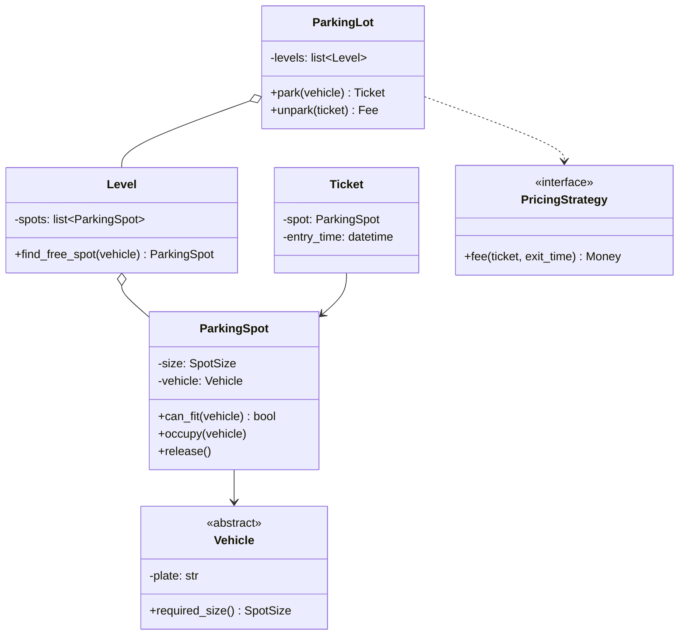

# Day 043 · System design — Why interviews ask object-oriented design at all

**After today you can:** You can say what an OOP round is really testing, so you stop answering the wrong question.

**The interviewer asks it as:** *Design a class structure for this feature.*

---

## 1. What this is, and why they ask it

**Object-oriented design** is the practice of splitting a program into objects — bundles of data
together with the behaviour that acts on that data — so that each one has a clear job and a clear
edge. An **object-oriented design round**, sometimes called low-level design or LLD, gives you a
paragraph of requirements and forty-five minutes, and asks for the classes: what they are, what each
one is responsible for, how they connect, and enough working code that one flow through the system
actually runs.

They ask it because it is the only round that tests the thing you will do every working day. The
algorithms round tests whether you can find an answer; the high-level design round tests whether you
can size a system. This round tests whether the code you write can be changed six months later by
somebody who is not you. Amazon runs it in nearly every loop and weights it heavily. Uber, Flipkart,
Swiggy, Zomato, Atlassian, PhonePe and most Indian product companies run a dedicated LLD round;
Microsoft folds it into the coding round. The failure mode is specific and common: candidates answer
the wrong question — they design a schema, or they recite design patterns, or they write one enormous
class — and the interviewer has no way to score any of it.

---

## 2. The story

Antony has a furniture workshop in a lane in Ernakulam, six men, and he has been taking on one new
carpenter a year for about twenty years.

He does not ask them to build a cupboard. He tried that once, early on. It takes four days, you learn
almost nothing until the end, and by then you have paid for the wood.

What he does now is smaller. He puts a man at the bench with two planks and says: make me one drawer
that slides.

Then he goes and does something else, and watches out of the corner of his eye.

The first thing he watches for happens before any cutting. A good man asks what the drawer is for.
Kitchen or office? What is going in it — cutlery, or a sewing machine head that weighs nine kilos?
How wide is the gap it has to sit in, and is the gap square? Four questions, one minute, and every
cut after them is different because of the answers. The men who do not ask start cutting in the first
thirty seconds, and Antony has learnt that the confidence is the problem, not the speed.

The second thing he watches for is the joints. Anybody can nail four sides together and it will slide
today. What he wants to see is a man who makes the front separately, so that when the handle is
wrenched off in a year — and it will be — the front can come away without the sides being destroyed.
That is not extra work. It is the same work, arranged so that the thing most likely to fail is the
thing easiest to replace.

The third is smaller and it tells him the most. When the drawer is finished, does the man slide it in
and out a few times, with weight in it, before he says it is done? Or does he wipe his hands and
announce it?

One drawer, ninety minutes. Antony can tell more from it than from four days of cupboard, because a
cupboard hides habits and a drawer does not. And the men who ask, arrange for failure, and test are
the men who are still there five years later.

---

## 3. The idea in plain English

Antony's drawer is the object-oriented design round. It is small on purpose, so that habits show. His
three tests — *ask before cutting, arrange so the likely failure is cheap, prove it works* — are the
three things the interviewer is scoring, and almost nobody is told that in advance.

### What an object actually is

An **object** is data and the behaviour that belongs to that data, kept together in one place. A
**class** is the description; an object is one thing made from that description. If you have a
`ParkingSpot` class, one particular spot — number 34, on level 2, currently occupied — is an object.

That "kept together" is the entire point and it is easy to miss. A design where `ParkingSpot` holds
`is_free` and some other class reaches in to decide whether the spot is free has *not* used objects.
It has used a record with a name on it. Where behaviour sits is what this whole phase is about, and
[day 044](../day-044-first-and-last-occurrence/README.md) starts on it properly.

### The four questions the round is actually asking

**One: can you turn vague words into a bounded model?** The prompt is always under-specified —
"design a parking lot" is nine words. A parking lot has gates, spots, vehicles, tickets, payment,
pricing, floors, displays, reservations and season passes, and forty-five minutes contains about a
third of that. The skill being tested is choosing the third, saying which third, and saying what you
are leaving out. Antony's four questions before the first cut.

**Two: do you know where behaviour belongs?** Given a rule — "a bike may park in a bike spot or a
large spot, never in a compact spot" — where does that rule live? In the `Vehicle`? In the
`ParkingSpot`? In a `ParkingLot` that knows about both? There is a defensible answer and there are
indefensible ones, and the interviewer is watching you reason about it rather than watching you get
it right.

**Three: is your design cheap to change?** They will ask, at minute thirty-five, "now add electric
vehicle charging spots" or "now the pricing is per-hour on weekdays and flat on weekends". A good
design absorbs that in one new class and one line. A bad one needs a change in five places, and the
interviewer will make you name all five. Antony's replaceable drawer front.

**Four: does it run?** Not all of it. One flow — a vehicle arrives, gets a spot, gets a ticket, leaves,
pays — written as real code, with the method bodies that matter actually filled in. Candidates who
produce only class names and arrows are producing a diagram, not a design.

### What it is not

It is **not schema design.** The commonest wrong turn is to hear "design a parking lot" and start
drawing tables with foreign keys — the whole of the phase you finished
[yesterday](../day-042-binary-search-idea/README.md). Tables are about what is stored; objects are
about where behaviour lives. A `Ticket` table and a `Ticket` class look similar and are answers to
different questions.

It is **not a design-patterns quiz.** Naming Factory, Singleton and Observer in the first two minutes
reads as revision, not as design. Patterns arrive in this course from
[day 063](../day-063-counting-with-dicts/README.md), and the right time to say a pattern's name is
when the problem has already forced its shape.

It is **not high-level design.** No load balancers, no replicas, no queues, no request-per-second
arithmetic. One process, in memory, and the hardest question is where a rule lives.

### The forty-five minutes, spent

```
minutes  0-5    clarify. Scope in, scope out, said out loud and agreed.
minutes  5-10   the nouns and verbs. Candidate classes, and what each is responsible for.
minutes 10-20   relationships, and the two or three interfaces the design turns on.
minutes 20-35   code one flow end to end. Real method bodies on the parts that matter.
minutes 35-42   the extension they throw at you. Change the design out loud.
minutes 42-45   what you left out, and what you would do next.
```

Say that plan at minute one — *"I'll spend five minutes on scope, then classes, then I'll code the
main flow"* — and the interviewer relaxes, because now they know you will get to code.

---

## 4. The picture

The three rounds, side by side, so you stop answering the wrong one:

```
                 DSA round            OOD / LLD round          HLD round
              ------------------   ---------------------   -------------------
 input        a precise problem    a vague paragraph       a product name
 output       one function         6-10 classes + code     boxes, arrows, numbers
 hard part    finding the trick    where behaviour lives   sizing and trade-offs
 they ask     "is it correct       "can someone else       "does it survive
               and is it fast?"     change this in a        ten million users?"
                                    year?"
 wrong turn   over-thinking        drawing tables, or      going too deep on
              the edge cases       reciting patterns       one component
```

**What to notice:** the middle column never mentions scale and never mentions storage. If your answer
contains a replica count, you are in the wrong column.

And the shape of what you produce — a parking lot, sketched the way it should be at minute twenty:



**What to notice:** `can_fit` lives on `ParkingSpot`, not in the lot. And `PricingStrategy` is an
interface with nothing behind it yet — that empty box is what makes "now add weekend pricing" a
one-class change instead of a five-file edit. Those two decisions are most of the score.

---

## 5. How it actually works

### What the interviewer is filling in

Most product companies score this round against four or five named criteria, and they are close to
identical across companies:

- **Requirement handling** — did the candidate scope, or did they start coding?
- **Modelling** — are the classes the right ones, with one clear responsibility each?
- **Extensibility** — did the design survive the change we threw at it?
- **Code quality** — does it compile in the reader's head? Are names honest? Is there a method longer
  than fifteen lines doing four things?
- **Communication** — did they say what they were doing and why, or did they go quiet and type?

You cannot see the form, but you can answer it. Saying "I'm putting this rule on the spot rather than
the lot, because the spot owns whether it is free" is a sentence written *directly* into the modelling
box.

### The designs you already use every day

This is not theory. The libraries you have already touched in this course are object-oriented designs,
and they are worth naming in an interview because they show the idea is load-bearing:

- **Python's `logging` module** splits into `Logger`, `Handler`, `Formatter` and `Filter`. A logger
  does not know how to write to a file; a handler does. That is why you can add a handler that posts
  to Slack without touching a single line of logging code anywhere in your program. It is the
  textbook example of separating *what happened* from *what to do about it*.
- **Java's `List` interface**, with `ArrayList` and `LinkedList` behind it. Code written against
  `List` does not change when you swap the implementation — the same idea you will meet as
  abstraction on [day 048](../day-048-binary-search-on-floats/README.md).
- **Python's `collections.abc`** — `Iterable`, `Sized`, `Mapping`. Implement `__len__` and your class
  *is* `Sized` and works everywhere `len()` is called. Behaviour defined by what an object can do,
  not by what it inherits from.
- **Django's `Storage`** — `FileSystemStorage` and `S3Storage` behind one interface, which is why
  moving uploads to S3 is a settings change.
- **Stripe's SDK** — `PaymentIntent`, `Customer`, `Refund`. Each object carries the operations that
  belong to it: `intent.confirm()`, not `stripe.confirm_intent(intent)`.

Every one of those is a design where behaviour was put next to the data it needs, and the payoff
shows up years later as a change that touched one file.

### The five failures, and what each looks like

- **The god class.** One `ParkingLot` with eleven methods that does spot allocation, pricing, ticket
  issue and payment. Symptom: every extension question modifies it.
- **The anaemic model.** Classes with fields and getters and no behaviour, plus a `ParkingLotService`
  that holds all the logic. This is the most common one among candidates who work mostly in
  frameworks, and it is objects in name only.
- **Pattern soup.** A factory producing a builder producing a strategy for a problem with three
  classes in it. Reads as insecurity.
- **The schema in disguise.** `Ticket` has `ticket_id`, `spot_id`, `vehicle_id` — foreign keys with
  no behaviour anywhere. You designed the table.
- **The silent typist.** Twenty minutes of code with no narration. Even a correct answer scores badly,
  because the round is partly a communication test and the interviewer has been given nothing to
  write down.

---

## 6. The numbers

### The round's budget, and what fits in it

```
45 minutes total
   - 5 minutes clarifying          =  40 left
   - 7 minutes extension questions =  33 left
   - 3 minutes wrap-up             =  30 minutes of actual design and code

at a realistic whiteboard pace of ~8 lines of thought-through code per minute:
   30 x 8 = ~240 lines, IF you wrote code the whole time
   realistically:  6-10 classes sketched  +  60-100 lines of real code on one flow
```

**Six to ten classes.** That is the number to hold. Three classes means you under-modelled and the
interviewer has nothing to probe; twenty means you will not code any of them and the round ends with
a diagram.

### The cost of a design, measured in files

This is the arithmetic that makes "extensible" concrete instead of a compliment. Take the parking lot
and add one requirement: electric-vehicle spots with a charging fee.

```
god-class design:
    ParkingLot.find_spot()      + a branch          1 file
    ParkingLot.calculate_fee()  + a branch          1 file
    SpotSize enum               + a value           1 file
    Vehicle.required_size()     + a branch          1 file
    the payment method          + a branch          1 file
                                                 -----
                                                  5 edits, 4 of them in existing logic

interface-based design:
    new class ElectricSpot(ParkingSpot)             1 new file
    new class ChargingPricing(PricingStrategy)      1 new file
    register both in the lot's construction         1 line
                                                 -----
                                                  2 new files, 1 line changed
```

**Four edits to existing logic against one line.** Each edit to existing logic is a chance to break
something that worked, so the second design is not merely tidier — it is cheaper in the only unit that
matters, which is risk.

### How much this round is worth

```
a typical product-company loop:  4-6 rounds
    2 x DSA
    1 x OOD / LLD
    1 x HLD  (often only for 3+ years of experience)
    1 x behavioural / hiring manager

so OOD is 1 in 4 to 1 in 6 of the decision -- roughly 20% -- and it is the round
candidates prepare least, which makes it the cheapest place to gain ground.
```

---

## 7. The trade-offs

### Modelling richly against finishing

Every extra class you introduce buys clarity and costs minutes. Ten well-chosen classes with two
coded flows beats twenty classes with none. *I would not model the payment gateway, the receipt
printer and the season-pass renewal in a parking-lot round* — I would name them as out of scope in
minute three, and spend the time on spot allocation and pricing, because those are where the
interviewer's extension questions live.

### Interfaces against directness

An interface with one implementation is speculative; an interface with two is a design. *I would not
introduce an interface for something I cannot name a second implementation of.* Pricing gets one
because flat-rate and hourly are both real. `Ticket` does not, because there is only ever one kind.
That single test — *can I name the second implementation?* — kills most over-engineering before it
starts, and it is a good sentence to say out loud.

### Patterns against plain code

A named pattern is a compression: it lets two engineers agree on a shape in one word. It is also the
easiest thing in this subject to fake. *I would not reach for a pattern before the problem has forced
its shape.* The honest order is to write the plain design, notice the pain, then say "this is
essentially the strategy pattern" — which lands as recognition rather than recitation.

### Depth against breadth, when the clock is against you

Given twelve minutes left and half a design, go deep on one flow rather than wide on all of them. A
complete, working `park()` that handles a full lot and an oversized vehicle is worth more than five
half-written methods. *I would not spread the last ten minutes evenly* — I would say "I'll make the
parking flow complete and leave the exit flow as method signatures" and then do exactly that.

### The honest sentence

> This round is not asking whether you can build a parking lot. It is asking whether the person who
> inherits your code in a year will be able to add a requirement without being afraid. Everything you
> say should be aimed at that person.

---

## 8. In the interview

### How it gets asked

- *"Design a parking lot."* — the canonical one, at Amazon more than anywhere. Nine words, and the
  scoping is half the score.
- *"Design an elevator system for a ten-floor building."* — the same round with state machines in it.
- *"Design Splitwise / a vending machine / a chess game / a food-ordering system / a rate limiter."*
  Different nouns, identical scoring.
- *"Here's a feature request for our product. Sketch the classes."* — the honest version, and
  increasingly common at companies that dislike puzzle prompts.

### What to say out loud, in the first ninety seconds

1. **Announce the plan.** *"I'll take about five minutes on requirements and scope, then identify the
   core classes and their responsibilities, then code the main flow properly. Stop me if you'd rather
   I go deeper somewhere."*
2. **Ask the four that change the model.** For a parking lot: *"How many vehicle types and spot
   sizes? Is pricing flat or time-based? Is there one entrance or several — does that mean concurrent
   allocation? And do I need reservations, or is it first-come?"* Four questions, one minute.
3. **Say the scope out loud and get agreement.** *"I'll model spots, vehicles, allocation, tickets and
   pricing. I'm leaving out payment processing, season passes and the display boards — tell me if any
   of those is actually the interesting part."*
4. **Name the classes with their responsibilities, not just their names.** *"`ParkingSpot` owns
   whether it's free and whether a given vehicle fits. `Level` owns finding a free spot.
   `ParkingLot` coordinates and owns nothing else. `PricingStrategy` is an interface because pricing
   is the thing most likely to change."*
5. **Then start coding, and narrate the decisions.** *"I'm putting `can_fit` on the spot rather than
   on the lot, because the spot is what knows its own size."*

### The follow-ups

**"Now support electric vehicles that need charging, and charge them differently. What changes?"**
This is the extensibility probe and it is coming in every one of these rounds, so I would answer it
by pointing at the seams I built rather than by improvising. Charging spots are a new kind of spot,
so that is a new class implementing the same spot interface — it adds a charger and overrides
`can_fit`, and nothing that allocates spots needs to know it exists, because allocation asks a spot
whether it fits rather than checking its type. Charging fees are a new pricing rule, so that is a new
`PricingStrategy` implementation, and the lot is handed one at construction rather than choosing one
internally. So the change is two new classes and one line at the wiring point. What I want to draw
attention to is the alternative: if I had written `if spot.type == "compact"` branches inside the
lot, this same request would edit four existing methods, each of which currently works, and every one
of those edits is a chance to break parking for ordinary cars. The point of the seams is not
elegance, it is that new requirements land in new files.

**"Two cars arrive at two entrances at the same instant and there's one spot left. What happens?"**
As designed, both threads can read the spot as free and both can take it, which is the same
check-then-act race as the lost update from
[day 034](../day-034-at-most-k/README.md) — the shape is identical even though there is no database
here. The fix belongs on the object that owns the resource, which is the spot or the level, never on
the caller. Concretely, I'd make the allocation an atomic claim rather than a read followed by a
write: a single synchronised method on `Level` that finds and marks a spot while holding the level's
lock, or a compare-and-set on the spot's occupancy so that the loser gets `None` back and retries.
The wrong answer, which I'd say explicitly so the interviewer knows I considered it, is to lock the
whole `ParkingLot` for the duration — that serialises every entrance in the building for the sake of a
rare collision. The general rule I'm applying is that a lock should cover the smallest thing whose
invariant it protects, and the invariant here is "one spot, one vehicle".

**"You've got five minutes left and the exit flow isn't written. What do you do?"**
I say so and choose, out loud, rather than trying to finish everything badly. With five minutes I'd
write `unpark` as a complete method — look up the ticket, compute the fee through the pricing
strategy, release the spot, return the fee — because it exercises two collaborations and proves the
design holds up in the direction I haven't shown yet. I'd leave payment as a signature with a comment
saying what it would do. Then I'd spend the last minute on what I deliberately left out and what I'd
build next: reservations, multi-entrance concurrency beyond the single lock, and persistence. Naming
your own gaps is worth real marks, because the alternative reading is that you did not see them.

### A model answer

> "Before I model anything, let me pin the scope, because 'design a parking lot' could be four
> classes or forty.
>
> Questions: how many vehicle and spot types, is pricing flat or hourly, one entrance or several, and
> do I need reservations? Say three vehicle types, hourly pricing, multiple entrances, no
> reservations. Then I'll model spot allocation, tickets and pricing, and I'll leave payment
> processing and display boards out — tell me if either of those is where you wanted to go.
>
> Now the classes, each with one responsibility. `Vehicle` is abstract with `Car`, `Bike` and `Truck`
> under it; the only thing it knows is what size of spot it needs. `ParkingSpot` owns its size and
> whether it's occupied, and it answers `can_fit(vehicle)` — I'm putting that on the spot rather than
> on the lot, because the spot is the thing that knows its own dimensions, and if I put it in the lot
> I'll be writing a type-switch that has to be edited every time a vehicle type is added. `Level`
> owns a collection of spots and finding a free one. `ParkingLot` owns the levels and coordinates the
> two flows, and deliberately owns no rules of its own. `Ticket` records the spot and the entry time.
> And `PricingStrategy` is an interface — flat and hourly implement it — because pricing is the
> requirement most likely to change, and I'd rather that change arrive as a new class than as an edit.
>
> That's six classes and one interface, which is about right for forty-five minutes.
>
> Let me code the parking flow properly: `ParkingLot.park(vehicle)` asks each level for a free spot,
> the level asks each spot `can_fit`, the first match is occupied, a ticket is created with the entry
> time, and it comes back. Full-lot case returns `None` rather than raising, since it's an expected
> outcome rather than an error.
>
> Two things I'd flag as I go. Multiple entrances means two threads can claim the same last spot, so
> the claim has to be atomic at the level, not a read-then-write in the caller — same shape as a lost
> update in a database, and I'd fix it at the object that owns the resource. And I'd resist adding a
> factory or a builder here; there are six classes and the construction is trivial, so a pattern would
> be noise. If you add reservations later, that's where a strategy for allocation starts to earn its
> place."

---

## 9. Recall card

- **The round tests one thing: can somebody else change this code in a year.** Score comes from
  scoping, from where behaviour lives, from surviving the extension question, and from narrating all
  three.
- **It is not schema design, not a patterns quiz, not HLD.** No tables, no replica counts, no pattern
  names before the problem has forced the shape.
- **Spend the 45 minutes: 5 scope · 5 classes · 10 relationships · 15 code one flow · 7 extension · 3
  gaps.** Say the plan at minute one. Aim for 6-10 classes and one flow that actually runs.
- **Behaviour goes next to the data it needs.** `spot.can_fit(vehicle)`, never a type-switch in the
  coordinator. The anaemic model — fields plus a service class — is objects in name only.
- **The extensibility test is "name the second implementation".** If you can, make an interface; if
  you cannot, do not. Measure a design in edits to *existing* logic: 4 edits versus 1 line is the
  whole argument.
