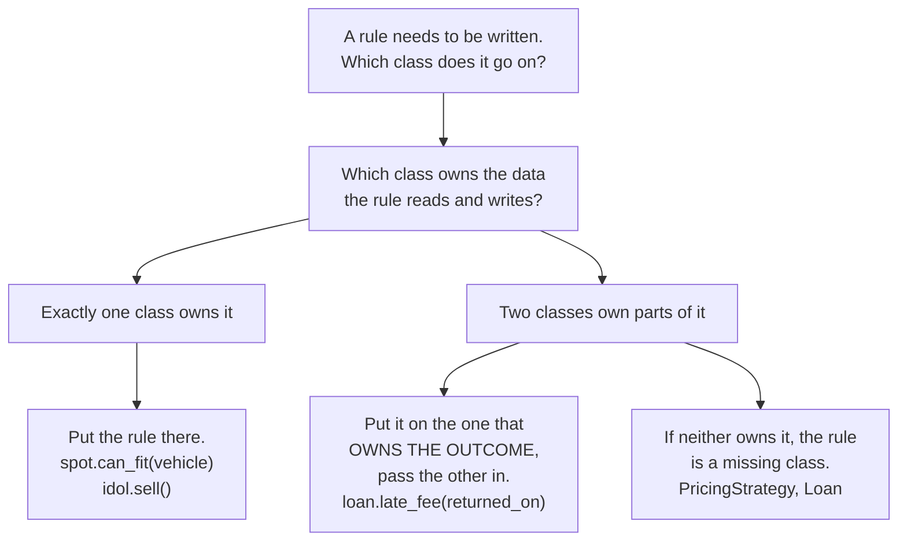

# Day 044 · System design — Classes and objects

**After today you can:** You can turn a paragraph of requirements into classes with the right responsibilities.

**The interviewer asks it as:** *Model a library. What are your classes?*

---

## 1. What this is, and why they ask it

A **class** is a description of a kind of thing: what it knows, and what it can do. An **object** is
one particular thing made from that description, with its own values for everything the class said it
would know. `Book` is a class; the battered copy of *Malgudi Days* with the torn cover, currently
lent to Priya, is an object.

They ask it because every low-level design round begins here and most candidates fumble the first
five minutes. Given a paragraph — "we run a library, members borrow books, there are late fees" — the
job is to name six to ten classes, say what each one is responsible for, and put each rule on the
class that owns the data the rule needs. Candidates who have only used classes as containers for
database rows produce a list of nouns with getters, which scores as nothing. The interviewer is
watching for one thing above all: **does behaviour live next to the data it acts on?** That question
is asked and answered today, and every remaining day of this phase is a refinement of it.

---

## 2. The story

Dhanraj makes idols in a lane behind the market in Pen, and from June onwards it is the only thing he
does.

In the corner of his workshop there is a mould. It is heavy, it is made in two halves that clamp
together, and it is the reason all his idols look the same: the same seated pose, the same height —
a foot and a half — the same tilt of the head. He has had it eleven years. He does not sell it and he
does not lend it. If it cracked in July his season would be finished.

From that one mould he makes something like three hundred idols between June and the end of August.

And here is the thing about the three hundred. They come out of the same shape, but from the moment
each one leaves the mould it starts having a life of its own. Number forty-one dried in the sun and
has a hairline mark down the back that nobody will see once it is painted. Number ninety is the one
his nephew painted, so the eyes are slightly wrong, and it is going cheap. Number two hundred and
twelve was paid for in advance on the fourteenth of July by a family from Alibag who are coming to
collect it on the first day. Number two hundred and eighteen looks exactly like it — same pose, same
paint, same everything — and it is still for sale.

That last pair is the one that matters, and Dhanraj learnt it the hard way, once, years ago. Two
idols can be identical in every way you could measure and still not be the same idol. One has been
paid for and one has not. When the Alibag family arrives, handing them 218 instead of 212 would be
handing them a different thing that happens to look the same, and the books would be wrong for the
rest of the season. So he ties a strip of cloth with a number inked on it round the base of every one, the
day it comes out.

The mould tells you what an idol is. It cannot tell you which one is cracked, which one is sold, or
which one is going to Alibag on Tuesday. Only the idol can tell you that.

---

## 3. The idea in plain English

The mould is the class. Each idol is an object. The numbered strip of cloth is the object's
**identity**, and the hard-won lesson — two identical idols are still two idols — is the difference
between being equal and being the same.

### The class and the instance

A **class** names a kind of thing and says two things about it: what every one of them knows
(**attributes**, sometimes called fields or state) and what every one of them can do (**methods**,
the behaviour).

```python
class Idol:
    def __init__(self, number: int, height_cm: int) -> None:
        self.number = number          # this idol's own value
        self.height_cm = height_cm
        self.is_sold = False
```

`__init__` is the **constructor**: the code that runs when a new object is made, whose job is to
leave the object in a valid state. `self` is the object being made — the particular idol, not the
mould. Every attribute assigned through `self` belongs to that one object.

Making objects is called **instantiation**, and each object is an **instance** of the class:

```python
a = Idol(212, 45)
b = Idol(218, 45)
a.is_sold = True
print(a.is_sold, b.is_sold)      # True False
```

One class, two objects, separate state. That separateness is the whole reason objects exist.

### Where behaviour goes

Now the important part, and the part that decides your score in an interview. Consider the rule
*"an idol can be sold only if it is not already sold."* Two places it could live:

```python
# Wrong: the rule is outside the object that owns the data.
if not idol.is_sold:
    idol.is_sold = True
    ledger.record(idol.number)
```

```python
# Right: the object that owns is_sold owns the rule about is_sold.
class Idol:
    def sell(self) -> None:
        if self.is_sold:
            raise ValueError(f"idol {self.number} is already sold")
        self.is_sold = True
```

In the first version, the rule is written at one call site, and the second call site somewhere else in
the program will forget it. In the second version, there is nowhere to sell an idol that skips the
check. **Behaviour belongs to whoever owns the data it needs.** That is the sentence, and it is worth
saying in exactly those words when the interviewer asks why you put a method where you put it.

A design where classes hold only data and all the rules live in some `IdolService` is called an
**anaemic model** — objects in name only — and it is the most common way candidates lose this round.

### One class, one responsibility

Ask of every class: *what is the one thing it is responsible for?* If the answer needs an "and", you
probably have two classes.

```
Idol        -> its own condition and whether it is sold
Order       -> which idols a customer has reserved, and the total
Customer    -> who they are and how to reach them
Workshop    -> the collection of idols, and finding an unsold one
PriceList   -> what an idol of a given finish costs
```

Five sentences, no "and" in any of them. Compare that with a single `Workshop` class holding three
hundred idols, the orders, the prices and the customers — that is a **god class**, and every future
requirement edits it.

### Finding the classes: nouns and verbs

Given a paragraph of requirements, the mechanical starting point is to underline the nouns and the
verbs.

> *"A **member** may **borrow** up to five **books**. Each **book** has **copies**. If a copy is
> **returned** late, a **fee** is charged at ₹2 a day."*

Nouns become candidate classes: `Member`, `Book`, `Copy`, `Loan`, `Fee`. Verbs become candidate
methods, and — this is the step people skip — each verb tells you *which* class it belongs to.
"Borrow" needs to know the member's current loan count, so it starts on `Member`. "Charge a late fee"
needs the due date and the return date, which live on `Loan`, so it belongs there.

Two warnings. Not every noun is a class — "five" is not, and neither is "day". And the most valuable
class in a design is often a noun that was *not* in the paragraph: `Loan` does not appear in that
sentence at all, but without it there is nowhere to put the due date, and every design that omits it
ends up with a mess of dates on `Copy`.

### Being equal against being the same

Two objects can hold identical values and still be different objects.

```python
a = Idol(212, 45)
b = Idol(212, 45)
print(a == b)        # False by default
print(a is b)        # False
```

`is` asks *are these the same object* — identity, Dhanraj's thread. `==` asks *are these equal* —
and by default Python answers by identity, which is why `a == b` is False even though every value
matches. If your class has a natural notion of equality, you say so:

```python
class Idol:
    def __eq__(self, other: object) -> bool:
        return isinstance(other, Idol) and self.number == other.number

    def __hash__(self) -> int:
        return hash(self.number)
```

Two rules go with this. Define `__hash__` whenever you define `__eq__`, or the object stops working
in sets and as a dictionary key — Python sets `__hash__` to `None` for you as a warning. And **hash
on something that never changes**; hashing on a mutable field means an object placed in a set can
become unfindable in the set it is already in.

### Class-level against instance-level

Some things belong to the mould, not to the idol:

```python
class Idol:
    HEIGHT_CM = 45              # class attribute: shared by all instances
    made_this_season = 0        # a counter that belongs to the class

    def __init__(self, number: int) -> None:
        self.number = number    # instance attribute: this idol's own
        Idol.made_this_season += 1
```

The test is simple: *would every instance have the same value?* If yes, it is class-level.

---

## 4. The picture

The mould and the idols, as memory:

```
   CLASS Idol  (one, shared)
  +--------------------------------------+
  | HEIGHT_CM = 45                       |   attributes every instance shares
  | sell()      <- one copy of the code  |
  | repaint()   <- one copy of the code  |
  +--------------------------------------+
         ^              ^              ^
         |              |              |         every object holds a reference
    +---------+    +---------+    +---------+    back to its class; the methods
    | number  |    | number  |    | number  |    are NOT copied 300 times
    |   = 212 |    |   = 218 |    |   =  41 |
    | is_sold |    | is_sold |    | is_sold |
    |  = True |    | = False |    | = False |
    +---------+    +---------+    +---------+
      object a       object b       object c
```

**What to notice:** the code exists once and the state exists three hundred times. That is exactly
why `Idol.HEIGHT_CM` is not stored three hundred times, and why `self` has to be passed to every
method — the method needs telling which idol it is acting on.

Where behaviour goes, drawn as the decision it really is:



**What to notice:** the third branch is the one that produces good designs. When a rule fits nowhere,
the answer is usually a class you have not thought of yet, not a service to dump it in.

---

## 5. How it actually works

### What Python actually does with `self`

When you write `idol.sell()`, Python looks up `sell` on the object, does not find it, looks it up on
the class, finds one function, and calls it with the object as the first argument. `idol.sell()` is
literally `Idol.sell(idol)`. That is the whole mechanism, and knowing it kills two common confusions:
why `self` is written out explicitly in Python and not in Java, and why the method code lives once
rather than once per object.

Attributes work by dictionary lookup: each object carries a `__dict__` mapping names to values, and
attribute access checks the object's dictionary first, then the class's. That is why an instance
attribute silently shadows a class attribute of the same name — a real source of bugs when a counter
is incremented as `self.count += 1` instead of `Idol.count += 1`.

### `@dataclass`, and when to reach for it

Writing a constructor that just assigns five arguments to five attributes is noise. Python's
`dataclass` writes it, plus a readable `__repr__`, plus `__eq__` if you want it:

```python
from dataclasses import dataclass, field

@dataclass
class Idol:
    number: int
    height_cm: int = 45
    is_sold: bool = False

    def sell(self) -> None:
        if self.is_sold:
            raise ValueError(f"idol {self.number} is already sold")
        self.is_sold = True
```

You still add the methods yourself, which is the point — a dataclass removes the boilerplate, not the
behaviour. `@dataclass(frozen=True)` makes instances immutable and hashable, which is the right
choice for value-like things: a `Money`, a `Coordinate`, a `DateRange`.

### The designs you use every day

- **`datetime.date`** is a frozen value object. `date(2026, 3, 14) == date(2026, 3, 14)` is True
  because the class defines equality by value, and it is hashable because it never changes. Compare
  that with a mutable `Order`, where equality by value would be wrong.
- **Django models** — `class Order(models.Model)` — are objects whose attributes map to table
  columns, and this is precisely where the anaemic-model habit comes from. The framework encourages
  fields; good Django code still puts `order.cancel()` on the model rather than in a view.
- **Stripe's SDK** gives you `PaymentIntent` objects with `intent.confirm()` and `intent.cancel()`.
  The alternative API — `stripe.confirm(intent_id)` — would be the same information arranged so that
  nothing owns the rules.
- **`collections.namedtuple` and `NamedTuple`** are classes for things that are only data, with no
  behaviour and no identity worth tracking. Reaching for one is a deliberate statement that this
  thing does not own any rules.

### The order to build a model in, under time pressure

1. Underline the nouns; write them down as candidate classes.
2. Strike out the ones that are values rather than things — quantities, dates, names.
3. Add the missing nouns — the ones the requirements imply but never say. `Loan`, `Ticket`,
   `Reservation`, `Session`. These are usually the relationship between two other classes and they
   are where the interesting rules live.
4. For each class, write the one sentence saying what it is responsible for. If you need "and", split
   it.
5. Take each verb from the requirements and place it on the class that owns the data it needs.
6. Only now, look for the rules that fit nowhere. Each one is either a missing class or an interface.

---

## 6. The numbers

### What an object costs

```
a plain Python object with 3 attributes:
    object header               ~56 bytes
    instance __dict__           ~104 bytes (empty dict, grows in steps)
    3 references x 8 bytes      ~24 bytes
                                --------
                                ~184 bytes, before the values themselves

the same class with __slots__ = ("number", "height_cm", "is_sold"):
    no per-instance dict
                                ~64 bytes  -- roughly a third

300 idols:      184 x 300      = ~55 KB       -- irrelevant
10 million:     184 x 10^7     = ~1.8 GB      -- suddenly the design decision
                 64 x 10^7     = ~640 MB      -- with __slots__
```

The rule that comes out of this: **`__slots__` is a decision you make at ten million objects, not at
three hundred.** Say that number if an interviewer asks about object overhead; guessing "objects are
expensive" without a threshold is worth nothing.

### Method call cost

```
a Python attribute lookup + method call:    ~50-80 nanoseconds
a direct function call:                     ~40-60 nanoseconds
```

The difference is real and it is almost never the thing that matters. A page that is slow because of
an N+1 query is paying 100 milliseconds — a million method calls is 60 milliseconds. Design for
clarity; optimise the round trips.

### How many classes a design should have

```
a 45-minute low-level design round:      6-10 classes
    fewer than 5   -> under-modelled; the interviewer has nothing to probe
    more than 15   -> you will not code any of them

a real service module:                   ~5-15 classes per bounded area
a class longer than ~200 lines           -> almost always two classes
a method longer than ~20 lines           -> almost always two methods
```

### The cost of the anaemic model, counted

Take the library. The rule "a member may not borrow more than five books" written at each call site:

```
borrow from the counter UI          1 place
borrow from the self-service kiosk  1 place
bulk borrow for a school group      1 place
the import script for old records   1 place
                                  ----
                                    4 copies of one rule

a new requirement -- staff may borrow ten -- edits 4 places, and the one
somebody forgets is the one that ships.

the same rule on Member.borrow():   1 place. Always 1 place.
```

---

## 7. The trade-offs

### A class against a dictionary

A dictionary is faster to write and needs no definition. It also has no validation, no autocompletion,
no place to put behaviour, and a typo in a key is a silent `None` rather than an error. *I would not
use a class for a bag of values that crosses a boundary once and is never reasoned about* — a parsed
JSON payload on its way to a queue is fine as a dict. *I would use a class the moment a rule attaches
to the data*, because that is the moment there is somewhere for the rule to live.

### A mutable object against a frozen value

Frozen objects are safe to share, safe to hash, and impossible to corrupt from a distance. They also
mean every change allocates a new object. *I would freeze anything that represents a value* — money,
a date range, a coordinate, a size — *and leave mutable anything that represents a thing with a
life*: an order, a session, a booking. The test is whether the identity matters. Two 45-centimetre
heights are interchangeable; two idols are not.

### Defining `__eq__` against leaving it alone

Value equality makes tests readable and makes objects usable as dictionary keys. It also makes it
easy to write a subtle bug: two objects that compare equal but represent different real things.
*I would not define equality on an entity that has an identity* — two `Idol` objects with the same
number are the same idol, so equality on the number is right; equality on "same pose and same paint"
would be catastrophic. And if you define `__eq__`, define `__hash__`, and hash only on fields that
never change.

### Rich model against speed of delivery

Every class you extract costs time now and saves time later, and "later" is not guaranteed to arrive.
*I would not extract a class for a rule that exists in exactly one place and has never changed.* The
signal to extract is the second call site, or the first time you catch yourself writing the same
`if` in two files.

### The honest sentence

> A class earns its existence by giving a rule somewhere to live. If you cannot name a rule it owns,
> you have written a dictionary with extra steps — and the interviewer will find it by asking where
> the validation happens.

---

## 8. In the interview

### How it gets asked

- *"Model a library. What are your classes?"* — the canonical warm-up, and the first ten minutes of a
  full LLD round.
- *"What's the difference between a class and an object?"* — sounds like a definition question, is
  actually checking whether you can talk about state versus code with an example.
- *"Where would you put this rule?"* — the real question, asked about a specific requirement halfway
  through a design. This is the one that is scored.
- *"Why is that a class and not a dictionary?"* — the pushback on over-modelling, and the answer is
  always about a rule that needs a home.

### What to say out loud, in the first ninety seconds

1. **Do nouns and verbs visibly.** *"Let me pull the nouns out first: member, book, copy, loan, fee.
   Then the verbs: borrow, return, reserve, charge."*
2. **Distinguish the thing from the kind of thing.** *"`Book` is the title — 'Malgudi Days'. `Copy`
   is the physical object on the shelf with its own barcode and its own condition. Members borrow
   copies, not books, and separating those two is what makes reservations possible later."*
3. **Add the noun that was not in the paragraph.** *"I want a `Loan` class even though the
   requirements never say the word. It owns which copy, which member, borrowed on, due on — and
   without it the dates end up scattered across `Copy`, which is where late-fee bugs come from."*
4. **Give each class its one sentence.** *"`Member` owns who they are and their borrowing limit.
   `Copy` owns its condition and whether it's on loan. `Loan` owns the dates and computes the fee.
   `Catalogue` owns finding a copy of a title."*
5. **Place one rule out loud, with the reason.** *"The five-book limit goes on `Member.borrow()`,
   because `Member` is the only thing that knows how many loans it already has. If I put it in a
   service, the kiosk code will forget it."*

### The follow-ups

**"Why is `Copy` a separate class from `Book`? Isn't that over-modelling?"**
It would be over-modelling if a library owned one of each title, but it does not, and the distinction
carries real rules. `Book` owns the things that are true of the title — the ISBN, the author, the
publication year — and there is exactly one `Book` object for *Malgudi Days* however many copies sit
on the shelf. `Copy` owns the things that are true of one physical object: the barcode, the shelf it
lives on, the coffee stain, and whether it is currently out. Merging them forces you to duplicate the
author's name once per copy, which is the update anomaly from
[day 029](../day-029-read-write-pointer/README.md) arriving in object form — change the author's
spelling and you must change it in six places or the copies disagree. It also makes the two most
common queries awkward: "how many copies of this title are available" becomes a scan for duplicated
titles rather than a count on one object. So the test I'd apply is the one I'd apply to any proposed
split: is there a rule or a fact that belongs to one and not the other? Here there are several in each
direction, so they are two classes.

**"Where does the late fee calculation go, and why not on `Member`?"**
On `Loan`, because `Loan` is the only object that holds both dates. The fee is a function of the due
date and the return date, and both of those belong to one particular borrowing event — not to the
member, who has had forty of them, and not to the copy, which has been borrowed by strangers for
years. Putting it on `Member` would mean `Member` reaching into a loan's dates to compute something
about the loan, which is the shape people call feature envy: a method more interested in another
object's data than its own. The signature I'd write is
`loan.late_fee(returned_on: date) -> Money`. And then I'd flag the seam: the *rate* — ₹2 a day, free
for staff, capped at the book's price — is the part most likely to change, so I would not hard-code
it inside that method. I'd pass a fee policy in, which is the same interface argument as the pricing
strategy from [day 043](../day-043-binary-search-without-bugs/README.md), and I'd only actually do it
if I can name the second policy — which here I can, because staff and students already differ.

**"Two `Copy` objects with the same barcode — are they equal?"**
They should be, and this is worth being precise about because it decides whether the model works in a
set. A copy is an entity: it has an identity that persists even as everything else about it changes.
The barcode is that identity, so `__eq__` compares barcodes and nothing else — not the condition, not
the shelf, not whether it is on loan, because a copy that gets damaged is still the same copy. And
because I define `__eq__`, I define `__hash__` on the same field, or the object silently becomes
unusable as a dictionary key. The critical rule there is that the hash field must never change: if I
hashed on the shelf location, moving a copy to another shelf would make it unfindable inside a set it
was already in, which is a genuinely horrible bug to diagnose. That is also why value objects like
`Money` are frozen — immutability makes the hash safe by construction. The contrast worth stating is
that `Loan` probably should *not* define equality at all: two loans of the same copy by the same
member in different months are different events, and default identity comparison is exactly right.

### A model answer

> "Let me take the nouns and verbs out of the requirements first, then say what each class is
> responsible for, then place the rules.
>
> Nouns: member, book, copy, loan, fee. Verbs: borrow, return, reserve, charge.
>
> The first decision is that `Book` and `Copy` are different classes. `Book` is the title — ISBN,
> author, year — and there's one of them per title. `Copy` is a physical object with a barcode, a
> shelf and a condition, and there are six of them for a popular title. Keeping them separate means
> the author's name is stored once, and 'how many are available' is a count rather than a scan.
>
> The second decision is that I'm adding `Loan`, which isn't in the requirements at all. It owns the
> member, the copy, the borrowed date and the due date. Without it those dates end up on `Copy`, and
> then a copy can only remember its current loan, so history is gone and late fees have nowhere to
> live.
>
> One sentence each: `Member` owns identity and the borrowing limit. `Book` owns bibliographic facts.
> `Copy` owns its physical condition and availability. `Loan` owns the dates and the fee calculation.
> `Catalogue` owns finding an available copy of a title. `FeePolicy` is an interface, because student
> and staff rates already differ — that's the second implementation that justifies it.
>
> Now the rules, each placed with a reason. The five-book limit goes on `Member.borrow()`, because
> `Member` is the only object that knows its current loan count — put it in a service and the kiosk
> code will forget it. Marking a copy unavailable goes on `Copy.check_out()`, so there's no way to
> lend a copy that's already out. The late fee goes on `Loan.late_fee(returned_on)`, because `Loan`
> holds both dates; it takes a `FeePolicy` rather than hard-coding ₹2 a day.
>
> On equality: `Copy` compares by barcode and hashes on it, because that's an identity that never
> changes. `Money` I'd make a frozen dataclass so it's safe to share and hash. `Loan` gets no `__eq__`
> at all — two borrowings of the same copy by the same member are different events, and identity
> comparison is right.
>
> That's six classes and one interface. If you want, the next thing I'd add is reservations, which is
> another missing noun and would sit alongside `Loan`."

---

## 9. Recall card

- **Class = the mould, object = one thing from it.** One copy of the code, one set of state per
  object; `idol.sell()` is literally `Idol.sell(idol)`, which is why `self` exists.
- **Behaviour lives with the data it needs.** `member.borrow()`, `loan.late_fee(date)` — never a rule
  written at four call sites. Fields plus a `Service` class is the **anaemic model**, and it is the
  commonest way to lose this round.
- **Nouns → classes, verbs → methods, then add the noun that was not in the paragraph** — `Loan`,
  `Ticket`, `Reservation`. That missing class is where the interesting rules live.
- **One responsibility, said in one sentence with no "and".** If the sentence needs an "and", it is
  two classes; a 200-line class or a 20-line method almost always is.
- **`is` is identity, `==` is equality.** Define `__eq__` on an entity's unchanging identity, always
  define `__hash__` with it, never hash a mutable field. Freeze value objects (`Money`, `date`);
  leave entities mutable.
