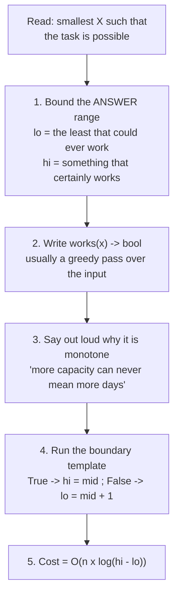

# Day 046 · DSA — Binary search on the answer

**After today you can:** You can search a range of possible answers when the array itself is not what is sorted.

**The interviewer asks it as:** *Find the smallest capacity that lets you ship all packages within d days.*

---

## 1. What this is, and why they ask it

Until today, binary search has run over an array. Today it runs over the **answers**. You are asked
for the smallest value of something — a capacity, a speed, a size, a number of days — that makes a
task possible. You do not search the input. You take the range of every value the answer could
possibly be, ask *"does this value work?"* about the middle of that range, and throw away half the
candidates.

This is the most valuable idea in the phase and the one that most changes what you can solve. The
problems do not look like search problems at all — they read as optimisation, and candidates reach for
greedy strategies or dynamic programming and get lost. The tell is a specific sentence shape: *the
minimum X such that Y is possible*, or *the maximum X such that Y still holds*. Once you see that
shape, the recipe is fixed and short. LeetCode 875, 1011, 410 and 1482 are all the same problem in
different costumes, and at least one of them shows up in interviews at every large product company.

---

## 2. The story

Sundar has an onion load to shift from the mandi at Yeshwanthpur to a shop in Malleshwaram, and the
shop pulls its shutters down at four.

The load is standing in the yard as twelve stacks, one behind the other, and the man who stacked them
that morning did it in the order the lorry unloaded. Sundar cannot pull from the middle — the front
stack comes first, then the one behind it, and so on down the line. The stacks are not the same size:
some are eight sacks, one is nearly thirty.

It is half past twelve. Each round trip to Malleshwaram and back takes about fifty minutes in that
traffic. So he has four trips in him, at the outside. Four.

The question is which tempo to hire. There is a row of them at the stand and they take different
loads — the small ones about six hundred kilos, the biggest about two thousand. The bigger the tempo,
the more it costs him for the afternoon, and he is not a man who pays for capacity he does not use.

So he stands there and works it out, and the way he works it out is the whole point.

He does not walk the row of tempos asking each driver. He picks a size in the middle — say twelve
hundred — and then he does one thing: he walks down his twelve stacks in order and counts. First
stack, second, third — that is about eleven hundred, adding the fourth would go over, so that is trip
one. Then he starts again from the fourth. He gets to the end of the row and finds he has used five
trips. Five is too many. So twelve hundred is too small, and — this is the part he is sure of without
checking — so is every tempo smaller than twelve hundred. All of those are gone.

Now the middle of what is left, between twelve hundred and two thousand. Sixteen hundred. He walks
the stacks again, counting. Four trips. It works. So sixteen hundred is enough, and so is anything
bigger — but he does not want anything bigger, he wants the smallest that works, so the big ones are
gone too.

Between twelve hundred and sixteen hundred, then. Fourteen hundred. Walk, count: four trips. Works.
Keep looking below it.

Four or five walks down the row, and he knows the exact smallest size that gets the onions there by
four. He hires that one.

The walking is the expensive part — the row is long and he is counting in his head. That is exactly
why he does not test every tempo at the stand.

---

## 3. The idea in plain English

Sundar's twelve stacks are the array, and it is **not sorted and never will be**. What is sorted — in
the only sense binary search needs — is the list of tempo sizes, and the yes-or-no answer attached to
each one.

### The shape to recognise

Every problem in this family reads the same way:

> *Find the **smallest** X such that some task **is possible**.*
>
> *Find the **largest** X such that some condition **still holds**.*

"The smallest tempo that finishes in four trips." "The slowest eating speed that finishes the bananas
in h hours." "The smallest ship capacity that clears the packages in d days." "The largest minimum
distance between cows." Same problem, four costumes.

### The three things you write down

**One: the range of possible answers.** Not the array — the answers. For Sundar:

```
smallest possible tempo  = the biggest single stack   (anything less cannot lift it at all)
largest tempo worth it   = all twelve stacks at once  (one trip; nothing bigger helps)
```

In code, `lo = max(weights)` and `hi = sum(weights)`. Getting these two wrong is the commonest bug in
the whole family, and §7 shows both directions of it.

**Two: the yes-or-no question**, written as a function that takes a candidate answer and returns
`True` or `False`.

```python
def works(capacity: int) -> bool:
    """Can the stacks be shifted in at most 4 trips with this capacity?"""
```

This is Sundar's walk down the row. It is a **greedy simulation**: load as much as fits, then start a
new trip. It costs one full pass over the input.

**Three: check that the question is monotone.** Say it out loud, in words: *if a tempo of 1400 works,
does 1500 also work?* Obviously yes — more room can never mean more trips. So the answers look like:

```
capacity:  700   900  1100  1300  1400  1500  1700  2000
works?      no    no    no    no   YES   YES   YES   YES
                                   ^
                        the boundary: the smallest capacity that works
```

That row is monotone, so it is exactly [day 043](../day-043-binary-search-without-bugs/README.md)'s
boundary template — and the answer is the first `True`.

**Monotonicity is the precondition, and it replaces sortedness.** If a bigger capacity could somehow
be worse, none of this works. Interviewers ask you to justify it, and the justification is one
sentence about the real world, never a proof.

### The feasibility check, in detail

For the shipping version — the exact wording in the hub — the check is:

```python
def days_needed(weights: list[int], capacity: int) -> int:
    days, load = 1, 0
    for w in weights:
        if load + w > capacity:      # this one does not fit; start a new day
            days += 1
            load = 0
        load += w
    return days
```

Start on day one with an empty ship. Walk the packages in order. If the next one does not fit, that
day ends and a new one starts. Note `days` starts at 1, not 0 — the first day exists before anything
is loaded, and starting at 0 gives an answer one too small on every input.

Then the question is simply:

```python
def works(capacity: int) -> bool:
    return days_needed(weights, capacity) <= d
```

### Putting it together

```python
lo, hi = max(weights), sum(weights)
while lo < hi:
    mid = (lo + hi) // 2
    if works(mid):
        hi = mid            # mid might be the smallest that works: keep it
    else:
        lo = mid + 1        # mid is too small, and so is everything below it
return lo
```

Six lines, and they are the same six lines as
[day 043](../day-043-binary-search-without-bugs/README.md). Only the question changed — from *"is
`nums[i]` at least the target?"* to *"can it be done with capacity `mid`?"*. That is the entire
lesson, and it is why yesterday's template was worth learning as a template rather than as a
function.

### Why no `-1` case exists

`hi = sum(weights)` always works — one day, everything on board — so at least one candidate in the
range is `True`. There is always an answer, so unlike an array search there is no "not found". If you
find yourself writing a not-found branch here, your `hi` is too small.

### For a maximum instead of a minimum

Some problems ask for the *largest* X that still works, and the monotone row runs the other way:
`YES, YES, YES, no, no`. Two options, and the second is better:

- Mirror the template: on `True`, `lo = mid`; on `False`, `hi = mid - 1`; and use
  `mid = (lo + hi + 1) // 2` to round *up*, or it hangs when `lo` and `hi` are adjacent.
- Or flip the question — search for the first `False` and subtract one — and keep the template
  untouched.

Prefer the second. One template that you never modify is worth more than two you have to remember the
difference between. If you do write the mirrored version, the ceiling midpoint is not optional, and
§7 shows why.

---

## 4. The picture

The two things being searched, side by side:

```
 THE INPUT -- not sorted, never searched:
   stack     0    1    2    3    4    5    6    7    8    9   10   11
   weight  [ 8 , 30 , 12 ,  5 , 22 , 17 ,  9 , 14 , 26 ,  3 , 19 , 11 ]

 THE ANSWER RANGE -- this is what binary search runs over:
   lo = max(weights) = 30          hi = sum(weights) = 176

   capacity   30 ......... 60 ......... 100 ......... 140 ....... 176
   works(c)?  no           no           YES           YES         YES
                                        ^
                              the boundary. Everything left is no,
                              everything right is yes.
```

**What to notice:** the array is never sorted and never needs to be. The monotone thing is the row of
answers to `works(c)`, and that row exists whether or not anyone writes it down.

One evaluation of `works(60)`, drawn as the greedy walk:

```
 capacity 60, weights [8, 30, 12, 5, 22, 17, 9, 14, 26, 3, 19, 11]

 day 1:  8 + 30 + 12 + 5   = 55     next is 22 -> 77 > 60, so day 1 ends
 day 2:  22 + 17 + 9      = 48      next is 14 -> 62 > 60, so day 2 ends
 day 3:  14 + 26 + 3      = 43      next is 19 -> 62 > 60, so day 3 ends
 day 4:  19 + 11          = 30      the row is finished
                                    -> 4 days
 if d = 3, works(60) is False. If d = 5, works(60) is True.
```

**What to notice:** one call to `works` costs a full pass over the array. That is why the total cost
is `O(n × log(range))` and not `O(log(range))` — the comparison is not free any more, and saying so
is worth marks.

The whole method as a flow:



**What to notice:** step three is the one candidates skip, and it is the one that is wrong most often.
If the question is not monotone, everything below it is nonsense.

---

## 5. The code, built step by step

### The feasibility check, first

```python
def days_needed(weights: list[int], capacity: int) -> int:
    days, load = 1, 0
    for w in weights:
        if load + w > capacity:
            days, load = days + 1, 0
        load += w
    return days
```

Write this before the search, always. It is the part with the real logic in it, and it is the part
you can test on its own: `days_needed([1,2,3,4,5], 5)` should be 4, and `days_needed([1,2,3,4,5], 15)`
should be 1.

### The bounds

```python
lo, hi = max(weights), sum(weights)
```

`max` because a package heavier than the ship can never be loaded at all, so no smaller capacity is
even meaningful. `sum` because everything in one day certainly works, so the answer cannot be larger.
Both are `O(n)` and both are computed once, outside the loop.

### The search

```python
while lo < hi:
    mid = (lo + hi) // 2
    if days_needed(weights, mid) <= d:
        hi = mid
    else:
        lo = mid + 1
return lo
```

Unchanged template. `days_needed(weights, mid) <= d` is the question; everything else is
[day 043](../day-043-binary-search-without-bugs/README.md).

### The complete solution

```python
def ship_within_days(weights: list[int], d: int) -> int:
    """LeetCode 1011. Smallest capacity that ships all packages, in order, within d days.

    Searches the ANSWER range [max(weights), sum(weights)], not the array.
    works(c) is monotone: more capacity can never require more days.
    """

    def days_needed(capacity: int) -> int:
        days, load = 1, 0                      # day 1 exists before anything is loaded
        for w in weights:
            if load + w > capacity:            # does not fit today; start a new day
                days, load = days + 1, 0
            load += w
        return days

    lo, hi = max(weights), sum(weights)        # least meaningful / certainly enough
    while lo < hi:
        mid = (lo + hi) // 2
        if days_needed(mid) <= d:
            hi = mid                           # mid works; it might be the smallest
        else:
            lo = mid + 1                       # mid is too small, and so is everything below
    return lo


def min_eating_speed(piles: list[int], h: int) -> int:
    """LeetCode 875. Koko eats one pile at a time at k bananas/hour; smallest k finishing in h.

    Same recipe. Note the ceiling division: a part-eaten pile still costs a whole hour.
    """
    def hours_needed(k: int) -> int:
        return sum((pile + k - 1) // k for pile in piles)     # ceiling of pile / k

    lo, hi = 1, max(piles)                     # 1 is the slowest sensible; max clears any pile in 1h
    while lo < hi:
        mid = (lo + hi) // 2
        if hours_needed(mid) <= h:
            hi = mid
        else:
            lo = mid + 1
    return lo


def split_array_max_sum(nums: list[int], k: int) -> int:
    """LeetCode 410. Split nums into k contiguous parts, minimising the largest part sum.

    Identical to shipping: 'capacity' is the largest allowed part sum, 'days' is the part count.
    """
    def parts_needed(limit: int) -> int:
        parts, total = 1, 0
        for x in nums:
            if total + x > limit:
                parts, total = parts + 1, 0
            total += x
        return parts

    lo, hi = max(nums), sum(nums)
    while lo < hi:
        mid = (lo + hi) // 2
        if parts_needed(mid) <= k:
            hi = mid
        else:
            lo = mid + 1
    return lo


if __name__ == "__main__":
    print(ship_within_days([1, 2, 3, 4, 5, 6, 7, 8, 9, 10], 5))     # 15
    print(ship_within_days([3, 2, 2, 4, 1, 4], 3))                  # 6
    print(ship_within_days([1, 2, 3, 1, 1], 4))                     # 5
    print(ship_within_days([500], 1))                               # 500  <- one package
    print(ship_within_days([1, 1, 1, 1], 4))                        # 1    <- one per day

    print(min_eating_speed([3, 6, 7, 11], 8))                       # 4
    print(min_eating_speed([30, 11, 23, 4, 20], 5))                 # 30   <- h == len(piles)
    print(min_eating_speed([30, 11, 23, 4, 20], 6))                 # 23

    print(split_array_max_sum([7, 2, 5, 10, 8], 2))                 # 18
    print(split_array_max_sum([1, 2, 3, 4, 5], 2))                  # 9
```

Three problems, one recipe, and the search loop is character-for-character identical in all three.
Say that out loud in an interview — it is the sentence that shows you have the pattern, not three
memorised solutions.

### The maximisation form, if you must write it

```python
def largest_that_works(lo: int, hi: int, works) -> int:
    """Largest x in [lo, hi] with works(x) True, assuming works(lo) is True."""
    while lo < hi:
        mid = (lo + hi + 1) // 2       # ceiling: rounds UP, or this hangs
        if works(mid):
            lo = mid                   # mid works; it might be the largest
        else:
            hi = mid - 1
    return lo
```

The `+ 1` in the midpoint is mandatory. Without it, when `hi == lo + 1` the midpoint is `lo`, and
`lo = mid` sets `lo` to itself — an infinite loop, silently. This is the one place in the phase where
a ceiling midpoint is required, and it is the reason the recommended route is to search for the first
`False` instead and subtract one.

---

## 6. What it costs

### Time

Two things multiply, and both have to be named:

```
number of binary search passes  =  log2(hi - lo)
cost of one feasibility check   =  O(n)          -- one pass over the array
                                   -----------------
total                           =  O(n x log(hi - lo))
```

That is a different shape from every earlier day, where a comparison was free. Put numbers on it:

```
shipping, n = 50,000 packages, weights up to 500:
    lo = 500, hi = 50,000 x 500 = 25,000,000
    log2(25,000,000 - 500) ~ 25 passes
    25 passes x 50,000 = 1,250,000 operations

by comparison, trying every capacity from 500 upwards:
    up to 25,000,000 candidates x 50,000 = 1.25 x 10^12 operations
```

A million operations against a trillion. And note where the logarithm sits: it is over the **range of
answers**, not over the array. Doubling the array doubles the work; doubling the range of answers adds
one pass.

### Space

```
lo, hi, mid, and the check's own two counters   -> O(1) extra space
```

The feasibility check must be careful here. If your `works` builds a list of the days, that is `O(n)`
space *per call*; the counting version above allocates nothing.

### Why the bounds matter for cost as well as correctness

```
lo = 1,     hi = 10^18 (a lazy upper bound)   -> 60 passes
lo = max,   hi = sum   (the tight bounds)     -> 25 passes
```

Both are correct. The tight bounds are less than half the work, and — more importantly — the tight
bounds are what show the interviewer you thought about the problem rather than pasting a template.

### The number to have ready

> One feasibility check is a full pass, `O(n)`. The search does `log₂` of the answer *range* of them.
> So `O(n log(range))` — fifty thousand packages over a range of twenty-five million is about
> twenty-five passes, a bit over a million operations, against a trillion if you tried every capacity.

---

## 7. The traps

### The near-miss: bounds that are too tight at the bottom

```python
lo, hi = 1, sum(weights)          # <-- 1, not max(weights)
```

This is not wrong — it is merely wasteful — because `works(c)` is `False` for every `c` below
`max(weights)` and the search discards them anyway. The genuinely broken version is the other
direction:

```python
lo, hi = max(weights), max(weights) * len(weights) // 2      # <-- hi too small
print(ship_within_days([1, 2, 3, 4, 5, 6, 7, 8, 9, 10], 1))
```

```
50
```

The correct answer is 55 — one day means the whole load in one go. Every candidate in the range
answered False, so `lo` marched to the top of a range that does not contain the answer, and the
function returned it with total confidence. **If `works(hi)` is
False, the answer is outside your range and the return value is meaningless.** A cheap habit: assert
`works(hi)` before the loop while developing.

### The near-miss: `days` starting at zero

```python
def days_needed(weights, capacity):
    days, load = 0, 0                # <-- should be 1
    for w in weights:
        if load + w > capacity:
            days, load = days + 1, 0
        load += w
    return days

print(days_needed([1, 2, 3, 4, 5], 5))     # 3   should be 4
```

```
3
```

The first day exists before any package is loaded, so the counter starts at one and increments only
when a *new* day begins. Starting at zero undercounts by exactly one on every input, which makes
`works` too optimistic, which makes the final answer too small — and it is too small by an amount that
depends on the input, so it passes some tests.

### The real error: division by zero in the eating-speed check

```python
piles = [3, 6, 7, 11]
lo = 0                                       # <-- speed 0 is not a sensible candidate
print(sum((p + lo - 1) // lo for p in piles))
```

```
Traceback (most recent call last):
  File "day46.py", line 3, in <module>
    print(sum((p + lo - 1) // lo for p in piles))
              ~~~~~~~~~~~~~^^~~~
ZeroDivisionError: integer division or modulo by zero
```

`lo` must be 1 for a rate, not 0. The general rule: **the lower bound is the smallest value that is
meaningful, not the smallest number.** A capacity of zero carries nothing; a speed of zero never
finishes; a group size of zero is not a group.

### The near-miss: a question that is not monotone

```python
# "Find the smallest k such that exactly k groups can be formed."
```

"Exactly" is the warning word. If `k = 5` works and `k = 6` does not and `k = 7` does, the row of
answers is not monotone and binary search will land somewhere arbitrary — with no error. Before
writing a line, say the sentence: *if x works, does every value above x also work?* If you cannot
answer yes with a reason from the problem itself, this is not the tool.

The same warning applies to costs that are not smooth. "The smallest number of workers such that the
total wage bill is under ₹X" is not monotone if adding a worker can reduce overtime and lower the
bill.

### The real error: the maximisation form without the ceiling midpoint

```python
lo, hi = 1, 10
while lo < hi:
    mid = (lo + hi) // 2          # <-- floor, in a version that does lo = mid
    if mid <= 7:
        lo = mid
    else:
        hi = mid - 1
```

No exception, no output, no end. When `lo = 7` and `hi = 8`, `mid` is 7, the condition holds,
`lo = 7` — unchanged — and the loop runs forever. The fix is `mid = (lo + hi + 1) // 2`. The better
fix is not to write this form at all: search for the first `False` with the standard template and
subtract one.

---

## 8. In the interview

### How it gets asked

- *"Find the least weight capacity of a ship that can carry all packages within d days, in order."* —
  LeetCode 1011, the exact hub phrasing.
- *"Koko eats bananas at k per hour, one pile at a time. What's the minimum k to finish in h hours?"* —
  LeetCode 875, the friendliest introduction to the pattern.
- *"Split the array into k contiguous subarrays, minimising the largest subarray sum."* — LeetCode
  410, which reads like dynamic programming and is not.
- *"Place c cows in n stalls so the minimum distance between any two is as large as possible."* — the
  maximisation form, and a classic.

### What to say out loud, in the first ninety seconds

1. **Name the shape before anything.** *"This is 'the smallest X such that something is possible', so
   I'm going to binary search on the answer rather than on the array. The array itself is never
   sorted and never needs to be."*
2. **Bound the answer range, with reasons.** *"The capacity can't be less than the heaviest single
   package, because that one would never load. And it never needs to exceed the sum of everything,
   because that's one day. So the range is max to sum."*
3. **Write the feasibility check first, out loud.** *"`days_needed(capacity)` walks the packages in
   order, adding to the current day until the next one doesn't fit, then starting a new day. It starts
   the counter at one, because day one exists before anything is loaded."*
4. **Justify monotonicity in one sentence.** *"More capacity can never require more days — every
   packing that fits in a smaller ship also fits in a bigger one. So the yes-answers form one
   unbroken run at the top, and I'm looking for where it starts."*
5. **Give the two-part cost.** *"One check is O(n). The search does log of the *answer range* of them,
   so O(n log(sum − max)). At fifty thousand packages that's about twenty-five passes."*

### The follow-ups

**"How do you know your feasibility check is monotone? Prove it."**
For this problem it comes straight from the greedy packing, and I'd argue it rather than assert it.
Take any capacity c that finishes in D days, and take c' bigger than c. Run the same greedy loading
with c'. At every step the ship has at least as much room as it did with c, so every package that was
loaded on day one with c is still loaded on day one with c', and possibly more. By induction, after
each day the c' run has loaded at least as many packages as the c run, so it cannot finish later. So
`days_needed` is non-increasing in capacity, which means `days_needed(c) <= d` is monotone in exactly
the direction I need. The reason I care about stating this is that the whole method is invalid
without it, and the family has cousins where it fails — anything with the word "exactly" in it, and
anything where a cost can go down as the resource goes up. So I check the property, in words, before I
write the loop, every time.

**"Your bounds — could you use 1 and 10¹⁸ instead and save yourself the thought?"**
It would still be correct here, and I'd say why: every capacity below `max(weights)` returns False
and every capacity above `sum(weights)` returns True, so the boundary is in the same place whatever
wrapper I put around it. What it costs is passes. Log base two of 10¹⁸ is about sixty, against about
twenty-five for the tight bounds, so I'd more than double the runtime for no reason — and each pass is
a full O(n) walk, so that is not free. There is also a correctness risk in the general case: a lazy
upper bound can overflow in a fixed-width language, and a lazy *lower* bound can hit an invalid value
— a rate of zero divides by zero, a group size of zero isn't a group. So my rule is that `lo` is the
smallest value that is *meaningful*, and `hi` is a value I can point at and say "this certainly
works". If I cannot name why `hi` works, I do not have an upper bound, I have a guess.

**"Now the packages can be shipped in any order, not just the given order. Same approach?"**
No, and that is a much harder problem, so I would not pretend otherwise. With the order fixed, the
greedy check is exact — there is only one way to pack a prefix, so "fill until it doesn't fit" is
optimal. Remove the ordering and the check becomes "can these n weights be partitioned into d groups
each summing to at most c", which is bin packing, and that is NP-hard. So the binary search skeleton
survives — I'd still search the same answer range and still look for the boundary — but the
feasibility check stops being exact, and a binary search over an approximate check gives an
approximate answer. What I'd actually propose depends on the size: for small n, exact via a
subset-based dynamic programme over 2ⁿ states, which is fine up to about twenty packages. For large
n, first-fit-decreasing as a heuristic, and I'd say plainly that the result is a good answer rather
than the optimum. The important thing is naming that the *check* is where the difficulty moved, since
that is the part of the pattern that carries the problem.

### A model answer

> "The phrasing is 'the smallest capacity such that it's possible in d days', and that shape means
> binary search on the answer. The array of weights is not sorted and doesn't need to be — what's
> monotone is the yes-or-no answer attached to each candidate capacity.
>
> So three things before I write the loop.
>
> The range. The smallest capacity worth considering is the heaviest single package, because anything
> lighter can never load it at all. The largest is the sum of all the packages, because that ships
> everything in one day and nothing bigger helps. Both are O(n) to compute, once.
>
> The check. `days_needed(capacity)` walks the packages in the given order, adding each to the current
> day's load, and when the next one doesn't fit it starts a new day. The counter starts at one, not
> zero — day one exists before anything is loaded, and starting at zero undercounts on every input.
>
> Monotonicity. More capacity can never mean more days: every packing that fits in a smaller ship
> still fits in a bigger one, so `days_needed` is non-increasing in capacity. That's what makes the
> row of answers no-no-no-yes-yes-yes with exactly one boundary, and it's the property the whole
> method depends on.
>
> ```python
> def ship_within_days(weights: list[int], d: int) -> int:
>     def days_needed(capacity: int) -> int:
>         days, load = 1, 0
>         for w in weights:
>             if load + w > capacity:
>                 days, load = days + 1, 0
>             load += w
>         return days
>
>     lo, hi = max(weights), sum(weights)
>     while lo < hi:
>         mid = (lo + hi) // 2
>         if days_needed(mid) <= d:
>             hi = mid
>         else:
>             lo = mid + 1
>     return lo
> ```
>
> That's the same six-line boundary template as ordinary binary search — the only thing that changed
> is the question.
>
> Cost has two parts and I'd name both: one check is O(n), and the search does log of the answer range
> many checks, so O(n log(sum − max)). For fifty thousand packages with a range of twenty-five million
> that's about twenty-five passes and just over a million operations — against a trillion if I tried
> every capacity in turn.
>
> And there's no not-found case: `hi = sum` always works, so a valid answer is guaranteed to be in the
> range. If I ever needed a not-found branch here, it would mean my upper bound was wrong."

---

## 9. Recall card

- **The tell is the sentence shape:** *smallest X such that it is possible* / *largest X such that it
  still holds*. The array is not sorted and is never searched — the **answers** are.
- **Three things, in order:** bound the answer range (`lo` = smallest *meaningful*, `hi` = something
  that certainly works) · write `works(x)` as a greedy pass · **say out loud why it is monotone**.
  Then it is [day 043](../day-043-binary-search-without-bugs/README.md)'s template, unchanged.
- **Cost is `O(n × log(range))`** — the check is no longer free. Tight bounds (`max`..`sum`) halve
  the passes against lazy ones (`1`..`10¹⁸`), and `lo` must be meaningful or you divide by zero.
- **No not-found case exists.** `works(hi)` is True by construction; if it is not, your `hi` is wrong
  and the answer returned is a confident lie.
- **"Exactly" kills monotonicity**, and the maximisation form needs `mid = (lo + hi + 1) // 2` or it
  hangs — so search for the first `False` and subtract one instead. Same family: LC 875, 1011, 410,
  1482.
