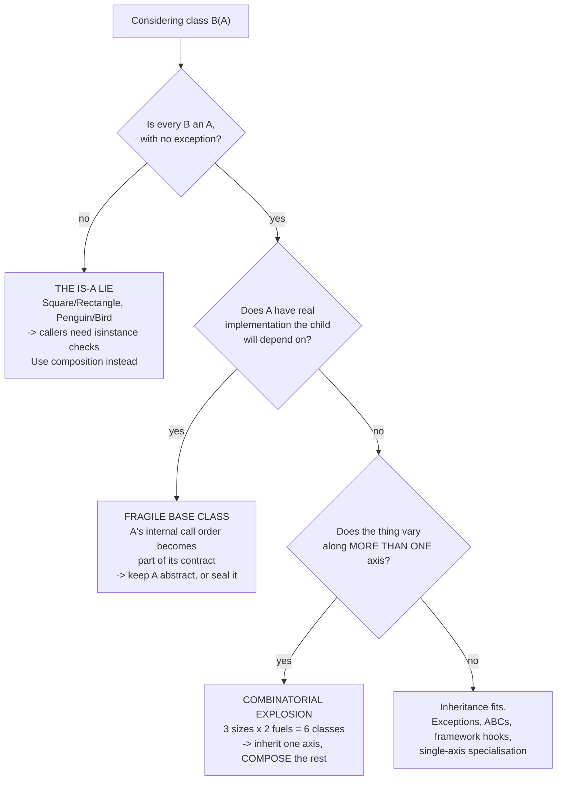

# Day 046 · System design — Inheritance and its costs

**After today you can:** You can use inheritance where it fits and name the three places it goes wrong.

**The interviewer asks it as:** *When does inheritance become a problem?*

---

## 1. What this is, and why they ask it

**Inheritance** lets one class be declared a specialised kind of another. The child gets everything
the parent has — attributes and methods — and may add to it or replace parts of it. `class Car(Vehicle)`
says a car is a vehicle, and every place in the program that works with vehicles now works with cars
without being told cars exist.

They ask about its problems, not its mechanics, and the wording of the question tells you so. Anyone
can define a subclass; the interview is checking whether you know the three specific ways inheritance
turns into a liability, because those three are what you will actually meet in a codebase. The
question is also a proxy for judgement: a candidate who reaches for a class hierarchy at the first
sign of two similar things will build one that is unchangeable in a year, and the interviewer has
seen that codebase. Expect the question in every low-level design round, usually phrased as "why not
just subclass it?" when you have proposed something else.

---

## 2. The story

Sathyan has been secretary of a four-storey building in Kaloor for six years, and about a third of
what he does is water.

There is one tank on the roof and one main line coming down the side of the building, and every flat
taps off that line. That is the arrangement and it has been since the building went up in 1994. It
is a good arrangement, mostly. Nobody had to run their own line from the roof. A new family moves
into a flat, they connect to what is already there, and water comes out of the tap on the first
evening.

Then three things happened, in that order, and Sathyan can now tell you about all of them at length.

The ground-floor flat became a small clinic. A clinic needs the water filtered and it needs the
pressure steady through the afternoon, and the main line gives neither — the pressure on the ground
floor swings depending on who is running a washing machine two floors up. There was no way to fix
that from the main line. They ran their own pipe from the tank, separately, at their own cost. So the
rule that everyone taps the main was simply not true for them any more, and every notice Sathyan puts
up about the main line has to carry an exception.

The second thing was the association's decision to fit a narrower valve at the top of the main line,
because a family on the third floor was leaving a tap running. Three flats did not notice. The
fourth had, two years earlier, put in a small booster of their own, sized for the old flow. With the
narrower valve the booster ran dry and burnt out in a fortnight. Nobody had done anything wrong.
Nobody who took the decision knew that flat had a booster, and nobody in that flat knew a decision
was being taken.

The third thing is the one that still annoys him. The second-floor flat did not tap the main line at
all. When they moved in, the first floor was empty and the plumber found it easier to take a branch
off the first floor's pipe. It works. But now, if the first floor closes their own valve to fix a
leak, the second floor has no water, and the second floor cannot understand why — they are not doing
anything, and the tap is dry.

Sathyan's view after six years is not that the main line was a mistake. It is that it works when the
flats really do want the same water in the same way, and it becomes a knot the moment one of them
does not.

---

## 3. The idea in plain English

The main line is the parent class. Each flat is a subclass. The clinic is the **is-a lie**, the
narrowed valve is the **fragile base class**, and the second floor branching off the first floor is
the **deep hierarchy**. Those are the three places inheritance goes wrong, and the interviewer's
question is asking for exactly these three.

### What inheritance actually gives you

```python
class Vehicle:
    def __init__(self, plate: str) -> None:
        self.plate = plate

    def describe(self) -> str:
        return f"{type(self).__name__} {self.plate}"

class Car(Vehicle):
    def required_spot(self) -> str:
        return "compact"
```

`Car` did not define `__init__` or `describe`, and it has both. It gained them by declaration.

Two distinct benefits are bundled together here, and separating them is most of today's lesson:

- **Reuse** — the child does not rewrite the parent's code.
- **Substitutability** — any code written against `Vehicle` works with a `Car`, with no change.

The second is the one worth having. Reuse alone can be got from a helper function or from holding
another object, which is [day 049](../day-049-peak-finding/README.md)'s subject. Inheritance is the
right tool when callers should be able to treat the child *as* the parent and never notice.

### The rule: is-a, not has-a

Before writing `class B(A)`, say the sentence out loud: **"every B is an A."** If it is not true
without qualification, do not write it.

```
every Car is a Vehicle          -> true. Subclass.
every SavingsAccount is an Account -> true. Subclass.
every Car has an Engine         -> "has a". NOT a subclass; hold one.
every Stack is a List           -> false. A stack cannot be indexed in the middle.
```

That last one is not a made-up example. `java.util.Stack extends Vector` in the Java standard
library, which means a `Stack` has `get(int index)` and `insertElementAt`, so anyone can reach into
the middle of a stack. It is documented as a mistake by the people who maintain it, and it cannot be
undone, because removing methods from a released class breaks every program that uses them.

### The first failure: the is-a lie

The child cannot honour a promise the parent made. Sathyan's clinic.

The textbook case is `Square` and `Rectangle`. Mathematically a square is a rectangle, so the
subclass looks obviously right:

```python
class Rectangle:
    def __init__(self, w: int, h: int) -> None:
        self._w, self._h = w, h
    def set_width(self, w: int) -> None:
        self._w = w
    def set_height(self, h: int) -> None:
        self._h = h
    def area(self) -> int:
        return self._w * self._h

class Square(Rectangle):
    def set_width(self, w: int) -> None:
        self._w = self._h = w        # a square must stay square
    def set_height(self, h: int) -> None:
        self._w = self._h = h
```

Now this function, written against `Rectangle` long before `Square` existed:

```python
def stretch(r: Rectangle) -> None:
    r.set_width(5)
    r.set_height(4)
    assert r.area() == 20        # obviously true for a rectangle
```

Pass it a `Square` and the assertion fails: the area is 16. Nothing is buggy in isolation. `Square`
is internally consistent and `stretch` is reasonable. The inheritance claim was the lie — a mutable
square is **not** substitutable for a mutable rectangle, because a rectangle promises that width and
height move independently and a square cannot keep that promise.

This has a name you will meet properly in the SOLID phase from
[day 055](../day-055-quickselect/README.md): the **Liskov substitution principle**, which says a
subclass must be usable anywhere the parent is, without the caller being able to tell. When it is
violated, callers start writing `if isinstance(x, Square)`, and at that moment the inheritance has
bought you nothing and cost you a type check in every caller.

The other classic: `class Penguin(Bird)` where `Bird.fly()` exists. The penguin must either raise, or
do nothing, or lie, and all three are worse than not having claimed to be that kind of bird.

### The second failure: the fragile base class

A change in the parent silently breaks children. Sathyan's narrowed valve.

```python
class Collection:
    def add(self, item):
        self._items.append(item)

    def add_all(self, items):
        for item in items:
            self.add(item)          # <-- calls its own add()

class CountingCollection(Collection):
    def __init__(self):
        super().__init__()
        self.count = 0
    def add(self, item):
        self.count += 1
        super().add(item)
```

`CountingCollection().add_all([1, 2, 3])` gives a count of 3. Correct. Now the parent's author, who
has never heard of `CountingCollection`, optimises:

```python
    def add_all(self, items):
        self._items.extend(items)   # faster, and no longer calls self.add()
```

The parent's tests all pass. Every subclass that counted on `add_all` routing through `add` is now
silently wrong — the count stays 0. Nobody did anything wrong. The parent's *internal* choice about
which of its own methods to call had become part of its interface without anyone deciding that it
should be.

This is why inheritance is described as the tightest coupling in object-oriented programming: **the
child depends not only on what the parent does, but on how it does it.** Encapsulation, from
[yesterday](../day-045-rotated-array-search/README.md), protects an object from its callers. It does
not protect a parent from its children, and that asymmetry is the whole problem.

### The third failure: depth and multiple axes

Sathyan's second floor, tapping off the first floor.

Two things go wrong as hierarchies grow. First, **depth**: with `Vehicle → MotorVehicle →
Car → ElectricCar → LeasedElectricCar`, understanding one method means reading five files, and a
change at the top can break anything below it, at any depth.

Second, and worse, **more than one axis of variation**. Suppose vehicles vary by size (bike, car,
truck) and by fuel (petrol, electric). Inheritance has one axis, so you get:

```
                       6 classes for 3 x 2

  PetrolBike   PetrolCar   PetrolTruck
  ElectricBike ElectricCar ElectricTruck

  add hybrid          -> 9 classes
  add "with trailer"  -> 18 classes
```

The class count is the product of the axes, and shared behaviour ends up duplicated across branches
because there is nowhere else to put it. The fix is not a cleverer hierarchy. It is to stop using
inheritance for the second axis and hold an object instead — a `Vehicle` that *has* a `FuelSystem` —
which is [day 049](../day-049-peak-finding/README.md).

### Where inheritance is genuinely right

It is not a warning label on the whole idea. Four places it is the correct tool:

- **Exception hierarchies.** `class PaymentDeclined(PaymentError)` lets a caller catch the family or
  the specific one. Pure substitutability, no shared state, no fragile base — the parent has almost
  no implementation to break.
- **Abstract base classes as contracts.** `class PricingStrategy(ABC)` with `@abstractmethod fee()`.
  The parent has *no* implementation, so there is nothing for a child to depend on the internals of.
  This is inheritance used for the interface only, and it is the safest form.
- **Framework extension points.** Django's `class OrderView(ListView)`, Python's
  `class MyHandler(logging.Handler)`. The framework author designed the class to be subclassed and
  documented which methods you may override.
- **A genuine specialisation with no second axis.** `class SavingsAccount(Account)` where the only
  difference is interest calculation, and no other dimension is ever going to vary.

Notice what the first two have in common: **the parent has little or no implementation**. That is the
practical rule — the less code in the parent, the less there is to be fragile about.

---

## 4. The picture

The building, and the hierarchy:

```
              WATER TANK  (the base class)
                   |
            ===== main line =====        Vehicle
             |     |     |     |            |
           flat  flat  flat  flat      +----+----+----+
            1     3     4    (2?)      |    |    |    |
                                      Car Bike Truck  |
   the CLINIC ran its own pipe                        |
   -> "every flat taps the main"              ElectricCar
      is no longer true                        (depth: 3 levels
                                                to understand one call)
   flat 2 branched off flat 1
   -> its water depends on flat 1's valve
```

**What to notice:** the clinic did not break the main line. It broke the *claim* that every flat is
served by it. That claim is what code written against the parent relies on.

The three failures, as a decision aid:



**What to notice:** every "no" branch ends at composition. That is not a coincidence, and it is the
whole argument of [day 049](../day-049-peak-finding/README.md).

---

## 5. How it actually works

### The lookup, and `super()`

When you call `car.describe()`, Python looks for `describe` on the instance, then on `Car`, then on
`Car`'s parents in a fixed order called the **method resolution order** — `Car.__mro__` prints it.
The first one found wins. That is why an override works: the child's method is met first.

`super().describe()` does not mean "my parent". It means "the next class after me in the MRO of the
object I am actually running on", which with multiple inheritance is not the same thing. The rule
that keeps this sane: **always call `super().__init__()` in a child's constructor**, and always call
it before using anything the parent sets up.

### The diamond, and why languages disagree

```python
class A:      pass
class B(A):   pass
class C(A):   pass
class D(B, C): pass       # D inherits A twice, through two paths
```

If `B` and `C` both override a method of `A`, which does `D` get? Python answers with a defined
linearisation — `D, B, C, A, object` — so it is at least predictable. C++ requires you to say. **Java
forbids it outright for classes**, allowing multiple inheritance only of interfaces, precisely
because the ambiguity produced years of subtle bugs. Python's mixins work well when each mixin is
small, stateless and touches a different method; they become unreadable when three of them all
override `save()`.

### The famous mistakes, in shipped libraries

- **`java.util.Stack extends Vector`.** A stack that can be indexed. Cannot be fixed; still in the
  standard library.
- **`java.util.Properties extends Hashtable`.** `Properties` is meant to map strings to strings, but
  it inherits `put(Object, Object)`, so anyone can store an `Integer` in it and the type guarantee is
  gone. The class's own documentation warns you not to use its inherited methods.
- **Java's `Date` and `Timestamp`.** `Timestamp` extends `Date`, and their `equals` methods are not
  symmetric — `date.equals(ts)` and `ts.equals(date)` can disagree. A substitutability violation
  shipped in the platform.

Naming one of these in an interview is worth more than a paragraph of theory, because it shows the
problem is real rather than academic.

### The designs that use it well

- **Python's exception tree** — `Exception → ArithmeticError → ZeroDivisionError`. `except
  ArithmeticError` catches the family. This works because the parents carry no behaviour.
- **`collections.abc`** — `Sequence`, `Mapping`, `Iterable` are abstract; you inherit the contract and
  get a few mixin methods derived from the ones you implement.
- **`logging.Handler`** — you subclass it and override `emit()`, and the framework documents exactly
  that method as the extension point.
- **Django's `Model`** — genuinely useful, and also the most common source of deep-MRO pain in Python
  web codebases, which is worth knowing both halves of.

---

## 6. The numbers

### The combinatorial cost, counted

```
one axis of variation:      3 vehicle types            = 3 classes
two axes:                   3 types x 2 fuels          = 6 classes
three axes:                 3 x 2 x 2 (trailer or not) = 12 classes
four axes:                  3 x 2 x 2 x 3 (ownership)  = 36 classes

with composition instead:
    3 vehicle types + 2 fuel systems + 2 trailer options + 3 ownerships
                                                       = 10 classes, total

36 against 10, and adding a fifth fuel type is 12 new classes against 1.
```

That multiplication is the single most persuasive thing you can say on this topic. It is the reason
"favour composition over inheritance" is advice and not taste.

### The cost of a change, in files

```
change a method in a base class with 12 subclasses:
    files to READ before you can be confident      : 13
    subclasses that override the method            : maybe 4 -- unaffected
    subclasses that call it via another parent
      method (the fragile-base case)               : unknown until you read all 12

change a method in a class 5 levels deep:
    files to read to understand one call           : 5
    places the behaviour could be coming from      : 5
```

### Runtime cost, so you do not over-weight it

```
attribute lookup on the class itself       ~20 ns
lookup found 3 levels up the MRO           ~35 ns   (Python caches the MRO)
a super() call                             ~150 ns

a request doing 10,000 such lookups:       ~0.35 ms
one database round trip:                   ~1 ms
```

Depth costs comprehension, not speed. Say that explicitly — candidates sometimes argue against
inheritance on performance grounds, and it is the wrong argument.

### How deep is too deep

```
1 level (a class and its subclasses)    : normal, fine
2 levels                                : fine with a reason
3 levels                                : justify it
4+                                      : almost always two axes crammed into one
```

---

## 7. The trade-offs

### Inheritance against composition

Inheritance is less code today and tighter coupling forever; composition is more wiring today and
independent parts forever. *I would not use inheritance purely to reuse code* — if I want the
parent's behaviour but not its identity, I hold an instance of it and call it. The one thing
inheritance gives that composition does not is substitutability without any adapter, and that is what
I would decide on.

### A rich base class against an abstract one

A base class with real implementation saves duplication and creates the fragile-base problem. An
abstract base with only signatures cannot be fragile, and pushes the shared code into a helper or a
collaborator. *I would not put behaviour in a base class that its subclasses could come to depend on
the internal call order of* — and if I do, I would document which methods are safe to override, the
way `logging.Handler` documents `emit`.

### Deep hierarchies against wide ones

*I would not go past two levels without a reason I can say out loud.* Three levels means a reader has
three files open to understand one call, and it is usually the signature of a second axis of
variation that should have been composed.

### Multiple inheritance against mixins against interfaces

Mixins are genuinely useful when each is small, stateless and owns a distinct method. *I would not
use multiple inheritance where two parents both carry state or both override the same method* — the
MRO is defined but nobody reading the code will hold it in their head. Java's decision to allow only
interface multiple-inheritance is a reasonable default to imitate even in Python.

### The honest sentence

> Inheritance is the strongest claim one class can make about another — that the child can stand in
> for the parent everywhere, forever. Make that claim when it is true and you get substitution for
> free. Make it because two classes happened to share four lines and you have welded them together
> for the life of the codebase.

---

## 8. In the interview

### How it gets asked

- *"When does inheritance become a problem?"* — the direct form, and the answer is three named
  failures with an example each.
- *"Why not just subclass it?"* — the pushback when you have proposed composition in a design round.
- *"Is a square a rectangle?"* — the trap. The answer depends on mutability, and saying so is the
  whole answer.
- *"You have three vehicle types and two fuel types. Model it."* — the combinatorial question, asked
  as a modelling exercise.

### What to say out loud, in the first ninety seconds

1. **Give the test before the opinion.** *"Before I subclass anything I say the sentence: every B is
   an A, with no exception. If it needs a qualification, it's a has-a and I'll compose instead."*
2. **Separate the two benefits.** *"Inheritance bundles reuse and substitutability. Reuse I can get
   from holding an object. Substitutability is the thing only inheritance gives, so that's what I
   decide on."*
3. **Name the three failures, briefly.** *"The three ways it goes wrong: the is-a lie, where the child
   can't keep a promise the parent made; the fragile base class, where the parent's internal call
   order becomes part of its contract; and multiple axes of variation, where the class count becomes
   a product."*
4. **Say where it is right.** *"I'd still use it for exception hierarchies, abstract base classes as
   contracts, and framework extension points — all cases where the parent has little or no
   implementation, so there's nothing fragile to depend on."*
5. **Then apply it to the actual problem in front of you.**

### The follow-ups

**"Is a square a rectangle? Should `Square` extend `Rectangle`?"**
Mathematically yes, in code it depends entirely on whether the objects are mutable, and that is the
real answer. If `Rectangle` has `set_width` and `set_height`, it is making a promise: those two move
independently. `Square` cannot keep that promise — setting the width has to change the height — so
any function written against `Rectangle` can be broken by passing a `Square`. The concrete failure is
a function that sets width to 5, sets height to 4, and expects an area of 20; with a square it gets
16, and nothing in either class is buggy in isolation. That is a Liskov substitution violation, and
the symptom in a real codebase is `isinstance` checks appearing in callers — at which point the
inheritance has bought nothing and cost a type check everywhere. If instead both are immutable value
objects with no setters, `Square` extending `Rectangle` is completely fine, because there is no
promise to break: you can only construct, never mutate. So my answer is that the question is not
about geometry at all — it is about which operations the parent exposes.

**"Give me a real bug caused by a fragile base class."**
The one I'd describe is the counting-collection case, because it is the shape that appears again and
again. A base `Collection` has `add(item)` and `add_all(items)`, and `add_all` is implemented as a
loop that calls `self.add`. A subclass overrides `add` to increment a counter, and everything works —
`add_all` routes through the override, the count is right. Then someone optimises the base class to
use `self._items.extend(items)` instead of the loop. Every test on the base class passes, because
nothing about the base class's behaviour changed. Every subclass that was counting is now silently
wrong, and the failure shows up as a number being too low in a report, weeks later, with nothing in
the logs. The root cause is that the parent's choice about which of its own methods to call had
become part of its interface without anyone deciding it should be. The lessons I'd draw are: a base
class meant for subclassing must document its self-calls as part of the contract, or avoid them
entirely; and this is why abstract base classes with no implementation are the safest form of
inheritance — there is nothing to depend on.

**"So should I never use inheritance?"**
No, and I would push back on the slogan version of the advice. Inheritance is the right tool exactly
when the parent has little or no implementation and the child genuinely substitutes. Exception
hierarchies are the cleanest example: `PaymentDeclined` extending `PaymentError` extending
`Exception` lets a caller catch the family or the specific case, there is no state in the parents,
and there is no way for a change in `PaymentError` to break `PaymentDeclined`. Abstract base classes
are the second: a `PricingStrategy` with one abstract method is a contract, and implementing it is
inheritance used purely for substitutability. Framework hooks are the third — when Django or the
`logging` module documents a class as designed for subclassing and names the method to override, the
fragile-base problem has been handled by the author. The pattern across all three is that the danger
lives in the parent's *implementation*, so the less of it there is, the safer the inheritance. The
rule I actually use is: inherit interfaces freely, inherit implementation carefully, and never
inherit just to avoid typing.

### A model answer

> "It becomes a problem in three specific ways, and I'd name them with an example each rather than
> talk about coupling in the abstract.
>
> The first is the is-a lie. Inheritance claims the child can stand in for the parent everywhere, and
> when that's not true the callers pay. The standard case is a mutable `Square` extending a mutable
> `Rectangle`: a function that sets width to 5, then height to 4, then expects an area of 20 gets 16.
> Neither class is buggy on its own — the claim was wrong. The symptom in a codebase is `isinstance`
> checks appearing in callers, and at that point the inheritance is costing more than it saved.
>
> The second is the fragile base class. A child depends not just on what the parent does but on how it
> does it. If a base `add_all` loops calling `self.add`, a subclass that overrides `add` to count
> works — until someone optimises `add_all` to use `extend`. The base class's tests all still pass and
> every subclass is silently wrong. The parent's internal call order had become part of its contract
> without anyone deciding that.
>
> The third is more than one axis of variation. Three vehicle types and two fuel types is six classes;
> add a trailer option and it's twelve; add ownership models and it's thirty-six. The count is the
> product of the axes, and shared behaviour gets duplicated across branches because there's nowhere
> else to put it. With composition it's ten classes total and a new fuel type is one class instead of
> twelve.
>
> Where I'd still use it: exception hierarchies, abstract base classes as contracts, and framework
> extension points that were designed to be subclassed. What those have in common is that the parent
> carries little or no implementation — which is the practical rule. Inherit interfaces freely,
> inherit implementation carefully, and never inherit purely to reuse code, because reuse I can get by
> holding an object. Substitutability is the only thing inheritance uniquely gives, so that's what I
> decide on.
>
> The test I say out loud before writing `class B(A)`: every B is an A, with no exception. If it needs
> a qualification, it's a has-a."

---

## 9. Recall card

- **Say the sentence first: "every B is an A, with no exception."** If it needs a qualification, it is
  has-a — hold an object instead. Inheritance bundles reuse and substitutability; only the second is
  worth the coupling.
- **Failure 1 — the is-a lie.** Mutable `Square`/`Rectangle`: set width 5, height 4, expect area 20,
  get 16. Symptom: `isinstance` checks in callers. (Liskov, properly on
  [day 055](../day-055-quickselect/README.md).)
- **Failure 2 — the fragile base class.** The parent's internal self-calls become its contract;
  optimising `add_all` from a loop to `extend` silently breaks every counting subclass, with all
  parent tests green.
- **Failure 3 — multiple axes.** 3 types × 2 fuels = 6 classes, × trailer = 12, × ownership = 36
  against 10 by composition. The class count is the *product* of the axes.
- **It is right when the parent has almost no implementation:** exception trees, abstract base classes
  as contracts, documented framework hooks, single-axis specialisation. Depth costs comprehension, not
  speed — past two levels, justify it.
