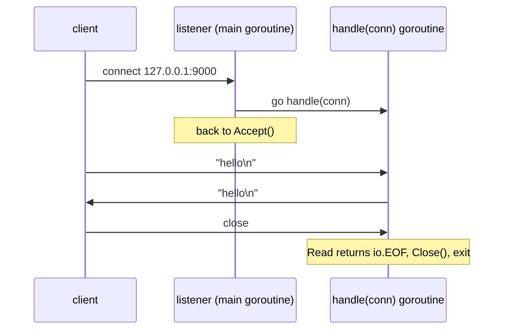

# Day 046 · Go — net.Listen, Accept, and one goroutine per connection

**Today's theme:** TCP sockets: an echo server

**After today you can:** You can write a server that accepts a connection and echoes bytes back, in each language, and test it with a client.

**The interviewer asks it as:** *What happens when a client connects to your server?*

---

## 1. What this is, and why it matters

`net.Listen` opens a TCP port and gives you a `net.Listener`. `Accept` on that listener blocks
until a client connects and returns a `net.Conn`, one per client. An echo server reads from the
conn and writes the same bytes back, and Go's idiom is to do that in a fresh goroutine so that
`Accept` is never kept waiting.

This is the shape of every Go network program. `net/http`, which arrives on
[day 48](../day-048-binary-search-on-floats/README.md), is exactly this loop with a parser
inside the goroutine. Interviewers ask "what happens when a client connects" because the answer
separates people who have used a web framework from people who know what the framework is
doing. Go is the language most often used to answer it, because the answer fits in twelve lines.

## 2. The story

Meera opens a small eatery on the corner of a busy road. Before anyone can visit, she needs
one thing: a street number. She gets it painted above the door, number forty-two, so that a
person who has heard of the place can actually find it. Then she flips the sign on the door to
say open. That is all it does. It does not bring anyone in. It tells people walking past that
if they knock, someone will answer.

Her cousin Arjun stands at the door. When a family arrives, he does not take their order. He
walks them to an empty table and goes straight back to the door, because there is already a
second group behind them. Arjun never leaves the door for long. If he did, people would pile up
on the pavement and some would give up and go home.

Meera does not hire a waiter for each table. She cannot afford it. Instead she has a stack of
small cards by the door, and on each one Arjun writes the table number and hands it to a
helper. The helpers are teenagers from the neighbourhood, and there are dozens of them, and
each one costs her almost nothing. A helper takes the card, walks to the table, and does the
one job: whatever the customer says, the helper says back, word for word. "Two plates of rice."
"Two plates of rice." The customers hear at once if something was misheard.

When a family finishes and leaves, the helper wipes the table and tears up the card. Nobody
has to tell them; that is just what the card said to do at the end.

One evening a second cook tries to open a stall at number forty-two as well. The painter refuses.
One number, one place. And when a customer turns up at nine at night after the sign has been
flipped to closed, nobody answers. She waits a moment, then walks away.

## 3. The idea in plain English

The street number and the open sign are one call in Go: `net.Listen("tcp", "127.0.0.1:9000")`.
It creates the socket, binds the address, and starts listening, and gives you back a
`net.Listener`. If the address is taken, it returns an error and you stop there.

Arjun is `listener.Accept()`. It blocks until a client connects and returns a `net.Conn` for
that one client. The listener never carries bytes. It only produces conns.

The card is the goroutine. `go handle(conn)` starts one and the loop goes back to `Accept` at
once. A goroutine starts with a stack of a few kilobytes, so ten thousand of them is fine,
which is why Go does not bother with a pool for this; you met goroutines on
[day 31](../day-031-fixed-window/README.md) and `sync.WaitGroup` there too.

The helper's one job is `io.Copy(conn, conn)`. A `net.Conn` satisfies both `io.Reader` and
`io.Writer` from [day 16](../day-016-2d-arrays/README.md), so copying a
conn to itself reads whatever arrives and writes it straight back. `io.Copy` returns when
`Read` returns `io.EOF`, which is what the client hanging up looks like.

Tearing up the card is `defer conn.Close()`. Without it the connection stays open on your side
after the client is gone, and a server that leaks one connection per client runs out of file
descriptors after a busy afternoon.

## 4. The picture



Notice that the listener talks to the client exactly once, at connect time. Everything after
that is between the client and its own goroutine.

## 5. The code, built step by step

The helper first. It is three lines.

```go
func handle(conn net.Conn) {
	defer conn.Close()
	fmt.Println("connected:", conn.RemoteAddr())
	if _, err := io.Copy(conn, conn); err != nil {
		fmt.Println("copy error:", err)
	}
	fmt.Println("closed:", conn.RemoteAddr())
}
```

`conn.RemoteAddr()` is the client's IP and port. `io.Copy(dst, src)` with the same conn on both
sides is the whole echo. It returns the number of bytes copied, which we drop, and an error,
which is `nil` on a clean hang-up because `io.Copy` treats `io.EOF` as success rather than
failure.

Now the door.

```go
listener, err := net.Listen("tcp", "127.0.0.1:9000")
if err != nil {
	fmt.Println("listen failed:", err)
	os.Exit(1)
}
defer listener.Close()
fmt.Println("listening on", listener.Addr())
```

The first argument is the network, `"tcp"`, and the second is `host:port` as one string.
There is no separate `bind` or `listen` to call. The error path is the
[day 9](../day-009-what-an-array-is/README.md) `if err != nil` you have been
writing for five weeks; here it fires when the port is already taken.

Then the loop that seats the guests.

```go
for {
	conn, err := listener.Accept()
	if err != nil {
		fmt.Println("accept failed:", err)
		continue
	}
	go handle(conn)
}
```

`Accept` blocks. When it returns, the next thing is `go handle(conn)`, and the loop is already
back at `Accept` before the goroutine has done anything. An `Accept` error is usually
temporary, such as running out of file descriptors, so we log and try again rather than exit.

Save the server as `main.go`. Then a client, `client/main.go`, in its own folder so the two `main` packages do not collide:

```go
package main

import (
	"bufio"
	"fmt"
	"net"
)

func main() {
	conn, err := net.Dial("tcp", "127.0.0.1:9000")
	if err != nil {
		fmt.Println("dial failed:", err)
		return
	}
	defer conn.Close()
	reader := bufio.NewReader(conn)
	for _, line := range []string{"hello", "one more"} {
		fmt.Fprintf(conn, "%s\n", line)
		reply, _ := reader.ReadString('\n')
		fmt.Print("got back: ", reply)
	}
}
```

`net.Dial` is the client's side of `net.Listen`: it connects and returns a `net.Conn`. The
client wraps the conn in a `bufio.Reader` from [day 10](../day-010-traversal-patterns/README.md) so it
can ask for one line at a time. That is a small cheat: it works because the server echoes the
newline we sent, so the line ending we wait for is one we chose.

Run the server in one terminal:

```bash
go run main.go
```

and the client in a second terminal:

```bash
go run ./client
```

The client prints:

```text
got back: hello
got back: one more
```

The server's terminal prints:

```text
listening on 127.0.0.1:9000
connected: 127.0.0.1:51844
closed: 127.0.0.1:51844
```

The client's port number is chosen by the operating system and changes every run.

Here is the whole server again in one piece, `main.go`, so you can copy it as it stands:

```go
package main

import (
	"fmt"
	"io"
	"net"
	"os"
)

func handle(conn net.Conn) {
	defer conn.Close()
	fmt.Println("connected:", conn.RemoteAddr())
	if _, err := io.Copy(conn, conn); err != nil {
		fmt.Println("copy error:", err)
	}
	fmt.Println("closed:", conn.RemoteAddr())
}

func main() {
	listener, err := net.Listen("tcp", "127.0.0.1:9000")
	if err != nil {
		fmt.Println("listen failed:", err)
		os.Exit(1)
	}
	defer listener.Close()
	fmt.Println("listening on", listener.Addr())
	for {
		conn, err := listener.Accept()
		if err != nil {
			fmt.Println("accept failed:", err)
			continue
		}
		go handle(conn)
	}
}
```

## 6. How the other two languages do it

**Python**

```python
listener = socket.socket(socket.AF_INET, socket.SOCK_STREAM)
listener.bind(("127.0.0.1", 9000))
listener.listen()
while True:
    conn, addr = listener.accept()
    threading.Thread(target=serve_one, args=(conn, addr), daemon=True).start()
```

Three calls where Go has one, and a `threading.Thread` where Go has `go`. The waiter is a
`while True` loop on `recv` and `sendall`, because Python's socket has no `io.Copy` that knows
a socket is both a reader and a writer.

**C++**

```cpp
int fd = socket(AF_INET, SOCK_STREAM, 0);
bind(fd, reinterpret_cast<sockaddr*>(&addr), sizeof addr);
listen(fd, SOMAXCONN);
int conn = accept(fd, nullptr, nullptr);
std::thread(serve_one, conn).detach();
```

Same three calls as Python, but each returns `-1` on failure and puts the reason in `errno`,
and the conn is a bare `int` that you must `close` yourself.

**The difference that matters:** In Go the unit you spend per client is a goroutine at a few
kilobytes, so `go handle(conn)` is the whole concurrency story; in Python and C++ it is a
thread at a megabyte or more, so the same design stops scaling around a thousand clients and
you have to reach for an event loop or a pool.

## 7. The traps

**The near-miss.** Drop the `go`:

```go
for {
	conn, _ := listener.Accept()
	handle(conn)
}
```

It compiles, `go vet` is silent, and one client works perfectly. Start a second client while
the first is connected and it hangs: its connection is complete at the TCP level and sitting in
the listen queue, but nobody will call `Accept` until the first client hangs up. No error is
printed anywhere. This is the exact scenario the interview question is probing.

**Forgetting `defer conn.Close()`.** The program keeps working, and after a few thousand
clients `Accept` starts failing:

```text
accept failed: accept tcp 127.0.0.1:9000: accept: too many open files
```

Every leaked conn holds a file descriptor, and the process has a limit, typically 1024 by
default on Linux.

**Port already taken.** Start the server twice:

```text
listen failed: listen tcp 127.0.0.1:9000: bind: address already in use
```

Go sets `SO_REUSEADDR` for you on listeners, so restarting straight after Ctrl-C is fine. This
message means another process genuinely still holds the port.

**Nobody home.** Run the client with no server:

```text
dial failed: dial tcp 127.0.0.1:9000: connect: connection refused
```

**Reading a message that is not there.** `conn.Read(buf)` fills as many bytes as have arrived,
which may be one, or the whole of two lines at once. TCP is a stream. The echo server does not
care, and neither does `io.Copy`, but the client above only works because it waits for a
newline it sent itself. A real protocol chooses a delimiter or a length prefix and reads until
it sees one.

## 8. Say it out loud

**How it gets asked**

- What happens when a client connects to your server?
- What does `net.Listen` do that `Accept` does not?
- Why `go handle(conn)` rather than a worker pool?
- What happens if you forget to close the conn?

**The ninety-second script**

`net.Listen` creates a socket, binds it to the address, and puts it in the listening state, so
the kernel starts queuing connections. Then I loop on `Accept`. When a client connects, the
kernel finishes the TCP handshake and `Accept` returns a `net.Conn` for that client. I start a
goroutine with the conn and go straight back to `Accept`, so the listen queue never backs up.
In the goroutine I defer `conn.Close()`, then `io.Copy(conn, conn)`, which reads whatever
arrives and writes it back until `Read` returns `io.EOF`, meaning the client hung up. Then the
deferred close runs and the goroutine ends. The listener never carries data; it only produces
conns.

**The follow-ups**

- **Why not a pool of workers like on day 35?** *A goroutine costs a few kilobytes, so a
  goroutine per connection is cheap enough that a pool would add complexity without saving
  anything. You add a limit only when the work behind each connection is what is expensive,
  such as a database query per request.*
- **What does `io.Copy` do when the client hangs up?** *`Read` returns `io.EOF`, `io.Copy`
  treats that as a normal end and returns a nil error, and the deferred `Close` releases the
  descriptor.*
- **How do you stop this server cleanly?** *Close the listener from another goroutine.
  `Accept` then returns an error, the loop sees it and exits, and a `sync.WaitGroup` or a
  `context.Context` from day 36 waits for the in-flight handlers to finish.*

**A model answer**

"On connect, the kernel completes the handshake and queues the connection. My `Accept` call
returns a `net.Conn` bound to that one client, I start `go handle(conn)` and I am back at
`Accept` before the goroutine has read a byte. The handler defers `Close`, copies the conn to
itself, and exits on `io.EOF`. Two things I always say: the listener and the conn are two
different objects with two different jobs, and a missing `Close` is a leak that shows up as
`too many open files` an hour later, not as a crash now."

## 9. Recall card

- `net.Listen("tcp", "host:port")` is socket + bind + listen; it returns a `net.Listener`.
- `Accept()` blocks and returns one `net.Conn` per client; the listener never carries bytes.
- `go handle(conn)` and straight back to `Accept`; without `go`, the second client hangs.
- `defer conn.Close()` first; `io.Copy(conn, conn)` is the whole echo and ends on `io.EOF`.
- `bind: address already in use` is the port taken; `connect: connection refused` is no server.
