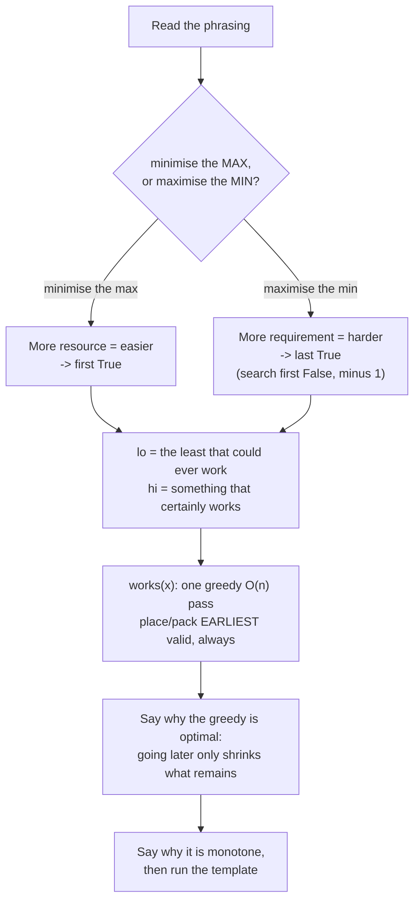

# Day 047 · DSA — Minimise the maximum: the capacity family

**After today you can:** You can recognise minimise-the-maximum wording and turn it into a yes-or-no predicate.

**The interviewer asks it as:** *Split the array into k parts, minimising the largest part sum.*

---

## 1. What this is, and why they ask it

Yesterday you learnt the machine: bound the answer range, write a feasibility check, run the boundary
template. Today you learn to **recognise when to start it**, and you learn its mirror. Half of this
family asks you to make the biggest thing as small as possible — *minimise the maximum* — and the
other half asks you to make the smallest thing as large as possible — *maximise the minimum*. They are
the same machine pointed in opposite directions, and confusing which one you are in is the most common
way to lose an otherwise correct answer.

They ask it because the wording is a deliberate disguise. "Split the array into k parts, minimising
the largest part sum" reads as an optimisation problem, and the honest first instinct is dynamic
programming — which works, at `O(n² k)`, and is far more code. Interviewers use LeetCode 410 as a hard
question precisely to see whether you can turn an optimisation phrase into a decision question. Once
you can, a whole shelf of problems that look unrelated — splitting arrays, placing cows in stalls,
dividing chocolate, distributing products to stores — become one recipe you have already written.

---

## 2. The story

Vijaya has invigilated the half-yearly exams at the same school in Erode for fourteen years, and the
hall is the same hall every time: one long room with a single row of forty desks bolted to the floor
down one wall.

The desks are not evenly spaced. Whoever fixed them worked around two pillars and a doorway, so some
are almost touching and there is a long empty stretch in the middle where a bench used to be.

This year she has eight students in her sitting, and one job: get them as far apart as she can.

Not "far apart on average". What she actually worries about is the closest pair — the two who end up
nearest each other are the two who will be able to see something, and it does not matter how spread
out the other six are. So the number she is trying to push up is the smallest gap in the room.

She has done this long enough that she does not fiddle with it. She thinks of a gap, tests it, and
the test is always the same walk.

Say the gap is six desks. She puts the first student at the very first desk — there is never a reason
not to, because starting further in only wastes room. Then she walks along the row until she reaches
the first desk that is at least six away from him, and puts the second student there. Then she walks
on from there, six more, third student. And so on, taking the earliest desk that is far enough each
time, because leaving anyone further along than necessary only makes it harder for whoever comes
after.

If she gets all eight seated before the row runs out, six works.

The first time she tried six this year, she got seven students in and ran out of desks. So six is too
much — and, she knows without checking, so is seven, and eight, and anything larger. Those are all
gone in one go.

So she tried three. All eight seated, easily, with desks to spare. Three works — but then so does two
and so does one, and she does not want a gap that works, she wants the largest gap that works. Below
three is finished with.

Four: all eight seated. Five: only seven. So the answer is four.

Four walks down the row, and every one of them told her about a whole stretch of gaps at once rather
than about a single one.

---

## 3. The idea in plain English

Vijaya's row of desks is the input array. The **gap** is the answer she is searching for — not
something in the array, a number she is choosing. And her walk is the feasibility check.

### The two phrasings, and how to tell them apart

Every problem in this family asks for one of two things:

```
MINIMISE THE MAXIMUM     "split into k parts, make the LARGEST part as SMALL as possible"
                         answers run:  no   no   no   YES  YES  YES
                                                      ^ first True = the answer

MAXIMISE THE MINIMUM     "place c cows, make the SMALLEST gap as LARGE as possible"
                         answers run:  YES  YES  YES  no   no   no
                                                 ^ last True = the answer
```

The way to tell them apart in one second: **ask which direction "more" helps.** A bigger allowed part
sum makes splitting *easier*, so the yes-answers are at the top. A bigger required gap makes seating
*harder*, so the yes-answers are at the bottom. Say that sentence out loud before writing anything;
it decides which end of the range you are looking for.

### Minimise the maximum, in full

The canonical form is LeetCode 410:

> Split `nums` into `k` contiguous parts. Minimise the largest part sum.

The trick is to **stop asking for the minimum and start asking a yes-or-no question about a limit**:

> Given a limit `L`, can `nums` be split into at most `k` contiguous parts, each summing to at most
> `L`?

That question has a greedy answer that is exactly yesterday's shipping walk — keep adding to the
current part until the next value would exceed `L`, then start a new part — and the greedy is optimal
because the parts must be contiguous, so there is only one sensible place for each boundary.

```python
def parts_needed(nums: list[int], limit: int) -> int:
    parts, total = 1, 0
    for x in nums:
        if total + x > limit:
            parts, total = parts + 1, 0
        total += x
    return parts
```

Then `works(L)` is `parts_needed(nums, L) <= k`, and the answer is the first `L` for which it is true.

**Range:** `lo = max(nums)` — no part can be smaller than the biggest single element, since parts are
contiguous and every element must land in one. `hi = sum(nums)` — one part holds everything.

### Maximise the minimum, in full

Vijaya's problem is the standard "aggressive cows", and LeetCode 1552 is its exact form:

> Given positions of `n` stalls and `c` cows, place the cows so that the minimum distance between any
> two is as large as possible.

Again, stop asking for the maximum:

> Given a required gap `g`, can all `c` cows be placed with every pair at least `g` apart?

The check is Vijaya's walk. Place the first at the earliest position; then take the earliest position
at least `g` beyond the last placement; repeat.

```python
def can_place(positions: list[int], cows: int, gap: int) -> bool:
    placed, last = 1, positions[0]        # first cow at the first stall, always
    for p in positions[1:]:
        if p - last >= gap:
            placed += 1
            last = p
            if placed == cows:
                return True
    return False
```

`positions` must be sorted first — that is an `O(n log n)` cost outside the search, and forgetting it
is the trap in §7.

**The greedy is optimal, and it is worth being able to say why:** placing a cow later than the
earliest valid stall can never help, because it leaves strictly less room for everyone after. That is
an exchange argument, and one sentence of it is what the interviewer wants.

**Range:** `lo = 1` — the smallest meaningful gap. `hi = positions[-1] - positions[0]` — the whole
span, which certainly fails for more than two cows but is a valid upper edge.

### Handling the mirrored direction without a second template

The answers now run `YES, YES, no, no`, and the answer is the **last True**. Two routes:

**Route one, recommended.** Search for the **first `False`** with the untouched template, then
subtract one:

```python
first_bad = first_true(lo, hi + 1, lambda g: not can_place(positions, cows, g))
answer = first_bad - 1
```

One template, forever. The `hi + 1` is because the range is half-open and you want `hi` itself to be
a candidate.

**Route two.** Mirror the template, and remember the ceiling midpoint:

```python
while lo < hi:
    mid = (lo + hi + 1) // 2          # + 1 is MANDATORY here
    if can_place(positions, cows, mid):
        lo = mid                       # mid works; it might be the largest
    else:
        hi = mid - 1
return lo
```

Without the `+ 1`, when `hi == lo + 1` the midpoint is `lo`, and `lo = mid` changes nothing — the loop
hangs silently. Both routes are correct; route one costs you nothing to remember.

### The translation table

This is the thing to hold. Every one of these is the same machine:

```
phrasing                                    the yes-or-no question
-----------------------------------------   ------------------------------------------
minimise the largest part sum, k parts       can it be done in <= k parts with limit L?
minimise the largest number of products      can every store take <= L products?
  any store must handle
minimise the days to finish, given a rate    can it be finished in <= d days at rate r?
maximise the smallest gap between placed     can c items be placed with every gap >= g?
  items
maximise the smallest piece of chocolate     can k+1 pieces each be >= s sweetness?
maximise the number of items you can buy     can n items be bought with budget <= B?
```

Every right-hand column is a `works(x) -> bool` that costs one `O(n)` pass. That is the family.

### Why not dynamic programming

LeetCode 410 has a genuine dynamic-programming solution: `dp[i][j]` is the best largest-part-sum for
the first `i` elements in `j` parts. It is correct, and it costs `O(n² k)` time and `O(nk)` space.

```
n = 1,000 elements, k = 50 parts:
    DP:            1,000 x 1,000 x 50   = 50,000,000 operations, 50,000 cells
    binary search: 1,000 x log2(sum)    = 1,000 x ~30 = 30,000 operations, O(1) space
```

Over a thousand times less work, in about a quarter of the code. Naming the dynamic-programming
solution and then rejecting it with those numbers is a strong move in an interview — it shows you
chose rather than only knew one thing.

---

## 4. The picture

Vijaya's row, with a gap of 4 being tested. Eight students, and these are the desk positions
measured along the wall:

```
 position     2   11   20   22   24   26   30   33   35   39   42   45
              S    S    S    .    S    .    S    .    S    S    .    S
              1    2    3         4         5         6    7         8

 the walk, taking the EARLIEST desk that is far enough each time:
   seat at 2                        (student 1)
   11 - 2  = 9  >= 4  -> seat       (student 2)
   20 - 11 = 9  >= 4  -> seat       (student 3)
   22 - 20 = 2  <  4  -> walk on
   24 - 20 = 4  >= 4  -> seat       (student 4)
   26 - 24 = 2  <  4  -> walk on
   30 - 24 = 6  >= 4  -> seat       (student 5)
   33 - 30 = 3  <  4  -> walk on
   35 - 30 = 5  >= 4  -> seat       (student 6)
   39 - 35 = 4  >= 4  -> seat       (student 7)
   42 - 39 = 3  <  4  -> walk on
   45 - 39 = 6  >= 4  -> seat       (student 8)   all eight placed. Gap 4 works.

 at gap 5 the same walk seats only seven before the row runs out. So the answer is 4.
```

**What to notice:** she never places a student earlier than necessary and never later than necessary.
Earliest-valid is the greedy, and it is optimal because a later placement only shrinks what is left.

The two directions, side by side:

```
 MINIMISE THE MAXIMUM (LC 410)          MAXIMISE THE MINIMUM (LC 1552)
 limit L:  9  12  15  18  21  25        gap g:   1   2   3   4   5   6
 works?    no  no  no YES YES YES       works?  YES YES YES YES  no  no
                      ^                                      ^
              first True = 18                        last True = 4

 "more limit makes it EASIER"           "more gap makes it HARDER"
 -> yes-answers at the top               -> yes-answers at the bottom
```

**What to notice:** the only thing that differs is which direction "more" helps. That single question
tells you which end you are hunting, and it takes one second to ask.

The whole recipe, as a checklist you run in the room:



**What to notice:** two of the six boxes are sentences you say rather than code you write, and they
are the two candidates skip.

---

## 5. The code, built step by step

### Minimise the maximum: the check

```python
def parts_needed(nums: list[int], limit: int) -> int:
    parts, total = 1, 0
    for x in nums:
        if total + x > limit:
            parts, total = parts + 1, 0
        total += x
    return parts
```

Yesterday's shipping walk, renamed. `parts` starts at 1 because the first part exists before anything
is added to it.

### Minimise the maximum: the search

```python
lo, hi = max(nums), sum(nums)
while lo < hi:
    mid = (lo + hi) // 2
    if parts_needed(nums, mid) <= k:
        hi = mid
    else:
        lo = mid + 1
return lo
```

Unmodified template. `lo = max(nums)` because a single element bigger than the limit could never be
placed anywhere.

### Maximise the minimum: the check

```python
def can_place(positions: list[int], cows: int, gap: int) -> bool:
    placed, last = 1, positions[0]
    for p in positions[1:]:
        if p - last >= gap:
            placed, last = placed + 1, p
            if placed == cows:
                return True
    return False
```

The early `return True` matters for cost: once all cows are placed there is no reason to keep
walking. It does not change the class, and it halves the work on easy candidates.

### Maximise the minimum: the search, done the safe way

```python
positions.sort()                                   # REQUIRED. O(n log n), once.
lo, hi = 1, positions[-1] - positions[0]

# search for the first gap that FAILS, then step back one
first_bad = lo
low, high = lo, hi + 1                             # half-open, so hi itself is a candidate
while low < high:
    mid = (low + high) // 2
    if not can_place(positions, cows, mid):
        high = mid
    else:
        low = mid + 1
first_bad = low
return first_bad - 1
```

One template, pointed at "the first failure". No ceiling midpoint, no mirrored branches, nothing new
to remember.

### The complete solution

```python
def split_array_largest_sum(nums: list[int], k: int) -> int:
    """LeetCode 410. Split nums into k contiguous parts; minimise the largest part sum.

    MINIMISE THE MAXIMUM: more limit makes splitting easier, so the yes-answers are at
    the top and the answer is the FIRST True.
    """
    def parts_needed(limit: int) -> int:
        parts, total = 1, 0
        for x in nums:
            if total + x > limit:
                parts, total = parts + 1, 0
            total += x
        return parts

    lo, hi = max(nums), sum(nums)          # least possible / certainly enough
    while lo < hi:
        mid = (lo + hi) // 2
        if parts_needed(mid) <= k:
            hi = mid
        else:
            lo = mid + 1
    return lo


def max_min_distance(positions: list[int], cows: int) -> int:
    """LeetCode 1552 / 'aggressive cows'. Place cows so the smallest gap is as large as possible.

    MAXIMISE THE MINIMUM: more gap makes placing harder, so the yes-answers are at the
    bottom and the answer is the LAST True -- found as (first False) - 1.
    """
    positions = sorted(positions)          # the search is meaningless without this

    def can_place(gap: int) -> bool:
        placed, last = 1, positions[0]     # earliest stall, always: going later never helps
        for p in positions[1:]:
            if p - last >= gap:
                placed, last = placed + 1, p
                if placed == cows:
                    return True
        return False

    lo, hi = 1, positions[-1] - positions[0]
    low, high = lo, hi + 1                 # half-open so that hi itself is a candidate
    while low < high:
        mid = (low + high) // 2
        if not can_place(mid):             # looking for the FIRST failure
            high = mid
        else:
            low = mid + 1
    return low - 1                         # step back to the last gap that worked


def min_max_products(quantities: list[int], n: int) -> int:
    """LeetCode 2064. Distribute products to n stores; minimise the most any store gets.

    Same family again: the check is a sum of ceiling divisions rather than a greedy walk.
    """
    def stores_needed(limit: int) -> int:
        return sum((q + limit - 1) // limit for q in quantities)

    lo, hi = 1, max(quantities)
    while lo < hi:
        mid = (lo + hi) // 2
        if stores_needed(mid) <= n:
            hi = mid
        else:
            lo = mid + 1
    return lo


if __name__ == "__main__":
    print(split_array_largest_sum([7, 2, 5, 10, 8], 2))          # 18
    print(split_array_largest_sum([1, 2, 3, 4, 5], 2))           # 9
    print(split_array_largest_sum([1, 4, 4], 3))                 # 4
    print(split_array_largest_sum([5], 1))                       # 5    <- one part
    print(split_array_largest_sum([1, 1, 1, 1], 4))              # 1    <- k == n

    print(max_min_distance([1, 2, 4, 8, 9], 3))                  # 3
    print(max_min_distance([5, 4, 3, 2, 1, 1000000000], 2))      # 999999999
    print(max_min_distance([1, 2, 3, 4, 7], 3))                  # 3
    print(max_min_distance([1, 2], 2))                           # 1    <- two cows, two stalls

    print(min_max_products([11, 6], 6))                          # 3
    print(min_max_products([15, 10, 10], 7))                     # 5
    print(min_max_products([100000], 1))                         # 100000
```

Three problems. The search loop in the first and third is character-identical; the second is the same
loop with the question negated and one subtraction at the end. That is the point of the day.

---

## 6. What it costs

### Time, both directions

```
minimise the maximum (LC 410):
    one check      : O(n)                       one pass over nums
    passes         : log2(sum(nums) - max(nums))
    total          : O(n x log(sum - max))

maximise the minimum (LC 1552):
    sort           : O(n log n)                 once, outside the search
    one check      : O(n)
    passes         : log2(last - first)
    total          : O(n log n + n x log(span))
```

Note where the sort sits. For the placement problems it is a real cost and it can dominate when the
coordinate span is small:

```
n = 100,000 positions, span up to 10^9:
    sort   : 100,000 x 17          = ~1,700,000 operations
    search : 100,000 x 30 passes   = 3,000,000 operations
                                     ---------
                                     ~4,700,000 -- the search dominates, but only just
```

### Against the alternatives

```
LC 410, n = 1,000, k = 50:
    dynamic programming  O(n^2 k) = 1,000 x 1,000 x 50 = 50,000,000 ops, 50,000 cells
    binary search        O(n log(sum)) = 1,000 x 30    =     30,000 ops, O(1) space

    ~1,600x less work, and about a quarter of the code.
```

### Space

```
lo, hi, mid + the check's two counters   -> O(1) extra
sorting in place (positions.sort())      -> O(1) extra beyond the input
sorted(positions) making a copy          -> O(n)
```

Worth one sentence in an interview: sorting in place mutates the caller's list, which is sometimes
rude and sometimes exactly what is wanted. Say which you are doing.

### The number to have ready

> Bound the answer range, write an O(n) greedy check, run log-of-the-range checks. For a thousand
> elements split into fifty parts that is about thirty thousand operations against fifty million for
> the dynamic-programming solution — and the binary search is O(1) space where the DP table is
> fifty thousand cells.

---

## 7. The traps

### The near-miss: searching the wrong end

```python
# "maximise the minimum gap", written with the minimise-the-maximum template
lo, hi = 1, positions[-1] - positions[0]
while lo < hi:
    mid = (lo + hi) // 2
    if can_place(mid):
        hi = mid                      # <-- WRONG DIRECTION
    else:
        lo = mid + 1
return lo

print(wrong([1, 2, 4, 8, 9], 3))      # 1   should be 3
```

```
1
```

No error. The code found the *smallest* gap that works, which is always 1, and returned it with
confidence. The fix is not a patch — it is asking the one-second question first: **does more of this
quantity make the task easier or harder?** Easier means first True. Harder means last True.

### The near-miss: forgetting to sort

```python
print(max_min_distance_unsorted([5, 1, 9, 2, 8], 3))     # 1   should be 4
```

The greedy walk assumes positions come in increasing order — `p - last` is only a distance if `p`
comes after `last`. On unsorted input the differences go negative, the placement count is wrong, and
the answer is garbage. Third appearance of the same lesson: **binary search on the answer does not
need the input sorted, but the feasibility check often does.** Those are different requirements and
it is worth keeping them separate in your head.

### The real error: the mirrored template without the ceiling midpoint

```python
lo, hi = 1, 10
while lo < hi:
    mid = (lo + hi) // 2          # floor, in a loop that does lo = mid
    if mid <= 7:
        lo = mid
    else:
        hi = mid - 1
print(lo)
```

There is no traceback. There is no output. The process sits at 100% of one core until you kill it:

```
^C
Traceback (most recent call last):
  File "day47.py", line 3, in <module>
    while lo < hi:
KeyboardInterrupt
```

When `lo = 7` and `hi = 8`, `mid = 7`, the branch sets `lo = 7`, and nothing has changed. Use
`mid = (lo + hi + 1) // 2`, or — better — do not write this form at all.

### The near-miss: a greedy check that is not optimal

For the contiguous-split problems the greedy is provably optimal, because the parts must be adjacent
and there is only one place each boundary can go. **Remove the contiguity and it collapses.** "Split
these numbers into k groups in any arrangement, minimising the largest group sum" is a partitioning
problem, and it is NP-hard — the greedy check gives an answer, not the answer, and a binary search
over an approximate check gives an approximate result. Read the problem statement for the words
"contiguous", "subarray", or "in the given order". If they are absent, stop and say so.

### The trap: `lo` set to a meaningless value

```python
lo, hi = 0, max(quantities)          # <-- a store limit of 0
print(sum((q + lo - 1) // lo for q in quantities))
```

```
Traceback (most recent call last):
  File "day47.py", line 2, in <module>
    print(sum((q + lo - 1) // lo for q in quantities))
              ~~~~~~~~~~~~~^^~~~
ZeroDivisionError: integer division or modulo by zero
```

Same rule as yesterday, and it keeps mattering: **the lower bound is the smallest *meaningful* value,
not the smallest number.** A limit of zero, a gap of zero, a rate of zero — none of these are
candidates, and two of the three raise.

---

## 8. In the interview

### How it gets asked

- *"Split the array into k contiguous subarrays. Minimise the largest subarray sum."* — LeetCode 410,
  labelled Hard, and one of the best-value questions in this family to have prepared.
- *"Place c cows in these stalls so the minimum distance between any two is as large as possible."* —
  aggressive cows, LeetCode 1552, the mirrored form.
- *"You have m products of various quantities and n stores. Minimise the maximum any one store
  handles."* — LeetCode 2064, with a ceiling-division check instead of a greedy walk.
- *"Divide the chocolate into k+1 pieces; maximise the sweetness of the piece you get, which is the
  smallest."* — LeetCode 1231, and the phrasing is deliberately convoluted.

### What to say out loud, in the first ninety seconds

1. **Name the family from the phrasing.** *"'Minimise the largest part' is a minimise-the-maximum
   problem, so I'll binary search on the answer rather than compute it directly."*
2. **Ask the direction question, out loud.** *"Does a bigger allowed limit make the task easier or
   harder? Easier — more room means fewer parts. So the yes-answers are at the top and I want the
   first True."*
3. **Restate the problem as a decision.** *"Instead of 'what is the minimum largest sum', I'll answer
   'given a limit L, can I do it in at most k parts?' — and then find the smallest L for which the
   answer is yes."*
4. **Bound the range with reasons.** *"L can't be below max(nums), because that element has to sit in
   some part on its own at worst. And it never needs to exceed sum(nums), which is one part. So
   max to sum."*
5. **Justify the greedy in one sentence.** *"The parts are contiguous, so the check is: keep adding
   until the next value would exceed L, then start a new part. That's optimal because ending a part
   earlier than forced only makes the remaining work harder."*
6. **Name and reject the alternative.** *"There's a dynamic-programming solution at O(n²k) — for a
   thousand elements and fifty parts that's fifty million operations against about thirty thousand
   here, and it needs an O(nk) table. I'll take the binary search."*

### The follow-ups

**"Prove your greedy check is optimal. Why is filling each part as full as possible right?"**
By an exchange argument, and it depends on contiguity, which is why I'd point at that word in the
problem first. Suppose there is some valid split into at most k parts with every part summing to at
most L, and suppose my greedy split uses more parts than it. Look at the first place they differ: my
greedy's first boundary is at some index i, and the other split's first boundary is at some j, with j
before i — because greedy pushes its boundary as far right as it possibly can without exceeding L, so
it cannot be earlier. Now take the other split and move its first boundary right to i. That is still
valid: the first part still sums to at most L, because greedy verified exactly that, and the second
part only got smaller. Repeat for each boundary in turn, and I transform any valid split into my
greedy one without ever increasing the number of parts. So greedy uses the fewest parts of any valid
split, which is exactly what the check needs to be correct. The place this breaks is when the parts
do not have to be contiguous — then there is no "first boundary" to exchange, and the problem becomes
NP-hard partitioning.

**"How do you handle 'maximise the minimum' without writing a second, mirrored template?"**
By negating the question rather than mirroring the loop. In the maximise-the-minimum direction the
row of answers runs yes, yes, yes, no, no, and I want the last yes. That is the same as the first no,
minus one. So I keep the standard first-true template completely untouched and pass it
`lambda g: not can_place(g)`, search the range as half-open with `hi + 1` so that `hi` itself is a
candidate, and subtract one from the result. The alternative — mirroring the loop so that a True sets
`lo = mid` — is correct but requires a ceiling midpoint, `(lo + hi + 1) // 2`, and forgetting that
gives an infinite loop with no error and no output, which is the worst possible failure in an
interview because you cannot debug it by reading a traceback. So my rule is one template, never
modified, and everything else expressed as a change of question. That is also what makes this family
feel like one problem instead of eight.

**"The parts don't have to be contiguous any more. Does your solution still work?"**
No, and the honest answer is that the problem changed class rather than difficulty. With contiguity
removed, the check becomes "can these n numbers be partitioned into k groups each summing to at most
L", which is bin packing, and that is NP-hard. The binary search skeleton survives — I'd still search
the same answer range, and monotonicity still holds because a bigger L can never need more groups —
but the feasibility check is no longer exact, so what comes out is an approximation, not the optimum,
and I'd say so plainly rather than let the interviewer discover it. What I'd propose depends on the
size. For small n, say up to about twenty, exact by dynamic programming over subsets. For large n,
first-fit-decreasing inside the check, which is known to use at most about 11/9 of the optimal number
of bins plus a constant — so I get a bounded approximation and I can quote the bound. The general
lesson I'd draw is that in this family the binary search is the easy half; the feasibility check is
where the actual difficulty of the problem lives, and the word "contiguous" is doing an enormous
amount of work.

### A model answer

> "The phrase 'minimise the largest part sum' is a minimise-the-maximum problem, and the move is to
> stop asking for the minimum and ask a yes-or-no question instead: given a limit L, can I split this
> into at most k contiguous parts with every part summing to at most L?
>
> First, direction. Does a bigger L make the task easier or harder? Easier — more room per part means
> fewer parts. So the answers run no, no, no, yes, yes, yes, and the answer I want is the first yes.
>
> The range. L can never be below max(nums), because in the worst case that element sits alone in a
> part and the part is at least that big. And L never needs to exceed sum(nums), which is one part
> holding everything. So the range is max to sum, and both ends have a reason.
>
> The check is a greedy pass: walk the array, keep adding to the current part, and when the next value
> would take it past L, close that part and start a new one. That's optimal because the parts are
> contiguous — closing a part earlier than forced only leaves more work for the parts after it. I can
> give an exchange argument if you want it.
>
> ```python
> def split_array_largest_sum(nums: list[int], k: int) -> int:
>     def parts_needed(limit: int) -> int:
>         parts, total = 1, 0
>         for x in nums:
>             if total + x > limit:
>                 parts, total = parts + 1, 0
>             total += x
>         return parts
>
>     lo, hi = max(nums), sum(nums)
>     while lo < hi:
>         mid = (lo + hi) // 2
>         if parts_needed(mid) <= k:
>             hi = mid
>         else:
>             lo = mid + 1
>     return lo
> ```
>
> Cost is O(n log(sum − max)): one O(n) check, and about thirty of them for realistic values. Space is
> O(1).
>
> Two things I'd add. There is a dynamic-programming solution at O(n²k) time and O(nk) space — for a
> thousand elements and fifty parts that's fifty million operations and a fifty-thousand-cell table,
> against thirty thousand operations and three integers here — so I'd choose this one and say why
> rather than only knowing one of them.
>
> And the mirror image of this problem — 'place c items so the smallest gap is as large as possible' —
> is the same machine with the answers running the other way. I'd handle that by searching for the
> first gap that *fails* and subtracting one, so I never have to modify the template."

---

## 9. Recall card

- **One question tells you the direction, in one second:** *does more of this make the task easier or
  harder?* Easier → minimise-the-maximum → **first True**. Harder → maximise-the-minimum → **last
  True**.
- **Stop asking for the optimum; ask a decision question about a limit.** "Minimise the largest part"
  becomes "can it be done in ≤ k parts with limit L?" — then it is
  [day 046](../day-046-binary-search-on-the-answer/README.md)'s machine, unchanged.
- **Never mirror the template — negate the question.** Last True = (first False) − 1, with `hi + 1`
  for the half-open range. The mirrored form needs `(lo + hi + 1) // 2` and hangs silently without it.
- **The greedy check is optimal only because the parts are contiguous** (exchange argument: pushing a
  boundary as far right as possible never costs a part). Drop "contiguous" and it is NP-hard bin
  packing — say so.
- **Placement problems must sort first** — `O(n log n)`, outside the search. The search needs a
  monotone *question*; the check often needs a sorted *input*, and those are different requirements.
  Beats DP by ~1,600× on LC 410 at O(1) space.
